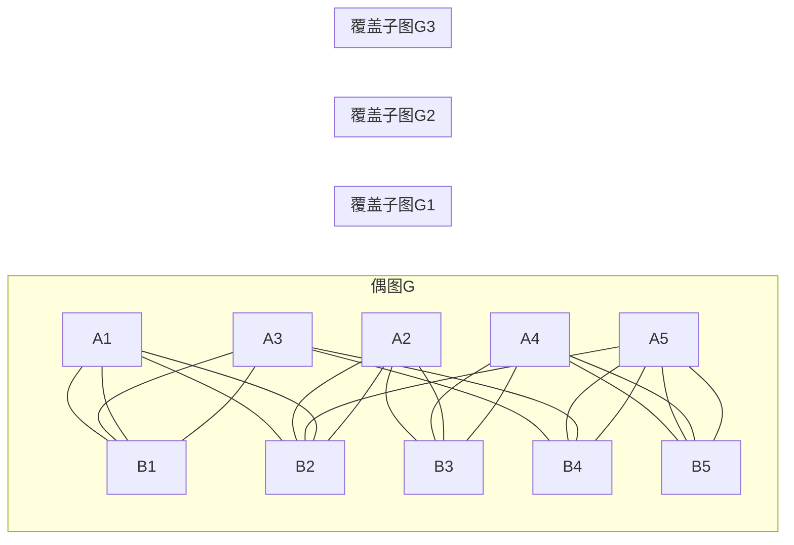

---

---
## 1. 活动安排问题

**问题描述**：从n个活动中选出最大的相容活动子集合，每个活动有开始时间$si$和结束时间$fi$。

**贪心策略**：选择具有最早完成时间的相容活动

$\boxed{
\begin{aligned}
&\text{\textbf{Algorithm ActivitySelector}(s, f)} \\
&\quad \text{\textbf{Input}: } \text{开始时间数组}s, \text{结束时间数组}f \\
&\quad \text{\textbf{Output}: } \text{最大相容活动子集} \\
&\quad \text{\textbf{Procedure}:} \\
&\quad 1.\ \text{按}f\text{非减序排序活动} \\
&\quad 2.\ \text{选中活动}1,\ j \leftarrow 1 \\
&\quad 3.\ \mathbf{for}\ i \leftarrow 2\ \mathbf{to}\ n: \\
&\quad \quad \mathbf{if}\ s[i] \geq f[j]: \\
&\quad \quad \quad \text{选中活动}i,\ j \leftarrow i \\
&\quad 4.\ \mathbf{return}\ \text{选中活动集合} \\
&\quad \mathbf{end\ procedure}
\end{aligned}
}$

**复杂度**：$O(nlogn)$

## 2. 机器调度问题

**问题描述**：将n个任务分配给尽可能少的机器，同一时间一台机器只能执行一个任务。

**贪心策略**：按任务起始时间排序，尽可能使用旧的机器

**伪代码**：

$\boxed{
\begin{aligned}
&\text{\textbf{Algorithm MachineScheduling}(s, f, m)} \\
&\quad \text{\textbf{Input}: } \text{开始时间数组}s, \text{结束时间数组}f, \text{机器数}m \\
&\quad \text{\textbf{Output}: } \text{任务分配方案} \\
&\quad \text{\textbf{Procedure}:} \\
&\quad 1.\ \text{按}s\text{升序排序任务} \\
&\quad 2.\ \text{初始化最小堆}Q \text{存储机器可用时间} \\
&\quad 3.\ \mathbf{for}\ i \leftarrow 1\ \mathbf{to}\ n: \\
&\quad \quad \mathbf{if}\ Q\text{非空且堆顶}\leq s[i]: \\
&\quad \quad \quad \text{复用该机器},\ \text{更新其可用时间为}f[i] \\
&\quad \quad \mathbf{else}: \\
&\quad \quad \quad \text{分配新机器},\ \text{可用时间设为}f[i] \\
&\quad 4.\ \mathbf{return}\ \text{分配方案及使用机器数} \\
&\quad \mathbf{end\ procedure}
\end{aligned}
}$

**复杂度**：$O(nlogn)$

## 3. 货箱装船问题

**问题描述**：将n个集装箱装入容量为c的船，使装入的集装箱数目最多。

**贪心策略**：选择重量最小的集装箱优先装入

**伪代码**：

$\boxed{
\begin{aligned}
&\text{\textbf{Algorithm ContainerLoading}(w, c)} \\
&\quad \text{\textbf{Input}: } \text{重量数组}w, \text{容量}c \\
&\quad \text{\textbf{Output}: } \text{装载方案} \\
&\quad \text{\textbf{Procedure}:} \\
&\quad 1.\ \text{按}w\text{升序排序集装箱} \\
&\quad 2.\ \text{总重量} \leftarrow 0,\ \text{装载数} \leftarrow 0 \\
&\quad 3.\ \mathbf{for}\ i \leftarrow 1\ \mathbf{to}\ n: \\
&\quad \quad \mathbf{if}\ \text{总重量} + w[i] \leq c: \\
&\quad \quad \quad \text{装载集装箱}i \\
&\quad \quad \quad \text{总重量} \leftarrow \text{总重量} + w[i] \\
&\quad \quad \mathbf{else}: \\
&\quad \quad \quad \mathbf{break} \\
&\quad 4.\ \mathbf{return}\ \text{装载方案} \\
&\quad \mathbf{end\ procedure}
\end{aligned}
}$

**复杂度**：$O(nlogn)$（重量升序排序时间）

## 4. 0/1背包问题

**问题描述**：n件物品，重量wi，价值pi，背包容量c，选择物品使总价值最大。

**贪心策略**（三种）：

1. 选择价值最大的物品
2. 选择重量最小的物品
3. 选择密度(pi/wi)最大的物品

**密度贪心算法伪代码**：

$\boxed{
\begin{aligned}
&\text{\textbf{Algorithm Knapsack01}(w, p, c)} \\
&\quad \text{\textbf{Input}: } \text{重量数组}w, \text{价值数组}p, \text{容量}c \\
&\quad \text{\textbf{Output}: } \text{最大价值及选中物品} \\
&\quad \text{\textbf{Procedure}:} \\
&\quad 1.\ \text{按价值密度降序排序物品} \quad \textcolor{gray}{// \frac{p_i}{w_i}} \\
&\quad 2.\ \text{当前重量} \leftarrow 0,\ \text{当前价值} \leftarrow 0 \\
&\quad 3.\ \mathbf{for}\ i \leftarrow 1\ \mathbf{to}\ n: \\
&\quad \quad \mathbf{if}\ \text{当前重量} + w[i] \leq c: \\
&\quad \quad \quad \text{选中物品}i \\
&\quad \quad \quad \text{更新当前重量和价值} \\
&\quad \quad \mathbf{else}: \\
&\quad \quad \quad \text{跳过物品}i \\
&\quad 4.\ \mathbf{return}\ \text{总价值和选中方案} \\
&\quad \mathbf{end\ procedure}
\end{aligned}
}$

**k-优化贪心算法伪代码**：

$\boxed{
\begin{aligned}
&\text{\textbf{Algorithm K-Optimization}(w, p, c, k)} \\
&\quad \text{\textbf{Input}: } \text{参数同基础版}, \text{优化深度}k \\
&\quad \text{\textbf{Procedure}:} \\
&\quad 1.\ \text{枚举所有大小}\leq k\ \text{的物品子集}S \\
&\quad 2.\ \mathbf{for\ each}\ S: \\
&\quad \quad \text{强制装入}S,\ \text{剩余容量用贪心法填充} \\
&\quad 3.\ \mathbf{return}\ \text{所有子集中最优解} \\
&\quad \mathbf{end\ procedure}
\end{aligned}
}$

k-优化可以保证误差不大于$（1/k+1）*100%$%

## 5. 哈夫曼编码问题

**问题描述**：为字符设计二进制编码，使出现频率高的字符编码短，频率低的编码长。

**贪心策略**：合并频率最低的两个节点

**伪代码**：

$\boxed{
\begin{aligned}
&\text{\textbf{Algorithm HuffmanCoding}(C)} \\
&\quad \text{\textbf{Input}: } \text{字符频率集合}C \\
&\quad \text{\textbf{Output}: } \text{最优前缀码树} \\
&\quad \text{\textbf{Procedure}:} \\
&\quad 1.\ \text{初始化最小堆}Q \text{包含所有字符节点} \\
&\quad 2.\ \mathbf{while}\ |Q| > 1: //Q=1代表也就是说所有节点们已经排到二叉树上的叶子节点了\\
&\quad \quad x \leftarrow \text{Extract-Min}(Q) \\
&\quad \quad y \leftarrow \text{Extract-Min}(Q) \\
&\quad \quad \text{创建新节点}z \text{（频率}=x.freq+y.freq\text{）} \\
&\quad \quad \text{Insert}(Q, z) \\
&\quad 3.\ \mathbf{return}\ \text{剩余节点} \\
&\quad \mathbf{end\ procedure}
\end{aligned}
}$

**复杂度**：$O(nlogn)$

## 6. 最短路径问题

### Dijkstra算法

**问题描述**：求有向图中源节点到所有其他节点的最短路径

**贪心策略**：每次选择距离源节点最近的未处理节点

**伪代码**：

$\boxed{
\begin{aligned}
&\text{\textbf{Algorithm Dijkstra}(G, s)} \\
&\quad \text{\textbf{Input}: } \text{图}G, \text{源节点}s \\
&\quad \text{\textbf{Output}: } \text{最短路径距离} \\
&\quad \text{\textbf{Procedure}:} \\
&\quad 1.\ \text{初始化距离数组}d,\ d[s] \leftarrow 0 \\
&\quad 2.\ \text{优先队列}Q \leftarrow \text{所有节点} \\
&\quad 3.\ \mathbf{while}\ Q \neq \emptyset: \\
&\quad \quad u \leftarrow \text{Extract-Min}(Q) \\
&\quad \quad \mathbf{for}\ \text{邻节点}v: \\
&\quad \quad \quad \text{松弛操作: } d[v] \leftarrow \min(d[v], d[u]+w(u,v)) \\
&\quad 4.\ \mathbf{return}\ d \\
&\quad \mathbf{end\ procedure}
\end{aligned}
}$

**复杂度**：$O(E+VlogV)$（使用斐波那契堆）

## 7. 最小生成树问题

### Kruskal算法

**贪心策略**：选择不形成环的最小权值边

**伪代码**：

$\boxed{
\begin{aligned}
&\text{\textbf{Algorithm KruskalMST}(G)} \\
&\quad \text{\textbf{Input}: } \text{图}G \\
&\quad \text{\textbf{Output}: } \text{最小生成树} \\
&\quad \text{\textbf{Procedure}:} \\
&\quad 1.\ \text{初始化并查集},\ \text{边集按权值排序} \\
&\quad 2.\ \mathbf{for}\ \text{每条边}(u,v): \\
&\quad \quad \mathbf{if}\ \text{Find}(u) \neq \text{Find}(v): \\
&\quad \quad \quad \text{Union}(u,v) \\
&\quad \quad \quad \text{加入生成树} \\
&\quad 3.\ \mathbf{return}\ \text{生成树} \\
&\quad \mathbf{end\ procedure}
\end{aligned}
}$

**复杂度**：$O(ElogE)$

### Prim算法

**贪心策略**：逐步扩展树，选择连接树与非树节点的最小权值边

**伪代码**：

$\boxed{
\begin{aligned}
&\text{\textbf{Algorithm PrimMST}(G)} \\
&\quad \text{\textbf{Input}: } \text{连通图}G \\
&\quad \text{\textbf{Output}: } \text{最小生成树} \\
&\quad \text{\textbf{Procedure}:} \\
&\quad 1.\ \text{任选起始节点},\ \text{初始化优先队列}Q \\
&\quad 2.\ \mathbf{while}\ Q \neq \emptyset: \\
&\quad \quad u \leftarrow \text{Extract-Min}(Q) \\
&\quad \quad \mathbf{for}\ \text{邻节点}v: \\
&\quad \quad \quad \mathbf{if}\ v \in Q \wedge w(u,v) < key[v]: \\
&\quad \quad \quad \quad key[v] \leftarrow w(u,v) \\
&\quad \quad \quad \quad \pi[v] \leftarrow u \\
&\quad 3.\ \mathbf{return}\ \text{生成树} \\
&\quad \mathbf{end\ procedure}
\end{aligned}
}$

**复杂度**：$O(E+VlogV)$（使用斐波那契堆）

## 8. 偶图覆盖问题

**问题描述**：在偶图中寻找A的最小子集A'覆盖B的所有顶点

**贪心策略**：选择覆盖最多未覆盖B顶点的A节点

**伪代码**：

$\boxed{
\begin{aligned}
&\text{\textbf{Algorithm BipartiteCover}(G)} \\
&\quad \text{\textbf{Input}: } \text{偶图}G=(A \cup B, E) \\
&\quad \text{\textbf{Output}: } \text{最小覆盖集}A' \\
&\quad \text{\textbf{Procedure}:} \\
&\quad 1.\ A' \leftarrow \emptyset,\ \text{未覆盖节点集}U \leftarrow B \\
&\quad 2.\ \mathbf{while}\ U \neq \emptyset: \\
&\quad \quad \text{选择}A\text{中覆盖}U\text{最多还未被覆盖到的节点的顶点}a^* \quad \textcolor{gray}{// 贪心选择} \\
&\quad \quad A' \leftarrow A' \cup \{a^\} \\
&\quad \quad U \leftarrow U \setminus \text{Neighbors}(a^) \\
&\quad 3.\ \mathbf{return}\ A' \\
&\quad \mathbf{end\ procedure}
\end{aligned}
}$

**复杂度**：$O(n²)或O(n+e)$（取决于实现）