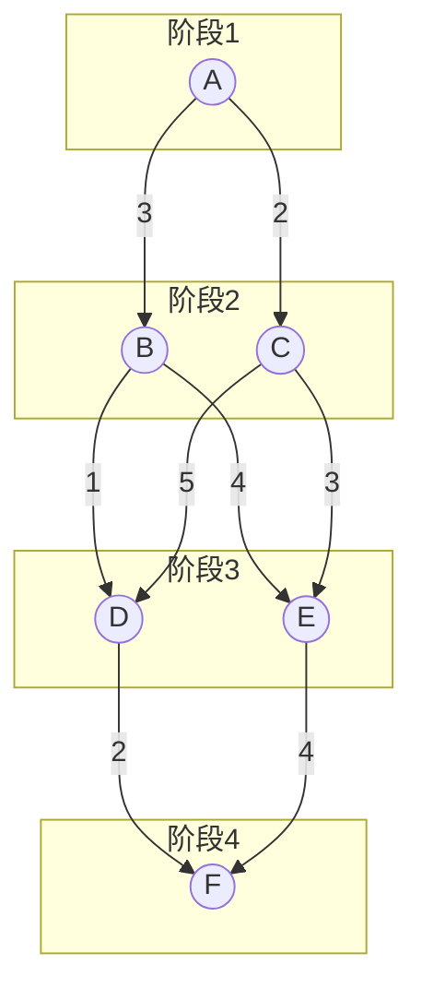

---

---

## 一句话：倒推，逆序计算，回溯

### 算法步骤

1. **初始化**：终点 ( e ) 的最短距离 $c(e) = 0$。
2. **逆序计算**：从倒数第二阶段开始，逐阶段向前计算每个节点到终点的最短距离。
    - 对于节点 ( i )，遍历其所有邻接节点 $( j \in N(i) )$。
    - 计算 $( c(i) = \min { c(j) + \text{cost}(i,j) } )$。
3. **回溯路径**：从起点出发，选择每一步中使 ( c(i) ) 最小的邻接节点，直至终点。

### 伪代码

$\boxed{
\begin{aligned}
&\text{\textbf{Algorithm MultiStageGraph}(G, k, S)} \\
&\quad \text{\textbf{Input}: } \\
&\quad \quad \bullet\ \text{图}G=(V,E)\ \text{含边权}cost(u,v) \\
&\quad \quad \bullet\ \text{阶段数}k,\ \text{阶段划分数组}S[1..k] \\
&\quad \text{\textbf{Output}: } \\
&\quad \quad \bullet\ \text{最短路径长度} \\
&\quad \quad \bullet\ \text{路径节点序列} \\
&\quad \text{\textbf{Procedure}:} \\
&\quad 1.\ \text{初始化距离数组}c[|V|],\ \text{路径数组}path[|V|] \\
&\quad 2.\ c[e] \leftarrow 0 \quad \textcolor{gray}{// 终点}e\in S[k]\text{距离为0} \\
&\quad 3.\ \mathbf{for}\ i \leftarrow k-1\ \mathbf{downto}\ 1: \quad \textcolor{gray}{// 逆序处理阶段} \\
&\quad \quad \mathbf{for\ each}\ u \in S[i]: \\
&\quad \quad \quad \mathbf{for\ each}\ v \in N(u) \cap S[i+1]: \quad \textcolor{gray}{// 下一阶段邻居} \\
&\quad \quad \quad \quad \mathbf{if}\ c[u] > c[v] + cost(u,v): \\
&\quad \quad \quad \quad \quad c[u] \leftarrow c[v] + cost(u,v) \\
&\quad \quad \quad \quad \quad path[u] \leftarrow v \quad \textcolor{gray}{// 记录前驱节点} \\
&\quad 4.\ \text{构造路径}: \\
&\quad \quad current \leftarrow s \quad \textcolor{gray}{// 起点}s\in S[1] \\
&\quad \quad resultPath \leftarrow [current] \\
&\quad \quad \mathbf{while}\ current \neq e: \\
&\quad \quad \quad current \leftarrow path[current] \\
&\quad \quad \quad resultPath.append(current) \\
&\quad 5.\ \mathbf{return}\ (c[s], resultPath) \\
&\quad \mathbf{end\ procedure}
\end{aligned}
}$

---

### 例题：多段图的最短路径问题

### 问题描述

考虑一个4阶段的多段图，结构如下：

- **阶段1**：节点A。
- **阶段2**：节点B、C。
- **阶段3**：节点D、E。
- **阶段4**：节点F。

边权值：

- A→B (3)，A→C (2)
- B→D (1)，B→E (4)
- C→D (5)，C→E (3)
- D→F (2)，E→F (4)

求从A到F的最短路径及长度。

### 解答步骤

4. **逆序计算最短距离**：
    - 初始化：( c(F) = 0 )。
    - **阶段3**：
        - ( c(D) = c(F) + 2 = 2 )。
        - ( c(E) = c(F) + 4 = 4 )。
    - **阶段2**：
        - B的邻接节点为D和E：
( $c(B) = \min { c(D) + 1, c(E) + 4 } = \min { 3, 8 } = 3$ )（选择D）。
        - C的邻接节点为D和E：
( $c(C) = \min { c(D) + 5, c(E) + 3 } = \min { 7, 7 } = 7$)（选择D或E）。
5. **回溯路径**：
    - **阶段1**：
        - A的邻接节点为B和C：
( $c(A) = \min { c(B) + 3, c(C) + 2 } = \min { 6, 9 } = 6$)（选择B）。
    - A → B → D → F。

**答案**：最短路径长度为6，路径为A→B→D→F。

---

### 关键点总结

- 动态规划通过分解问题、存储子问题解来高效求解复杂问题。
- 多段图问题中，逆序计算和路径回溯是核心步骤。
- 例题展示了如何逐步计算每个节点的最短距离，并最终构造最优路径。

---