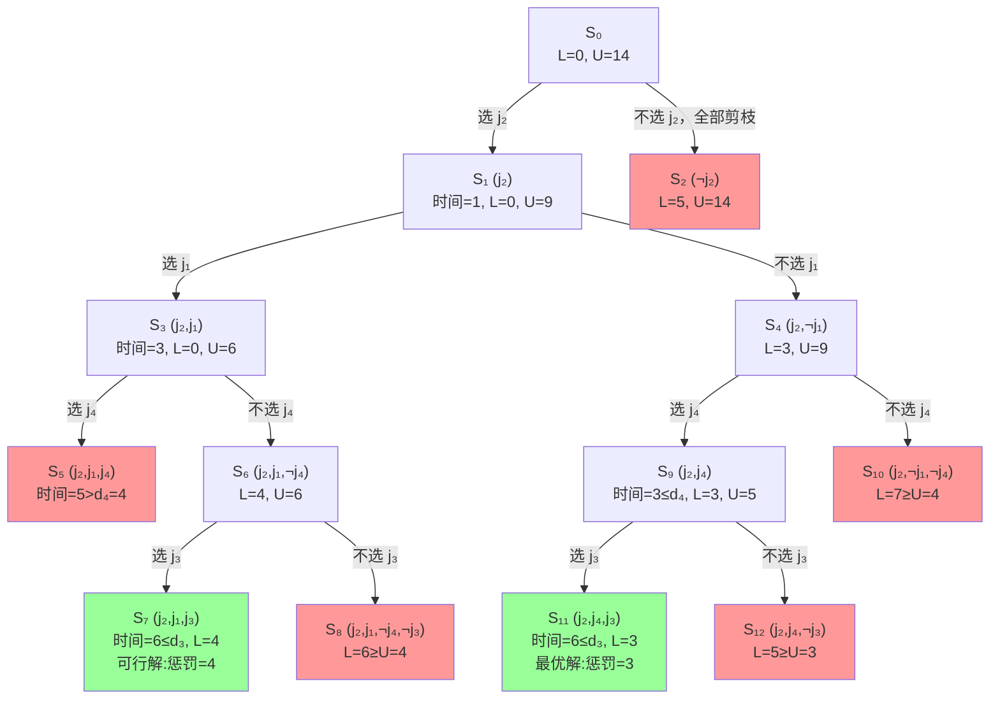

---

---
# 一、 问题概要

带罚款的作业调度问题要求在满足作业截止时间的前提下，最小化未按时完成作业的罚款总和。每个作业 (i) 由以下参数描述：

- **处理时间**$(t_i)$：完成作业所需时间
- **截止时间** $(d_i)$：作业必须在此时间前完成
- **罚款金额**$(p_i)$：若作业未按时完成需支付的罚款

**目标函数**：

$\text{最小化总罚款} = \sum_{i=1}^n p_i \cdot \delta_i$
其中$\delta_i = 1$表示作业 i 超期，否则为0。

---

# 二、分支限界法解决步骤

### 1. **解空间建模**

- **排列树结构**：每个节点表示作业的调度顺序，分支对应选择下一个执行的作业，构成排列树。
- **根节点**：未安排任何作业的状态，所有作业均为候选。
- **叶节点**：完整的作业排列，对应一个可行调度方案。

### 2. **分支策略**

- **广度优先扩展**：从活结点表中选择扩展节点，生成子节点（即选择下一个作业）。
- **优先级队列**：按节点的下界（当前最小可能罚款）排序，优先扩展更优的分支。

### 3. **界限计算与剪枝**

- **下界（LB）**：
当前路径的已知罚款 + 剩余作业的最小可能罚款（假设剩余作业按最优顺序调度）。
$LB = \text{已安排罚款} + \sum_{未安排作业} p_j \cdot \text{最坏情况超期概率}$
- **上界（UB）**：
当前最优解的罚款值，初始设为极大值。若某节点的下界 ≥ 当前UB，则剪枝。

### 4. **可行性检查**

- **时间约束验证**：计算当前调度下各作业的完成时间 $C_i$，若 $C_i > d_i$ 则计入罚款。
- **资源约束**：单机场景需保证作业顺序不冲突即可。

---

# 三、关键的约束

**1 单处理器:** 任意时刻只能处理一个作业
**2 截止时间合规**: 若作业$𝑗_𝑖$被调度，其开始时间$𝑠_𝑖$必须满足
$s_𝑖 +𝑡_𝑖 ≤ 𝑑_𝑖$,也就是说你分配的任务必须要在ddl之前干完，否则这段时间将没有任何意义（必须要交罚款）
**3 非抢占**: 作业一旦开始不能中断

形式化后是这样的：

目标：在处理器上调度作业子集J以最小化

$\sum_{i}^{n} p_{i} *\left(1-x_{i}\right)$

约束条件：

1. $x_{i}=1$ 当且仅当 $j_{i}\in J$，否则 $x_{i}=0$
2. 每个被调度作业 $j_{i}$ 必须连续处理 $t_{i}$ 时间单位，并在截止时间前完成
3. $\sum_{i}^{n} t_{i} * x_{i} \leq d_{k}$（$\forall k=1,2,...,n$ 且 $d_{1} \leq d_{2} \leq...\leq d_{n}$）

（注：内容已完全按照图片中的数学公式和文本格式转为纯文本，保留原排版逻辑和符号规范。）

---

# 四 、 实操解题

### **1. 分支（Branching）**

- **目标**：将当前解空间 $S_i$ 划分为两个子解空间：
    - $S_i^0$：强制 $x_{i+1}=0$（不选第 i+1 个作业）。
    - $S_i^1$：强制 $x_{i+1}=1$（选第 i+1 个作业）。
- **逻辑**：通过递归划分，枚举所有可能的解空间。

---

### **2. 估计子解空间的上下界（Bounding）**

- **下界 L(i+1)**：当前已确定部分（前 $i+1$ 个作业）的惩罚和：
$L(i+1) = \sum_{j=1}^{i+1} (1-x_j) \cdot p_j$
    - 表示已选作业的惩罚（未选作业的 $p_j$ 累加）。
- **上界 U(i+1)**：最坏情况下（剩余作业全不选）的惩罚和：
$U(i+1) = L(i+1) + \sum_{j=i+2}^n p_j$
    - 下界 + 剩余所有未处理作业的惩罚。

---

### **3. 限界（Pruning）**

对每个子解空间进行剪枝优化：

4. **可行性检查**：
    - 检查当前解是否满足约束（如时间限制 $\sum t_i x_i \leq d_k$）。
    - **不满足则剪枝**（丢弃该分支）。
5. **下界比较**：
    - 如果当前子解空间的下界 $L(i+1)$ **大于**全局上界 U，说明该分支不可能更优，直接剪枝。
6. **更新全局上界**：
    - 用当前子解空间的上界 $U(i+1)$ 更新全局上界 U，保持其为**最小可能的上界**

---

### **解题步骤示例**

假设问题是“选择作业子集以最小化未选作业的惩罚”，具体步骤如下：

7. **初始化**：根节点 $S_0$，全局上界 $U = +\infty$。
8. **分支**：对每个节点 i，生成 $x_{i+1}=0$ 和 $x_{i+1}=1$ 的子节点。
9. **计算上下界**：
    - 对 $S_i^0$，计算 $L(i+1)$ 和 $U(i+1)$（未选 $j_{i+1}$ 时）。
    - 对 $S_i^1$，检查时间约束是否满足，再计算上下界。
10. **剪枝**：丢弃不可行或劣于当前最优解的分支。
11. **终止**：当所有分支处理完毕，全局上界 $U$ 对应的解即为最优解。

| 方法 | 优点 | 缺点 | 适用场景 |
| --- | --- | --- | --- |
| **分支限界法** | 保证最优解，剪枝减少搜索空间 | 时间复杂度高，内存消耗大 | 小规模精确求解 |
| **模拟退火** | 适合大规模问题，避免局部最优 | 结果不保证最优，参数调优复杂 | 近似解**快速**生成 |
| **强化学习** | 自适应动态环境，在线学习 | 需要大量训练数据，收敛速度慢 | 复杂实时调度 |

---

# 五、结论

活动节点存储在最小堆中
按最早截止时间优先（EDF）顺序选择作业

这个算法的时间复杂度和之前推测是一样的：理论$O(2^n)$,实际上会因为剪枝明显减小。

# 六、来做个题

### **问题描述**

现在每个作业 $j_i$ 有自己的**截止时间 **$d_i$，且必须在其截止时间前**完成**。其他条件不变：

| 作业 | 处理时间 `t_i` | 截止时间 `d_i` | 惩罚值 `p_i` |
| --- | --- | --- | --- |
| `j_1` | 2 | 3 | 3 |
| `j_2` | 1 | 2 | 5 |
| `j_3` | 3 | 6 | 2 |
| `j_4` | 2 | 4 | 4 |

**目标**：选择作业子集 $J \subseteq \{j_1,j_2,j_3,j_4\}$，使得：

12. **所有被选作业必须在截止时间前完成**（单线程，按顺序执行）。
13. **最优值函数：最小化未选作业的惩罚和** $\sum (1-x_i)p_i$。

---

由于截止时间不同，**作业顺序影响可行性**。我们按**最早截止时间**（EDF规则）排序：

$j_2 (d_2=2) \to j_1 (d_1=3) \to j_4 (d_4=4) \to j_3 (d_3=6)$

对每个节点 $S_i$，检查：

- 如果选择 $j_{i+1}$，其完成时间 $C_{i+1} = \text{当前时间} + t_{i+1}$ 是否 $\leq d_{i+1}$。
- 如果不选 $j_{i+1}$，直接累积惩罚 $p_{i+1}$。
- **时间约束剪枝**：若 $C_{i+1} > d_{i+1}$，则不能选 $j_{i+1}$。
- **下界剪枝**：若当前未选惩罚和 $\geq$ 已知最优解，剪枝。

---

### **初始状态**

- **已选作业**：无
- **当前时间**：0
- **下界 L = 0**，**上界 **$U = 3+5+2+4=14$

### **分支过程**（按 $j_2 \to j_1 \to j_4 \to j_3$ 顺序）

### **节点 1：选择 **$j_2$**（**$x_2=1$**）**

- **完成时间**：0 + 1 = 1 $\leq$$d_2$=2 ✔
- **当前时间**：1
- **下界 **$L = 0$（已选 $j_2$），**上界 **$U = 0 + (3+2+4) = 9$

**子分支**：

14. ==**选择 **==$j_1$==：==
    - 完成时间 $1 + 2 = 3 \leq d_1=3$ ✔
    - 当前时间：3
    - 下界 L = 0，上界 $U = 0 + (2+4) = 6$
    - **继续分支**：
        - 选择 $j_4$：完成时间 $3 + 2 = 5 > d_4=4$ ✖（剪枝）
        - 不选 $j_4$：惩罚 +4，下界 L = 4，上界 U = 4 + 2 = 6
            - 选择 $j_3$：完成时间 $3 + 3 = 6 \leq d_3=6$ ✔
                - **解**：$\{j_2,j_1,j_3\}$，惩罚 =4（未选 $j_4$）
            - 不选 $j_3$：惩罚 +2，总惩罚 6（劣于当前解，剪枝）
15. ==**不选 **==$j_1$==：==
    - 惩罚 +3，下界 L = 3，上界 已经变为选择j1分支的最优解4。
    - **继续分支**：
        - 选择 $j_4$：完成时间 $1 + 2 = 3 \leq d_4=4$ ✔
            - 当前时间：3
            - 下界 L = 3，上界 U = 3 + 2 = 5
            - 选择 $j_3$：完成时间 $3 + 3 = 6 \leq d_3=6$ ✔
                - **解**：$\{j_2,j_4,j_3\}$，惩罚 =3（未选 $j_1$）
            - 不选 $j_3$：惩罚 +2，总惩罚 5 >7剪枝。
        - 不选 $j_4$：惩罚 +4，总惩罚 7>4（剪枝）

### **节点 2：不选择 **$j_2$**（惩罚立刻加5，超过上界3，全部剪枝）。**

来看看状态图吧，是不是很清楚：

---

### **答案：最优解**

- **最佳选择**：$\{j_2, j_4, j_3\}$
    - **执行顺序**：$j_2$（时间 0→1）→ $j_4$（1→3）→ $j_3$（3→6）
    - **未选作业**：$j_1$，惩罚 =3