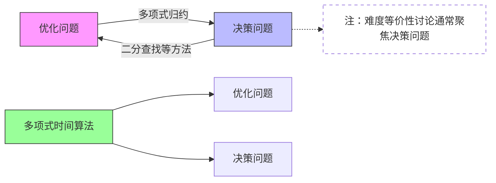

---

---
### 1. 决策问题与优化问题

- **抽象问题 Q**：定义为问题实例空间 I 和问题解空间 S 上的二元关系。
- **决策问题 (Decision Problem)**：
    - 解空间只含有两个元素 {yes, no}。
    - 例如：判断图中两点之间是否存在长度不超过k的路径。
- **优化问题 (Optimization Problem)**：
    - 要求在所有可行解里找出使得目标函数最大或最小的解。
    - 例如：找出图中两点之间的最短路径。
- **关系**：
    - **任何优化问题都可以转化为相应的决策问题。**
        - 0/1背包优化问题 → 决策问题：给定效益值b，是否存在装箱方案s使得p(s)>b?
        - TSP优化问题 → 决策问题：给定数值b，是否存在哈密顿回路l使得path(l)≤b?
    - 如果求解优化问题的复杂性是多项式界，那么求解相应决策问题的复杂性也一定是多项式界。
    - 反之，如果求解决策问题的复杂性是多项式界，对于最大/最小优化问题，可以通过二分查找等方法在多项式时间内求解其优化问题。
    - 因此，在难度等价性讨论中，通常只关注决策问题。

---

### 2. 输入实例的长度（有别于实例特征）

- **定义**：算法的输入长度通常指输入实例的二进制编码长度。
- **重要性**：算法复杂性应基于输入实例的编码长度来衡量，而非输入数值的大小或问题特征（如顶点数n）。
- **伪多项式时间 (Pseudo-polynomial time)**：
    - 如果一个算法的时间复杂度是输入数值大小（而不是其编码长度）的多项式函数，则称其为伪多项式时间算法。
    - **例1：0/1背包问题**
        - 动态规划算法复杂度 $T = Θ(nC)$ (C是背包容量)。
        - 输入实例长度 $m = log₂(n) + log₂(C) + Σlog₂(pᵢ) + Σlog₂(wᵢ)$。
        - 若 pᵢ, wᵢ = O(C)，则 $m = Θ(n log₂C$)。
        - 此时$T = Θ(nC) = Θ(n * 2^(log₂C))$。如果 C 相对于 n 很大 (例如 C = 2ⁿ)，则 T 是关于 m 的指数函数。
    - **例2：合数问题** (判断n是否为合数)
        - 穷举因子算法 T(n) = Θ(n) (或 Θ(√n))。
        - 输入实例长度 m = log₂n。
        - T(n) = Θ(2^m)，是指数级的。
    - **例3：快速排序**
        - 平均时间复杂度 $T(n) = Θ(n log n)$ (n是元素个数)。
        - 输入实例长度 $m = log n + Σlog aᵢ$。若元素大小有界，m = Θ(n)。
        - T(n) = Θ(m log m)，是关于输入长度的多项式，因此不是伪多项式。

---

### 3. 非确定性算法 (Non-deterministic Algorithm)

- **定义**：算法在执行过程中，对于相同的输入实例，在某些点上可能存在多个可选择的后续动作，从而可能表现出不同的行为并导致不同的运行结果。
- **与确定性算法的区别**：确定性算法的每一步都是唯一确定的。
- **非确定性算法的两个主要阶段**：
    1. **猜测阶段 (Guessing Stage)**：以某种非确定的方式产生一个“证书” (certificate) c。这个证书可以看作是问题的一个潜在解或解的一部分。
    2. **验证阶段 (Checking Stage)**：用一个确定性的算法验证证书 c 对于输入实例 w 是否有效。
        - 如果 c 是问题的一个有效解 (例如，对于决策问题，c 使得答案为 "yes")，则算法输出 "yes" 并成功停机。
        - 否则，**算法失败** (注意，不是输出 "no")。

$\text{判断问题"是否存在解"}:
\begin{cases}
\text{确定性算法}: \text{必须遍历所有可能性，明确找到解或证明无解} \\
\text{非确定性算法}: \text{只要存在一个解能被验证，就算成功}
\end{cases}$

> [!note] 🃏
> 
> > *非确定性算法就像是一个“幸运猜谜者”：
> • 先蒙一个答案（猜测阶段），然后快速验证对错（验证阶段）。
> • 如果能验证通过，就说明问题有解；如果验证失败，就“****假装没发生过****”（不直接说“无解”）。*

- **复杂性**：非确定性算法的复杂性通常指**验证阶段所需的时间**。

---

### 小结：导致问题难解的因素

- **问题类型**：决策问题与优化问题的内在联系。
- **输入表示**：输入实例的编码长度对复杂性度量的影响，区分多项式与伪多项式。
- **计算模型**：非确定性算法提供了一种理论工具来定义NP类问题。

---
