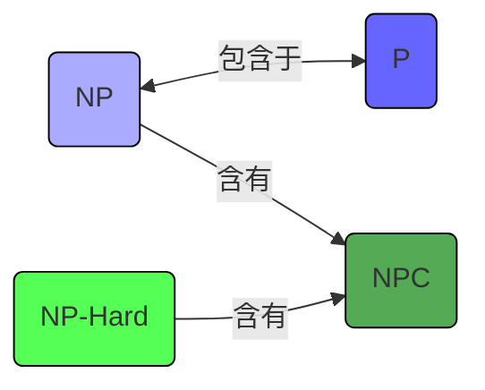

---

---
### 1. P类问题 (Class P)

- **定义 (Class P)**：P类问题是所有可以由一个**确定性图灵机 (Deterministic Turing Machine)** 在**多项式时间**内解决的**决策问题**的集合。
- **通俗理解**：存在多项式时间求解算法的决策问题集合。
- **特性**：P类问题对于多项式时间的加法、乘法及复合运算是**封闭的，所以才能在多项式时间内求解。**
- **例子**：排序、最短路径、矩阵乘法、素数检验（AKS算法后）。

---

### 2. NP类问题 (Class NP)

- **定义 (Class NP - Non-deterministic Polynomial time)**：NP类问题是所有可以由一个**非确定性图灵机 (Non-deterministic Turing Machine)** 在**多项式时间**内解决的**决策问题**的集合。
- **等价定义 (基于验证器)**：一个决策问题 Q 属于 NP 类，如果对于 Q 的任何一个答案为 "yes" 的实例 w，存在一个“证书” c，使得一个确定性图灵机（称为验证器 V）可以在关于 |w| 的多项式时间内**验证** V(w, c) 是否为 "yes"。证书 c 的长度也必须是关于 |w| 的多项式。
    - 如果 w 的答案是 "no"，则不存在任何证书 c 能使 V(w, c) 为 "yes"。
- **说明**：
    - P类问题是NP类问题的子集 (P ⊆ NP)。因为如果一个问题可以在多项式时间内解决，那么它也可以在多项式时间内验证（证书可以是空的，验证器直接解决问题）。
    - NP类问题包含了许多目前没有已知多项式时间解法的“难”问题。
- **例子**：0/1背包问题（决策版）、旅行商问题（决策版）、子图同构问题、布尔可满足性问题 (SAT)。

### 多项式规约 (Polynomial Reduction)

- **定义**：问题 X 可以多项式地规约到问题 Y (记作 X ≤ₚ Y)，当且仅当存在一个确定性算法 T，它能在多项式时间内完成以下操作：
    1. 对于 X 的每个实例 x，算法 T 生成问题 Y 的一个实例 T(x)。
    2. x 是 X 的一个 "yes" 实例当且仅当 T(x) 是 Y 的一个 "yes" 实例。
- **意义**：X ≤ₚ Y 意味着 X “不比” Y 更难，也就是
*X最多也就和Y一样“难”，但要是Y也非常难那我也没办法。*
- 如果 Y 有一个多项式时间算法，那么 X 也有（通过先转换再求解）。
- **定理**：如果 X ≤ₚ Y 且 Y ∈ P，则 X ∈ P。
*即如果 X ≤ₚ Y ,如果Y是P的那么X也是P的*

---

### 3. NP-Complete (NPC) 问题

- **NP-hard 问题**：
    - **定义**：一个问题 Q 是 NP-hard 的，如果所有 NP 类中的问题都可以多项式地规约到 Q (即 ∀X ∈ NP, X ≤ₚ Q)。
    - **意义**：NP-hard 问题至少与 NP 类中最难的问题一样难。如果能找到一个 NP-hard 问题的多项式时间算法，那么所有 NP 问题都能在多项式时间内解决。
    - NP-hard 问题不一定是 NP 问题（例如，停机问题是 NP-hard 的，但它不是决策问题，也不是 NP 问题）。
- **NP-Complete (NPC) 问题**：
    - **定义**：一个问题 Q 是 NP-Complete (NPC) 的，如果满足以下两个条件：
        1. Q ∈ NP (Q 本身是一个 NP 问题)。
        2. Q 是 NP-hard (所有 NP 问题都可以多项式规约到 Q)。
    - **意义**：NPC 问题是 NP 类中最难的问题。它们在计算复杂性上是等价的（任何一个 NPC 问题都可以在多项式时间内规约到另一个 NPC 问题）。
    - **证明一个新问题是NPC的步骤**：
        1. 证明该问题属于 NP 类。
        2. 选择一个已知的 NPC 问题，并证明它可以多项式地规约到该新问题。
- **P 与 NP 问题**：
    - 计算理论中最重要的未解问题之一是 P 是否等于 NP (P = NP?)。
    - 如果 P = NP，则所有 NP 问题（包括所有 NPC 问题）都可以在多项式时间内解决。目前普遍认为 P ≠ NP。
    - 如果任何一个 NPC 问题被证明存在多项式时间算法，则 P = NP。
    - 如果任何一个 NPC 问题被证明不存在多项式时间算法，则 P ≠ NP。
- **典型NPC问题列表**：
    - 布尔可满足性问题 (SAT, 3-SAT)
    - N-puzzle
    - 背包问题 (决策版)
    - 哈密顿路径/回路问题
    - 旅行商问题 (决策版)
    - 子图同构问题
    - 子集和问题
    - 团问题 (Clique problem)
    - 顶点覆盖问题 (Vertex Cover problem)
    - 独立集问题 (Independent Set problem)
    - 图着色问题 (Graph Coloring problem)

---

### 4. P、NP、NPC 和 NP-hard 问题的关系 

(NPC 是 NP 中最难的部分，NP-hard 问题可能在 NP 之外)

**图解说明**：

- **P 类**：多项式时间可解的决策问题。
- **NP 类**：非确定性多项式时间可解的决策问题（或多项式时间可验证的决策问题）。P 是 NP 的子集。
- **NPC 类 (NP完全)**：NP 中“最难”的问题。任何 NP 问题都可以多项式归约到任一 NPC 问题。NPC 是 NP 的子集。
- **NP-Hard 类 (NP难)**：至少和 NPC 问题一样难的问题。NP-Hard 问题不一定在 NP 类中（例如，优化版的 TSP 是 NP-Hard，但不是决策问题，因此不在 NP 中）。所有 NPC 问题都是 NP-Hard 问题。
- 如果 P = NP，则 P、NP、NPC 三个集合会重合。

---

### 小结：问题难度等价性

- **N (Non-deterministic)**：与非确定性算法模型相关。
- **P (Polynomial Time)**：与多项式时间复杂性相关。
- **C (Complete)**：表示在该类问题中“最难”的，所有该类问题都可规约到它。

---

参考阅读：[P、NP、NPC和NP-Hard相关概念的图形和解释_np-hard问题是什么-CSDN博客](https://blog.csdn.net/huang1024rui/article/details/49154507)
