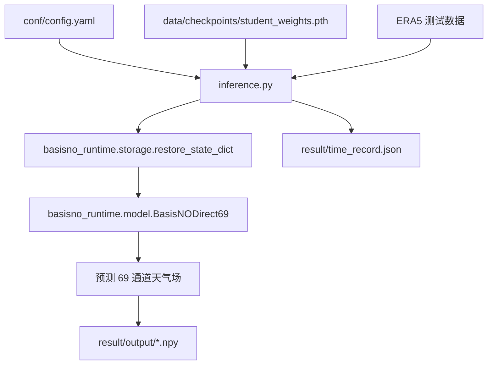

下面先只讲“结构”和“读代码路线”。不假定你有基础。

## 0. 先把它理解成一个“比赛提交包”

`last/` 不是一个普通教学项目，它更像比赛最终提交目录：

```text
last/
├── inference.py                 # 比赛平台真正会跑的推理入口：读测试数据 -> 加载模型 -> 输出预测
├── conf/config.yaml             # 配置：数据路径、通道列表、测试年份、batch_size 等
├── data/
│   ├── download_model_url.txt   # 平台下载权重用的链接/命令
│   └── checkpoints/             # 权重解压后应放这里，核心文件是 student_weights.pth
├── basisno_runtime/             # 推理时需要的模型代码，精简版
│   ├── __init__.py
│   ├── basis.py                 # 固定基函数：纬度/经度低频表示
│   ├── model.py                 # BasisNO 神经网络结构
│   └── storage.py               # 从压缩/量化权重恢复模型参数
├── training_source/             # 训练与实验源码归档，不是平台推理主路径
│   ├── 2026-07-14-basisno-direct69-design.md
│   ├── basis.py
│   ├── model.py
│   ├── evaluate.py
│   ├── make_soup.py
│   ├── quantize_storage.py
│   ├── resource_probe.py
│   └── stamp_basis_state_hash.py
├── train.py                     # 训练脚本/实验脚本，依赖外部训练工具，不建议新手先看
├── result.py                    # 本地评测/画图/统计 RMSE、ACC
├── result/                      # 推理输出与结果文件
│   ├── output/                  # inference.py 保存 .npy 预测结果的位置
│   ├── acc.npy
│   ├── rmse.npy
│   └── loss.png
├── README.md                    # 简短说明
└── open_tju_说明文档.pdf        # 提交说明文档
```

一句话：  
**平台主要跑 `inference.py`；`inference.py` 调用 `basisno_runtime/` 里的模型；模型权重来自 `data/checkpoints/student_weights.pth`；输出写到 `result/output/`。**

---

## 1. 最重要的运行链路

先别看训练。先看推理。



这就是比赛平台关心的主流程。

---

## 2. 从 0 开始：几个基础概念

### 2.1 什么是“推理”

**推理**就是：  
给模型一个当前天气状态，模型输出未来天气预测。

这里的输入是：

```text
当前时刻的 69 个气象变量
shape = [B, 69, 721, 1440]
```

可以粗略理解成：

```text
B      = batch，一次处理几个样本。配置里 batch_size: 1
69     = 69 个气象通道
721    = 纬度方向格点数
1440   = 经度方向格点数
```

输出也是：

```text
未来时刻的 69 个气象变量
shape = [B, 69, 721, 1440]
```

### 2.2 什么是“通道”

`conf/config.yaml` 里有一长串 `channels`。  
每个名字就是一个通道，例如：

```yaml
'mean_sea_level_pressure'
'10m_u_component_of_wind'
'10m_v_component_of_wind'
'2m_temperature'
'geopotential_1000'
...
```

你可以把 69 通道想象成 69 张地图：

```text
第 1 张图：海平面气压
第 2 张图：10 米 U 风
第 3 张图：10 米 V 风
第 4 张图：2 米温度
后面：不同高度层的位势、湿度、温度、风速等
```

每张图大小都是：

```text
721 x 1440
```

### 2.3 什么是“权重”

`student_weights.pth` 是模型学出来的参数。  
代码是结构，权重是参数。

类比：

```text
model.py       = 空机器的设计图
student_weights.pth = 机器里调好的旋钮数值
```

没有权重，模型不能真正预测。

---

## 3. 每个核心文件负责什么

## 3.1 `README.md`

读到的信息：

```text
BasisNO-v2 Direct Absolute69
```

它说明这个模型的基本思想：

- 输入：一个当前的 69 通道 ERA5 状态。
- 输出：一个未来的 69 通道预测。
- 它不是直接调用官方 Pangu 大模型。
- 它是一个学生模型，来自对 Pangu/低分辨率目标的蒸馏。
- 模型规模约 4.154M 参数。
- 推理计时包括：H2D 传输、完整模型、GPU 反归一化、同步。
- 保存 `.npy` 输出不在计时区间里。

这份 README 是“项目摘要”。

---

## 3.2 `conf/config.yaml`

这是配置中心。新手先看这些字段：

### 数据位置

```yaml
stats_dir: "../onedatasets/ERA5_test/stats/"
static_dir: "../onedatasets/ERA5_test/static/"
data_dir: "../onedatasets/ERA5_test/"
```

含义：

```text
stats_dir  = 均值/标准差，用来归一化和反归一化
static_dir = 静态地理数据，比如 land_mask、soil_type、topography
data_dir   = ERA5 测试数据
```

### 测试年份

```yaml
test_ratio: [2050, 2052, 2054, 2056, 2058]
```

比赛平台测试这些年份。

### 输入大小

```yaml
img_size: [721, 1440]
```

即每个气象场是 721x1440 的全球网格。

### batch size

```yaml
batch_size: 1
```

比赛约束里通常不能乱改。

### channels

`channels` 是 69 个变量的顺序。  
这个顺序极其重要。

因为权重文件里也保存了通道顺序，`inference.py` 会检查：

```python
if list(checkpoint["channels"]) != list(channels):
    raise RuntimeError("Checkpoint/config channel ordering mismatch")
```

意思是：  
**配置里的通道顺序必须和训练权重里的通道顺序完全一致。**

---

## 3.3 `data/download_model_url.txt`

内容是：

```bash
curl -fL --retry 8 --retry-delay 2 --connect-timeout 30 -o checkpoints.zip https://...
```

作用：比赛平台根据这个下载权重包。

推理时真正需要的文件是：

```text
data/checkpoints/student_weights.pth
```

一般流程是：

```text
平台下载 checkpoints.zip
解压到 data/checkpoints/
inference.py 加载 data/checkpoints/student_weights.pth
```

---

## 3.4 `inference.py`

这是最重要的文件。  
建议第一个认真读它。

它做 6 件事。

### 第 1 步：读配置

```python
config_path = os.path.join(current_path, "conf", "config.yaml")
cfg = YParams(config_path, "model")
cfg_data = YParams(config_path, "datapipe")
```

意思是：

```text
cfg      读取 model 部分
cfg_data 读取 datapipe 部分
```

### 第 2 步：读均值和标准差

```python
means, stds = get_stats(cfg_data.dataset.data_dir, cfg_data.dataset.channels)
```

为什么需要均值/标准差？

模型通常吃“归一化”后的数据。  
但是提交结果需要真实物理量，所以预测后要反归一化：

```python
prediction.mul_(stds_device).add_(means_device)
```

公式就是：

```text
真实值 = 模型输出 * 标准差 + 均值
```

### 第 3 步：构造 ERA5 测试数据加载器

```python
datapipe = ERA5Datapipe(params=cfg_data, distributed=False)
test_dataloader = datapipe.test_dataloader()
```

`ERA5Datapipe` 来自比赛环境的 `onescience`。  
它负责从 ERA5 测试数据里一条条取样本。

### 第 4 步：加载模型权重

```python
checkpoint_path = os.path.join(cfg.checkpoint_dir, "student_weights.pth")
checkpoint = torch.load(checkpoint_path, map_location="cpu", weights_only=False)
model, profile_name = build_model(checkpoint, cfg_data.dataset.channels)
```

`build_model()` 会检查权重合法性，例如：

```python
"model_type": "basisno_v2_direct_absolute69"
"current_sample_only": True
"all69_learned": True
"external_physics_forecast": False
"output_composition": "direct_absolute69"
```

这些检查的意义是：  
防止权重不是这个模型的，或者用了不合规的信息。

### 第 5 步：设置静态地理信息

```python
model.set_static(
    load_static(cfg_data.dataset.static_dir, device=device, dtype=model_dtype)
)
```

静态信息包括：

```text
land_mask   陆地/海洋
soil_type   土壤类型
topography  地形高度
```

模型预测天气时，地形和海陆分布很重要。

### 第 6 步：循环推理并保存

核心代码：

```python
for data in test_dataloader:
    invar_cpu = data[0]
    filename = data[4][-1][0]

    start_time = time.perf_counter()
    invar = invar_cpu.to(device=device, dtype=model_dtype, non_blocking=True)
    prediction = model(invar)
    prediction = prediction.float()
    prediction.mul_(stds_device).add_(means_device)
    torch.cuda.synchronize()
    end_time = time.perf_counter()

    time_list.append(end_time - start_time)

    pred_var = prediction.cpu().numpy()
    np.save(f"result/output/{filename}.npy", pred_var)
```

这段是比赛推理主逻辑：

```text
CPU 输入 -> 拷到 GPU -> 模型预测 -> 反归一化 -> 同步计时 -> 拷回 CPU -> 保存 .npy
```

---

## 3.5 `basisno_runtime/model.py`

这是模型结构。

模型名字：

```python
BasisNODirect69
```

可以拆成：

```text
Basis       = 固定基函数
NO          = Neural Operator，神经算子
Direct69    = 直接输出 69 通道
```

它不是传统 CNN 一路卷到底。它混合了：

```text
局部卷积 + 低频全局基函数 + 简单残差结构
```

### 主要模块

| 类 / 函数 | 作用 |
|---|---|
| `BasisNOProfile` | 模型超参数配置，比如宽度、block 数、纬度/经度模式数 |
| `RMSNorm2d` | 对通道做归一化，稳定训练/推理 |
| `DepthwisePeriodicConv` | 局部卷积，经度方向循环 padding |
| `GroupedSwiGLU` | 小型 MLP，增加非线性表达能力 |
| `LocalResidualBlock` | 局部残差块 |
| `VerticalTokenizer` | 把 69 通道天气变量编码成 256 通道特征 |
| `BasisOperatorBlock` | 核心全局算子块，使用固定基函数处理大尺度天气结构 |
| `BasisNODirect69` | 完整模型 |

### 模型整体流程

`BasisNODirect69.forward()` 大致是：

```text
输入 current: [B, 69, 721, 1440]
        |
        v
拼接静态地理信息 + 纬度信息
        |
        v
降采样到 91x180
        |
        v
VerticalTokenizer 编码
        |
        v
局部 encoder
        |
        v
再降到 45x90
        |
        v
6 个 BasisOperatorBlock 做全局建模
        |
        v
上采样回 91x180
        |
        v
decoder
        |
        v
生成 Score15 通道 + 其他 54 通道
        |
        v
合成完整 69 通道输出
```

代码里对应：

```python
geometry = self._geometry(current.shape[0], current.dtype)
context = self._encode(current, geometry)
...
output = torch.empty_like(current)
output[:, self.score_index_tensor] = score
output[:, self.other_index_tensor] = other
return output
```

---

## 3.6 `basisno_runtime/basis.py`

这个文件负责“固定基函数”。

如果你没数学基础，先这样理解：

模型不直接在完整的 `721x1440` 大图上做昂贵的全局操作。  
它先把天气场压到更小的低频表示里。

类似：

```text
原始全球大图
    ↓
用一组固定的纬度/经度模式表示
    ↓
模型在这些低频系数上操作
    ↓
再还原回空间图
```

核心类：

```python
class FixedBasis2d(nn.Module):
```

它有两个重要方法：

```python
analysis(value)
synthesis(coefficients)
```

含义：

```text
analysis   = 从空间图 -> 基函数系数
synthesis  = 从基函数系数 -> 空间图
```

这个思想像压缩：

```text
大图 -> 少量关键系数 -> 大图
```

但它不是随便压缩，而是用确定性的纬度/经度基函数。

---

## 3.7 `basisno_runtime/storage.py`

这个文件负责恢复压缩权重。

核心函数：

```python
restore_state_dict(payload)
```

它支持两类权重：

1. 普通权重：

```python
model_state_dict
```

2. INT8 存储量化权重：

```python
model_state_dict_int8
model_state_dict_int8_scales
```

通俗讲：

```text
为了让权重包更小，把部分参数用 int8 存。
推理前，再用 scale 还原成 half 精度张量。
```

这不是推理时 INT8 计算。  
它主要是**存储压缩**。

---

## 3.8 `training_source/`

这是训练和实验代码归档。新手不要第一天就钻进去。

它包含：

| 文件 | 作用 |
|---|---|
| `2026-07-14-basisno-direct69-design.md` | 设计文档，解释为什么做 BasisNO |
| `basis.py` | 训练侧固定基函数，和 runtime 版本对应 |
| `model.py` | 训练侧模型结构，和 runtime 版本对应 |
| `evaluate.py` | 多 checkpoint 评估 |
| `make_soup.py` | 把两个同结构 checkpoint 做权重平均 |
| `quantize_storage.py` | 把权重做 INT8 存储量化 |
| `resource_probe.py` | 测显存、速度、梯度是否正常 |
| `stamp_basis_state_hash.py` | 给权重写入 basis hash，防止 basis 不匹配 |

注意：  
`training_source/` 不是平台最小推理路径。平台主要需要：

```text
inference.py
basisno_runtime/
conf/
data/download_model_url.txt
data/checkpoints/student_weights.pth
```

---

## 3.9 `train.py`

这是训练脚本，复杂度最高。

它做的事情包括：

```text
加载缓存训练数据
构造 BasisNODirect69
加载静态地理数据
计算多个 loss
训练若干 epoch
评估窗口 A/B
保存训练 checkpoint 和部署 checkpoint
```

它里面的 loss 包括：

| loss | 目的 |
|---|---|
| `score15` | 重点优化比赛评分相关 15 个通道 |
| `teacher69` | 让 69 通道整体接近老师模型 |
| `low_mode` | 强化低频/大尺度天气结构 |
| `acc` | 优化 ACC 指标相关行为 |
| `gradient` | 约束空间梯度，避免图像太糊 |

但是我建议你暂时不要从 `train.py` 开始学。  
因为它依赖外部训练工具，例如：

```python
train_direct_pangu69_raw_teacher15
train_score15_cache_head
train_score15_raw_teacher15
```

这些不在 `last/` 目录里。  
所以它更像“训练记录源码”，不是一个新手可以直接独立运行的脚本。

---

## 3.10 `result.py`

这是本地评估脚本。

它会读取：

```text
result/output/*.npy
```

然后和真实 ERA5 数据比，算：

```text
RMSE
ACC
```

并保存：

```text
result/rmse.npy
result/acc.npy
```

也有画图函数，例如：

```python
plot()
plot_loss()
```

这个文件适合在你理解 `inference.py` 后再看。

---

## 4. 这个项目的核心思路

这个最新版不是“压缩官方 Pangu 模型”。  
它的思路更像：

```text
用一个小学生模型，学习官方 Pangu 的预测行为。
```

名字是：

```text
BasisNO-v2 Direct Absolute69
```

拆开解释：

### Basis

用固定的纬度/经度基函数表示全球大尺度结构。

### NO

Neural Operator，神经算子。  
简单说：不是只学某个点附近的局部模式，也试图学习整张天气图上的大尺度变化。

### Direct

直接输出未来天气值。  
不是输出“当前值 + 修正量”。

### Absolute69

输出完整 69 个通道的绝对预测值。  
不是只输出比赛评分的几个变量。

---

## 5. 最小学习路线

你按这个顺序学，不会被 AI 代码绕晕。

### 第 1 天：只看目录和推理入口

看：

```text
README.md
conf/config.yaml
inference.py
```

目标：

```text
知道数据从哪里来，模型从哪里来，输出到哪里去。
```

你只需要理解这条线：

```text
config -> dataloader -> checkpoint -> model -> output npy
```

---

### 第 2 天：看模型输入输出

看：

```text
basisno_runtime/model.py
```

先只看：

```python
class BasisNODirect69
```

尤其看：

```python
__init__()
set_static()
_geometry()
_encode()
forward()
```

目标：

```text
知道 [B,69,721,1440] 怎么变成 [B,69,721,1440]。
```

暂时不要纠结每个卷积参数。

---

### 第 3 天：看固定基函数

看：

```text
basisno_runtime/basis.py
```

目标：

```text
知道 analysis 是压到基函数系数，synthesis 是还原。
```

不用第一天就理解 QR 分解。先记住：

```text
它是在构造一套确定的低频表示方法。
```

---

### 第 4 天：看权重恢复

看：

```text
basisno_runtime/storage.py
```

目标：

```text
知道为什么权重包可以小，怎么从 int8 存储恢复成 half 参数。
```

---

### 第 5 天：再看训练

看：

```text
train.py
training_source/
```

目标：

```text
知道这个学生模型是怎么被训练出来的。
```

这一步最难，放后面。

---

## 6. 如果你要学“怎么写出这种代码”

不要从完整代码开始模仿。  
按最小版本写。

### 最小版 1：写一个假的推理脚本

先写一个模型：

```python
class DummyModel(torch.nn.Module):
    def forward(self, x):
        return x
```

然后写：

```text
读输入 -> model(input) -> 保存 output.npy
```

这一步学的是“推理脚本结构”。

---

### 最小版 2：写一个小 CNN

把 `DummyModel` 换成：

```text
Conv2d -> ReLU -> Conv2d
```

输入输出 shape 保持不变：

```text
[B, 69, H, W] -> [B, 69, H, W]
```

这一步学的是“模型结构”。

---

### 最小版 3：加入归一化和反归一化

实现：

```text
normalized = (x - mean) / std
real = y * std + mean
```

这一步学的是“气象模型数据预处理”。

---

### 最小版 4：加入静态地理信息

把：

```text
land_mask
soil_type
topography
latitude
```

拼到模型输入或中间特征里。

这一步学的是“天气预测为什么需要地理信息”。

---

### 最小版 5：再学习 BasisNO

最后再看：

```text
FixedBasis2d
BasisOperatorBlock
```

这时你才会知道它为什么要压到 `45x90`、为什么要用 `lat_modes/lon_modes`。

---

## 7. 初见审查：一个资深工程师会质疑什么

质疑：  
**`last/train.py` 和 `training_source/evaluate.py` 依赖外部模块/相对导入，新人可能直接运行失败。这个提交包是不是不完整？**

回应：  
从已读代码看，比赛推理主路径不依赖这些训练脚本。平台实际需要的是：

```text
inference.py
basisno_runtime/
conf/config.yaml
data/download_model_url.txt
data/checkpoints/student_weights.pth
```

`train.py` 和 `training_source/` 更像训练复现实验归档。学习时不要先运行它们，先把 `inference.py` 推理链路学明白。

---

## 8. 本次已验证

已读取并核对：

```text
last/
last/README.md
last/conf/config.yaml
last/inference.py
last/basisno_runtime/model.py
last/basisno_runtime/basis.py
last/basisno_runtime/storage.py
last/basisno_runtime/__init__.py
last/training_source/*
last/train.py
last/result.py
last/data/download_model_url.txt
```

未运行推理命令；原因：本次任务是结构讲解，没有要求执行模型，且本机未确认有比赛 ERA5 数据和 DCU 环境。

确信度：高。