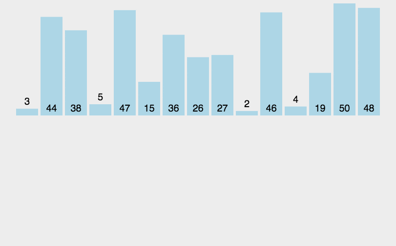

# 第10章 内部排序

# 10.1 概述

## 1 排序

排序（Sorting）是计算机程序设计中的一种重要操作，它的功能是将一个数据元素（或记录）的任意序列，重新排列成一个按关键字有序的序列。

## 2 排序码

排序的依据，指数据元素中的一个或多个数据项(不一定是关键字)

## 3 排序算法的稳定性

排序码相同的元素，按照某种排序算法排序后，相对位置仍保持不变，则称该排序算法是稳定的，否则就是不稳定的
如:
待排序数据： 65 33 27 65 78 12 69
排序后数据： 12 27 33 65 65 69 78—稳定，黄色和红色相对位置没变
排序后数据： 12 27 33 65 65 69 78—不稳定，黄山和红色相对位置改变4

## 4 内部排序与外部排序

### 内部排序

待排序记录存放在计算机随机存储器中进行的排序过程；

### 外部排序

待排序记录的数量很大，以致内存一次不能容纳全部记录，在排序过程中尚需对外存进行访问的排序过程。

# $10.2$ 插入排序

## $10.2.1$ 直接插入排序

 **（1）初始化**：将列表分为已排序部分和未排序部分。初始时，已排序部分只包含第一个元素，未排序部分包含剩余元素。
 **（2）选择元素**：从未排序部分中取出第一个元素。
 **（3）插入到已排序部分**：将该元素与已排序部分的元素从后向前依次比较，找到合适的位置插入。
 **（4）重复步骤**：重复上述步骤，直到未排序部分为空，列表完全有序。


```C
#include <iostream>
using namespace std;

template <typename T>
void InsertionSort(T A[], int n) {
	T t;
	for (int i = 1; i < n; i ++) {
		t = A[i]; // element ready to be sorted
		// Searching for proper location for t
		for (int j = i; j > 0 && t < A[j-1]; j--)
			A[j] = A[j-1];
		A[j] = t;
	}
}
```

时间复杂度：正序(最好):$O(n)$  逆序(最差):$O(n^2)$  平均时间复杂度是:$O(n^2)$
直接插入排序是一种**稳定**的排序算法

## $10.2.2$ 其他插入排序

### 1 二分插入排序

二分插入排序本质上是利用**二分查找**优化了查找插入位置的过程，减小了比较次数，因此二分插入排序的平均时间复杂度也是$O(n^2)$，也是一种**稳定**的排序算法

```C
#include <iostream>
using namespace std;

template <typename T>
void BinInsertionSort(T *A, int n) {
	for(int i = 1; i < n; i ++) {
		T t = A[i];
		// 通过二分查找将内部循环体的比较操作简化
		int low = 0, high = i - 1;
		while(low <= high) {
			int mid = (low + high) / 2;
			if(t < A[mid]) high = mid - 1;
			else low = mid + 1;
		}

		//二分查找结束 low就恰好在第一个大于等于A[i]的元素的位置
		for (int j = i - 1; j >= low; j --)
			A[j + 1] = A[j];
		//low前的元素往后挪一位，这样low的位置就被腾出来
		A[low] = t;
		//插入
	}
}
```

### 2 2-路插入排序

### 3 表插入排序

## $10.2.3$ 希尔排序

 **（1）基本思想**：  
希尔排序（Shell Sort）又称“缩小增量排序”。它先将整个待排序列分割成若干子序列分别进行直接插入排序，待序列“基本有序”时，再对全体进行一次直接插入排序。

 **（2）代码实现 (C++)** ：

```cpp
template <typename T>
void ShellSort(T A[], int n) {
    for (int gap = n / 2; gap > 0; gap /= 2) {
        for (int i = gap; i < n; i++) {
            T temp = A[i];
            int j = i;
            while (j >= gap && A[j - gap] > temp) {
                A[j] = A[j - gap];
                j -= gap;
            }
            A[j] = temp;
        }
    }
}
```

 **（3）性能分析**：

- 时间复杂度：取决于增量序列的选择，通常优于 $O(n^2)$。
- 空间复杂度：$O(1)$。
- 稳定性：**不稳定**。

# $10.3$ 快速排序

### 1 冒泡排序

```C
void BubbleSort(int nums[], int n) {
	int lastExchangeIndex; //在它之后的数组有序
	int i = n - 1; //i是待排序子表中最后一个元素的下标
	while(i > 0) {
		lastExchangeIndex = 0;
		for(int j = 0; j < i; j ++) {
			if(nums[j] > nums[j + 1]) {
				swap(nums[j], nums[j + 1]);
				lastExchangeIndex = j;
			}
		}
		i = lastExchangeIndex;
	}
}
```

**时间复杂**  

**最好(正序):**​**$O(n)$** **最差(逆序):**​$O(n^2)$ **平均复杂度是**​**$O(n^2)$**  
**冒泡排序是一种稳定的算法**   

## 2 快速排序 

 **（1）基本概念与核心思想**
快速排序（Quicksort）是一种基于 **分治策略** 的高效排序算法
。其核心思想是通过选取一个基准值（Pivot），将数组划分为两个子序列：

- **左子序列**：所有元素 ≤ 基准值
- **右子序列**：所有元素 ≥ 基准值随后递归地对左右子序列重复此操作，最终完成整个数组的排序。

 **（2）算法流程与步骤**
**选择基准值**。
通常从数组中选取第一个元素、最后一个元素或中间元素作为基准值。例如，若数组为 `{49, 38, 65, 97, 76, 13, 27}`，基准值可选第一个元素 `49`
**分区操作（Partition）** 
通过双指针（`i` 和 `j`）从两端向中间扫描数组：

- 左指针 `i`：从左向右寻找第一个大于基准值的元素。
- 右指针 `j`：从右向左寻找第一个小于基准值的元素。交换这两个元素，直到 `i` 和 `j` 相遇。最终基准值被放置在其正确的位置。**示例**：初始数组 `{49, 38, 65, 97, 76, 13, 27}` 经过一次分区后变为 `{27, 38, 13} 49 {76, 97, 65}`。

**递归排序**。
对左右子序列分别递归调用快速排序。例如，上述分区后的左子序列 `{27, 38, 13}` 和右子序列 `{76, 97, 65}` 将各自被排序
 **（3）时间复杂度与优化**
**时间复杂度**

- **平均情况**：$O(n log n)$，适用于大多数实际场景。
- **最坏情况**：$O(n²)$，当数组已有序且基准值选择不当时发生。
- **优化方法**：

  - **随机化基准值**：避免固定选择首元素，降低最坏情况概率。
  - **三数取中法**：选择首、中、尾三个元素的中位数作为基准值。

**空间复杂度**

- **原地排序版本**：$O(log n)$（递归栈空间）
- **非原地版本**：$O(n)$（需额外存储空间）

```Cpp
// 快速排序函数（Hoare 分区方案实现）
void quickSort1(vector<int>& nums, int l, int r) {
    // 1. 递归终止条件：当子数组长度为1或空时，无需排序
    if (l >= r) return;

    // 2. 初始化分区参数：
    // - i 初始在左边界左侧（l-1）
    // - j 初始在右边界右侧（r+1）
    // - 基准值 x 选中间元素（避免极端情况如全排序数组导致最坏时间复杂度）
    int i = l - 1, j = r + 1;
    int x = nums[(l + r) >> 1]; // 位运算代替 (l + r) / 2，等价且更高效

    // 3. Hoare 分区循环：双指针从两端向中间移动
    while (i < j) {
        // 3.1 移动左指针 i：跳过所有小于 x 的元素，直到找到 >=x 的元素
        do i++; while (nums[i] < x);

        // 3.2 移动右指针 j：跳过所有大于 x 的元素，直到找到 <=x 的元素
        do j--; while (nums[j] > x);

        // 3.3 如果指针未交错，交换左右指针的元素（确保左边 <=x，右边 >=x）
        if (i < j) swap(nums[i], nums[j]);
    }

    // 4. 递归排序左右子数组：
    // - 分区点为 j（因为当 i >= j 时，j 是左半部分的最右端）
    // - 左子数组：[l, j]（所有元素 <=x）
    // - 右子数组：[j+1, r]（所有元素 >=x）
    quickSort1(nums, l, j);
    quickSort1(nums, j + 1, r);
}

```

# $10.4$ 选择排序

## $10.4.1$ 简单选择排序

（1）先认为第1个数为最小数
（2）然后分别与其他几个数进行比较
（3）如果遇到比其小的就与其交换，经过一轮循环后最小的数就在最始端。
（4）重复上述操作直至剩余最后一个数

**这种排序是一种不稳定的排序**

```C
template <typename T>
void SelectionSort(T e[], int n) { //对e[0]～e[n-1]排序
    int i = 0, j = 0, k = 0;
    for(i = 0; i < n - 1; i ++) { //n-1趟选择
        k = i; //假定e[i]最小
        for(j = i + 1; j < n; j ++)
            if(e[j] < e[k]) k = j; //记当前最小元素的下标
        if(k != i) swap(e[i], e[k]); //e[i]不是最小，与e[k]交换
    }
}
```

**其时间复杂度和元素初态无关，其平均复杂度是**​$O(n^2)$

## 10.4.2 树形选择排序（锦标赛排序）

 **（1）基本思想**
**锦标赛机制**
将待排序元素视为参赛选手，每个叶子节点存储一个元素。通过相邻节点的两两比较，较小者晋级到父节点，最终根节点为全局最小值

- **示例**：序列 `[27, 49, 13, 76, 21, 38, 11, 32]`，第一轮比较后最小值为 `11`。

**树形结构保存中间结果**
使用完全二叉树存储比较结果，非叶子节点记录子节点的较小值，避免重复比较
 **（2）算法实现步骤**
以数组 `[52, 39, 67, 95, 70, 8, 25]` 为例：
**构建满二叉树**

- **叶子节点填充**：将待排序元素填入二叉树的叶子节点，不足时用极大值（如 `INT\_MAX`）补齐至最近的2的幂次。
- **非叶子节点生成**：自底向上比较兄弟节点，较小值晋升为父节点值。例如，第一层父节点为 `8`（由 `8` 和 `25` 比较得出）。

**提取最小值并更新树**

- **输出根节点**：当前根节点为全局最小值，加入有序序列。
- **替换叶子节点**：将原最小值所在叶子节点替换为极大值，重新比较其父节点路径。例如，提取 `8` 后，原位置替换为 `INT\_MAX`，重新比较路径节点得到次小值 `25`。

**循环直至有序**  
重复上述步骤，直至所有元素被提取完毕。  
 **（3）时空复杂度**  
**时间复杂度**​`O(nlogn)`​  
**空间复杂度** `O(n)`

```Cpp
#include <iostream>
#include <climits>
using namespace std;

void TreeSelectionSort(int arr[], int n) {
    // 计算满二叉树所需空间（补充到最近的2次幂）
    int treeSize = 1;
    while (treeSize < n) treeSize *= 2;
    int nodeSum = treeSize * 2 - 1; // 总节点数

    int* tree = new int[nodeSum]; // 创建树存储结构

    // 初始化叶子节点（倒序填充）
    for(int i = n - 1, j = 0; i >= 0; i--, j++)
        tree[nodeSum - j - 1] = arr[i];
    // 填充剩余叶子为极小值
    for(int i = n; i < treeSize; i++)
        tree[nodeSum - i - 1] = INT_MIN;

    // 构建初始锦标赛树（自底向上）
    for(int i = nodeSum - treeSize - 1; i >= 0; i--)
        tree[i] = max(tree[2*i+1], tree[2*i+2]); // 取子节点最大值

    // 逐轮提取最大值（降序排列）
    for(int k = n - 1; k >= 0; k--) {
        arr[k] = tree[0]; // 当前最大值存入数组末尾

        // 定位当前最大值在叶子中的位置
        int maxIndex = nodeSum - 1;
        while(tree[maxIndex] != arr[k]) maxIndex--;

        tree[maxIndex] = INT_MIN; // 标记为已提取

        // 更新树结构（自底向上调整）
        while(maxIndex > 0) {
            int parent = (maxIndex-1)/2;
            int sibling = (maxIndex%2 == 1) ? maxIndex+1 : maxIndex-1;
            tree[parent] = max(tree[maxIndex], tree[sibling]);
            maxIndex = parent;
        }
    }
    delete[] tree;
}

int main() {
    int arr[] = {52, 39, 67, 95, 70, 8, 25};
    int n = sizeof(arr)/sizeof(arr[0]);

    TreeSelectionSort(arr, n);

    cout << "排序结果：";
    for(int i = 0; i < n; i++)
        cout << arr[i] << " "; // 输出：8 25 39 52 67 70 95
    return 0;
}
```

## $10.4.3$ 堆排序

 **（1）原理与核心思想**
**堆的定义**
堆是一种**完全二叉树**，分为两种形式：

- **大根堆**：父节点的值 ≥ 子节点的值（用于升序排序）。
- **小根堆**：父节点的值 ≤ 子节点的值（用于降序排序）。

**排序逻辑**
堆排序通过以下两个阶段实现：

- **构建堆**：将无序数组转换为满足堆性质的完全二叉树。
- **排序**：重复将堆顶元素（最大值/最小值）与末尾元素交换，并调整剩余元素重建堆。

 **（2）算法步骤**
**构建初始堆**

- 从最后一个非叶子节点（索引为 `n/2 - 1`）开始，自底向上调整子树，确保每个子树满足堆性质
- **调整方法**（以最大堆为例）：
  1. 比较父节点与左右子节点的值。
  2. 若子节点更大，则交换父子节点。
  3. 递归调整被影响的子树。

**排序阶段**

- 交换堆顶元素与数组末尾元素，将最大值归位。
- 缩小堆范围（排除已排序元素），重新调整堆结构。
- 重复以上步骤，直至堆大小为1。

 **（3）时空复杂度**
时间复杂度 $O(n log n)$
空间复杂度  $O(1)$ （是树形选择排序的优化）

```Cpp
#include <iostream>
#include <algorithm>
using namespace std;

// 调整堆（大根堆）
void maxHeapify(int arr[], int n, int i) {
    int largest = i;       // 初始化最大值为根节点
    int left = 2 * i + 1; // 左子节点
    int right = 2 * i + 2;// 右子节点

    // 比较左子节点
    if (left < n && arr[left] > arr[largest]) 
        largest = left;

    // 比较右子节点
    if (right < n && arr[right] > arr[largest]) 
        largest = right;

    // 若最大值不在根节点，交换并递归调整
    if (largest != i) {
        swap(arr[i], arr[largest]);
        maxHeapify(arr, n, largest);
    }
}

// 堆排序主函数
void heapSort(int arr[], int n) {
    // 构建初始堆（从最后一个非叶子节点开始）
    for (int i = n / 2 - 1; i >= 0; i--)
        maxHeapify(arr, n, i);

    // 逐个提取堆顶元素
    for (int i = n - 1; i > 0; i--) {
        swap(arr[0], arr[i]);    // 将最大值移至末尾
        maxHeapify(arr, i, 0);   // 调整剩余堆
    }
}

int main() {
    int arr[] = {3, 5, 8, 10, 1, 2};
    int n = sizeof(arr)/sizeof(arr[0]);

    heapSort(arr, n);

    cout << "排序结果: ";
    for (int i = 0; i < n; i++)
        cout << arr[i] << " "; // 输出: 1 2 3 5 8 10
    return 0;
}

```

# $10.5$ 归并排序

## 基本思想

归并排序（Merge Sort）是基于**分治策略**（Divide and Conquer）的排序算法。其核心逻辑是将一个大序列拆分成若干个有序的子序列，再将有序子序列合并成一个完整的有序序列。

## 算法步骤

1. **分解（Divide）** ：将待排序序列从中间对半拆分。
2. **治理（Conquer）** ：递归地对两个子序列进行归并排序，直到子序列长度为 1。
3. **合并（Combine）** ：将两个已排序的子序列合并成一个新的有序序列。

## 代码实现：递归方式（自上而下）

这是最符合分治思想的实现方式，逻辑清晰，适合大多数场景。

```cpp
// 辅助函数：合并两个有序区间 [l, mid] 和 [mid+1, r]
void Merge(int arr[], int l, int mid, int r) {
    int n1 = mid - l + 1;
    int n2 = r - mid;
    int* L = new int[n1];
    int* R = new int[n2];

    // 拷贝数据到临时数组
    for (int i = 0; i < n1; i++) L[i] = arr[l + i];
    for (int j = 0; j < n2; j++) R[j] = arr[mid + 1 + j];

    // 合并回到原数组
    int i = 0, j = 0, k = l;
    while (i < n1 && j < n2) {
        if (L[i] <= R[j]) arr[k++] = L[i++];
        else arr[k++] = R[j++];
    }

    // 处理剩余元素
    while (i < n1) arr[k++] = L[i++];
    while (j < n2) arr[k++] = R[j++];

    delete[] L;
    delete[] R;
}

// 递归主函数
void MergeSortRecursive(int arr[], int l, int r) {
    if (l < r) {
        int mid = l + (r - l) / 2;
        MergeSortRecursive(arr, l, mid);       // 左半部分
        MergeSortRecursive(arr, mid + 1, r);   // 右半部分
        Merge(arr, l, mid, r);                 // 合并
    }
}
```

## 代码实现：循环方式（自下而上）

通过控制合并步长（1, 2, 4, 8...）来避免递归调用，效率略高，且减少了栈空间占用。

```cpp
void MergeSortIterative(int arr[], int n) {
    // sz 为当前合并的子数组长度：1, 2, 4, 8...
    for (int sz = 1; sz < n; sz *= 2) {
        // lo 为每次合并的左起始位置
        for (int lo = 0; lo < n - sz; lo += 2 * sz) {
            int mid = lo + sz - 1;
            int hi = std::min(lo + 2 * sz - 1, n - 1);
            Merge(arr, lo, mid, hi);
        }
    }
}
```

## 性能分析

- **时间复杂度**：

  - 最好情况：$O(n \log n)$
  - 最坏情况：$O(n \log n)$
  - 平均情况：$O(n \log n)$
  - *说明：无论数据初始状态如何，比较和拆分次数都是固定的。*
- **空间复杂度**：$O(n)$

  - 需要一个与原数组等大的辅助空间用于合并操作。
- **稳定性**：**稳定**

  - 在合并过程中，如果 `L[i] == R[j]`，我们优先拷贝左侧的元素，从而保证了相同元素的相对顺序不变。

## 优势与不足

- **优点**：速度快且极其稳定，适合大规模并行计算及链表排序。
- **缺点**：不是原地排序（In-place），对内存消耗较大。

# $10.6$ 基数排序

## $10.6.1$ 多关键字的排序

## $10.6.2$ 链式基数排序

# $10.7$ 各种内部排序方法的比较讨论
