# 第7章 图

# 7.1 图的定义和术语

## 1 图的定义

图是由顶点的**有穷非空**集合和顶点之间的边的集合组成的。通常用 $G(V,E)$ 表示，其中 $G$ 表示一个图，$V$ 是图 $G$ 中顶点的集合，$E$ 是边的集合
**注意：图不允许没有顶点，但边集可以为空**

## 2 无向图与有向图

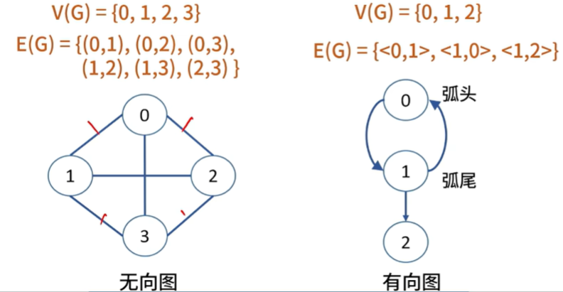

## 3 简单图与多重图

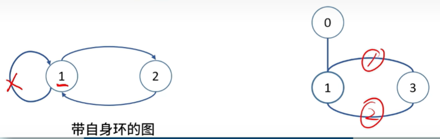
限制 1：图中不能有顶点 i 到其自身的边
限制 2：同一条边在图中不能出现两次或两次以上
不满足限制的称为多重图

## 4 完全图

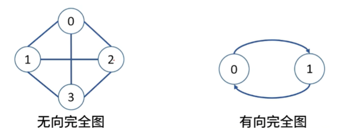
完全图：具有最多边数的图（顶点数为 $n$）
无向完全图：边数最大值为 $\frac{n(n-1)}{2}$
有向完全图：边数最大值为 $n(n-1)$

## 5 路径和路径长度

### 路径

从一个顶点开始经过一系列的边到达另外一个顶点形成的顶点序列

### 路径长度

路径上边的条数

### 回路

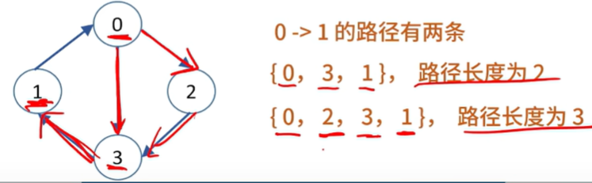
起点和终点相同。路径 $0，3，1，0$ 是一个回路（环）

## 6 简单路径

### 简单路径

路径中不出现相同的顶点

### 简单回路

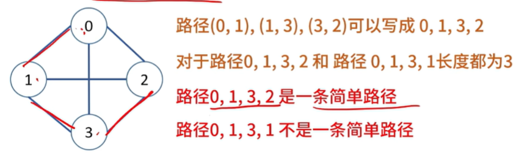
除了第一个顶点和最后一个顶点外，其余顶点不重复出现

## 7 顶点的度

### 度

对于无向图，顶点的度指的是与顶点相关联边的数目

### 入度

在有向图中，对于顶点 v，箭头指向 v 的边的数目

### 出度

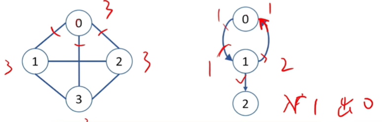
在有向图中，对于顶点 v，从该顶点出发的边的数目

## 8 度与边的关系

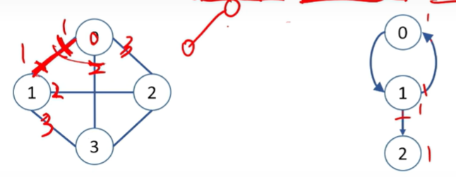
在无向图中，假设具有 $n$ 个顶点，$e$ 条边
图中所有顶点的度数之和为 $2e$
对于有向图，所有顶点的出度与入度之和相等，与弧的数量也相等

## 9 子图

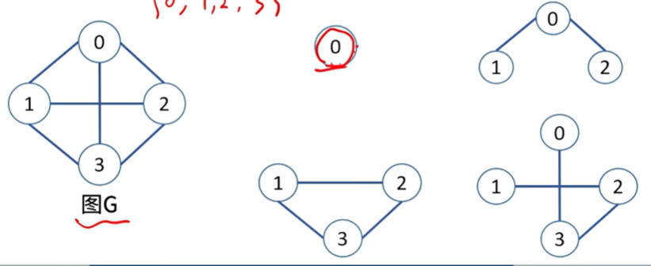
图 $G$ 的子图 $H$，$H$ 满足 $V(H)$ 是 $V(G)$ 的子集且 $E(H)$ 是 $E(G)$ 的子集

## 10 边的权和网

### 权值

### 网（带权图）

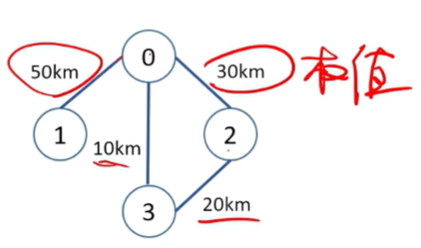

## 11 真题

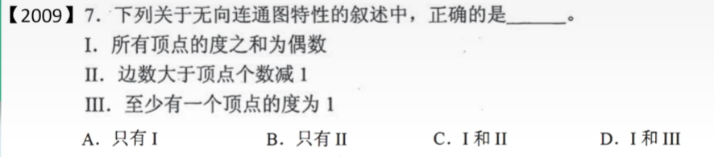
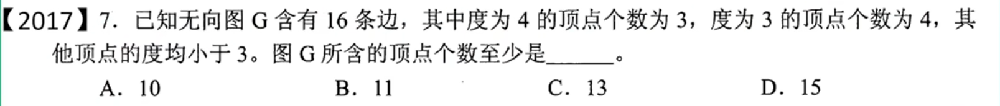

A

B

# $7.2$ 图的存储结构

## $7.2.1$ 邻接矩阵

### 无向图

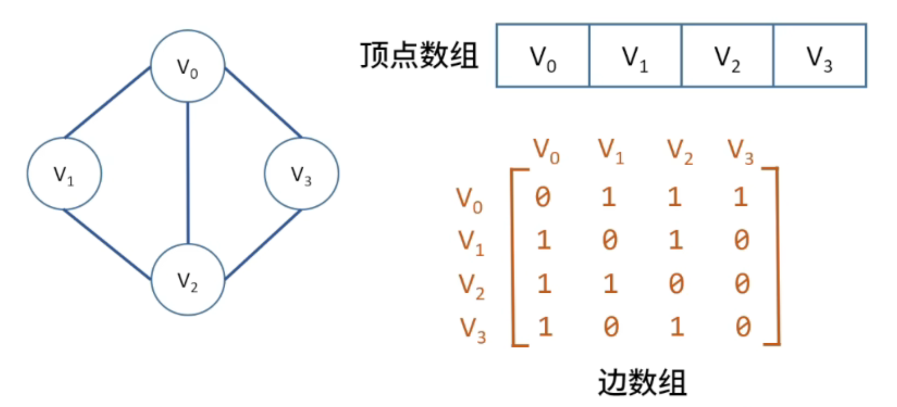

### 有向图

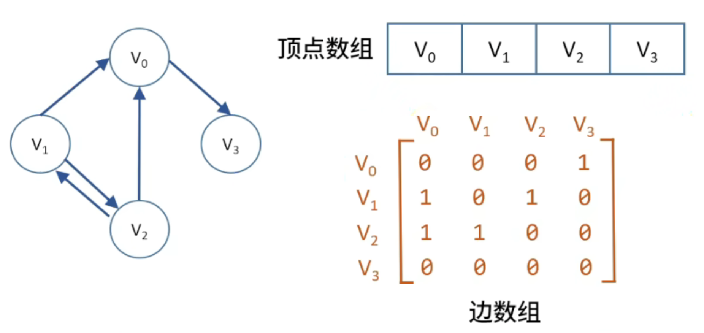

### 带权有向图

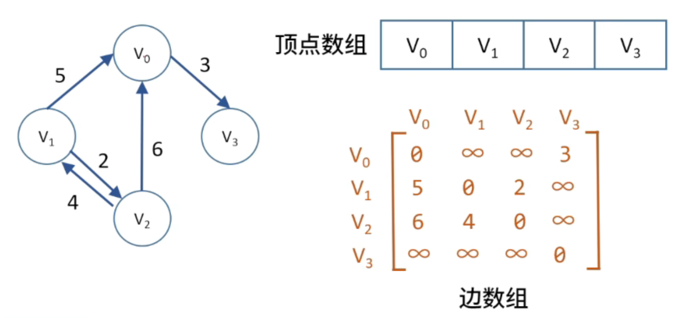

## 代码实现

```C
#include<stdio.h>
typedef char vertexType;
typedef int EdgeType;

#define MAX_SIZE 100
#define INT_MAX Ox7FFFFFFF;

// 邻接矩阵结构体
typedef struct{
	VertexType vertex[MAX_SIZE]; // 结点
	EdgeType arc[MAX_SIZE][MAX_SIZE]; // 边
	int vertex_num; // 结点数
	int edge_num; // 边数
} Matrix_Graph;
```

## $7.2.2$ 邻接表

### 无向图

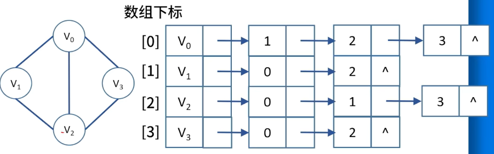

### 有向图

### 邻接表（出度）

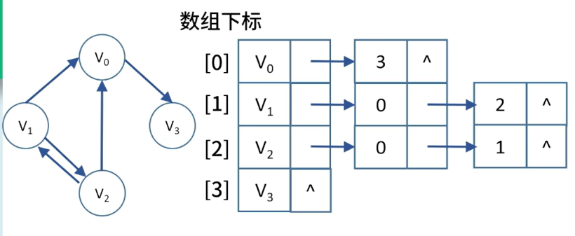
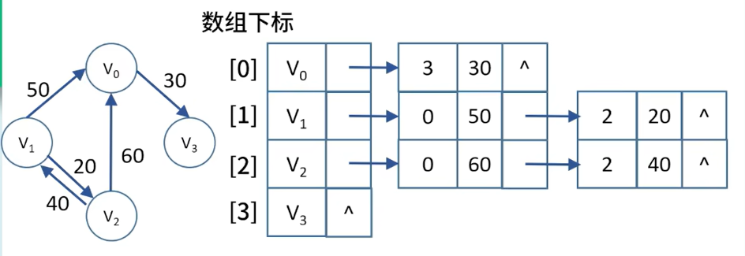

### 逆邻接表（入度）

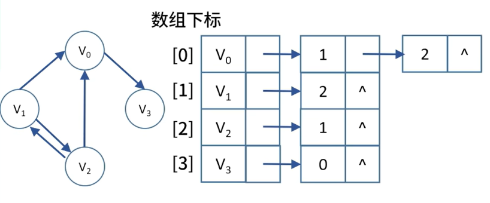

## $7.2.3$ 十字链表

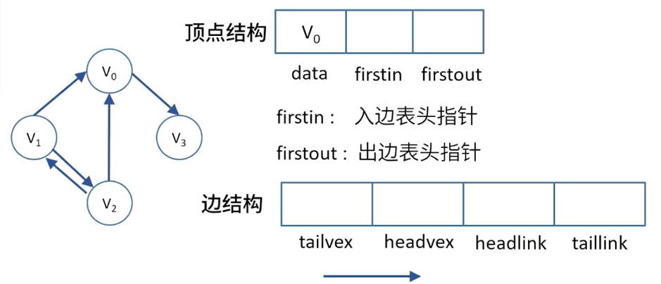
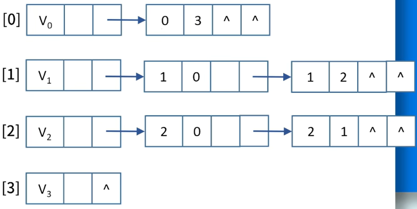
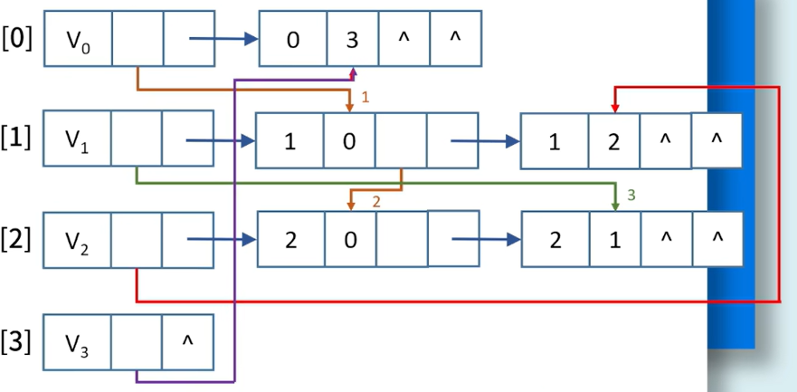
**十字链表是有向图表示的优化，相当于有向图邻接表和逆邻接表的结合，能同时表示一个结点的出度和入度关系**
弧尾 → 弧头，如弧 <V0,V3> 就用 0，3 表示

`firstin` 为入边表头指针，**​`headlink`​** **用于串联指向同一个结点的结点**
`firstout` 为出边表头指针，**​`taillink`​** **用于串联由同一个结点指向的结点**

## $7.2.4$ 邻接多重表


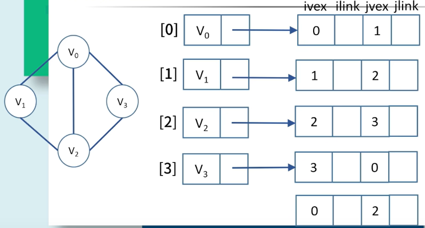
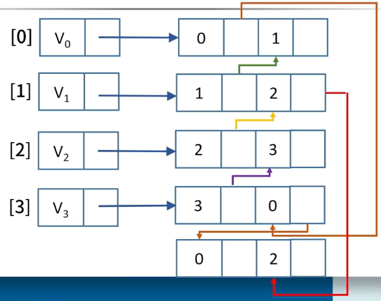

# $7.3$ 图的遍历

对于任意一个图，从某个顶点出发进行深度优先或广度优先遍历，只能访问到与该起始顶点在同一个连通分量内的所有顶点。 如果图是不连通的（即包含多个独立的连通分量），则无法仅从一个顶点出发访问到所有顶点。 只有当图是连通图时，才能通过从任一顶点出发的一次遍历访问所有顶点。

## $7.3.1$ 深度优先搜索

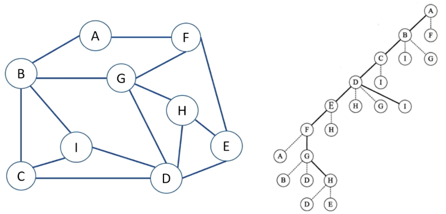

类似于树的前序遍历

```C
int visited[MAXSIZE];

void dfs(Matrix_Graph G, int i){
	visited[i] = 1;
	printf("%c ", G.vertex[i]); 
	for(int j = 0;j < G.vertex_num;j ++){
		if(G.arc[i][j] == 1 && visited[j] == 0)
			dfs(G,j);
	}
}
```

## $7.3.2$ 广度优先搜索

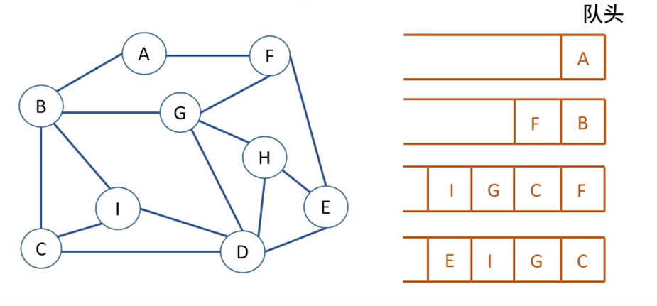
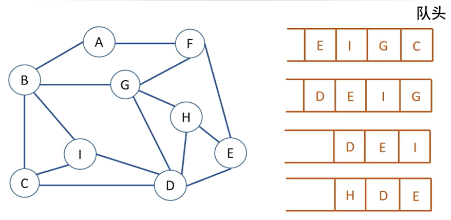
类似树的层序遍历

```C
void bfs(Matrix_Graph G){
	int i， j；
	for(i = 0; i < G.vertex_num; i++) visited[i] = 0;
	for(i = 0; i < G.vertex_num; i++){
		if(visited[i] == 0){
			visited[i] = 1;
			printf("%c ", G.vertex[i]);
			enqueue(i);
			while(!is_empty()){
				dequeue(&i);
				for(j = O; j < G.vertex_num; j++){
					if(G.arc[i][j] == 1 && visited[j] == 0){
						visited[j] = 1;
						printf("%c ", G.vertex[j]);
						enqueue(j);
					}
				}
			}
		}
	}
}
```

# $7.4$ 图的连通性问题


## $7.4.1$ 无向图的连通分量和生成树

## 1 连通 连通图 连通分量

### 连通

在无向图中，如果从顶点 v 到顶点 w 有路径，则称顶点 v 到顶点 w 是连通的

### 连通图

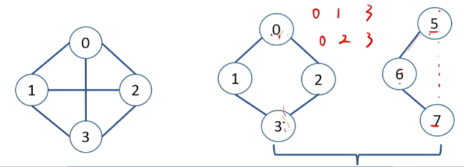
如果对于图中任意两个顶点都是连通的，则称此图为连通图

### 连通分量

无向图中的极大连通子图称为连通分量

- 连通分量为子图
- 子图要是连通的
- 连通子图含有极大顶点数
- 具有极大顶点数的连通子图包含依附于这些顶点的所有边

左 是连通分量 中 是连通分量 右 不是连通分量

```
    
    
```

## 2 生成树 生成森林

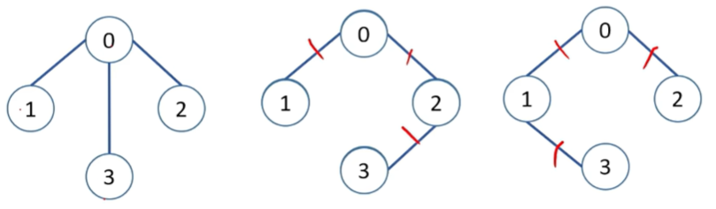
含有图中全部顶点的极小连通子树称作**生成树**，所有生成树组成的森林称作**生成森林**
注意：生成树的顶点数 $n$ 与边数 $e$ 的关系为 $e=n-1$

> [!NOTE] ✏️ 真题
> 【2010】 7.若无向图 G=(V,E)中含有 7 个顶点，要保证图 G 在任何情况下都是连通的，则需要的边
> 数最少是（21 条）

## $7.4.2$ 有向图的强连通分量

### 1 强连通图

在有向图中，对于每一对顶点 v 和 w，从 v 到 w 和从 w 到 v 都有路径，则称该有向图为强连通图

### 2 强连通分量

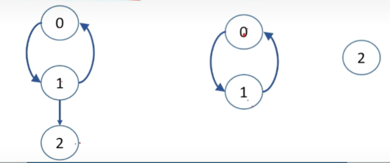
有向图的极大强连通子图为有向图的强连通分量

## $7.4.3$ 最小生成树

### 1 含义

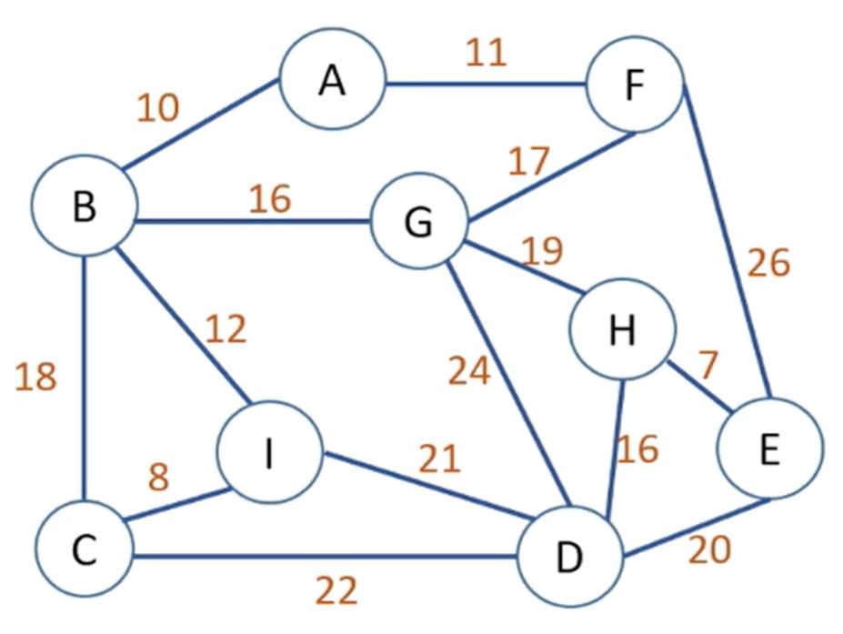
带权图的所有生成树中，所有路径的权重总和最小的生成树

### 2 普里姆 $(Prim)$ 算法

针对顶点的贪心策略，边数较多时效率高，时间复杂度为 $O(n^2)$
```C
void prim(Matrix_Graph G) {
	int i, j, k;
	int min;

	int weight[MAX_SIZE]; // 用于存储候选边的权重
	int vex_index[MAX_SIZE];

	weight[0] = 0; // 置0表示对应的结点已经加入最小生成树中
	vex_index[0] = 0; // weight数组对应位置的边连接的结点对应的下标

	// 初始化为与第一个结点相连的边的权重
	for(i = 1; i < G.vertex_num; i ++) {
		weight[i] = G.arc[0][i];
		vex_index[i] = 0;
	}

	for(i = 1; i < G.vertex_num; i ++) {
		min = INT_MAX;
		j = 1;
		k = 0;
		while(j < G.vertex_num) {
			if(weight[j] != 0 && weight[j] < min) { // 该节点未加入生成树
			                                      // 并且对应的边权重小于目前的最小值
				min = weight[j];
				k = j;
			}
			j ++;
		}
		printf("(%d, %d)\n", vex_index[k], k); // 打印加入生成树的边
		weight[k] = 0; // 加入生成树的结点 weight数组中置为0

		// 添加符合要求的 与新加入结点相连接的边
		for(j = 1;j < G.vertex_num; j ++) {
			if(weight[j] != 0 && G.arc[k][j] < weight[j]) {
				weight[j] = G.arc[k][j];
				vex_index[j] = k;
			}
		}
	}
}
```

### 3 克鲁斯卡尔 $(Kruskal)$ 算法

针对边的贪心策略，在边数较少时效率高，时间复杂度为 $O(e\log e)$

```C
// 初始化边数组
typedef struct{
	int begin;
	int end;
	int weight;
} Edge;

Edge edges[MAX_EDGES];

void init_edges() {
	int k = 0;
	for(int i = 0; i < G.vertex_num; i ++)
		for(int j = i + 1; j < G.vertex_num; j ++) {
			if(G.arc[i][j] < INT_MAX) {
				edges[k].begin = i;
				edges[k].end = j;
				edges[k].weight = G.arc[i][j];
				k ++;
			}
		}
	sort_edges(edges, G.edge_num);
}

int find(int *parent, int index) {
	while(parent[index] > 0)
		index = parent[index];
	return index;
}

void kruskal(Matrix_Graph G) {
	init_edges();
	int parent[MAX_SIZE] = {0};
	int m, n;
	for(int i = 0;i < G.edge_num; i ++) {
		m = find(parent, edges[i].begin);
		n = find(parent, edges[i].end);
		if(m != n) {
			parent[m] = n;
			printf("(%d, %d) %d\n", edges[i].begin, edges[i].end, edges[i].weight);
		}
	}
}
```

## $7.4.4$ 关节点和重连通分量

### 1 关节点

假若在删去顶点以及和 v 相关联的各边之后，将图的一个连通分量分割成两个或两个以上的连通分量，则称顶点为该图的一个关节点（articulationpoint）

### 2 重连通图

一个没有关节点的连通图称为是重连通图（biconnectedgraph）

# $7.5$ 有向无环图及其应用

## $7.5.1$ 拓扑排序

在一个表示工程的有向图中，用顶点表示活动，用弧表示活动之间的优先级，这样的有向图为顶点表示活动的网，我们称为 AOV 网(Activity on Vertex Network)
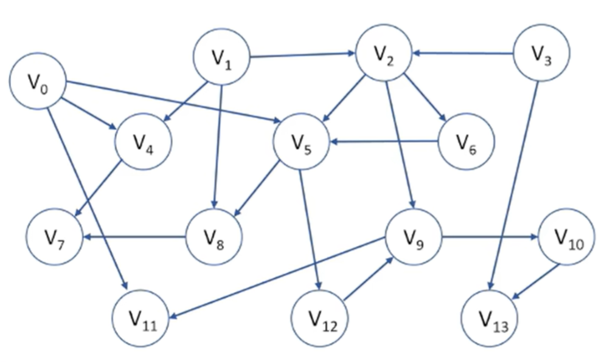
一个有向图的邻接矩阵中对角线以下元素均为零，意味着该图是一个上三角矩阵表示的图，这表明图中不存在从行索引大的节点指向行索引小的节点的边，即图中不存在环（有向圈）。 有向无环图（DAG）是能够进行拓扑排序的充要条件。

### 1 排序过程

```
while 栈不为空
	弹出栈顶元素
	栈顶元素出度指向的结点的入度 - 1
	遍历更新了入度的结点，将入度为0的点压入栈中

```

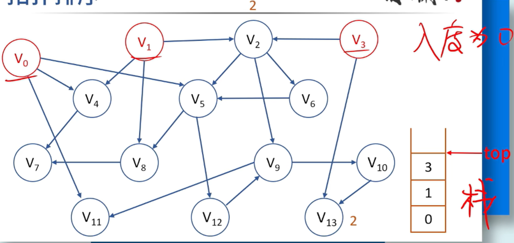
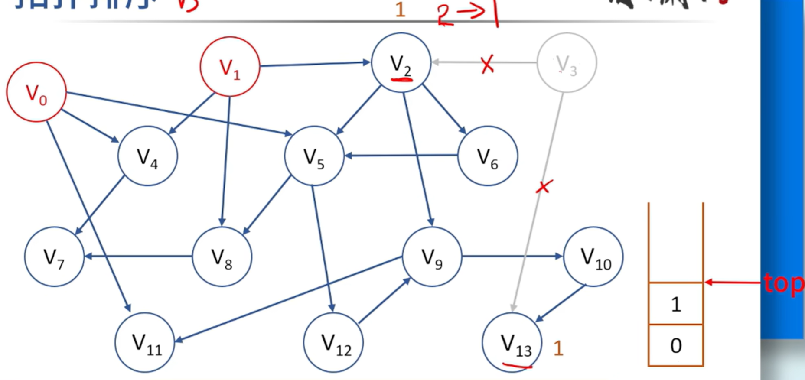
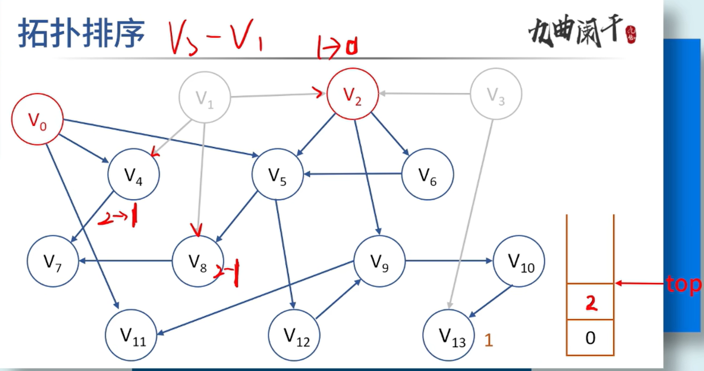
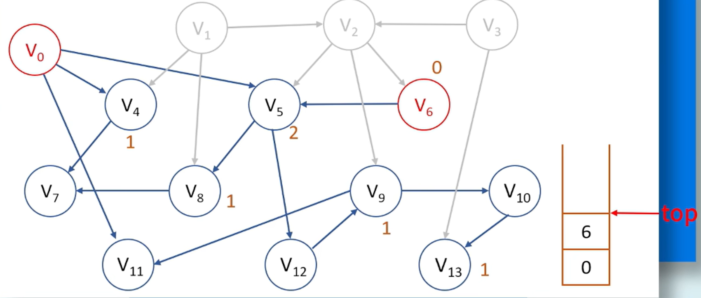
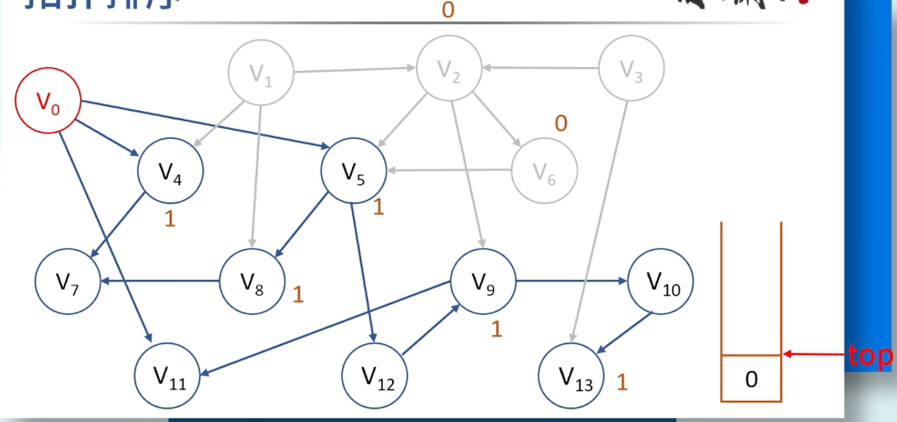

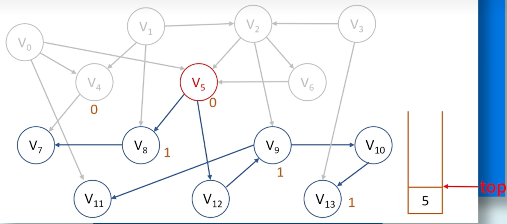

### 2 代码实现

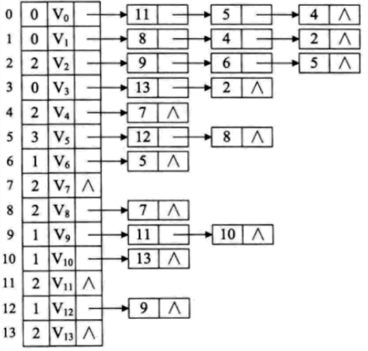

```C
// 采用邻接表存储（方便计算入度）
typedef struct EdgeNode{
	int edge_vex;
	struct EdgeNode *next;
} EdgeNode;

typedef struct VertexNode{
	int in; // 入度
	VertexType data;
	EdgeNode *head; // 结点出度链表的头指针
} VertexNode;

typedef VertexNode Adj_List[MAX_SIZE];

typedef struct{
	Adj_List adj_list;
	int vertex_num;
	int edge_num;
} Adj_Graph;

typedef Adj_Graph* Adj_List_Graph;

// 将邻接矩阵转换为邻接表
void create_adj_graph(Mat_Graph G, Adj_List_Graph *ALG) {
	int i, j;
	EdgeNode *e;
	*ALG = (Adj_List_Graph)malloc(sizeof(Adj_Graph));
	(*ALG)->vertex_num = G.vertex_num;
	(*ALG)->edge_num = G.edge_num;

	for(i = 0; i < G.vertex_num; i++) {
		(*ALG)->adj_list[i].in = 0;
		(*ALG)->adj_list[i].data = G.vertex[i];
		(*ALG)->adj_list[i].head = NULL;
	}

	for(i = 0; i < G.vertex_num; i++)
		for(j = 0; j < G.vertex_num; j++)
			if(G.arc[i][j] == 1) {
				// 头插法
				e = (EdgeNode *)malloc(sizeof(EdgeNode));
				e->edge_vex = j;
				e->next = (*ALG)->adj_list[i].head;
				(*ALG)->adj_list[i].head = e;
				(*ALG)->adj_list[j].in ++;
			}
}

// 拓扑排序
void topological_sort(Adj_List_Graph ALG) {
	int i, k;
	EdgeNode *e;
	int stack[MAXSIZE];
	int curr;
	for(i = 0; i < ALG->vertex_num; i++)
		if(ALG->adj_list[i].in == 0)
			push(i);
	while(is_empty() != 0) {
		curr = pop();
		printf(" %d ->", ALG->adj_list[curr].data);
		e = ALG->adj_list[curr].head;
		while(e != NULL) {
			k = e->edge_vex;
			ALG->adj_list[k].in --;
			if(ALG->adj_list[k].in == 0)
				push(k);
			e = e->next;
		}
	}
	printf(" end\n");
}
```

## $7.5.2$ 关键路径

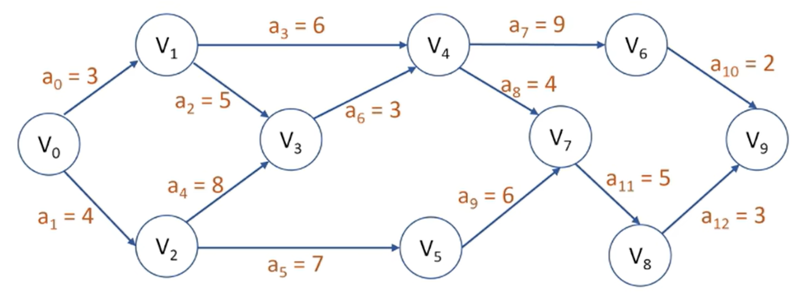
在一个表示工程的带权有向图中，用顶点表示事件，用有向边表示活动，用边上的权值表示活动的持续时间，这种有向图的边表示活动的网，我们称为 AOE 网(Activity on Edge Network)

### etv - earliest time of vertex 事件最早发生时间

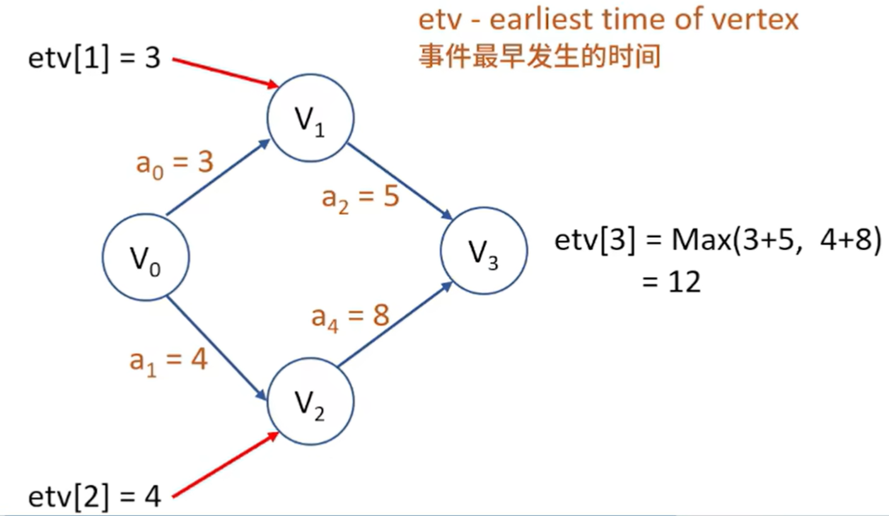
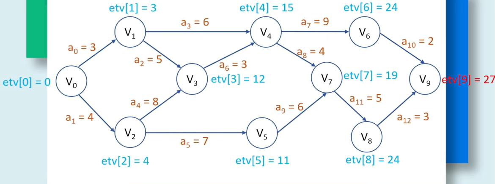
注意：此处由于 V3 开始做有 V1 和 V2 两个依赖，V1 和 V2 都完成了才能开始 V3，因此是取最大值

### ltv - latest time of vertex 事件最晚发生时间

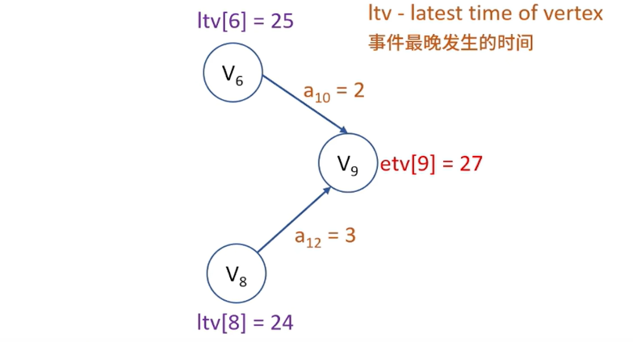
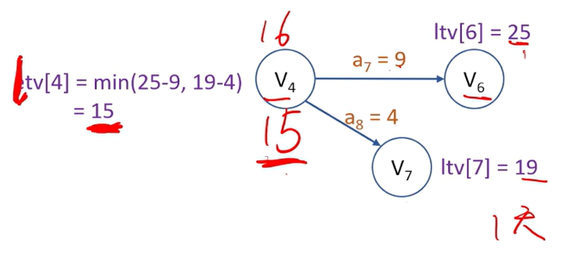
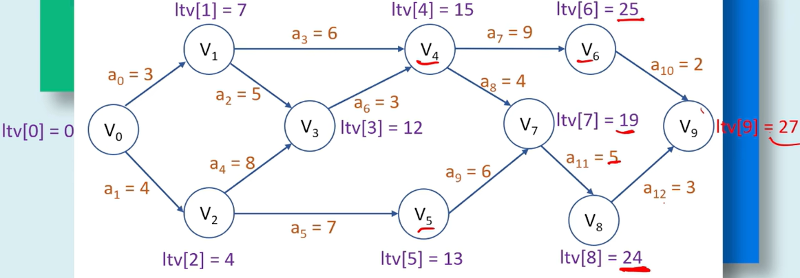
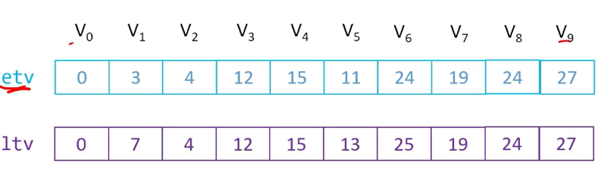
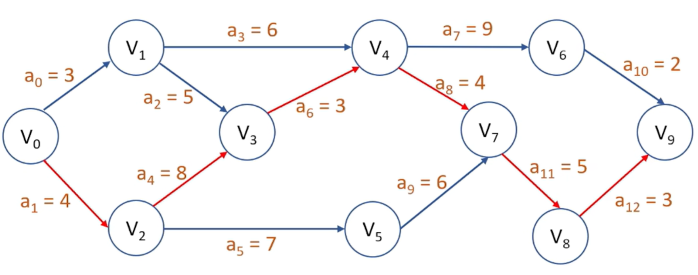

关键路径：etv=ltv 的结点组成的路径

### 代码实现

```C
// 采用邻接表存储（方便计算入度）
typedef struct EdgeNode{
	int edge_vex;
	int weight; // 边的权重
	struct EdgeNode *next;
} EdgeNode;

typedef struct VertexNode{
	int in; // 入度
	VertexType data;
	EdgeNode *head; // 结点出度链表的头指针
} VertexNode;

typedef VertexNode Adj_List[MAX_SIZE];

typedef struct{
	Adj_List adj_list;
	int vertex_num;
	int edge_num;
} Adj_Graph;

typedef Adj_Graph* Adj_List_Graph;

// 将邻接矩阵转换为邻接表
void create_adj_graph(Mat_Graph G, Adj_List_Graph *ALG) {
	int i, j;
	EdgeNode *e;
	*ALG = (Adj_List_Graph)malloc(sizeof(Adj_Graph));
	(*ALG)->vertex_num = G.vertex_num;
	(*ALG)->edge_num = G.edge_num;

	for(i = 0; i < G.vertex_num; i++) {
		(*ALG)->adj_list[i].in = 0;
		(*ALG)->adj_list[i].data = G.vertex[i];
		(*ALG)->adj_list[i].head = NULL;
	}

	for(i = 0; i < G.vertex_num; i++)
		for(j = 0; j < G.vertex_num; j++)
			if(G.arc[i][j] != 0 && G.arc[i][j] < INT_MAX) {
				// 边的权重不为0 并且有边（没有边的被设置为INT_MAX）
				e = (EdgeNode *)malloc(sizeof(EdgeNode));
				e->edge_vex = j;
				e->weight = G.arc[i][j];
				e->next = (*ALG)->adj_list[i].head;
				(*ALG)->adj_list[i].head = e;
				(*ALG)->adj_list[j].in ++;
			}
}

// 关键路径 要先做一遍拓扑排序
void critical_path(Adj_List_Graph ALG) {
	int i, k;
	EdgeNode *e;
	int top = -1, top2 = -1;
	int stack[MAXSIZE], stack2[MAXSIZE], etv[MAXSIZE], ltv[MAXSIZE];
	int curr;
	int ete, lte;

	for(i = 0; i < ALG->vertex_num; i++)
		if(ALG->adj_list[i].in == 0) {
			// push
			top++;
			stack[top] = i;
		}

	for(i = 0; i < ALG->vertex_num; i++)
		etv[i] = 0;

	while(top != -1) {
		curr = stack[top];
		top --;
		printf(" %d ->", ALG->adj_list[curr].data);
		top2 ++;
		stack2[top2] = curr;
		e = ALG->adj_list[curr].head;
		while(e != NULL) {
			k = e->edge_vex;
			ALG->adj_list[k].in --;
			if(ALG->adj_list[k].in == 0) {
				top++;
				stack[top] = k;
			}
			if((etv[curr] + e->weight) > etv[k])
				etv[k] = etv[curr] + e->weight;
			e = e->next;
		}
	}
	printf(" end\n");

	printf("etv : ");
	for(i = 0; i < ALG->vertex_num; i++)
		printf("%d -> ", etv[i]);
	printf(" end\n");

	for(i = 0; i < ALG->vertex_num; i++)
		ltv[i] = etv[ALG->vertex_num - 1];

	while(top2 != -1) {
		curr = stack2[top2];
		top2 --;
		e = ALG->adj_list[curr].head;
		while(e != NULL) {
			k = e->edge_vex;
			if(ltv[k] - e->weight < ltv[curr])
				ltv[curr] = ltv[k] - e->weight;
			e = e->next;
		}
	}

	printf("ltv : ");
	for(i = 0; i < ALG->vertex_num; i++)
		printf("%d -> ", ltv[i]);
	printf(" end\n");

	for(i = 0; i < ALG->vertex_num; i++) {
		e = ALG->adj_list[i].head;
		while(e != NULL) {
			k = e->edge_vex;
			ete = etv[i];
			lte = ltv[k] - e->weight;
			if(ete == lte)
				printf("<V%d - V%d> len : %d\n", ALG->adj_list[i].data, ALG->adj_list[k].data, e->weight);
			e = e->next;
		}
	}
}
```

# $7.6$ 最短路径

## $7.6.1$ 从某个源点到其余各顶点的最短路径

### $Dijtskra$ 算法 $O(n^2)$

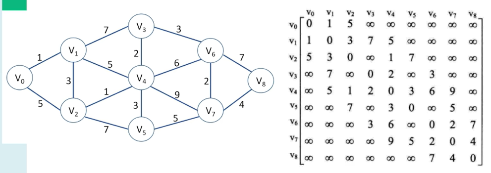

```C
int choose(int distance[], int found[], int vertex_num) {
	int min = INT_MAX, min_pos = -1;
	for(int i = 0; i < vertex_num; i ++) {
		if(distance[i] < min && found[i] == 0) {
			min = distance[i];
			min_pos = i;
		}
	}
	return min_pos;
}

void dijtskra(Matrix_Graph G, int begin) {
	// 求从begin结点出发，到达各结点的最短路径
	int found[MAX_SIZE]; // 已经找到最短路径的结点置为1
	int path[MAX_SIZE]; // 目前到达各结点的最短路径的前一个结点
	int distance[MAX_SIZE]; // 目前找到的从begin到各结点的最短距离

	// 初始化
	for(int i = 0; i < G.vertex_num; i ++) {
		found[i] = 0;
		path[i] = -1;
		distance[i] = G.arc[begin][i];
	}

	found[begin] = 1;
	distance[begin] = 0;

	int next;
	for(int i = 1; i < G.vertex_num; i ++) {
		next = choose(distance, found, G.vertex_num);
		found[next] = 1;
		for(int j = 0; j < G.vertex_num; j ++) {
			if(found[j] == 0) {
				if(distance[next] + G.arc[next][j] < distance[j]) {
					distance[j] = distance[next] + G.arc[next][j];
					path[j] = next;
				}
			}
		}
	}

	// 输出最短路径长度和具体路径
	for(int i = 1; i < G.vertex_num; i ++) {
		printf("v0 -> v%d : %d\n", i, distance[i]);
		int j = i;
		printf("v%d <- ", i);
		while(path[j] != -1) {
			printf("v%d <- ", path[j]);
			j = path[j];
		}
		printf("v0\n");
	}
}
```

## $7.6.2$ 每一对顶点之间的最短路径

### $Floyd$ 算法 $O(n^3)$

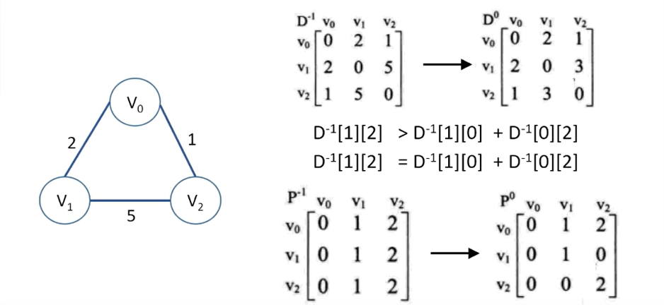

$D^{-1}、P^{-1}$ 分别表示初始状态下各结点之间的距离，和到达各结点的路径
$D^0、P^0$ 分别表示经过 v0 中转后各结点之间的距离，和到达各结点的路径

```C
void floyd(Matrix_Graph G) {
	int i, j, k; //i：中转顶点 j：起始顶点 k：终止顶点
	int dist[MAX_SIZE];
	int path[MAX_SIZE];
	for(i = 0; i < G.vertex_num; i++) {
		for(j = 0; j < G.vertex_num; j++) {
			dist[i][j] = G.arc[i][j];
			path[i][j] = j;
		}
	}

	for(i = 0; i < G.vertex_num; i ++)
		for(j = 0; j < G.vertex_num; j++)
			for(k = 0; k < G.vertex_num; k++)
				if(dist[j][k] > dist[j][i] + dist[i][k]) {
					dist[j][k] = dist[j][i] + dist[i][k];
					path[j][k] = path[j][i];
				}

	// 打印最短路径
	for(i = 0; i < G.vertex_num; i++) {
		for(j = i + 1; j < G.vertex_num; j++) {
			printf("v%d -> V%d weight : %d ", i, j, dist[i][j]);
			k = path[i][j];
			printf(" path: v%d", i);
			while(k != j) {
				printf(" -> v%d", k);
				k = path[k][j];
			}
			printf(" -> v%d\n", j);
		}
		printf("\n");
	}
}
```
