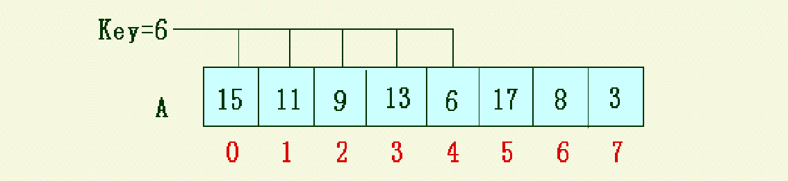
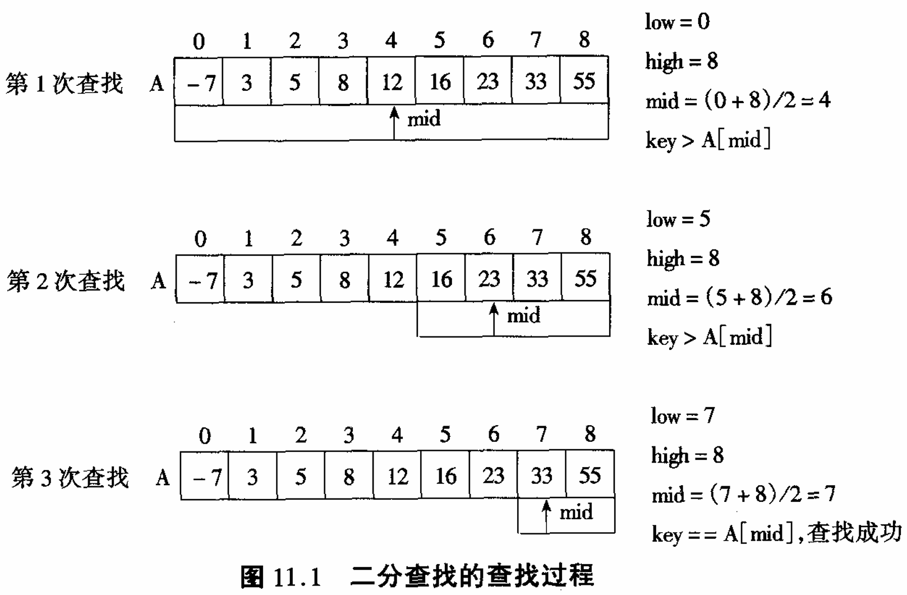
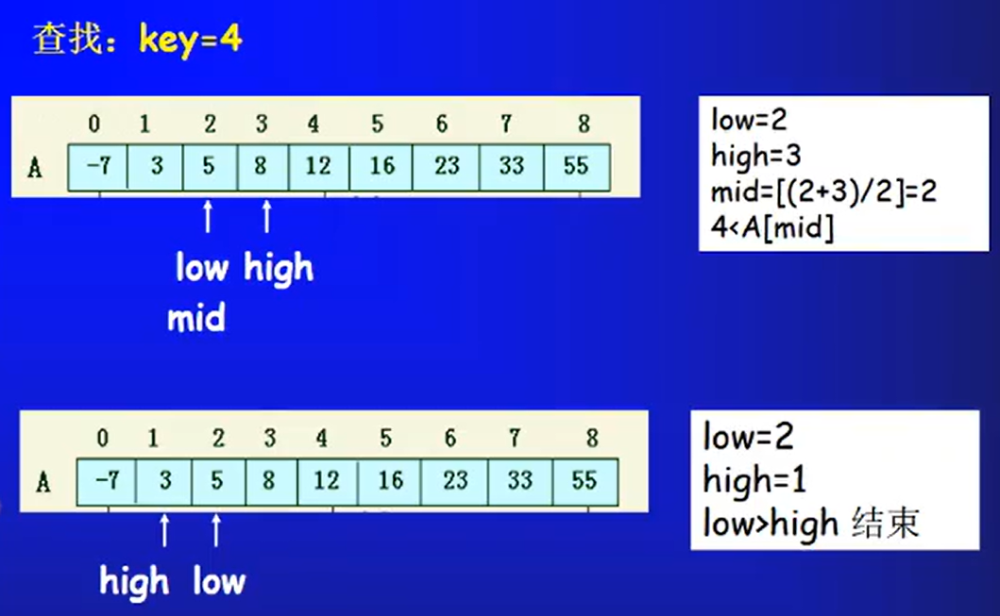
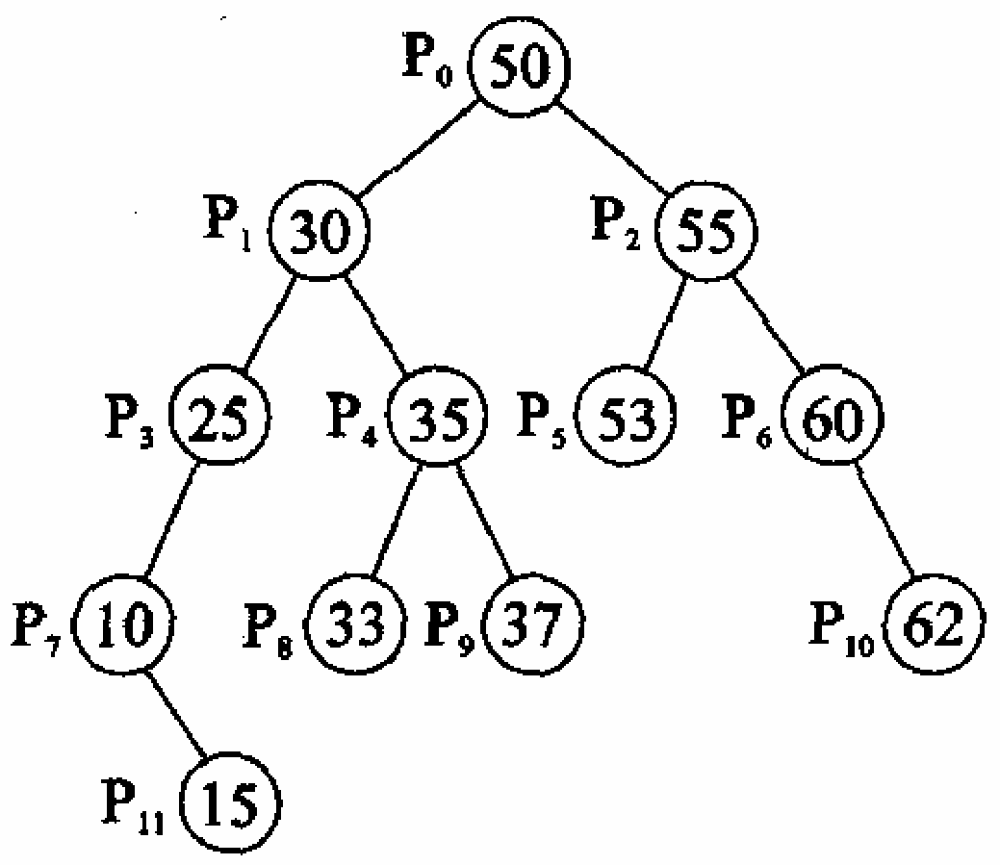
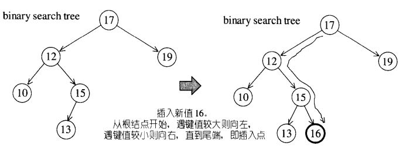
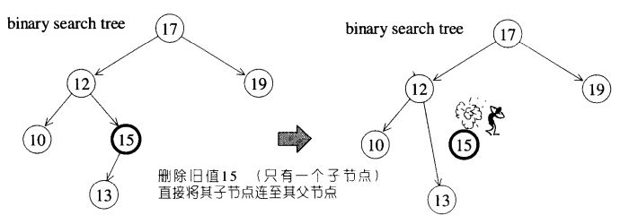
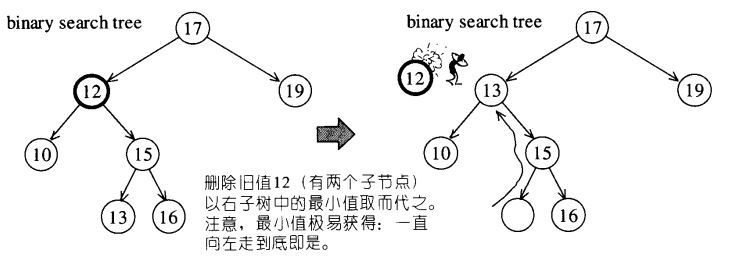
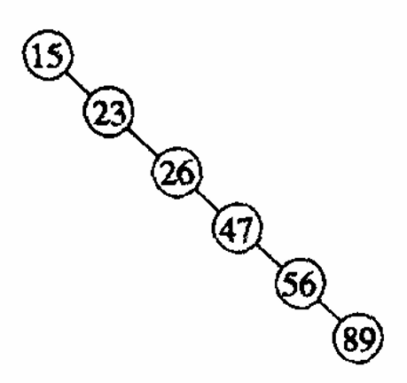

# 第9章 查找

# 基本概念

|概念|含义|备注|
| :-------------| :-------------------------------------------------------------------------------| :-----------------------------------------------------------------------------|
|查找表|由同一类型的数据元素（或记录）构成的集合|静态查找表：只查找动态查找表：有增删|
|查找|根据给定的某个值，在查找表中确定一个其关键字等于给定值的记录或数据元素||
|关键字|数据元素（或记录）中某个数据项的值，用它可以标识（识别）一个数据元素（或记录）|主关键字：可以惟一地标识一个记录次关键字：用以识别若干记录|
|平均查找长度$(ASL)$|$ASL=∑\_{i=1}^nP\_iC\_i (i=1,2,3,…,n)$|$n$为查找表的长度$P\_i$为查找第$i$个元素的概率，在等概率情况下$P\_i$等于$\frac{1}{n}$​$C\_i$为找到第$i$个元素时的比较|

# $9.1$ 静态查找表

## $9.1.1$ 顺序表的查找

### 要求

**顺序查找必须是线性表**
**2.基本思想**

**按序一个一个找(如下图的6在第五次比较找到)**

**3.顺序查找的平均查找长度**
$ASL=∑{i=1}^nP\_iC\_i=\frac{1}{n}∑{i=1}^n i=\frac{n+1}{2}=O(n)$
**4.评价**
**简单但效率较低。适用于在查找表较小的情况下进行查找**
**5.算法实现**
可通过顺序表类和单链表类中的**[search](https://www.notion.so/1be2ecb8b37981d2a527e5c5e5e8bb95?pvs=21)函数来实现**

## $9.1.2$ 有序表的查找

1.条件
（1）二分查找的数据必须以顺序方式存储线性表（不能是链式）

（2）线性表中所有数据元素必须按照关键字有序排列

2.数据不存在
**当high指针和low指针范围倒置，说明查找数据不存在，返回一个小于0的值**

3.程序实现
**以循环的方式实现二分查找（适用于量大 循环次数多 效率更高）**

```C++
#include <iostream>
using namespace std;

template <typename T>
int BinSearch(T A[], int low, int high, T key) {
	int mid;
	while(low <= high) {
		mid = (low + high) / 2;
		if(key == A[mid]) return mid; //查找成功，返回元素的下标
		if(key < A[mid]) high = mid - 1; //到表的前半部分查找
		else low = mid + 1; //到表的后半部分查找
	}
	return -1; //查找失败，返回失败标志-1
}
```

**以递归的形式实现二分查找（函数调用占内存多）**

```C++
#include <iostream>
using namespace std;

template <typename T>
int BinSearch(T A[], int low, int high, T key) {
	int mid;
	if(low > high)
		return -1; //查找失败，返回失败标志-1
	else {
		mid = (low + high) / 2;
		if(key == A[mid])
			return mid; //查找成功，返回元素的下标
		if(key < A[mid])
			return BinSearch(A, low, mid - 1, key); //到表的前半部分查找
		else
			return BinSearch(A, mid + 1, high, key); //到表的后半部分查找
	}
}
```

**4.优点**
**查找效率高(​**$ASL=O(log_2 n)$)** —***[原因](https://blog.csdn.net/Mine268/article/details/111400324)***
**5.缺点**
 **（1）查找前要求表中元素按关键字有序排列**
 **（2）只适用于顺序表**

## $9.1.3$ 静态树的查找

## $9.1.4$ 索引顺序表的查找（分块查找）

# $9.2$ 动态查找表

## $9.2.1$ 二叉排序树和平衡二叉树

**将数据集合中的数据元素存储为一颗二叉排序树，然后按给定方法进行查找**
**1.二叉排序树的定义**
**二叉排序树要么是一棵空二叉树，要么是具有以下性质的二叉树：**​ **（1）若它的左子树非空，则左子树上所有结点的值均小于根结点的值**​ **（2）若它的右子树非空，则右子树上所有结点的值均不小于根结点的值**​ **（3）左、右子树本身又各是一棵二叉排序树（递归定义）** 
*e.g.* 

**中序遍历结果**
 **{10，15，25，30，33，35，37，50，53，55，60，62}** 
**恰好是其中的数从小到大排序的结果**
**2.二叉排序树的插入**
**插入新元素时，可以从根节点开始，遇键值较大者就向左，遇键值较小者就向右，一直到末端，就是插入点**

**3.二叉排序树的删除**
**对于二叉排序树中的节点A，对它的删除分为两种情况：** 
 **（1）如果A只有一个子节点，就直接将A的子节点连至A的父节点上，并将A删除**

 **（2）如果A有两个子节点，我们就以右子树内的最小节点取代A**
**也可以中序遍历之后，将要删除元素的直接前驱/后继元素替换掉删除元素即可**

4.查找
**平衡二叉排序树的平均查找长度:**​**$ASL=O(log\_2 n)$**
**5.二叉排序树的脱变：单支树（数据元素有序）—单链表**

*平均查找长度与顺序查找相同*\*
[平衡二叉树详解-CSDN博客](https://blog.csdn.net/dugudaibo/article/details/79439189)

## $9.2.2$ B-树和B+树

## $9.2.3$ 键树

# $9.3$ 哈希表

## $9.3.1$ 什么是哈希表

**1.基本原理**
**将数据集合中的数据元素存储为哈希表，然后按给定方法进行查找**

## $9.3.2$ 哈希函数的构造方法

**2.哈希存储(哈希表)：哈希函数（关键值）—&gt;元素存储地址**
*e.g*  设有一组关键字值{85,72,49,58,15,70,90,38}，哈希函数h(k) = k mod 12。则对应的哈希地址为:
{1, 0, 1, 10, 3, 10, 6, 2}

## $9.3.3$ 处理冲突的方法

**3.地址冲突**
**若有两个不同的关键字​$k\_i$​和​$k\_j$，即​$k\_i ≠ k\_j(i ≠j)$。但有​$h(k\_i)=h(k\_j)$，$k\_i$​与 ​$k\_j$​称为同义词（不同关键字产生相同哈希值** 
**需要解决的主要问题:** 
 **（1）构造一个好的哈希函数，使出现冲突的机会尽可能少**
 **（2）设计一个有效的解决冲突的办法**
**解决冲突的方法:** 
 **（1）开地址法**
**处理用数组存储哈希表时出现的冲突**
**①发生冲突时按某种规则形成一个地址探查序列​②按序列顺序逐个检查各地址单元，找到一个未被占用的单元​③将发生冲突的数据元素存入该地址单元中**
**探查方式:** 
**①线性探查地址序列:发现地址被占，就依次找附近的未占地址填入序列:**​$d+1$​ **, **​$d+2$​ **, **​$…$​ ** , **​$m-1$​ **, **​$0$​ **, **​$1$​ **, **​$…$​ ** , **​$d-1$​ （循环的0  1 2 3 4  5 0 1 2……）
*e.g*   

|**key**|**33**|**52**|**41**|**12**|**88**|**66**|
| :-----| :-| :-| :-| :-| :-| :-|
|H(key)|5|3|6|5|4|3|

\| 0 \| 1 \| 2 \| 3 \| 4 \| 5 \| 排              \| \|
\| --- \| --- \| --- \| --- \| --- \| --- \| --- \|
\|  \|  \| 52,66（冲突） \| 88 \| 33,12（冲突） \| 41 \| 序              \| \|
\|  \| 12 \| 已占 \| 已占 \| 已占 \| 已占 \| 过              \| \|
\| 66 \| 已占 \| 已占 \| 已占 \| 已占 \| 已占 \| 程              V \|
\| 66 \| 12 \| 52 \| 88 \| 33 \| 41 \| 结果 \|
**②平方探查地址序列(二次探查地址序列):发现地址被占，找相距平方距离的地址填入**
序列: $(d+1^2),(d-1^2),(d+2^2),(d-2^2),……$
（2）链地址法
**把哈希表当成链表头结点构成的数组，一旦发生冲突，只需要在相应的头结点后链接上该结点**
*e.g哈希表同上:*    

|0|1|2|3|4|5||
| :-| :-| :---------| :-----------| :---------| :-| :-----------|
|||52|指向66的指针|88|33|指向12的指针|
|||66（冲突）||12（冲突）||结果|

 **（3）建立公共溢出区**

## $9.3.4$ 哈希表的查找及其分析
