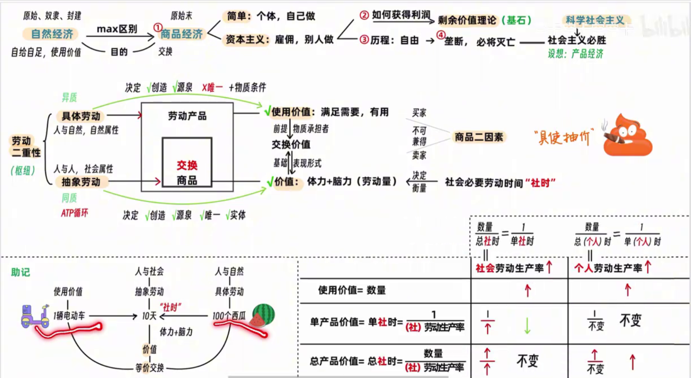
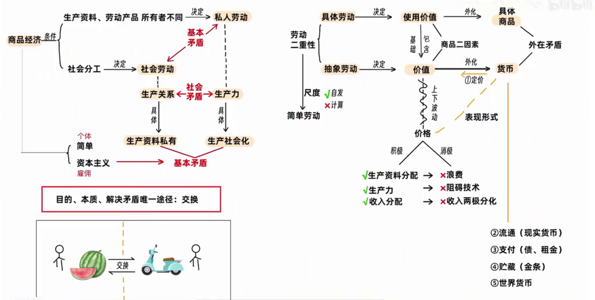
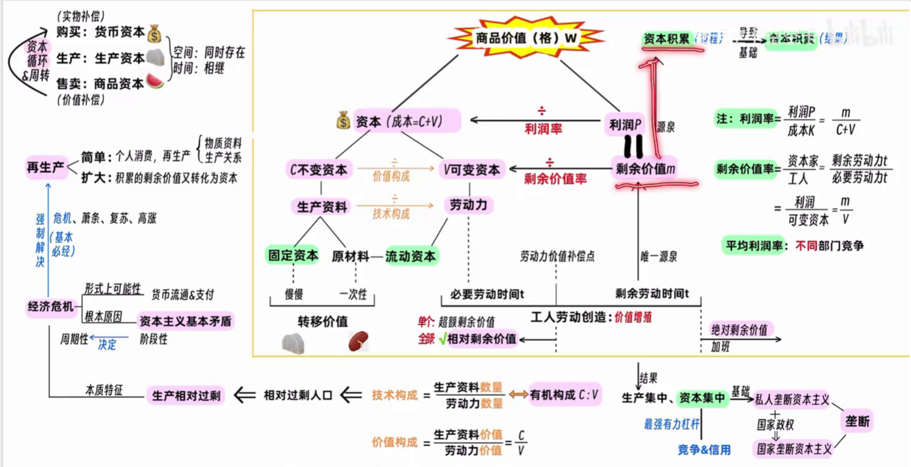
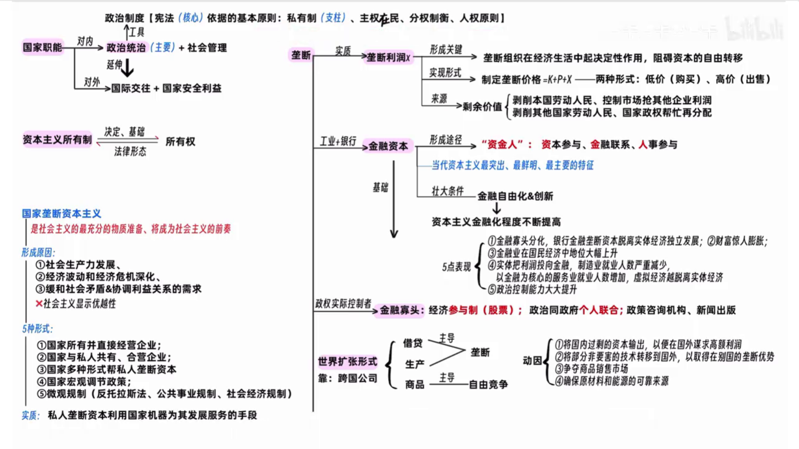
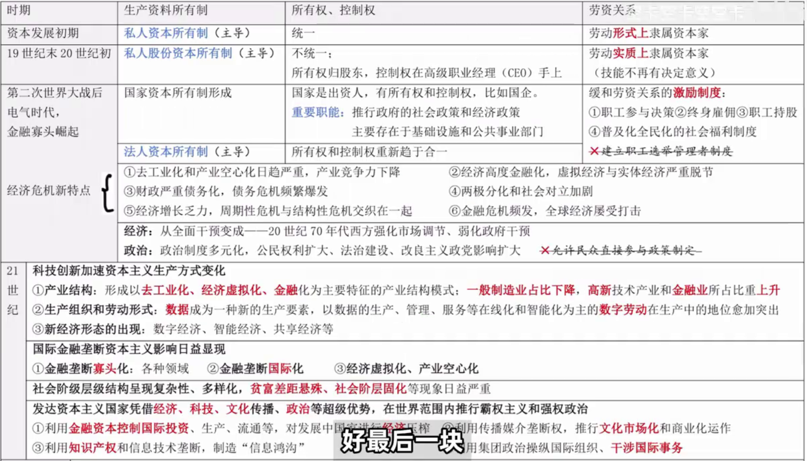

# 导论
---
## 一、 马克思主义的创立历程（生平与著作线索）

### 1. 思想奠基阶段（“两个转变”）

* **人物背景：** 马克思（德国律师家庭，博士毕业）与恩格斯（工厂主家庭）。
* **关键转折：** 1844年通过《德法年鉴》的论文，实现两个转向：
	* 从**唯心主义**转向**唯物主义**。
	* 从**革命民主主义**转向**共产主义**。
* **早期合著：** 《神圣家族》（两人首次合著）。

### 2. 理论形成阶段

* **《关于费尔巴哈的提纲》：** 包含新世界观天才萌芽的第一个文件。
* **《德意志意识形态》：** 第一次系统阐述**唯物主义**（社会存在与社会意识的关系）。

### 3. 公开问世与成熟阶段

* **《共产党宣言》 (1848年)：**
	* 背景：正义者同盟改组为“共产主义者同盟”（第一个无产阶级政党）。
	* 意义：标志着**马克思主义的公开问世**。
* **《资本论》 (1867年)：** 被誉为“工人阶级的圣经”。
* **《法兰西内战》：** 科学总结巴黎公社经验。
* **《哥达纲领批判》：** 进一步丰富科学社会主义。
* **《反杜林论》 (恩格斯著)：** 全面阐述马克思主义理论体系，被称为“马克思主义的百科全书”。

### 4. 恩格斯晚年的丰富

* 著作：《家庭、私有制和国家的起源》、《路德维希·费尔巴哈与德国古典哲学的终结》。
* 整理出版《资本论》第二、三卷。

---

## 二、 马克思主义的创立条件与理论来源

### 1. 创立条件

* **客观条件：** 资本主义经济的发展。
* **现实（阶级）基础：** 欧洲三大工人运动（标志着现代无产阶级作为独立政治力量登上舞台）。
* **自然科学前提（“转学生”）：** 能量守恒与**转**化定律、细胞**学**说、**生**物进化论。

### 2. 理论来源与组成部分（“咕咕响”）

| 理论来源          | 对应马克思主义组成部分    | 理论基石/枢纽                |
| ------------- | -------------- | ---------------------- |
| 德国**古**典哲学    | 马克思主义**哲学**    | 世界物质统一性原理（基石）          |
| 英国**古**典政治经济学 | 马克思主义**政治经济学** | 剩余价值理论（基石）；劳动二重性理论（枢纽） |
| 英法空**想**社会主义  | **科学社会主义**     | —                      |

---

## 三、 马克思主义的发展阶段（时空维度）

### 1. 列宁时期（苏俄）

* **一国胜利论：** 1915年提出社会主义可能首先在少数甚至一个国家内获得胜利。
* **十月革命 (1917年)：** 实现了社会主义从理论到现实的飞跃。

### 2. 中国化时期

* **传入：** 李大钊是中国第一个马克思主义者。
* **登上舞台：** 1919年五四运动，中国工人阶级（无产阶级）登上历史舞台。
* **传播：** 1920年陈望道翻译《共产党宣言》；1921年中国共产党成立。

---

## 四、 马克思主义的基本特征与当代价值

### 1. 基本特征

* **核心内容：** 科学性、人民性、实践性、发展性。
* **人民性：** 马克思主义的**本质属性**（人民至上是鲜明品格和政治立场）。
* **实践性：** 马克思主义**首要的和基本的观点**（区别于其他理论的显著特征）。
* **发展性：** 能够吸收人类一切优秀文明成果。
* **总体概括：** **科学性与革命性的统一**。

### 2. 当代价值与最新表述

* **性质纠错：** 马克思主义不提供“现成方案/道路/模式”，而是提供**科学的方法**。
* **根本原因：** 中国共产党为什么能，归根到底是马克思主义“行”。
* **“根”与“魂”：**
* **中国化时代化马克思主义：** 魂脉是马克思主义，根脉是中华优秀传统文化。
* **中华民族：** 根和魂都是中华优秀传统文化。
---
# 物质&意识
---

## 一、 哲学的基本问题：思维与存在的关系

### 1. 谁是第一性？（本源问题）

* **唯物主义：** 物质是本源，物质第一性。
* **唯心主义：** 意识是本源，意识第一性。
* **二元论：** 认为物质和意识都是本源（属于**不彻底的唯心主义**）。

### 2. 是否具有同一性？（认识论问题）

* **可知论：** 认为人能彻底认识世界。**（注意：凡是唯物主义都是可知论）**。
* **不可知论：** 认为人不能彻底认识世界（部分唯心主义者持有）。

---

## 二、 唯心主义的两大类别

> **口诀：主观我心人，客观理道神**

* **主观唯心主义：** 认为人的感觉、观念是本源（如：王阳明、笛卡尔、“世界是观念的集合”）。
* **客观唯心主义：** 认为在人之外有一种“绝对精神”或“神”是本源（如：柏拉图、黑格尔、朱熹）。

---

## 三、 唯物主义的三种历史形态

| 形态 | 对物质的理解 | 评价 |
| --- | --- | --- |
| **古代朴素唯物主义** | 具体的实物（金、木、水、火、土） | 旧唯物主义，具有局限性 |
| **近代形而上学唯物主义** | **原子** | 机械性、不彻底性（半截子） |
| **现代辩证唯物主义** | **一切客观实在**（含社会历史） | **马克思主义哲学**，彻底的唯物主义 |

---

## 四、 马克思主义唯物主义（辩证唯物主义）的先进性

### 1. 意识的本质

* **观点：** 意识是**客观内容**与**主观形式**的统一。
* **能动反映论：** 意识不仅依赖物质，还能反作用于物质（指导实践、改造世界）。
* *对比：* 旧唯物主义是“机械反映论”，否认意识的反作用。

### 2. 彻底的唯物史观

* **观点：** 认为社会生活在本质上是**实践**的，社会存在也是物质。
* *对比：* 旧唯物主义在自然观上是唯物的，但在历史观上是**唯心的**（割裂了自然与社会）。

---

## 五、 世界的存在状态：辩证法 vs 形而上学

* **辩证法：** 联系的、发展的、承认**内部矛盾**是事物发展的动力。
* **形而上学：** 孤立的、静止的、片面的、不承认内部矛盾。
* *关系：* 唯心主义和唯物主义中都可能存在辩证法或形而上学的思想。

---

## 六、 物质的哲学定义

### 1. 物质的唯一特性

* **客观实在性：** 存在于人的意识之外，不以人的意志为转移。

### 2. 辩证认识“物质”

* **共性与个性：** 物质是从无数具体事物（自然科学概念）中抽象出来的**哲学普遍概念**。
* **总结：** 物质是暂时的、相对的具体事物中，体现出的永恒的、绝对的**共同特性**。

---
# 物质观
---

## 一、 物质的存在方式：运动与时空

### 1. 运动与静止

* **运动：** 物质的**根本属性**和存在方式。它是**绝对的、无条件的**。
* **物质：** 运动的承担者（主体），两者不可分割。
* **静止：** 运动的特殊状态，是**相对的、有条件的**。
* **意义：** 相对静止是衡量绝对运动的尺度。
* **辩证关系：** 动中有静，静中有动（如“坐地日行八万里”）。

### 2. 时间与空间

* **定义：** 物质运动的基本存在形式。
* **特性：**
	* **时间：** 一维性（一去不复返）。
	* **空间：** 三维性（长、宽、高）。
* **属性：**
	* **客观性：** 不以人的意志为转移（时空观念是主观的，但时空本身是客观的）。
	* **绝对性与相对性：** 整体时空无限，具体事物时空有限。

### 3. 常见错误倾向

* **唯心主义：** 认为运动是“意识”的运动（否认物质是运动的主体）。
* **形而上学：** 否认运动，认为世界是静止的（如：认为时空是事物的“贮藏所”）。
* **相对主义诡辩论：** 夸大绝对运动，否认相对静止（如：“人连一次也不能踏进同一条河流”）。

---

## 二、 意识的起源、本质与人工智能

### 1. 意识的来源

* **自然界进化：** 低等生物感应  高等动物感觉心理  人类意识。
* **社会实践（决定性）：** **劳动**起决定作用，并产生了物质外壳——**语言**。

### 2. 意识的本质

* **生理基础：** 人脑的机能（只有人才有意识，动物没有）。
* **内容：** **客观内容**与**主观形式**的统一（是对客观世界的歪曲或虚幻反映，原型仍在现实中）。

### 3. 人工智能 vs 人类智能

* **本质：** 人工智能是人的本质力量的对象化，没有社会性，没有意识。
* **区别点：**
	* 人工智能无情感、意志、信念。
	* 人工智能不能完全理解自然语言（仅限机器语言/代码）。
	* 人工智能无法获得潜意识或创造性思维。

---

## 三、 意识的能动作用与客观规律

### 1. 意识能动作用的表现

1. **目的性和计划性：** 人的活动总是有预见的。
2. **创造性：** 创造出世界上原本没有的东西。
3. **指导实践改造世界：** 意识通过实践转化为物质。
4. **调控人的行为和生理：** 影响人的生理和心理状态。

### 2. 主观能动性与客观规律的辩证法

* **前提：** 尊重客观规律是发挥主观能动性的前提。
* **手段：** 只有充分发挥主观能动性，才能认识和利用规律。
* **基础：** **实践**是二者统一的基础。

### 3. 规律的可控性

* **不能：** 创造、发明、消灭、改变规律。
* **可以：** 发现、认识、利用、尊重规律；**改变/创造规律发生作用的条件**。

---

## 四、 世界的物质统一性（总结）

### 1. 二重分化

* **主客观分化：** 世界分为客观世界（物质）和主观世界（意识）。
* **物质内部分化：** 物质世界分为自然界和人类社会。

### 2. 实践的意义

* **前提：** 实践是使物质世界分化为自然界与人类社会的历史前提。
* **基础：** 实践是使二者统一起来的现实基础。

### 3. 核心结论

* **世界统一于物质：** 这是马克思主义哲学的基石。
* **自然与社会：** 自然界是自发的（本能适应）；人类社会是自觉的（意识指导下的改造）。

---

## 五、 重点概念辨析表

| 概念 | 属性类别 |
| --- | --- |
| **运动** | 绝对的、无条件的、物质的根本属性 |
| **静止** | 相对的、有条件的、运动的特殊状态 |
| **时空** | 既是绝对的（客观性）又是相对的（有限性/具体特性） |
| **物质唯一特性** | **客观实在性** |

---

# 唯物辩证法

---

## 一、 唯物辩证法的总观点与总特征

### 1. 联系 (Connection)

* **定义：** 事物之间及内部要素之间的相互影响、制约和作用。
* **性质（多条扑克）：**
	* **多样性：** 内部/外部、直接/间接、必然/偶然。
	* **条件性：** 联系随条件变化而变化。
	* **普遍性：** 无处不在。
	* **客观性：** 不以人的意志为转移（反对迷信和主观臆造）。

* **方法论：** 用**整体性、开放性**的观点动态考察事物。

### 2. 发展 (Development)

* **实质：** 前进的、上升的运动；**新事物的产生和旧事物的灭亡**。
* **新旧事物区别：** 是否符合历史前进方向、符合人民利益（时间先后不是标志）。
* **方法论：** 用**历史的眼光**看问题，看到过去、现在和将来。

---

## 二、 三大规律之首：对立统一规律（矛盾规律）

> **地位：** 唯物辩证法的实质与核心，是事物发展的动力。

### 1. 矛盾的两大基本属性

* **斗争性（绝对）：** 相互排斥、相互分离。作用是导致量变和质变。
* **同一性（相对）：** 相互依存（互为前提）、相互贯通（在一定条件下相互转化）。
* **关系：** 斗争性寓于同一性之中，没有斗争性就没有同一性。

### 2. 矛盾的普遍性与特殊性

* **普遍性（共性）：** 事事有矛盾，时时有矛盾。
* **特殊性（个性）：** 不同事物、同一事物不同阶段矛盾不同。
* **方法论：** **具体问题具体分析**（马克思主义活的灵魂）。

### 3. 矛盾力量的不平衡性

* **主要矛盾/主要方面：** 占支配地位，决定事物性质。
* **方法论：** 两点论与重点论的统一（抓关键，不忽视次要）。

---

## 三、 发展的状态与方向规律

### 1. 量变质变规律（发展的状态）

* **量变：** 渐进、连续的变化（处于“度”之内）。
* **质变：** 根本性质的变化（超出“度”/底线，连续性中断）。
* **度：** 保持事物质的稳定性的数量界限。
* **方法论：** 踏实做好日常工作（量变），果断抓住机遇（质变），守住底线。

### 2. 否定之否定规律（发展的方向与道路）

* **过程：** 肯定$\rightarrow$否定$\rightarrow$否定之否定。经历两次否定、三个阶段。
* **实质：** **扬弃**（取其精华，去其粕）。
* **形态：** 螺旋式上升、波浪式前进（非直线式）。
* **方法论：** 前进性与曲折性的统一。

---

## 四、 辩证法的五对基本环节（思维范畴）

| 环节 | 核心逻辑 | 注意事项 |
| --- | --- | --- |
| **内容与形式** | 内容决定形式，形式反作用于内容 | 适合内容的形式推动发展 |
| **原因与结果** | 引起与被引起的关系 | 前因后果，不可颠倒 |
| **必然与偶然** | 必然决定方向，偶然起促进/延缓作用 | 必然寓于偶然之中（没有纯粹的偶然） |
| **本质与现象** | 本质是内在联系，现象是外在表现 | **假象**也是客观的，**错觉**是主观的 |
| **现实与可能** | 相互转化 | 区分：不可能、抽象可能、现实可能 |

---

## 五、 主观辩证法与思维能力

* **关系：** 主观辩证法（思维规律）是客观辩证法（物质规律）的反映。
* **六大思维能力：** 辩证、历史、系统、战略、底线、创新思维。
* **辩证思维方法：** 归纳与演绎（个别  一般）、分析与综合、抽象与具体等。

---
# 认识论
---

## 一、 实践：认识的基础与根本特征

### 1. 实践的定义与主体

* **定义：** 人类能动地改造世界的社会性物质活动。
* **主体：** 必须是**人类**（具有自然能力和精神能力）。
	* **精神能力：** 包含知识性因素（首要）和非知识性因素（情感、意志）。

* **实践的三大中介：** 物质性工具、语言性工具等。

### 2. 实践的特征与形式（口诀：旨在动）

* **特征：** 客观实在性、自觉能动性（有目的）、社会历史性。
* **基本形式：** **物质生产实践**（最基本、搞钱）、社会政治实践、科学文化实践。

---

## 二、 认识：从感性到理性的飞跃

### 1. 认识的本质

* **辩证唯物主义观点：** 主体在实践基础上对客体的**能动反映**（创造性 + 摹写性）。
* **派别区分：**
	* **唯心主义（先验论）：** 思想$\rightarrow$感觉$\rightarrow$物。
	* **旧唯物主义（直观反映论）：** 物$\rightarrow$感觉$\rightarrow$思想（被动反映，无反作用）。
	* **辩证唯物主义（能动反映论）：** 物质$\rightarrow$认识$\rightarrow$指导实践。

### 2. 认识的过程（两次飞跃）

* **第一次飞跃：感性认识$\rightarrow$理性认识**
	* **感性认识：** 现象、片面、外部联系（感觉、知觉、表象）。
	* **理性认识：** 本质、全面、内部联系（概念、判断、推理）。
	* **加工方法：** 去粗取精、去伪存真、由此及彼、由表及里。

* **第二次飞跃（更重要）：理性认识$\rightarrow$实践**
	* **目的：** 为了指导实践，改造世界。

---

## 三、 真理：正确的认识

### 1. 真理的属性

* **客观性（一元性）：** 内容是客观的，同一个条件下真理只有一个。
* **绝对性：** 确定性、发展的无限性（人类最终能认识一切）。
* **相对性：** 在一定阶段、范围、深度上的正确认识（有待深化）。
* **关系：** **绝对性寓于相对性之中**。

### 2. 真理与谬误

* **真理：** 经过实践检验的正确认识（不能被推翻，但会随条件转化）。
* **转化：** 超出特定阶段/范围，真理会变成谬误；反之亦然。
* **检验标准：** **实践**是检验真理的唯一标准。

---

## 四、 价值：主体与客体的意义关系

### 1. 价值的性质（口诀：多主力客）

* **多维性：** 同一客体对不同需要有不同价值。
* **主体性：** 以人为中心。
* **社会历史性：** 随时代变化。
* **客观性：** 价值关系是不以人的意志为转移的。

### 2. 价值评价与真理尺度

* **真理尺度：** “它是怎样的”（求真）。
* **价值尺度：** “我需要它怎样”（求善、求美）。
* **统一：** 成功的实践必须是**真理尺度与价值尺度的辩证统一**。
* **最高标准：** 是否符合社会历史发展方向。

---

## 五、 认识与改造：从必然走向自由

* **自由与必然：**
	* **必然：** 客观规律。
	* **自由：** 对必然的认识和对客观世界的改造。
	* **目标：** 认识必然，争取自由（必然是自由的根据和限度）。

* **创新：**
	* **实践创新：** 理论创新的动力源泉。
	* **理论创新：** 实践创新的行动指南。

---
# 唯物史观

---

### 一、 唯物史观的基本问题

* **核心矛盾：** 社会存在与社会意识的关系（哲学基本问题在社会领域的延伸）。
* **基本原理：** 社会存在决定社会意识；社会意识反映并反作用于社会存在。

### 二、 社会存在的构成：物质生产方式（决定力量）

物质生产方式由**生产力**和**生产关系**组成。

#### 1. 生产力（人与自然的关系）

* **定义：** 人改造自然的物质力量，是生产方式的物质内容。
* **构成要素：**
* **劳动者：** 最活跃的因素。
* **生产资料：** 划分阶级的基础。包括：
	* 劳动资料（最重要的是**劳动工具**，是生产力水平的标志）。
	* 劳动对象。

* **科学技术：** 第一生产力，决定性因素（需与劳动者、生产资料结合转化）。

* **地位：** 社会发展的最终决定力量和最高标准。

#### 2. 生产关系（人与人的经济关系）

* **本质：** 经济上的关系。
* **内容：** 生产资料所有制（最基本、判定结构的关键）、人与人的关系、产品分配关系。
* **矛盾规律：** 生产力决定生产关系；生产关系反作用于生产力。两者必须相互适应。

### 三、 社会意识的层次与构成

* **低层次：** 社会心理（心态、习俗，不定型）。
* **高层次：** 社会意识形式（定型、理性）。
	* **意识形态（观念上层建筑）：** 具有**阶级性**（如道德、哲学、宗教、法律思想、政治思想、艺术）。
	* **非意识形态：** 不为特定阶级服务（如自然科学、语言学、逻辑学）。

* **相对独立性：**
	1. 与社会存在发展不同步（可能超前或滞后）。
	2. 内部各形式间有继承性与相互影响。
	3. 具有能动的反作用。

### 四、 经济基础与上层建筑

* **经济基础：** 占支配地位的生产关系的总和。
* **上层建筑：**
	* **观念上层建筑：** 意识形态。
	* **政治上层建筑：** 国家政权（**核心**）、体制、制度、组织（如法院）。

* **逻辑链条：** 生产力  经济基础  上层建筑（生产力是最终源头）。
* **相互作用：** 经济基础决定上层建筑；上层建筑对经济基础有巩固作用。

### 五、 社会形态与历史动力

#### 1. 社会形态（社会制度）

* **构成：** 经济形态 + 政治形态 + 意识形态。
* **演进：** 原始  奴隶  封建  资本主义  共产主义。
* **特征：** 统一性（总体趋势一致）与多样性（可能跳跃发展）。

#### 2. 历史发展的五大动力

1. **社会基本矛盾（根本动力）：** 生产力/生产关系矛盾、经济基础/上层建筑矛盾。
2. **阶级斗争：** 阶级社会发展的直接动力。
3. **社会革命：** 社会形态更替的重要手段和决定性环节。
4. **改革：** 同一社会形态内的量变与部分质变。
5. **科学技术：** 改变生产、生活及思维方式。

### 六、 群众史观：谁创造了历史？

#### 1. 人民群众

* **定义：** 对历史起**推动作用**的人（绝大多数人口，不包括罪犯）。
* **作用：** 历史的主体，创造物质和精神财富，**最终决定历史结局**。
* **方法论：** 群众观点与群众路线（一切为了群众，一切依靠群众，从群众中来，到群众中去）。

#### 2. 个人与历史人物

* **个人：** 每个人都参与创造自己的历史，历史是无数人活动的“合力”。
* **历史人物：** 必然性与偶然性的统一。
* 杰出人物：符合历史趋势和人民意愿（类似新事物判定标准）。
* 作用：能影响或决定**个别历史事件**的结局，但不能改变历史发展的**基本方向**。

---

### ⚠️ 易混淆考点（纠偏）

> * **人与自然：** 不是相互依赖（自然界不依赖人而存在），但生产活动不能脱离自然。
> * **规律属性：** 社会规律是“自觉”的（人有意识），自然规律是“自发”的。
> * **人的本质：** 不是单个人，而是**一切社会关系的总和**。
> * **国家本质：** 阶级矛盾不可调和的产物，是阶级统治的工具。
> * **世界历史：** 基础是生产方式的变革，基本特征是普遍交往。
> 
> 
# 政治经济学

## 导论：经济形态的演变
1.  **自然经济**：自给自足，生产是为了获取**使用价值**（满足某种需要的属性）。
2.  **商品经济**：
    *   目的：为了**交换**。
    *   阶段：
        *   简单商品经济（个体户，自己劳动）。
        *   资本主义商品经济（雇佣劳动，规模化）。
    *   基本矛盾：私人劳动和社会劳动的矛盾。
3.  **产品经济（马克思设想的未来）**：生产力高度发达，按需分配，无需货币和交换。

---

## 第一部分：简单商品经济理论

### 一、 商品的二因素
1.  **使用价值**：
    *   定义：满足人们某种需要的属性（物的有用性）。
    *   特点：自然属性，是一切劳动产品共有的；是价值的物质承担者。
2.  **价值**：
    *   定义：凝结在商品中无差别的人类劳动（脑力和体力的耗费）。
    *   特点：社会属性，是商品特有的；是交换价值的基础，决定交换价值。
3.  **关系**：
    *   **对立**：不可兼得。买家获得使用价值，卖家获得价值。
    *   **统一**：商品必须同时具备两者。有使用价值不一定有价值（如空气），有价值一定有使用价值。

### 二、 劳动的二重性
1.  **具体劳动**：
    *   定义：具体形式的劳动（如种瓜、打铁）。
    *   作用：创造**使用价值**，转移保存旧价值。
    *   属性：自然属性。
2.  **抽象劳动**：
    *   定义：无差别的脑力和体力耗费。
    *   作用：创造**价值**（价值的唯一源泉/实体）。
    *   属性：社会属性。
3.  **关系**：具体劳动和抽象劳动是同一劳动的两个方面（不是两次劳动）。

### 三、 价值量的衡量
1.  **衡量标准**：**社会必要劳动时间**（现有的社会正常生产条件下，社会平均劳动熟练程度和劳动强度）。
2.  **价值量计算与劳动生产率的关系**：
    *   **社会劳动生产率**提高 $\rightarrow$ 单位商品价值量**降低**，单位时间内生产的使用价值量（数量）增加，价值总量**不变**。
    *   **个人劳动生产率**提高 $\rightarrow$ 单位商品价值量**不变**（由社会决定），单位时间内数量增加，个人创造的价值总量**增加**。
    *   *口诀*：不管谁提高，数量都增加；社会提高单价跌，总量不变；个人提高单价不变，总量涨。

### 四、 货币
1.  **起源**：商品交换发展到一定阶段的产物，是从商品中分离出来固定充当**一般等价物**的特殊商品。
2.  **五大职能**：
    *   **价值尺度**（最基础）：标价，观念上的货币。
    *   **流通手段**（最基础）：一手交钱一手交货，现实的货币。
    *   **支付手段**：延期支付（欠债、房租、工资、税收）。
    *   **贮藏手段**：足值的金属货币（金条）。
    *   **世界货币**：国际结算。
3.  **矛盾外化**：货币出现后，商品内在的“使用价值与价值的矛盾”外化为“具体商品与货币的矛盾”。

### 五、 价值规律
1.  **基本内容**：商品的价值量由社会必要劳动时间决定，商品交换以价值量为基础实行**等价交换**。
2.  **表现形式**：价格围绕价值上下波动。
3.  **作用**：
    *   积极：调节生产资料和劳动力分配；促进生产力发展；调节收入分配。
    *   消极：可能导致资源浪费、阻碍技术进步、导致收入两极分化。

---

## 第二部分：剩余价值理论（资本主义经济）

### 一、 资本主义制度的形成
1.  **原始积累**：暴力手段（生产者与生产资料分离；货币财富积累）。
2.  **基础**：生产资料私有制 + 雇佣劳动。

### 二、 劳动力成为商品
1.  **条件**：劳动者人身自由；除了劳动力一无所有。
2.  **购买内容**：买的是**劳动力**（脑力和体力），而不是劳动。
3.  **劳动力商品的价值**（三部分）：
    *   本人维持生活必需品价值。
    *   家属维持生活必需品价值。
    *   教育培训费用。
    *   *注*：包含历史和道德因素；最低界限是生理底线。
4.  **劳动力商品的使用价值**：就是**劳动**。其特殊性在于：劳动过程中能创造新价值，且大于劳动力自身的价值（价值增殖）。

### 三、 剩余价值的生产
1.  **生产过程的二重性**：劳动过程（生产使用价值）+ 价值增殖过程（生产剩余价值，主要方面）。
2.  **资本的区分**：
    *   **按在剩余价值生产中的作用分**：
        *   **不变资本 (C)**：买生产资料（厂房、机器、原材料）。价值量不增殖，只转移。
        *   **可变资本 (V)**：买劳动力。能创造新价值（V+M），实现价值增殖。
    *   **按周转方式分**：
        *   **固定资本**：厂房、机器（多次转移）。
        *   **流动资本**：原材料、劳动力（一次转移）。
3.  **剩余价值 (M/P)**：
    *   定义：雇佣工人创造的、被资本家无偿占有的、超过劳动力价值的那部分价值。
    *   本质：资本家对工人的剥削。
    *   利润 (P) 与剩余价值 (M) 的关系：数值相等，但利润掩盖了剥削（看似是全部资本的产物），剩余价值揭示了剥削（源于可变资本）。
4.  **剩余价值率 (m')**：
    *   公式：$m' = \frac{M}{V} = \frac{剩余劳动时间}{必要劳动时间}$。
    *   意义：反映剥削程度。
5. **利润率**
	- 剩余价值与全部预付资本的比率
	- 反映的是**预付总资本的增殖程度**，掩盖了资本家对工人的剥削
6.  **增加剩余价值的方法**：
    *   **绝对剩余价值**：必要劳动时间不变，延长工作日（加班）。
    *   **相对剩余价值**：工作日长度不变，提高全社会劳动生产率，缩短必要劳动时间，相对延长剩余劳动时间。
    *   **超额剩余价值**：个别企业提高生产率，获得高于社会平均水平的价值（是个别现象，最终会导致相对剩余价值）。

### 四、 资本有机构成与积累
1.  **资本技术构成**：生产资料数量 / 劳动力数量（反映技术水平）。
2.  **资本价值构成**：不变资本价值 / 可变资本价值 (C/V)。
3.  **资本有机构成**：由技术构成决定并反映技术构成变化的价值构成。
    *   趋势：随着技术进步，有机构成不断提高（C比重增加，V比重相对减少）。
4.  **资本积累**：
    *   本质：剩余价值资本化（用赚的钱扩大再生产）。
    *   源泉：剩余价值是资本积累的源泉；资本积累是扩大再生产的源泉。
    *   后果：资本积聚（总量增大）、相对过剩人口（失业）、贫富差距扩大。

---

## 第三部分：资本的循环周转与经济危机

### 一、 资本循环
1.  **三个阶段**：
    *   **购买阶段**（货币资本）：货币 $\rightarrow$ 生产要素（实物补偿）。
    *   **生产阶段**（生产资本）：生产要素 $\rightarrow$ 商品（价值增殖，起决定作用）。
    *   **售卖阶段**（商品资本）：商品 $\rightarrow$ 货币（价值补偿，最惊险的一跃）。
2.  **核心问题**：社会再生产的核心是**实物补偿**和**价值补偿**。

### 二、 资本周转
*   影响因素：周转时间、生产资本构成（固定/流动比例）。

### 三、 经济危机
1.  **本质特征**：生产**相对**过剩（相对于支付能力，不是绝对过剩）。
2.  **原因**：
    *   **根本原因**：资本主义基本矛盾（生产资料私有制与生产社会化的矛盾）。
    *   **具体表现**：个别企业生产有组织性与社会生产无政府状态的矛盾；生产无限扩大趋势与劳动人民有支付能力需求相对缩小的矛盾。
3.  **周期性**：危机（最基本/必经）、萧条、复苏、高涨。

---

## 第四部分：垄断资本主义

### 一、 垄断的形成
1.  **发展路径**：自由竞争 $\rightarrow$ 生产集中/资本集中 $\rightarrow$ 垄断。
2.  **垄断利润**：通过**垄断价格**实现（垄断高价、垄断低价）。
    *   来源：剥削本国工人、非垄断企业利润、海外掠夺、国家再分配。
    *   公式：商品价格 = 成本 + 平均利润 + 垄断利润。

### 二、 金融资本与金融寡头
1.  **金融资本**：工业垄断资本 + 银行垄断资本融合。
2.  **金融寡头**：
    *   经济上：**参与制**（控股）。
    *   政治上：**个人联合**（与政府勾结）。

### 三、 国家垄断资本主义
1.  **定义**：国家政权与垄断资本融合。
2.  **形成原因**：生产力发展、应对经济危机、缓和矛盾。
3.  **形式**：国家所有并经营、国家与私人合营、国家通过政策调节（微观/宏观/社会规制）。
4.  **作用**：是社会主义的前奏，但本质仍是为了维护资产阶级利益。
5.  **上层建筑**：
    *   核心：宪法。
    *   法律体系支柱：私有制原则。
    *   所有制（经济基础）决定所有权（上层建筑）。

### 四、 经济全球化与国际垄断
1.  **扩张形式**：跨国公司（借贷、生产、商品）。
2.  **国际协调**：国际货币基金组织 (IMF)、世界银行 (WB)、世贸组织 (WTO)。
3.  **表现**：生产全球化、贸易全球化、金融全球化（注意：没有生态全球化）。

---

## 第五部分：当代资本主义的新变化（二战后及21世纪）

### 一、 所有制的变化
1.  初期：私人资本所有制（所有权控制权统一）。
2.  19-20世纪初：私人股份资本所有制（分离，实质隶属）。
3.  **二战后**：
    *   **国家资本所有制**（国企，基建/公共事业）。
    *   **法人资本所有制**（主导地位）：机构/组织持股，所有权与控制权趋于合一（实际上控制在高级职业经理人手中）。

### 二、 劳资关系与分配的变化
1.  **缓和措施**：职工参与决策、终身雇佣、职工持股、社会福利制度。
2.  **局限**：未改变雇佣剥削本质，没有职工选举管理者制度。

### 三、 经济调节与危机的新特点
1.  **调节**：从凯恩斯主义（全面干预）转向新自由主义（强化市场，弱化干预）。
2.  **危机**：去工业化、产业空心化、金融化程度提高。

### 四、 21世纪及当代的新特征
1.  **生产方式**：高新技术、金融业上升，**数据**成为新生产要素。
2.  **主要特征**：**国际金融资本垄断**（最突出/鲜明）。
3.  **社会表现**：贫富差距悬殊，阶层固化。
4.  **霸权主义**：通过金融、文化、科技、政治四方面推行。
5.  **内部矛盾**：政治体制失灵、经济发展失调、社会融合机制失效。

---
# 科学社会主义
这份提纲将**科学社会主义**的内容按照从理论起源到现实实践，再到未来理想的逻辑顺序进行了梳理，涵盖了视频课文稿中的所有关键细节。

---

## 科学社会主义知识提纲

### 一、 理论起源：从空想到科学

#### 1. 理论来源

* **直接理论来源：** 英法空想社会主义。
* **早期（1516年）：** 莫尔《乌托邦》（开山之作）。
* **发展：** 平均的社会主义  批判的空想社会主义。

* **空想社会主义的局限：** * 虽批判资本主义，但未揭示其灭亡的经济根源（基本矛盾）。
* 看不到实现变革的阶级力量（无产阶级）。
* 找不到通往理想社会的现实道路。

#### 2. 科学社会主义的诞生

* **理论基础：** 马克思恩格斯创立了**唯物史观**和**剩余价值学说**。
* **标志：** 1848年《共产党宣言》发表。
* **核心命题（“两个必然”）：** 资本主义必然灭亡，社会主义必然胜利。
* **根本依据：** 社会发展规律和资本主义基本矛盾。

### 二、 历史飞跃：从理想到现实

#### 1. 第一次伟大尝试：巴黎公社

* **背景：** 第一国际（国际工人协会）的精神产儿。
* **地位：** 无产阶级夺取政权的第一次伟大尝试。
* **举措：** 选举撤换制；取消高薪制。
* **注意：** 无产阶级政党并非全体工人组织，而是其中的先锋队（少数精英）。

#### 2. 第一次历史性飞跃：十月革命

* **理论突破：** 列宁提出“一国胜利论”（基于资本主义政治经济发展不平衡规律）。
* **实现：** 1917年俄国十月革命，建立了第一个社会主义国家苏俄。
* **意义：** 实现了社会主义从理想到现实的伟大飞跃。

### 三、 苏俄社会主义建设的探索

#### 1. 战时共产主义政策（特殊时期）

* **背景：** 应对武装干涉和战争环境。
* **特征：** 余粮收集制；取消商品货币关系（非市场化）。

#### 2. 新经济政策（1921年）

* **转变：** 用**粮食税**代替余粮收集制；恢复商品货币关系；允许私人贸易和私企存在。
* **意义：** 探索符合国情的道路；扭转危机，活跃经济，改善民生，完成农村合作化。
* **规律认识：** 建设社会主义是长期过程；生产力首位；利用资本主义建设社会主义。

### 四、 社会主义的发展规律与必然趋势

#### 1. 长期性的原因

* 受生产力发展状况制约。
* 受经济基础与上层建筑关系的制约。
* 国际环境的挑战。
* 人类认识规律的长期性。

#### 2. 演进特点

* 经济文化相对落后的国家可以率先进入社会主义。
* 需吸收人类一切文明成果。

### 五、 最终理想：共产主义社会

#### 1. 基本特征

* **物质：** 财富极大丰富，**按需分配**。
* **精神：** 境界极大提高，摆脱盲目必然性的奴役。
* **社会：** 阶级、国家、战争、三大差别（工农、城市乡村、脑力体力）消失。
* **根本特征：** 每个人获得自由而全面的发展（全体社会成员，不以牺牲他人为代价）。

#### 2. 状态飞跃：从必然王国到自由王国

* **必然王国：** 受盲目必然性奴役的状态。
* **自由王国：** 认识并利用必然规律（如安上假肢自由行走），成为自然和社会的主人。

#### 3. 理想体系

* **共同理想（中特）：** 阶段性、中国人民、最低纲领。
* **远大理想（共产主义）：** 最终目标、全人类、最高纲领。

---

### ⚠️ 核心考点辨析（纠偏）

> * **马恩时代的局限：** 马恩没有建设社会主义的实践经验，只提供方法论，不描绘微观细节。
> * **矛盾普遍性：** 共产主义社会关系和谐，但**矛盾依然存在**（矛盾无处不在）。
> * **分配制度：** 共产主义是“按需分配”，社会主义阶段是“按劳分配”，注意区分。
> * **苏联模式：** 形成于1936年（斯大林时期），非列宁时期。> 
