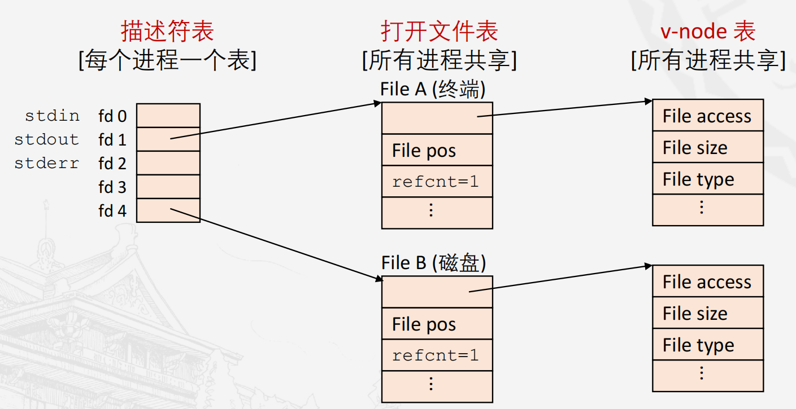
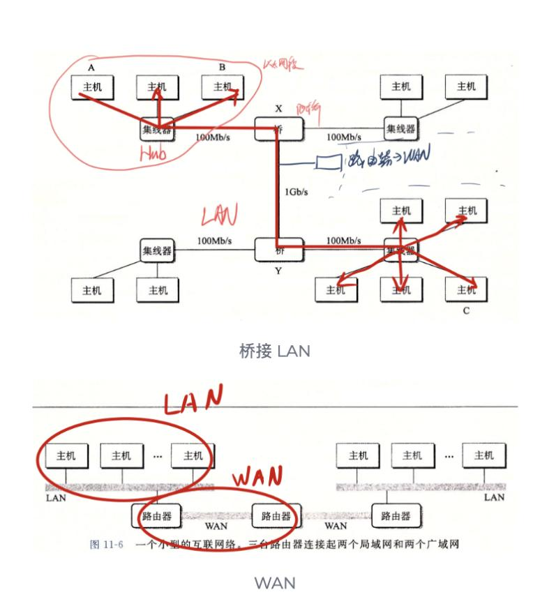
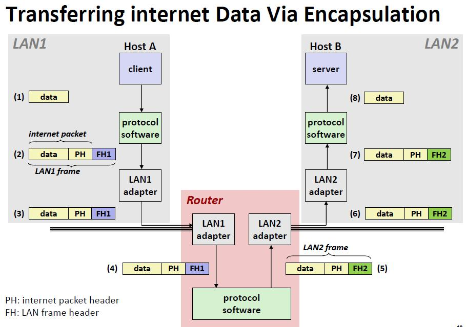
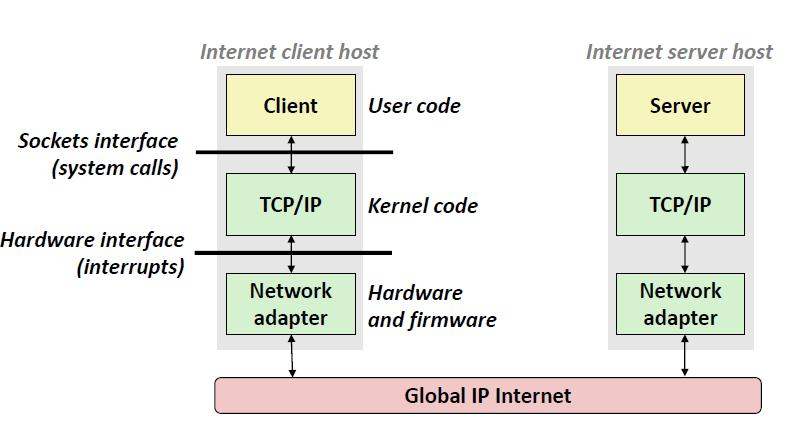
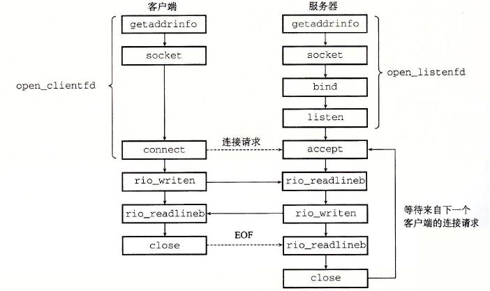

# 第八章 异常控制流

## 1 异常
### 1.1 基本概念
（1）是控制流中的突变，ECF 的一种形式，由硬件和操作系统实现。
（2）操作系统维护异常表，每一项指向一个异常处理函数；每类异常有个唯一的非负整数异常号。异常调用会压入内核栈中进行，异常处理程序运行在内核模式下。
### 1.2 分类
（重要！！异步=来自外部控制流，不保证顺序，同步=来自当前控制流指令的直接产物，保证顺序）

| 类别  | 原因           | 同步 or 异步？ | 返回行为       | 举例                                            |
| :-- | :----------- | :-------- | :--------- | --------------------------------------------- |
| 中断  | 来自 I/O 设备的信号 | 异步（only）  | 总是返回到下一条指令 | 外部定时器，I/O 请求，收到一个网络套接字                        |
| 陷阱  | 有意的异常        | 同步        | 总是返回到下一条指令 | 系统调用（read、execve、fork、exit）：内核层面运行，只能用寄存器传递参数 |
| 故障  | 潜在可恢复的错误     | 同步        | 可能返回到当前指令  | 除零、缺页、机器检查（缺页可以恢复，除法错误、一般保护错误、段错误不可恢复）        |
| 终止  | 不可恢复的错误      | 同步        | 不会返回       | 硬件错误                                          |
系统调用的参数传递
- 参数：`%rdi,%rsi,%rdx,%r10,%r8,%r9`
- 系统调用号：`%rax`
## 2 进程
### 2.1 进程的核心定义
进程是一个**运行中的程序实例**。它为程序提供了两个关键的抽象，让每个程序觉得自己“独占”了系统资源：
- **独立的逻辑控制流**：通过 CPU 的上下文切换，让程序觉得自己独占了 CPU。
- **私有的地址空间**：通过虚拟内存管理，让程序觉得自己独占了内存系统。
	- **隔离性**：一个进程对应的内存字节，其他进程无法直接进行读写访问。
	- **统一性**：尽管物理内存分散，但进程看到的地址空间通常是连续且布局一致的（例如 Linux 下的进程内存模型）。
### 2.2 进程上下文 (Process Context)
上下文是内核重新启动一个被抢占进程所需要的状态。
- **内存状态**：包括代码段（Code）、数据段（Data）、堆（Heap）、共享库以及用户栈（Stack）。
- **硬件状态**：
    - **寄存器**：通用寄存器、程序计数器（PC，保存下一条指令地址）。
    - **栈指针**：`%rsp`（指向当前栈顶）。
- **内核状态**：内核数据结构（如页表、进程表、打开的文件描述符信息等）。
### 2.3 上下文切换与多进程
操作系统通过**时间分片 (Time Slicing)** 在多个进程间快速切换，实现“伪并行”。
**上下文切换的过程（高开销）**：
1. **保存**当前进程的上下文。
2. **恢复**某个先前被抢占的进程保存的上下文。
3. **跳转**：将控制权传递给这个新恢复的进程（更新 PC 指针）。
### 2.4 并发与并行 
这是两个极易混淆的概念，其核心区别在于**硬件资源的分配**。

| **概念**               | **定义**                         | **核心特征**              |
| -------------------- | ------------------------------ | --------------------- |
| **并发 (Concurrency)** | 两个或多个流的时间在时间上**重叠**。           | 只要开始和结束时间有重叠，就是并发。    |
| **并行 (Parallelism)** | 并发流的子集，要求流运行在**不同的处理器核**或计算机上。 | 强调同一时刻，多个任务**同时**在执行。 |
- **并行流属于并发流**。
- 如果在单核 CPU 上轮流运行 A 和 B，它们是并发而非并行；如果在双核 CPU 上同时运行 A 和 B，它们既是并发也是并行。
### 2.5 用户模式与内核模式
硬件通过一个**模式位 (Mode Bit)** 来限制应用进程可以执行的指令及其可访问的地址空间。
- **用户模式 (User Mode, 0)**：
    - 限制进程执行特权指令（修改模式位、**执行I/O操作**、改变内存中的指令流）。
    - 禁止直接引用内核区的代码和数据，否则会导致保护故障，但是**可以通过/proc文件系统访问一部分内核数据结构的内容。**
- **内核模式 (Kernel Mode, 1)**：
    - 又称超级用户模式，可以执行任何指令，访问任何内存位置。
- **切换机制**：
    - 用户进程进入内核模式的**唯一**途径是通过**系统调用 (System Call)**、中断 (Interrupt) 或异常 (Exception)。
## 3 进程控制
### 3.1 进程识别与状态

#### 获取进程 ID
- **`getpid()`**: 返回当前进程的 PID。
- **`getppid()`**: 返回当前进程的父进程 PID。
#### 进程的三种状态
1. **运行（Running）**: 正在 CPU 上执行，或等待被调度。
2. **停止（Stopped）**: 进程执行被挂起（暂停），收到特定信号（如 `SIGTSTP`）后进入此状态，直到收到 `SIGCONT` 信号再次开始运行。
3. **终止（Terminated）**: 进程永久停止。原因可能是收到终止信号、从主程序返回或调用了 `exit` 函数。
### 3.2 进程创建：`fork()`
`pid_t fork(void)` 是 Unix 系统中创建新进程的唯一方式。
- **调用特点**：**调用一次，返回两次**。
    - 在**子进程**中返回 `0`。
    - 在**父进程**中返回子进程的 `PID`。
- **并发执行**：父子进程是独立的进程，并发运行，执行顺序由调度器决定。
- **资源继承与隔离**：
    - **相同但独立**：子进程获得父进程虚拟地址空间的完整副本（代码、数据、堆、栈），但物理内存通过“写时复制”保持独立。变量修改互不影响。
    - **文件共享**：子进程复制父进程的**打开文件描述符表**。这意味着父子进程共享相同的文件偏移量（指向同一个内核文件表条目）。
### 3.3 进程的退出与回收
#### 进程退出：`exit()`
- `void exit(int status)`：以 `status` 状态退出。
- `exit(0)` 表示正常退出，非零值表示错误。
- **注意**：`exit()` 会清理 I/O 缓冲区并调用终止处理程序，而 `_exit()` 是直接陷入内核。
#### 僵尸进程与回收 (Reaping)
当进程终止后，内核不会立即将其从系统中删除，而是保持在一种**终止状态（僵尸进程）**，直到被其父进程回收。
- **僵尸进程（Zombie）**：已终止但未被父进程回收的进程。仍占用系统资源（如 PID）。
- **孤儿进程（Orphan）**：父进程先于子进程终止。孤儿进程会被 `init` 进程（PID 1）领养并负责回收。
#### 回收函数：`wait` 与 `waitpid`
用于等待子进程终止或停止。

| **函数**                               | **用法与特性**                                                                  |
| ------------------------------------ | -------------------------------------------------------------------------- |
| **`wait(&status)`**                  | 等价于 `waitpid(-1, &status, 0)`。挂起父进程，直到**任意**一个子进程终止。                       |
| **`waitpid(pid, &status, options)`** | **更灵活的回收方式**：<br>1. **`pid > 0`**: 等待特定子进程；<br>2. **`pid = -1`**: 等待所有子进程。 |
**Options 常用宏（可用 `|` 组合）：**
- **`WNOHANG`**: 若没有子进程终止，立即返回 0，不挂起。
- **`WUNTRACED`**: 挂起直到有一个子进程终止或**停止**。
- **`WCONTINUED`**: 挂起直到一个运行进程终止或收到信号重新开始执行。
### 3.4 进程休眠
- **`sleep(unsigned secs)`**: 让进程挂起指定秒数。若时间到返回 0，若被信号中断则返回剩余秒数。
- **`pause()`**: 让调用进程休眠，直到收到一个信号。
### 3.5 加载并运行程序：`execve()`
`int execve(const char *filename, char *const argv[], char *const envp[])`
- **功能**：在当前进程中加载并运行新程序。
- **特点**：
    1. **覆盖现状**：新程序会**覆盖当前进程的代码、数据、栈和堆**。
    2. **保持不变**：**PID、打开的文件描述符、信号上下文**在加载后保持不变。
    3. **不返回**：除非发生错误（返回 -1），否则 `execve` 调用成功后永远不返回。
## 4 信号 (Signals)
信号是一种**异步**异常控制流，允许内核、进程或用户在应用层处理异常。
###  4.1 常见信号类型
需要重点区分以下信号及其默认行为：

| **信号名称**      | **来源/含义**              | **默认行为**       |
| ------------- | ---------------------- | -------------- |
| **`SIGINT`**  | 来自键盘的中断（Ctrl+C）        | 终止             |
| **`SIGTSTP`** | 来自终端的停止信号（Ctrl+Z）      | 暂停直到 `SIGCONT` |
| **`SIGSTOP`** | 非终端发出的停止信号             | 暂停（不可被捕获/忽略）   |
| **`SIGCONT`** | 继续执行已停止的进程             | 忽略             |
| **`SIGCHLD`** | 子进程停止或终止（**注意：无字母 I**） | 忽略             |
| **`SIGALRM`** | `alarm` 函数设置的定时器信号     | 终止             |
| **`SIGKILL`** | 杀死程序信号                 | 终止（不可被捕获/忽略）   |
### 4.2 信号的发送机制

- **Shell 机制**：Shell 代表用户运行程序。后台作业以 `&` 结尾；前台作业未完成前，Shell 不执行下一条命令。
-  **进程组**：每个进程都只属于一个进程组，从前面的进程树状图中我们也能大概了解一二，想要了解相关信息，一般使用如下函数：
	- `getpgrp()` - 返回当前进程的进程组
	- `setpgid()` - 设置一个进程的进程组
- **`/bin/kill` 程序**
	- `pid > 0` 发送给特定进程
	- `pid < 0` 发送给进程组 `|pid|` 内所有进程
- **键盘输入**：
    - `Ctrl+C` $\rightarrow$ 发送 `SIGINT` 给前台进程组。
    - `Ctrl+Z` $\rightarrow$ 发送 `SIGTSTP` 给前台进程组。
- **系统调用**：
    - `int kill(pid_t pid, int sig)`：
	    - `pid > 0`，发送信号`sig`给进程`pid`
	    - `pid = 0`，发送给调用者所在组的所有进程（包括调用进程自己）
	    - `pid < 0`，发送给进程组 `|pid|` 内所有进程
    - `unsigned int alarm(unsigned int secs)`
	    - 在 `secs` 秒后发送 `SIGALRM`
	    - 若 `secs = 0` 则取消所有闹钟(`alarm`)
### 4.3 信号的接收与处理
- **接收时机**：内核从内核模式切换回用户模式时（如从系统调用返回或完成上下文切换），会检查并强制处理未阻塞的待处理信号。
- **待处理信号 (Pending)**：
    - **不排队**：一种类型的信号最多只能有一个待处理。若已有同类型待处理信号，后续到达的该信号会被直接丢弃。    
    - 内核使用位向量（Pending 和 Blocked）来维护状态。    
- **信号处理程序 (Handlers)**：
    - 处理程序可以被更高优先级的信号打断，但**同类型信号不能打断自己**（此时该信号被阻塞）。    
    - **限制**：`SIGKILL` 和 `SIGSTOP` 不能被捕获、阻塞或忽略。   
### 4.4 阻塞和解除阻塞信号

> [!NOTE] 阻塞的概念
> 阻塞≠丢弃，**只是暂时不处理**
#### 隐式阻塞
- **含义：**  当一个进程或线程正在执行某个信号（如 `SIGINT`）的**信号处理函数**（Signal Handler）时，内核会自动将该信号**阻塞**。
- **目的：**  这是为了防止同一个信号在处理过程中重复发生，导致递归调用信号处理函数，从而引发堆栈溢出或数据不一致等问题，确保信号处理的安全性和完整性。
- **示例：**  当 `SIGINT` 信号的 Handler 正在运行时，如果又来了一个 `SIGINT` 信号，它会被暂时挂起（Pending），直到当前的 Handler 完成执行并返回，内核自动解除对该信号的阻塞后，挂起的信号才会被递送。
#### 显式阻塞——sigprocmask函数
自动阻塞只发生在执行信号处理函数期间。如果用户程序需要在**非信号处理函数期间**临时禁用或启用某些信号的递送，以保护关键代码段（如防止在修改共享数据时被信号中断），就需要使用**显式阻塞**。
```C
int sigprocmask(int how, const sigset_t *_Nullable restrict set,
                          sigset_t *_Nullable restrict oldset);
```
#### 参数
- `sigprocmask()` 的行为取决于参数 `how` 的值，它指示了如何修改信号屏蔽字：
  - `SIG_BLOCK`：将 `set` 中的信号**添加到**当前的阻塞集合中（求并集）。
  - `SIG_UNBLOCK`：将 `set` 中的信号从当前的阻塞集合中**移除**（解除阻塞）。
  - `SIG_SETMASK`：将当前的阻塞集合**直接设置为** `set` 中的信号。
- 如果 `oldset`​​非空（non-NULL），则信号屏蔽字的**先前值**会存储在 `oldset` 中。
- 如果 ​`set`​​ 为空（NULL） ，则信号屏蔽字保持**不变**（`how` 参数会被忽略），但当前信号屏蔽字的值仍会通过 `oldset` 返回（如果 `oldset` 非空）
#### 返回值
成功则返回0，失败则返回-1并且设置errno
#### 注意事项
- 在多线程进程中，`sigprocmask()` 的行为是**未定义的**，推荐使用`pthread_sigmask(3)`来代替。
- 通过 `fork(2)` 创建的子进程会继承其父进程信号屏蔽字(`mask`)的一个副本，信号屏蔽字会在 `execve(2)` 调用中被保留。
#### 其他辅助函数
- `sigemptyset` - 创建空集
- `sigfillset` - 把所有的信号都添加到集合中（因为信号数目不多）
- `sigaddset` - 添加指定信号到集合中
- `sigdelset` - 删除集合中的指定信号
```C
/* 下面这段代码用于临时阻塞特定的信号 */
sigset_t mask, prev_mask;
Sigemptyset(&mask); // 创建空集
Sigaddset(&mask, SIGINT); // 把 SIGINT 信号加入屏蔽列表中

// 阻塞对应信号，并保存之前的集合作为备份
Sigprocmask(SIG_BLOCK, &mask, &prev_mask);

...
... // 这部分代码不会被 SIGINT 中断
...

// 取消阻塞信号，恢复原来的状态
Sigprocmask(SIG_SETMASK, &prev_mask, NULL);
```
### 4.5 显式等待信号
```C
int sigsuspend(const sigset_t *mask); // 函数声明：等待信号到来，并临时替换信号掩码
```
暂时使用提供的信号集替换当前的信号屏蔽字，并在收到信号后恢复原来的信号屏蔽字
等价于原子化版本的：
```C
sigprocmask(SIG_SETMASK, &mask, &prev); // 设置新的信号掩码，保存旧的信号掩码到 prev
pause(); // 暂停进程，直到接收到信号
sigprocmask(SIG_SETMASK, &prev, NULL); // 恢复之前的信号掩码
```
### 4.6 编写安全的信号处理程序
信号处理程序与主程序并发运行，可能引发竞争，必须遵循以下准则：
1. **处理程序尽可能简单**。
2. **仅调用异步信号安全函数**：
    - **安全**：`write`（唯一安全的输出函数）、`_exit`、`waitpid`。  
    - **不安全**：`printf`、`sprintf`、`malloc`、`exit`。   
3. **保存和恢复 errno**：防止处理程序修改主程序的错误码。
4. **阻塞所有信号，保护共享全局数据结构**。
5. **使用 `volatile`声明全局变量**：禁止编译器优化，确保每次都从内存读取变量值。
6. **用 `volatile sig_atomic_t` 来声明全局标识符(flag)**：防止出现访问异常
7. **可重入性**：可重入函数不访问全局/静态变量（仅访问局部变量），它们一定是异步信号安全的。
## 5 非本地跳转 (Nonlocal Jumps)
非本地跳转用于从深层嵌套的函数调用中直接返回，常用于错误处理。
- **`setjmp(env)`**：
    - 在当前位置保存栈上下文（PC、栈指针等）到 `env`。
    - **调用一次，返回多次**：直接调用返回 0；通过 `longjmp` 返回时，返回非 0 值。
- **`longjmp(env, val)`**：
    - 从 `env` 中恢复状态，并跳转回最近一次 `setjmp` 处。
    - **调用一次，永不返回**。

# 第九章 虚拟内存

## 第一部分 虚拟内存基本概念

### 1. 虚拟内存基本概念 物理、虚拟寻址和地址空间
（1）虚拟内存是物理内存和磁盘结合的一种内存机制，为每个进程提供大、一致、私有的地址空间。一般会把主存看作磁盘上地址空间的 Cache，只保留最近活动的区域。
（2）CPU 可以生成虚拟地址来访问内存，VA 翻译到 PA 的过程由内存管理单元 MMU 执行。
（3）物理地址空间 PAS 对应于物理内存的 M 个字节，M 可以不是 2 的幂（相应的，虚拟空间必须是 2 的幂）。
### 2. 页与缓存
（1）虚拟内存和物流内存被分割成大小固定且相同的块：虚拟页 VP 和物理页 PP
- 每个块的大小为 $P=2^p$ 字节。
- VP 集合中有三个不相交的子集合
	- unallocated（未创建的页，不占磁盘空间）
	- uncached（没有换存在物理内存中的 allocated 页）
	- cached
- 请注意：“页”的定义是一个基本单元大小，可以理解成一种对齐要求/一种单位，可能不存储任何实际的内容。
（2）DRAM 全相连主存被用作物理页的缓存，已经分配的虚拟页和一个物理页关联。DRAM 的不命中代价很高——因为访问磁盘很慢。总是采用回写策略。
（3）页表是一个将虚拟页映射到物理页的数据结构，实际上是一个 PTE 的 vector，每个 VP 在页表的一个固定偏移量处都有一个 PTE，用以提供将 VA 转换为 PA 的信息。页表存储于主存 DRAM 中的内核部分。PTE 有有效位=1 表示在 DRAM 中缓存，0 看是否为空地址——是则 unallocated，否则是指向磁盘中的地址。
（4）页命中与 Page Fault（Recall：Page Fault 属于故障）：当 valid=0 时会触发缺页，选择牺牲页进行替换，若牺牲页被修改则复制回磁盘中，最后要修改牺牲页的 PTE。
（5）一般而言，只有对一个页的引用产生 page fault 才会复制此页到 DRAM 中。加载器从不从磁盘到内存实际复制任何数据。
（6）内存映射：将一组连续虚拟页映射到任意文件（后续的 mmap）。
### 3. VM 用作内存保护
（1）内存分配：请求内存分配时，OS 分配适当数字个连续虚拟内存页面映射到物理内存中的任意物理页面（连续——任意）。
（2）用户进程的四条准则：不能修改只读段、不能读写内核中的任何代码与数据结构、不能读写其他进程的私有内存、不能修改与其他进程共享的虚拟页面（除非所有共享者都允许）。违反以上准则会触发一般保护错误，特别的，在 Linux 中直接报告为段错误（SEGV）。
### 4. 地址翻译
设 $M=2^m$、$N=2^n$、$P=2^p$ 表示物理/虚拟地址空间中的地址数量和页的大小
（1）$VPN 位数=n-p$，$PPN 位数=m-p$（可见不一定相等，一般总 $VPN<=PPN$），$VPO=PPO=p$（数值、位数都一样）。
（2）$VPN=TLB=TLBT+TLBI$。和 PPN 没什么关系。
（3）$PPN|PPO$=物理地址（拼起来）。
（4）一般翻译过程之命中（单级、无 TLB）
a. 处理器生成虚拟地址传送给 MMU。
b. MMU 生成 PTE，从高速缓存（对于虚拟内存，高速缓存是一个抽象的思想，此处代指的是 DRAM 主存）中请求得到这个 PTE。
c. 高速缓存向 MMU 返回 PTE——内容是 PPN。
d. MMU 构造物理地址并传送给高速主存。
e. 高速主存返回请求的数据。
（5）一般翻译过程之 Page Fault（单级、无 TLB）
a. 与之相同
b. 与之相同
c. 与之相同
d. 由于 valid=0，触发 Page Fault，缺页处理程序（打断）判定 PTE 需要到主存中找。
e. 确定牺牲页，如果需要复制到磁盘中。
f. 调入新页面，更新 PTE。
g. 缺页处理程序返回到原来进程，再次执行导致 Page Fault 的指令（对应返回当前指令），使得命中。后同。
### 5. 地址翻译的优化（对应不同的考察模式，此处没有列举：页表自映射、权限位）
（1）综合 SRAM Cache 与虚拟内存（考得少）
相当于引入两级 Cache，SRAM Cache 比 DRAM Cache 更快，SRAM Cache 有 PTE 和 PA。注意：无论是哪个 Cache，都没有权限位。
（2）引入 TLB 加速翻译（高频考点）
a. TLB 位于 MMU 中，是虚拟寻址的、高度相连的 Cache，存储完整的 PTE。
b. TLB 命中时，地址翻译直接在 MMU 中进行，无需访问任何 Cache。
c. 计算 TLB 时，一定要拆开 TLBT 与 TLBI！特别是 TLBI 位数不是 4 的倍数时，一定记得移动位置（VPN、VPO 计算时同理）。
d. TLB 不命中时，MMU 从 L1 Cache 中取出相应的 PTE 后放在 TLB 中（即需要写回修改！！）。上述情况在多级下则是拼好 PPN 后写回并且取数据。
e. 一次翻译可能产生多次 miss：TLB miss——从页表中取 PTE，需要的 data 不在 Cache 中也是 miss。
（3）多级页表（高频考点）
a. 当页表的各个片在内存中不是连续存放时引入地址索引——页目录与多级页表机制。
b. 上一级的 PTE 剥离无关信息后+处理后永远指向的是当前级页表的基址（前提是至少有一个页面已经分配，否则为 nullptr）。
c. TLB 会将不同级的 PTE 缓存起来，保证不比单级慢太久。
d. 大页：让倒数第二级页表能一步到位（现有的大小乘上一次 $2^VPN$）；超大页：能让倒数第三级页表能一步到位（乘两次）。
e. 一级页表需要常驻在主存中。

### 地址翻译例题
某个具有内存管理单元（MMU）的计算机系统拥有以下特性：
（1）14-bit的虚拟地址，12-bit的物理地址，每个页包含64字节（Page Size）。
（2）后备缓冲表（TLB）采用4路组相连的方式进行组织，可以缓存16个页表项。
（3）高速缓存（Cache）采用直接映射的方式进行组织，缓存共分为16组，每组包含1个块，每个块大小为4个字节。高速缓存只用于缓存通用数据
缓存页表。
（4）页表只有一级。
（5）处理器只支持大端字节序
在当前时刻，系统中TLB的状态如下：

| **组索引** | **Tag** | **PPN** | **Valid** | **Tag** | **PPN** | **Valid** | **Tag** | **PPN** | **Valid** | **Tag** | **PPN** | **Valid** |
| ------- | ------- | ------- | --------- | ------- | ------- | --------- | ------- | ------- | --------- | ------- | ------- | --------- |
| **0**   | 03      | —       | 0         | 09      | 0D      | 1         | 00      | —       | 0         | 07      | 02      | 1         |
| **1**   | 03      | 2D      | 1         | 02      | —       | 0         | 04      | —       | 0         | 0A      | —       | 0         |
| **2**   | 02      | —       | 0         | 08      | —       | 0         | 06      | —       | 0         | 03      | —       | 0         |
| **3**   | 07      | —       | 0         | 03      | 0D      | 1         | 0A      | 34      | 1         | 02      | —       | 0         |
页表状态如下(只列出了前16项)：

| VPN    | PPN | Valid | VPN    | PPN | Valid |
| :----- | :-- | :---- | :----- | :-- | :---- |
| **00** | 28  | 1     | **08** | 13  | 1     |
| **01** | —   | 0     | **09** | 17  | 1     |
| **02** | 33  | 1     | **0A** | 09  | 1     |
| **03** | 02  | 1     | **0B** | —   | 0     |
| **04** | —   | 0     | **0C** | —   | 0     |
| **05** | 16  | 1     | **0D** | 2D  | 1     |
| **06** | —   | 0     | **0E** | 11  | 1     |
| **07** | —   | 0     | **0F** | 0D  | 1     |
Cache状态如下：

| **组索引** | **Tag** | **Valid** | **Data (0)** | **Data (1)** | **Data (2)** | **Data (3)** |
| ------- | ------- | --------- | ------------ | ------------ | ------------ | ------------ |
| **0**   | 19      | 1         | 99           | 11           | 23           | 11           |
| **1**   | 15      | 0         | —            | —            | —            | —            |
| **2**   | 1B      | 1         | 00           | 02           | 04           | 08           |
| **3**   | 36      | 0         | —            | —            | —            | —            |
| **4**   | 32      | 1         | 43           | 6D           | 8F           | 09           |
| **5**   | 0D      | 1         | 36           | 72           | F0           | 1D           |
| **6**   | 31      | 0         | —            | —            | —            | —            |
| **7**   | 16      | 1         | 11           | C2           | DF           | 03           |
| **8**   | 24      | 1         | 3A           | 00           | 51           | 89           |
| **9**   | 2D      | 0         | —            | —            | —            | —            |
| **A**   | 2D      | 1         | 93           | 15           | DA           | 3B           |
| **B**   | 0B      | 0         | —            | —            | —            | —            |
| **C**   | 12      | 0         | —            | —            | —            | —            |
| **D**   | 16      | 1         | 04           | 96           | 34           | 15           |
| **E**   | 13      | 1         | 83           | 77           | 1B           | D3           |
| **F**   | 14      | 0         | —            | —            | —            | —            |
说明：VPN: 虚拟页号； VPO: 虚拟页偏移量 PPN:物理页号; PPO: 物理页偏移量
基于以上材料请作答：
- 请计算在14-bit的虚拟地址中，VPN的位长（ 空1 ）bit，VPO的位长（ 空2 ）bit。
	- 页大小为64字节=$2^6$,则VPO的位长为6 bit，VPN位长为14-6=8 bit
- 计算在12-bit的物理地址中 PPN的位长（空3 ）bit，PPO的位长（ 空4 ）bit。
	- PPO位长=VPO位长=6 bit，PPN位长=12-6=6 bit
- 当处理器加载**虚拟地址**为0x036a的**short类型**数据时，请完成下面填空内容，并计算最终加载到的short类型数据的值。
	- 先将0x036a转换成2进制——$(00001101101010)_2$
	- VPN为 0x（空5）, VPO为 0x（空6），TLBI为0x（空7），TLBT为0x（空8），TLB（空9）（命中/未命中）
		- VPN为前8位，$(00001101)_2=(0x0D)_16$,VPO为后6位，$(101010)_2=(0x2A)_{16}$
		- **TLB 组数**：总容量 / 相连度 = $16 / 4 = 4$ 组。
		- **TLBI 位数**：为了区分 4 个组，需要 $log_2(4) = 2$ 位。
		- $VPN=[TLBT|TLBI]$，所以TLBT为$(000011)_2=(0x03)_{16}$，TLBI为$(01)_2=(1)_{16}$
		- 查表得到TLB命中，PPN为2D
	- PPN为0x（空10），物理地址为0x（空11）
		- 物理地址为PPN|VPO=$(101101101010)_2=(0xB6A)_{16}$
	- CT为0x（空12）， CI为0x（空13），CO为0x（空14），高速缓存（空15）（命中/未命中），最终数据为0x（空16）
		- 因为一共有16组，所以CI=log_216=4，CO取决于块大小（4字节），因此是log_24=2
		- CT=12-CI位个数-CO位个数=6位
		- 所以CT=2D，CI=(1010)=(A)，CO=(10)=(2)
		- 查表得高速缓存命中，由于是short类型，所以从偏移量2处读取2个字节
## 第二部分 虚拟内存的相关例子

### 1. TLB 与上下文切换
由于 TLB 中保存的地址与进程有关，因此进程上下文切换后，原有的地址一般不使用。两个解决方案：
a. 每次切换进程上下文时刷新 TLB（默认用这个）。
b. 为 TLB 条目增加进程 ID。
### 2. Intel Core i7
只需注意满足四个 VPN 大小相等（一般都这样），第四级页表没有 PS 位（第 3 级中出现，定义页表大小），而是 D 位（Dirty，是否被修改，是则为 1）。
### 3. Linux 系统中的虚拟地址空间
分为进程虚拟内存、内核虚拟内存——其中内核代码与数据、物理内存对每个进程一样，与进程有关的数据结构则不一样。
### 4. Linux 中几种页相关的故障
（1）Segmentation Fault 段错误：访问不存在的页（eg 未分配的页表对应的地址空间）。
（2）普通 Page Fault：按照缺页程序重新调度即可。
（3）General Protection Fault 一般保护错误：执行与当前页面权限不符合的操作，例如试图写一个只读页。在 Linux 中报告为段错误（除非题目中明确提报告为 xx，一般写原始的）。
### 5. 内存映射与 COW 机制
试图写入一个 Private 地址时才会引发复制，否则一般只是先指向区域但不复制。
### 6. 关于 execve 与 mmap
（1）execve 要干的几个事情：删除已经存在的用户区域、映射私有区域（为新代码、数据、bss 和 stack 区创建新的区域结构，其中 bss 会被映射为匿名文件）、映射共享区域（动态链接到程序再映射到共享区域内）、最后设置 PC 指向入口点。
（2）mmap 用于创建新的虚拟内存区域，将一个 fd 指定的连续片映射到新区域。prot=访问权限位一般用|连接，PROT_NONE 表示不可以访问。flags 表明位组成，比较特殊的是 MAP_ANON，表示被映射的对象为匿名对象。munnap 删除虚拟内存区域。注意，如果是 shared，会导致磁盘内容连带着被修改。
## 第三部分 动态内存分配

### 1. 碎片（重要）
a. 内部碎片指的是一个已分配的块比有效载荷大的碎片（例如：对齐要求、维持结构的额外字段、分配策略）。仅取决于实现方式和以前的请求模式。
b. 外部碎片指的是明明有足够的内存，但是是散开的，导致出现不能分配的空闲块。取决于实现方式，以前和将来的请求模式。
### 2. 隐式链表与显式链表的区别
显式链表使用显式的指针指向下一个未分配的块。未分配块内增加 next 和 prev 指针以构成 free list 双链表，已分配块内没有该指针。注意隐式链表中有 footer，是 header 在末尾的简单 copy，目的在于减少查看上一个块是否分配所用的时间，由 $O(size\_of\_chunk)$降低为常数时间。
### 3. Garbage collection
（1）Mark&Sweep 是保守的，检查所有可能为指针的内容（text 中不可能，不查）。
（2）标记-扫描回收：不移动已经分配的块。
（3）root nodes：不在堆上但是有指向 heap 指针的节点（regs、stack 上的变量、global 变量）。
# 第十章 系统级 I/O

## 1 文件
### 普通文件
- 文本文件（只含有 ASCII 与 Unicode）
- 二进制文件（else）
- 对内核来说，二进制文件和文本文件**没有任何区别**。
### 目录文件
- 由一系列链接形成的数组，每一项是文件名到文件的链接。
- 每个目录文件必定出现条目是‘.’（表示当前目录）和‘..’（表示上一级目录）。
- 使用 mkdir 创建新目录文件，ls 列出当前目录下内容，rmdir 删除**空**目录。
- 绝对路径以/开始，表示从根目录开始的路径
- 相对路径表示从 cwd（current working directory）开始的路径，以文件名开始，一般是. /或../。
### 套接字
本质上也是文件描述符。
## 2 打开和关闭文件
### 打开文件
`int open(char* filenames, int flags, mode_t mode)`
- open 函数返回的总是当前进程中没有打开的最小描述符。默认打开 `0-stdin`、`1-stdout`、`2-stderr`。
- flags 可以用`|`连接，常见的有 ORDONLY、OWRONLY、ODRWR、OCREAT（若文件不存在则创建一个空文件）、OTURNC（若文件已存在则清空之）、OAPPEND（每次写操作前总是设置文件位置到结尾处）。 
- mode 一般是新文件的访问权限位。
### 关闭文件
用 `close` 函数关闭打开的文件，关闭已关闭的文件会出错。
## 3. 读写文件（ssize_t = signed size_t）
（1）ssize_t read(fd,buffer,n)，返回实际传送的字节数，0=EOF，-1=error。
（2）ssize_t write(fd,buffer,n)，返回实际写入的字节数，-1=error。
（3）lseek 改变文件指针的位置。
（4）不足值：传送字节数比要求的要少。不是错误。可能原因：
a. read 遇到 EOF
b. 从终端读
c. 读写（较长的）socket
d. Unix pipe
e. 特别注意：**除了 EOF 外，从磁盘读写时不会遇到不足值**。
## 4. 用 RIO 包健壮地读写
（1）C 标准 I/O 函数中的高级 I/O 函数：在 libc.so 中定义，比系统级 I/O 函数更高层次的。进行了另一层抽象：将文件描述符和流缓冲区进行抽象操作（UNIX I/O 按照字节进行操作）。
（2）关于缓冲区
a. 由于引用程序经常只读写少量字符，因此每次都调用 System I/O 函数是不合算的：系统调用耗费时间很长。
b. 引入缓冲区：读时调用 read 读一大块内容填充流缓冲区，再从缓冲区中逐步读入引用程序；写时写入流缓冲区，直到进程退出、缓冲区满、遇到换行等情况调用 write 批量写入。例如：连续调用 printf 输出单个字符不一定会导致 write 调用，直到使用了 fflush(stdout)才输出。主要是为了减少 syscall 以加速提效。
（3）rio_readn&rio_writen：rio_readn 只在遇到 EOF 时返回不足值，rio_writen 不返回不足值，可以对同一个描述符交错使用。二者是不带缓冲区的（函数名没 b）。
（4）rio_readlineb, rio_readnb：线程安全，也可在同一个描述符上交错使用。rio_readlineb 读一个文本行直到到达 maxlen 长/遇到 EOF/遇到换行符。rio_readnb 读最多 n 字节，直到到达最大值长/遇到 EOF。名字带 b，有缓冲区。
（5）带缓冲区（带 b 的）的和不带缓冲区（无 b 的）的严禁混用！！！
## 5. 共享文件（核心重点！！！）
（1）描述打开文件的三个数据结构
- 描述符表（每个进程一个且各自独立）
	- 描述符表中为每个进程打开的文件描述符，默认打开 012 为 stdin/out/err，和终端有关。
- 打开文件表（所有进程共享）
	- 打开文件的集合
	- 每个文件表项含
		- 当前文件位置（指针位置）
		- 引用计数
		- 指向 v-node 表中对应表项的指针等。
		- 关闭一个描述符会减少相应文件表项中的引用计数，当引用计数为 0 时，内核删除这个文件表项。对应一次打开操作。
- v-node 表（所有进程共享）
	- 每个表项包含 stat 中大多数信息，多个描述符可通过不同文件表项引用同一个文件。对应一个文件，可以有多个打开文件表表项指向同一个 v-node 表项。
（2）关于共享文件的常见三种操作（重中之重！）
a. 使用 open 打开文件
默认把给最小的未使用 fd 连接到新创建的文件表上。特别注意：两次 open 同一个文件时会创建两个打开文件表，默认情况下（除了 OAPPEND 等特殊要求）文件位置指针独立互不干扰。
b. dup 与 dup2
dup2(oldfd, newfd) 将 oldfd 复制到/覆盖 newfd——使 newfd 指向的变成 oldfd 指向的，使后者变成前者（后变前后变前后变前！！！）newfd 可以是未打开的 fd，若 newfd 已打开，则复制前先关闭。
dup(oldfd)返回一个指向 oldfd 同样的文件表项的描述符（共享文件位置指针等）。
（3）fork 创建新进程：创建一个与父进程相同但独立的 fd 表，指向相同的打开文件表（共享文件位置指针等，父位置变子也变）。
（4）大部分情况下，我们认为缓冲区对进程独立。把它当成一个 private 的数组。

### 在shell中如何实现重定向I/O（以`ls>out.txt`为例）
1.父进程fork子进程
2.子进程`open(out.txt)`：文件描述符表新增`fd = 4` 

3.关闭fd=1
4.dup2(4,1)
5.execve(ls)


## 6. 三种 I/O 函数的总结比较（重点掌握这个）
（1）UNIX I/O：read、wirte、open、close 等。最底层，可以提供例如访问元数据的操作，异步信号安全，可以在信号处理函数中使用，但作为系统调用消耗资源大，对于不足值处理较差。
（2）C Standard I/O：fopen、fclose、fread、fwrite（按字节）、fgets、fputs（按行）、scanf、fprintf（格式化）：全双工=双方向传输，可在同一个流上输入输出，增加了缓冲区，自动处理不足值，但不是异步信号安全的函数，对于网络套接字的读写不一定正确。
（3）RIO I/O：增加处理不足值、缓冲区的情况。
（4）总结比较
a. 使用 UNIX I/O：信号处理函数内，对性能有特别的要求时。
b. 使用 C 标准 I/O：对磁盘或终端文件进行读写。
c. 使用 RIO：读写网络套接字。
d. 对于二进制文件，不应该使用文本导向的 I/O：fgets、scanf、rio_readlineb（不用两行+scanf），也不应该用 str 开头的字符串函数。
# 第十一章 网络编程

## 1. 客户端-服务器模型
模型中所有概念的都是【进程】，客户端进程与服务器进程进行通信。二者甚至可以在同一台主机上。
## 2. 网络
- 网络是一种 I/O 设备（对主机而言），通常使用 DMA（Direct Memory Access，直接内存访问）传输
	- 网络是一种按照地理远近组成的层次系统（物理上而言）。
	- 本质上和从磁盘/终端进行文件读写没有区别。
- 物理上最底层是 LAN（Local Area Network，局域网），以太网（Ethernet）是一种 LAN 技术技术。
	- 以太网由：主机、集线器（Hub）——不加分辨地转发到所有端口且是全部复制（因此每个主机都能看到每个位但只有目的端口复制）组成。
	- 桥接以太网是由网桥（Bridge）——根据算法有选择性的、仅当必要时转发到端口，连接几个以太网。
	- 我们一般认为一个 LAN 帧=LAN 帧头+互联网络包（有效载荷）组成。
- WAN（Wide Area Network，广域网）是由路由器连接若干 LAN 组成的。

- 进一步地，路由器将多个不兼容（跨协议）的 LAN 局域网连接，形成 internet（互联网，小写）。
- Internet（全球 IP 因特网，注意是大写=特有名词=具体实现），是 internet 互联网的具体实现。
- 网络协议：包括命名机制和传送机制，以协议软件为实现。
	- 命名机制：定义一致的主机地址格式，每台主机被分配至少一个互联网络地址，该地址唯一标识主机。
	- 传送机制：定义一种将数据位捆扎成不连续片（包）的同一方式，包：包头+有效载荷（参考前面的帧），包头含有包的 payload 大小以及源/目的主机地址，有效载荷为从源主机发出的数据位。
	- 基本封装方式：在数据前加互联网包头和 LAN 帧头（注意这里是协议封装，所以是两次）。
	- 概念区分：帧的有效载荷=互联网包，互联网包的有效载荷=数据。
	- 来源于公式：帧=LAN 帧头+互联网包；互联网包=互联网包头+数据。
	- 两个公式中后面的才是每层意义上的有效载荷。

说明：局域网、路由器中均有协议软件，局域网中的路由器进行封装/剥落（直接两层），路由器中协议软件的则负责更换 LAN 帧头，不改变互联网包头。

## 3. 全球 IP 因特网（Internet）

（1）Internet 是 TCP/IP 协议簇的（本部分内容的每个字都极其重要）
注意：本课程中，可靠的等价于面向连接的。

a. IP 是网络层协议，给每台电脑分配一个唯一的 32 位 IP 地址，并传送 Datagram（数据包）到正确的地址，是不可靠的（不保证数据包一定到达目的地，不重传），是主机到主机之间，无连接也非面向连接。

b. UDP 是传输层协议，建立在 IP 协议上，允许 Datagram 在不同的进程之间传送，不可靠，是进程到进程之间，无连接也非面向连接。

c. TCP 也是传输层协议，建立在 IP 协议上，使得 Stream（字节流）在不同的连接的进程之间（即进程对之间）传送，可靠，连接也面向连接。特别的还是全双工的。

d. （事先写出来，方便比对复习，且确实常考，但教材上 http 不在此处出现）
HTTP 是应用层协议，建立在 TCP 协议上，在 Web 客户端和服务器之间传输 Web Content（超文本数据，如 HTML 文档、图片、视频等），可靠，连接也面向连接。

e. 以上协议中，在应用层的 HTTP 属于 User Code，在网络层的 IP、在传输层的 TCP/UDP 属于 Kernel Code。

（2）系统通过套接字接口 Socket 和 Unix I/O 函数进行通信，TCP/IP 协议需要在内核模式下运行。

（3）主机地址被映射为一组 32 位 IP 地址；这组 IP 地址又被映射为一组因特网域名的标识符（可见 IP 与域名是多对多的关系）；因特网主机上的进程能够通过连接和任何其他因特网上的进程进行通信。

（4）协议栈



从上到下：应用层，传输层，网络层，数据链路层，物理层

应用层：http, imap, smtp, dns
传输层：tcp，udp
网络层：ip，icmp
数据链路层：ethernet，802.11，802.3，PPP

（5）关于 IP 地址

a. 顺序：永远是大端法，与机器无关

b. IPv4 使用 32 位 IP 地址，点分十进制表示；特别的 127.0.0.1 是本机地址（回送地址）

（6）关于域名

a. 是全球性大型分布式数据库，使用 DNS 协议（Domain Name System，域名系统）。

b. 域名和 IP 是多对多的关系，域名可能不对应任何 IP，反之亦然。

c. 用 hostname -i 和 nslookup 查看主机/指定域名的 IP（Linux）。

（7）基于 TCP 协议与套接字实现的因特网连接

a. TCP 的性质（三条）

点到点的连接：连接两个进程

全双工：可以同时从连接的两个方向收发数据

可靠：保证一端发送的字节流一定能以相同字节顺序在另一端被接收

b. 套接字：是一个连接的终端，地址由 ip:port 对组成

c. TCP 套接字是一个五元组，由连接双方的 ip, port 以及协议名唯一标识

d. ip 是 32 位无符号整数，port 是 16 位短整数（常考计算题）。

e. 端口分为知名端口（well-known）以及临时端口（ephemeral），知名端口包括 http 协议的 80 端口（https 使用 443），ftp-21，ssh-22，smtp-25，echo-7

f. 知名端口供提供相应服务的服务器使用，其他进程一般不能占用（比如如果要用服务器的网页服务，此时客户端不可以用 80 端口）



本图像必须全部默写，一字不差。说明：getaddrinfo 获取地址，socket 创建套接字。

## 4. Web Service

（1）关于 HTTP 协议（很重要）

a. Web 服务使用 HTTP（HyperText Transfer Protocol，超文本传输协议），是建立在 TCP 之上的应用层协议，客户端与服务器间传送 Web Content，连接且面向连接，可靠。

b. HTTP 服务器使用 80 端口。

c. 关于 HTTPS：不是复数！HTTP+SSL/TLS=HTTPS。

（2）静态内容与动态内容（比较重要）

a. 静态内容：内容以磁盘文件形式存储，包括 HTML 文件，图片，音频，JavaScript 程序等。

b. 动态内容：内容需要由程序动态执行产生，文件包含可执行代码。

（3）URL 与 URI

a. URL（Universal Resource Locator，通用资源定位符）：每一个网页对象都与一个 URL 相连接。格式为：冒号（：）后面指明端口号，问号（?）分隔文件名和参数，参数使用&分隔，URL 中间没有空格，空格使用%20 转义字符或+表示，+/?%#&=等字符都需要用转义字符%+ascii 编码形式表示。URI（Universal Resource Index，统一资源标识符），为相应的 URL 后缀。

b. 确定一个内容指向静/动态内容没有标准规则；后缀开始的/表示请求内容类型的主目录，而非 Linux 中的根目录。

（4）关于 HTML（Hypertext Markup Language，超文本标记语言）

a. HTTP 请求是一个请求行+后面跟随 0 或多行请求头。

请求行：`<method> <uri> <version>`

HTTP1 支持 GET、POST、OPTIONS、HEAD、PUT、DELETE、TRACE 方法（可见 GET、POST、PUT 等都可以用于获取动态内容）。version 是 HTTP 版本，HTTP/1.0 或 HTTP/1.1。

请求头：`<header name>: <header data>`

b. HTTP 回应由一个回应行+0/多个回应头，还可能跟随着内容，以\r\n 分隔 headers 和内容。

回应行：`<version> <status code> <status msg>`

其中，HTTP 状态码：200 OK，301 Moved，404 Not found

回应头：`<header name>: <header data>`

（5）用 CGI（Common Gateway Interface，通用网关接口）来服务动态内容

a. CGI 动态文件：fork 后子进程执行请求的文件，并将运行结果打印到 buffer 中返回。

（6）Proxy（代理）

a. 代理：在原始服务器和客户端之间充当一个中介。对于客户端，代理是服务器；对于服务器，代理是客户端。使用代理来进行缓存、过滤、匿名等。

b. 两种代理：显式/透明。

显式代理，需要每条请求都包含完整的 URL。

透明代理：浏览器和客户端的行为就好像没有代理存在。

## 5. Socket 编程与 Echo 服务器（关注前面的各种代码实现）

（1）客户端——服务器模型的几大函数

socket：创建一个 socket 套接字，返回一个 fd。

connect：客户端专用，发起连接请求，默认是阻塞型函数。

bind：服务器专用，将创建的 socket 与一个指定地址绑定。

listen：服务器专用，将一个套接字描述符设置为监听状态。

accept：服务器专用，阻塞，当监听到 connect 请求并连接成功后返回。

rio_xxx：读写函数。

close：关闭套接字描述符连接。

（2）关于 IP 地址的获取：getaddrinfo 与 getnameinfo

二进制套接字地址结构与主机名/地址，服务名，端口号的字符串间表示的相互转化，可用于编写独立于任何特定版本 IP 协议的网络程序。addrinfo 结构体被组织为链表，每个结构体内有指向一个对应于 host 和 service 的套接字地址结构。

（3）套接字中的两种数据结构：sockaddr 与 sockaddr_in

a. sockaddr 用于各类网络连接相关的函数中。

b. sockaddr_in 是 IPv4 使用的结构体，对结构体成员赋值后需要强制类型转换后传参。

c. 前者用 char[14]，后者用 uint16_t 和 struct in_addr 存储地址。

（4）迭代 echo 服务器的实现：server 的 openlistenfd、main（极其重要，彻底理解+背）

```c
#include "csapp.h" 
void echo(int connfd);
int main(int argc, char **argv)
{
int listenfd, connfd;
socklen_t clientlen;
struct sockaddr_storage clientaddr; /* Enough space for any address */
char client_hostname[MAXLINE], client_port[MAXLINE];

if (argc != 2) {
fprintf(stderr, "usage: %s <port>\n", argv[0]);
exit(0);
}
listenfd = Open_listenfd(argv[1]);
while (1) {
clientlen = sizeof(struct sockaddr_storage);
connfd = Accept(listenfd, (SA *)&clientaddr, &clientlen);
Getnameinfo((SA *)&clientaddr, clientlen, client_hostname, MAXLINE, client_port, MAXLINE, 0);
printf("Connected to (%s, %s)\n", client_hostname, client_port);
echo(connfd);
Close(connfd);
}
exit(0);
}

int open_listenfd(char *port)
{
struct addrinfo hints, *listp, *p;
int listenfd, optval=1;
/* Get a list of potential server addresses */
memset(&hints, 0, sizeof(struct addrinfo));
hints.ai_socktype = SOCK_STREAM; /* Accept connections */
hints.ai_flags = AI_PASSIVE | AI_ADDRCONFIG; /* ... on any IP address */
hints.ai_flags |= AI_NUMERICSERV; /* ... using port number */
Getaddrinfo(NULL, port, &hints, &listp);
/* Walk the list for one that we can bind to */
for (p = listp; p; p = p->ai_next) {
/* Create a socket descriptor */
if ((listenfd = socket(p->ai_family, p->ai_socktype, p->ai_protocol)) < 0)
continue; /* Socket failed, try the next */
/* Eliminates "Address already in use" error from bind */
Setsockopt(listenfd, SOL_SOCKET, SO_REUSEADDR, (const void *)&optval , sizeof(int));
/* Bind the descriptor to the address */
if (bind(listenfd, p->ai_addr, p->ai_addrlen) == 0)
break; /* Success */
Close(listenfd); /* Bind failed, try the next */
}
/* Clean up */
Freeaddrinfo(listp);
if (!p) /* No address worked */
return -1;
if (listen(listenfd, LISTENQ) < 0) {
Close(listenfd);
return -1;}
return listenfd;
}
```

# 第十二章 并发编程

## 1. 并发编程的基本概念

（1）死锁：每个进程都等待它一定等不到的资源。信号处理函数中调用 printf 就可能导致死锁。

（2）饥饿：一个进程长期无法得到执行（理论可以执行但实际没执行）。

（3）迭代服务器中，client 如果不是当前被服务的，发起 connect 后会被阻塞在 read 处。

## 2. 三种迭代服务器模型的改进——进程、I/O 多路复用、进程

（1）基于进程的服务器

a. server 需要在 accept 返回后使用 fork 甩给子进程进行服务，fork 后再调用 read。

b. 需要在子进程中关闭 listenfd，在父进程中关闭 connfd（子进程完事也得关），避免浪费。

c. 需要有 sigchild_handler 处理程序，使用 while(waitpid(-1,0,WNOHANG)>0)死等来回收僵尸子进程。

d. 优点：编程简单直观，共享打开文件表；
缺点：进程的创建、资源切换消耗大，进程间数据共享不容易。

（2）基于 I/O 多路复用的服务器

a. 使用函数 select(fd,&rset,&wset,&errset,&timeval)来实现，第一个参数是需要监听的最大描述符+1，后三个是需要监听的可读、可写、错误 fd 集合，第五个是等待时间，超时就滚。

b. 当监听集合中至少有一个 fd 准备好，select 就立刻返回准备好的 fd 数。

c. 优点：性能高，无进/线程切换开销，单一逻辑控制流和地址空间——大型高性能 Web 常用。缺点：编码复杂，不能充分利用多核处理器。

（3）基于线程的服务器

a. 线程独立享有 TID、stack&%rsp（不受保护，可以被其他进程访问修改）、PC、通用目的的 regs、CC，与其他线程共享虚拟内存。因此，基于线程的所有线程共享代码 text、数据 data、堆 heap、共享库 libc、打开的文件 fd。线程没有自己独立的物理寄存器。

b. Posix 线程提供了很多标准函数，需要记住的是 pthread_join()等待一个线程结束（无法等待任意），pthread_exit()退出且可以让主线程安全地退出而不至于主线程一退全部玩完（相应的，exit 就直接全部玩完），pthread_cancel()取消线程操作，pthread_detach()将线程分离出来并由内核自动回收——此时为 detached 状态，不能被其他线程回收&Kill。

c. 优点：容易共享局部变量，线程创建/维护/上下文切换的资源小于进程，编程逻辑简单。
缺点：无意的共享可能引发各种竞争情况。

d. 服务器中传参用内存 Malloc。

## 3. 多线程中的共享变量——实例被一个以上的线程引用（回忆链接中的三种变量）

（1）全局变量，定义在函数外，VM 中只含一个实例，任何线程可以引用。

（2）本地自动变量，定义在函数内无 static，每个线程的 stack 中含有所有本地自动变量的实例。

（3）本地 static 变量，尽管定义在函数内，但内存初中仍然仅有一个实例。

## 4. 线程的同步

（1）经典错误：我们把循环关注核心的 Load、Update、Store 三个阶段，由于 regs 共享，若线程关键区发生重叠就很可能发生错误——一个线程还没 store 到 regs 中另一个就 load。

（2）信号量

a. 信号量 s 是一个非负整数全局变量，只能使用 P 和 V 进行操作。操作系统保证 PV 操作是原子性的。

b. 
P(s)=while(s0) wait(); s--；
V(s)=s++;
C 语言中对应 sem_wait(P)、sem_post(V)。

c. 使用信号量进行互斥操作——mutex 一般仅能为 0/1。
d. 一般而言，pthread_mutex_t 比 sem_t 更快一些。

## 5. 生产者-消费者问题

（1）引入信号量&初始化：mutex=1（互斥锁保护全局变量）、slots/empty=n（空槽位）、items/full=0（货物数量）。
（2）生产者：先给 slots/empty 上锁，确保等待有空槽位再进去，然后再给 mutex 加锁，确保全局变量修改的唯一性，随后 mutex 解锁，然后由于有了货物，对 items/full 进行 V 操作（注意：生产者给 slots/empty 上锁，给 items/full 解锁，不是同一个信号量，仔细思考一下就能想清楚）。
（3）消费者：先给 items/full 上锁，确保等待有货物再进去，mutex 同理，由于有了空槽位，对 slots/empty 进行 P 操作。
（4）当缓冲区大小为 1 时，无论有多少个生产者/消费者，都不需要互斥锁 mutex。

## 6. 第一类读者-写者问题（读者优先）

（1）引入信号量&初始化：mutex=1（互斥锁保护全局变量）、w=1（控制写者可写）。
（2）引入全局变量&初始化：readcnt=0，统计读者数量。其中，第一个读者到来时（readcnt++后为 1）加锁 w 排斥写者，最后一个读者离开（readcnt--后为 0）时解锁 w 欢迎写者。
（3）可能导致写者饥饿。
（4）读者：引入一个死循环，先给 mutex 上锁，readcnt++，然后如果 readcnt1 就给 w 上锁，此刻才给 mutex 解锁（因为要对 readcnt 读，必须用互斥锁保证），读完后给 mutex 再次上锁，readcnt--，如果 readcnt0 就给 w 解锁，再给 mutex 解锁（后半程和前半程总体对称）。
（5）写者：引入一个死循环，等待 P(w)，然后写，最后再 V(w)，如此循环。注意读写都需要 while(1)。

## 7. 第二类读者-写者问题（写者优先）

（1）引入信号量&初始化：r=1、w=1 用于控制写者、读者能不能进行读写操作。引入 rmutex=1、wmutex=1 用于控制 readcnt、writecnt 的访问。
（2）引入全局变量&初始化：readcnt=0，writecnt=0。
（3）和第一类比麻烦的地方：读是可以很多个一起读的，写只能一个 wrietr 写，所以需要对 reader、writer 都上锁。
（4）读者：等待 r 准备好大于 0 可读的时候，执行和第一类相同的操作——rmutex、readcnt++、判断是否是第一个读者是则给 w 上锁、此后先后给 rmutex 和 r 解锁（注意给 r 解锁在这里解，不能等到最后再解锁）；开始读，读完后再修改 readcnt，操作类似，此时不需要等待 r。
（5）写者：先给 wmutex 上锁，writecnt++、特判是否为第一个写者再解锁 wmutex，然后 P(&w)——write——V(&w)，最后再 writecnt--（wmutex 操作类似）。
## 8. 四类线程不安全函数
（1）不保护共享变量的函数
（2）保持跨越多个调用的状态的函数（eg rand 函数）
（3）返回指向 static 变量的函数
（4）调用线程不安全函数的函数，但这个只是一个潜在可能，不是一定不安全
## 9. 可重入函数：被多个线程调用时不使用任何共享数据（注意不只是全局），一定是线程安全的。

（1）显式可重入：参数都是传值传递且数据都是引用本地的自动 stack 变量（无 global/static）。
（2）隐式可重入：参数传递在以上条件下包括指向非共享数据的指针。