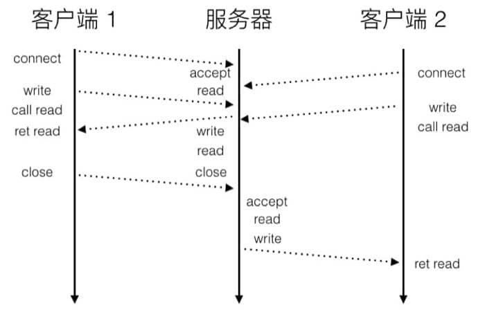
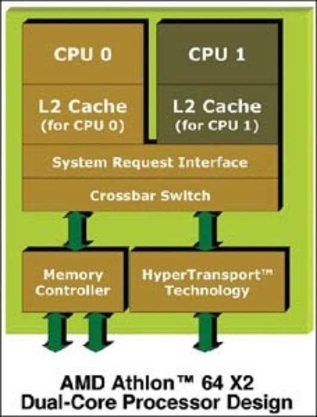
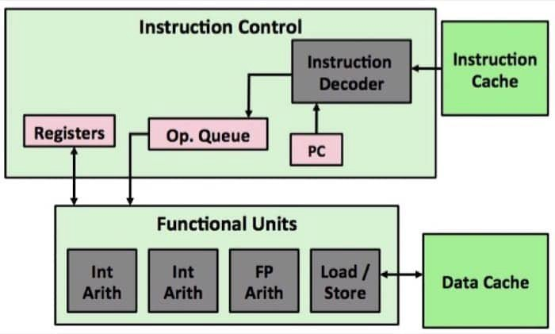
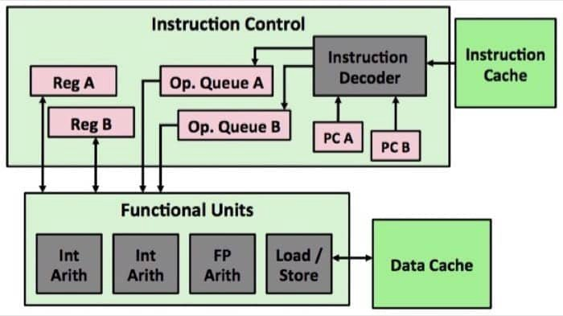
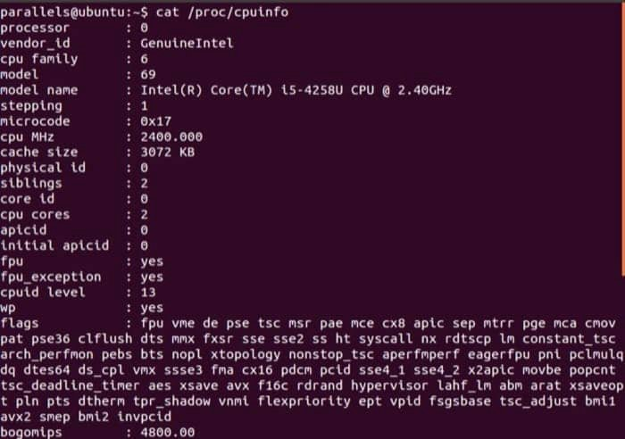

# 第十二章 并发编程

# 概述

## 并发

### 概念

如果逻辑控制流在**时间上重叠**，那么它们就是**并发的**。

### 常见问题

- 竞争条件
- 死锁
- 活锁/饥饿/公平性

## 迭代式服务器

一次只能处理一个请求，只有当前的请求处理完了，才能继续处理下一个。


- Client 1 向 Server 发送连接请求(connect)
- Server 接受(accept)之后开始等待 Client 1 发送请求（也就是开始 read）
- Client 1 发送具体的内容(write)后转为等待响应(call read)
- Server 的 read 接收到了内容之后，发送响应(write) 后仅需进入等待(read)
- Client 1 接收到了响应(ret read)
- 最后根据用户指令退出(close)
- 当 Client 1 断开之后，Server 开始处理 Client 2 的请求。因为 TCP 会缓存，所以实际上 Client 2 在 `ret read` 之前进行等待。
  为了解决这个问题，我们可以使用并行的策略，同时处理不同客户端发来的请求。

## 并发的三种实现方式

### 1. 进程 (Processes)

- **机制：**  每个逻辑流都是一个独立的进程，由内核进行调度和维护。
- **特点：**  每个进程有**独立的虚拟地址空间**。
- **通信：**  因为地址空间隔离，如果要通信，必须使用显式的**进程间通信 (IPC)**  机制（如管道、信号、共享内存等）。

### 2. I/O 多路复用 (I/O Multiplexing)

- **机制：**  应用程序在一个进程的上下文中显式地调度自己的逻辑流。逻辑流被建模为**状态机**。
- **特点：**  所有的流都**共享同一个地址空间**。
- **调度：**  这种方式是“显式调度”，即程序员控制什么时候切换流，通常是在数据到达文件描述符时。

### 3. 线程 (Threads)

- **机制：**  运行在一个单一进程上下文中的逻辑流。
- **特点：**  它是上述两种方式的**混合体**。
- **调度：**  像进程一样，由**内核进行调度**。
- **内存：**  像 I/O 多路复用一样，多个线程**共享同一个虚拟地址空间**。

# 基于进程(Process)

## 基于进程的并发服务器

为每个客户端分离出一个单独的进程，是建立了连接之后才开始并行，连接的建立还是串行的。

```

void sigchld_handler(int sig){
    while (waitpid(-1, 0, WNOHANG) > 0)
        ;
    return;
    // Reap all zombie children
}

int main(int argc, char **argv) {
    int listenfd, connfd;
    socklen_t clientlen;
    struct sockaddr_storage clientaddr;
    
    Signal(SIGCHLD, sigchld_handler);
    listenfd = Open_listenfd(argv[1]);
    while (1) {
        clientlen = sizeof(struct sockaddr_storage);
        connfd = Accept(listenfd, (SA *) &clientaddr, &clientlen);
        if (Fork() == 0) {         // 派生子进程，子进程返回 0，父进程返回子进程 PID。
            Close(listenfd);       // Child closes its listening socket
            echo(connfd);          // Child services client
            Close(connfd);         // Child closes connection with client
            exit(0);               // Child exits
        }
        Close(connfd);             // Parent closes connected socket (important!)
    }
}

```

这里用文字描述一下流程：首先，服务器在 `accept` 函数中（对应 `listenfd`）等待连接请求，然后客户端通过调用 `connect` 函数发送连接请求，最后服务器在 `accept` 中返回 `connfd` 并且 fork 一个子进程来处理客户端连接，连接建立在 `listenfd` 和 `connfd` 间。
整个执行模型中：

- 每个客户端由独立子进程处理
  - 必须回收僵尸进程，来避免严重的内存泄露
- 不同进程之间不共享数据
- 父进程和子进程都有 `listenfd` 和 `connfd`，所以在父进程中需要关闭 `connfd`，在子进程中需要关闭 `listenfd`
  - 内核会保存每个 socket 的引用计数，在 fork 之后 `refcnt(connfd) = 2`，所以在父进程需要关闭 connfd，这样在子进程结束后引用计数才会为零

## 基于进程并发的优劣

### 优点

- 实现简单
- 模型清晰：父子进程共享文件表，但不共享用户地址空间。一个进程不会意外覆盖另一个进程的虚拟内存。

### 缺点

- 共享困难：独立的地址空间使得进程间通信不便，必须使用显式的 **IPC（进程间通信 interprocess communication）**
- 开销较大：进程控制、进程创建和 IPC 的系统开销通常比线程更高。

> [!NOTE] Unix IPC
> 1.第8章中的waitpid函数和信号是基本的IPC机制，它们允许进程发送消息到同一主机其他进程。
> 2.第11章的套接字接口是IPC的一种重要形式，它允许不同主机上的进程交换任意的字节流。
> 3.术语Unix IPC通常指的是所有允许进程和同一台主机上其他进程进行通信的技术。其中包括管道、先进先出（FIFO）、系统V共享内存，以及系统V信号量（semaphore）。

# 基于事件(IO多路复用 I/O Multiplexing)

## select函数

### 机制

`select` 允许内核挂起进程，直到一个或多个 I/O 事件发生（描述符可读/可写或超时）才将控制权返回给应用程序。

```
int select（int n,fd_set *fdset,NULL,NULL,NULL);
										// 返回已准备好的描述符的非零的个数，若出错则为一1。

```

- **fd**​ **_**​**set（描述符集合）：**  逻辑上是一个大小为 $n$ 的位向量。如果位 $b\_k = 1$，表示描述符 $k$ 是集合中的一个元素。
- **四个关键宏：**
  - `FD\_ZERO`：清空集合。
  - `FD\_SET`：将某个描述符添加到集合。
  - `FD\_CLR`：从集合中删除某个描述符。
  - `FD\_ISSET`：检查某个描述符是否已就绪。
- **副作用：**  `select` 会修改传入的集合，只保留其中“准备好可读”的描述符（即 **ready set**）。因此，每次调用 **​`select`​**​ ** 前都必须重新初始化描述符集合**。

### 基于 select 的迭代 echo 服务器

1. **初始化：**  使用 `open\_listenfd` 打开监听描述符，并用 `FD\_ZERO` 和 `FD\_SET` 将标准输入（描述符 0）和监听描述符（如描述符 3）加入 `read\_set`。
2. **主循环：**
   - 将 `read\_set` 备份到 `ready\_set`（因为 `select` 会修改它）。
   - 调用 `select` 阻塞等待。
   - **如果是标准输入就绪：**  调用 `command()` 函数处理用户输入的命令。
   - **如果是监听描述符就绪：**  调用 `accept` 获取连接，并通过 `echo()` 函数回送客户端数据，直到客户端关闭连接。

```
#include "csapp.h"
void echo(int connfd);
void command(void);

int main(int argc, char **argv) 
{
    int listenfd, connfd;
    socklen_t clientlen;
    struct sockaddr_storage clientaddr;
    fd_set read_set, ready_set;

    if (argc != 2) {
        fprintf(stderr, "usage: %s <port>\n", argv[0]);
        exit(0);
    }
    listenfd = Open_listenfd(argv[1]);

    FD_ZERO(&read_set);              /* Clear read set */
    FD_SET(STDIN_FILENO, &read_set); /* Add stdin to read set */
    FD_SET(listenfd, &read_set);     /* Add listenfd to read set */

    while (1) {
        ready_set = read_set;
        Select(listenfd+1, &ready_set, NULL, NULL, NULL);
        if (FD_ISSET(STDIN_FILENO, &ready_set))
            command(); /* Read command line from stdin */
        if (FD_ISSET(listenfd, &ready_set)) {
            clientlen = sizeof(struct sockaddr_storage);
            connfd = Accept(listenfd, (SA *)&clientaddr, &clientlen);
            echo(connfd); /* Echo client input until EOF */
            Close(connfd);
        }
    }
}

void command(void) {
    char buf[MAXLINE];
    if (!Fgets(buf, MAXLINE, stdin))
        exit(0); /* EOF */
    printf("%s", buf); /* Process the input command */
}

```

### 局限性

尽管 `select` 解决了同时等待多个事件的问题，但示例程序仍存在**细粒度不足**的问题：

- 当服务器正在与一个客户端通信（执行 `echo` 函数）时，它会一直阻塞在那个连接上，直到该连接关闭。
- 在此期间，即便标准输入有新命令，服务器也无法响应，直到当前连接结束。
- **解决方案：**  进一步使用更细粒度的多路复用，例如每轮循环只处理一行文本，而不是一次性处理完整个连接。

### epoll函数（可能成为未来趋势）

## 基于I/O多路复用的并发事件驱动服务器

### 并发事件驱动服务器原理

- 将逻辑流模型化为**状态机（State Machine）** 。每个新的客户端连接都会创建一个新的状态机 $s\_k$，并与其已连接描述符 $d\_k$ 关联。
- 服务器利用 `select` 检测输入事件。当描述符准备好可读时，执行状态转移（例如：从描述符读取一个文本行并回送）。

### 客户端池（Pool）管理

- 通过一个 `pool` 结构体维护活动客户端集合。该结构包含：
  - `read\_set`：所有活动描述符的集合。
  - `ready\_set`：由 `select` 返回的已准备好描述符子集。
  - `clientfd`：已连接描述符数组，`-1` 表示可用槽位。

### 核心函数流程

```C
/* 客户端池结构定义 */
typedef struct { /* Represents a pool of connected descriptors */
    int maxfd;        /* Largest descriptor in read_set */
    fd_set read_set;  /* Set of all active descriptors */
    fd_set ready_set; /* Subset of descriptors ready for reading */
    int nready;       /* Number of ready descriptors from select */
    int maxi;         /* High water index into client array */
    int clientfd[FD_SETSIZE];    /* Set of active descriptors */
    rio_t clientrio[FD_SETSIZE]; /* Set of active read buffers */
} pool;

static pool pool;

int main(int argc, char **argv) {
    int listenfd, connfd;
    socklen_t clientlen;
    struct sockaddr_storage clientaddr;

    if (argc != 2) {
        fprintf(stderr, "usage: %s <port>\n", argv[0]);
        exit(0);
    }
    listenfd = Open_listenfd(argv[1]);
    init_pool(listenfd, &pool);

    while (1) {
        /* 等待监听或已连接描述符准备就绪 */
        pool.ready_set = pool.read_set;
        pool.nready = Select(pool.maxfd+1, &pool.ready_set, NULL, NULL, NULL);

        /* 如果监听描述符就绪，添加新客户端到池中 */
        if (FD_ISSET(listenfd, &pool.ready_set)) {
            clientlen = sizeof(struct sockaddr_storage);
            connfd = Accept(listenfd, (SA *)&clientaddr, &clientlen);
            add_client(connfd, &pool);
        }

        /* 从每个准备好的已连接描述符中回送一行文本 */
        check_clients(&pool);
    }
}

```

- `**init\_pool**`：初始化客户端池，清空描述符集合，并将监听描述符加入其中。

```C
void init_pool(int listenfd, pool *p) {
    /* 最初，没有连接的描述符 */
    int i;
    p->maxi = -1;
    for (i=0; i < FD_SETSIZE; i++)
        p->clientfd[i] = -1;

    /* 最初，listenfd 是 select 读集合中唯一的成员 */
    p->maxfd = listenfd;
    FD_ZERO(&p->read_set);
    FD_SET(listenfd, &p->read_set);
}

```

- `**add\_client**`：当监听到新连接请求时，将其添加至 `clientfd` 数组，并更新 `select` 读集合及最大描述符 `maxfd`。

```C
void add_client(int connfd, pool *p) {
    int i;
    p->nready--;
    for (i = 0; i < FD_SETSIZE; i++) { /* 寻找一个可用的槽位 */
        if (p->clientfd[i] < 0) {
            /* 将连接描述符添加到池中 */
            p->clientfd[i] = connfd;
            Rio_readinitb(&p->clientrio[i], connfd);

            /* 将描述符添加到 select 读集合 */
            FD_SET(connfd, &p->read_set);

            /* 更新最大描述符和池的高水位线 */
            if (connfd > p->maxfd)
                p->maxfd = connfd;
            if (i > p->maxi)
                p->maxi = i;
            break;
        }
    }
    if (i == FD_SETSIZE) /* 无法找到空槽位 */
        app_error("add_client error: Too many clients");
}

```

- `**check\_clients**`：遍历已就绪的描述符，读取一行文本并回送。如果检测到 EOF（客户端关闭连接），则关闭连接并从池中清除该描述符。

```C
void check_clients(pool *p) {
    int i, connfd, n;
    char buf[MAXLINE];
    rio_t rio;

    for (i = 0; (i <= p->maxi) && (p->nready > 0); i++) {
        connfd = p->clientfd[i];
        rio = p->clientrio[i];

        /* 如果描述符就绪，则回送一行文本 */
        if ((connfd > 0) && (FD_ISSET(connfd, &p->ready_set))) {
            p->nready--;
            if ((n = Rio_readlineb(&rio, buf, MAXLINE)) != 0) {
                byte_cnt += n;
                printf("Server received %d (%d total) bytes on fd %d\n",
                       n, byte_cnt, connfd);
                Rio_writen(connfd, buf, n);
            }
            /* 检测到 EOF，从池中删除描述符 */
            else {
                Close(connfd);
                FD_CLR(connfd, &p->read_set);
                p->clientfd[i] = -1;
            }
        }
    }
}

```

### I/O 多路复用技术的优劣

- **优点**：
  - **高控制力**：程序员能完全控制程序行为。
  - **共享数据容易**：运行在单一进程上下文中，所有逻辑流共享整个地址空间。
  - **低开销**：无需进程上下文切换，效率更高。
  - **调试方便**：可使用 GDB 等常规工具调试。
- **缺点**：
  - **编码复杂**：代码量通常比基于进程的设计多出数倍。
  - **脆弱性**：容易受到恶意攻击（如只发送部分文本行就停止，会阻塞服务器处理其他任务）。
  - **无法利用多核**：由于是单进程，不能充分发挥多核处理器的并行能力。

# 基于线程

## 线程执行模型

### 线程内存模型

### 进程和线程的关系

- 一个进程包括进程上下文、代码、数据和栈。
- 如果从线程的角度来描述，一个进程则包括线程、代码、数据和上下文。
- 也就是说，线程作为单独可执行的部分，被抽离出来了，一个进程可以有多个线程。

### 线程的特点

- **独立的线程上下文**：每个线程有自己的线程 id，有自己的逻辑控制流，也有自己的用来保存局部变量的栈（其他线程可以修改）、栈指针、程序计数器、条件码、通用寄存器
- **共享进程上下文的剩余部分** 虚拟地址空间、打开的文件的集合 但是会共享所有的代码、数据以及内核上下文。
- 每个线程的栈不受保护，易发生意料之外的变量共享

和进程不同的是，线程没有一个明确的树状结构（使用 `fork` 是有明确父进程子进程区分的）。和进程中『并行』的概念一样，如果两个线程的控制流在时间上有『重叠』（或者说有交叉），那么就是并行的。
进程和线程的差别：相同点在于，它们都有自己的逻辑控制流，可以并行，都需要进行上下文切换。不同点在于，线程共享代码和数据（进程通常不会），线程开销比较小（创建和回收）

## POSIX Threads

Pthreads 是一个线程库，基本上只要是 C 程序能跑的平台，都会支持这个标准。Pthreads定义了一套C语言的类型、函数与常量，它以 `pthread.h` 头文件和一个线程库实现。
创建、终止、回收终止线程的资源、分离线程、初始化线程
Pthreads API 中大致共有 100 个函数调用，全都以 `pthread\_` 开头，并可以分为四类：

1. 线程管理，例如创建线程，等待(join)线程，查询线程状态等。
2. Mutex：创建、摧毁、锁定、解锁、设置属性等操作
3. 条件变量（Condition Variable）：创建、摧毁、等待、通知、设置与查询属性等操作
4. 使用了读写锁的线程间的同步管理

POSIX 的 Semaphore API 可以和 Pthreads 协同工作，但这并不是 Pthreads 的标准。因而这部分API是以 `sem_` 打头，而非 `pthread_`。
我们用线程的方式重写一次之前的 Echo Server

```C
// Thread routine
void *thread(void *vargp){
    int connf = *((int *)vargp);
    // detach 之后不用显式 join，会在执行完毕后自动回收
    Pthread_detach(pthread_self());
    Free(vargp);
    echo(connfd);
    // 一定要记得关闭！
    Close(connfd);
    return NULL;
}

int main(int argc, char **argv) {
    int listenfd, *connfdp;
    socklen_t clientlen;
    struct sockaddr_storage clientaddr;
    pthread_t tid;
    
    listenfd = Open_listenfd(argv[1]);
    while (1) {
        clientlen = sizeof(struct sockaddr_storage);
        // 这里使用新分配的 connected descriptor 来避免竞争条件
        connfdp = Malloc(sizeof(int));
        *connfdp = Accept(listenfd, (SA *) & clientaddr, &clientlen);
        Pthread_create(&tid, NULL, thread, connfdp);
    }
}

```

在这个模型中，每个客户端由单独的线程进行处理，这些线程除了线程 id 之外，共享所有的进程状态（但是每个线程有自己的局部变量栈）。
使用线程并行，能够在不同的线程见方便地共享数据，效率也比进程高，但是共享变量可能会造成比较难发现的程序问题，很难调试和测试。

### 小结

这里简单归纳下三种并行方法的特点：

- 基于进程
  - 难以共享资源，但同时也避免了可能带来的共享问题
  - 添加/移除进程开销较大
- 基于事件
  - 非常底层的实现机制
  - 使用全局控制而非调度
  - 开销比较小
  - 但是无法提供精细度较高的并行
  - 无法充分利用多核处理器
- 基于线程
  - 容易共享资源，但也容易出现问题
  - 开销比进程小
  - 对于具体的调度可控性较低
  - 难以调试（因为事件发生的顺序不一致）

## 同步

### 临界资源：共享变量

在介绍同步之前，我们需要弄清楚一个定义，什么是 Shared variable（共享变量）？

> A variable x is shared if and only if multiple threads reference some instance of x （多个线程访问同一个内存区域）

另外一个需要注意的是线程的内存模型，因为概念上的模型和实际的模型有一些差异，非常容易导致错误。
在概念上的模型中：

- 多个线程在一个单独进程的上下文中运行
- 每个线程有单独的线程上下文（线程 ID，栈，栈指针，PC，条件码，GP 寄存器）
- 所有的线程共享剩下的进程上下文
  - Code, data, heap, and shared library segments of the process virtual address space
  - Open files and installed handlers

在实际的模型中，寄存器的值虽然是隔离且被保护的，但是在栈中的值并不是这样的（其他线程也可以访问）。
我们来看一个简单的例子：

```C
char **ptr; // 全局变量

int main()
{
    long i;
    pthread_t tid;
    char *msgs[2] = {
        "Good Day!",
        "Bad Day!"
    };
}

ptr = msgs;
for (i = 0; i < 2; i++)
    Pthread_create(&tid, NULL, thread, (void *)i);
Pthread_exit(NULL);
}

void *thread(void *vargp)
{
    long myid = (long)vargp;
    static int cnt = 0;
    
    // 这里每个线程都可以访问 ptr 这个全局变量
    printf("[%ld]: %s (cnt=%d)\n", myid, ptr[myid], ++cnt);
    return NULL;
}

```

这里有几个不同类型的变量，我们一一来看一下：

- 全局变量：在函数外声明的变量
  - 虚拟内存中有全局唯一的一份实例
- 局部变量：在函数内声明，且没有用 static 关键字
  - 每个线程的栈中都保存着对应线程的局部变量
- 局部静态变量：在函数内用 static 关键字声明的变量
  - 虚拟内存中有全局唯一的一份实例

具体来分析下，一个变量只有在被多个线程引用的时候才算是共享，在这个例子中，共享变量有 `ptr`, `cnt` 和 `msgs`；非共享变量有 `i` 和 `myid`。

### 临界区 访问共享变量的代码段

### 关键区域 Critical Section

这一部分我们用一个具体的例子来进行讲解，看看如何用多个线程来计数：

```
// 全局共享变量
volatile long cnt = 0; // 计数器

int main(int argc, char **argv)
{
    long niters;
    pthread_t tid1, tid2;
    
    niter2 = atoi(argv[1]);
    Pthread_create(&tid1, NULL, thread, &niters);
    Pthread_create(&tid2, NULL, thread, &niters);
    Pthread_join(tid1, NULL);
    Pthread_join(tid2, NULL);
    
    // 检查结果
    if (cnt != (2 * niters))
        printf("Wrong! cnt=%ld\n", cnt);
    else
        printf("Correct! cnt=%ld\n", cnt);
    exit(0);
}

```

运行之后发现不是每次都出现同样的结果，我们把操作 `cnt` 的部分抽出来单独看一看：
线程中循环部分的代码为：

```
for (i = 0; i < niters; i++)
    cnt++;

```

对应的汇编代码为

```
    # 以下四句为 Head 部分，记为 H
    movq    (%rdi), %rcx
    testq   %rcx, %rcx
    jle     .L2
    movl    $0, %eax
.L3:
    movq    cnt(%rip), %rdx # 载入 cnt，记为 L
    addq    $1, %rdx        # 更新 cnt，记为 U
    movq    %rdx, cnt(%rip) # 保存 cnt，记为 S
    # 以下为 Tail 部分，记为 T
    addq    $1, %rax
    cmpq    %rcx, %rax
    jne     .L3
.L2:

```

这里有一点需要注意，`cnt` 使用了 `volatile` 关键字声明，意思是不要在寄存器中保存值，无论是读取还是写入，都要对内存操作（还记得 write-through 吗？）。这里把具体的步骤分成 5 步：HLUST，尤其要注意 LUS 这三个操作，这三个操作必须在一次执行中完成，一旦次序打乱，就会出现问题，不同线程拿到的值就不一定是最新的。
更多相关内容，可以参考[Synchronization - Basics](https://www.wdxtub.com/blog/vault/csapp-23.html)，其中提到了利用图表来描述关键区域的方法，感兴趣可以看一下。

## 线程同步 信号量

针对关键区域的问题，我们可以考虑用信号量来限制程序的执行顺序。
信号量`s`是一个具有非负整数值的全局变量。

### P与V操作

信号量只能通过两个原子操作 $P$ 和 $V$ 来操作：

- $P(s)$：如果 $s$ 是非零的，则将 $s$ 减 1 并立即返回。如果 $s$ 为零，则挂起当前线程，直到 $s$ 变为非零。 
  $$
  P(s): \text{if } s > 0 \text{ then } s \leftarrow s - 1 \text{ else wait}
  $$
- $V(s)$： 将 $s$ 加 1。如果有任何线程阻塞在 $P$ 操作中等待 $s$ 变为非零，则由 $V$ 操作重启其中一个线程。
  $$
  V(s): s \leftarrow s + 1 \text{ and restart a blocked thread}
  $$

  计数信号量具备两种操作动作，称为 V（又称signal()）与 P（wait()）。 V 操作会增加信号量 S 的数值，P 操作会减少。运作方式：

1. 初始化，给与它一个非负数的整数值。
2. 运行 P，信号量 S 的值将被减少。企图进入临界区块的进程，需要先运行 P。当信号量 S 减为负值时，进程会被挡住，不能继续；当信号量S不为负值时，进程可以获准进入临界区块。
3. 运行 V，信号量 S 的值会被增加。结束离开临界区块的进程，将会运行 V。当信号量 S 不为负值时，先前被挡住的其他进程，将可获准进入临界区块。

我们来看看如何修改可以使得前面我们的计数程序正确运行。

```C
// 先定义信号量
volatile long cnt = 0;
sem_t mutex; // 互斥锁

Sem_init(&mutex, 0, 1);


// 在线程中用 P 和 V 包围关键操作
for (i = 0; i < niters; i++)
{
    P(&mutex);
    cnt++;
    V(&mutex);
}

```

在使用线程时，脑中需要有一个清晰的分享变量的概念，共享变量需要互斥访问，而 Semaphores 是一个基础的机制。

## 经典同步问题

### 生产者-消费者问题

应用案例：基于预线程化的网络服务

具体的同步模型为：

- 生产者等待空的 slot，把 item 存储到 buffer，并通知消费者
- 消费整等待 item，从 buffer 中移除 item，并通知生产者

主要用于

- 多媒体处理
  - 生产者生成 MPEG 视频帧，消费者进行渲染
- 事件驱动的图形用户界面
  - 生产者检测到鼠标点击、移动和键盘输入，并把对应的事件插入到 buffer 中
  - 消费者从 buffer 中获取事件，并绘制到到屏幕上

接下来我们实现一个有 n 个元素 buffer，为此，我们需要一个 mutex 和两个用来计数的 semaphore：

- `mutex`: 用来保证对 buffer 的互斥访问
- `slots`: 统计 buffer 中可用的 slot 数目
- `items`: 统计 buffer 中可用的 item 数目

我们直接来看代码，就比较清晰了

```C
// 头文件 sbuf.h
// 包括几个基本操作
#include "csapp.h"

typedef struct {
    int *buf;    // Buffer array
    int n;       // Maximum number of slots
    int front;   // buf[(front+1)%n] is first item
    int rear;    // buf[rear%n] is the last item
    sem_t mutex; // Protects accesses to buf
    sem_t slots; // Counts available slots
    sem_t items; // Counts available items
} sbuf_t;

void sbuf_init(sbuf_t *sp, int n);
void sbuf_deinit(sbuf_t *sp);
void sbuf_insert(sbuf_t *sp, int item);
int sbuf_remove(sbuf_t *sp);

```

然后是具体的实现

```C
// sbuf.c

// Create an empty, bounded, shared FIFO buffer with n slots
void sbuf_init(sbuf_t *sp, int n) {
    sp->buf = Calloc(n, sizeof(int));
    sp->n = n;                  // Buffer holds max of n items
    sp->front = sp->rear = 0;   // Empty buffer iff front == rear
    Sem_init(&sp->mutex, 0, 1); // Binary semaphore for locking
    Sem_init(&sp->slots, 0, n); // Initially, buf has n empty slots
    Sem_init(&sp->items, 0, 0); // Initially, buf has 0 items
}

// Clean up buffer sp
void sbuf_deinit(sbuf_t *sp){
    Free(sp->buf);
}

// Insert item onto the rear of shared buffer sp
void sbuf_insert(sbuf_t *sp, int item) {
    P(&sp->slots);                        // Wait for available slot
    P(&sp->mutext);                       // Lock the buffer
    sp->buf[(++sp->rear)%(sp->n)] = item; // Insert the item
    V(&sp->mutex);                        // Unlock the buffer
    V(&sp->items);                        // Announce available item
}

// Remove and return the first tiem from the buffer sp
int sbuf_remove(sbuf_f *sp) {
    int item;
    P(&sp->items);                         // Wait for available item
    P(&sp->mutex);                         // Lock the buffer
    item = sp->buf[(++sp->front)%(sp->n)]; // Remove the item
    V(&sp->mutex);                         // Unlock the buffer
    V(&sp->slots);                         // Announce available slot
    return item;
}

```

### 读者-写者问题

是互斥问题的通用描述，具体为：

- 读者线程只读取对象
- 写者线程修改对象
- 写者对于对象的访问是互斥的
- 多个读者可以同时读取对象

常见的应用场景是：

- 在线订票系统
- 多线程缓存 web 代理

根据不同的读写策略，又两类读者写者问题，需要注意的是，这两种情况都可能出现 starvation。

> 第一类读者写者问题（读者优先）

- 如果写者没有获取到使用对象的权限，不应该让读者等待
- 在等待的写者之后到来的读者应该在写者之前处理
- 也就是说，只有没有读者的情况下，写者才能工作

> 第二类读者写者问题（写者优先）

- 一旦写者可以处理的时候，就不应该进行等待
- 在等待的写者之后到来的读者应该在写者之后处理

具体的代码为

```C
sbuf_t sbuf; // Shared buffer of connected descriptors


static int byte_cnt;  // Byte counter
static sem_t mutex;   // and the mutex that protects it


void echo_cnt(int connfd){
    int n;
    char buf[MAXLINE];
    rio_t rio;
    static pthread_once_t once = PTHREAD_ONCE_INIT;
    
    Pthread_once(&once, init_echo_cnt);
    Rio_readinitb(&rio, connfd);
    while ((n = Rio_readlineb(&rio, buf, MAXLINE)) != 0) {
        P(&mutex);
        byte_cnt += n;
        printf("thread %d received %d (%d total) bytes on fd %d\n",
                    (int) pthread_self(), n, byte_cnt, connfd);
        V(&mutex);
        Rio_writen(connfd, buf, n);
    }
}

static void init_echo_cnt(void){
    Sem_init(&mutex, 0, 1);
    byte_cnt = 0;
}

void *thread(void *vargp){
    Pthread_detach(pthread_self());
    while (1) {
        int connfd = sbuf_remove(&sbuf); // Remove connfd from buf
        echo_cnt(connfd);                // Service client
        Close(connfd);
    }
}

int main(int argc, char **argv) {
    int i, listenfd, connfd;
    socklen_t clientlen;
    struct sockaddr_storage clientaddr;
    pthread_t tid;
    
    listenfd = Open_listenfd(argv[1]);
    sbuf_init(&sbuf, SBUFSIZE);
    for (i = 0; i < NTHREADS; i++) // Create worker threads
        Pthread_create(&tid, NULL, thread, NULL);
    while (1) {
        clientlen = sizeof(struct sockaddr_storage);
        connfd = Accept(listenfd, (SA *)&clientaddr, &clientlen);
        sbuf_insert(&sbuf, connfd); // Insert connfd in buffer
    }
}

```

## 线程池模型

# 并发编程需要注意的问题

### 线程安全

在线程中调用的函数必须是线程安全的，定义为：

> A function is thread-safe iff it will always produce correct results when called repeatedly from multiple concurrent threads

主要有 4 类线程不安全的函数

1. 不保护共享变量的函数
   - 解决办法：使用 P 和 V semaphore 操作
   - 问题：同步操作会影响性能
2. 在多次调用间保存状态的函数
   - 解决办法：把状态当做传入参数
3. 返回指向静态变量的指针的函数
   - 解决办法1：重写函数，传地址用以保存
   - 解决办法2：上锁，并且进行复制
4. 调用线程不安全函数的函数
   - 解决办法：只调用线程安全的函数

另一个重要的概念是 Reentrant Function，定义为：

> A function is reentrant iff it accesses no shared variables when called by multiple threads

Reentrant Functions 是线程安全函数非常重要的子集，不需要同步操作，对于第二类的函数来说（上面提到的），唯一的办法就是把他们修改成 reentrant 的。
标准 C 库中的函数都是线程安全的（如 `malloc`, `free`, `printf`, `scanf`），大多数 Unix 的系统调用也都是线程安全的。
总结来看，并行编程需要注意的是：

- 要有并行策略，可以把一个大任务分成若干个独立的子任务，或者用分而治之的方式来解决
- 内循环最好不要有任何同步机制
- 注意 Amdahl's Law
- 一致性是个大问题，无论是计算一致性还是存储一致性，都需要仔细考虑

## 超线程

回想一下，我们之前是如何处理 I/O 的延迟的呢？一个办法是每个客户端都由一个线程来处理，这样就不需要互相等待。现在的多核/超线程处理器提供了另外一种可能。我们不但可以并行执行多个线程，更好的是这些都是自动进行的，当然，我们也可以通过把大任务分成小任务来加速运算。

上图是典型的多核处理器架构，这里需要注意的是 L3 缓存（图上没有显示）和主内存都是共享的。而具体的执行计算的架构，基本的乱序执行处理器的架构为：

指令控制器会动态把程序转换成操作流，操作会被映射到 Functional Unit 上进行并行处理。这种情况下，一个核心处理一个线程。而在超线程的设计中，一个核心可以处理若干个线程，秘诀在于多出来了若干套指令控制流，如下图：

如果我们想要了解机器的相关信息，可以访问 `/proc/cpuinfo`

随后老师提及了两个例子，一个是并行求和，一个是并行快排，这里不赘述，如果感兴趣的话，可以自己思考一下。

### 可重入性

### 竞争

### 死锁

[^1]:
