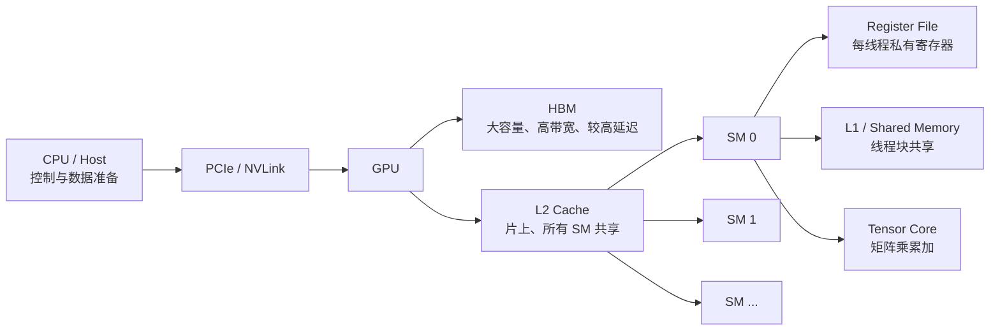

# 第 5 讲：GPU 与 TPU——硬件、性能模型和 FlashAttention

> Stanford CS336；整理自 `lecture_05.pdf`，并补齐理解后续 Triton/分布式训练所需的术语与推导。
>
> 本讲主线：**算力增长很快，但内存和通信增长较慢；高性能算法的核心是让计算单元尽量少等数据。**

## 0. 学习目标与路线

- 理解 CPU 与 GPU 的设计取舍，以及 NVIDIA GPU 中 SM、Warp、寄存器、共享内存、L2 Cache、HBM 的分工。
- 会用 Roofline 模型判断一个算子是 **计算受限（compute-bound）** 还是 **内存带宽受限（memory-bound）**。
- 认识 Tensor Core 与 FP32、FP16、BF16、FP8 等精度；理解混合精度为何既节省带宽又提高矩阵乘吞吐。
- 掌握控制流分歧、低精度、算子融合、重计算、内存合并访问、分块（tiling）等优化方法。
- 从硬件细节推导 FlashAttention 的分块与在线 Softmax 算法。

---

## 1. 为什么需要 GPU：计算扩展与内存墙

### 1.1 算力推动语言模型规模

经验性的神经网络 scaling law 表明，增加训练计算量通常会带来可预测的损失下降。更快的硬件、更高的利用率和更好的并行化，仍然是扩大模型的主要手段。Dennard scaling（晶体管缩小同时保持功耗密度近似不变）在 1980—2000 年代后逐渐失效，单核频率不再能持续增长，于是转向**并行扩展**。

GPU 在十年尺度上把并行计算能力提升了超过三个数量级；没有 GPU 的扩展，就很难有大语言模型的扩展。

### 1.2 CPU 与 GPU 的设计目标

| 维度 | CPU | GPU |
| --- | --- | --- |
| 优化目标 | 少量线程的低延迟 | 大量线程的高吞吐 |
| 计算单元 | 少量但复杂的核心，分支预测/乱序执行强 | 大量较小的 ALU/流处理器 |
| 控制流 | 适合复杂分支 | 分支可以做，但同一 Warp 分歧会串行化 |
| 缓存/控制 | 较大的缓存与控制逻辑 | 把更多晶体管给算术单元和高带宽内存 |
| 最擅长 | 操作系统、串行逻辑、低并发任务 | 向量运算、矩阵乘、批量相同指令 |
| 编程抽象 | 线程/进程 | SIMT：线程以 Warp 为单位执行同一指令 |

可以把 CPU 想象成少量经验丰富的工人，把 GPU 想象成许多执行同一种工序的工人：GPU 不保证一个工人的单次响应最低，但能同时处理非常多的数据。

---

## 2. NVIDIA GPU 的层次结构

### 2.1 从主机到 HBM 的整体图



**执行路径**通常是：线程块（CTA/block）被调度到某个 SM；SM 将线程分成 32 个一组的 Warp；线程使用自己的寄存器，并通过共享内存交换同一线程块内的数据；所有 SM 访问统一的 L2 和 HBM。不同线程块不能直接读取彼此的共享内存，跨块通信必须经过全局内存（或显式的更高层同步机制）。

### 2.2 SM、SP/ALU 与 Tensor Core

- **SM（Streaming Multiprocessor）**：GPU 的独立执行分区。每个 SM 有自己的 Warp 调度器、寄存器文件、L1/共享内存和计算单元；可以同时驻留多个线程块。
- **SP/ALU（Streaming Processor/Arithmetic Logic Unit）**：执行标量或向量浮点、整数、比较等普通指令。
- **Tensor Core**：专门做小矩阵的乘加（MMA）。它不是让通用 ALU 更快，而是用专用数据通路一次完成大量乘加，因此矩阵乘可比普通浮点操作快一个数量级以上。
- **线程块**：一组可以共享内存并协作的线程；通常一个线程块只在一个 SM 上运行。
- **Warp**：连续编号的 32 个线程。一个线程块有 64 个线程时通常包含 2 个 Warp。Warp 内线程必须锁步执行同一条指令。

### 2.3 Warp 与控制流分歧

SIMT（Single Instruction, Multiple Threads）并不等于每个线程都有独立的控制流。如果一个 Warp 内线程走不同分支：

```text
线程:  T T T T T T T T ... (共 32 个)
条件 A: A A A A A A .......
条件 B: . . . . . . B B ...
```

硬件需要先执行满足 A 的线程，再执行满足 B 的线程；两个分支的时间近似相加，未参与当前分支的线程处于空闲状态。这称为 **control divergence（控制流分歧）**。分支本身不是内存问题，但会降低有效吞吐。

Warp 在等待 HBM 读写时，SM 可以零开销地切换到另一个可运行 Warp，以隐藏内存延迟。

### 2.4 Register File：最快但最稀缺

- 每个线程有私有寄存器；中间变量、循环累加器通常优先放寄存器。
- 每线程可使用的寄存器数量有限（代码中以 0—255 为上限示例）。
- 一个 SM 的寄存器文件总量固定；单线程用得越多，同一 SM 能驻留的线程块越少，**occupancy（占用率）** 可能下降。
- 低 occupancy 不一定坏：如果每个线程做了更多工作（thread coarsening），减少的线程调度开销可能超过隐藏延迟的收益。

设：

- 每线程寄存器数为 $r$；
- 每线程块线程数为 $T$；
- 一个 SM 可用寄存器数为 $R$；
- SM 最大 Warp 数为 $W_{\max}$。

则寄存器限制下可同时驻留的块数和 Warp 数为

$$
N_{\text{blocks}}=\left\lfloor \frac{R}{T r}\right\rfloor,
\qquad
W_{\text{active}}=N_{\text{blocks}}\frac{T}{32},
\qquad
\text{occupancy}=\frac{W_{\text{active}}}{W_{\max}}.
$$

讲义示例：$T=128$、$r=160$、$R=65536$ 时，$N_{\text{blocks}}=3$，活动 Warp 数为 $12$；若 $W_{\max}=64$，寄存器约束下占用率为 $12/64=18.75\%$。

### 2.5 Shared Memory 与 Bank Conflict

共享内存（Shared Memory，通常与 L1 Cache 共用片上容量）位于 SM 内，线程块中的线程可直接访问。它比 HBM 容量小，但延迟低、带宽高，适合保存分块矩阵和中间结果。

共享内存通常划分为 32 个 Bank，每个 Bank 宽 4 字节：

```text
B00 B01 B02 B03 ... B30 B31
```

一个周期内每个 Bank 可以服务一个地址（同一个地址的广播是例外）。如果一个 Warp 的多个线程访问不同地址但落在同一个 Bank，就发生 **bank conflict**，访问被串行化；最坏情况下是 32-way conflict。常见矩阵乘场景是 32 个线程同时访问跨行的同一列。

解决办法包括：

- 改变 tile 的布局或增加 padding；
- 对共享内存下标做 **swizzling**，例如使用 `row xor col` 重排地址；
- 让同一 Warp 的访问尽量落在不同 Bank。

### 2.6 L1、L2 与 HBM

| 层次 | 所在位置 | 访问范围 | 典型用途 | 速度/容量直觉 |
| --- | --- | --- | --- | --- |
| 寄存器 | SM 内 | 单线程 | 累加器、临时值 | 最快、最小、最稀缺 |
| L1 / Shared Memory | SM 内 | 同一 SM/线程块 | tile、线程协作 | 很快、容量小 |
| L2 Cache | GPU 片上 | 所有 SM | 跨 SM 复用、缓存全局数据 | 中等，容量大于 L1 |
| HBM / Global Memory | GPU 外部堆叠 DRAM | 全 GPU、跨块 | 模型权重、激活、输出 | 容量大、带宽高但延迟高 |

SRAM（寄存器/L1/共享内存）每 bit 成本远高于 DRAM（约可高两个数量级），但访问更快。随着算力扩展，FLOPs 的增长速度超过内存带宽增长速度，导致 **memory wall（内存墙）**：算力很强，却因为数据来不及送到计算单元而变慢。

讲义中的硬件量级对比（不同产品、配置和计数口径会变化）：

| 指标 | A100 | H100 | B200 |
| --- | ---: | ---: | ---: |
| SM 数 | 108 | 132 | 148 |
| 每 SM Register File | 256 KB | 256 KB | 256 KB |
| 每 SM L1 + Shared | 192 KB | 256 KB | 256 KB |
| L2 Cache | 40 MB | 50 MB | 96–126 MB |
| HBM 容量 | 80 GB | 80 GB | 192 GB |
| 寄存器带宽 | 约 116 TB/s | 约 401 TB/s | 约 447 TB/s |
| L1 + Shared 带宽 | 约 19 TB/s | 约 33 TB/s | 约 19 TB/s |
| L2 带宽 | 约 5–8 TB/s | 约 12 TB/s | 约 9 TB/s |
| HBM 带宽 | 约 2 TB/s | 约 3.35 TB/s | 约 8 TB/s |

B200 还引入了位于寄存器和共享内存之间、对程序员不可见的 Tensor Memory（TMEM），用于 Tensor Core 数据通路。

### 2.7 HBM 访问与合并（coalescing）

DRAM/HBM 通常以 burst 方式读取，一次事务取得一整条 cache line（讲义按 128 字节事务说明）。其底层原因是 DRAM 先把一整行复制到 sense amplifier，再从这行连续取出多个字节；逐次随机换行的成本远高于同一 burst 内的连续读取。当一个 Warp 的 32 个线程访问连续的 32 个 FP32 元素时，刚好是 $32\times4=128$ 字节，可合并为一次事务：

```text
线程访问: M00 M01 M02 ... M31  -> 一条 128B 事务（理想）
```

这称为 **memory coalescing（内存合并访问）**。访问跨度大、未对齐或线程分别读不同 cache line，会产生多次事务，浪费带宽。行主序矩阵中，沿行移动的线程通常连续；如果线程沿列移动，则可能每个线程落在不同 cache line。

---

## 3. TPU：同一目标的另一种硬件取舍

GPU、TPU 以及其他加速器的高层结构相似：**轻量控制逻辑 + 大型矩阵乘单元 + 快速片上内存**。主要差异在于执行模型和互联方式。

| 方面 | GPU | TPU（讲义抽象） |
| --- | --- | --- |
| 主要计算单元 | 许多 SM，每个含普通 ALU 与 Tensor Core | 较少的大型矩阵单元/TC（常以 systolic array 实现） |
| 非矩阵计算 | Warp/SIMT 很灵活 | 以块为主，没有 GPU 式 Warp，通用控制取舍不同 |
| 矩阵乘 | Tensor Core MMA | 矩阵单元吞吐高，适合规则大矩阵 |
| 片上存储 | 寄存器、L1/Shared、L2 | 片上 Unified Buffer/局部存储配合 HBM |
| 多设备互联 | NVLink/NVSwitch、PCIe、InfiniBand | 常见为拓扑规则的 toroidal mesh；不同代际也可能采用树/交换网络 |

TPU 的 systolic array 可视作流水线化的乘加网格：$A$ 的元素从一个方向流入，$B$ 的元素从另一方向流入，部分和在阵列中逐步累加，减少反复访问外部内存。代价是对非矩阵、动态分支和不规则形状不如 GPU 灵活。

---

## 4. Tensor Core 与混合精度

### 4.1 矩阵乘累加

普通矩阵乘为

$$
C_{m\times n}=A_{m\times k}B_{k\times n},
\qquad
C_{ij}=\sum_{r=0}^{k-1}A_{ir}B_{rj}.
$$

理论 FLOPs（一次乘和一次加算作 2 FLOPs）约为 $2mkn$。早期 NVIDIA GPU 原本主要提供可编程 shader，研究者把 shader 的向量操作“挪用”来做矩阵乘；后来 Tensor Core（Volta/Tesla 等产品代际引入）把这类规律乘加固化为专用电路。Tensor Core 用固定形状的小块执行 MMA（matrix multiply-accumulate），一次指令完成大量乘加；现代 GPU 对 FP16/BF16/FP8 的 Tensor Core 路径通常远快于通用 FP32 ALU。

### 4.2 常见浮点格式

| 格式 | 总位数 | 指数/尾数（常见表示） | 优点 | 风险/用途 |
| --- | ---: | --- | --- | --- |
| FP32 | 32 | E8M23 | 动态范围、精度最好 | 带宽和存储成本高，常作累加/主权重 |
| FP16 | 16 | E5M10 | 存储小、Tensor Core 快 | 动态范围较小，易溢出 |
| BF16 | 16 | E8M7 | 与 FP32 相同指数范围，训练更稳 | 尾数较少，适合训练激活/权重 |
| FP8 E4M3 | 8 | 4 位指数、3 位尾数 | 精度相对较好，常用于权重/激活 | 动态范围小，需要 scale |
| FP8 E5M2 | 8 | 5 位指数、2 位尾数 | 动态范围更大，适合梯度 | 相对精度较低，需要 scale |

混合精度的典型做法是：输入矩阵用 FP16/BF16/FP8，Tensor Core 乘法在低精度进行，部分和与关键归约用 FP32 累加；模型可能保留 FP32 master weight 以便优化器更新。低精度同时带来：

1. 每个元素要搬运的字节变少；
2. 一个 Tensor Core 指令可以容纳更多元素；
3. 同样 HBM 带宽下可提供更高算术强度。

### 4.3 FP8、MXFP8 与 MXFP4

更低精度必须配合缩放因子（scale）：把一组值除以该组的最大幅度，将值编码到有限范围，再在计算前恢复尺度。讲义提到的 MXFP8 具有以下特点：

- 使用 E4M3（更多尾数位）；
- 每 32 个元素配一个 E8M0 FP8 scale；
- scale 本身也是 FP8；
- 转置不再是简单的字节搬运：按行分组的 scale 在转置后与列分组不匹配，转置数据也需要单独量化/重排。

MXFP4 可进一步降到 4 bit，并以每 16 个元素配置 scale；可表示的离散值更少，因此误差和 scale 管理更关键。实际训练中不一定所有权重都使用 MXFP8/MXFP4，转置副本也可能单独量化。

---

## 5. Roofline 模型：算子到底被什么限制？

### 5.1 定义

对一个算子：

- $F$：需要完成的 FLOPs；
- $Q$：从 HBM/L2 等目标层次搬运的字节数；
- **Arithmetic Intensity（算术强度）**：
  $$
  I=\frac{F}{Q}\quad(\text{FLOPs/byte}).
  $$
- $P_{\text{peak}}$：设备峰值计算吞吐（FLOPs/s）；
- $B_{\text{mem}}$：有效内存带宽（byte/s）。

Roofline 上界为

$$
P_{\text{achieved}}\le \min\left(P_{\text{peak}},\;B_{\text{mem}}\times I\right).
$$

两条屋脊相交处的临界算术强度为

$$
I_{\text{ridge}}=\frac{P_{\text{peak}}}{B_{\text{mem}}}.
$$

- 若 $I<I_{\text{ridge}}$：**内存受限**，减少 HBM 读写比增加 ALU 更有效。
- 若 $I>I_{\text{ridge}}$：**计算受限**，需要更高 Tensor Core/ALU 利用率或更低精度。

### 5.2 ReLU 例子

对长度为 $n$ 的向量做 $y=\max(0,x)$：每个元素至少读一次，若写回则写一次，做一次比较。讲义按“每 FLOP 搬运多少字节”来描述：

- FP32：读 $4$ B + 写 $4$ B，约 $8$ B/FLOP，即传统定义的 $I\approx1/8$ FLOPs/B；
- FP16：读 $2$ B + 写 $2$ B，约 $4$ B/FLOP，即 $I\approx1/4$ FLOPs/B。

低精度使同一带宽支持更多元素，但这个逐元素算子通常仍然是内存受限。

### 5.3 矩阵乘的强度

朴素 $M\times K$ 与 $K\times N$ 矩阵乘：

$$
F\approx 2MKN,
\qquad
Q\approx s(MK+KN+MN),
$$

其中 $s$ 是每元素字节数。若每个输入元素被反复从 HBM 读取，$Q$ 会显著增大；分块并在共享内存中复用后，$Q$ 下降，算术强度上升，才有机会接近计算屋脊。

#### 一个最小的 CUDA 风格 tile 代码

下面的伪 CUDA kernel 展示硬件图中的数据流：线程块协作把 A/B tile 从 HBM 搬到 Shared Memory，再用寄存器累加，最后只把 C tile 写回一次。

```cpp
__global__ void tiled_gemm(const half* A, const half* B, float* C,
                           int M, int N, int K) {
    __shared__ half As[32][32], Bs[32][32];
    int row = blockIdx.y * 32 + threadIdx.y;
    int col = blockIdx.x * 32 + threadIdx.x;
    float acc = 0.0f;  // 每线程寄存器中的部分和

    for (int k0 = 0; k0 < K; k0 += 32) {
        As[threadIdx.y][threadIdx.x] =
            (row < M && k0 + threadIdx.x < K)
                ? A[row * K + k0 + threadIdx.x] : __float2half(0.0f);
        Bs[threadIdx.y][threadIdx.x] =
            (k0 + threadIdx.y < K && col < N)
                ? B[(k0 + threadIdx.y) * N + col] : __float2half(0.0f);
        __syncthreads();
        for (int k = 0; k < 32; ++k)
            acc += __half2float(As[threadIdx.y][k]) *
                   __half2float(Bs[k][threadIdx.x]);
        __syncthreads();
    }
    if (row < M && col < N) C[row * N + col] = acc;
}
```

每个 tile 阶段从 HBM 读约 $32^2+32^2$ 个元素，却完成 $2\times32^3$ FLOPs；相比逐元素从 HBM 读取，输入在 Shared Memory 中被 $32$ 次复用，理论全局读次数约降为原来的 $1/32$。真实实现还要处理 bank conflict、coalescing、Tensor Core MMA 和 tile 尾部。

---

## 6. 让 GPU 变快的六类技巧

### 6.1 控制流：减少 Warp 分歧

让同一 Warp 的线程尽量执行相同路径；把分支移到 Warp 之外、按数据分桶，或使用掩码指令。条件语句并非绝对禁止，但要考虑分支两边都可能被顺序执行。

### 6.2 低精度计算

低精度降低存储/传输字节数，并通过 Tensor Core 获得更高矩阵乘吞吐。训练时用 BF16/FP16 计算、FP32 累加或 master weight，推理时进一步用 FP8/FP4，需用缩放、损失缩放或校准控制数值误差。

### 6.3 算子融合（operator fusion）

把“从 HBM 读出 → 计算 → 写回 HBM”的多个逐元素算子合并成一个 kernel：

```text
未融合: HBM -> sin kernel -> HBM -> square kernel -> HBM
        -> cos kernel -> HBM -> add kernel -> HBM
融合:   HBM -> [sin/cos/square/add 全部在寄存器中] -> HBM
```

例如计算 $\sin^2x+\cos^2x$，朴素实现可能启动 5 个 CUDA kernel；融合后只需一次读、一次写。`torch.compile` 可以自动生成这类 Triton kernel。

### 6.4 重计算（recomputation/checkpointing）

反向传播通常保存前向激活。以 3 层 Sigmoid 为例，保存并读取每层激活会产生很多 HBM 往返，算术强度低。若丢弃中间激活，在反向时重新计算，增加少量 FLOPs，却减少内存访问；讲义示例可把内存访问降到原来的 $5/8$。

这是“用计算换内存”的典型权衡：当模型是内存受限、且计算单元有余量时，重计算可能更快。

### 6.5 合并内存访问

同一 Warp 的线程尽量访问连续、对齐的元素，使访问落在尽可能少的 cache line/128B 事务中。矩阵的布局（row-major/column-major）、tile 形状和 stride 都会影响 coalescing。

### 6.6 分块（tiling）：本讲最重要的优化

把大矩阵切成能装进共享内存的 tile，并以阶段方式计算：

1. 从 HBM 合并读取 $M_{tile}$、$N_{tile}$ 到共享内存；
2. Warp/线程使用共享内存数据，累加输出 tile 的部分和；
3. 进入下一组 $K$ tile，重复读取/计算；
4. 输出 tile 一次写回 HBM。

```text
A: [A00 A01 A02 ...]       B: [B00 B01 B02 ...]
       \   tile A00,A01          / tile B00,B10
        +------------------------+
        | shared memory          |
        | C_tile += A_tile @ B_tile
        +------------------------+
```

朴素矩阵乘中每个输入可能被从 HBM 读取约 $N$ 次；若 tile 边长为 $T$，每个输入在一个 tile 内复用约 $T$ 次，从 HBM 读取次数可降低约 $T$ 倍，算术强度提高约 $T$ 倍。

#### Tile 大小的约束

- 不能整除矩阵维度时，边界线程需要 mask，尾部利用率降低；
- tile 要放得下共享内存和寄存器；
- 线程访问需合并；
- HBM burst 要与矩阵起始地址/stride 对齐，必要时 padding；
- tile 太小，复用不足；太大，occupancy 下降。

#### Wave quantization（波次量化）

如果一个 tile 为 $256\times128$：

- 矩阵边长 $1792$：$1792/256\times1792/128=7\times14=98$ 个 tile；
- 边长变成 $1793$：需要 $8\times15=120$ 个 tile。

A100 有 108 个 SM，98 个 tile 可以一波完成，而 120 个 tile 需要第二波，最后 12 个 tile 使大部分 SM 在尾波空转，所以性能可能出现周期性突变。矩阵“稍微变大反而变慢”通常与 tile 对齐、波次和内存布局共同有关。

---

## 7. FlashAttention：把注意力变成内存友好算法

### 7.1 朴素注意力的数据流

对单个 head，设 $Q,K,V\in\mathbb{R}^{N\times d}$：

$$
S=\frac{QK^\top}{\sqrt d},
\qquad
P=\operatorname{softmax}(S),
\qquad
O=PV.
$$

这是两个主要矩阵乘（$QK^\top$ 和 $PV$），中间夹着 Softmax；工程上也可把 Q/K/V 投影计算看成完整注意力的其他矩阵乘。$S,P\in\mathbb{R}^{N\times N}$，序列长时平方项巨大。朴素实现把 $S$ 和 $P$ 写入 HBM，再读回来做 Softmax/$PV$，大量读写使其内存受限。

### 7.2 第一层：对 $QK^\top$ 和 $PV$ 分块

固定一个 $Q$ tile（若干行），遍历 $K,V$ tile：

```text
Q_i (片上) ──┐
             ├─ Q_i @ K_j^T -> S_ij -> online softmax -> P_ij @ V_j
K_j,V_j ─────┘                       (只保留统计量和输出累加器)
                j = 0, 1, ...
```

只把当前 tile 加载到片上寄存器/共享内存，不将完整 $N\times N$ 的分数矩阵落到 HBM。输出 tile 的累加器留在片上，最后一次写回。

### 7.3 第二层：Online Softmax 的推导

普通 Softmax 对一行 $x$ 为

$$
\operatorname{softmax}(x_i)=\frac{e^{x_i}}{\sum_j e^{x_j}}.
$$

为防止溢出，通常先减去整行最大值 $m=\max_j x_j$。但分块后我们不能先看到整行，因此维护两个统计量：

$$
 m_j=\max(x_0,\ldots,x_j),
 \qquad
 l_j=\sum_{i=0}^{j}e^{x_i-m_j}.
$$

新到一个 tile $B$ 时，先计算该 tile 的局部最大值和局部归一化和：

$$
 m_B=\max_{i\in B}x_i,
 \qquad
 l_B=\sum_{i\in B}e^{x_i-m_B}.
$$

合并旧块和新块：

$$
 m_{new}=\max(m_{old},m_B),
$$

$$
 l_{new}=e^{m_{old}-m_{new}}l_{old}
       +e^{m_B-m_{new}}l_B.
$$

这是一种 telescoping sum（望远镜式缩放）：旧的指数和、新的指数和都被重标定到同一个最大值，不需要保存所有分数。对输出累加器 $u$（把每个 tile 的 $P_{ij}V_j$ 按未归一化权重累加）同样重标定：

$$
 u_{new}=e^{m_{old}-m_{new}}u_{old}
       +e^{m_B-m_{new}}\left(\sum_{i\in B}e^{x_i-m_B}V_i\right),
 \qquad
 O=\frac{u_{final}}{l_{final}}.
$$

因此可以逐 tile 计算 Softmax，并且只需要保存 $m,l,u$，不生成完整 $N\times N$ 中间矩阵。

### 7.4 Forward 与 backward

Forward 的每个 $Q$ tile：

1. 从 HBM 读 $Q_i$，初始化 $m=-\infty,l=0,u=0$；
2. 依次读 $K_j,V_j$，计算 $S_{ij}=Q_iK_j^\top/\sqrt d$；
3. 在当前 tile 内融合指数、最大值和归一化统计量；
4. 更新 $m,l,u$；
5. 遍历完 $j$ 后将 $u/l$ 写回输出。

Backward 不必保存所有 $S/P$：可以按 tile 重算前向统计量，再计算梯度。增加计算量，换取大幅减少 HBM 读写和激活显存，这与前面的 recomputation 原则一致。

### 7.5 FlashAttention 的本质

| 技术 | 对应硬件问题 | 解决方式 |
| --- | --- | --- |
| Q/K/V tiling | HBM 带宽与 $N^2$ 中间结果 | tile 放入共享内存/寄存器，片上复用 |
| Online Softmax | Softmax 需要整行 max/sum | 维护 $m,l$，逐 tile 合并 |
| 算子融合 | 指数、归一化和矩阵乘往返 HBM | 在同一个 kernel 内完成 |
| backward 重计算 | 保存注意力矩阵很贵 | 反向按 tile 重算 |

---

## 8. 全讲总结

1. GPU 是大量线程以 SIMT 方式执行相同指令；线程块映射到 SM，Warp 以 32 线程锁步运行。
2. 数据离 SM 越近越快：寄存器 → L1/Shared → L2 → HBM；跨块通信通常要经过全局内存。
3. 算力尤其是矩阵乘增长快于内存带宽，必须减少 HBM 访问、提升算术强度。
4. 低精度、融合、重计算、coalescing 和 tiling 是常用手段；tile 对齐、Bank conflict、occupancy 和 wave quantization 会决定真实性能。
5. Tensor Core 与混合精度让矩阵乘极快，但也放大了内存墙问题。
6. FlashAttention 并没有改变注意力的数学结果，而是把矩阵乘、Softmax、归一化和重计算重排成片上分块数据流。

> 参考来源（讲义中链接）：NVIDIA CUDA 博客、FlashAttention（Dao 等）、NVIDIA mixed-precision tutorial、NVIDIA 矩阵乘性能指南、Horace He 的 Brrr 介绍、JAX scaling book。
