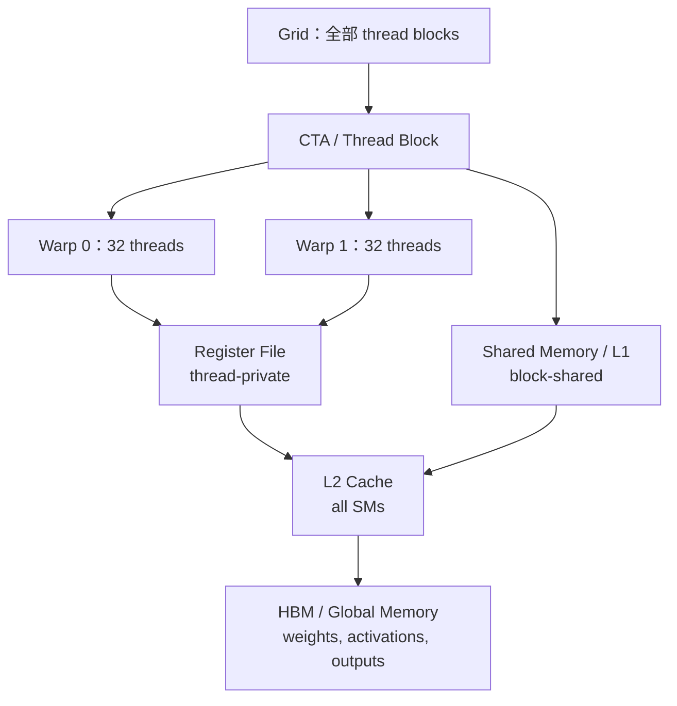

# 第 6 讲：Kernels 与 Triton——从 GPU 编程模型到高性能算子

> Stanford CS336；整理自 `lecture_06.py`。本讲承接第 5 讲的硬件层次，重点回答：**如何定位 GPU 瓶颈，以及如何写一个正确、可融合、可分块的 Triton kernel？**

## 0. 学习路线

1. 回顾 GPU 硬件/编程模型：grid、thread block（CTA）、thread、Warp、寄存器和共享内存。
2. Benchmark（测端到端耗时）与 profile（看时间花在哪里）。
3. 以 GeLU 为例理解朴素、多算子融合、`torch.compile` 版本的差异。
4. 学习 Triton 的块级编程哲学，并实现：
   - 逐元素 GeLU；
   - 行内 Softmax；
   - 行不适合单块时的分块归约；
   - 分块矩阵乘 + ReLU 融合。

---

## 1. 编程模型：CUDA 的线程与 Triton 的程序块

### 1.1 Grid、Thread Block、Thread

GPU kernel 的逻辑层次为：

```text
Grid（一次 kernel 启动的全部工作）
├── Thread Block / CTA 0  -> 调度到某个 SM，共享该 SM 的 shared memory
│   ├── Warp 0（32 threads）
│   └── Warp 1（32 threads）
├── Thread Block / CTA 1
└── ...
```

- **Thread（线程）**：处理数据的一小部分，拥有自己的寄存器。
- **Thread Block/CTA（线程块）**：线程的集合，块内线程可使用共享内存并同步；一个块通常被安排到一个 SM。
- **Grid（网格）**：本次 launch 的所有块。块之间不能依赖隐式的共享内存同步。
- **Warp**：每 32 个线程一组锁步执行；一个块 64 线程通常有 2 个 Warp。

Triton 代码中的 `tl.program_id(axis=0/1)` 对应“当前程序块”的坐标；它刻意不要求程序员逐线程编写 CUDA 的寄存器/共享内存搬运细节。

H100/B200 等新 GPU 还可以使用 thread-block cluster，让多个块访问分布式共享内存；本讲核心示例仍以一个块对应一个 SM 为主。

#### 与内存层次对应的硬件图



图中的箭头也是 Triton kernel 的主要数据流：尽量一次从 HBM 读入 block，在寄存器/Shared Memory 中复用和融合，最后一次写回；跨 block 共享数据则必须经过 L2/HBM 等全局层次。

讲义回顾的代表性硬件量级如下（产品 SKU、频率和带宽统计口径会变化）：

| 指标 | A100 | H100 | B200 |
| --- | ---: | ---: | ---: |
| SM 数 | 108 | 132 | 148 |
| 每 SM 寄存器文件 | 256 KB | 256 KB | 256 KB |
| 每 SM L1 + Shared | 192 KB | 256 KB | 256 KB |
| L2 | 40 MB | 50 MB | 96–126 MB |
| HBM | 80 GB | 80 GB | 192 GB |
| HBM 带宽 | 2 TB/s | 3.35 TB/s | 8 TB/s |

B200 还有对程序员不可见、位于寄存器和共享内存之间的 Tensor Memory（TMEM），供 Tensor Core 使用；这些容量与层次正是选择 block size、tile 和 occupancy 时的硬约束。

### 1.2 CUDA 核心概念示例

CUDA 让程序员描述“每个线程做什么”，控制最细，但也需要手工管理指针、边界、同步和共享内存：

```cpp
// 逐元素向量加法：C[i] = A[i] + B[i]
__global__ void add_kernel(const float* A, const float* B,
                           float* C, int n) {
    int i = blockIdx.x * blockDim.x + threadIdx.x;
    if (i < n) C[i] = A[i] + B[i];
}

int threads = 256;
int blocks = (n + threads - 1) / threads;
add_kernel<<<blocks, threads>>>(A, B, C, n);
cudaDeviceSynchronize();
```

- `blockIdx`：当前块在 grid 中的编号；
- `threadIdx`：线程在块内的编号；
- `blockDim`：每块线程数；
- `__global__`：可从 CPU 发起的 GPU kernel；
- `__syncthreads()`：块内同步，不能用来同步不同块。

### 1.3 Triton 的设计哲学

OpenAI Triton 把抽象层级提高一层：

| 方式 | 程序员主要指定 | 优点 | 代价 |
| --- | --- | --- | --- |
| CUDA | 每个 thread 的指令与内存访问 | 极细控制，适合极致调优 | 要管理 block、shared memory、同步、边界 |
| Triton | 每个 thread block/program 的数据块操作 | 代码短、自动映射到 Warp/寄存器/共享内存，易融合 | 某些特殊调度/硬件技巧仍需 CUDA/PTX |

Triton 的心智模型是：

```text
HBM/global memory -> 一个 block 读入寄存器/片上存储
                  -> 在 block 内完成计算、归约或融合
                  -> 写回 HBM/global memory
```

Triton 最终编译到 NVIDIA PTX（Parallel Thread Execution）。PTX 中常见：

- `ld.global.*` / `st.global.*`：全局内存读写；
- `%ctaid.x`：block index；`%tid.x`：thread index；
- `%f*`：浮点寄存器；`%r*`：整数寄存器。

---

## 2. 硬件细节如何影响 kernel

### 2.1 Warp 分歧

同一 Warp 中不同线程执行不同 `if/else` 路径时，硬件通常顺序执行两条路径；未满足当前条件的线程闲置。因此要尽量让同一 Warp 使用相同分支，或改为 mask 计算。

### 2.2 Occupancy 与 thread coarsening

每线程寄存器使用量在代码中可取 $0\ldots255$。若一个块有 $T$ 个线程、每线程 $r$ 个寄存器、SM 寄存器总量为 $R$，则寄存器限制的驻留块数为

$$
N_{block}=\left\lfloor\frac{R}{Tr}\right\rfloor,
$$

进而

$$
\text{occupancy}=\frac{N_{block}T/32}{W_{max}}.
$$

高 occupancy 有利于用其他 Warp 隐藏 HBM 等待，但不是越高越好。**Thread coarsening** 让一个线程一次处理多个元素（讲义 GeLU 生成的 PTX 中，一个线程同时处理 8 个元素），可用更多寄存器换取更少的线程/索引开销。

### 2.3 Shared-memory bank conflict

共享内存分为 32 个 Bank，每个 Bank 宽 4 字节。一个 Warp 同周期访问不同地址但落在同一 Bank，会发生冲突并串行化；矩阵乘按列取数是典型坏例子。可用 padding 或 swizzle（如 `row xor col`）改变布局。

### 2.4 HBM memory coalescing

Warp 的 32 个线程访问 HBM 时，理想情况是连续 32 个 FP32 元素，合并成一条 128B cache-line 事务。跨行大 stride、未对齐指针会产生多个事务；因此 Triton 的 block 形状和 stride 设计非常重要。

### 2.5 块的波次（block occupancy）

硬件按波次把块安排到 SM。例如 B200 有 148 个 SM，启动 160 个块时第一波运行 148 个，第二波只运行 12 个，最后一波大量 SM 空闲。若问题规模允许，让块数尽量接近或整除 SM 数，可减少 wave quantization。

---

## 3. Benchmark 与 Profile：先测，再改，再测

### 3.1 两者回答不同问题

| 工具 | 回答的问题 | 适合用途 |
| --- | --- | --- |
| Benchmark | 整个操作花多长时间？ | 比较实现、观察随维度的缩放 |
| Profiler | 哪些 CUDA kernel 在花时间？读写/调用在哪里？ | 找到瓶颈、确认是否融合、理解实现 |

代码中的成功循环是：

```text
benchmark/profile -> 修改实现 -> benchmark/profile 再确认
```

小维度矩阵乘的时间可能近似常数（启动开销占主导），维度增大后接近 $O(n^3)$ 的计算/访存缩放。

### 3.2 正确的 GPU 计时

GPU kernel 异步发射；如果只用 CPU `time.time()`，可能只测到 launch 时间。因此要：

1. 预热，排除首次编译/缓存开销；
2. 用 CUDA Event 记录 GPU 时间；
3. `torch.cuda.synchronize()` 等待 kernel 完成；
4. 多次 trial 取平均，观察方差。

```python
import torch


def benchmark(run, num_warmups=1, num_trials=3):
    for _ in range(num_warmups):
        run()
    torch.cuda.synchronize()

    times = []
    for _ in range(num_trials):
        start = torch.cuda.Event(enable_timing=True)
        end = torch.cuda.Event(enable_timing=True)
        start.record()
        run()
        end.record()
        torch.cuda.synchronize()
        times.append(start.elapsed_time(end))  # milliseconds
    return sum(times) / len(times)
```

### 3.3 Profiling 的阅读方法

`torch.profiler.profile(activities=[ProfilerActivity.CUDA])` 可以列出实际调用的 kernel。讲义示例中的 kernel 名称可能类似：

```text
cutlass3x_sm100_simt_sgemm_f32_f32_f32_f32_f32_64x64x16_1x1x1_3_nnn_align1_...
```

- `cutlass`：NVIDIA 线性代数库；
- `sm100`：Blackwell/B200 架构标识；
- `f32`：输入/输出或累加使用 FP32；
- `64x64x16`：实现使用的 tile 形状。

对 `add(2048)`、`matmul(2048)`、`matmul(128)` 进行 profile，往往会发现不同形状选择不同 CUDA kernel；不能只凭算术表达式猜测真实实现。

---

## 4. GeLU：从朴素代码到融合 kernel

### 4.1 GeLU 数学形式

讲义使用 tanh 近似：

$$
\operatorname{GeLU}(x)
=\frac12x\left[1+\tanh\left(\sqrt{\frac2\pi}\left(x+0.044715x^3\right)\right)\right].
$$

朴素 PyTorch 写法会把乘法、立方、缩放、`tanh`、加法等拆成多个 kernel，每个 kernel 都要从 HBM 读输入并写中间结果。

```python
import torch
import torch.nn.functional as F


def naive_gelu(x):
    return 0.5 * x * (
        1 + torch.tanh(0.79788456 * (x + 0.044715 * x * x * x))
    )


def builtin_gelu(x):
    # PyTorch 的融合实现；这里显式选择 tanh 近似
    return F.gelu(x, approximate="tanh")

compiled_gelu = torch.compile(naive_gelu)
```

正确性检查可用：

```python
x = torch.randn(2048, device="cuda")
assert torch.allclose(naive_gelu(x), builtin_gelu(x), atol=1e-6)
assert torch.allclose(naive_gelu(x), compiled_gelu(x), atol=1e-6)
```

讲义的 profile 结论：

- 朴素版本：多个 kernel，多次 HBM 读写；
- builtin/compiled 版本：一个融合 kernel，通常一次读、一次写；
- `torch.compile` 的生成 kernel 可以是 Triton kernel。

---

## 5. Triton 逐元素 kernel：GeLU

### 5.1 Python 包装器

每个 Triton program 处理 `BLOCK_SIZE` 个元素。`triton.cdiv(a,b)` 是向上取整的除法，确保尾部不完整块也被覆盖。

```python
import torch
import triton
import triton.language as tl


def triton_gelu(x: torch.Tensor):
    assert x.is_cuda
    assert x.is_contiguous()

    y = torch.empty_like(x)
    num_elements = x.numel()
    BLOCK_SIZE = 1024
    num_blocks = triton.cdiv(num_elements, BLOCK_SIZE)

    triton_gelu_kernel[(num_blocks,)](
        x, y, num_elements, BLOCK_SIZE=BLOCK_SIZE
    )
    return y
```

### 5.2 Triton kernel

```python
@triton.jit
def triton_gelu_kernel(x_ptr, y_ptr, num_elements,
                       BLOCK_SIZE: tl.constexpr):
    # 当前 program/block 的编号
    pid = tl.program_id(axis=0)
    start = pid * BLOCK_SIZE

    # 当前 block 要处理的逻辑下标
    offsets = start + tl.arange(0, BLOCK_SIZE)
    mask = offsets < num_elements

    # mask 防止最后一个 block 越界读写
    x = tl.load(x_ptr + offsets, mask=mask)

    a = 0.79788456 * (x + 0.044715 * x * x * x)
    # tl.tanh 不存在时，使用 tanh(a) = (exp(2a)-1)/(exp(2a)+1)
    e = tl.exp(2 * a)
    tanh = (e - 1) / (e + 1)
    y = 0.5 * x * (1 + tanh)

    tl.store(y_ptr + offsets, y, mask=mask)
```

核心点：

- `x_ptr`/`y_ptr` 是全局内存指针；`offsets` 是向量化地址；
- `mask` 同时用于 `tl.load` 与 `tl.store`，是边界安全的关键；
- 同一 program 内完成所有逐元素运算，自然实现算子融合；
- Triton 编译器负责把向量操作映射为线程、Warp 和寄存器。

---

## 6. Triton Softmax：行内归约与数值稳定性

### 6.1 朴素 Softmax 的访存成本

对 $M\times N$ 矩阵按行做 Softmax：

$$
\operatorname{softmax}(x_{ij})
=\frac{\exp(x_{ij}-\max_j x_{ij})}
{\sum_k\exp(x_{ik}-\max_j x_{ij})}.
$$

讲义逐步实现的读写估算：

1. 行最大值：$MN$ reads，$M$ writes；
2. 减最大值：$MN+M$ reads，$MN$ writes；
3. 指数：$MN$ reads，$MN$ writes；
4. 求和：$MN$ reads，$M$ writes；
5. 归一化：$MN$ reads，$MN$ writes。

总计约 $5MN+M$ reads、$3MN+2M$ writes；如果整行驻留在一个 block，理想上可做到约 $MN$ reads、$MN$ writes。

```python
def naive_softmax(x):
    M, N = x.shape
    x_max = x.max(dim=1)[0]
    x = x - x_max[:, None]
    numerator = torch.exp(x)
    denominator = numerator.sum(dim=1)
    return numerator / denominator[:, None]
```

减去最大值不仅减少 HBM 往返，也防止 `exp` 溢出。

### 6.2 一个 row 对应一个 program

若 $N$ 不超过一个 block，就让每个 block 处理一行；`next_power_of_2(N)` 便于归约，超出真实列数的元素用 $-\infty$ 填充。

```python
def triton_softmax(x: torch.Tensor):
    y = torch.empty_like(x)
    M, N = x.shape
    BLOCK_SIZE = triton.next_power_of_2(N)
    triton_softmax_kernel[(M,)](
        x, y,
        x.stride(0), y.stride(0),
        N, BLOCK_SIZE=BLOCK_SIZE,
    )
    return y


@triton.jit
def triton_softmax_kernel(x_ptr, y_ptr,
                          x_row_stride, y_row_stride,
                          num_cols, BLOCK_SIZE: tl.constexpr):
    assert num_cols <= BLOCK_SIZE
    row_idx = tl.program_id(0)
    col_offsets = tl.arange(0, BLOCK_SIZE)

    x_start = x_ptr + row_idx * x_row_stride
    x_row = tl.load(
        x_start + col_offsets,
        mask=col_offsets < num_cols,
        other=float("-inf"),
    )

    x_row = x_row - tl.max(x_row, axis=0)
    numerator = tl.exp(x_row)
    denominator = tl.sum(numerator, axis=0)
    y_row = numerator / denominator

    y_start = y_ptr + row_idx * y_row_stride
    tl.store(y_start + col_offsets, y_row,
             mask=col_offsets < num_cols)
```

对于 `[5,5,5]`，输出为 `[1/3,1/3,1/3]`；对于 `[0,0,100]`，输出接近 `[0,0,1]`。`-inf` padding 的指数为 0，不会影响真实列。

---

## 7. 行不适合一个 block：分块归约

如果一行有 4096 列，而 block 只有 1024 个位置，一个 block 无法一次装下整行。策略是：

1. 把行切成多个 tile；
2. 每个线程跨 tile 迭代，维护自己的累加器；
3. 最后在 block 内通过 shared memory 或 Warp shuffle 做归约。

先看行求和这一简化问题：

```python
def builtin_row_sum(x):
    return x.sum(dim=1)


def triton_row_sum(x, BLOCK_SIZE=1024):
    M, N = x.shape
    y = torch.empty(M, device=x.device, dtype=x.dtype)
    row_sum_kernel[(M,)](x, y, N, BLOCK_SIZE=BLOCK_SIZE)
    return y


@triton.jit
def row_sum_kernel(x_ptr, out_ptr, N,
                   BLOCK_SIZE: tl.constexpr):
    row = tl.program_id(0)

    # 每个位置对应一个线程/向量 lane 的累加器
    acc = tl.zeros([BLOCK_SIZE], dtype=tl.float32)

    for start in range(0, N, BLOCK_SIZE):
        cols = start + tl.arange(0, BLOCK_SIZE)
        mask = cols < N
        x = tl.load(x_ptr + row * N + cols,
                    mask=mask, other=0.0)
        acc += x

    result = tl.sum(acc, axis=0)
    tl.store(out_ptr + row, result)
```

`acc` 使用 FP32，避免长行累加的误差；`mask` 处理最后一个 tile。Softmax 也可采用相同的“每 tile 更新 max/sum”的 online reduction 思路（第 5 讲 FlashAttention 使用了它）。

---

## 8. Triton 分块矩阵乘 + ReLU

### 8.1 朴素矩阵乘为什么慢

令 $A\in\mathbb{R}^{M\times K}$、$B\in\mathbb{R}^{K\times N}$、$C=AB$。固定一个 $(m,n)$，朴素算法对每个 $k$：

1. 从 HBM 读 $A_{mk}$、$B_{kn}$；
2. 相乘并累加；
3. 把 $C_{mn}$ 写回 HBM。

总读写近似为 $MKN$ reads、$MN$ writes，算术强度很低。计算 $C_{4}$ 和 $C_{5}$ 时会重复读取同一行 $A_4,A_5,A_6$。

理想情况下，把整个 A/B 放入共享内存，只需 $MK+KN$ 次读取和 $MN$ 次写入，强度大幅提升；但大矩阵装不下共享内存，所以必须 tiling。

### 8.2 指针与 stride

矩阵在线性内存中存储，二维下标通过 stride 计算：

```python
x = torch.tensor([[0., 1, 2, 3],
                  [4, 5, 6, 7]])
stride_row, stride_col = x.stride()  # (4, 1)
row, col = 1, 2
index = row * stride_row + col * stride_col  # 6
```

不要假设所有输入都 contiguous；kernel 包装器可以显式要求 contiguous，或把每个 stride 作为参数传入。

### 8.3 Python 包装器

```python
def triton_matmul_relu(a, b):
    assert a.is_cuda and b.is_cuda
    assert a.is_contiguous() and b.is_contiguous()
    assert a.shape[1] == b.shape[0]

    M, K = a.shape
    K, N = b.shape
    c = torch.empty((M, N), device=a.device)

    BLOCK_M, BLOCK_N, BLOCK_K = 64, 64, 32
    grid = (triton.cdiv(M, BLOCK_M),
            triton.cdiv(N, BLOCK_N))

    matmul_relu_kernel[grid](
        a, b, c, M, N, K,
        a.stride(0), a.stride(1),
        b.stride(0), b.stride(1),
        c.stride(0), c.stride(1),
        BLOCK_M, BLOCK_N, BLOCK_K,
    )
    return c


def naive_matmul_relu(a, b):
    return torch.nn.functional.relu(a @ b)
```

这里的 grid 是二维：一个 program 对应 C 的一个 $BLOCK_M\times BLOCK_N$ 输出 tile。

### 8.4 Kernel：K 维循环与融合 ReLU

```python
@triton.jit
def matmul_relu_kernel(
    a_ptr, b_ptr, c_ptr,
    M, N, K,
    stride_am, stride_ak,
    stride_bk, stride_bn,
    stride_cm, stride_cn,
    BLOCK_M: tl.constexpr,
    BLOCK_N: tl.constexpr,
    BLOCK_K: tl.constexpr,
):
    pid_m = tl.program_id(0)
    pid_n = tl.program_id(1)

    indices_m = pid_m * BLOCK_M + tl.arange(0, BLOCK_M)
    indices_n = pid_n * BLOCK_N + tl.arange(0, BLOCK_N)
    indices_k = tl.arange(0, BLOCK_K)

    a_ptrs = (a_ptr
              + indices_m[:, None] * stride_am
              + indices_k[None, :] * stride_ak)
    b_ptrs = (b_ptr
              + indices_k[:, None] * stride_bk
              + indices_n[None, :] * stride_bn)

    # 用 FP32 累加，即使输入是低精度也较稳定
    acc = tl.zeros([BLOCK_M, BLOCK_N], dtype=tl.float32)

    for k in range(0, K, BLOCK_K):
        a = tl.load(
            a_ptrs,
            mask=((indices_m[:, None] < M)
                  & (indices_k[None, :] + k < K)),
            other=0.0,
        )
        b = tl.load(
            b_ptrs,
            mask=((indices_k[:, None] + k < K)
                  & (indices_n[None, :] < N)),
            other=0.0,
        )
        acc += tl.dot(a, b)
        a_ptrs += BLOCK_K * stride_ak
        b_ptrs += BLOCK_K * stride_bk

    # 融合：不把矩阵乘的中间结果写回 HBM 再读回来
    acc = tl.maximum(acc, 0.0)

    c_ptrs = (c_ptr
              + indices_m[:, None] * stride_cm
              + indices_n[None, :] * stride_cn)
    tl.store(c_ptrs, acc,
             mask=((indices_m[:, None] < M)
                   & (indices_n[None, :] < N)))
```

每轮 K 循环把 A 的 $BLOCK_M\times BLOCK_K$ 与 B 的 $BLOCK_K\times BLOCK_N$ tile 加载进片上存储，完成 `tl.dot`，累积到寄存器中的 `acc`。最后在同一 kernel 内执行 ReLU，只写一次输出。

### 8.5 正确性与调试检查

讲义提供了以下思路：

```python
def check_equal_1d(f1, f2):
    x = torch.randn(2048, device="cuda")
    assert torch.allclose(f1(x), f2(x), atol=1e-6)


def check_equal_2d(f1, f2):
    x = torch.randn(2048, 2048, device="cuda")
    assert torch.allclose(f1(x), f2(x), atol=1e-6)


def check_equal_2d_2d(f1, f2):
    x = torch.randn(2048, 2048, device="cuda")
    y = torch.randn(2048, 2048, device="cuda")
    assert torch.allclose(f1(x, y), f2(x, y), atol=1e-6)
```

边界维度不是 tile 整数倍时必须测试；还应检查非连续输入的约束是否明确。Triton kernel 生成的 PTX 可通过 `kernel.asm["ptx"]` 导出，观察 `ld.global`、`st.global`、寄存器和线程索引，建立“高层 Triton → PTX → 硬件”的对应关系。

---

## 9. FlashAttention-1/2：用 Triton 思维重写注意力

### 9.1 朴素注意力的 IO 瓶颈

令 $Q,K,V\in\mathbb{R}^{N\times d}$：

$$
S=\frac{QK^\top}{\sqrt d},
\qquad
P=\operatorname{softmax}(S),
\qquad
O=PV.
$$

$S$ 和 $P$ 都是 $N\times N$。朴素实现会：

1. 从 HBM 读 Q/K，计算 $S$，把 $S$ 写回 HBM；
2. 读回 $S$，做 max、exp、sum，写回 $P$；
3. 读回 $P,V$，计算并写回 O。

因此中间矩阵的显存为 $\Theta(N^2)$，并且发生多次 $N^2$ 规模的 HBM 读写；数学 FLOPs 仍然是 $\Theta(N^2d)$，但 Roofline 上很容易落入内存受限区。

### 9.2 FlashAttention-1：分块 + online softmax

FlashAttention-1 是 IO-aware（考虑片上 SRAM/HBM 流量）的精确注意力：不改变 softmax 数学结果，不物化完整 $S/P$，而是让每个 Q tile 在片上遍历 K/V tiles。

```text
Q_i（一个 query tile）留在寄存器/Shared Memory
   ├─ 读 K_j,V_j
   ├─ S_ij = Q_i K_j^T / sqrt(d)
   ├─ 当前 tile 的 max/exp/sum
   ├─ 更新 softmax 统计量与 O_i 累加器
   └─ j = 0,1,... 直到遍历所有 K/V tiles
最终只将 O_i 写回 HBM
```

若片上 SRAM 可容纳约 $M$ 个元素，FlashAttention 的 IO 可达到接近

$$
\Theta\left(\frac{N^2d^2}{M}\right)
$$

的量级（取决于 tile 形状和实现），而不是保存 $\Theta(N^2)$ 的中间矩阵；外部显存中只需保留 Q/K/V、O 和每行 $O(N)$ 的 softmax 统计量。

#### Online Softmax 推导

对当前 Q 行的分数块 $x_B$，维护：

$$
 m=\max(x_{\leq j}),
 \qquad
 l=\sum_{i\leq j}e^{x_i-m},
$$

并维护未归一化输出累加器 $u$。新 tile 的局部统计量为

$$
 m_B=\max_{i\in B}x_i,
 \qquad
 l_B=\sum_{i\in B}e^{x_i-m_B}.
$$

合并时：

$$
 m' = \max(m,m_B),
$$

$$
 l'=e^{m-m'}l+e^{m_B-m'}l_B,
$$

$$
 u'=e^{m-m'}u+e^{m_B-m'}
       \sum_{i\in B}e^{x_i-m_B}V_i.
$$

遍历完所有 tile 后输出 $O=u/l$。旧块和新块都重标定到同一个最大值，因此既数值稳定，又不必等到看到整行才计算 Softmax。

下面是一个完整的、可直接表达算法的 Python/Numpy 风格参考实现；Triton 版本把切片替换为 `tl.load`/`tl.store`，并把每个 `q_start` 映射为一个 program。它明确展示了在线统计量和 tile 级重用：

```python
import math
import numpy as np


def flash_attention_reference(Q, K, V, block_m=64, block_n=64):
    # Q/K/V: [N, D]；为了突出 IO 流程，这里省略 batch/head 维度
    N, D = Q.shape
    O = np.empty((N, D), dtype=np.float32)

    for q_start in range(0, N, block_m):
        q_stop = min(q_start + block_m, N)
        q = Q[q_start:q_stop].astype(np.float32)
        rows = q_stop - q_start
        m = np.full(rows, -np.inf, dtype=np.float32)
        l = np.zeros(rows, dtype=np.float32)
        u = np.zeros((rows, D), dtype=np.float32)

        for k_start in range(0, N, block_n):
            k_stop = min(k_start + block_n, N)
            k = K[k_start:k_stop].astype(np.float32)
            v = V[k_start:k_stop].astype(np.float32)
            scores = (q @ k.T) / math.sqrt(D)

            m_block = scores.max(axis=1)
            weights = np.exp(scores - m_block[:, None])
            l_block = weights.sum(axis=1)
            m_new = np.maximum(m, m_block)
            old_scale = np.exp(m - m_new)
            new_scale = np.exp(m_block - m_new)

            u = (old_scale[:, None] * u
                 + new_scale[:, None] * (weights @ v))
            l = old_scale * l + new_scale * l_block
            m = m_new

        O[q_start:q_stop] = u / l[:, None]
    return O
```

真实 Triton kernel 会把 `q_start` 映射为 `tl.program_id(0)`，用 `tl.arange` 构造 Q/K/V 的二维指针，并以 mask 处理尾部、causal attention 和 stride；关键的 `m/l/u` 更新完全相同。

### 9.3 FlashAttention-2：更好的并行划分

FlashAttention-2 保留 FA-1 的 exact tiling/online-softmax 数学，但重新安排 GPU 工作：

- 在不同 Q blocks、heads 和 batch 维度上更充分地并行；
- 调整 Warp 分工，减少 Warp 间同步和 shared-memory 往返；
- 减少非矩阵乘指令与中间读写，让 Tensor Core 占比更高；
- 对长序列和小 batch 提高 occupancy，前向/反向吞吐更接近硬件峰值。

所以 FA-2 不是“近似精度更低”的新 Softmax，而是对同一 IO-aware 算法的调度、并行和工作划分优化。反向传播仍可按 tile 重算前向统计量，避免保存 $N\times N$ 注意力矩阵；这正是“用计算换 HBM”的重计算技巧。

### 9.4 FlashAttention 与普通 Triton 算子的对应关系

| 本讲 Triton 技巧 | FlashAttention 中的对应物 |
| --- | --- |
| `tl.program_id` 划分 block | 一个 program 负责一块 Q 行/head |
| `tl.arange` 构造向量地址 | 构造 Q/K/V tile 指针 |
| `mask` 边界保护 | 序列尾部、causal mask、padding |
| `tl.dot` + FP32 accumulator | Tensor Core 矩阵乘、稳定部分和 |
| 融合多个逐元素操作 | score、exp、归一化、PV 在同一 kernel |
| 循环遍历 tile | K/V 分块流式读取，在线更新 $m,l,u$ |

---

## 10. 本讲总结

- 正确性层面：PyTorch、Triton、PTX 都是 GPU 编程模型的不同抽象；
- 性能层面：Warp、寄存器占用、shared-memory bank conflict、HBM coalescing、块波次都会影响结果；
- 方法层面：先 warmup + benchmark，再 profile 定位瓶颈，修改后重新测量；
- Triton 的核心写法是“一个 program 处理一个数据块”，通过 `tl.arange` 构造向量地址、`mask` 保护边界、在片上完成融合和归约；
- GeLU 展示逐元素融合，Softmax 展示行内归约，row sum 展示跨 tile 归约，矩阵乘展示二维 tiling；
- FlashAttention-1/2 把分块、online softmax、融合、重计算和更好的并行调度组合起来，避免 $N\times N$ HBM 中间矩阵；
- 最终目标不是写更多代码，而是减少 HBM 访问、提高复用和 Tensor Core/ALU 利用率。
