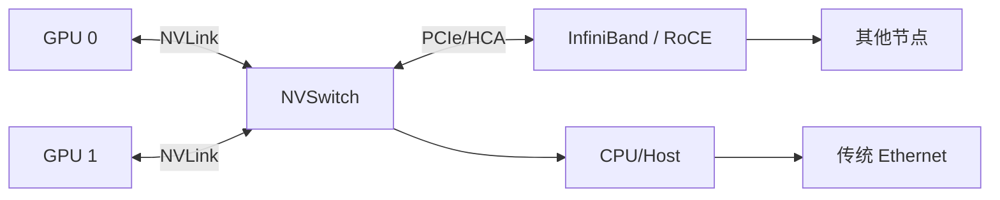
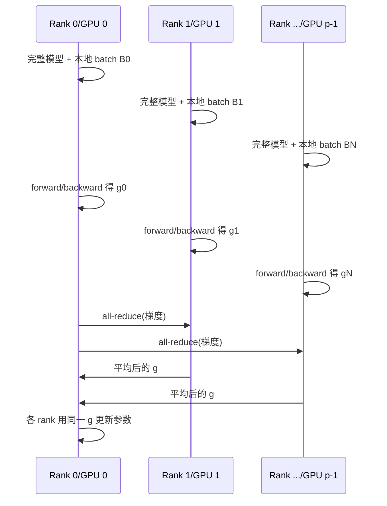

# 第 7 讲：并行基础——数据、张量与流水线并行

> Stanford CS336；整理自 `lecture_07.py`。第 5—6 讲讨论单 GPU 内部并行，本讲开始跨 GPU/跨机器并行。
>
> 统一主线：**计算单元离数据越来越远；要获得扩展性，就要用正确的复制、切分与通信原语，减少等待数据的时间。**

## 0. 为什么需要多 GPU？

### 0.1 层次化的数据/通信距离

```text
同一 SM：寄存器
    ↓
同一 SM：L1 / Shared Memory
    ↓
同一 GPU：L2 / HBM
    ↓
同一节点多 GPU：NVLink / NVSwitch
    ↓
跨节点：InfiniBand / RoCE / Ethernet
```

越往下，带宽通常越低、延迟越高。单 GPU 优化用 fusion/tiling 减少 HBM 读写；多 GPU 优化则要减少 GPU 之间、节点之间的通信。

### 0.2 两个动机

1. 参数、梯度、优化器状态或激活放不进一张 GPU；
2. 使用更多 GPU 的 FLOPs，缩短训练时间。

本讲用一个多层 MLP 作为代表性模型：Transformer 的 MLP 通常是主要计算瓶颈，数据/张量/流水线切分在此处容易看清。

---

## 1. 分布式通信的基本概念

### 1.1 Rank 与 World Size

- **Rank**：一个具体进程/设备的编号，例如 0、1、2、3；
- **World size**：参与本次作业的设备总数，例如 4；
- 每个 rank 通常有自己的 GPU、进程和本地张量副本。

### 1.2 Collective Operation（集合通信）

集合通信不是手工管理点对点消息，而是声明一个所有设备共同参与的通信模式。NCCL/PyTorch 可以根据硬件拓扑选择更快的 ring/tree 路径。

| 原语 | 输入/输出直观含义 | 常见用途 |
| --- | --- | --- |
| Broadcast | rank 0 的完整张量复制给所有 rank | 加载 checkpoint、初始化参数 |
| Scatter | rank 0 的大张量切片分别发给各 rank | 分发数据/参数片段 |
| Gather | 各 rank 的片段收集到 rank 0 | 汇总结果、保存 checkpoint |
| Reduce | 所有 rank 的张量按 sum/min/max 等归约到一个 rank | 汇总梯度或统计量 |
| All-gather | Gather 的结果复制到所有 rank | FSDP 参数重组、收集激活 |
| Reduce-scatter | 先按元素归约，再把不同结果片段分给各 rank | ZeRO/FSDP 梯度分片 |
| All-reduce | Reduce 的结果复制给所有 rank | DDP 同步完整梯度 |
| All-to-all | 每个 rank 给每个其他 rank 发不同切片 | MoE token 路由 |

记忆术：`scatter` 是 `gather` 的反向；`reduce` 是对输入做结合/交换的操作；`all` 表示结果发给所有设备。

### 1.3 四 rank 向量示例

假设 rank 0—3 的局部值分别是 $0,1,2,3$：

**Broadcast（rank 0）：**

```text
输入:  r0=[0,1,2,3]
输出:  r0=[0,1,2,3], r1=[0,1,2,3], r2=[0,1,2,3], r3=[0,1,2,3]
```

**Scatter：**

```text
输入: r0=[0,1,2,3]
输出: r0=[0], r1=[1], r2=[2], r3=[3]
```

**Gather：**

```text
输入: r0=[0], r1=[1], r2=[2], r3=[3]
输出: r0=[0,1,2,3]
```

**Reduce（sum 到 rank 0）：**

```text
输入: r0=[0], r1=[1], r2=[2], r3=[3]
输出: r0=[6]
```

**All-gather：**

```text
输入: r0=[0], r1=[1], r2=[2], r3=[3]
输出: 每个 rank 都得到 [0,1,2,3]
```

**Reduce-scatter：**

```text
r0 输入 [0,1,2,3]
r1 输入 [1,2,3,4]
r2 输入 [2,3,4,5]
r3 输入 [3,4,5,6]

按列求和并分发：
r0 得 [6], r1 得 [10], r2 得 [14], r3 得 [18]
```

**All-reduce = Reduce-scatter + All-gather：**

```text
每个 rank 最终都得到 [6,10,14,18]
```

这条等价关系是 ZeRO/FSDP 将“完整 all-reduce”改写成“分片归约 + 分片重组”的关键。

---

## 2. 多 GPU 硬件与通信栈

### 2.1 典型链路



讲义给出的量级：

- 家用/传统节点中，GPU 通过 PCIe 通信；PCIe 7.0 x16 约 242 GB/s（规格量级）；
- 不同节点传统 Ethernet 约 200 MB/s（取决于设备与网络）；
- 数据中心常见每节点 8 GPU，NVLink 接到 NVSwitch；B200 的 NVLink 5.0 约 1.8 TB/s，而 HBM 约 8 TB/s；
- 一个 pod 可有 256 个节点，通过 InfiniBand 连接，约 $0.05$ TB/s 量级；
- 更大范围的 pod/数据中心之间常用 Ethernet。

**RDMA（Remote Direct Memory Access）** 允许一张 GPU 直接读写另一张 GPU 的内存而不经过 CPU。传统 Ethernet 需要复制到 CPU kernel socket buffer、组 TCP 包，再复制到网卡 ring buffer；InfiniBand 原生支持 RDMA，RoCE（RDMA over Converged Ethernet）让 Ethernet 也可以绕过 CPU，但设备和网络要求更高。

现代系统示例：GB200/GB300 NVL72 将 72 GPU 放进一个 NVLink 域（8 GPU/tray、9 tray/rack）。

### 2.2 NCCL 与 PyTorch Distributed

NCCL（NVIDIA Collective Communication Library）：

1. 探测 GPU、节点、NVLink、PCIe、交换机等拓扑；
2. 为 collective 选择 ring、tree 或其他路径；
3. 将 collective 翻译成 GPU 间的低层数据包；
4. 启动负责收发数据的 CUDA kernel。

PyTorch 的 `torch.distributed` 提供统一接口：

- `gloo`：CPU 通信；
- `nccl`：GPU 通信；
- `all_reduce`、`reduce_scatter_tensor`、`all_gather_into_tensor` 等原语；
- 更高层的 FSDP，本讲先手工实现基础版本。

一个最小初始化/清理骨架如下；正式 launcher 会为每个进程注入 rank 和 world size：

```python
import os
import torch
import torch.distributed as dist


def setup(rank, world_size):
    os.environ["MASTER_ADDR"] = "localhost"
    os.environ["MASTER_PORT"] = "15623"
    backend = "nccl" if torch.cuda.is_available() else "gloo"
    dist.init_process_group(backend, rank=rank, world_size=world_size)


def cleanup():
    dist.destroy_process_group()
```

`torch.multiprocessing.spawn` 可以启动 `world_size` 个进程；每个进程都必须以相同顺序进入 collective，否则会死锁。讲义在追踪（trace）模式下用 no-op 替换 distributed 函数，仅为展示代码，不代表真实训练路径。

---

## 3. 通信开销与带宽测量

### 3.1 Ring all-reduce 的数据量

设总消息大小为 $S$ 字节、设备数为 $p$。带宽受限时，ring all-reduce 通常由 reduce-scatter 和 all-gather 两阶段组成，每阶段每个 rank 发送/接收约 $(p-1)S/p$：

$$
V_{\text{per-rank}}
\approx 2\frac{p-1}{p}S.
$$

若计“发送+接收”或全体设备总流量，口径会多一个 2 或 $p$；比较实现时必须统一口径。常见延迟—带宽模型为

$$
T_{\text{all-reduce}}
\approx 2(p-1)\alpha+2\frac{p-1}{p}\frac{S}{B},
$$

其中 $\alpha$ 是每步启动延迟，$B$ 是链路有效带宽。大消息时 $S/B$ 主导，小消息时启动延迟主导。

Reduce-scatter 约为 all-reduce 的一半通信量/时间：

$$
T_{\text{RS}}
\approx (p-1)\alpha+\frac{p-1}{p}\frac{S}{B}.
$$

### 3.2 讲义的 PyTorch 测量骨架

```python
import time
import torch
import torch.distributed as dist


def all_reduce_benchmark(rank, world_size, num_elements):
    setup(rank, world_size)
    data = torch.randn(num_elements, device=f"cuda:{rank}")

    # warmup：排除首次初始化/编译开销
    dist.all_reduce(data, op=dist.ReduceOp.SUM)
    torch.cuda.synchronize()
    dist.barrier()

    start = time.time()
    dist.all_reduce(data, op=dist.ReduceOp.SUM)
    torch.cuda.synchronize()
    dist.barrier()
    duration = time.time() - start

    size_bytes = data.element_size() * data.numel()
    # 讲义以 send + receive、(world_size-1) 步估算
    sent_bytes = size_bytes * 2 * (world_size - 1)
    total_duration = world_size * duration
    bandwidth = sent_bytes / total_duration
    print(f"effective bandwidth={bandwidth / 1024**3:.1f} GB/s")
    cleanup()


def reduce_scatter_benchmark(rank, world_size, num_elements):
    setup(rank, world_size)
    inp = torch.randn(world_size, num_elements,
                      device=f"cuda:{rank}")
    out = torch.empty(num_elements, device=f"cuda:{rank}")

    dist.reduce_scatter_tensor(out, inp, op=dist.ReduceOp.SUM)
    torch.cuda.synchronize()
    dist.barrier()

    start = time.time()
    dist.reduce_scatter_tensor(out, inp, op=dist.ReduceOp.SUM)
    torch.cuda.synchronize()
    dist.barrier()
    duration = time.time() - start

    data_bytes = inp.element_size() * inp.numel()
    sent_bytes = data_bytes * (world_size - 1)
    bandwidth = sent_bytes / (world_size * duration)
    print(f"effective bandwidth={bandwidth / 1024**3:.1f} GB/s")
    cleanup()
```

讲义用 `world_size=4`、`num_elements=100*1024**2` 的大张量进行测量；真实实验应同时记录消息大小、拓扑、GPU 型号和同步方式。

### 3.3 三个原语的 PyTorch 例子

```python
# 每个 rank 的 data 都会被原地改成总和
dist.all_reduce(data, op=dist.ReduceOp.SUM)

# input 在每个 rank 都是 world_size * chunk 的拼接，output 只保留本 rank 的归约切片
dist.reduce_scatter_tensor(output, input, op=dist.ReduceOp.SUM)

# input 是本 rank 的 chunk，output 在每个 rank 都得到完整拼接
dist.all_gather_into_tensor(output, input)
```

执行顺序必须一致；`dist.barrier()` 只同步进度，不替代数据依赖。GPU 操作异步时，要在计时或读取结果前 `torch.cuda.synchronize()`。

---

## 4. 数据并行（Data Parallelism / DDP）

### 4.1 数学原理

批量 SGD：

$$
\theta_{t+1}=\theta_t-\eta\sum_{i=1}^{B}\nabla f(x_i;\theta_t).
$$

把 batch 按 rank 切成 $B/p$ 个样本：每张 GPU 用同一份完整参数计算本地 loss 和梯度，然后对梯度做平均：

$$
 g=\frac1p\sum_{r=0}^{p-1}g_r,
 \qquad
 \theta\leftarrow\operatorname{Optimizer}(\theta,g).
$$

由于参数初始化相同、每步梯度同步且优化器更新确定，各 rank 的参数保持相同。

### 4.2 DDP 的数据流



**优点**：每张 GPU 的计算量约降为 $1/p$，实现简单，适合全局 batch 足够大时扩展。

**限制**：模型参数、梯度、优化器状态都在每张 GPU 复制；每一步梯度 all-reduce 通信约为参数量两倍（发送+接收的带宽口径）。内存不会随 GPU 数线性增加。

### 4.3 讲义中的手工 DDP MLP

```python
# 每个 rank 只取自己的 data slice，但都创建完整 params
local_batch = data[rank * (batch_size // world_size):
                   (rank + 1) * (batch_size // world_size)]
local_batch = local_batch.to(f"cuda:{rank}")

params = [get_init_params(num_dim, num_dim, rank)
          for _ in range(num_layers)]
optimizer = torch.optim.AdamW(params, lr=1e-3)

for step in range(num_steps):
    x = local_batch
    for W in params:
        x = F.gelu(x @ W)
    loss = x.square().mean()
    loss.backward()

    # 标准单卡训练没有这一步；DDP 的关键差异在这里
    for W in params:
        dist.all_reduce(W.grad, op=dist.ReduceOp.AVG)

    optimizer.step()
```

正式代码应使用 `DistributedDataParallel` 与 `DistributedSampler`，避免每个进程都加载整份数据；手工实现的目的是展示通信位置。

---

## 5. 张量并行（Tensor Parallelism / Megatron-LM TP）

数据并行按 batch 切；张量并行按每一层的**宽度/矩阵维度**切，所有 rank 共同完成同一个样本的层计算。

### 5.1 Column Parallel Linear（按列切权重）

令 $X\in\mathbb{R}^{B\times d_{in}}$，$W\in\mathbb{R}^{d_{in}\times d_{out}}$。按输出列切：

$$
W=[W_0\;W_1\;\cdots\;W_{p-1}],
\qquad
W_r\in\mathbb{R}^{d_{in}\times d_{out}/p}.
$$

每个 rank 计算局部输出：

$$
Y_r=XW_r\in\mathbb{R}^{B\times d_{out}/p}.
$$

若后续层需要完整 $Y$，做 `all-gather` 后拼接：

$$
Y=\operatorname{concat}(Y_0,\ldots,Y_{p-1}).
$$

Transformer 中适合列切的线性层：QKV projection、MLP up-projection。逐元素激活（如 GeLU）可以在局部输出上先做，再 gather。

### 5.2 Row Parallel Linear（按行切权重）

若输入按列切为 $X=[X_0,\ldots,X_{p-1}]$，权重按行切为

$$
W=\begin{bmatrix}W_0\\W_1\\\vdots\\W_{p-1}\end{bmatrix},
\qquad
Y=XW=\sum_{r=0}^{p-1}X_rW_r.
$$

每个 rank 得到部分和 $Y_r=X_rW_r$，需要 `all-reduce(sum)`：

$$
Y=\operatorname{allreduce\_sum}(Y_r).
$$

Transformer 中适合行切的层：attention output projection、MLP down-projection。

### 5.3 前后向通信关系

Megatron-LM 常用的抽象把线性层包成两个算子：

- Column parallel：前向局部输出，必要时 all-gather；
- Row parallel：前向 all-reduce 部分和；
- 一些实现用 $f$、$g$ 表示通信算子：前向一个方向需要 all-reduce，反向则由对应的伴随通信完成。

在 Transformer block 中的常见切分：

| 模块 | 常用策略 |
| --- | --- |
| Q/K/V projection | Column-wise |
| Attention output projection | Row-wise |
| MLP up/gate projection | Column-wise |
| MLP down projection | Row-wise |
| LayerNorm、router | Replicated（复制） |

TP 需要每层/每个 block 之间同步激活，最好放在同节点 NVLink/NVSwitch 内（常见最多 8 GPU），不适合跨慢速网络。

### 5.4 讲义中的 forward 手工实现

```python
# 每个 rank 持有 W 的一部分列：d_in x (d_out/world_size)
local_dim = num_dim // world_size
params = [get_init_params(num_dim, local_dim, rank)
          for _ in range(num_layers)]

x = data.to(f"cuda:{rank}")  # 所有 rank 都有完整输入
for W in params:
    x = F.gelu(x @ W)  # [batch, local_dim]

    pieces = [torch.empty_like(x) for _ in range(world_size)]
    dist.all_gather(pieces, x)
    x = torch.cat(pieces, dim=1)  # [batch, num_dim]
```

这段代码只演示前向；反向还需要为局部矩阵计算梯度，并按照 Column/Row 的数学结构插入 all-reduce/all-gather。

---

## 6. 流水线并行（Pipeline Parallelism / PP）

### 6.1 按深度切层

将模型层按深度分配给不同 rank：

```text
Stage 0: Layer 0 ... Layer L/2-1  --activation-->  Stage 1: Layer L/2 ... L-1
```

rank 0 计算输入激活后 `send` 给 rank 1；rank 1 完成剩余层。只保存本 stage 的参数，因此可降低单卡参数内存。

### 6.2 朴素层流水线的问题

如果一次只处理整个 batch，Stage 0 计算完后会等待 Stage 1 反向；在 $p$ 个 stage 中，任一时刻通常只有一个 stage 工作，其余空闲，利用率约 $1/p$。这种空闲时间称为 **pipeline bubble（流水线气泡）**。

### 6.3 Micro-batch 降低 bubble

把 batch 切成 $m$ 个 micro-batch：Stage 0 把第一个 micro-batch 发出后立即计算第二个；Stage 1 同时处理第一个。理想化的填充/排空气泡比例约为

$$
\text{bubble ratio}
=\frac{p-1}{m},
$$

其中 $p$ 是 stage 数，$m$ 是 micro-batch 数；有用计算占比约为

$$
\text{utilization}\approx\frac{m}{m+p-1}.
$$

因此需要更大的 batch 或梯度累积来提供足够多的 micro-batch。通信仅是相邻 stage 之间的点对点 activation，适合慢一些的跨节点网络，但 batch 太小时性能迅速恶化。

### 6.4 1F1B 与更复杂调度

简单 GPipe 风格会先完成一轮 forward，再做 backward；实际系统常用 **1F1B（one-forward-one-backward）**，让流水线填充后交替处理一个 forward 和一个 backward，以减少激活 buffer 和气泡。更激进的 zero-bubble 调度可把 backward 拆成：

1. 反向传播激活梯度 $(z,x)$；
2. 计算权重梯度 $W$。

权重梯度部分可以填入原本的空档，但调度、内存和通信复杂度更高。

### 6.5 讲义中的点对点实现

```python
# 每个 rank 持有 local_num_layers 层参数
micro_batch_size = batch_size // num_micro_batches
if rank == 0:
    micro_batches = data.chunk(num_micro_batches, dim=0)
else:
    micro_batches = [torch.empty(micro_batch_size, num_dim,
                                  device=f"cuda:{rank}")
                     for _ in range(num_micro_batches)]

for x in micro_batches:
    if rank > 0:
        dist.recv(x, src=rank - 1)

    for W in local_params:
        x = F.gelu(x @ W)

    if rank + 1 < world_size:
        dist.send(x, dst=rank + 1)
```

示例故意未处理通信/计算 overlap，也未实现 backward；真正 PP 需要异步 send/recv、激活保存/重计算、梯度回传和调度器。

---

## 7. 三种基础策略的比较

| 策略 | 切分方向 | 每卡参数 | 主要通信 | 优点 | 主要限制 |
| --- | --- | --- | --- | --- | --- |
| DDP | batch 维 | 完整复制 | 每步梯度 all-reduce | 简单，计算近线性扩展 | 模型/优化器必须单卡放下；依赖大 batch |
| Tensor Parallel | 层的宽度/矩阵维 | 每层一部分 | 每层 activation all-gather/all-reduce | 无 pipeline bubble；不需很大 batch | 通信频繁，要求 NVLink 等低延迟高带宽 |
| Pipeline Parallel | 层的深度 | 一部分层 | 邻接 stage activation P2P | 省参数显存；可跨节点 | bubble；需要 micro-batch 和复杂调度 |

共同原则是：可以用额外计算（重计算）、本地内存（复制）、另一张 GPU 内存（切分）换取整体吞吐；没有一种方式在所有模型、batch、网络上都最好。

---

## 8. 总结与下一步

- 多 GPU 的核心不是“把 kernel 复制很多份”，而是设计数据如何在层次化互联中移动。
- `all-reduce = reduce-scatter + all-gather` 是从 DDP 走向 ZeRO/FSDP 的桥梁。
- DDP 复制参数并切 batch；TP 切矩阵并同步激活；PP 切层并用 micro-batch 填流水线。
- 实际系统还要考虑通信/计算 overlap、attention/通用模型、sequence/context parallel、expert parallel 以及上述方法的组合。
- 下一讲会系统处理大模型的显存瓶颈：ZeRO Stage 1/2/3、FSDP，以及 3D/4D 混合并行。
