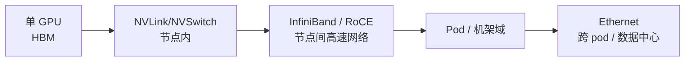

# 第 8 讲：大规模分布式训练——ZeRO、FSDP 与 3D/4D 并行

> Stanford CS336；整理自 `lecture_08.pdf`。本讲从“单节点多 GPU”扩展到“数据中心级计算”，讨论显存、通信和利用率之间的系统权衡。
>
> 记号：$P$ 表示参数个数，$p$ 表示参与某个并行维度的 GPU 数，$B$ 表示 batch，$b$ 表示 micro-batch，$s$ 表示序列长度，$h$ 表示 hidden size，$\alpha$ 表示通信启动延迟，$\beta=1/B_{\text{link}}$ 表示每字节传输时间。

## 0. 为什么需要分布式并行

### 0.1 单 GPU 的两个上限

- 计算：单卡吞吐有限，而世界上最快的超级计算机已进入 ExaFLOPS（$10^{18}$ FLOPs/s）级别；训练更大的语言模型需要把计算分散到更多 GPU。
- 内存：大模型的权重、梯度、优化器状态和激活通常无法放入一张 GPU。

解决方案是多 GPU、多机器并行：把模型的**内存和计算需求**拆分到设备与节点，并用高速互联交换必要信息。

### 0.2 新的“计算单元”：数据中心



理想的大规模系统希望同时获得：

1. **线性内存扩展**：GPU 数增加 $p$ 倍，能容纳的模型参数也约增加 $p$ 倍；
2. **线性计算扩展**：模型 FLOPs 分到更多 GPU 后吞吐约增加 $p$ 倍；
3. 简单且可组合的 collective communication。

现实中通信带宽、延迟、拓扑、负载不均衡和故障都会让理想线性扩展打折。

---

## 1. 集合通信与网络拓扑

### 1.1 五个必须掌握的原语

| 原语 | 一句话 | 在分布式训练中的角色 |
| --- | --- | --- |
| Reduce | 所有 rank 做 sum/min/max，结果通常到一个 rank | 聚合梯度/统计量 |
| All-reduce | Reduce 后把结果广播给所有 rank | 朴素 DDP 同步完整梯度 |
| All-gather | 各 rank 的局部片段拼成完整张量，并让所有 rank 都得到 | FSDP 前向重组参数 |
| Reduce-scatter | 对对应片段先归约，再把结果片段分给不同 rank | FSDP/ZeRO 梯度分片 |
| All-to-all | 每个 rank 给每个 rank 发送不同切片 | MoE token dispatch |

Broadcast、scatter、gather 是基础操作：broadcast 把 rank 0 的数据复制到所有 rank；scatter 把一个张量切片给各 rank；gather 把各 rank 切片收集到 rank 0。

### 1.2 All-reduce 的分解

对总大小为 $S$ 的张量，all-reduce 可分两步：

1. **Reduce-scatter**：所有 rank 的对应元素求和，每个 rank 只留下 $1/p$ 的结果；
2. **All-gather**：把各 rank 的结果片段交换，使每个 rank 得到完整和。

```text
r0: [a0 a1 a2 a3]   r1: [b0 b1 b2 b3]
       reduce-scatter: 各列求和并分片
r0: [a0+b0]         r1: [a1+b1] ...
       all-gather: 所有 rank 交换片段
每个 rank: [a0+b0, a1+b1, a2+b2, a3+b3]
```

带宽受限时，ring 算法的每 rank 数据量近似

$$
V_{\text{all-reduce}}
=2\frac{p-1}{p}S,
$$

其中一个 $S(p-1)/p$ 来自 reduce-scatter，一个来自 all-gather。因此把 all-reduce 写成 RS+AG 在大消息时基本是最优带宽路径，且允许我们只保存/只更新某个分片。

启动延迟显著时可用 alpha-beta 模型：

$$
T_{\text{all-reduce}}
\approx 2(p-1)\alpha+2\frac{p-1}{p}\frac{S}{B_{\text{link}}}.
$$

### 1.3 Mesh、Tree 与 All-to-all

TPU 传统上常用规则的 toroidal mesh：邻居链路短、成本可控、适合结构化 tensor parallel。GPU 集群常见 NVSwitch + 分层交换网络，支持更一般的 all-to-all，适合 MoE 专家路由。

| 拓扑 | 优点 | 适合 |
| --- | --- | --- |
| Mesh/torus | 结构规则、成本较低，可做高吞吐邻居交换 | Tensor/sequence parallel |
| Tree / switched network | 路径灵活、汇聚/广播方便 | 不规则通信、expert parallel |
| 全互联 | 延迟低、路径多 | 小规模/节点内；成本和布线随规模快速上升 |

TPU v8i/t 等新系统也可能采用更接近树或交换网络的 scale-out 拓扑；“为什么不把所有设备直接相连”取决于域大小、布线成本、功耗、故障域和通信模式。

---

## 2. 朴素数据并行的显存问题

### 2.1 Naïve Data Parallel / DDP

朴素 SGD：

$$
\theta_{t+1}=\theta_t-\eta\sum_{i=1}^{B}\nabla f(x_i;\theta_t).
$$

将 batch 分成 $p$ 份，每 GPU 计算 $B/p$ 个样本，再 all-reduce 梯度：

- 计算量约随 $p$ 线性下降；
- 每步通信约为 $2P$（梯度发送+接收的常见带宽口径）；
- 显存几乎不随 $p$ 减少：每个 rank 仍要放完整参数、梯度和优化器状态。

当全局 batch 很大时，$O(P)$ 通信可被计算隐藏；当 GPU 数接近 batch 大小时，每卡样本太少、通信占比高，扩展会变差。

### 2.2 每个参数到底需要多少字节？

以混合精度 Adam 训练为例，朴素数据并行的每卡状态可能包括：

| 状态 | 常见格式 | 每参数字节 |
| --- | --- | ---: |
| 模型参数（forward） | FP16/BF16 | 2 |
| 梯度 | FP16/BF16 | 2 |
| FP32 master weight | FP32 | 4 |
| Adam 一阶矩 $m$ | FP32 或 BF16 | 4（或 2） |
| Adam 二阶矩 $v$ | FP32 或 BF16 | 4（或 2） |
| **典型总计** | 2+2+4+4+4 | **16 B/param** |

所以 $P$ 个参数至少需要约 $16P$ 字节（不同优化器/精度会改变常数）。讲义把“参数+梯度”视作 4 B，把优化器相关 master、$m$、$v$ 合并成 $K$ B，则

$$
M_{\text{DDP}}\approx(4+K)P.
$$

---

## 3. ZeRO：利用 RS+AG 消除冗余

ZeRO（Zero Redundancy Optimizer）的核心不是改变数学结果，而是**把原本复制在每个 rank 的状态切片**；利用 reduce-scatter 和 all-gather，在需要时交换数据。

### 3.1 ZeRO Stage 1：Optimizer State Sharding

#### 显存布局

- 每个 rank 仍保存完整模型参数（2 B/param）和完整梯度（2 B/param）；
- Adam 的 master weight、first moment、second moment 只保存自己负责的 $1/p$ 片段；
- 每个 rank 负责更新对应参数片段。

若 $K$ 表示 master + optimizer state 的字节数，则

$$
M_{\text{ZeRO-1}}
\approx\left(4+\frac{K}{p}\right)P.
$$

#### 每一步

1. 每个 rank 对本地 batch 做完整 forward/backward，得到完整梯度；
2. 对梯度做 reduce-scatter，把每个参数片段的聚合梯度发给负责它的 rank（约 $P$ 的通信量）；
3. 每个 rank 用自己的梯度片段和 optimizer state 更新自己的参数片段；
4. all-gather 参数片段，让所有 rank 恢复完整参数（约 $P$ 的通信量）。

总通信仍约为 $2P$，与朴素 DDP 同量级；在带宽受限、实现能有效重叠时，Stage 1 基本是“免费”的显存收益。

### 3.2 ZeRO Stage 1 与 DDP 比较

| 项目 | 朴素 DDP | ZeRO Stage 1 |
| --- | --- | --- |
| 通信原语 | 一次 gradient all-reduce | gradient reduce-scatter + parameter all-gather |
| 通信量（常见口径） | $2P$ | $2P$ |
| 每卡显存 | $(4+K)P$ | $(4+K/p)P$ |
| 参数/梯度 | 完整复制 | 完整复制 |
| 优化器状态 | 完整复制 | $1/p$ 分片 |

### 3.3 ZeRO Stage 2：再切梯度

Stage 2 还把梯度分片保存：

- 每个 rank 仍负责完整模型的计算；
- backward 经过某层时，梯度一产生就 reduce-scatter 到负责该参数的 rank；
- 本 rank 不再需要的完整梯度立即释放；
- 每个 rank 用本地梯度片段和 optimizer state 更新参数片段；
- 更新后 all-gather 参数。

显存近似为

$$
M_{\text{ZeRO-2}}
\approx\left(2+\frac{2+K}{p}\right)P,
$$

其中 2 B 是复制的 forward 参数，梯度和 optimizer state 都按 $1/p$ 分片。困难在于：不能等 backward 结束再产生一个完整梯度向量，必须按层/按 bucket 增量通信和释放。

### 3.4 ZeRO Stage 3 / FSDP：参数也分片

Stage 3（实践中常由 PyTorch FSDP 实现）把**参数、梯度、优化器状态全部分片**：

- 平时每个 rank 只保留自己 $1/p$ 的参数分片；
- 某个模块即将 forward 时，all-gather 它的参数；
- 计算完后可以释放 full parameter，保留必要的本地分片/激活；
- backward 使用同样的按需 all-gather；
- 梯度产生后 reduce-scatter，直接存到对应 rank；
- 只由持有该分片的 rank 更新参数。

稳态显存约为

$$
M_{\text{FSDP}}\approx\frac{(2+2+K)P}{p}+M_{\text{transient}},
$$

其中 `transient` 是当前模块 all-gather 的临时 full parameter、通信 buffer 和激活。

#### 通信量

一个参数生命周期通常包括：

- forward 参数 all-gather：$P$；
- backward 参数 all-gather：$P$；
- 梯度 reduce-scatter：$P$。

因此 Stage 3 约为 $3P$，相对 DDP 的 $2P$ 是约 1.5 倍通信（忽略 latency、bucket 和重叠）。

#### 通信/计算重叠

实际 FSDP 不是“等完整模型到齐再算”：

```text
预取 W1 的 all-gather  ───────────────┐
计算 W0 x                             │ 通信与计算重叠
释放 W0 / 使用 W1                     │
计算 W1 x                             ┘
```

参数和梯度按 FSDP block/bucket 请求、发送、释放；后续 block 的 all-gather 可以在当前 block 计算时进行，从而隐藏部分通信成本。

一个最小的 PyTorch FSDP（ZeRO-3）训练骨架如下。真实 Transformer 通常按 block 包装，以便控制 all-gather bucket 和 activation checkpoint：

```python
import torch
import torch.distributed as dist
from torch import nn
from torch.distributed.fsdp import FullyShardedDataParallel as FSDP


def train_one_rank(rank, world_size):
    torch.cuda.set_device(rank)
    dist.init_process_group("nccl", rank=rank, world_size=world_size)

    model = nn.Sequential(
        nn.Linear(4096, 4096), nn.GELU(),
        nn.Linear(4096, 4096),
    ).cuda(rank)
    model = FSDP(model, device_id=torch.device("cuda", rank))
    optimizer = torch.optim.AdamW(model.parameters(), lr=1e-4)

    tokens = torch.randn(8, 4096, device=f"cuda:{rank}")
    loss = model(tokens).square().mean()
    loss.backward()       # 梯度按 FSDP shard 归约
    optimizer.step()      # rank 只更新自己负责的 optimizer shard
    optimizer.zero_grad(set_to_none=True)
    dist.destroy_process_group()
```

FSDP wrapper 在 forward 前 all-gather 当前模块的 full parameters，在 backward 后 reduce-scatter gradients，并及时释放临时 full parameters；这段代码中的 `loss.backward()`/`optimizer.step()` 看起来和单卡相同，通信由 wrapper 插入。

---

## 4. ZeRO 的显存推导与实际量级

### 4.1 8×A100 80GB 的讲义示例

讲义给出的可容纳参数量（数量级，取决于实现和激活预算）：

| 配置 | 最大参数量 |
| --- | ---: |
| 朴素 baseline | 约 6.66B |
| ZeRO Stage 1 | 约 16B |
| ZeRO Stage 2 | 约 24.62B |
| ZeRO Stage 3 | 约 53.33B |

若参数和梯度用 BF16，并使用 Kahan summation 等方式维持数值精度，优化器状态可以减少；一种“除 master weight 外尽量 BF16”的估算约为 12 B/param：

$$
\text{bytes/param}
\approx 2\;(\text{BF16 param})
+\frac{10\;(\text{grad+state})}{p}.
$$

例如 $p=8$ 时，每卡仅参数/分片状态的平均量级为

$$
2+\frac{10}{8}=3.25\text{ B/param},
$$

还要加激活、通信 buffer、临时 all-gather 和框架开销。这个公式不是容量保证，实际可训练规模还受序列长度、batch、checkpointing、碎片化影响。

### 4.2 数据并行仍未解决的两个问题

1. **计算扩展**：GPU 数不能超过有效 batch 的并行度；batch 增大还有优化/泛化上的收益递减。
2. **激活显存**：Stage 1/2 不降低参数复制，Stage 3 主要降低参数/梯度/优化器状态，仍可能被每层激活撑爆。

因此要引入模型并行和激活并行。

---

## 5. 模型并行：沿深度、宽度和专家切分

模型并行把参数分到 GPU，但不同于 FSDP “需要时传参数”，常见方式是让 GPU 长期持有不同层/矩阵片段，并传递激活。

### 5.1 Pipeline Parallel（沿深度）

把若干连续层分配给 stage，激活和部分梯度在 stage 间传递。朴素层并行利用率很差：$p$ 个 GPU 中每一时刻通常只有一个 GPU 工作，有用时间比例约 $1/p$。

使用 $m$ 个 micro-batch 后，流水线 bubble 近似为

$$
\text{bubble ratio}=\frac{p-1}{m},
\qquad
\text{useful fraction}\approx\frac{m}{m+p-1}.
$$

**为什么仍然使用 PP？**

- 相比 DDP，单卡只需保存部分层，节省参数显存；
- 相比跨节点 FSDP，通信只涉及相邻 stage 的 activation，是点对点；
- 适合较慢的 inter-node 网络。

若激活形状为 $b\times s\times h$，每个 micro-batch 的通信约为该量级；代价是必须提供较大的 global batch 或梯度累积来填充气泡。

### 5.2 Tensor Parallel（沿宽度）

将线性层矩阵切成子矩阵，利用矩阵乘的分配律：

**Column-wise：**

$$
W=[W_1,W_2],
\qquad XW=[XW_1,XW_2].
$$

各 GPU 计算一部分输出，必要时 all-gather；前向常把通信记作 identity/all-gather，反向对相应梯度做 all-reduce。

**Row-wise：**

$$
W=\begin{bmatrix}W_1\\W_2\end{bmatrix},
\qquad
X=[X_1,X_2],
\qquad
XW=X_1W_1+X_2W_2.
$$

各 GPU 先计算部分和，再 all-reduce 求和。

Transformer 中：

| 模块 | 切分 |
| --- | --- |
| QKV、MLP up-projection | Column-wise |
| Attention output、MLP down-projection | Row-wise |
| LayerNorm、router 等 | 通常 replicated |

TP 没有 PP 的 pipeline bubble，不需要很大的 batch；代价是每层都有阻塞式 activation collective，要求低延迟高带宽互联。讲义用量级比较：PP 每个 micro-batch 传约 $bsh$ 的点对点激活，TP 每层可能有约 $8bsh$ 级别的 all-reduce/激活通信（具体常数随 block、精度和实现变化）。因此 TP 通常限制在一个节点内（最多约 8 GPU）。

### 5.3 Activation/Sequence Parallel

参数切分并不自动切掉 LayerNorm、Dropout 和 attention/MLP 输入的激活。设一层激活包含：

- 线性/矩阵乘相关项：可由 TP 分摊；
- 约 $O(bsh)$ 的 LayerNorm、Dropout、残差输入等逐元素项；
- attention score/dropout 相关的 $O(bs^2)$ 项。

可抽象写成

$$
M_{act,layer}
\approx c_1\,bsh+c_2\,bs^2,
$$

其中 $c_2bs^2$ 来自 attention 的二次项（包括 dropout 等中间量）。按讲义的项数记法，约有 5 类 $bs^2$ 项来自 attention score/dropout；另有约 10 类 $bsh$ 项不会因为 TP 的矩阵切分自动消失：LayerNorm 约占 $4bsh$、Dropout 约占 $2bsh$，attention 与 MLP 的输入合计约占 $4bsh$。FlashAttention/activation recomputation 可去掉或降低二次项，但这些线性项仍会随序列长度增长。

**Sequence parallel（SP）** 观察到 $c_1bsh$ 中很多操作沿 sequence 轴逐元素：将序列切到不同 GPU，让 LayerNorm/Dropout 等也只处理 $1/SP$ 的序列分片。

- 前向：需要的方向使用 all-gather，另一个方向使用 reduce-scatter；
- 反向：两者交换；
- 与 TP 结合后，相关 activation memory 近似再除以 SP 大小。

**Context parallel / Ring attention** 更进一步沿长上下文序列切分激活/KV，在 GPU 之间环形交换 KV，主要服务长上下文阶段。

### 5.4 Expert Parallel（MoE）

MoE 不切矩阵乘，而是切专家：

1. router 为每个 token 选择 top-k 专家；
2. 通过 all-to-all 把 token 发到持有目标专家的 rank；
3. 各 rank 执行本地专家 MLP；
4. all-to-all 把结果送回原 token 所在 rank。

EP 对 MLP 的行为类似 TP：降低每卡专家参数和激活；但 all-to-all 不规则、负载可能不均衡，且小 batch/token 数会降低矩阵乘效率。EP 可扩展到较大的设备数，但工程难度高。

注意力通常不含 MoE，导致 attention 与 MLP 的最佳并行度不同：

- attention 可能需要较高 TP/CP；
- MLP 更适合 EP。

Megatron 等系统可把 attention 与 MLP 解耦，分别设置 TP/CP/DP 和 ETP/EP/EDP（Expert Tensor/Expert/Data Parallel）。

---

## 6. 3D/4D 混合并行

### 6.1 世界大小分解

经典三维并行把设备网格分为：

$$
N_{GPU}=DP\times TP\times PP.
$$

MoE/长上下文系统再加专家或上下文维度：

$$
N_{GPU}\approx DP\times TP\times PP\times EP
$$

或把 SP/CP 作为某些维度的子网格。实际产品会让 DP 与 EP 共享副本关系、让 TP/SP 绑定在节点内，因此不能只看简单乘法，还要确认每种通信的 rank group。

### 6.2 经验规则

1. **先让模型放得下**：
   - 节点内先用 TP/EP（利用 NVLink）；
   - 跨节点使用 PP，或在带宽足够时使用 ZeRO-3/FSDP；
   - 若 batch 太小，使用 gradient accumulation 增加 micro-batch 数。
2. **模型放下后再扩展吞吐**：剩余 GPU 尽量用 DP；DP 在全局 batch 足够大时更容易接近线性。
3. TP 通常不超过 8（单节点 GPU 数）；64 台机器常见 $8\times8$ 的 TP×PP 配置，剩余维度给 DP。
4. 激活重计算可能“用额外 FLOPs 换更大 batch”，而更大的 batch 又能提升通信效率和吞吐，因此总体反而更快。

### 6.3 一个资源配置例子

若有 64 台机器，每台 8 GPU，可采用：

```text
TP = 8（单节点内）
PP = 8（跨 8 个节点）
DP = 64 / 8 = 8（其余副本）
```

具体数值要由参数显存、activation memory、网络拓扑和目标 batch 调整；TP=8 往往是经验上的甜点，而不是硬性定理。

---

## 7. 实际大模型的并行配置

讲义以公开系统/论文中的配置说明“没有唯一最佳方案”。下表保留其中的代表性组合；`?` 表示资料未给出或由其他维度推导，不能把未知值当成固定标准。

| 模型/系统 | DP/ZeRO | TP / SP | EP | PP | CP/其他 | 观察 |
| --- | --- | --- | --- | --- | --- | --- |
| DeepSeek V3 | ZeRO-1 | TP/SP 较小 | 64-way（约 8 节点） | 16 | 依阶段 | 1F1B 与 all-to-all overlap |
| Yi | ZeRO-1 | TP + PP | 由 Yi-lightning 用 EP 替代部分 TP | >0 | 依阶段 | MoE 化降低 MLP 通信 |
| Llama 3 405B | Stage 1/2/3 依阶段 | 8 | 0 | 16 | CP=1 | 小 batch/预训练/长上下文阶段策略不同 |
| Gemma 2（2/9/27B） | ZeRO-3 | TP+SP=8 | 0 | 0 | 0 | 模型规模较小，FSDP 解决复制 |
| Mixtral 8×22B | 2（Megatron 示例） | 4 | 8 | 4 | CP=1 | TP/PP/CP/EP 组合 |
| Nemotron 3 Super 120B-A12B | ? | 2 | 64 | 依长上下文配置 | CP=64 | 长上下文阶段大量 CP |
| Qwen 3 225B-A22B / 30B-A3B | ? | 2 | 32 | 8 | CP=1 | 主要依赖 EP，扩大规模时采用 2/8/32 等维度 |

讲义还给出以下趋势：

- DeepSeek V3：ZeRO Stage 1 + TP/Sequence + PP(16) + EP(64)；
- Yi：ZeRO Stage 1 + Tensor + Pipeline，Yi-lightning 以 Expert parallelism 替代 Tensor parallelism 的一部分；
- Llama 3 405B：不同阶段采用 Stage 1、小 batch/Stage 2、长上下文/Stage 3 等变化；
- Mixtral：Megatron 配置中 TP/PP/CP/EP 约为 4/4/1/8，若总 GPU 256，DP 约为 2；
- 大规模训练还必须处理 GPU 故障、重启、检查点和节点失效，设备越多故障概率越高。

---

## 8. 综合比较表

| 方法 | 同步/通信 | 每 rank 参数内存 | 每 rank 激活/KV | 主通信成本 | 全局 batch 扩展 | 难度 |
| --- | --- | --- | --- | --- | --- | --- |
| DDP / ZeRO-1 | 每步梯度 all-reduce；ZeRO-1 用 RS+AG | DDP 无参数缩放；ZeRO-1 只切 optimizer state | 基本不变 | 梯度约 $O(P)$ | DP 可线性扩展，受 batch 限制 | 低 |
| ZeRO-2 | backward 时梯度 reduce-scatter，参数 all-gather | 参数复制，梯度/optimizer $1/DP$ | 基本不变 | 约 $O(P)$，可按层重叠 | 同上 | 中 |
| FSDP / ZeRO-3 | forward/backward all-gather + 梯度 reduce-scatter | 参数/梯度/optimizer 约 $1/DP$ | 基本不变 | 参数约 $O(P)$，约 DDP 1.5 倍；可 overlap | DP 可扩展 | 中 |
| Pipeline | stage 间 activation P2P | 约 $1/PP$ 层 | 取决于 pipeline buffer | 每 micro-batch 约 $bsh$ | 需要 micro-batch，受 bubble | 高 |
| Tensor | 每 block 阻塞 activation collective | TP 权重约 $1/TP$ | 矩阵乘相关约 $1/TP$；配 SP 更低 | 每层 activation-size all-reduce/gather | 不依赖大 batch，但要求快网络 | 高 |
| Sequence/Context | 每层 sequence/KV 分片交换 | 参数不变 | 序列侧约 $1/SP$ 或 $1/CP$ | activation/KV 通信 | 不负责 batch 扩展 | 高 |
| Expert | 每个 MoE 层 token dispatch all-to-all | 专家权重约 $1/EP$ | 依路由/容量 | token routing all-to-all | 需要每专家足够 token | 高 |

---

## 9. 本讲总结

1. 超大模型需要把“节点”当成新的计算单元：不仅拆计算，还要拆参数、梯度、优化器状态和激活。
2. All-reduce 可分解为 reduce-scatter + all-gather；这个等价关系让 ZeRO/FSDP 在不改变数学结果的前提下消除状态冗余。
3. ZeRO-1 切 optimizer，ZeRO-2 再切 gradient，ZeRO-3/FSDP 连 parameter 也切；显存从复制趋近 $1/p$，但 Stage 3 通信从约 $2P$ 增到约 $3P$，需要 overlap 掩盖。
4. PP 按深度切，通信少但有 bubble；TP 按宽度切，没有 bubble 但每层通信频繁；SP/CP 处理激活/KV，EP 处理 MoE 专家路由。
5. 3D/4D 并行不是把所有维度任意相乘：TP/EP 通常放节点内，PP 用于跨节点让模型放下，DP 用于最后的吞吐扩展；rank group 必须与拓扑匹配。
6. 训练规模越大，通信延迟、负载不均、激活峰值和 GPU 故障越重要；正确的并行布局、重计算、梯度累积与检查点策略共同决定真实吞吐。
