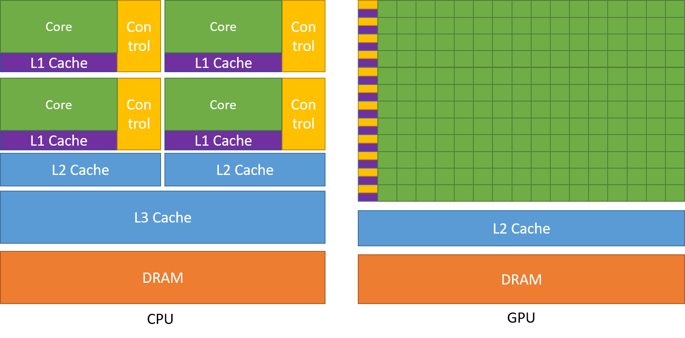
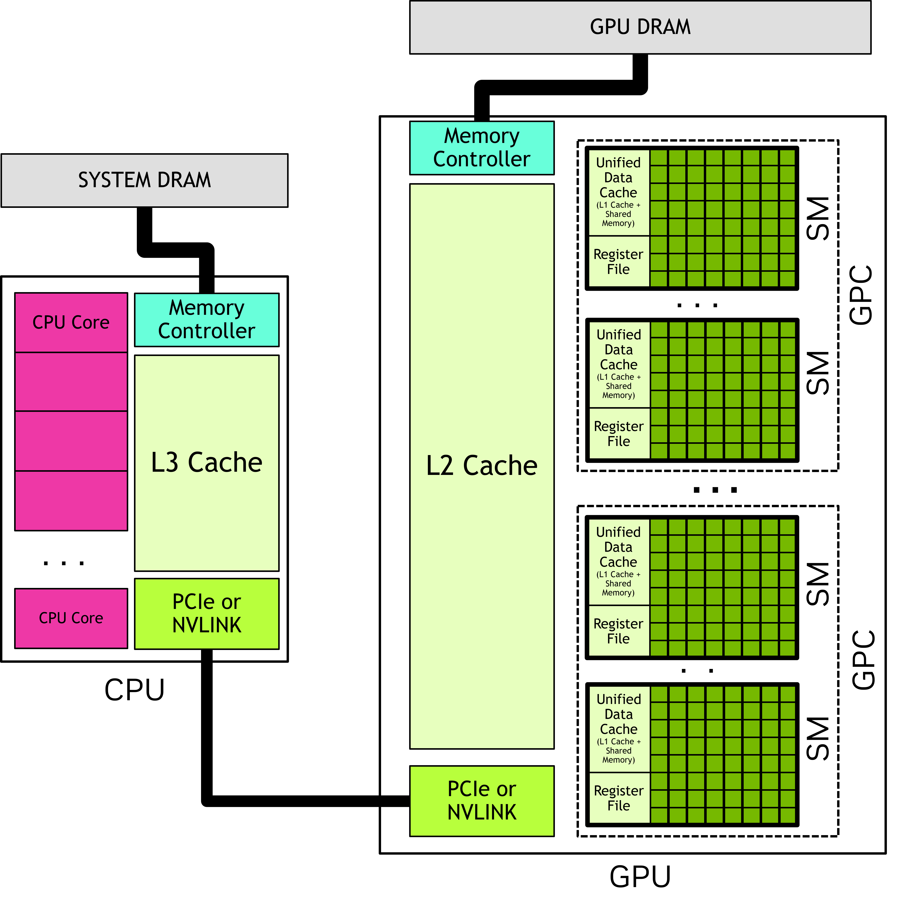
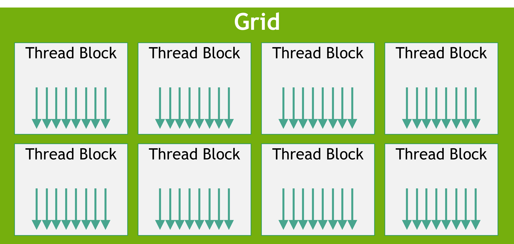
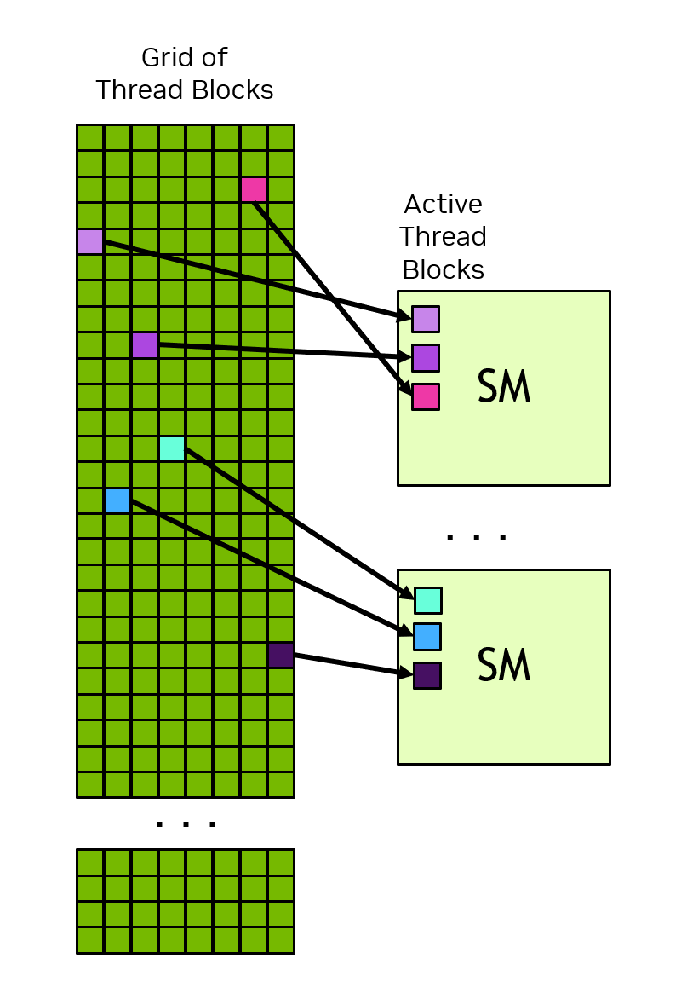
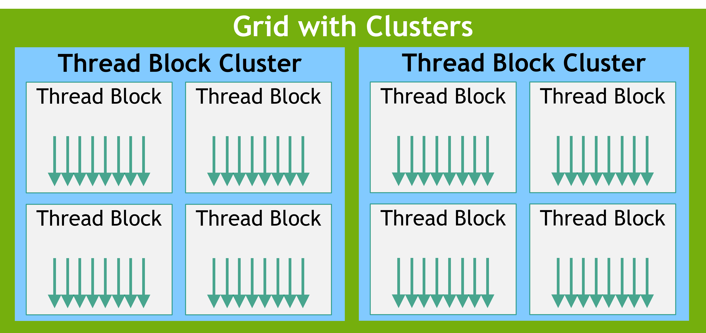
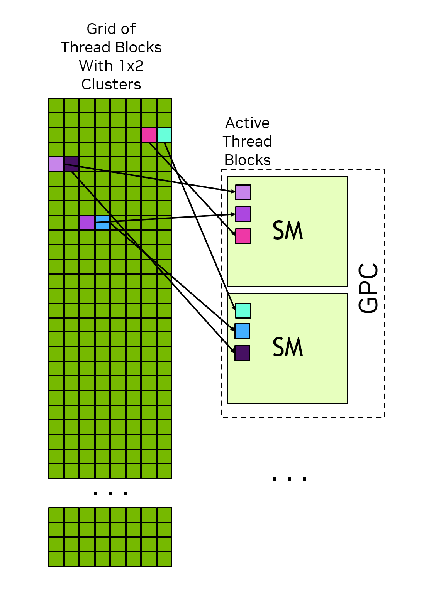
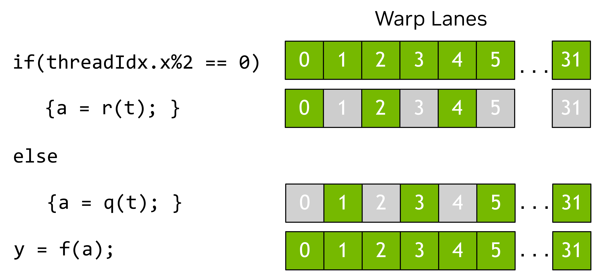
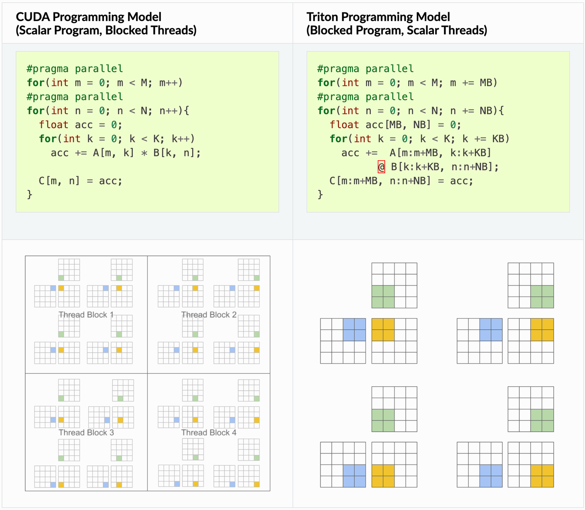

# 1 GPU 编程模型

## 1.1 GPU与CPU的差异



## 1.2 GPU 硬件模型



$$
\begin{aligned}
&\text{CPU(Cores)} \xrightarrow{\text{Memory Controller}} \text{System Memory} \\
&\quad \updownarrow \text{Interconnect: PCIe / NVLINK} \\
&\text{GPU} \xrightarrow{\text{Connected to}} \text{GPU Memory} \\
&\quad \text{L } \text{GPCs (Graphics Processing Clusters)} \\
&\quad \quad \text{L } \text{SMs (Streaming Multiprocessors)} \\
&\quad \quad \quad \text{L } \text{Many Functional Units}
\end{aligned}
$$
### 1.2.1 线程块(block)和网格(Grid)



### 维度

线程块和网格可以是 1、2 或 3 维的，这些维度可以简化将单个线程映射到工作单元或数据项的过程。

### 启动配置(Execution Configuration)

网格和线程块的维度、Cluster Size、Stream、SM配置

### 唯一身份(Unique Identity)

每个线程都可以通过内置变量（如 `threadIdx`, `blockIdx`, `blockDim`, `gridDim`）确定自己在 Block 中的位置以及 Block 在 Grid 中的位置，让每个线程知道自己该处理哪一部分数据。

### 线程块与 SM 的绑定关系

同一个线程块内的所有线程都在同一个SM中执行。这使得线程块内的线程能够高效地相互通信和同步。线程块内的所有线程都可以访问片上共享内存，用于在线程块内的线程之间交换信息。

### 硬件调度与执行的独立性

- **资源映射 (Many-to-Few)** ：
  - 一个Grid可能包含数百万个线程块，但 GPU 硬件可能只有几十或几百个 SM。
  - SM 会轮流处理这些线程块，线程块一旦被分配到 SM，通常会一直运行到结束。
  - 在某些情况下，例如使用CUDA 动态并行等功能时，线程块可能会被挂载到内存中。这意味着 SM 的状态会被存储到 GPU 内存中由系统管理的区域，而 SM 则会被释放以执行其他线程块。这类似于 CPU 上的上下文交换，但在 GPU 上并不常见。
- **无序性与独立性 (No Scheduling Guarantees)** ：
  - **线程块之间的执行顺序是没有保证的**。
  - **核心准则**：一个线程块**绝对不能**依赖另一个线程块的中间计算结果。因为被依赖的那个块可能根本还没开始运行，甚至在等待当前块释放 SM 资源。

    

### 1.2.2 线程块集群 (Thread Block Clusters)

- 处于同一个 Cluster 内部的线程块，虽然运行在不同的 SM 上，但它们可以通过极高速的网络**直接访问彼此的 Shared Memory**。
  
- 同一集群内的线程块被调度到**同一个 GPC** 中执行。

  

### 1.2.3 Warps 与 SIMT

在一个线程块内，线程被组织成32个线程一组的线程组，称为线程束（warp）。一个线程束以单指令多线程（SIMT）模式执行内核代码。在SIMT中，线程束内的所有线程都执行相同的内核代码，但每个线程可以执行不同的代码分支。也就是说，尽管程序的所有线程执行相同的代码，但它们不必遵循相同的执行路径。
当线程由线程束执行时，它们会被分配到一个线程束通道。线程束通道的编号为 0 到 31，线程块中的线程会按照硬件多线程中详述的可预测方式分配到各个线程束。
线程束中的所有线程同时执行同一条指令。如果线程束中的某些线程在执行过程中遵循某个控制流分支，而其他线程则不遵循，那么不遵循分支的线程将被屏蔽，而遵循分支的线程则会被执行。例如，如果某个条件仅对线程束中一半的线程成立，那么另一半线程束将被屏蔽，而活动的线程则会执行这些指令。这种情况如图[7](https://docs.nvidia.com/cuda/cuda-programming-guide/01-introduction/programming-model.html#active-warp-lanes)所示。当线程束中的不同线程遵循不同的代码路径时，这种情况有时被称为线程束发散。因此，当线程束中的线程遵循相同的控制流路径时，GPU 的利用率最高。
在 SIMT 模型中，线程束 (warp) 中的所有线程都以同步的方式执行内核。硬件执行方式可能有所不同。有关此区别的重要性，请参阅[“独立线程执行”](https://docs.nvidia.com/cuda/cuda-programming-guide/03-advanced/advanced-kernel-programming.html#advanced-kernels-independent-thread-scheduling)部分。不建议利用线程束执行如何映射到实际硬件的知识。CUDA 编程模型和 SIMT 都规定，线程束中的所有线程同时执行代码。只要遵循编程模型，硬件就可以以对程序透明的方式优化掩码通道。如果程序违反此模型，则可能导致未定义行为，并且在不同的 GPU 硬件上可能有所不同。
虽然编写 CUDA 代码时并非必须考虑线程束（warp），但理解线程束执行模型有助于理解[全局内存合并](https://docs.nvidia.com/cuda/cuda-programming-guide/02-basics/writing-cuda-kernels.html#writing-cuda-kernels-coalesced-global-memory-access)和[共享内存库访问模式](https://docs.nvidia.com/cuda/cuda-programming-guide/02-basics/writing-cuda-kernels.html#writing-cuda-kernels-shared-memory-access-patterns)等概念。一些高级编程技巧利用线程块内线程束的特化来限制线程发散并最大化资源利用率。这种优化以及其他优化都利用了线程在执行时被分组到线程束中的特性。
线程束执行的一个影响是，线程块的最佳线程总数应为 32 的倍数。虽然可以使用任意数量的线程，但如果线程总数不是 32 的倍数，则线程块的最后一个线程束在整个执行过程中都会有一些通道未被使用。这很可能导致该线程束的功能单元利用率和内存访问效率低下。

> SIMT 常被拿来与单指令多数据 (SIMD) 并行计算进行比较，但两者之间存在一些重要的区别。在 SIMD 中，执行遵循单一的控制流路径，而在 SIMT 中，每个线程都可以遵循自己的控制流路径。因此，SIMT 的数据宽度不像 SIMD 那样固定。关于 SIMT 的更详细讨论，请参阅SIMT 执行模型。

在 SM 内部，线程并非完全独立调度，而是以 **Warp** 为单位执行：

- **Warp：**  由 32 个线程组成的基本执行单元。
- **SIMT (Single Instruction, Multiple Threads 单指令多线程)：**  同一 Warp 内的所有线程在同一时刻执行相同的指令，但每个线程可以有不同的控制流分支。
- **Warp 分歧 (Divergence)：**  如果线程进入不同的 `if/else` 分支，不符合条件的线程会被“遮掩（Masked off）”，这会降低硬件利用率。
- **最佳实践：**  建议线程块的大小设置为 **32 的倍数**，以确保所有 Warp 都能满载运行。

在此示例中，只有线程索引为偶数的线程才会执行 if 语句的主体，其他线程在执行主体时会被屏蔽


### 1.2.4 GPU内存层次结构

|**内存类型**|**位置**|**访问权限 (Scope)**|**访问速度**|**编程控制**|
| :-| :--------| :---------------------| :----------------| :---------|
|**寄存器**|片上 (SM)|单个线程 (Thread)|极快|编译器自动|
|**共享内存**|片上 (SM)|线程块 (Block/Cluster)|很快|程序员手动|
|**L1 缓存**|片上 (SM)|线程块 (Block)|很快|自动|
|**L2 缓存**|芯片内|所有 SM 共有|中等|自动|
|**全局内存**|外部 DRAM|所有 SM + 主机|较慢|程序员手动|
|**主机内存**|系统 DRAM|CPU (GPU 通过传输访问)|最慢 (受带宽限制)|程序员手动|

### 1.2.4.1 异构系统中的 DRAM 内存

在宏观层面，系统内存分为两个主要部分。虽然它们在逻辑上可能处于同一个统一虚拟地址空间，但在物理上是分离的。

- **主机内存 (Host Memory / System Memory):**  直接连接到 CPU 的 DRAM。
- **全局内存 (Global Memory / Device Memory):**  直接连接到 GPU 的 DRAM。之所以称为“全局”，是因为 GPU 内部的所有流式多处理器（SM）都可以访问它。

### 1.2.4.2 GPU 内部存储层级 (On-Chip Memory)

GPU 内部（片上）存储速度极快，但容量非常有限。其分配方式决定了内核能否成功启动。

### 核心片上存储：

1. **寄存器堆 (Register File):**
   - **粒度：**  每个线程私有。
   - **特点：**  速度最快。如果一个线程块所需的寄存器总数超过 SM 的上限，内核将无法启动。
2. **共享内存 (Shared Memory):**
   - **粒度：**  整个线程块（Thread Block）或集群（Cluster）共有。
   - **用途：**  用于同一块内线程间的高效数据交换。
3. **L1 缓存 / 统一数据缓存:**
   - 与共享内存共用物理资源，比例可调。

### 缓存层级 (Caches)

除了可编程的内存，GPU 还有一套自动管理的缓存系统：

- **L1 Cache:**  每个 SM 独占，用于加速局部数据访问。
- **L2 Cache:**  所有 SM 共享，负责减少对全局内存（DRAM）的访问压力。
- **常量缓存 (Constant Cache):**  专门用于缓存全局内存中声明为 `constant` 的只读数据，适合多个线程同时读取相同参数的场景。

### 1.2.4.3 统一内存 (Unified Memory)

这是一种高级特性，旨在简化内存管理。

- **传统方式：**  程序员必须手动调用 API（如 `cudaMemcpy`）在 CPU 和 GPU 之间搬运数据。
- **统一内存：**  创建一个 CPU 和 GPU 都能访问的托管内存池。
- **机制：**  系统底层会自动按需迁移数据（Data Migration）。
- **注意：**  虽方便，但过度频繁的自动迁移会产生性能开销。

# Triton与CUDA的区别


**Triton 的核心理念是基于分块的编程范式可以促进神经网络的高性能计算核心的构建**。CUDA 编写属于传统的 “单程序，多数据” GPU 执行模型，在线程的细粒度上进行编程，Triton 是在分块的细粒度上进行编程。例如，在矩阵乘法的情况下，CUDA和Triton有以下不同
可以看出 triton 在循环中是逐块进行计算的，导致了块结构的迭代空间，为程序员在实现稀疏操作时提供了更多的灵活性，同时允许编译器为数据局部性和并行性进行积极的优化。

# Triton开发样例

## 1 Triton vector addition 算子

### Triton kernel

```
import torch

import triton
import triton.language as tl

@triton.jit
def add_kernel(x_ptr,  # 第一个输入向量的指针。
               y_ptr,  # 第二个输入向量的指针。
               output_ptr,  # 输出向量的指针。
               n_elements,  # 向量的大小。
               BLOCK_SIZE: tl.constexpr,  # 每个程序应该处理的元素数量。
               # 注意：`constexpr` 可以作为形状值使用。
               ):
    # 有多个'程序'处理不同的数据。我们在这里标识我们是哪个程序：
    pid = tl.program_id(axis=0)  # 我们使用 1D launch 网格，因此 axis 是 0。
    # 该程序将处理与初始数据偏移的输入。
    # 例如，如果您有长度为 256 的向量和块大小为 64，程序
    # 将分别访问元素[0:64, 64:128, 128:192, 192:256]。
    # 请注意，偏移量是指针的列表：
    block_start = pid * BLOCK_SIZE
    offsets = block_start + tl.arange(0, BLOCK_SIZE)
    # 创建一个掩码以防止内存操作超出范围。
    mask = offsets < n_elements
    # 从 DRAM 加载 x 和 y，以掩盖掉输入不是块大小的倍数的任何额外元素。
    x = tl.load(x_ptr + offsets, mask=mask)
    y = tl.load(y_ptr + offsets, mask=mask)
    output = x + y
    # 将 x + y 写回到 DRAM。
    tl.store(output_ptr + offsets, output, mask=mask)

```
