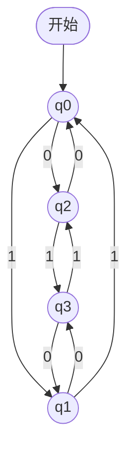
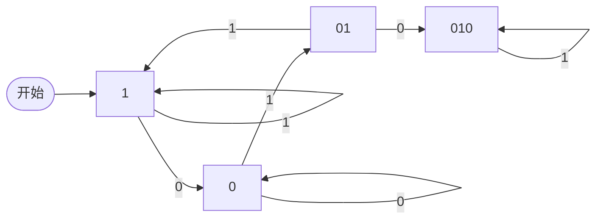
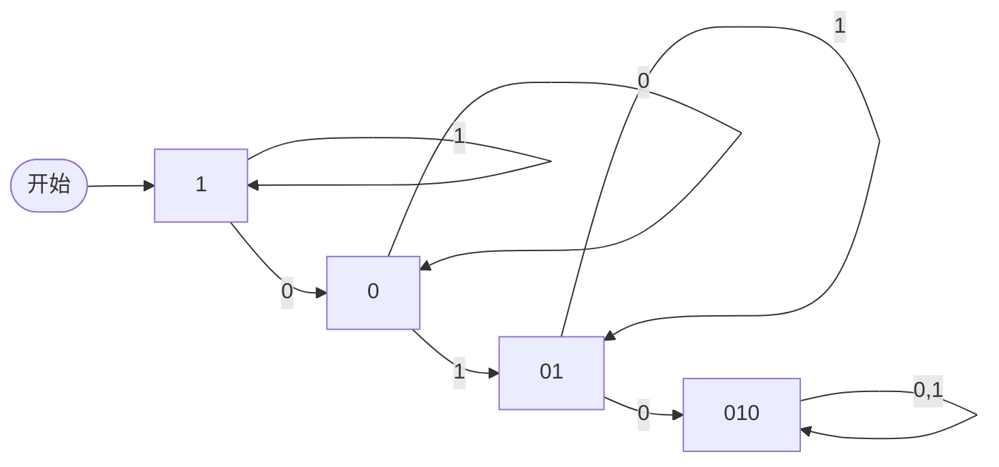
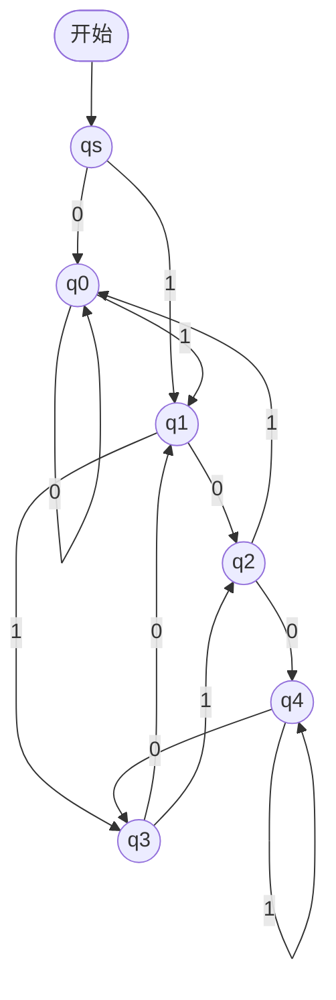

# 复习资料 02：有穷自动机

---

## 1. 有穷自动机的非形式化描述

### 1.1 核心思想：只有「有穷多个」状态

想象一台机器在运行，它**不会记住无穷多种情况**，只会处在**有限个档位**之一。每读入一个输入符号，就按规则**跳到另一个档位**（或留在原地）。

**生活例子 1：指针式钟表**

- 时针、分针、秒针各转一圈，组合起来一共只有 $12 \times 60 \times 60 = 43200$ 种「画面」。
- 这不是无穷种，所以可以用「当前是第几种画面」来概括——这就是**有穷多个状态**的思想。

**生活例子 2：电梯**

- 电梯停在 1 楼、2 楼、…、$n$ 楼，可以粗略看成**每层对应一个状态**。
- 你按了「上行」或「下行」、门开了关了，电梯就会**从一个状态转移到另一个状态**。

对比：一局围棋在理论上状态数约为 $3^{361}$，远远超出「有穷」的日常控制范围，所以**有穷自动机**只讨论**状态个数有限**的系统。

### 1.2 状态转移（直观）

一句话：

$$
\text{当前状态} + \text{读到的输入符号} \;\Rightarrow\; \text{下一状态}
$$

例如电梯在 3 楼，输入「上行」→ 可能到 4 楼。FA 里输入通常是字母表 $\Sigma$ 里的字符（如 `0`、`1`），不是按电梯键，但**逻辑一样**。

### 1.3 有穷状态系统的四要素

| 要素         | 含义（通俗）                 |
| ---------- | ---------------------- |
| **有穷多个状态** | 机器「处在哪一种情况」的编号，总共只有有限种 |
| **输入信号**   | 每次喂给机器的一个符号（来自字母表）     |
| **状态转移**   | 规则：在某状态下读某符号后去哪个状态     |
| **初始状态**   | 还没读任何输入时，机器从哪个状态开始     |

后面我们会加上第五样：**哪些状态算「成功结束」**（接受状态），那就是正式定义里的 FA。

---

## 2. 有穷自动机的形式化定义

> [!tip] **复习重点**
> 有穷自动机的定义（五元组）$M = (Q, \Sigma, \delta, q_0, F)$ 以及转移函数 $\delta$ 的含义，是期末考试重点，需要熟练掌握！

### 2.1 五元组

**定义（FA）** 一个有穷自动机（Finite Automaton，FA）是一个五元组：

$$
M = (Q, \Sigma, \delta, q_0, F)
$$

| 符号       | 名称    | 含义                                     |
| -------- | ----- | -------------------------------------- |
| $Q$      | 状态集   | 有穷集合，列出所有可能状态                          |
| $\Sigma$ | 输入字母表 | 有穷集合，允许的输入符号                           |
| $\delta$ | 转移函数  | $\delta: Q \times \Sigma \to Q$，单步转移规则 |
| $q_0$    | 初始状态  | $q_0 \in Q$，空输入前的起点                    |
| $F$      | 接受状态集 | $F \subseteq Q$，读完整串后停在这里算「接受」         |

**记忆口诀**：**Q** 有哪些状态，**Σ** 能读什么字，**δ** 怎么跳，**q₀** 从哪开始，**F** 哪些算过关。

### 2.2 转移函数与转移图

- **转移函数** $\delta(q, a)$：在状态 $q$ 下读入符号 $a$，**一步**之后到达的状态。
- **转移图**（状态图）：用圆圈画状态，用带标号的箭头画 $\delta$；**开始**指向 $q_0$，**双圈**（或课件中的特殊标记）表示接受状态。

> [!tip] **复习重点**
> 状态转移图与五元组**一一对应**：图上每条「$q \xrightarrow{a} p$」就表示 $\delta(q,a)=p$。考试常考「看图写五元组」或「画图表示给定 $\delta$」。

### 2.3 例 3.1：看懂转移图

课件中的机器：

$$
M = (\{q_0, q_1, q_2, q_3\}, \{0, 1\}, \delta, q_0, \{q_0\})
$$

转移函数（节选写法）：

$$
\begin{aligned}
\delta(q_0, 0) &= q_2, & \delta(q_0, 1) &= q_1, \\
\delta(q_1, 0) &= q_3, & \delta(q_1, 1) &= q_0, \\
\delta(q_2, 0) &= q_0, & \delta(q_2, 1) &= q_3, \\
\delta(q_3, 0) &= q_1, & \delta(q_3, 1) &= q_2.
\end{aligned}
$$

**转移图**（与上表完全等价）：



读图方法：从 $q_0$ 出发，沿箭头跟着 `0`/`1` 走。只有 $q_0$ 在 $F$ 里，所以**整串读完停在 $q_0$ 才接受**（下一节会严格定义）。

---

## 3. 扩充转移函数

单步的 $\delta$ 只能处理**一个**符号。要处理字符串 $x \in \Sigma^*$，需要**扩充转移函数** $\hat{\delta}$。

**定义 3.2** 对 FA $M = (Q, \Sigma, \delta, q_0, F)$，$\hat{\delta}: Q \times \Sigma^* \to Q$ 递归定义为：

1. $\hat{\delta}(q, \varepsilon) = q$（空串不改变状态）
2. $\hat{\delta}(q, aw) = \hat{\delta}(\delta(q, a), w)$，其中 $a \in \Sigma$，$w \in \Sigma^*$

含义：先按 $\delta$ 吃掉第一个字符 $a$，再对剩余串 $w$ 递归。

**约定**：课件中后文常把 $\hat{\delta}$ 仍记作 $\delta(q, x)$（当 $x$ 是字符串时），你要根据上下文区分「单字符」还是「整串」。

### 计算示例：$\hat{\delta}(q_0, 010)$（例 3.1）

从 $q_0$ 出发，串为 `010`：

$$
\begin{aligned}
\hat{\delta}(q_0, 010)
&= \hat{\delta}(\delta(q_0, 0), 10)
= \hat{\delta}(q_2, 10) \\
&= \hat{\delta}(\delta(q_2, 1), 0)
= \hat{\delta}(q_3, 0) \\
&= \hat{\delta}(\delta(q_3, 0), \varepsilon)
= \hat{\delta}(q_1, \varepsilon) = q_1.
\end{aligned}
$$

结论：读完 `010` 后停在 $q_1$，而 $q_1 \notin F$，故**该串不被例 3.1 的 FA 接受**。

---

## 4. 有穷自动机接受的语言

> [!tip] **复习重点**
> 接受语言的定义 $L(M) = \{ x \mid \delta(q_0, x) \in F \}$ 是必考内容。要能说清：从初始状态读完整串 $x$，若结束状态在 $F$ 中则接受 $x$，所有被接受的 $x$ 构成语言 $L(M)$。

### 4.1 定义

设 $M = (Q, \Sigma, \delta, q_0, F)$。若对 $x \in \Sigma^*$ 有（扩充后的）

$$
\delta(q_0, x) = p \in F,
$$

则称 **$x$ 被 $M$ 接受**。

$$
L(M) = \{ x \in \Sigma^* \mid \delta(q_0, x) \in F \}.
$$

两个方向（考试常考）：

- **给 FA → 说语言**：分析每个状态「记住了什么信息」，再看哪些串能停在 $F$。
- **给语言 → 造 FA**：设计状态表示「已读部分满足了什么性质」，再填 $\delta$。

### 4.2 例 3.1（续）：偶数个 0 且偶数个 1

状态含义（读串过程中维护的「奇偶」信息）：

| 状态 | 含义 |
|------|------|
| $q_0$ | 已读偶数个 `0`，偶数个 `1` |
| $q_1$ | 偶数个 `0`，奇数个 `1` |
| $q_2$ | 奇数个 `0`，偶数个 `1` |
| $q_3$ | 奇数个 `0`，奇数个 `1` |

接受状态只有 $q_0$，且空串 $\varepsilon$ 也满足（0 个 0、0 个 1）：

$$
L(M) = \{ x \in \{0,1\}^* \mid x \text{ 中 } 0 \text{ 的个数为偶数，且 } 1 \text{ 的个数为偶数} \}.
$$

### 4.3 例 3.2：子串 `010`

设

$$
L_1 = \{ x \in \{0,1\}^* \mid x \text{ 至少包含一次子串 } 010 \},
$$

$$
L_2 = \{ x \in \{0,1\}^* \mid x \text{ 不出现子串 } 010 \}.
$$

**$M_1$ 思路（含 `010`）**：从左扫描，用状态记住「已经匹配了 `010` 的前缀多长」：

- 普通状态 `1`：还没看到关键的 `0` 链，或刚在等；
- `0`：刚看到一个可能开头的 `0`；
- `01`：看到了 `01`，再读 `0` 就成功；
- `010`：已经出现 `010`，**接受**；之后读什么都留在接受状态。



**$M_2$ 思路（不含 `010`）**：状态名类似，但一旦出现完整 `010` 就进入**陷阱态** `010`（非接受），且无法回到「合法」读法；只要始终不进入陷阱，就在接受路径上。



### 4.4 例 3.3：二进制串表示的数能被 5 整除

语言：

$$
L = \{ x \in \{0,1\}^+ \mid \text{把 } x \text{ 当作二进制整数时，} x \bmod 5 = 0 \}.
$$

**构造思路（余数作状态）**：读到某前缀时，只需记住「当前数值模 5 的余数」，共 5 种：$0,1,2,3,4$，对应状态 $q_0,\ldots,q_4$。再读一位：

- 若当前余数为 $r$，前缀数值为 $n$，则读 `0` 后数值为 $2n$，读 `1` 后为 $2n+1$，只需算 $(2n \bmod 5)$ 与 $(2n+1 \bmod 5)$。

| 当前余数 $r$ | 读 `0` → $2r \bmod 5$ | 读 `1` → $(2r+1) \bmod 5$ |
|:------------:|:---------------------:|:-------------------------:|
| 0 | 0 → $q_0$ | 1 → $q_1$ |
| 1 | 2 → $q_2$ | 3 → $q_3$ |
| 2 | 4 → $q_4$ | 0 → $q_0$ |
| 3 | 1 → $q_1$ | 2 → $q_2$ |
| 4 | 3 → $q_3$ | 4 → $q_4$ |

课件用辅助起始态 $q_s$：第一位不能是空串，读 `0` 进 $q_0$，读 `1` 进 $q_1$。**接受状态为 $q_0$**（余数为 0）。



---

## 本章小结

| 概念 | 要点 |
|------|------|
| 五元组 | $M=(Q,\Sigma,\delta,q_0,F)$ |
| 转移图 | 与 $\delta$ 等价，便于构造与讲解 |
| $\hat{\delta}$ | 递归处理整串；$\delta(q_0,x)\in F$ 即接受 $x$ |
| $L(M)$ | 所有被接受字符串的集合 |

---

## 练习

**练习 1（来自：ch01）**

**题目**：考虑如下 FA 的转移图（字母表 $\{0,1\}$，初始状态为 $A$，接受状态为 $D$）：

- $A \xrightarrow{0} B$，$A \xrightarrow{1} A$
- $B \xrightarrow{0} C$，$B \xrightarrow{1} B$
- $C \xrightarrow{0} D$，$C \xrightarrow{1} B$
- $D \xrightarrow{0} D$，$D \xrightarrow{1} D$

（1）写出该 FA 的五元组 $M=(Q,\Sigma,\delta,q_0,F)$。  
（2）用通俗语言描述 $L(M)$（提示：注意从 $A$ 到 $D$ 需要经过怎样的 `0`/`1` 模式）。

> [!question]- 点击查看完整解答
> **解答**：
>
> **（1）符号化五元组**
>
> - $Q = \{A, B, C, D\}$
> - $\Sigma = \{0, 1\}$
> - $q_0 = A$
> - $F = \{D\}$
> - $\delta$ 由图给出：
>
> $$
> \begin{aligned}
> \delta(A,0)&=B,\ \delta(A,1)=A,\\
> \delta(B,0)&=C,\ \delta(B,1)=B,\\
> \delta(C,0)&=D,\ \delta(C,1)=B,\\
> \delta(D,0)&=D,\ \delta(D,1)=D.
> \end{aligned}
> $$
>
> 故 $M = (\{A,B,C,D\}, \{0,1\}, \delta, A, \{D\})$。
>
> **（2）语言描述与推理**
>
> 从 $A$ 出发，必须按顺序经历「$A \to B$（读一个 `0`）$\to C$（再读一个 `0`）$\to D$（再读一个 `0`）」才能**第一次**进入接受态 $D$，即前缀中至少要出现子串 `000`。
>
> 一旦进入 $D$，无论后续读 `0` 或 `1` 都留在 $D$，故**只要串中包含子串 `000`，整串就被接受**。
>
> 形式化：
>
> $$
> L(M) = \{ x \in \{0,1\}^* \mid x \text{ 中包含至少一次连续三个 } 0 \text{（子串 } 000\text{）} \}.
> $$
>
> **验证一例**：$x = 10001$。从 $A$ 读 `1` 回 $A$；读 `0` 到 $B$；读 `0` 到 $C$；读 `0` 到 $D \in F$，接受。$\square$

---

**练习 2（来自：ch01）**

**题目**：构造一个 FA $M$，使其接受的语言为

$$
L = \{ x \in \{0,1\}^* \mid x \text{ 中符号 } 1 \text{ 的出现次数为偶数} \}.
$$

要求：（1）写出五元组；（2）画出转移图；（3）用一两句话解释为什么正确。

> [!question]- 点击查看完整解答
> **解答**：
>
> **思路符号化**：只需记住「已读的 `1` 个数是奇数还是偶数」，用两个状态即可；`0` 不改变 `1` 的个数奇偶性。
>
> 设 $Q = \{q_{\mathrm{even}}, q_{\mathrm{odd}}\}$，其中 $q_{\mathrm{even}}$ 表示已读偶数个 `1`，$q_{\mathrm{odd}}$ 表示已读奇数个 `1`。空串算 0 个 `1`，从偶数开始。
>
> **（1）五元组**
>
> - $Q = \{q_{\mathrm{even}}, q_{\mathrm{odd}}\}$
> - $\Sigma = \{0, 1\}$
> - $q_0 = q_{\mathrm{even}}$
> - $F = \{q_{\mathrm{even}}\}$（偶数个 `1` 才接受）
> - 转移函数：
>
> $$
> \begin{aligned}
> \delta(q_{\mathrm{even}}, 0) &= q_{\mathrm{even}}, &
> \delta(q_{\mathrm{even}}, 1) &= q_{\mathrm{odd}}, \\
> \delta(q_{\mathrm{odd}}, 0) &= q_{\mathrm{odd}}, &
> \delta(q_{\mathrm{odd}}, 1) &= q_{\mathrm{even}}.
> \end{aligned}
> $$
>
> 即 $M = (Q, \Sigma, \delta, q_{\mathrm{even}}, \{q_{\mathrm{even}}\})$。
>
> **（2）转移图**
>
> ```mermaid
> graph LR
>   start([开始]) --> qe((q_even))
>   qe -->|0| qe
>   qe -->|1| qo((q_odd))
>   qo -->|0| qo
>   qo -->|1| qe
> ```
>
> （图中 $q_{\mathrm{even}}$ 为接受状态，可用双圈表示；此处用命名标明。）
>
> **（3）简要解释**
>
> 每读一个 `1`，在「偶数 / 奇数」两态之间切换；读 `0` 不改变 `1` 的计数奇偶。读完整个串后停在 $q_{\mathrm{even}}$ 当且仅当总共读了偶数个 `1`，故 $L(M)=L$。$\square$