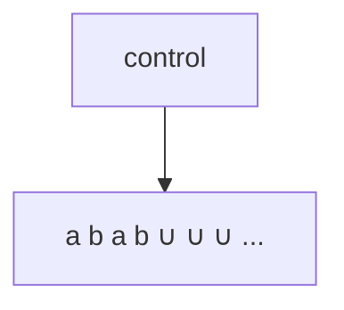
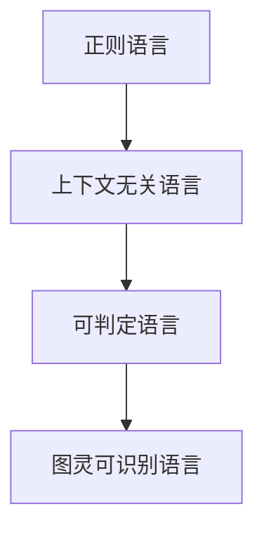
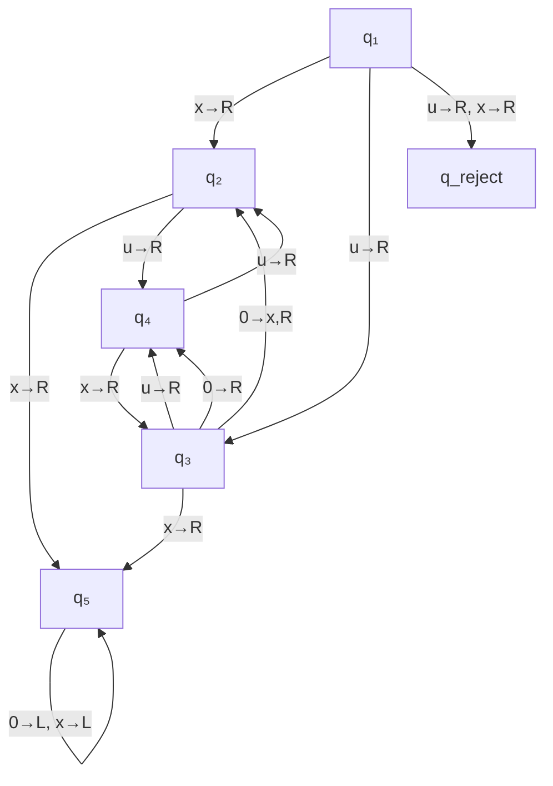
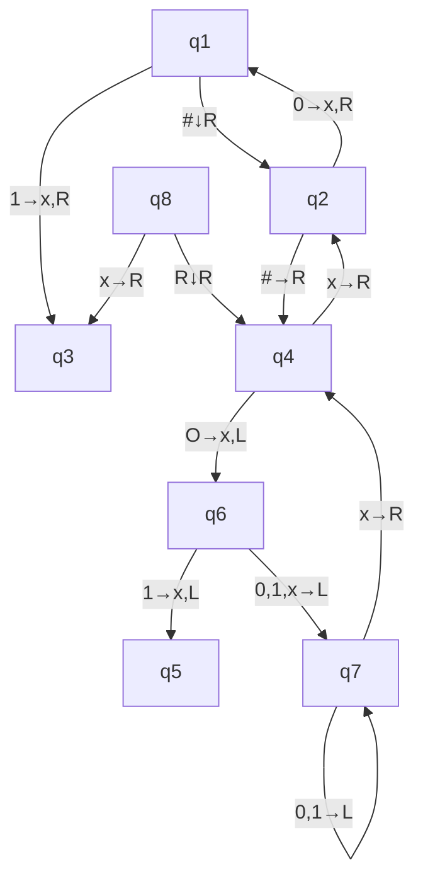
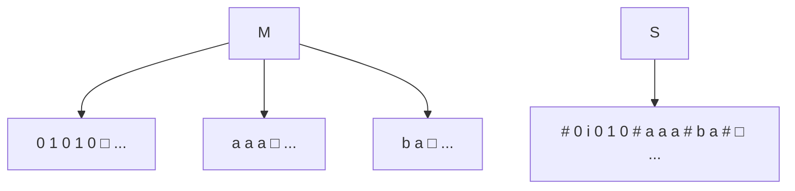
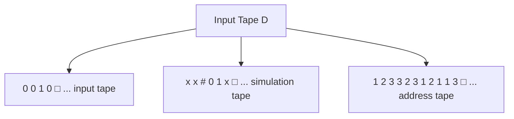
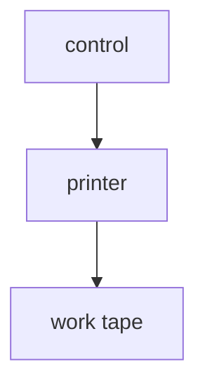

# 复习资料 03：丘奇-图灵论题

> 本资料对应课件 **ch02-ChurchTuring**，面向零基础同学，把图灵机、可识别/可判定、变形模型和丘奇-图灵论题讲清楚。

---

## 1. 图灵机概述

### 1.1 非形式化描述

**图灵机（Turing Machine, TM）** 由 Alan Turing 在 1936 年提出，可看作「带无限内存的通用计算机模型」。

可以把它想象成：

- 一条**无限长**的纸带，格子里写着符号（或空白）；
- 一个**读写头**，能读当前格、改写当前格，并向左或向右移动；
- 一台**有限状态控制器**，根据「当前状态 + 读到的符号」决定下一步：新状态、写什么、头往哪走。

开始时，纸带上只有**输入串**，其余是空白（记为 $\sqcup$）。机器不断计算，直到进入**接受**或**拒绝**状态并**停机**；若永远不停，就说它在该输入上**循环（loop）**。



**生活类比**：像一个人在无限长的方格本上，只能看当前格、改当前格、左右挪一格，按一本很薄的规则手册（有限状态）操作——但本子可以一直往两边延伸。

### 1.2 与有穷自动机（FA）的主要区别

课件强调四点（考试常考「至少 3 点」）：

| 对比项 | 有穷自动机（FA） | 图灵机（TM） |
|--------|------------------|--------------|
| 纸带读写 | 通常只**读**输入 | 既能**读**也能**写** |
| 读写头移动 | 一般只向右（只读一遍） | **左、右**均可 |
| 存储 | 输入有限，无无限纸带 | **无限长**纸带 |
| 停机 | 读完输入即结束 | 进入接受/拒绝才**明确停机**；也可能永不停止 |

> [!tip] **复习重点**
> **有穷自动机和图灵机的关系**：FA 可看作 TM 的**特例**——若把 TM 限制成「只读、只向右、纸带长度等于输入、且必停机」，就接近 FA 的能力。TM 比 FA **更强**：TM 能识别 FA 不能识别的语言（例如 $\{0^{2^n}\}$、$\{w\#w\}$ 等，见下文示例）。

---

## 2. 图灵机的形式化定义

> [!tip] **复习重点**
> 图灵机的定义、状态转移图要能默写七元组含义，并会画/读转移图。

**定义（图灵机）**：图灵机是一个 **七元组**
$$
M = (Q, \Sigma, \Gamma, \delta, q_0, q_{\mathsf{accept}}, q_{\mathsf{reject}})
$$
其中 $Q,\Sigma,\Gamma$ 均为有穷集合：

1. **$Q$**：状态集。
2. **$\Sigma$**：**输入字母表**，**不包含**空白符 $\sqcup$。
3. **$\Gamma$**：**纸带字母表**，满足 $\sqcup \in \Gamma$ 且 $\Sigma \subseteq \Gamma$（纸带上可出现比输入更多的符号）。
4. **$\delta$**：转移函数
   $$
   \delta : Q \times \Gamma \to Q \times \Gamma \times \{\mathsf{L}, \mathsf{R}\}
   $$
   含义：在状态 $q$、读到符号 $b$ 时，进入状态 $q'$，把当前格写成 $c$，读写头向左（L）或向右（R）移动一格。
5. **$q_0 \in Q$**：起始状态。
6. **$q_{\mathsf{accept}}$**：接受状态。
7. **$q_{\mathsf{reject}}$**：拒绝状态，且 $q_{\mathsf{accept}} \neq q_{\mathsf{reject}}$。

**停机时的写法**：接受、拒绝都是**停机格局**，不再产生新格局。常把转移函数限制在
$$
\delta : Q' \times \Gamma \to Q \times \Gamma \times \{\mathsf{L},\mathsf{R}\},\quad Q' = Q \setminus \{q_{\mathsf{accept}}, q_{\mathsf{reject}}\}.
$$

### 2.1 格局与计算

**格局（configuration）** 描述机器某一瞬间的「快照」，由三部分组成：

1. **当前状态** $q$；
2. **纸带内容**（可写成字符串，右侧未写部分视为 $\sqcup$）；
3. **读写头位置**（通常标在「头下方第一个符号」左侧）。

记法：**$u\,q\,v$** 表示：纸带内容为 $uv$（$v$ 之后全是 $\sqcup$），当前状态为 $q$，读写头在 $v$ 的**第一个符号**上。  
例：$1011\,q_7\,01111$ 表示头在第一个 $0$ 上。

**产生（yields）**：若一步转移合法，则 $C_1$ **产生** $C_2$。  
设 $uaq_i bv$，$\delta(q_i,b)=(q_j,c,\mathsf{L})$ 则产生 $uq_j acv$；若为 $\mathsf{R}$ 则产生 $uacq_j v$。左端点、右端点（右端无符号时视为 $\sqcup$）有课件中的特殊规则，做题时按「头移动后纸带如何变」理解即可。

对输入 $w$：

- **起始格局**：$q_0 w$（头在 $w$ 首字符）；
- **接受格局**：某格局中状态为 $q_{\mathsf{accept}}$；
- **拒绝格局**：状态为 $q_{\mathsf{reject}}$；
- **停机格局**：接受或拒绝格局（不再转移）。

$M$ **接受** $w$，若存在格局序列 $C_1 \to C_2 \to \cdots \to C_k$，$C_1$ 为起始格局，$C_k$ 为接受格局。  
$M$ 识别的语言：$L(M) = \{ w \mid M \text{ 接受 } w\}$。

---

## 3. 图灵可识别与图灵可判定

运行 TM 时，对某个输入只有三种可能：**接受**、**拒绝**、**循环**（不停机）。

- **不接受**有两种情况：进入拒绝状态，或**永远循环**（无法区分「很慢」还是「死循环」——这是后面「判定器」重要的原因）。

### 3.1 两个核心定义

> [!tip] **复习重点**
> **递归可枚举语言**与**递归语言**的定义与关系（ch03 会深入证明；本章先掌握定义与包含关系）。

**定义（图灵可识别 / 递归可枚举）**  
若存在图灵机 $M$ 使得 $L(M)=L$，则称 $L$ 是**图灵可识别的**（Turing-recognizable），亦称**递归可枚举语言**（recursively enumerable, **r.e.**）。

**定义（图灵可判定 / 递归）**  
若存在图灵机 $M$，对**每个**输入都**停机**，且 $L(M)=L$，则称 $M$ 为**判定器（decider）**，称 $L$ 是**图灵可判定的**（decidable），亦称**递归语言**（recursive）。

**关系（必背）**：

- 每个**可判定**语言都是**可识别**的（判定器当然也能「识别」：接受就说 yes，拒绝就说 no）；
- **反之不成立**：存在可识别但不可判定的语言（经典例子：停机问题相关语言，见 ch03）。

**语言层次（自内向外）**：

$$
\text{正则} \subset \text{上下文无关} \subset \text{可判定（递归）} \subset \text{图灵可识别（r.e.）}
$$

课件定理：每个上下文无关语言都是图灵可判定的。



---

## 4. 示例图灵机

### 4.1 $M_2$：判定 $A = \{0^{2^n} \mid n \ge 0\}$

**直观**：$0, 00, 0000, 00000000, \ldots$（$0$ 的个数是 $2$ 的幂）。

**算法（隔一删一）**：

1. 从左到右扫描，**每隔一个 0 删掉一个**（删掉的格可标为 $x$）；
2. 若删完后**只剩一个** $0$，**接受**；
3. 若剩多个 $0$ 且个数为**奇数**，**拒绝**；
4. 头回到最左，重复步骤 1。

**形式化**：$M_2=(Q,\Sigma,\Gamma,\delta,q_1,q_{\mathsf{accept}},q_{\mathsf{reject}})$，$Q=\{q_1,\ldots,q_5,q_{\mathsf{accept}},q_{\mathsf{reject}}\}$，$\Sigma=\{0\}$，$\Gamma=\{0,x,\sqcup\}$。

输入 `0000` 时部分格局（课件）：

| 步骤片段 | 格局示例 |
|----------|----------|
| 开始 | $q_1\,0000$ |
| 隔位删 | $\sqcup q_2\,000 \to \cdots \to \sqcup q_5\,xxx\sqcup$ |
| 继续轮 | 最终进入 $q_{\mathsf{accept}}$ |



### 4.2 $M_1$：判定 $B = \{w\#w \mid w \in \{0,1\}^*\}$

**直观**：形如 `011#011` 的串，$\#$ 左右完全相同。

**算法**：

1. 在 $\#$ **两侧对应位置**来回比对符号；
2. 不一致或没有 $\#$ → 拒绝；
3. 比对过的符号抹成 $x$；
4. $\#$ 左边全抹完后，若右边也全抹完 → 接受，否则拒绝。

输入 `011000#011000` 纸带快照（课件）：

```
0 1 1 0 0 0 # 0 1 1 0 0 0 ∪ ...
x 1 1 0 0 0 # 0 1 1 0 0 0 ∪ ...
...
x x x x x x # x x x x x x ∪ ...
accept
```



---

## 5. 图灵机的变形

### 5.1 多带图灵机

**定义**：有 $k$ 条纸带，每条有自己的读写头；开始时输入在第 1 条带，其余为空。

转移函数形如：
$$
\delta : Q \times \Gamma^k \to Q \times \Gamma^k \times \{\mathsf{L},\mathsf{R},\mathsf{S}\}^k
$$
（$\mathsf{S}$ 表示该带头不动。）

> [!tip] **复习重点**
> **多带图灵机与单带图灵机的等价性**：每个 $k$ 带 TM 都等价于某个单带 TM。**证明思路**——单带机 $S$ 模拟多带机 $M$：
>
> 1. 把 $k$ 条带的内容**压到一条带**上，用 `#` 分隔各带，并用特殊符号标记各带的**虚拟读写头**位置（课件格式如 `# \dot w_1 w_2 \cdots # \dot\sqcup # \cdots #`）。
> 2. **两步扫描法**模拟 $M$ 的一步：先扫一遍收集 $k$ 个头下的符号；再扫一遍按 $\delta$ 更新各带格子和头位置。
> 3. 若某带头右移到 `#` 上，表示进入新空白区：在该带写入 $\sqcup$，并把该带 `#` 以右内容右移一格，再继续模拟。



**推论**：$L$ 图灵可识别 $\Leftrightarrow$ 存在多带 TM 识别 $L$。

### 5.2 非确定型图灵机（NTM）

**定义**：一步转移是**集合**（多种选择）：
$$
\delta : Q \times \Gamma \to \mathcal{P}(Q \times \Gamma \times \{\mathsf{L},\mathsf{R}\})
$$

> [!tip] **复习重点**
> **非确定型与确定型的等价性（识别语言）**：每个 NTM 等价于某个 DTM。**证明思路**——确定型 $D$ 用 **BFS** 思想枚举 NTM $N$ 的所有非确定分支：
>
> - **纸带 1**：原输入 $w$；
> - **纸带 2**：模拟 $N$ 的计算；
> - **纸带 3**：**地址带**，编码当前要尝试的分支选择序列（如 $1,2,3,\ldots$ 的某种编码）。
>
> 流程概要：复制输入到模拟带 → 按地址带指示在每一步选一个合法转移 → 若接受则接受；若拒绝或地址用尽则换下一个地址串，模拟下一分支。



**推论**：

- $L$ 图灵可识别 $\Leftrightarrow$ 存在 NTM 识别 $L$；
- 若 $N$ 在所有分支上都停机，则构造的 $D$ 也总停机 $\Rightarrow$ $L$ 可判定 $\Leftrightarrow$ 存在 NTM **判定** $L$。

### 5.3 枚举器（Enumerator）

**定义**：一种 $k$ 带图灵机，最后一条带是**输出带**，按某种顺序**打印**串（输出字母表不含 `#`）。

语言：
$$
L(M) = \{ w \in \Sigma^* \mid w \text{ 曾被 } M \text{ 打印在输出带上} \}.
$$



**定理**：$L$ 图灵可识别 **当且仅当** 存在枚举器枚举 $L$。

**证明直觉**：

- 枚举器 → 识别机：对输入 $w$，边枚举边比较，见到 $w$ 就接受；
- 识别机 $M$ → 枚举器：对 $i=1,2,3,\ldots$，对每个 $s_j$（$j\le i$）让 $M$ 在 $s_j$ 上跑 $i$ 步，若接受则打印 $s_j$（对角线式枚举，保证 r.e. 语言被逐步列出）。

---

## 6. 丘奇-图灵论题

> [!tip] **复习重点**
> **丘奇-图灵论题的内涵**：所有「合理的」计算模型（λ-演算、部分递归函数、各类图灵机变体、现实计算机+无限内存的理想化等）在**可计算函数**意义下**等价**；**直观上的算法** = **图灵机算法**（这不是数学定理，而是广泛接受的**论题/假说**）。

**背景**：希尔伯特第 10 问题等推动人们追问「什么叫算法」。Church 与 Turing 各自提出模型，后来发现彼此等价。

**重要意义**：

1. 为「可计算」提供**标准定义**：研究可计算性时，用 TM 即可，不必绑定某一种硬件；
2. 证明「某问题无算法」时，常证明**不存在 TM** 判定/识别它；
3. 后续 **通用图灵机、停机问题、复杂性类 P/NP** 都建立在这一论题之上。

---

## 7. 描述图灵机的三种层次

写算法/设计 TM 时，课件给出三种详细程度：

| 层次 | 内容 | 适用 |
|------|------|------|
| **形式化描述** | 写出 $Q,\Sigma,\Gamma,\delta$ 或完整转移图 | 证明、考试画图 |
| **实现描述** | 日常语言说清头怎么动、带怎么改，不写每个状态 | 中等细节 |
| **高层次描述** | 只写算法思想，不管纸带编码细节 | 讲思路 |

**示例（高层次）**：判定连通图语言 $A=\{\langle G\rangle \mid G \text{ 无向连通}\}$：

1. 任选顶点标记；
2. 反复：若某顶点通过边连到已标记顶点，则标记它；
3. 扫描所有顶点，全标记则接受，否则拒绝。

---

## 8. 本章小结

- **TM** = 七元组 + 格局 + 接受/拒绝/循环；
- **可判定** $\subset$ **可识别**；语言层次：正则 ⊂ CFL ⊂ 递归 ⊂ r.e.；
- **多带、非确定、枚举器** 与标准 TM 在识别能力上等价（判定情形需 NTM 全分支停机）；
- **丘奇-图灵论题**：合理计算模型等价，算法直觉 = TM；
- **FA ⊂ TM**：TM 更强，能处理需要无限存储与回写的语言。

---

## 9. 往年考题精讲：NTM & 多带 TM 定义与等价证明

基于 23242 和 24252 两份试卷，**多带 TM 定义+等价证明** 和 **NTM 定义+等价证明** 每年至少考一道大题。以下是考试标准答案模板。

### 9.1 多带图灵机的形式化定义（默写模板）

> **定义**（多带图灵机）：一个 $k$-带图灵机是一个七元组 $M = (Q, \Sigma, \Gamma, \delta, q_0, q_{\mathsf{accept}}, q_{\mathsf{reject}})$，其中 $Q, \Sigma, \Gamma$ 均为有穷集合，且：
>
> 1. $Q$ 是状态集。
> 2. $\Sigma$ 是输入字母表（不含空白符 $\sqcup$）。
> 3. $\Gamma$ 是纸带字母表，$\sqcup \in \Gamma$，$\Sigma \subseteq \Gamma$。
> 4. $\delta : Q \times \Gamma^k \to Q \times \Gamma^k \times \{\mathsf{L}, \mathsf{R}, \mathsf{S}\}^k$ 是转移函数，$\mathsf{S}$ 表示该带头不动。
> 5. $q_0 \in Q$ 是起始状态。
> 6. $q_{\mathsf{accept}} \in Q$ 是接受状态。
> 7. $q_{\mathsf{reject}} \in Q$ 是拒绝状态，且 $q_{\mathsf{accept}} \neq q_{\mathsf{reject}}$。
>
> 开始工作时，输入出现在第 1 条纸带上，其余纸带为空白。

> [!tip] **记忆方法**
> 与单带 TM 的区别只有一处：$\delta$ 的定义从 $Q \times \Gamma \to Q \times \Gamma \times \{\mathsf{L},\mathsf{R}\}$ 扩展为 $Q \times \Gamma^k \to Q \times \Gamma^k \times \{\mathsf{L},\mathsf{R},\mathsf{S}\}^k$。记住 $k$ 条带、$\mathsf{S}$（不动）。

### 9.2 多带 TM 与单带 TM 等价性证明（考试默写模板）

> **定理**：每个多带图灵机都等价于某一个单带图灵机。
>
> **证明思路（构造模拟）**：
>
> 设 $M$ 是一个 $k$ 带图灵机。构造单带图灵机 $S$ 如下：
>
> **编码**：$S$ 用一条纸带来表示 $M$ 的 $k$ 条纸带的内容，格式为：
>
> $$
> \# \dot w_1 w_2 \cdots w_n \# \dot \sqcup \# \dot \sqcup \# \cdots \#
> $$
>
> 其中 `#` 是分隔符，$\dot w_1$ 中的点标记该虚拟读写头的当前位置。
>
> **模拟一步**：
>
> ① **第一次扫描**（从左到右）：经过所有 `#` 区间，读出 $k$ 个虚拟读写头下的符号 $(a_1, a_2, \dots, a_k)$。
>
> ② **第二次扫描**（从左到右）：根据 $M$ 的转移函数 $\delta(q_i, a_1, \dots, a_k) = (q_j, b_1, \dots, b_k, D_1, \dots, D_k)$：
>    - 将各虚拟带对应位置改写为 $b_1, \dots, b_k$
>    - 将各虚拟读写头标记按 $D_1, \dots, D_k$ 移动（$\mathsf{L}$ 左移、$\mathsf{R}$ 右移、$\mathsf{S}$ 不动）
>
> **处理右越界**：若某虚拟读写头右移到 `#` 上（进入新空白区），$S$ 在该处写入 $\sqcup$，并将该段之后的内容右移一格，再继续模拟。
>
> **结论**：$M$ 接受 $w$ 当且仅当 $S$ 接受 $w$，故两者等价。

### 9.3 非确定型图灵机的形式化定义（默写模板）

> **定义**（非确定型图灵机，NTM）：一个非确定型图灵机是一个七元组 $N = (Q, \Sigma, \Gamma, \delta, q_0, q_{\mathsf{accept}}, q_{\mathsf{reject}})$，其中 $Q, \Sigma, \Gamma$ 均有穷，且：
>
> 1. $Q$ 是状态集。
> 2. $\Sigma$ 是输入字母表（不含 $\sqcup$）。
> 3. $\Gamma$ 是纸带字母表，$\sqcup \in \Gamma$，$\Sigma \subseteq \Gamma$。
> 4. $\delta : Q \times \Gamma \to \mathcal{P}(Q \times \Gamma \times \{\mathsf{L}, \mathsf{R}\})$ 是转移函数（注意输出是**幂集**——可能有多种选择）。
> 5. $q_0 \in Q$ 是起始状态。
> 6. $q_{\mathsf{accept}} \in Q$ 是接受状态。
> 7. $q_{\mathsf{reject}} \in Q$ 是拒绝状态，且 $q_{\mathsf{accept}} \neq q_{\mathsf{reject}}$。
>
> **关键区别**：确定型 TM 的 $\delta$ 输出是**单个**三元组；NTM 的 $\delta$ 输出是**集合**（可能多个选择，也可能空集——无转移时自动拒绝）。

> [!tip] **记忆方法**
> 和单带 DTM 唯一区别：$\delta$ 的箭头右边从 $Q \times \Gamma \times \{\mathsf{L},\mathsf{R}\}$ 变成 $\mathcal{P}(Q \times \Gamma \times \{\mathsf{L},\mathsf{R}\})$。$\mathcal{P}$ 表示「所有子集」，即「可能的多种选择」。

### 9.4 NTM 与 DTM 等价性证明（考试默写模板）

> **定理**：每个非确定型图灵机都等价于某一个确定型图灵机。
>
> **证明思路（构造模拟 — BFS 搜索所有分支）**：
>
> 设 $N$ 是一个 NTM。构造确定型 3 带图灵机 $D$ 如下：
>
> **纸带分配**：
> - **纸带 1**：存储原始输入 $w$（只读）。
> - **纸带 2**：模拟 $N$ 的计算过程（复制纸带 1 的内容作为初始内容）。
> - **纸带 3**：地址带，记录当前要模拟的「分支编号序列」。
>
> **工作流程**：
>
> ① 将纸带 1 的内容复制到纸带 2，初始化纸带 3 为空白。
>
> ② 用纸带 2 模拟 $N$ 在输入 $w$ 上的某个计算分支。在 $N$ 每步需要做非确定选择时，查询纸带 3 上的下一个数字来决定选哪个转移。
>
> ③ 若该分支进入接受状态 → $D$ 接受，停机。
>
> ④ 若该分支进入拒绝状态，或纸带 3 上的数字用完（无法继续选择），则**放弃当前分支**：
>    - 将纸带 3 上的地址串替换为**字典序的下一个**串（相当于切换到 BFS 的下一分支）
>    - 将纸带 2 恢复为纸带 1 的副本（回到初始状态）
>    - 转到步骤 ②
>
> **正确性**：$D$ 按**广度优先**（BFS）顺序枚举 $N$ 的所有计算分支。$N$ 接受 $w$ 当且仅当存在某个分支在有限步内进入接受状态，$D$ 的 BFS 一定会在有限时间内找到它。因此 $D$ 接受 $w$ 当且仅当 $N$ 接受 $w$。
>
> **推论**：一个语言是图灵可识别的，当且仅当存在 NTM 识别它。

### 9.5 常考填空（闭眼也要会）

> **填空 4**：丘奇-图灵论题的内涵是 **（所有合理的计算模型都是等价的）**。
>
> **解析**：这段话是说，λ-演算、图灵机、部分递归函数、乃至现实计算机（无限内存的理想化），它们的**计算能力一样**——能算的问题集合完全相同。该论题（不是定理）为「可计算」提供了标准定义：直观上的算法 = 图灵机算法。

> **填空 5**：递归语言和递归可枚举语言的关系是 **（递归语言 ⊆ 递归可枚举语言）**。
>
> **解析**：每个递归语言（可由总停机 TM 判定）当然是递归可枚举的（可由某 TM 识别），但反过来不成立——存在递归可枚举但非递归的语言（如 $L_u$ 通用语言）。简单说就是**可判定 ⊂ 可识别**。

### 9.6 大题对比速记表

| 比较 | 多带 TM | NTM |
|------|---------|-----|
| 定义区别 | $\delta: Q \times \Gamma^k \to Q \times \Gamma^k \times \{\mathsf{L,R,S}\}^k$ | $\delta: Q \times \Gamma \to \mathcal{P}(Q \times \Gamma \times \{\mathsf{L,R}\})$ |
| 等价对象 | 单带 TM | 确定型 TM |
| 证明方法 | 用 `#` 分隔合并在一条带上，两步扫描模拟 | 3 带 DTM 做 BFS 搜索所有非确定分支 |
| 结论 | $L$ 可识别 $\iff$ 存在多带 TM 识别 $L$ | $L$ 可识别 $\iff$ 存在 NTM 识别 $L$ |
| 计算复杂度差异 | $t(n) \to O(t^2(n))$（平方） | $t(n) \to 2^{O(t(n))}$（指数） |


---

## 练习

**练习 1（来自：ch02）**

**题目**：简述有穷自动机和图灵机的主要区别（至少 3 点）。

> [!question]- 点击查看完整解答
> **解答**：
>
> 设 FA 为只读输入、状态有限的自动机；TM 为七元组 $(Q,\Sigma,\Gamma,\delta,q_0,q_{\mathsf{accept}},q_{\mathsf{reject}})$。
>
> 1. **读写能力**：FA 通常只对输入串**只读**；TM 可在纸带上**读和写**，用额外符号（如 $x$）记录中间结果。
> 2. **读写头移动**：FA 读头一般**只向右**移动；TM 读写头可**向左、向右**移动，可回到已读区域。
> 3. **存储**：FA 没有无限纸带，「记忆」仅靠有限状态；TM 有**无限长**纸带，可当作无限存储。
> 4. **停机语义**（可作第 4 点）：FA 读完输入即结束；TM 进入 $q_{\mathsf{accept}}$ 或 $q_{\mathsf{reject}}$ 才停机，还可能**永不停机**（循环），因此区分**识别**与**判定**。

**练习 2（来自：ch02）**

**题目**：多带图灵机与单带图灵机的等价性证明思路是什么？为什么要证明这个？

> [!question]- 点击查看完整解答
> **解答**：
>
> **证明思路（构造模拟）**：
>
> - **目标**：给定 $k$ 带 TM $M$，构造单带 TM $S$，使得对任意输入 $w$，$S$ 接受 $w$ 当且仅当 $M$ 接受 $w$。
> - **编码**：在 $S$ 的一条纸带上用 `#` 分隔 $k$ 条虚拟纸带的内容，并用标记（如 $\dot{}$）标出每条带上读写头位置，例如
>   $$
>   \#\dot w_1 w_2 \cdots w_n \# \dot\sqcup \# \cdots \#
>   $$
> - **模拟一步**：$S$ 用**两次扫描**完成 $M$ 的一步转移——第一次从左到右经过所有 `#` 区间，读出 $k$ 个头下的符号 $(a_1,\ldots,a_k)$；第二次再扫一遍，根据 $\delta(q_i,a_1,\ldots,a_k)$ 写入新符号并更新头标记（若头越过 `#` 进入新空白，则扩展该虚拟带：写 $\sqcup$ 并右移该段内容）。
> - **结论**：$M$ 有限步接受/拒绝 $\Leftrightarrow$ $S$ 有限步进入接受/拒绝（每步 $M$ 对应 $S$ 的常数倍扫描，但步数仍是有限的）。
>
> **为什么要证明**：
>
> 1. **简化理论**：证明「可识别性」等性质时，可假设「只有单带 TM」，不必分别对多带、多头等模型各证一遍。
> 2. **丘奇-图灵论题的支撑**：说明增加多条纸带**不增加**可计算语言类，只是可能**加速**（时间复杂性不同，见 ch04）。
> 3. **与实现无关**：说明计算能力由「可写、可回头、无限带」等本质决定，而非「几条物理纸带」。