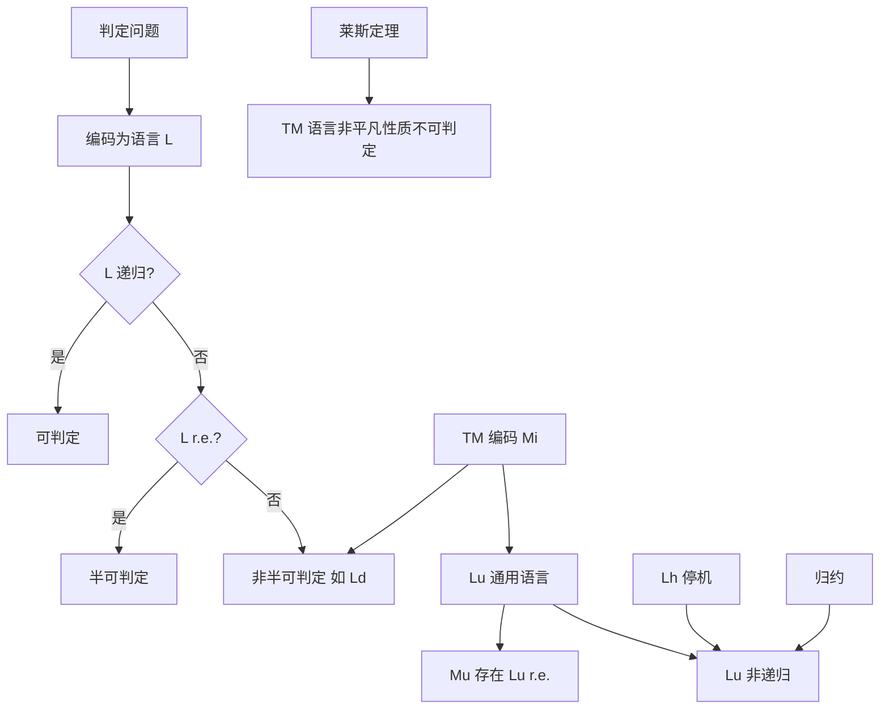

# 复习资料 04：可判定性

> 对应课件：第 3 章（ch03-Decidability）  
> 本章是期末考试**重中之重**：复习纲要中与可判定性相关的内容几乎都集中在这里，请逐节吃透。

---

## 本章在学什么？

前两章我们学了「什么机器能算什么语言」。本章问的是更尖锐的问题：

- **给定一个问题，能不能写程序，在有限步内永远给出「是/否」答案？**
- 若不能，是「半能」（对的实例能认出来，错的可能永远算不完）还是「连半能都不行」？

答案会引出：**停机问题、通用图灵机、归约、莱斯定理**——这些都是卷面高频点。

---

## 1. 判定问题与问题的分类

> [!tip] **复习重点**
> 期末考试重点：问题分类树、编码、问题—语言—计算模型三者关系，需要熟练掌握！

### 1.1 什么是判定问题？

- **问题的实例**：一道具体的题（例如「这个 DFA 是否接受串 `101`？」）。
- **问题**：所有这类实例的抽象集合。

**判定问题**：每个实例的答案只能是 **「是」** 或 **「否」**。

例子：

- 「语言 $L$ 是递归的吗？」（是/否）
- 「图 $G$ 是哈密尔顿图吗？」（是/否）

非判定问题（本章不重点考）：例如「求一个图的最短哈密尔顿回路长度」——答案不是单纯的 yes/no。

### 1.2 编码与「问题对应的语言」

计算机和图灵机只处理**字符串**。因此：

1. 用字母表 $\Sigma$ 上的串，把每个实例 $I$ **编码**成串；
2. 把所有**答案为「是」**的实例编码收集起来，得到集合 $L$；
3. 这个 $L$ 就叫问题 $\Pi$ 的**对应语言**。

于是：

| 说法 | 含义 |
|------|------|
| 问题可判定 | 对应语言 $L$ 是**递归语言**（存在**总停机**的图灵机判定 $L$） |
| 问题不可判定 | $L$ **不是**递归语言 |
| 半可判定 | $L$ 不可判定，但 $L$ 是**递归可枚举**（存在 TM 接受 $L$，错的可能不停机） |

**生活化理解**：  
「判定问题」像判断题；「编码」像把每道题编成准考证号；「语言」就是所有「应判对」的准考证号集合。图灵机/程序是在这个集合上工作的。

### 1.3 问题的分类树

```
问题
├── 非判定问题
└── 判定问题
    ├── 可判定问题          → 对应语言是递归的
    └── 不可判定问题
        ├── 半可判定问题    → 对应语言是 r.e. 但不是递归的
        └── 非半可判定问题  → 对应语言连 r.e. 都不是
```

### 1.4 问题、语言、计算模型三者关系

> [!tip] **复习重点**
> 三者关系要能说清楚：问题 ↔ 语言（编码）；语言 ↔ 模型（TM 接受/判定）。

- **问题 $\Pi$**：人类表述的「是否」型任务。
- **语言 $L$**：$\Pi$ 的所有「是」实例的编码串之集。
- **计算模型**（本章以图灵机为主）：  
  - $L$ **递归** $\Leftrightarrow$ 存在 TM **总停机**且 $L(M)=L$（**判定**）；  
  - $L$ **递归可枚举 (r.e.)** $\Leftrightarrow$ 存在 TM **接受** $L$（$w\in L$ 时必接受，$w\notin L$ 可能永不停机）。

**关系链**：  
$\text{可判定问题} \Leftrightarrow \text{递归语言} \Leftrightarrow \text{可被总停机 TM 判定}$。

---

## 2. 递归语言的性质

这两定理是后面证明 $L_u$、$L_h$ 不可判定的工具，卷面常作为引理或选项。

### 定理 1：递归语言对补封闭

若 $L$ 是**递归**的，则 $\overline{L}$ 也是递归的。

**思路**：$L$ 有总停机 TM $M$。造 $\overline{M}$：与 $M$ 相反地接受/拒绝（接受变拒绝、无转移的拒绝变接受），仍总停机，且 $L(\overline{M})=\overline{L}$。

### 定理 2：$L$ 与 $\overline{L}$ 都是 r.e. $\Rightarrow$ $L$ 递归

若 $L=L(M_1)$、$\overline{L}=L(M_2)$（两台接受机），造 2 带 TM $M$ **并行**模拟 $M_1$ 与 $M_2$：

- $w\in L$ $\Rightarrow$ $M_1$ 终将接受 $\Rightarrow$ $M$ 接受；
- $w\notin L$ $\Rightarrow$ $w\in\overline{L}$ $\Rightarrow$ $M_2$ 终将接受 $\Rightarrow$ $M$ 拒绝。

两边必有一边先接受，故 $M$ **总停机**，$L$ 递归。

**记忆**：单边 r.e. 只保证「成员能认」；**成员和非成员都能认（$L$ 与 $\overline{L}$ 都 r.e.）** 才升级成「总停机判定」。

---

## 3. 图灵机的编码

> [!tip] **复习重点**
> 受限制 TM、转移规则编码 $0^i10^j10^k10^l10^m$、整机编码、序列 $M_1,M_2,\ldots$ 必考！

### 3.1 受限制的图灵机

为统一编码，考虑**受限制**的 TM $M=(Q,\Sigma,\Gamma,\delta,q_1,q_2)$：

1. $Q=\{q_1,q_2,\ldots,q_n\}$，**起始** $q_1$，**唯一接受** $q_2$；
2. $\Sigma=\{0,1\}$，$\Gamma=\{0,1,\sqcup\}$；
3. 省略显式拒绝状态（无转移即停机拒绝）。

任意一般 TM 可通过对符号等做 0/1 编码，与受限制 TM **等价**。

### 3.2 转移规则的二进制编码

给状态、带符号、方向 $L/R$ 编号后，一条规则

$$
\delta(q_i,X_j)=(q_k,X_l,D_m)
$$

编码为：

$$
0^i\,1\,0^j\,1\,0^k\,1\,0^l\,1\,0^m
$$

（$i,j,k,l,m\ge 1$，故单条规则编码里**不会出现连续两个 1**。）

### 3.3 整机编码

所有转移编码 $C_1,C_2,\ldots,C_n$ 按某种顺序用 **`11`** 分隔拼接：

$$
C_1\,11\,C_2\,11\,\cdots\,11\,C_n
$$

**课件例子**（3 状态、4 条转移）完整编码串见 ch03 表格；同一台 $M$ 转移顺序不同可有 $4!=24$ 种合法编码。

### 3.4 图灵机序列 $M_1,M_2,\ldots$

按字典序（或固定顺序）列出 $\{0,1\}^*$ 中所有串 $w_1,w_2,\ldots$：

- 若 $w_i$ 是合法 TM 编码，则 $w_i$ 表示 $M_i$；
- 若 $w_i$ **不是**合法编码，仍记为 $M_i$，并约定 $L(M_i)=\varnothing$。

这样**每个**二进制串都「对应」一台 TM，便于对角线论证。

---

## 4. 与正则语言相关的可判定性

> [!tip] **复习重点**
> $A_{\mathrm{DFA}}$、$A_{\mathrm{NFA}}$、$E_{\mathrm{DFA}}$、$EQ_{\mathrm{DFA}}$ 的定义与判定思路要会叙述。

| 语言 | 含义 | 为何可判定（一句话） |
|------|------|----------------------|
| $A_{\mathrm{DFA}}=\{\langle B,w\rangle\mid B\text{ 为 DFA 且 }B\text{ 接受 }w\}$ | DFA 是否接受串 | TM 模拟 DFA 跑 $w$，有限步结束 |
| $A_{\mathrm{NFA}}=\{\langle B,w\rangle\mid B\text{ 为 NFA 且接受 }w\}$ | NFA 是否接受串 | NFA$\to$DFA，再判 $A_{\mathrm{DFA}}$ |
| $E_{\mathrm{DFA}}=\{\langle A\rangle\mid L(A)=\varnothing\}$ | DFA 语言是否为空 | **标记算法**：从初态沿边标记可达状态，看是否标记到接受态 |
| $EQ_{\mathrm{DFA}}=\{\langle A,B\rangle\mid L(A)=L(B)\}$ | 两 DFA 是否等价 | 造 DFA $C$ 接受对称差 $(L(A)\cap\overline{L(B)})\cup(\overline{L(A)}\cap L(B))$，判 $L(C)$ 是否空（用 $E_{\mathrm{DFA}}$） |

输入常编码为 $\langle B,w\rangle = B\,111\,w$；判定机先检查编码格式是否合法。

---

## 5. 与上下文无关语言相关的可判定性（简要）

> [!tip] **复习重点**
> 知道结论即可：CFL 侧也有不少可判定问题。

- $A_{\mathrm{CFG}}$：给定 CFG 与串 $w$，是否 $w\in L(G)$ —— **可判定**（例如 CYK 等算法）。
- $E_{\mathrm{CFG}}$：$L(G)=\varnothing$ 吗 —— **可判定**。
- **定理**：每个上下文无关语言都是**可判定的**（存在 TM 总停机判定该语言）。

注意：这是「**语言本身**作为集合可判定」，与后面「**给定一台 TM**，问它接受的语言是否为空」等**关于 TM 语义**的问题不同——后者往往不可判定（莱斯定理）。

---

## 6. 不可判定语言 — 对角化方法

> [!tip] **复习重点**
> 可数/不可数、康托对角线、结论「必存在 TM 不能识别的语言」要会讲。

### 6.1 可数与不可数

- **可数**：有限，或与 $\mathbb{N}$ 一一对应（如 $\mathbb{Q}^+$、$\{0,1\}^*$）。
- **不可数**：不能这样排成序列（如实数 $\mathbb{R}$）。

**推论**：递归可枚举语言只有**可数多个**；而 $\{0,1\}^*$ 上所有语言的集合是**不可数**的 —— 「可能语言」比 「r.e. 语言」多得多，**一定存在**不能被任何 TM 识别的语言。

### 6.2 康托对角线法（实数不可数）— 类比用

假设 $(0,1)$ 内实数可排成 $S_1,S_2,S_3,\ldots$，小数展开：

$$
\begin{aligned}
S_1 &= 0.\underline{a_{11}}a_{12}a_{13}\cdots \\
S_2 &= 0.a_{21}\underline{a_{22}}a_{23}\cdots \\
S_3 &= 0.a_{31}a_{32}\underline{a_{33}}\cdots \\
&\vdots
\end{aligned}
$$

造 $r=0.b_1b_2b_3\cdots$：令 $b_j$ 与 $a_{jj}$ **不同**（课件：$a_{jj}\neq 1$ 则 $b_j=1$，否则 $b_j=2$）。则 $r$ 与每个 $S_j$ 在第 $j$ 位不同，故 $r\notin\{S_i\}$，矛盾。

**类比到 TM**：把「所有 TM」排成 $M_1,M_2,\ldots$，用「第 $i$ 台机器在输入 $w_i$ 上是否接受」造一条**故意反着来**的语言 $L_d$，使它不属于任何一台 $M_i$ 的语言。

### 6.3 结论

$\{0,1\}^*$ 上语言不可数 + r.e. 语言可数 $\Rightarrow$ **必存在非 r.e. 语言**（更存在非递归语言）。

---

## 7. 0 号问题 — $L_d$

> [!tip] **复习重点**
> $L_d$ 的定义、非 r.e. 证明（反证 + 对角线）必须会写！

### 定义

按编码顺序 $w_1,w_2,\ldots$ 与 $M_1,M_2,\ldots$：

$$
L_d = \{w_i \mid w_i \in \{0,1\}^*,\ w_i \notin L(M_i)\}
$$

**直观**：$L_d$ 收集所有「**作为编码的那串 $w_i$，不被第 $i$ 号图灵机接受**」的串。  
问的是：**第 $i$ 台机器是否拒绝自己的编码 $w_i$？**（与对角线第 $i$ 行第 $i$ 列对着干。）

### 定理：$L_d$ 不是递归可枚举语言

**证明（反证）**：设存在 TM $M$ 使 $L(M)=L_d$。$M$ 有编码，设为 $M_j$（即 $M=M_j$）。

看 $w_j$：

- 若 $w_j \in L(M_j)$，则 $w_j \in L_d$，由 $L_d$ 定义 $w_j \notin L(M_j)$，矛盾；
- 若 $w_j \notin L(M_j)$，则 $w_j \notin L_d$，由定义 $w_j \in L(M_j)$，矛盾。

故不存在接受 $L_d$ 的 TM，$L_d$ **非 r.e.**（比「不可判定」更强：连「半判定」都做不到）。

---

## 8. 1 号问题 — 通用语言 $L_u$

> [!tip] **复习重点**
> $L_u$、通用图灵机 $M_u$ 的构造思路、$L_u$ 是 r.e. 但非递归、$M_u$ 的意义 — 核心考点！

### 定义

$$
L_u = \{\langle M,w\rangle \mid M\text{ 为 TM 且 }M\text{ 接受 }w\}
$$

**1 号问题**：给定机器 $M$ 与串 $w$，**$M$ 是否接受 $w$？**

### 通用图灵机 $M_u$

若 $L(M_u)=L_u$，则 $M_u$ 为**通用图灵机 (UTM)**。

**存在性（$L_u$ 是 r.e.）**：构造 3 带 $M_u$，输入编码 $\langle M,w\rangle = M\,111\,w$：

1. 检查输入格式；
2. 第 2 带存 $w$，第 3 带存 $M$ 的当前状态编码 $0^i$；
3. 根据当前状态与读头符号，在第 1 带 $M$ 的转移编码中查找 $0^i10^j10^k10^l10^m$，模拟一步；
4. 若某步无转移则停机拒绝；若 $M$ 进入接受则 $M_u$ 接受。

即：**$M_u$ 把 $M$ 的「程序」当数据解读，在 $w$ 上逐步模拟 $M$** —— 像现代计算机加载不同程序跑不同任务。

### $M_u$ 的伟大贡献（课件四点）

1. 现代电子计算机的抽象数学模型，说明**通用计算机可实现**；
2. 不同硬件设计**计算能力等价**（性能可不同）；
3. 为高级语言**解释器**奠基；
4. 可作**操作语义**的基础。

### 定理：$L_u$ 不是递归语言（不可判定）

**思路**：若 $\overline{L_u}$ 递归，则可造 TM $M'$ 接受 $L_d$，与 $L_d$ 非 r.e. 矛盾。

**$M'$ 构造要点**（给定 $w$）：

1. 若 $w$ 含 `111` 则拒绝（保证 $w$ 形如合法 TM 编码片段）；
2. 否则把输入变为 $w\,111\,w$，在此上模拟判定 $\overline{L_u}$ 的 TM $M$；
3. 若 $w=w_i$ 是 $M_i$ 的编码，则 $M$ 接受 $\langle M_i,w_i\rangle$ 当且仅当 $M_i$ **不**接受 $w_i$，即 $w_i\in L_d$。

故 $L_u$ **半可判定**（$M_u$ 接受）但**不可判定**（不能总停机判定 membership）。

---

## 9. 图灵停机问题 — $L_h$

> [!tip] **复习重点**
> $L_h$ 定义、不可判定证明（归约到 $L_d$ 同一套路）要掌握！

### 定义

$$
L_h = \{\langle M,w\rangle \mid M\text{ 为 TM 且 }M\text{ 在输入 }w\text{ 上停机}\}
$$

注意：这里只问**是否停机**，不要求接受。

### 定理：$L_h$ 不是递归语言

**证明**：反证。若 $L_h$ 递归，则有总停机 TM 判定停机；用与上节类似的编码技巧，可造 $M'$ 接受 $L_d$，矛盾。故**停机问题不可判定**。

**直观**：不存在万能「死循环检测器」对所有程序和所有输入都正确说停/不停 —— 这是计算理论最著名的结论之一。

---

## 10. 归约

> [!tip] **复习重点**
> 直观定义、映射归约 $A\leqslant_m B$、性质、方向「$P_1\leqslant_m P_2$ 表示 $P_2$ 至少和 $P_1$ 一样难」必考！

### 10.1 直观定义

若能把问题 $P_1$ 的**每个实例**在多项式/可计算步骤内变成 $P_2$ 的实例，且**答案（是/否）保持不变**，则称 $P_1$ **归约**到 $P_2$。

- $P_1$ 为「是」$\Rightarrow$ 归约后 $P_2$ 为「是」；
- $P_1$ 为「否」$\Rightarrow$ 归约后 $P_2$ 为「否」。

### 10.2 映射可归约（形式化）

语言 $A$ **映射可归约**到 $B$，若存在可计算函数 $f$ 使得对一切 $w$：

$$
w \in A \iff f(w) \in B
$$

记作 $A \leqslant_m B$，$f$ 为从 $A$ 到 $B$ 的**归约**。

### 10.3 归约的性质

1. 若 $P_1$ **不可判定**，且 $P_1 \leqslant_m P_2$，则 $P_2$ **不可判定**。  
   （若能判定 $P_2$，则「归约 + 判 $P_2$」可判定 $P_1$。）

2. 若 $P_1$ **非 r.e.**，且 $P_1 \leqslant_m P_2$，则 $P_2$ **非 r.e.**。

### 10.4 方向别搞反

$P_1 \leqslant_m P_2$：**$P_2$ 至少和 $P_1$ 一样难**（更难或同级）。  
证明 $P_2$ 难：从已知难的 $P_1$ 归约**到** $P_2$。

---

## 11. 莱斯定理

> [!tip] **复习重点**
> 非平凡性质、定理陈述、应用举例、**不适用**范围都要记！

### 11.1 背景问题

例如：

- $L_e=\{\langle M\rangle \mid L(M)=\varnothing\}$ —— $M$ 接受的语言是否为空？
- $L_{ne}=\{\langle M\rangle \mid L(M)\neq\varnothing\}$ —— 是否非空？

这些都问的是：**给定 TM，其接受的语言的某种整体性质** —— 一般**不可判定**。

### 11.2 定义

- **性质 $P$**：递归可枚举语言的一个集合（满足 $P$ 的语言类）。
- **非平凡**：$P$ 非空，且**不是**「所有 r.e. 语言」都满足 $P$。

对应语言：

$$
L_P = \{\langle M\rangle \mid L(M) \in P\}
$$

### 11.3 莱斯定理（陈述）

**递归可枚举语言的每个非平凡性质都是不可判定的。**

即：$L_P$ **不是递归语言**。

### 11.4 应用举例（一句话判不可判定）

下列问题均不可判定（只涉及 $L(M)$ 是什么类语言，而非 TM 转移表局部细节）：

- $L(M)=\varnothing$？
- $L(M)$ 有限？
- $L(M)$ 是正则语言？
- $L(M)$ 是上下文无关语言？

### 11.5 易错真题："一个图灵机识别的语言是空集"这个语言是可判定的吗？

> **答案：不可判定**。
>
> **理由**：这是莱斯定理的直接应用。$L_e = \{\langle M\rangle \mid L(M) = \varnothing\}$ 问的是「$L(M)$ 是否为空」——这是一个关于 $M$ 所识别语言的性质。空集是 r.e. 语言的（平凡）性质，而且它既不是所有 r.e. 语言都满足的（非平凡），也不是空性质（非空），因此莱斯定理告诉我们它**不可判定**。
>
> 考试时遇到类似问题，快速判断：是否问的是 **$L(M)$ 的某种全局性质**（空/有穷/正则/CFL/...）？是 → 莱斯定理 → 不可判定。

### 11.6 注意：莱斯定理不是万能的

> 莱斯定理并没有蕴含与一台图灵机有关的**每个**问题都不可判定。

例如：**给定 $\langle M,w\rangle$，$M$ 在 $w$ 上是否进入状态 $q_7$？** 这类只问**运行轨迹**、不问「$L(M)$ 的全局性质」的问题，**不能**直接用莱斯定理；其可判定性要单独分析（很多是 r.e. 但不可判定，或用其它归约）。

---

## 12. 作业/真题精讲：Lh（图灵停机问题）不可判定证明

> [!tip] **复习重点**
> 这是全章**最高频考点**，几乎每年都考！必须能**完整默写** Lh 的定义和对角线证明。下面用最通俗的方式讲透它。

### 12.1 先理解问题：什么是停机问题？

想象你写了一个程序，它可能陷入死循环。如果有人能写一个**万能的死循环检测器**，给它任何程序和任何输入，它都能判断：「这个程序在这个输入上会停机吗？」

**图灵停机问题**问的就是：这个万能检测器是否**理论上**存在？

答案：**不存在**。这不是因为我们不够聪明，而是数学上证明它不可能存在。

### 12.2 形式化语言定义

**问题**：图灵机 $M$ 在输入串 $w$ 上**停机**吗？（这里「停机」指进入接受或拒绝状态，不停机就是循环）

**对应的语言**：

$$
L_h = \{\langle M, w \rangle \mid M \text{ 是一个图灵机，且 } M \text{ 在输入 } w \text{ 上停机}\}
$$

> **与 $L_u$ 的区别**：$L_u = \{\langle M,w\rangle \mid M \text{ 接受 } w\}$ 要求**接受**；$L_h = \{\langle M,w\rangle \mid M \text{ 对 } w \text{ 停机}\}$ 只要求**停机**不管接不接收。所以 $L_u \subseteq L_h$（接受了一定停机，但停机不一定接受）。

### 12.3 证明 Lh 不是递归语言（不可判定）

**核心思路**：反证法 + 对角线。假设 $L_h$ 是递归的（可判定的），然后构造一个矛盾出来。

> 为了方便理解，我们先**熟悉这个模式**的直觉，再看形式化证明。

#### 第一步（反证假设）

假设存在一台总停机的图灵机 $H$，它判定 $L_h$。即对于任何输入 $\langle M,w\rangle$：

$$
H(\langle M,w\rangle) =
\begin{cases}
\text{接受}, & \text{如果 } M \text{ 在 } w \text{ 上停机} \\
\text{拒绝}, & \text{如果 } M \text{ 在 } w \text{ 上循环（不停机）}
\end{cases}
$$

#### 第二步（构造新的机器 D）

利用 $H$ 作为子程序，构造一个新的图灵机 $D$。$D$ 的行为如下：

> **D（"捣蛋机器"）的算法**：
> 输入：图灵机 $M$ 的编码 $\langle M\rangle$
>
> 1. 在输入 $\langle M\rangle$ 上运行 $H(\langle M, \langle M\rangle\rangle)$
>    - 注意这里把 $M$ 本身的编码 $\langle M\rangle$ 当作输入串 $w$
> 2. 如果 $H$ 接受（说明 $M$ 在自己的编码 $\langle M\rangle$ 上停机），则 $D$ 进入**死循环**（不停机）
> 3. 如果 $H$ 拒绝（说明 $M$ 在自己的编码 $\langle M\rangle$ 上循环），则 $D$ **停机**

用公式表示：

$$
D(\langle M\rangle) =
\begin{cases}
\text{不停机（循环）}, & \text{如果 } M \text{ 在 } \langle M\rangle \text{ 上停机} \\
\text{停机}, & \text{如果 } M \text{ 在 } \langle M\rangle \text{ 上循环}
\end{cases}
$$

**关键在于**：$D$ 的行为和 $M$ 在自己编码上的行为**完全对着干**。

#### 第三步（自指矛盾）

现在把 $D$ 自己的编码 $\langle D\rangle$ 喂给 $D$ 自己，问：**$D$ 在输入 $\langle D\rangle$ 上会停机吗？**

分两种情况讨论：

---

**情况 1**：假设 $D$ 在 $\langle D\rangle$ 上**停机**。

- 根据 $D$ 的定义（第 2 行），$D$ 停机意味着 $H$ 拒绝，即 $H(\langle D, \langle D\rangle\rangle)$ 拒绝
- 而 $H$ 拒绝意味着 $D$ 在 $\langle D\rangle$ 上**循环**
- 与假设矛盾！❌

**情况 2**：假设 $D$ 在 $\langle D\rangle$ 上**循环**（不停机）。

- 根据 $D$ 的定义（第 3 行），$D$ 循环意味着 $H$ 接受，即 $H(\langle D, \langle D\rangle\rangle)$ 接受
- 而 $H$ 接受意味着 $D$ 在 $\langle D\rangle$ 上**停机**
- 也与假设矛盾！❌

---

两种可能都导致矛盾，因此**最初的假设不成立**——不存在总停机的 $H$ 能判定 $L_h$。

**结论**：$L_h$ 不是递归语言，即**图灵停机问题不可判定**。

### 12.4 证明的关键点（0 基础也要理解）

| 要点 | 通俗解释 |
|------|----------|
| **自指（self-reference）** | $D$ 把自己的编码当作输入喂给自己——就像「这句话是假话」的悖论 |
| **对角线** | $D$ 在每个 $M$ 在自己的编码上的行为和 $M$ **对着干**，类似康托对角线法 |
| **反证法** | 先假设存在 $H$，然后构造 $D$ 推出矛盾，所以假设错 |
| **与 $L_d$ 的关系** | $L_d$ 是「不接受自己的编码」，$L_h$ 是「不在自己的编码上停机」，都是对角线 |

### 12.5 考试默写模板

> 考试时直接按下面三步写，**每个字都有分**：

**1. 定义**：
$$L_h = \{\langle M, w\rangle \mid M \text{ 是 TM 且 } M \text{ 在输入 } w \text{ 上停机}\}$$

**2. 反证假设**：设 $L_h$ 是递归语言，则存在总停机 TM $H$ 判定 $L_h$。

**3. 构造 $D$ 推出矛盾**：

构造 $D$：输入 $\langle M\rangle$
- 在 $\langle M\rangle$ 上运行 $H(\langle M, \langle M\rangle\rangle)$
- 若 $H$ 接受（$M$ 在 $\langle M\rangle$ 上停机）→ $D$ 进入死循环
- 若 $H$ 拒绝（$M$ 在 $\langle M\rangle$ 上循环）→ $D$ 停机

考虑 $D$ 在 $\langle D\rangle$ 上的行为：
- 若 $D$ 停机 → $H$ 拒绝 → $D$ 在 $\langle D\rangle$ 上循环，矛盾
- 若 $D$ 循环 → $H$ 接受 → $D$ 在 $\langle D\rangle$ 上停机，矛盾

因此 $L_h$ 不是递归语言，停机问题不可判定。

---

## 13. 往年考题填空 & 判断精讲

基于 23242（2023-2024）和 24252（2024-2025）两份真题，以下是计算理论部分的常考填空和判断，**0 基础也能拿分**。

### 13.1 常考填空（闭眼也要会）

> **填空 1**：不可判定问题包括 **（半可判定问题）** 和 **（非半可判定问题）**。
>
> **解析**：根据问题分类树（§1.3），判定问题分为可判定和不可判定。不可判定又分两种：半可判定（对应的语言是 r.e. 但非递归，如 $L_u$）和非半可判定（对应的语言连 r.e. 都不是，如 $L_d$）。
### 13.2 判断易错题

> **判断**：「一个图灵机识别的语言是空集」这个语言是可判定的？
>
> **答案**：✗ **不可判定**。
>
> **解析**：这题极容易上当——你可能会想「检查一台机器是否永远不接受任何字符串，这不就是模拟一下就行了吗？」但问题在于：如果这台机器在某个输入上不停机（循环），你永远无法区分「它在循环」和「它马上会拒绝」。
>
> 严格地说，$L_e = \{\langle M\rangle \mid L(M) = \varnothing \}$ 是莱斯定理的直接推论：空集是 r.e. 语言的一个非平凡性质（不是所有 r.e. 语言都为空），因此 $L_e$ 不可判定。

### 13.3 大题常考方向

根据 23242 和 24252 两份试卷，计算理论大题几乎锁定在以下几个方向（按频率排序）：

| 题目 | 出现次数 | 对应知识点 | 所在复习章节 |
|------|----------|------------|--------------|
| **1. Ld 定义 + 证明非 r.e.** | 高频（23242 大题2(1)） | 对角化法、0号问题 | §7 |
| **2. Lu 定义 + 证明不可判定** | 高频（23242 大题2(2)） | 通用图灵机、归约 | §8 |
| **3. Lh 定义 + 证明不可判定** | 极高（24252 大题7 + 作业题） | 停机问题、对角线 | **§12（本题）** |
| **4. 多带 TM 定义 + 证明与单带等价** | 高频（23242 大题1） | TM 变形 | **复习资料03 §5.1** |
| **5. NTM 定义 + 证明与DTM等价** | 高频（24252 大题5） | TM 变形 | **复习资料03 §5.2** |

---

## 本章知识地图（考前速览）



---

## 练习

**练习 3（来自：ch03 · $L_d$）**

**题目**：用自己的话解释 $L_d$ 是什么，为什么它不能被任何图灵机识别？

> [!question]- 点击查看完整解答
> **符号化**：设 $\{0,1\}^*$ 按固定顺序列为 $w_1,w_2,\ldots$，对应 TM $M_1,M_2,\ldots$（非法编码视为 $L(M_i)=\varnothing$）。
>
> $$
> L_d = \{w_i \mid w_i \notin L(M_i)\}
> $$
>
> **通俗解释**：$L_d$ 里放的是那些「编号为 $i$ 的串 $w_i$，恰好不被第 $i$ 号图灵机接受」的编码。它故意在第 $i$ 行第 $i$ 列上做对角线「反着来」。
>
> **为什么不能识别**：反证。若有 TM $M$ 使 $L(M)=L_d$，设 $M=M_j$。  
> - 若 $w_j \in L(M_j)$，则 $w_j \in L_d$，定义要求 $w_j \notin L(M_j)$，矛盾。  
> - 若 $w_j \notin L(M_j)$，则 $w_j \notin L_d$，定义要求 $w_j \in L(M_j)$，矛盾。  
> 故无 TM 接受 $L_d$，$L_d$ **非递归可枚举**。

---

**练习 4（来自：ch03 · 通用图灵机）**

**题目**：简述通用图灵机 $M_u$ 如何工作？为什么它很重要？

> [!question]- 点击查看完整解答
> **输入**：$\langle M,w\rangle$，编码为 $M\,111\,w$。
>
> **工作方式**（简述）：
> 1. 验证编码合法；
> 2. 在多条带上保存 $w$、模拟带、$M$ 的当前状态（如 $0^i$ 表示 $q_i$）；
> 3. 每一步根据当前状态与读符号，在 $M$ 的转移编码串中查找匹配规则 $0^i10^j10^k10^l10^m$，更新状态、带内容与读写头；
> 4. $M$ 接受则 $M_u$ 接受；$M$ 无转移停机则 $M_u$ 拒绝；若 $M$ 永不停机则 $M_u$ 永不停机。
>
> **重要性**：
> - 证明 $L_u=\{\langle M,w\rangle\mid M\text{ 接受 }w\}$ 是 **r.e.**，即「模拟任意程序」可实现；
> - 抽象了**存储程序**计算机：程序 $M$ 与数据 $w$ 同为数据被解释执行；
> - 说明硬件实现只需造出一台 $M_u$ 级别的通用机，即可运行所有可计算任务（丘奇–图灵论题背景下）。

---

**练习 5（来自：ch03 · 归约，较难）**

**题目**：用归约的思想说明：如果图灵停机问题可判定，那么 $L_d$ 也可判定，由此得出什么结论？

> [!question]- 点击查看完整解答
> **已知逻辑链**（课件标准结论）：
> 1. $L_d$ 是**非 r.e.**，故**不可判定**（更不是递归）。
> 2. 课件证明：若 $\overline{L_u}$ 递归，则可造 TM 接受 $L_d$；故 $L_u$ 不可判定。
> 3. 若 $L_h$ 递归，同样可造 TM 接受 $L_d$，故 $L_h$ 不可判定。
>
> **归约思想（与停机问题）**：  
> 假设存在总停机 TM $H$ 判定 $L_h$：对任意 $\langle N,x\rangle$，$H$ 回答「$N$ 在 $x$ 上是否停机」。
>
> 对输入 $w$，要判 $w \in L_d$ 即判 $w=w_i$ 时 $M_i$ 是否**不**接受 $w_i$。可构造 TM $M'$：
> - 在 $w$ 上模拟 $M_i$（$w$ 自身编码的机器）；
> - 用 $H$ 判断该模拟是否停机，并区分停机时是否接受（需将「接受 $w_i$」也编码进可停机观察的过程；课件中通过 $w\,111\,w$ 与判定 $\overline{L_u}$ 的构造实现等价转化）。
>
> 若停机问题可判定，则上述「是否不接受自身编码」可算法化，$L_d$ 变为递归，与 $L_d$ 非 r.e. **矛盾**。
>
> **结论**：**图灵停机问题不可判定**；更一般地，任何能用来判定 $L_d$ 的问题都不可判定。归约方向是：**难的 $L_d$ / $L_u$ / $L_h$ 相互归约**，证明目标问题至少与已知难问题同级。

---

*（完）建议与复习资料 02（自动机）、03（丘奇–图灵论题）对照阅读，理清「接受 / 判定 / r.e. / 递归」四层含义。*