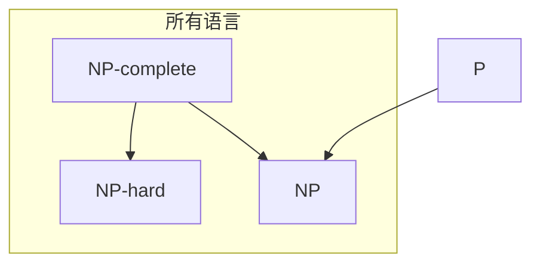

# 复习资料 05：计算复杂性

> 对应课件：ch04-Complexity  
> 面向零基础：先搞懂「算多久」，再搞懂 P、NP 与 NP 完全

---

## 本章在学什么？

可判定性问的是：**能不能算出来**。计算复杂性问的是：**要算多久**（通常看最坏情况下，输入长度为 $n$ 时图灵机最多走多少步）。

同一道题，换一台「更快的机器模型」或换一套算法，时间可能差很多。本章用**大 O 记法**描述增长趋势，用 **P / NP / NPC / NP-hard** 给问题分类。

---

## 1. 度量复杂性

### 1.1 大 O 记法（直观 + 定义）

**直观**：我们只关心「输入变长时，时间怎么长」，不要纠结常数 2 还是 6、低次项 $n^2$ 还是 $n$。

例如 $f(n) = 6n^3 + 2n^2 + 20n + 45$，主导项是 $n^3$，就说 $f(n) = O(n^3)$。

**定义**：设 $f, g : \mathbf{N} \to \mathbf{R}^+$。称 $f(n) = O(g(n))$，若存在常数 $c > 0$ 和 $n_0$，使得对所有 $n \geqslant n_0$ 有

$$
f(n) \leqslant c \cdot g(n)
$$

此时 $g(n)$ 是 $f(n)$ 的**渐近上界**（允许乘常数、忽略低次项）。

**例子**：

- $5n^3 + 2n^2 + 22n + 6 = O(n^3)$（取 $c=6, n_0=10$ 可验证）
- 同一函数也满足 $O(n^4)$（上界可以取得更松）
- 但它**不是** $O(n^2)$（$n^3$ 最终总会超过 $c \cdot n^2$）

对数可换底（差一个常数因子）：$O(\log n)$ 不必写底数。例如 $3n\log n + 5n\log\log n + 2 = O(n\log n)$。

### 1.2 小 o 记法（直观 + 定义）

**直观**：大 O 像「$\leqslant$」（渐近不超过）；小 o 像「$<$」（渐近**严格更慢**）。

**定义**：若

$$
\lim_{n \to \infty} \frac{f(n)}{g(n)} = 0
$$

则记 $f(n) = o(g(n))$。等价地：对任意 $c > 0$，存在 $n_0$，使得 $n \geqslant n_0$ 时 $f(n) < c \cdot g(n)$。

**例子**（增长从慢到快）：

| 关系 | 含义 |
|------|------|
| $\sqrt{n} = o(n)$ | 根号比线性慢 |
| $n = o(n\log n)$ | 线性比 $n\log n$ 慢 |
| $n\log n = o(n^2)$ | |
| $n^2 = o(n^3)$ | |

注意：总有 $f(n) \neq o(f(n))$（自己不能严格小于自己）。

### 1.3 时间复杂度（图灵机）

**定义**：设 $M$ 是**总停机**的确定型图灵机。$M$ 的**时间复杂度**是函数 $f(n)$：在所有长度为 $n$ 的输入上，$M$ 运行的**最大步数**（最坏情况）。称 $M$ 在 $O(f(n))$ 时间内运行。

由此定义时间类：

$$
\mathsf{TIME}(t(n)) = \{ L \mid L \text{ 被某个 } O(t(n)) \text{ 时间的图灵机判定} \}
$$

### 1.4 例题：判定 $A = \{0^k 1^k \mid k \geqslant 0\}$ 的三种图灵机

语言 $A$：先是一串 $0$，再是一串 $1$，且个数相同（如 $0011$、$\varepsilon$）。

#### $M_1$：单带，$O(n^2)$

算法思路：反复扫描整带，每次删掉一对 $0$ 和 $1$，直到只剩一种符号或删光。

- 合法性检查（$0$ 必须在 $1$ 左边）：$O(n)$
- 每轮扫描删一对，最多约 $n/2$ 轮，每轮 $O(n)$ → $O(n^2)$
- 最后判断：$O(n)$

合计：$O(n^2)$。

#### $M_2$：单带，$O(n \log n)$

改进：**隔一删一**（类似二分），每轮把 $0$、$1$ 各删大约一半；每轮还要检查剩余 $0/1$ 总数是否为偶数（奇数则拒绝）。

轮数约为 $O(\log n)$，每轮扫描 $O(n)$ → 总时间 $O(n \log n)$。故 $A \in \mathsf{TIME}(n \log n)$。

#### $M_3$：双带，$O(n)$

- 纸带 1 读 $0$ 时复制到纸带 2
- 读 $1$ 时在纸带 2 上删一个 $0$
- 读完时纸带 2 上 $0$ 恰好删光则接受

每条边最多扫常数次 → **线性时间** $O(n)$。

**小结**：同一语言，模型与算法不同，复杂度可从 $n^2$ 降到 $n$。

---

## 2. 模型间的复杂性关系

> [!tip] **复习重点**
> 单带、多带、非确定型图灵机之间的**时间**关系（定理表述即可，不必证）：
> - 多带 $t(n)$ ↔ 单带 $O(t^2(n))$
> - 非确定型 $t(n)$ ↔ 单带 $2^{O(t(n))}$

### 2.1 多带 ↔ 单带

**定理**（$t(n) \geqslant n$）：每个在 $t(n)$ 时间内运行的**多带**图灵机，都等价于某个在 $O(t^2(n))$ 时间内运行的**单带**图灵机。

**直觉**：用单带模拟多带时，要在一条带上反复「画格子、记符号、来回找头」，一步多带操作可能变成 $O(t(n))$ 步单带操作，$t(n)$ 步一共约 $O(t^2(n))$。**多带更快，但只快多项式倍（平方级）**。

### 2.2 非确定型 ↔ 确定型

**定义**：非确定型判定器 $N$ 的时间 $f(n)$ = 所有长度为 $n$ 的输入上，**各计算分支**中的**最大步数**。

**定理**（$t(n) \geqslant n$）：每个 $t(n)$ 时间的**非确定型**图灵机，都等价于某个 $2^{O(t(n))}$ 时间的**单带确定型**图灵机。

**直觉**：确定型机器要**穷举**非确定型的猜测（或跑指数多的分支）。**非确定型比确定型「快」得多，代价是指数级**。

| 模型 | 相对单带确定型 |
|------|----------------|
| 多带 | 最多慢到平方：$t \to t^2$ |
| 非确定型 | 可能慢到指数：$t \to 2^{O(t)}$ |

---

## 3. P 类

> [!tip] **复习重点**
> **P 的定义**：$P = \bigcup_k \mathsf{TIME}(n^k)$（多项式时间内可判定的语言）。  
> **P 中的例子**：PATH（标记可达）、RELPRIME（辗转相除法）。  
> P 在合理计算模型下是**稳健**的，且**大致对应实际可解**问题。

### 3.1 为什么关心多项式时间？

- **多项式** $n^k$：输入长度翻倍，时间增长为常数倍的幂，通常还能接受。
- **指数** $2^n$：输入稍长，时间爆炸，通常不现实。

合理确定型模型彼此**多项式等价**（模拟只多乘多项式因子），所以 P 不依赖「你用的是哪种合理机器」。

### 3.2 定义

$$
P = \bigcup_{k \in \mathbf{N}} \mathsf{TIME}(n^k)
$$

即：存在某个常数 $k$，使得语言能被 $O(n^k)$ 时间的确定型图灵机判定。

### 3.3 P 中的问题举例

#### PATH（有向路径）

输入：有向图 $G$、起点 $s$、终点 $t$。

$$
\mathrm{PATH} = \{\langle G,s,t\rangle \mid G \text{ 中存在从 } s \text{ 到 } t \text{ 的有向路径}\}
$$

**算法**：从 $s$ 开始反复「标记所有从已标记点出发一步能到的点」，直到不再新增。若 $t$ 被标记则接受。边数多项式 → 整个过程多项式时间。故 $\mathrm{PATH} \in P$。

#### RELPRIME（互素）

$$
\mathrm{RELPRIME} = \{\langle x,y\rangle \mid \gcd(x,y)=1\}
$$

用**欧几里得辗转相除**求最大公约数，步数关于位数是多项式的 → $\mathrm{RELPRIME} \in P$。

（补充：每个上下文无关语言也在 P 中——可用 CYK 等算法。）

---

## 4. NP 类

> [!tip] **复习重点**
> **NP 的定义（验证机视角）**：存在多项式时间验证机 $V$，使得 $w \in L$ 当且仅当存在证书 $c$，$V$ 接受 $\langle w,c\rangle$。  
> **等价定义**：非确定型多项式时间图灵机可判定。  
> **NP 中的例子**：CLIQUE、SUBSET-SUM。  
> **与 P**：$P \subseteq NP$；$P = NP$？**至今未解决**。

### 4.1 多项式可验证性

有些题**直接求解**很难，但**给你一个候选答案**，检查对不对却很快。

例：**HAMPATH**（有向图是否存在从 $s$ 到 $t$ 的哈密顿路径——每条边走一次、每个点恰经过一次）。不知道是否有多项式算法，但若有人给你一条顶点序列，你可以线性时间检查它是不是哈密顿路径 → **可验证**。

### 4.2 验证机与 NP 的定义

**验证机**：算法 $V$ 满足

$$
A = \{ w \mid \exists c,\ V \text{ 接受 } \langle w,c\rangle \}
$$

$c$ 叫**证书**（witness）。若 $V$ 在 $|w|$ 的多项式时间内运行，则 $A$ **多项式时间可验证**。

**定义**：

$$
\mathsf{NP} = \{ A \mid A \text{ 有多项式时间验证机} \}
$$

**定理**：$A \in \mathsf{NP}$ 当且仅当 $A$ 能被某个**非确定型多项式时间**图灵机判定。

记 $\mathsf{NTIME}(t(n))$ 为非确定型 $O(t(n))$ 时间可判定的语言类，则

$$
\mathsf{NP} = \bigcup_k \mathsf{NTIME}(n^k)
$$

### 4.3 NP 中的问题举例

#### CLIQUE（$k$-团）

无向图的**团**：子图中任意两点都有边。**$k$-团** = 恰有 $k$ 个顶点的团。

$$
\mathrm{CLIQUE} = \{\langle G,k\rangle \mid G \text{ 含 } k\text{-团}\}
$$

**验证**：证书 = 某 $k$ 个顶点；检查两两有边 → $O(k^2)$，关于输入是多项式 → $\mathrm{CLIQUE} \in \mathsf{NP}$。

#### SUBSET-SUM（子集和）

$$
\mathrm{SUBSET-SUM} = \{\langle S,t\rangle \mid S=\{x_1,\ldots,x_k\},\ \exists \text{ 子集和为 } t\}
$$

**验证**：证书 = 选中的那些数；加起来是否等于 $t$ → 多项式时间。

### 4.4 P 与 NP 的关系

- 若 $L \in P$，则无需猜测，直接判定；把证书留空也能验证 → **$P \subseteq NP$**。
- **$P = NP$？** 若相等，则所有「猜一下能很快验」的题都能「直接算出来」。多数研究者相信 **$P \neq NP$**，但尚无证明。

---

## 5. NP 完全性

> [!tip] **复习重点**
> **多项式时间归约**：$A \leqslant_P B$ 指存在多项式时间可计算函数 $f$，使得 $w \in A \iff f(w) \in B$。  
> **NP 完全（NPC）**：(1) $B \in \mathsf{NP}$；(2) 每个 $A \in \mathsf{NP}$ 都有 $A \leqslant_P B$。  
> **库克-列文定理**：**SAT** 是 NP 完全的（第一个 NPC 问题）。  
> **证明 NPC 的策略**：先找一个**已知 NPC** 问题，再多项式时间归约到目标问题；若目标在 NP，则目标也是 NPC。

### 5.1 多项式时间归约

**多项式时间可计算函数**：存在多项式时间图灵机，在输入 $w$ 上停机且输出 $f(w)$。

**归约**：$A \leqslant_P B$ 若存在这样的 $f$，使得

$$
w \in A \iff f(w) \in B
$$

含义：把 $A$ 的判定**有效翻译**成 $B$ 的判定。

**定理**：若 $A \leqslant_P B$ 且 $B \in P$，则 $A \in P$。

**定理**：若 $B$ 是 NP 完全的且 $B \in P$，则 **$P = NP$**。

**定理**（传播 NPC）：若 $B$ 是 NP 完全的，$B \leqslant_P C$，且 $C \in \mathsf{NP}$，则 **$C$ 是 NP 完全的**。

### 5.2 NP 完全的正式定义

语言 $B$ 是 **NP 完全的（NPC）**，当且仅当：

1. $B \in \mathsf{NP}$；
2. 对每个 $A \in \mathsf{NP}$，有 $A \leqslant_P B$。

实际证明 (2) 时，往往只需从某个**已知的 NPC** 问题归约到 $B$，再用上面的传播定理。

### 5.3 库克-列文定理

**定理（Cook-Levin）**：布尔公式可满足性问题 **SAT** 是 NP 完全的。

意义：第一次把「整个 NP 类的难度」压到**一个**问题上。之后证明别的问题是 NPC，只需 **SAT（或 3SAT 等）$\leqslant_P$ 你的问题**。

### 5.4 证明一个问题 NPC 的步骤（原理）

设要证明 $L$ 是 NPC：

1. **证 $L \in \mathsf{NP}$**：给出多项式时间验证机（或说明非确定型多项式算法）。
2. **选一个已知 NPC 问题** $B$（如 3SAT、CLIQUE）。
3. **构造归约** $f$：多项式时间可算，且 $w \in B \iff f(w) \in L$。
4. 由传播定理，$L$ 为 NPC。

课件中例：**3SAT $\leqslant_P$ CLIQUE**（通过「小工具图」把公式变成图，团大小与可满足性对应）。

---

## 6. 几个 NP 完全问题（了解陈述即可）

| 问题 | 简述 |
|------|------|
| **SAT / 3SAT** | 布尔公式 / 每子句恰 3 个文字的合取范式是否可满足 |
| **CLIQUE** | 是否存在 $k$-团 |
| **VERTEX-COVER** | 是否存在至多 $k$ 个顶点，覆盖所有边 |
| **IS**（独立集） | 是否存在 $k$ 个顶点两两不相邻 |
| **HAMPATH** | 是否存在从 $s$ 到 $t$ 的哈密顿路径 |
| **SUBSET-SUM** | 是否存在子集和为 $t$ |

它们彼此（及与 SAT）之间都能多项式时间归约，所以**难度同级**：若其中一个有多项式算法，则 $P = NP$。

---

## 7. NP 难问题

> [!tip] **复习重点**
> **NP 难（NP-hard）**：满足 NPC 定义中的条件 (2)（每个 NP 语言都 $\leqslant_P$ 到它），但**不一定**满足 (1)（不一定属于 NP）。  
> **关系**：$\mathsf{NPC} \subseteq \mathsf{NP} \cap \text{NP-hard}$；NP-hard 还包含**比 NP 还难**、不在 NP 中的问题。NPC = NP 与 NP-hard 的交集。

### 7.1 定义

若 $L$ 使得**对每个** $A \in \mathsf{NP}$ 都有 $A \leqslant_P L$，但**不能证明** $L \in \mathsf{NP}$，则称 $L$ 为 **NP 难的**。

证明 $L$ 是 NP 难，足以说明 $L$ **极其困难**（至少和 NPC 一样难）；但若 $L \notin \mathsf{NP}$，它不能用来直接论证「NP 里都有难实例」——除非再结合 $P \neq NP$ 等假设。

### 7.2 关系图（记法）

- **P** $\subseteq$ **NP**
- **NPC** = **NP** $\cap$ **NP-hard**
- **NP-hard** 更大，可包含不在 NP 中的问题（如停机问题的某种版本、优化问题的判定形式等，视课程定义而定）

### 7.3 如何证明 NP-hard（原理）

与 NPC 类似，但**不必**证 $L \in \mathsf{NP}$：

1. 取已知 **NPC** 问题 $B$；
2. 证 $B \leqslant_P L$；
3. 由归约的传递性，所有 NP 问题都 $\leqslant_P L$ → $L$ 为 NP-hard。

若同时证 $L \in \mathsf{NP}$，则 $L$ 为 NPC。

---

## 本章小结

| 概念 | 一句话 |
|------|--------|
| 大 O / 小 o | 渐近上界 / 严格更慢 |
| $\mathsf{TIME}(t(n))$ | $O(t(n))$ 时间可判定 |
| P | 多项式时间可判定 |
| NP | 多项式时间可**验证**（= 非确定型多项式） |
| NPC | NP 中最难的那批（NP 中每个问题都能归约到它） |
| NP-hard | 至少和 NPC 一样难（不一定在 NP） |
| 归约 | 把 A 的实例变成 B 的实例，保持是/否 |

---

## 练习题

### 练习 1（来自：ch04）

**题目**：简述 **P**、**NP**、**NPC**、**NP-hard** 四者的定义及其包含关系。

> [!question]- 点击查看完整解答
> **解答**：
>
> **符号化与定义**
>
> - **P**：$P = \bigcup_{k} \mathsf{TIME}(n^k)$。语言 $L \in P$ 当且仅当存在确定型图灵机与常数 $k$，使得对所有输入 $w$，$M$ 在 $|w|^k$ 步内停机并正确判定 $w \in L$。
> - **NP**：$L \in \mathsf{NP}$ 当且仅当存在多项式时间验证机 $V$，使得
>   $$
>   w \in L \iff \exists c,\ V(\langle w,c\rangle)\ \text{接受}
>   $$
>   等价地，$L$ 可被非确定型多项式时间图灵机判定。
> - **NPC（NP 完全）**：$L$ 是 NPC 当且仅当 (1) $L \in \mathsf{NP}$；(2) 对每个 $A \in \mathsf{NP}$，$A \leqslant_P L$。
> - **NP-hard**：对每个 $A \in \mathsf{NP}$，$A \leqslant_P L$（即满足 NPC 的条件 (2)），但**不要求** $L \in \mathsf{NP}$。
>
> **包含关系（推理）**
>
> 1. 若 $L \in P$，则 $L \in \mathsf{NP}$（验证机可忽略证书，直接跑多项式判定）→ **$P \subseteq \mathsf{NP}$**。
> 2. 若 $L$ 是 NPC，则 $L \in \mathsf{NP}$ 且 $L$ 被所有 NP 问题归约 → **$\mathsf{NPC} \subseteq \mathsf{NP}$** 且 **$\mathsf{NPC} \subseteq \text{NP-hard}$**。
> 3. NP-hard 只要求「被 NP 归约到」，不要求是 NP → **存在 NP-hard $\notin \mathsf{NP}$ 的可能**。
>
> **结论**：$P \subseteq \mathsf{NP}$；$\mathsf{NPC} = \mathsf{NP} \cap \text{NP-hard}$（交集）；NP-hard 与 NP 有交集（至少包含 NPC），且 NP-hard 可严格更大。

---

### 练习 2（来自：ch04）

**题目**：假设你想证明一个新问题 $L$ 是 **NP 完全的**，请写出证明步骤（知道原理即可，可对照课堂例题）。

> [!question]- 点击查看完整解答
> **解答**：
>
> **目标**：证 $L$ 满足 NPC 定义：(1) $L \in \mathsf{NP}$；(2) $\forall A \in \mathsf{NP},\ A \leqslant_P L$。
>
> **步骤 1 — 证 $L \in \mathsf{NP}$**
>
> - 给出**证书** $c$ 的含义（例如：团的一组顶点、公式的真值赋值、子集和选中的数）。
> - 描述验证机 $V$：在输入 $\langle w,c\rangle$ 上检查 $c$ 是否合法且是否证明 $w \in L$。
> - 论证 $V$ 的时间是 $|w|$ 的多项式 → $L \in \mathsf{NP}$。
>
> **步骤 2 — 选一个已知 NPC 问题 $B$**
>
> - 常用起点：**SAT**（Cook-Levin）、**3SAT**、**CLIQUE**、**VERTEX-COVER** 等（课件例题链：SAT → 3SAT → CLIQUE → …）。
>
> **步骤 3 — 构造多项式时间归约 $f$**
>
> - 对每个实例 $w$ of $B$，在多项式时间内算出 $f(w)$（$L$ 的实例编码）。
> - **正确性**：证明 $w \in B \iff f(w) \in L$（充分 + 必要，常画「是实例 ↔ 是实例」对应）。
> - **多项式时间**：$f$ 的每一步（建图、复制公式等）关于 $|w|$ 是多项式的。
>
> **步骤 4 — 结论**
>
> - 已知 $B$ 是 NPC → 对所有 $A \in \mathsf{NP}$，$A \leqslant_P B$。
> - 刚证 $B \leqslant_P L$，由归约传递性，$A \leqslant_P L$。
> - 结合步骤 1，$L$ 为 **NP 完全**。
>
> **备注**：若只证 $B \leqslant_P L$（$B$ 为 NPC）而**不**证 $L \in \mathsf{NP}$，则只得到 $L$ 是 **NP-hard**；要 NPC 必须同时完成步骤 1。