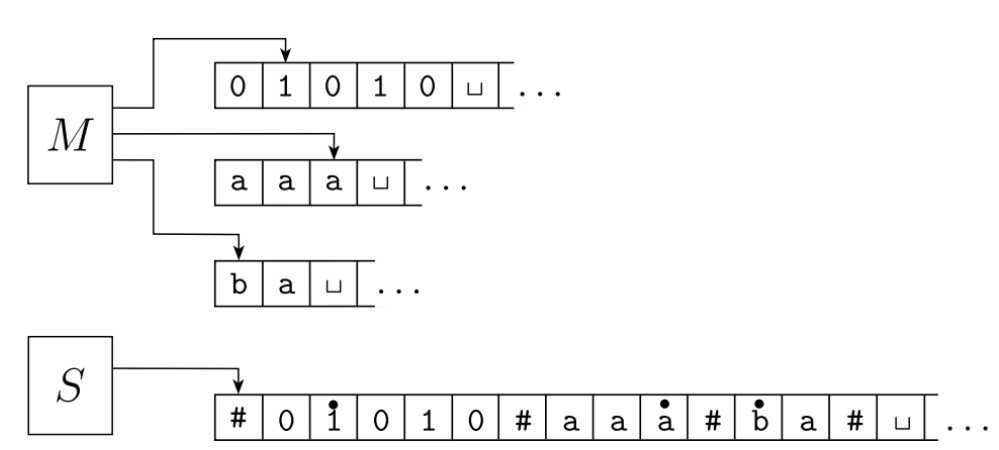
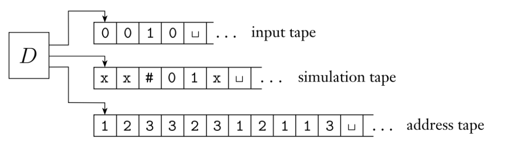

---

## 1. 计算理论的研究目的与研究内容

**研究目的：** 回答计算机科学中最基础的问题——**"计算机的基本能力和局限性是什么？"**

**研究内容（三个支柱）：**

| 领域          | 核心问题      | 关键概念                                             |
| :---------- | :-------- | :----------------------------------------------- |
| **自动机理论**   | 计算的数学模型   | 有穷自动机(正则文法)<br>下推自动机(上下文无关文法)<br>图灵机（现代计算机的数学模型） |
| **可计算性理论**  | 问题能否被计算解决 | 可判定/不可判定、递归可枚举语言、递归语言                                 |
| **计算复杂性理论** | 问题算得快不快   | P、NP、NPC、NP-hard                                 |

---

## 2. 可计算性理论与计算复杂性理论

### 可计算性理论
- 目标：把问题分成可解的（可判定）和不可解的（不可判定）
### 计算复杂性理论
- 核心问题：是什么使得某些问题很难计算，而又使另一些问题容易计算?
- 目标：把问题分成容易计算的和难计算的
---

## 3. 有穷自动机的定义、状态转移图、接受语言

### 形式化定义（五元组）

一个有穷自动机（Finite Automaton,FA）是一个五元组 $M = (Q, \Sigma, \delta, q_0, F)$：

| 符号 | 含义 |
|:---|:---|
| $Q$ | 有穷状态集 |
| $\Sigma$ | 有穷输入字母表 |
| $\delta: Q \times \Sigma \to Q$ | 转移函数 |
| $q_0 \in Q$ | 初始状态 |
| $F \subseteq Q$ | 接受状态集 |

### 状态转移图

- **节点** → 状态集 $Q$ 中的各个状态
- **有向边** → 转移函数 $\delta$，边上标有输入字符
- **开始箭头** → 指向 $q_0$ 的无来源箭头
- **双圈** → 标识接受状态

### 接受语言的定义

扩充转移函数 $\hat{\delta}$：
- $\hat{\delta}(q, \varepsilon) = q$
- $\hat{\delta}(q, aw) = \hat{\delta}(\delta(q, a), w)$

FA $M$ 接受的语言：
$$L(M) = \{ x \mid \hat{\delta}(q_0, x) \in F \}$$

---

## 4. 图灵机的定义、状态转移图、与有穷自动机的关系

### 形式化定义（七元组）

图灵机（TM）是一个七元组 $M = (Q, \Sigma, \Gamma, \delta, q_0, q_{accept}, q_{reject})$：

| 符号                                                            | 含义                                                  |
| :------------------------------------------------------------ | :-------------------------------------------------- |
| $Q$                                                           | 有穷状态集                                               |
| $\Sigma$                                                      | 输入字母表（不含空白符 $\sqcup$）                               |
| $\Gamma$                                                      | 纸带字母表（$\sqcup \in \Gamma, \Sigma \subseteq \Gamma$） |
| $\delta: Q \times \Gamma \to Q \times \Gamma \times \{L, R\}$ | 转移函数                                                |
| $q_0$                                                         | 起始状态                                                |
| $q_{accept}$                                                  | 接受状态                                                |
| $q_{reject}$                                                  | 拒绝状态（$q_{accept} \neq q_{reject}$）                  |

### δ 的直观理解

$$\delta(q_i, X_j) = (q_k, X_l, D_m)$$

> **“状态 $q_i$ 读到 $X_j$ → 改写成 $X_l$，往 $D_m$ 移一格，进入 $q_k$”**

与 FA 的核心区别：TM **能读能写、能左能右、纸带无限**，FA 只能读且单向。

### 与有穷自动机的关系

| 特性 | FA | TM |
|:---|:---|:---|
| 读写能力 | 只读 | 读 + 写 |
| 移动方向 | 单向（通常向右） | 双向（左/右） |
| 存储 | 仅有穷状态 | 无限长纸带 |
| 结果 | 处理完字符串后判定 | 停机时判定，可能死循环 |

### TM 接受的语言

$M$ **接受**输入 $w$，当存在格局序列 $C_1, C_2, \dots, C_k$ 满足：
- $C_1$ 是 $M$ 在 $w$ 上的起始格局
- 每个 $C_i$ **产生**（一步转移得到）$C_{i+1}$
- $C_k$ 是接受格局

$M$ 识别的语言：$L(M) = \{ w \mid M \text{ 接受 } w \}$

### 三种运行结果

在输入 $w$ 上运行 TM，可能出现三种结果：

| 结果 | 含义 |
|:---|:----|
| **接受** | 停机在 $q_{accept}$，$w \in L(M)$ |
| **拒绝** | 停机在 $q_{reject}$，$w \notin L(M)$ |
| **循环** | 永不停机（死循环） |

> **关键问题**：循环和"跑很久很久"在外部无法区分。你永远不知道机器是死循环了，只是还没算完。

### 判定器（decider）

因为循环无法区分，人们更偏好**对所有输入都停机**的 TM——它们永不循环。

> 这种 TM 被称为**判定器**（decider），也叫**总停机的图灵机**，也叫**算法**。

- 判定器总能决定接受还是拒绝
- 能识别某语言的判定器，称它**判定**（decide）该语言

### 图灵可识别（递归可枚举语言）

> 若存在 TM $M$ 使 $L(M) = A$，则称 $A$ 是**图灵可识别的**（Turing-recognizable），也称**递归可枚举语言**。

对 $A$ 中的串，$M$ 一定接受；对不在 $A$ 中的串，$M$ 可能拒绝也可能**循环**。

### 图灵可判定（递归语言）

> 若存在**判定器** $M$ 使 $L(M) = A$，则称 $A$ 是**图灵可判定的**（Turing-decidable），也称**递归语言**（recursive）。

### 两者的关系

- 每个可判定语言都是可识别的（判定器本身就是一种特殊的 TM）
- 存在可识别但不可判定的语言（如 $L_u$、$L_h$）

**计算层次：** 正则语言 ⊂ 上下文无关语言 ⊂ **可判定语言（递归）** ⊂ **图灵可识别语言（递归可枚举语言）**

---

## 5. 多带图灵机的定义、与单带图灵机的等价性

### 定义

多带图灵机拥有 $k$ 条独立纸带，每条纸带有一个独立读写头。

转移函数：
$$\delta : Q \times \Gamma^k \to Q \times \Gamma^k \times \{L, R, S\}^k$$

### 与单带 TM 的对比

| | 单带 TM | 多带 TM |
|:---|:--------|:--------|
| 纸带数 | 1 条 | $k$ 条 |
| 读写头 | 1 个 | $k$ 个（每条带独立） |
| δ 读入 | 1 个符号 | $k$ 个符号（每条带各读一个） |
| δ 写入 | 1 个符号 | $k$ 个符号（每条带各写一个） |
| 移动选项 | $\{L,R\}$ | $\{L,R,S\}$（S=原地不动） |

> **多带 TM = 单带 TM × k**：本质完全一样，只是从“一个头做一件事”变成“$k$ 个头同时做 $k$ 件事”。

### 为什么单带没有 S，多带需要 S？

- **单带**：只有一个头，想“原地不动”可以通过 L→R 两步模拟，所以定义上没必要引入 S
- **多带**：$k$ 个头的移动必须**独立控制**。某条带这步不需要移，直接设 S 即可，不需要绕弯子

> S 不是“读到空集才不动”——它是 $\delta$ 里写死的移动方向选项，跟 L、R 平起平坐。

### 等价性证明

**定理：** 每个 $k$ 带图灵机 $M$ 等价于某个单带图灵机 $S$。

**证明：** 对 $M$ 的输入 $w = w_1 \cdots w_n$，$S$ 在其纸带上写入 $k$ 个区间（用 $k+1$ 个 `#` 分隔），格式为：

$$\# \dot w_1 w_2 \cdots w_n \# \dot \sqcup \# \dot \sqcup \# \cdots \#$$

第一个 `#` 为左端点，第 $k+1$ 个 `#` 为右端点。每个区间对应 $M$ 的一条纸带，**带点符号**（$\dot a$）标记该区间内虚拟读写头位置。（初始时第 1 个区间放输入，其余为空白。）

为模拟 $M$ 的一步，$S$ 执行**两趟扫描**：

1. **第一趟**（左→右）：找出各区间的带点符号，记下 $k$ 个符号 $(s_1,\dots,s_k)$（$k$ 固定，$S$ 用有限状态即可记住）
2. **第二趟**（左→右）：根据 $\delta(q_i,s_1,\dots,s_k) = (q_j,t_1,\dots,t_k,D_1,\dots,D_k)$，将各虚拟头位置改写为 $t_j$，标记点向 $D_j$ 移一格

**边界处理**：

- **右移遇到 `#`**：说明 $M$ 移入了空白区域。$S$ 把此 `#` 及右边的所有内容**整体右移一格**，在空位写 $\sqcup$，标记点放到 $\sqcup$ 上。

- **左移遇到 `#`**：说明 $M$ 在纸带最左端试图左移。$S$ 把标记点再右移一格（跳过 `#`），回到当前区间第一个符号上。

**正确性**：$S$ 精确复现 $M$ 的每一步格局变化，故 $M$ 接受 $w$ 当且仅当 $S$ 接受 $w$。

**复杂度**：$t(n)$ 步的多带机 → $O(t^2(n))$ 步的单带机（多项式等价）。

---

## 6. 非确定型图灵机的定义、与确定型图灵机的等价性

### 定义

NTM 的转移函数：
$$\delta : Q \times \Gamma \to \mathcal{P}(Q \times \Gamma \times \{L, R\})$$

> **对比单带 DTM**：$\delta : Q \times \Gamma \to Q \times \Gamma \times \{L, R\}$
> 区别只有一处——箭头右边从单个三元组变成了**集合 $\mathcal{P}(\dots)$**。

### 关键理解

- **计算树**：每步有多个分支，所有可能走法构成一棵树
- **接受条件**：**只要存在一条路径走到接受状态**，就认为 NTM 接受该输入
- **直观类比**：NTM 像一台有**无限个并行线程**的机器，每条分支一个线程，任一成功即整体成功

> NTM 不是现实中能造出来的机器——它是**思想实验**，用来精确刻画 **NP** 类问题（多项式时间可验证）。

### 等价性证明

**定理：** 每个 NTM 等价于某个确定型图灵机（DTM）。

**证明：** 构造 3 带确定型图灵机 $D$ 模拟 $N$ 如下。

| 纸带    | 用途                    |
| :---- | :-------------------- |
| 第 1 带 | 保存原始输入 $w$（只读）        |
| 第 2 带 | 模拟 $N$ 的**当前分支**的计算过程 |
| 第 3 带 | **地址带**——记录当前在计算树中的位置 |

地址带上的数字串决定 $N$ 每一步的走向：若 $\delta_N(q,a)$ 有 $m$ 种选择，则数字 $d$ 表示选第 $d$ 种。

$D$ 的算法流程：

> ① **初始设置**：第 1 带放输入 $w$，第 2、3 带均为空白
> ② **初始化当前分支**：将第 1 带内容复制到第 2 带，第 3 带写 $\varepsilon$（空串）
> ③ **模拟一个分支**：在第 2 带上运行 $N$，每步查询第 3 带的下一个数字 $d$，按第 $d$ 种选择执行
>    - 若地址串用完或选择无效 → 放弃此分支，转 ④
>    - 若遇到拒绝格局 → 放弃此分支，转 ④
>    - 若遇到接受格局 → **$D$ 接受，停机**
> ④ **换下一个分支**：$D$ 在第 3 带上把当前地址串**自增 1**（按字典序计算下一个串，如 $\varepsilon\!\to\!1\!\to\!11\!\to\!12\!\to\!\cdots\!\to\!2\!\to\!21\!\to\!\cdots$），转 ②

> **地址串怎么来的？** $D$ 自己算的——把第 3 带当作一个**计数器**，每次执行 ④ 就加 1。
> 例如最大分支数 $m=3$ 时，$D$ 的计数序列为 $\varepsilon \to 1 \to 2 \to 3 \to 11 \to 12 \to \cdots$（类似 $m$ 进制加法，满 $m$ 进一）。

**正确性**：$D$ 按字典序穷举 $N$ 的所有计算分支。存在接受分支当且仅当 $D$ 最终能遇到它，故 $N$ 接受 $w$ 当且仅当 $D$ 接受 $w$。

**复杂性差异**：$t(n)$ 时间的 NTM → $2^{O(t(n))}$ 时间的 DTM（**指数级爆炸**）。

---

## 7. 丘奇-图灵论题的内涵

所有合理的计算模型都是等价的

---

## 8. 问题的分类
$$
\text{问题}
\left\{
\begin{array}{l}
\text{非判定问题} \\[10pt]
\text{判定问题(实例解-是否)}
\left\{
\begin{array}{l}
\text{可判定问题(计算机能解决，递归语言)} \\[8pt]
\text{不可判定问题(×递归语言)}
\left\{
\begin{array}{l}
\text{半可判定问题(递归可枚举语言)} \\[8pt]
\text{非半可判定问题}
\end{array}
\right.
\end{array}
\right.
\end{array}
\right.
$$

---

## 9. 问题、语言、计算模型三者之间的关系

三者互为双向关系，构成一个**三角循环**：

$$\text{问题 (Problem)} \xleftrightarrow[\text{问题定义}]{\text{编码}} \text{语言 (Language)} \xleftrightarrow[\text{判定}]{\text{识别}} \text{计算模型 (TM)} \xleftrightarrow[\text{解决}]{\text{构造}} \text{问题 (Problem)}$$

| 关系 | 方向 | 含义 |
|:---|:----|:-----|
| **问题 ↔ 语言** | 问题 → 语言 | 将问题答案为"是"的实例编码为字符串集合 |
| | 语言 → 问题 | 每个语言对应一个判定问题："某串是否属于该语言？" |
| **语言 ↔ 计算模型** | 语言 → 模型 | 设计 TM 识别/判定该语言 |
| | 模型 → 语言 | TM 接受的所有字符串构成语言 $L(M)$ |
| **计算模型 ↔ 问题** | 模型 → 问题 | 每台 TM 定义了一个判定问题（它接受什么） |
| | 问题 → 模型 | 要解决问题，构造 TM 判定其对应语言 |

---

## 10. 受限制的图灵机与图灵机的编码

### 受限制的图灵机

简化版 TM，用于理论分析：
- 状态集 $Q = \{q_1, q_2, \dots, q_n\}$
- 输入字母表 $\Sigma = \{0, 1\}$
- 纸带字母表 $\Gamma = \{0, 1, \sqcup\}$
- $q_1$ 为起始状态，$q_2$ 为接受状态

**等价性：** 与标准 TM 计算能力完全等价。

### 图灵机的编码

每条转移规则 $\delta(q_i, X_j) = (q_k, X_l, D_m)$ 编码为：
$$0^i 1 0^j 1 0^k 1 0^l 1 0^m$$

整个 TM 的编码 = 所有规则编码串用 `11` 分隔连接。

### 编码的意义

- **可数性**：TM 数量可数 → 语言数量不可数 → 必然存在无法识别的语言
- 为对角化语言 $L_d$ 和通用语言 $L_u$ 的构造提供基础
### 例题

$M = (\{q_1,q_2,q_3\}, \{0,1\}, \{0,1,\sqcup\}, \delta, q_1, q_2)$，其中 $\delta$ 包含 4 条规则：

| 规则                             | 编码                                                                                                               |
| :----------------------------- | :--------------------------------------------------------------------------------------------------------------- |
| $\delta(q_1,1)=(q_3,0,R)$      | $0^11\textcolor{gray}{0^2}1\textcolor{gray}{0^3}1\textcolor{gray}{0^1}1\textcolor{gray}{0^2} = 0100100010100$    |
| $\delta(q_3,0)=(q_1,1,R)$      | $0^31\textcolor{gray}{0^1}1\textcolor{gray}{0^1}1\textcolor{gray}{0^2}1\textcolor{gray}{0^2} = 0001010100100$    |
| $\delta(q_3,1)=(q_2,0,R)$      | $0^31\textcolor{gray}{0^2}1\textcolor{gray}{0^2}1\textcolor{gray}{0^1}1\textcolor{gray}{0^2} = 00010010010100$   |
| $\delta(q_3,\sqcup)=(q_3,1,L)$ | $0^31\textcolor{gray}{0^3}1\textcolor{gray}{0^3}1\textcolor{gray}{0^2}1\textcolor{gray}{0^1} = 0001000100010010$ |

整机编码（规则按任意顺序，用 `11` 分隔）：

$$0100100010100\,11\,0001010100100\,11\,00010010010100\,11\,0001000100010010$$

> 4 条规则共有 $4! = 24$ 种可能的整机编码（规则的排列顺序不同）。

---

## 11. 递归可枚举语言与递归语言的关系

### 定义

| 语言类型        | 别名    | TM 行为            | 直观理解           |
| :---------- | :---- | :--------------- | :------------- |
| **递归可枚举语言** | 图灵可识别 | 属于则停机接受，不属于可能死循环 | "对的肯定能算出来"     |
| **递归语言**    | 图灵可判定 | 总是停机（接受或拒绝）      | "总能在有限时间内给出答案" |

### 关系
1. **递归语言 ⊂ 递归可枚举语言**（每个可判定语言都是可识别的）
2. **互补性定理**：$L$ 是递归语言 ⟺ $L$ 和 $\bar{L}$ 都是递归可枚举语言
### 递归语言的性质

这两定理是后面证明 $L_u$、$L_h$ 不可判定的工具，卷面常作为引理或选项。
#### 定理 1：递归语言对补封闭

若 $L$ 是**递归**的，则 $\overline{L}$ 也是递归的。（又因为递归语言属于递归可枚举语言，所以 $L$ 和 $\bar{L}$ 都是递归可枚举语言）
#### 定理 2：$L$ 与 $\overline{L}$ 都是递归可枚举语言 $\Rightarrow$ $L$ 递归

---

## 12. 0 号问题 & 对角化语言 $L_d$

### 定义

$$L_d = \{ w_i \mid w_i \notin L(M_i) \}$$

其中 $w_1, w_2, \dots$ 是所有二进制串的字典序排列，$M_i$ 是第 $i$ 个图灵机。

### 证明 $L_d$ 是非递归可枚举语言

**反证法 + 对角化：**

1. 假设 $L_d$ 是**递归可枚举语言** → 存在 $M_j$ 使得 $L(M_j) = L_d$
2. 考察 $w_j$：
   - 若 $w_j \in L(M_j)$ → 则 $w_j \in L_d$ → 根据定义 $w_j \notin L(M_j)$ ✗
   - 若 $w_j \notin L(M_j)$ → 则 $w_j \in L_d$ → 故 $w_j \in L(M_j)$ ✗
3. 无论哪种情况都矛盾，假设不成立。**$\square$**

### 意义

- 证明存在连"半可判定"都做不到的语言
- 语言数量（不可数）远多于图灵机数量（可数）
- 为证明 $L_u$ 不可判定提供基础

---

## 13. 1 号问题 & 通用语言 $L_u$

### 定义

$$L_u = \{ \langle M, w \rangle \mid M \text{ 接受 } w \}$$

即：给定图灵机 $M$ 和输入 $w$，$M$ 是否接受 $w$？

### 证明 $L_u$ 是递归可枚举语言

构造**通用图灵机 $M_u$**（3带）：
- 第1带：存放 $\langle M, w \rangle$ 编码
- 第2带：模拟 $M$ 在 $w$ 上的运行
- 第3带：存放 $M$ 的当前状态

$M_u$ 能模拟 $M$ 的行为 → 若 $M$ 接受则 $M_u$ 接受 → $L_u$ 是**递归可枚举语言**

### 证明 $L_u$ 不是递归语言（不可判定）

**反证法 + 归约到 $L_d$：**

1. 假设 $L_u$ 是递归的 → 存在总停机的判定器 $M_{decide}$
2. 构造 $M'$ 识别 $L_d$：给定 $w$，查询 $M_{decide}(\langle M_w, w \rangle)$，若拒绝则接受
3. 但 $L_d$ 已知非**递归可枚举语言** → 矛盾 → **$L_u$ 不可判定**

---

## 14. 图灵停机问题 & 语言 $L_h$

### 定义

$$L_h = \{ \langle M, w \rangle \mid M \text{ 在输入 } w \text{ 上停机} \}$$

### 证明 $L_h$ 是非递归语言

**反证法 + 归约：**

1. 假设 $L_h$ 是递归的 → 存在总停机判定器 $M_{halt}$
2. 利用 $M_{halt}$ 构造识别 $L_d$ 的图灵机 $M'$：
   - 对输入 $w$，先问 $M_{halt}$："$M_w$ 在 $w$ 上停机吗？"
   - 若停机，则模拟 $M_w(w)$，若 $M_w$ 不接受则 $M'$ 接受
   - 若不停机，$M'$ 直接拒绝
3. 但 $L_d$ 非**递归可枚举语言** → 矛盾 → **$L_h$ 不可判定**

---

## 15. 莱斯定理的内容与应用

### 定理内容

> **递归可枚举语言的每一个非平凡性质都是不可判定的。**

- **性质**：递归可枚举语言的某种特征（如是否为空、是否有穷）
- **非平凡**：有的递归可枚举语言满足，有的不满足（即不是全有或全无）

### 应用

以下问题均为不可判定（只需判断是否涉及"图灵机接受的语言"且非平凡）：

| 问题 | 判定内容 |
|:---|:---|
| 空语言判定 | $L(M) = \emptyset$ |
| 有穷性判定 | $L(M)$ 仅有穷个串 |
| 正则性判定 | $L(M)$ 是正则语言 |
| 上下文无关性判定 | $L(M)$ 是上下文无关语言 |
| 非空性判定 | $L(M) \neq \emptyset$ |

### 不适用的情况

- 不涉及语言特征的问题（如"图灵机的状态数是否超过10"）→ 可判定

---

## 16. 什么是规约

### 定义

将问题 $A$ 的实例转化为问题 $B$ 的具有相同答案的实例。

**形式化**（映射可规约 $A \le_m B$）：
存在可计算函数 $f$ 使得 $w \in A \iff f(w) \in B$

### 核心意义

> 若 $A$ 可规约到 $B$，则问题 $B$ **至少**与问题 $A$ 一样难。

### 两种规约

| 类型 | 函数要求 | 用途 |
|:---|:---|:---|
| **一般规约** | 可计算 | 证明不可判定性 |
| **多项式时间规约** $\le_P$ | 多项式时间可计算 | 证明 NP-hard/NPC |

### 应用

- 可计算性：$A$ 不可判定 ∧ $A \le_m B$ ⇒ $B$ 不可判定
- 复杂性：$B \in$ P ∧ $A \le_P B$ ⇒ $A \in$ P

---

## 17. 单带、多带、NTM 之间的计算复杂性关系

| 转换 | 时间消耗 | 增长类型 |
|:---|:---|:---|
| 多带 TM → 单带 TM | $O(t^2(n))$ | **多项式增长** |
| NTM → 单带 DTM | $2^{O(t(n))}$ | **指数级增长** |

### 核心结论

- **可计算性等价**：三种模型能解决的问题范围相同
- **多项式等价**：所有确定型模型（单带、多带等）在多项式意义下等价
- 非确定型 → 确定型存在**指数级效率差距**，这是 P vs NP 问题的根源

---

## 18. P、NP、NPC、NP-hard 的定义与关系

### 定义

| 类 | 定义 | 直观理解 |
|:---|:---|:---|
| **P** | DTM 多项式时间可判定 | 实际可解 |
| **NP** | 多项式时间可验证（或 NTM 多项式时间可判定） | 验证容易 |
| **NPC** | 属于 NP + 所有 NP 问题可归约到它 | NP 中最难 |
| **NP-hard** | 所有 NP 问题可归约到它（不一定属于 NP） | 至少和 NPC 一样难 |

### 关系图

```
        NP-hard
    ┌──────┴──────┐
    │    NPC      │ (NP ∩ NP-hard)
    │  ┌─────┐    │
    │  │  P  │    │
    │  └─────┘    │
    └─────────────┘
```

- $P \subseteq NP$
- $NPC \subseteq NP$ 且 $NPC \subseteq NP\text{-hard}$
- $NP\text{-hard}$ 范围最广，可包含不可判定问题
- **P 是否等于 NP？**——未解之谜

---

## 19. 如何证明一个问题是 NPC 或 NP-hard

### 证明 NPC（两步法）

**第一步：证明 $A \in$ NP**
- 给定"证据"，说明可在多项式时间内验证其正确性

**第二步：证明 $A$ 是 NP-hard**
1. 选择一个**已知的 NPC 问题** $A'$（如 SAT、3SAT）
2. 构造多项式时间归约函数 $f$，将 $A'$ 实例映射到 $A$ 实例
3. 证明等价性：$A'$ 有解 ⟺ $f(A')$ 有解

### 证明 NP-hard

只需完成第二步（无需证明属于 NP）。

### 经典归约链

```
SAT (Cook-Levin)
  └→ 3SAT
      ├→ CLIQUE（团问题）
      ├→ VERTEX-COVER（顶点覆盖）
      └→ SUBSET-SUM（子集和）
          └→ 更多 NPC 问题...
```

---

## 20. 课堂例题证明思路

### 3SAT（3CNF-SAT）

从 CNF-SAT 规约：
- 子句只有 1-2 文字 → 引入辅助变量补齐至 3 个
- 子句有 $k>3$ 文字 → 引入 $k-3$ 个辅助变量拆分，保逻辑等价

### CLIQUE（团问题）

从 3SAT 规约：
- **构造**：$m$ 个子句 → $m$ 组顶点（每组对应一个子句的文字）
- **连边**：不同组的顶点之间连边，仅当文字不互补
- **目标**：$k=m$。3SAT 可满足 ⟺ 存在 $m$ 团

### VERTEX-COVER（顶点覆盖）

从 3SAT 规约：
- **构造**：$n$ 个变量 → $n$ 条边 $(x_i, \bar{x}_i)$；$m$ 个子句 → $m$ 个三角形
- **连边**：三角形顶点与其对应的变量顶点相连
- **目标**：$k = n + 2m$。公式可满足 ⟺ 存在大小为 $k$ 的顶点覆盖

### SUBSET-SUM（子集和）

从 3SAT 规约：
- **构造**：$n+m$ 位的十进制数（$n$ 位变量 + $m$ 位子句）
- **目标**：精心设计的进位规则使子集和等于目标值 ⟺ 变量赋值满足所有子句

---

> **核心要诀**
> - NPC 证明 = **属于 NP** + **NP-hard 归约**
> - NP-hard 证明 = 只需归约
> - 归约关键：**已知 NPC 问题 → 目标问题**，证明双向蕴涵
> - 规约的本质：**一个问题变身术**，用已知难题证明新问题的难度下界
