# 第0章 引言

## 课程信息

### 课程简介

人工智能数学基础是人工智能专业的一门重要课程，为后续专业课程学习奠定数学基础。以下为本课程在人工智能专业培养方案中的位置：

```mermaid
graph TD
  A["专业类"] --> B["人工智能实践教学"]
  A --> C["人工智能专业选修"]
  A --> D["人工智能专业核心"]
  A --> E["学科基础类"]

  B --> B1["机器学习综合实践"]
  B --> B2["知识工程综合实践"]
  B --> B3["语音与语言理论综合实践"]
  B --> B4["智能识别系统综合实践"]
  B --> B5["智能无人系统综合实践"]

  C --> C1["机器感知与机器学习方向"]
  C --> C2["计算机视觉与模式识别"]
  C --> C3["群体智能"]
  C --> C4["神经网络与深度学习"]
  C --> C5["智能无人系统"]

  D --> D1["语音与语言处理方向"]
  D --> D2["信息检索与智能问答"]
  D --> D3["信号与系统"]
  D --> D4["媒体计算"]
  D --> D5["情感计算"]

  E --> E1["数据与知识工程方向"]
  E --> E2["大数据分析理论与方法"]
  E --> E3["问题求解与专家系统"]
  E --> E4["知识图谱"]
  E --> E5["知识表示与推理"]

  F["人工智能专业核心"] --> F1["认识科学导论"]
  F --> F2["知识工程"]
  F --> F3["机器学习"]
  F --> F4["语音信息处理"]

  G["人工智能数学基础"] --> G1["计算理论"]
  G --> G2["数理逻辑"]
  G --> G3["矩阵分析"]
  G --> G4["最优化方法"]

  H["大类学科基础"] --> H1["算法分析与设计"]
  H --> H2["操作系统原理"]
  H --> H3["数据库原理"]
  H --> H4["计算机网络"]
  H --> H5["程序设计原理"]
  H --> H6["数据结构"]
  H --> H7["计算机系统导论"]
  H --> H8["计算机系统基础"]
  H --> H9["数字逻辑与数字系统"]
```

课程体系流程图

### 任课教师

- 杨雅君：计算理论、数理逻辑
- 刘志磊：矩阵分析、最优化方法

### 课程目标

- 掌握计算理论的基本概念和基本理论
- 理解数理逻辑的系统语义和语法的本质
- 具备一定将实际问题形式化的数学能力
- 形成对科学问题可计算性进行分析的观念

### 课程成绩组成

| 项目 | 占比 | 说明 |
|------|------|------|
| 卷面考试 | 80% | 期末闭卷考试 |
| 平时成绩 | 20% | 出勤、作业、课堂表现 |

- 出勤情况：三次点名未到取消考试资格
- 日常作业
- 课堂表现：酌情加分 0.5 ∼ 1 分

### 教材

#### 《计算理论导引（第3版）》

- 作者：Michael Sipser
- 出版社：机械工业出版社

#### 《面向计算机科学的数理逻辑》

- 作者：陆钟万
- 出版社：科学出版社

### 参考书

#### 《形式语言与自动机》

- 作者：陈有祺
- 出版社：机械工业出版社
- 出版日期：2008
- 页数：227

#### 《自动机理论、语言和计算导论》（英文版·第3版）

- 作者：Hopcroft, Motwani, Ullman
- 出版社：机械工业出版社 影印
- 出版日期：出版 2007，影印 2008
- 页数：535

---

> Computer Science is no more about computers than astronomy is about telescopes.
>
> — Edsger Dijkstra
>
> 计算机科学并不只是关于计算机，就像天文学并不只是关于望远镜一样。
>
> — Edsger Dijkstra

---

## 计算理论概述

### 计算机的基本能力和局限性是什么？

要回答这个问题应追溯到20世纪30年代，当时的数理逻辑学家们首先开始探究什么是计算。

计算的三个基本分支：

- **Automata (自动机)** — 计算的数学模型
- **Computability (可计算性)** — 哪些问题可被计算解决
- **Complexity (复杂度)** — 计算问题的难易程度

---

### 计算复杂性理论

#### 计算问题

- 较容易的：e.g., 排序问题
- 较困难的：e.g., 时间表问题

#### 是什么使得某些问题很难计算，而又使另一些问题容易计算？

这是计算复杂性理论的核心问题。我们尚未找到完整的答案（已研究超过40年！）。科研工作者发现了一个根据计算难度给问题分类的完美体系（类似元素周期表）。

#### 当面对一个似乎很难计算的问题时

1. **寻找困难的根源**：通过弄清楚问题困难的根源，可以针对问题做某些改动，使问题变得容易解决。
2. **接受不完美解**：寻求问题的一个并不完美的解，寻找问题的近似解会相对容易。
3. **平均情况分析**：有些问题仅在最坏情况下是困难的，而在绝大多数情况下是容易的。一个偶尔运行很慢而通常运行很快的程序是能够满足需要的。
4. **更换计算模型**：考虑选择其他计算方式，例如能够加速某些计算任务的随机计算。

---

### 可计算性理论

有些看似简单和基本的问题是不能用计算机解决的！例如，确定一个数学命题的真或假。

可计算理论和计算复杂性理论是密切相关的：

- **计算复杂性理论的目标**：把问题分成容易计算的和难计算的
- **可计算理论的目标**：把问题分成可解的和不可解的

可计算性理论的历史先驱：

- **Kurt Gödel (1906–1978)** — 哥德尔不完备定理，奠定了可计算性理论的基础
- **Alan Turing (1912–1954)** — 图灵机模型，现代计算机理论之父
- **Alonzo Church (1903–1995)** — λ演算，与图灵等价的计算模型

---

### 自动机理论

自动机理论阐述了计算的数学模型的定义和性质。

可计算理论和计算复杂性理论需要对计算机给出一个准确的数学定义。

计算的数学模型：

- **有穷自动机**（正则文法）— 有限状态的计算模型
- **下推自动机**（上下文无关文法）— 带栈的有限状态模型
- **图灵机**（现代计算机的数学模型）— 无限存储的通用计算模型

自动机理论帮助我们去理解计算的形式化定义。

---

### 唐纳德·克努特（Donald Knuth）

1974年图灵奖获得者
《计算机程序设计的艺术》
TeX排版系统之父

> 算法 + 数据结构 = 程序！

---

在开始课程之前，我们首先思考几个问题！

- 计算机科学到底是不是科学？
- 计算机科学的核心是什么？
- 计算机的能力是否有局限？
- 算法（计算）的本质和数学定义是什么？

---

## 数学基础

### 集合

集合是将一组对象看成一个整体。

$$
S = \{7, 21, 25\}
$$

基本概念：

- **element (元素 / member 成员)**：集合中的对象。$7 \in \{7, 21, 25\}$，$8 \notin \{7, 21, 25\}$
- **subset (子集)**：$A \subseteq B$；**proper subset (真子集)**：$A \subsetneq B$
- **natural numbers (自然数集)**：$\mathbb{N}$；**integers (整数集)**：$\mathbb{Z}$
- **empty set (空集)**：$\varnothing$
- **集合构造**：$\{n \mid n = m^2 \text{ for some } m \in \mathcal{N}\}$
- **union (并集)** $A \cup B$，**intersection (交集)** $A \cap B$，**complement (补集)** $\overline{A}$
- **power set (幂集)**：若 $A = \{0, 1\}$，则 $\mathcal{P}(A) = \{\varnothing, \{0\}, \{1\}, \{0, 1\}\}$

---

### 序列和元组

序列是某些元素或成员按某种顺序排成的表。

$$(7, 21, 57)$$

序列中的元素的顺序和是否重复很重要。有穷序列也被称为多元组。

- **k-tuple (k-元组)**：$k$ 个元素的序列。$(7, 21, 57)$ 是一个 3-tuple
- **ordered pair (有序对)**：2-tuple
- **Cartesian product (笛卡尔积)** of $A$ and $B$：
  $$
  A \times B = \{(a, b) \mid a \in A \text{ and } b \in B\}
  $$

---

### 函数与关系

#### 函数

函数是一个建立输入-输出关系的对象。对于每一个函数，同样的输入总会产生同样的输出。函数又称为**映射**。

$$f(a) = b$$

- **定义域 (domain)**：函数所有可能的输入组成的集合
- **值域 (range)**：函数输出结果的集合

$$f: D \to R$$

**映上 (onto / surjective)**：如果函数取得值域的所有元素。

##### 例

设 $\mathcal{Z}_m = \{0, 1, 2, \dots, m-1\}$，$g: \mathcal{Z}_4 \times \mathcal{Z}_4 \to \mathcal{Z}_4$

| $g$ | 0 | 1 | 2 | 3 |
|-----|---|---|---|---|
| 0   | 0 | 1 | 2 | 3 |
| 1   | 1 | 2 | 3 | 0 |
| 2   | 2 | 3 | 0 | 1 |
| 3   | 3 | 0 | 1 | 2 |

函数 $g$ 为模 4 的加法函数。

- **k 元函数 (k-ary function)**：$k$ 个自变量的函数。$k$ 称为函数的**元数 (arity)**
- **unary function (一元函数)**：$k = 1$
- **binary function (二元函数)**：$k = 2$
- **predicate (谓词) / property (性质)**：值域为 {TRUE, FALSE} 的函数

#### 关系

定义域为 $A \times \cdots \times A$ 的谓词称为**关系**，或称为 **k 元关系**。

- **binary relation (二元关系)**：2-ary relation。设 $R$ 是一个二元关系，则命题 $aRb$ 表示 $a R b = \mathsf{TRUE}$
- **equivalence relation (等价关系)**：如果二元关系 $R$ 满足以下三个条件，则被称为等价关系：
  1. **自反 (reflexive)**：对每一个 $x$，$x R x$
  2. **对称 (symmetric)**：对每一个 $x$ 和 $y$，$x R y$ 意味着 $y R x$
  3. **传递 (transitive)**：对每一个 $x$、$y$ 和 $z$，$x R y$ 和 $y R z$ 意味着 $x R z$

---

### 字符串与语言

#### 字母表

定义**字母表 (alphabet)** 为任意一个非空有穷集合。字母表的成员为该字母表的**符号 (symbol)**。

##### 例

- $\Sigma_1 = \{0, 1\}$
- $\Sigma_2 = \{\text{a}, \text{b}, \text{c}, \dots, \text{z}\}$
- $\Gamma = \{0, 1, \text{x}, \text{y}, \text{z}\}$

#### 字符串

字母表上的**字符串 (string)** 为该字母表中符号的有穷序列。

##### 例

- $\Sigma_1 = \{0, 1\}$，$01001$ 为 $\Sigma_1$ 上的一个字符串
- $\Sigma_2 = \{\text{a}, \text{b}, \text{c}, \dots, \text{z}\}$，`abracadabra` 为 $\Sigma_2$ 上的一个字符串

设 $w$ 是 $\Sigma$ 上的一个字符串，$w$ 的**长度**，记作 $|w|$，等于它所包含的符号数。

基本概念：

- **empty string (空串)**：长度为零的字符串，记作 $\varepsilon$
- 若 $|w| = n$，则 $w = a_1 a_2 \cdots a_n$，这里 $a_i \in \Sigma$
- $w$ 的**反转 (reverse)**：记作 $w^\mathcal{R}$，为 $w^\mathcal{R} = a_n a_{n-1} \cdots a_1$
- **substring (子串)**：如果字符串 $z$ 连续地出现在 $w$ 中，则称 $z$ 是 $w$ 的子串。例如 `cad` 是 `abracadabra` 的子串
- 字符串 $x$ 和字符串 $y$ 的**连接 (concatenation)**，记作 $xy$。若 $|x| = m$ 且 $|y| = n$，则连接为 $x_1 \cdots x_m y_1 \cdots y_n$
- 可采用上标法表示一个字符串自身连接多次，例如 $x^k$ 表示 $x$ 连接 $k$ 次

#### 语言

字符串的**字典序 (lexicographic order)** 和大家熟悉的字典序一样。**字符串顺序 (shortlex order / string order)** 在字典序的基础上将短的字符串排在长的字符串的前面。

字母表 $\{0, 1\}$ 上所有的字符串顺序为：

$$(\varepsilon, 0, 1, 00, 01, 10, 11, 000, \dots)$$

- **前缀 (prefix)**：字符串 $x$ 是字符串 $y$ 的前缀，如果存在字符串 $z$ 满足 $xz = y$
- **真前缀 (proper prefix)**：若 $x \neq y$，则 $x$ 是 $y$ 的真前缀

字符串的集合称为**语言 (language)**。如果语言中任何一个成员都不是其他成员的真前缀，那么该语言则是**无前缀的 (prefix-free)**。

#### 语言的运算

##### 定义：语言的连接

设 $L_1$ 为字母表 $\Sigma_1$ 上的语言，$L_2$ 为字母表 $\Sigma_2$ 上的语言，$L_1$ 和 $L_2$ 的**连接** $L_1 L_2$ 由下式定义：

$$
L_1 L_2 = \{xy \mid x \in L_1, y \in L_2\}
$$

###### 例

设 $\Sigma_1 = \{\text{a}, \text{b}\}$，$\Sigma_2 = \{0, 1\}$，$L_1 = \{\text{ab}, \text{ba}, \text{bb}\}$，$L_2 = \{00, 11\}$，则

$$
L_1 L_2 = \{\text{ab}00, \text{ab}11, \text{ba}00, \text{ba}11, \text{bb}00, \text{bb}11\}
$$

##### 定义：语言的闭包

语言 $L$ 的**闭包 (Kleene star)** 记作 $L^*$，定义如下：

1. $L^0 = \{\varepsilon\}$
2. 对于 $n \geqslant 1$，$L^n = L L^{n-1}$
3. $L^* = \bigcup_{n \geqslant 0} L^n$

语言 $L$ 的**正闭包**记作 $L^+$，定义为 $L^+ = \bigcup_{n \geqslant 1} L^n$。

###### 例：语言的闭包

设 $\Sigma = \{0, 1\}$，$L = \{10, 01\}$，则 $L^0 = \{\varepsilon\}$，$L^1 = L = \{10, 01\}$

$$
L^2 = L L = \{1010, 1001, 0110, 0101\}, \dots
$$

$$
L^* = \{\varepsilon, 10, 01, 1010, 1001, 0110, 0101, 101010, 101001, 100110, 100101, \dots\}
$$

字母表 $\Sigma$ 本身也是 $\Sigma$ 上的语言。

- $\Sigma^+$：由 $\Sigma$ 中的字符组成的全体字符串的集合（不包括 $\varepsilon$）
- $\Sigma^* = \Sigma^+ \cup \{\varepsilon\}$

###### 例

设 $\Sigma = \{0, 1\}$，则

$$
\Sigma^* = \{\varepsilon, 0, 1, 00, 01, 10, 11, 000, 001, 010, 011, 100, 101, 110, 111, \dots\}
$$

即由 0 和 1 组成的一切长度、一切次序的串（包括空串）。

---

## 证明方法

### 定义、定理和证明

- **Definitions (定义)**：描述了我们使用的对象和概念。任何数学定义都必须是精准的
- **Mathematical statements (数学命题)**：命题可能为真，也可能为假
- **Proof (证明)**：是一种逻辑论证，它使人确信一个命题为真。在谋杀案审判中要求存在"没有任何疑点"的证据，数学家需要没有任何疑点的证明
- **Theorem (定理)**：被证明为真的数学命题
- **Lemma (引理)**：为证明定理而准备的辅助命题
- **Corollary (推论)**：由定理直接导出的结论

#### 寻找证明

要仔细阅读清楚证明的命题：

- 是否理解命题的所有记号？
- 用自己的语言复写命题
- 拆开并且分别考虑每一部分

#### 复合命题 (Multipart statements)

- **P if and only if Q（P 当且仅当 Q / P iff Q）**：$P \iff Q$
- **P only if Q（仅当）**：若 $P$ 为真，则 $Q$ 为真，写作 $P \Rightarrow Q$
- **P if Q（如果）**：若 $Q$ 为真，则 $P$ 为真，写作 $P \Leftarrow Q$

证明两个集合 $A$ 和 $B$ 相等：

- $A$ 是 $B$ 的子集 ($A \subseteq B$)
- $B$ 是 $A$ 的子集 ($B \subseteq A$)

#### 寻找证明的技巧

当要证明一个命题或者它的一部分时，要尽量找到一种直观感觉。

- 尝试举一些例子对完成证明很有帮助
- 尝试寻找反例
- 看看在什么地方遇到找反例的困难

当找到正确证明的时候，必须将它严格地书写出来。一个好的证明是一系列的形式化描述，每一条语句都由前面的语句经过简单的推理得到。

证明建议：

- 要有耐心
- 回头做
- 条理清晰
- 表达简洁

---

### 构造性证明

许多定理声明存在一种特定类型的对象。说明如何构造这样的对象的证明即为**构造性证明**。

#### 定义

我们定义：如果图中每一个顶点的度数都为 $k$，则称这个图是 **k 正则的 (k-regular)**。

#### 定理

对于每一个大于 2 的偶数 $n$，存在一个有 $n$ 个顶点的 3 正则图。

#### 证明

设 $n$ 是大于 2 的整数。构造有 $n$ 个顶点的图 $G = (V, E)$：

- $G$ 的顶点集为 $V = \{0, 1, \dots, n-1\}$
- $G$ 的边集为

$$
E = \{(i, i+1) \mid \text{for } 0 \leq i \leq n-2\} \cup \{(n-1, 0)\}
$$
$$
\cup \left\{\left(i, i + n/2\right) \mid \text{for } 0 \leq i \leq n/2 - 1\right\}
$$

---

### 反证法

**反证法 (Proof by Contradiction)**：假设定理为假，然后证明这个假设会导致一个明显的错误结论。

#### 定理

$\sqrt{2}$ 是无理数。

#### 证明

假设 $\sqrt{2}$ 是有理数，则 $\sqrt{2} = \frac{m}{n}$，此处 $m$ 和 $n$ 是整数。如果 $m$ 和 $n$ 都能被同一个大于 1 的最大整数除尽，则用那个整数除它们，不会改变分式的值。

此时可证，$m$ 和 $n$ 均为偶数：

$$
n\sqrt{2} = m \Rightarrow 2n^2 = m^2 \Rightarrow m^2 \text{ 是偶数} \Rightarrow m \text{ 是偶数}
$$

对某个整数 $k$，$m = 2k \Rightarrow 2n^2 = 4k^2 \Rightarrow n^2 = 2k^2 \Rightarrow n \text{ 是偶数}$。

由此推出 $m$ 和 $n$ 均为偶数，与 $m/n$ 已化为最简分数的假设矛盾。因此 $\sqrt{2}$ 是无理数。

---

### 归纳法

**归纳法 (Proof by Induction)** 是证明无穷集合的所有元素具有某种特定性质的高级方法。

- **归纳基础 (Basis)**：证明 $\mathcal{P}(1)$ 为真
- **归纳步骤 (Induction step)**：对于每一个 $i \geq 1$，假设 $\mathcal{P}(i)$ 为真，并且利用这个假设去进一步证明 $\mathcal{P}(i+1)$ 为真

$\mathcal{P}(i)$ 为真被称为**归纳假设 (induction hypothesis)**。

**强归纳法 (Strong Induction)**：对于每一个 $j \leq i$，$\mathcal{P}(j)$ 为真。当要证明 $\mathcal{P}(i+1)$ 为真时，我们已经证明对于每一个 $j \leq i$，$\mathcal{P}(j)$ 为真。

#### 结构归纳法

**结构归纳法 (Structural Induction)** 用于证明与结构（多数是递归定义的）有关的命题。

##### 定义：表达式

(1) 任意数字或字母都是表达式；
(2) 如果 $E$ 或 $F$ 是表达式，则 $E + F$、$E * F$ 和 $(E)$ 也都是表达式；
(3) 表达式只能通过 (1)、(2) 两条给出。

- (1) 是递归基础，必须有的
- (2) 是归纳，产生无穷多个表达式
- (3) 是排他，表达式不能再有其他形式

根据 (1)：$2, 3, 6, 8, x, y, z$ 等是表达式；根据 (2)：$x+3$, $y*6$, $8*(2+x)$ 等也都是表达式。

##### 定理

由前面定义的每个表达式中，左括号的个数一定等于右括号的个数。

##### 证明

**归纳基础**：按照 (1)，表达式只包含单个数字或字母，没有括号，左括号和右括号个数均为 0，当然相等。

**归纳步骤**：设表达式 $B$ 是通过 (2) 构造出来的，有 3 种构造方法：

$$
(1)\; B = E + F; \quad (2)\; B = E * F; \quad (3)\; B = (E)
$$

设表达式 $E$、$F$ 包含的左、右括号数目相等，且设 $E$ 中有 $m$ 个左、右括号，$F$ 中有 $n$ 个左、右括号。

- 在 $B = E + F$ 和 $B = E * F$ 时，$B$ 中左、右括号数均等于 $m + n$
- 在 $B = (E)$ 时，$B$ 中左、右括号数等于 $m + 1$

在 3 种情况下，构造出的新表达式 $B$ 所包含的左、右括号数目仍然相等。由归纳法原理，原命题得证。

---

## Conclusion

- **计算理论三大分支**：自动机理论、可计算性理论和计算复杂性理论
- **数学基础概念**：集合、序列和元组、函数与关系、字符串与语言
- **证明方法**：构造性证明、反证法、归纳法（含结构归纳法）
