## 0 Introduction

杨雅君

yjyang@tju.edu.cn

智能与计算学部

天津大学

text_image

PEIYANG UNIVERSITY (PEIYANG UNIVERSITY)
1895
大学大修

## 授课教师介绍

人工智能学院 教授/博导  
研究方向：大模型知识增强、社会计算、图数据管理与图挖掘  
CCF数据库专委会执行委员  
CCF信息系统专委会执行委员  
。 师从世界著名数据库专家李建中教授  
近年来主持国家自然科学基金重点项目课题、面上项目、青年项目多项、担任国家重点研发计划项目秘书、，作为骨干人员参与国家重点研发计划多项

## 授课教师介绍

以第一作者/通讯作者在国际顶级会议SIGMOD(天大首篇)、VLDB(天大首篇)、ICDE、KDD、NeurIPS、WWW、AAAI、ICDM、CIKM、DASFAA、ICME，国际顶级学术期刊TOIS、WorldWide Web，以及国内一级学术期刊《计算机学报》、《软件学报》上发表高水平论文30余篇。

获得第五届中国传感器网络学术会议最佳论文奖（排名第一）  
长期担任KDD、ICDE、AAAI、CIKM、DASFAA、ADMA、APWEB-WAIM等国际学术会议的程序委员会委员，并担任TKDE、TKDD等多个重要国际学术刊物审稿专家  
与美国普渡大学、澳大利亚新南威尔士大学、加拿大西蒙弗雷泽大学、香港中文大学、香港理工大学、香港浸会大学等国外高水平大学的卓越学者保持密切且深入的交流合作。

## 授课教师介绍

## 欢迎加入我们的课题组

计划攻读硕士研究生的同学;  
计划毕业到世界著名大学或顶尖课题组攻读博士的同学;  
对科学研究有热情和兴趣，希望做出创新成果的同学;  
联系方式：yjyang@tju.edu.cn,18622724286(同微信)，  
个人主页：https://yang-ya-jun.github.io/yjyang/

## 授课教师介绍

## 欢迎加入我们的课题组

系统地得到科研与学习方面的训练与指导；  
提前进入实验室；  
发表高水平学术论文；  
参加国内外高水平学术会议，与大牛交流；  
大大提高自身竞争力，提前完成毕业设计。

## 人工智能数学基础课程简介

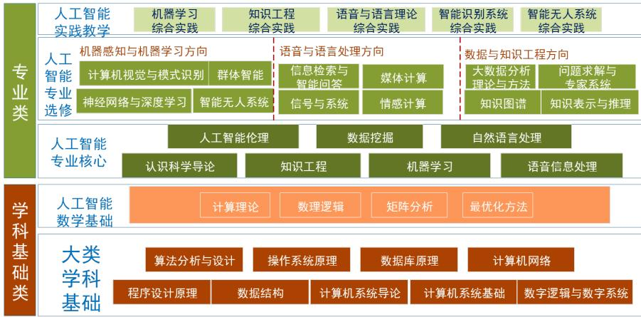

flowchart

```mermaid
graph TD
  A["专业类"] --> B["人工智能实践教学"]
  A --> C["人工智能专业选修"]
  A --> D["人工智能专业核心"]
  A --> E["学科基础类"]

  B --> B1["机器学习综合实践"]
  B --> B2["知识工程综合实践"]
  B --> B3["语音与语言理论综合实践"]
  B --> B4["智能识别系统综合实践"]
  B --> B5["智能无人系统综合实践"]

  C --> C1["机器感知与机器学习方向"]
  C --> C2["计算机视觉与模式识别"]
  C --> C3["群体智能"]
  C --> C4["神经网络与深度学习"]
  C --> C5["智能无人系统"]

  D --> D1["语音与语言处理方向"]
  D --> D2["信息检索与智能问答"]
  D --> D3["信号与系统"]
  D --> D4["媒体计算"]
  D --> D5["情感计算"]

  E --> E1["数据与知识工程方向"]
  E --> E2["大数据分析理论与方法"]
  E --> E3["问题求解与专家系统"]
  E --> E4["知识图谱"]
  E --> E5["知识表示与推理"]

  F["人工智能专业核心"] --> F1["认识科学导论"]
  F --> F2["知识工程"]
  F --> F3["机器学习"]
  F --> F4["语音信息处理"]

  G["人工智能数学基础"] --> G1["计算理论"]
  G --> G2["数理逻辑"]
  G --> G3["矩阵分析"]
  G --> G4["最优化方法"]

  H["大类学科基础"] --> H1["算法分析与设计"]
  H --> H2["操作系统原理"]
  H --> H3["数据库原理"]
  H --> H4["计算机网络"]
  H --> H5["程序设计原理"]
  H --> H6["数据结构"]
  H --> H7["计算机系统导论"]
  H --> H8["计算机系统基础"]
  H --> H9["数字逻辑与数字系统"]
```

人工智能数学基础课程简介

## 人工智能数学基础课程简介

## 任课教师：

杨雅君：计算理论、数理逻辑  
刘志磊：矩阵分析、最优化方法

## 课程目标：

。 掌握的计算理论的基本概念和基本理论  
理解的数理逻辑的系统语义和语法的本质  
具备一定将实际问题形式化的数学能力  
形成对科学问题可计算性进行分析的观念

## 人工智能数学基础课程简介

## 课程成绩组成：

卷面考试成绩：80%  
。 平时成绩：20%

出勤情况：三次点名未到取消考试资格  
日常作业  
课堂表现：酌情加分0.5 ∼ 1分

## 教材

## 《计算理论导引（第3版）》

作者：Michael Sipser  
出版社：机械工业出版社

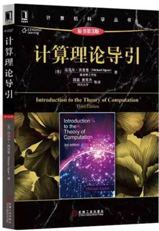

text_image

计算机科学丛书
威廉第3版
计算理论导引
[美] 动克·西斯曼 (Michael Spier) 著
陈德生 译
周晓明 等译
西斯曼 著
Introduction to the Theory of Computation
刘俊波
Introduction
to the
Theory of
Computation
John B. R. M. A. S.
机械工业出版社

## 《面向计算机科学的数理逻辑》

作者：陆钟万  
. 科学出版社

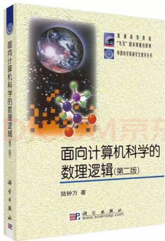

text_image

面向计算机科学的
数理逻辑(第二版)
陆钟万 著
科学出版社
www.science.com

## 参考书

## . 《形式语言与自动机》

作者：陈有祺  
出版社：机械工业出版社  
出版日期：2008  
页数：227

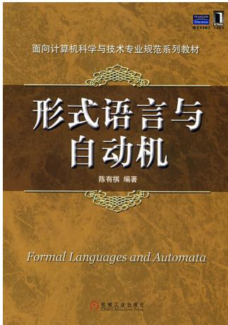

text_image

面向计算机科学与技术专业规范系列教材
形式语言与
自动机
陈有祺 编著
Formal Languages and Automata
机械工业出版社
CHINA MACHINE PRESS

## 参考书

《自动机理论、语言和计算导论》（英文版·第3版）

Automata Theory, Languages and Computation

作者：Hopcroft, Motwani, Ullman  
. 出版社：机械工业出版社 影印  
出版日期：出版2007，影印2008  
页数：535

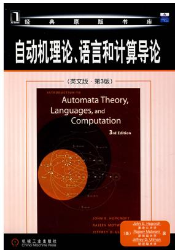

text_image

经典原版书库
自动机理论、语言和计算导论
（英文版：第3版）
INTRODUCTIONS TO AUTOMATA THEORY, LANGUAGES, and COMPUTATION
3rd Edition
JOHN E. HOCOLEDITH
RICHEN MOHOT
JERRENT Z. LI
机械工业出版社
China Machine Press
机械工业出版社
（英文版）著
JOHN E. HOCOLEDITH
RICHEN MOHOT
JERRENT Z. LI
机械工业出版社
（英文版）著
JOHN E. HOCOLEDITH
机械工业出版社
（英文版）著
JOHN E. HOCOLEDITH
机械工业出版社

Computer Science is no more about computers than astronomy is about telescopes.

— Edsger Dijkstra

计算机科学并不只是关于计算机，就像天文学并不只是关于望远镜一样。

— Edsger Dijkstra

在开始课程之前，我们首先思考几个问题！

在开始课程之前，我们首先思考几个问题！

计算机科学到底是不是科学？

在开始课程之前，我们首先思考几个问题！

计算机科学到底是不是科学？  
计算机科学的核心是什么？

## 唐纳德·克努特（Donald Knuth）

text_image

Don Knuth
Barcl 百科

Donald Knuth

## 唐纳德·克努特（Donald Knuth）

text_image

Don Knuth
Barcl 百科

Donald Knuth

1974年图灵奖获得者

## 唐纳德·克努特（Donald Knuth）

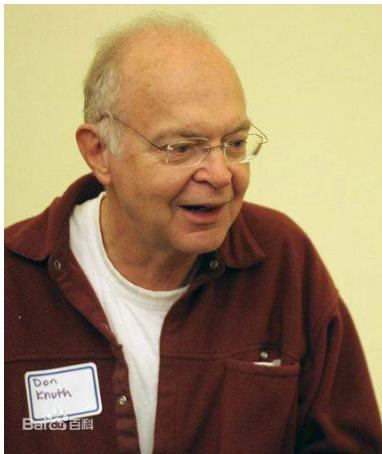

text_image

Don Knuth
Barcl 百科

Donald Knuth

1974年图灵奖获得者  
《计算机程序设计的艺术》

## 唐纳德·克努特（Donald Knuth）

text_image

Don Knuth
Barcl 百科

Donald Knuth

1974年图灵奖获得者  
《计算机程序设计的艺术》  
Tex排版系统之父

## 唐纳德·克努特（Donald Knuth）

text_image

Don Knuth
Barcl 百科

Donald Knuth

1974年图灵奖获得者  
《计算机程序设计的艺术》  
Tex排版系统之父

算法+ 数据结构= 程序！

在开始课程之前，我们首先思考几个问题！

计算机科学到底是不是科学？  
计算机科学的核心是什么？

## 在开始课程之前，我们首先思考几个问题！

计算机科学到底是不是科学？  
计算机科学的核心是什么？  
计算机的能力是否有局限？

## 在开始课程之前，我们首先思考几个问题！

计算机科学到底是不是科学？  
计算机科学的核心是什么？  
计算机的能力是否有局限？  
算法（计算）的本质和数学定义是什么？

## Outline

## 自动机理论, 可计算性和计算复杂性

计算复杂性理论  
。 可计算性理论  
自动机理论

## 数学概念和术语

## 定义, 定理和证明

## 证明的类型

## The Theory of Computation 计算理论

计算机的基本能力和局限性是什么?

## The Theory of Computation 计算理论

## 计算机的基本能力和局限性是什么?

要回答这个问题应追溯到20世纪30年代，当时的数理逻辑学家们首先开始探究什么是计算

## The Theory of Computation 计算理论

## 计算机的基本能力和局限性是什么?

要回答这个问题应追溯到20世纪30年代，当时的数理逻辑学家们首先开始探究什么是计算  
Automata (自动机)  
Computability (可计算性)  
Complexity (复杂度)

## Complexity Theory 计算复杂性理论

## 计算问题

较容易的: e.g., 排序问题  
较困难的: e.g., 时间表问题

## Complexity Theory 计算复杂性理论

## 计算问题

较容易的: e.g., 排序问题  
较困难的: e.g., 时间表问题

## 是什么使得某些问题很难计算，而又使另一些问题容易计算?

。 这是计算复杂性理论的核心问题.  
We don’t know the answer to it. (researched for over 40 years!)  
. 科研工作者发现了一个根据计算难度给问题分类的完美体系（类似元素周期表）

## 计算复杂性理论

当面对一个似乎很难计算的问题时

通过弄清楚问题困难的根源.

可以针对问题做某些改动，使问题变得容易解决.

2 寻求问题的一个并不完美的解.

寻找问题的近似解会相对容易.

3 有些问题仅在最坏情况下是困难的，而在绝大多数情况下是容易的.

一个偶尔运行很慢而通常运行很快的程序是能够满足需要的.

考虑选择其他计算方式

能够加速某些计算任务的随机计算.

## Computability Theory 可计算性理论

## 些看似简单和基本的问题是不能用计算机解决的!

确定一个数学命题的真或假.

可计算理论和计算复杂性理论是密切相关的.

计算复杂性理论的目标

把问题分成容易计算的和难计算的

。 可计算理论的目标

把问题分成可解的和不可解的

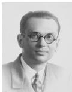

natural_image

Portrait of a man wearing glasses and a suit (no text or symbols visible)

Kurt Gödel (1906–1978)

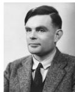

natural_image

Portrait of a man in formal attire (no visible text or symbols)

Alan Turing (1912–1954)

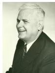

natural_image

Portrait of an older man in a suit, smiling (no text or symbols visible)

Alonzo Church (1903–1995)

## Automata Theory 自动机理论

自动机理论阐述了计算的数学模型的定义和性质!

Models of computation

可计算理论和计算复杂性理论需要对计算机给出一个准确的数学定义.

## Automata Theory 自动机理论

自动机理论阐述了计算的数学模型的定义和性质!

## Models of computation

可计算理论和计算复杂性理论需要对计算机给出一个准确的数学定义.

计算的数学模型

有穷自动机(正则文法)  
下推自动机(上下文无关文法)  
图灵机（现代计算机的数学模型）

## Automata Theory 自动机理论

自动机理论阐述了计算的数学模型的定义和性质!

## Models of computation

可计算理论和计算复杂性理论需要对计算机给出一个准确的数学定义.

计算的数学模型

有穷自动机(正则文法)  
下推自动机(上下文无关文法)  
图灵机（现代计算机的数学模型）

自动机理论帮助我们去理解计算的形式化定义.

## Outline

自动机理论, 可计算性和计算复杂性  
数学概念和术语

集合  
序列和元组  
。 函数和关系  
。 字符串和语言

定义, 定理和证明  
证明的类型

## Sets 集合

集合是将一组对象看成一个整体.

$$
S = \{7, 2 1, 2 5 \}
$$

element 元素 or member 成员: 集合中的对象. $7 \in \{ 7 , 2 1 , 2 5 \}$ 8 $\not \in \{ 7 , 2 1 , 2 5 \}$  
subset 子集: $A \subseteq B$ , proper subset 真子集: $A \subsetneq B$  
natural numbers 自然数集: N , integers 整数集 Z  
empty set 空集: ∅  
o $\{ n \mid n = m ^ { 2 } { \mathrm { ~ f o r ~ } } { \mathsf { s o m e } } \ m \in \mathcal { N } \}$  
union 并集 $A \cup B$ , intersection 交集 $A \cap B$ , complement 补集 A  
power set 幂集： $A = \{ 0 , 1 \} , P ( A ) = \{ \emptyset , \{ 0 \} , \{ 1 \} , \{ 0 , 1 \} \}$ .

## Sequences and Tuples 序列和元组

序列是某些元素元素或成员按某种顺序排成的表.

(7, 21, 57)

序列中的元素的顺序和是否重复很重要

有穷序列也被称为多元组.

k-tuple k-元组: k 个元素的序列. (7, 21, 57) is a 3-tuple.  
ordered pair 有序对: a 2-tuple.  
Cartesian product 笛卡尔积 of A and B:

$$
A \times B = \{(a, b) \mid a \in A \text { and } b \in B \}.
$$

## Functions 函数

函数是一个建立输入-输出关系的对象.

对于每一个函数, 同样的输入总会产生同样的输出.  
函数又称为映射.

$$
f (a) = b
$$

定义域: 函数所有可能的输入组成的集合.  
值域: 函数输出结果的集合.

$$
f: D \to R
$$

映上到这个值域: 如果函数取得值域的所有元素.

## Functions 函数

## 例

Let $\mathcal { Z } _ { m } = \{ 0 , 1 , 2 , \dots , m - 1 \}$ .  
· $g : \mathcal { Z } _ { 4 } \times \mathcal { Z } _ { 4 } \to \mathcal { Z } _ { 4 }$

<table><tr><td>g</td><td>0</td><td>1</td><td>2</td><td>3</td></tr><tr><td>0</td><td>0</td><td>1</td><td>2</td><td>3</td></tr><tr><td>1</td><td>1</td><td>2</td><td>3</td><td>0</td></tr><tr><td>2</td><td>2</td><td>3</td><td>0</td><td>1</td></tr><tr><td>3</td><td>3</td><td>0</td><td>1</td><td>2</td></tr></table>

## Functions 函数

## 例

Let $\mathcal { Z } _ { m } = \{ 0 , 1 , 2 , \dots , m - 1 \}$ .  
· $g : \mathcal { Z } _ { 4 } \times \mathcal { Z } _ { 4 } \to \mathcal { Z } _ { 4 }$

<table><tr><td>g</td><td>0</td><td>1</td><td>2</td><td>3</td></tr><tr><td>0</td><td>0</td><td>1</td><td>2</td><td>3</td></tr><tr><td>1</td><td>1</td><td>2</td><td>3</td><td>0</td></tr><tr><td>2</td><td>2</td><td>3</td><td>0</td><td>1</td></tr><tr><td>3</td><td>3</td><td>0</td><td>1</td><td>2</td></tr></table>

函数g 为模4的加法函数.

## Functions 函数

k 元函数: k 个自变量的函数. k: 函数的元数(arity)  
unary function 一元函数: k = 1.  
binary function 二元函数: k = 2.  
predicate 谓词 or property 性质: 值域为 {TRUE, FALSE} 的函数.

## Relations 关系

定义域为 $A \times \cdots \times A$ 的谓词称为关系，或称为 k 元关系.

binary relation 二元关系: a 2-ary relation.  
设R是一个二元关系, 则命题aRb 表示 $a R b = { \mathsf { T R U E } }$ .

equivalence relation 等价关系: 如果二元关系 R 满足以下三个条件，则被称为等价关系:

1 R 是 自反的, 即对每一个 $x , x R x$  
2 R 是 对称的, 即对每一个x 和 $y , x R y$ 意味着 $y R x$  
3 R 是 传递的, 即对每一个x, y 和 $z , x R y$ 和 $y R z$ 意味着 $x R z$

## Alphabets 字母表

定义字母表(alphabets)为任意一个非空有穷集合.  
字母表的成员为该字母表的符号(symbol).

## 例

· $\Sigma _ { 1 } = \{ 0 , 1 \}$  
Σ2 = {a, b, c, d, e, f, g, h, i, j, k, l, m, n, o, p, q, r, s, t, u, v, w, x, y, z}  
Γ = {0, 1, x, y, z}

# Strings 字符串

字母表上的字符串为该字母表中符号的有穷序列.

## 例

· $\Sigma _ { 1 } = \{ 0 , 1 \} , 0 1 0 0 1$ 为 $\Sigma _ { 1 }$ 上的一个字符串.  
· $\Sigma _ { 2 } = \{ { \tt a } , { \tt b } , { \tt c } , \ldots , { \tt z } \}$ , abracadabra 为 $\Sigma _ { 2 }$ 上的一个字符串.

设w 是Σ 上的一个字符串, w 的长度, 记作 $| w |$ , 等于它所包含的符号数.

empty string 空串: 长度为零的字符串, 记作 ε.

若 $| w | = n$ , 则 $w = a _ { 1 } a _ { 2 } \cdot \cdot \cdot a _ { n }$ , 这里 $a _ { i } \in \Sigma$

w 的反转 $( { \mathsf { r e v e r s e } } )$ : 记作 $w ^ { \mathcal { R } }$ , 为 $w ^ { \mathcal { R } } = a _ { n } a _ { n - 1 } \cdot \cdot \cdot a _ { 1 }$

## Strings 字符串

substring 子串: 如果字符串z 连续地出现在w 中, 则称z 是w 的子串.  
cad 是 abracadabra 的子串.  
字符串 x 和字符串 y 的连接(concatenation), 记作 $x y$

$| x | = m { \mathrm { ~ } } \mathsf { a n d ~ } | y | = n$  
x 和 y 的连接为 $x _ { 1 } \cdot \cdot \cdot x _ { m } y _ { 1 } \cdot \cdot \cdot y _ { n }$  
可采用上标法表示一个字符串自身连接多次, 例如 $x ^ { k }$ 表示

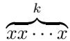

## Languages 语言

。 字符串的字典序(lexicographic order)和大家熟悉的字典序一样.  
字符串顺序(shortlex order or string order), 它在字典序的基础上将短 的字符串排在长的字符串的前面.

字母表 {0, 1} 上所有的字符串顺序为 (ε, 0, 1, 00, 01, 10, 11, 000, . . . )

## Languages 语言

o 字符串的字典序(lexicographic order)和大家熟悉的字典序一样.  
字符串顺序(shortlex order or string order), 它在字典序的基础上将短 的字符串排在长的字符串的前面.  
字母表 {0, 1} 上所有的字符串顺序为 $( \varepsilon , 0 , 1 , 0 0 , 0 1 , 1 0 , 1 1 , 0 0 0 , \dots )$  
字符串 x 是字符串 y 的前缀(prefix), 如果存在字符串 z 满足 $x z = y$  
若 $x \neq y$ , 则 x 是 y 的真前缀(proper prefix), .

## Languages 语言

o 字符串的字典序(lexicographic order)和大家熟悉的字典序一样.  
字符串顺序(shortlex order or string order), 它在字典序的基础上将短 的字符串排在长的字符串的前面.  
字母表 {0, 1} 上所有的字符串顺序为 (ε, 0, 1, 00, 01, 10, 11, 000, . . . )  
字符串 x 是字符串 y 的前缀(prefix), 如果存在字符串 z 满足 $x z = y$  
若 $x \neq y$ , 则 x 是 y 的真前缀(proper prefix), .

字符串的集合称为语言(language).

如果语言中任何一个成员都不是其他成员的真前缀, 那么该语言则是无前缀的 $\left( { \mathsf { p r e f i x } } { \mathsf { x } } { \mathsf { - f r e e } } \right)$ .

## 语言的运算

## 定义 (语言的连接)

设 $L _ { 1 }$ 为字母表 $\Sigma _ { 1 }$ 上的语言， $L _ { 2 }$ 为字母表 $\Sigma _ { 2 }$ 上的语言， $L _ { 1 }$ 和 $L _ { 2 }$ 的连接 $L _ { 1 } L _ { 2 }$ 由下式定义：

$$
L _ {1} L _ {2} = \{x y \mid x \in L _ {1}, y \in L _ {2} \}
$$

例

设 $\Sigma _ { 1 } = \{ a , b \} , \ \Sigma _ { 2 } = \{ 0 , 1 \} , \ L _ { 1 } = \{ a b , b a , b b \} , \ L _ { 2 } = \{ 0 0 , 1 1 \}$ ，则

$$
L _ {1} L _ {2} = \{a b 0 0, a b 1 1, b a 0 0, b a 1 1, b b 0 0, b b 1 1 \}
$$

## 语言的运算

## 定义 (语言的闭包)

语言L的闭包记作L∗，定义如下：

1 $L ^ { 0 } = \{ \varepsilon \}$  
2 对于n ⩾ 1，Ln = LLn−1；  
3 $\textstyle L ^ { * } = \bigcup _ { n \geqslant 0 } L ^ { n }$

语言L的正闭包记作 $L ^ { + }$ ，定义为 $\textstyle L ^ { + } = \bigcup _ { n \geq 1 } L ^ { n }$ 。

## 语言的运算

## 例 (语言的闭包)

设 $\Sigma = \{ 0 , 1 \}$ ， $L = \{ 1 0 , 0 1 \}$ ，则 $L ^ { 0 } = \{ \varepsilon \} , L ^ { 1 } = L = \{ 1 0 , 0 1 \}$

$$
L ^ {2} = L L = \{1 0 1 0, 1 0 0 1, 0 1 1 0, 0 1 0 1 \}, \dots ,
$$

$$
L ^ {*} =
$$

$$
\{\varepsilon , 1 0, 0 1, 1 0 1 0, 1 0 0 1, 0 1 1 0, 0 1 0 1, 1 0 1 0 1 0, 1 0 1 0 0 1, 1 0 0 1 1 0, 1 0 0 1 0 1, \dots \}
$$

## 语言的运算

字母表Σ本身也是Σ上的语言。

$\Sigma ^ { + }$ ：由Σ中的字符组成的全体字符串的集合（不包括ε）  
： $\Sigma ^ { * } = \Sigma ^ { + } \cup \{ \varepsilon \}$

## 例

设 $\Sigma = \{ 0 , 1 \}$ ，则

$$
\Sigma^ {*} = \{\varepsilon , 0, 1, 0 0, 0 1, 1 0, 1 1, 0 0 0, 0 0 1, 0 1 0, 0 1 1, 1 0 0, 1 0 1, 1 1 0, 1 1 1, \dots \}
$$

由0和1组成的一切长度、一切次序的串（包括空串）。

## Outline

自动机理论, 可计算性和计算复杂性  
数学概念和术语  
定义, 定理和证明

。 寻找证明

证明的类型

## Definitions, Theorems, and Proofs 定义、定理和证明

Definitions 定义描述了我们使用的对象和概念.

任何数学定义都必须是精准的.

Mathematical statements 数学命题

命题可能为真, 也可能为假.

证明(proof)是一种逻辑论证, 它使人确信一个命题为真.

在谋杀案审判中要求存在“没有任何疑点”的证据.

数学家需要没有任何疑点的证明.

定理(theorem)是被证明为真的数学命题.

引理(lemmas)

推论(corollaries)

## 寻找证明

要仔细阅读清楚证明的命题.

是否理解命题的所有记号?  
用自己的语言复写命题.  
拆开并且分别考虑每一部分.

## Multipart statements

P if and only if Q or P iff Q or $P \iff Q$

(Both P and Q are mathematical statements.)

P only if Q: If P is true, then Q is true, written $P \Rightarrow Q$  
P if Q: If Q is true, then P is true, written $P \Leftarrow Q$

Two sets A and B are equal.

A is a subset of B or $A \subseteq B$  
B is a subset of A or $B \subseteq A$

## 寻找证明

当要证明一个命题或者它的一部分时, 要尽量找到一种直观感觉.

尝试举一些例子对完成证明很有帮助.  
尝试寻找反例.

看看在什么地方遇到找反例的困难

当找到正确证明的时候, 必须将它严格地书写出来.

一个好的证明是一系列的形式化描述,  
每一条语句都由前面的语句经过简单的推理得到.

要有耐心.  
回头做.  
条例清晰.  
表达简洁.

## Outline

自动机理论, 可计算性和计算复杂性  
数学概念和术语  
定义, 定理和证明  
证明的类型

构造性证明  
. 反证法  
归纳法

## Proof by Construction 构造性证明

## Proof by Construction 构造性证明

许多定理声明存在一种特定类型的对象.  
说明如何构造这样的对象的证明即为构造性证明.

## 定义

我们定义：如果图中每一个顶点的度数都为k, 则称这个图是k 正则的(k-regular).

## 定理

对于每一个大于2的偶数n, 存在一个有n 个顶点的3正则图.

## Proof by Construction 构造性证明

## 定理

对于每一个大于2的偶数n, 存在一个有n 个顶点的3正则图.

## Proof.

设n 是大于2 的整数.  
构造有 n 个顶点的图 $G = ( V , E )$ .  
G 的顶点集为 $V = \{ 0 , 1 , \ldots , n - 1 \}$ ,  
G 的边集为

$$
E = \{(i, i + 1) \mid \text {   for   } 0 \leq i \leq n - 2 \} \cup \{(n - 1, 0) \}
$$

$$
\cup \left\{\left(i, i + n / 2\right) \mid \text { for } 0 \leq i \leq n / 2 - 1 \right\}
$$

## Proof by Contradiction 反证法

Proof by Contradiction 反证法

假设定理为假.  
然后证明这个假设会导致一个明显的错误结论.

## 定理

$\sqrt { 2 }$ 是无理数.

## Proof.

假设 $\sqrt { 2 }$ 是有理数, 则 ${ \sqrt { 2 } } = { \frac { m } { n } }$  
此处m和n 是整数. 如果m和n 都能被同一个大于1 的最大整数除尽, 则用那个整数除它们.  
不会改变分式的值.

# Proof by Contradiction 反证法

## 定理

$\sqrt { 2 }$ 是无理数.

## Proof.

假设 $\sqrt { 2 }$ 是有理数, 则 ${ \sqrt { 2 } } = { \frac { m } { n } }$ .  
此处m和n 是整数. 如果m和n 都能被同一个大于1 的最大整数除尽, 则用那个整数除它们.  
不会改变分式的值.  
此时可证, m和n 均为偶数.  
$n { \sqrt { 2 } } = m \Rightarrow 2 n ^ { 2 } = m ^ { 2 } \Rightarrow m ^ { 2 }$ 是偶数. $\Rightarrow m$ 是偶数.  
对某个整数 $k , m = 2 k , \Rightarrow 2 n ^ { 2 } = 4 k ^ { 2 } \Rightarrow n ^ { 2 } = 2 k ^ { 2 } \Rightarrow n$ 是偶数.

## Proof by Induction 归纳法

## Proof by Induction 归纳法

归纳法是证明无穷集合的所有元素具有某种特定性质的高级方法.  
归纳基础(Basis): 证明 $\mathcal { P } ( 1 )$ 为真.  
。 归纳步骤(Induction step): 对于每一个 $i \geq 1$ , 假设 $\mathcal { P } ( i )$ 为真, 并且利用这个假设去进一步证明 $\mathcal { P } ( i + 1 )$ 为真.

$\mathcal { P } ( i )$ 为真被称为 归纳假设(induction hypothesis).  
一种更强的归纳假设: 对于每一个 $j \leq i , \mathcal { P } ( j )$ ) 为真.  
当要证明 $\mathcal { P } ( i + 1 )$ )为真时, 我们已经证明对于每一个 $j \leq i , \mathcal { P } ( j )$ 为真.

## Proof by Induction 归纳法

natural_image

3D rendering of dominoes arranged in a curved path on a wooden floor (no text or symbols)

## 数学归纳法：结构归纳法

证明与结构有关的命题，多数是递归定义的

## 定义

(1) 任意数字或字母都是表达式；  
(2) 如果 E 或 F 是表达式，则 $E + F , E * F$ 和 (E) 也都是表达式；  
(3) 表达式只能通过(1)、(2)两条给出。

## 数学归纳法：结构归纳法

证明与结构有关的命题，多数是递归定义的

## 定义

(1) 任意数字或字母都是表达式；  
(2) 如果 E 或 F 是表达式，则 $E + F , E * F$ 和 (E) 也都是表达式；  
(3) 表达式只能通过(1)、(2)两条给出。

## 递归定义

(1)是递归基础，必须有的  
。 (2)是归纳，产生无穷多个表达式  
(3)是排他，表达式不能再有其他形式

## 数学归纳法：结构归纳法

证明与结构有关的命题，多数是递归定义的

## 定义

(1) 任意数字或字母都是表达式；  
(2) 如果 E 或 F 是表达式，则 $E + F , E * F$ 和 (E) 也都是表达式；  
(3) 表达式只能通过(1)、(2)两条给出。

## 递归定义

(1)是递归基础，必须有的  
。 (2)是归纳，产生无穷多个表达式  
(3)是排他，表达式不能再有其他形式

根据(1)： $2 , 3 , 6 , 8 , x , y , z$ 等是表达式；根据(2)： $x + 3 , y * 6 , 8 * ( 2 + x )$ 等也都是表达式。

## 数学归纳法：结构归纳法

## 定理

由前面定义的每个表达式中，左括号的个数一定等于右括号的个数。

## 数学归纳法：结构归纳法

## Proof.

归纳基础：按照(1)，表达式只包含单个数字或字母，没有括号，左括号和右括号个数均为0，当然相等。

## 数学归纳法：结构归纳法

## Proof.

归纳基础：按照(1)，表达式只包含单个数字或字母，没有括号，左括号和右括号个数均为0，当然相等。

归纳步骤：设表达式B 是通过(2) 构造出来的，有3 种构造方法：

(1) $B = E + F _ { \mathrm { { i } } }$ ； (2) $B = E * F$ ； (3) $B = ( E )$ 。

设表达式 $E ,$ 、 $F$ 包含的左、右括号数目相等，

且设 $E$ 中有 $m$ 个左、右括号， $F$ 中有n 个左、右括号。

## 数学归纳法：结构归纳法

## Proof.

归纳基础：按照(1)，表达式只包含单个数字或字母，没有括号，左括号和右括号个数均为0，当然相等。

归纳步骤：设表达式B 是通过(2) 构造出来的，有3 种构造方法：

$$
(1) B = E + F; \quad (2) B = E * F; \quad (3) B = (E) 。
$$

设表达式E、F 包含的左、右括号数目相等，

且设E 中有m个左、右括号，F 中有n 个左、右括号。

在 $B = E + F$ 和 $B = E * F$ 时，B 中左、右括号数均等于 $m + n ;$

在 $B = ( E )$ 时，B 中左、右括号数等于 $m + 1 \mathrm { { e } }$

在3 种情况下，构造出的新表达式B 所包含的左、右括号数目仍然相等。

## Conclusion

自动机理论, 可计算性理论和计算复杂性理论  
数学概念与术语

集合  
序列和元组  
函数与关系  
字符串与语言

## Conclusion

自动机理论, 可计算性理论和计算复杂性理论  
数学概念与术语

集合  
序列和元组  
函数与关系  
字符串与语言

定义, 定理和证明  
证明的类型

构造性证明  
反证法  
归纳法