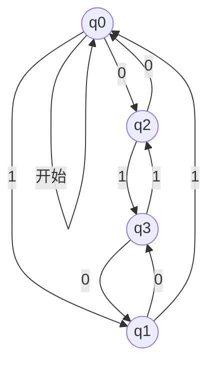
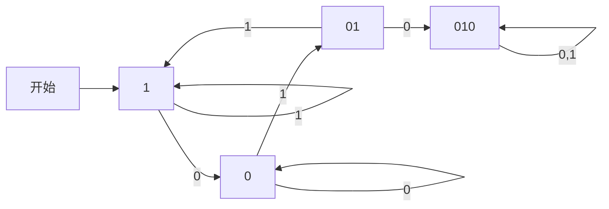
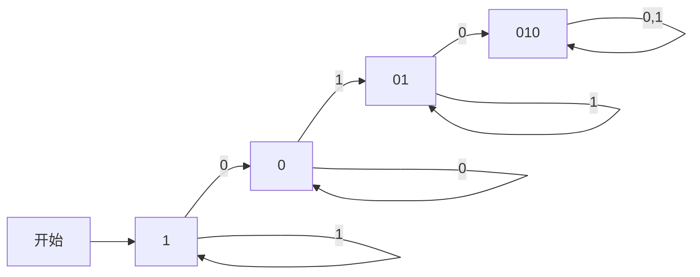
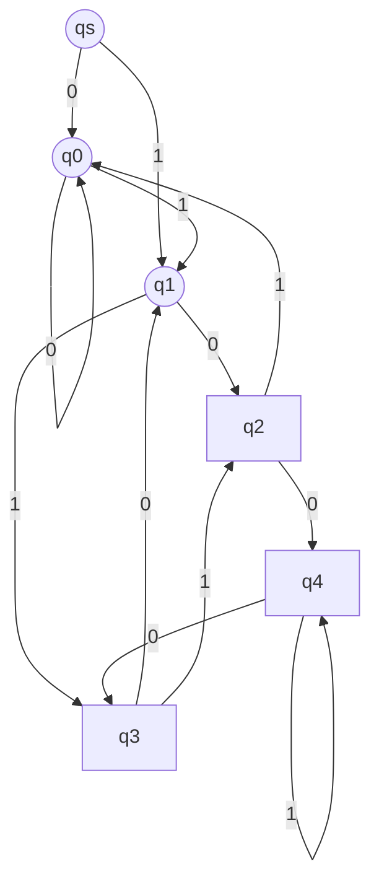

# 第1章 有穷自动机

## 内容提要

非形式化描述  
有穷自动机的定义  
有穷自动机接受的语言

---

## 非形式化描述

### 有穷多个状态

指针式钟表：$12 \times 60 \times 60 = 43200$ 个状态

一局围棋：$3^{361}$ 个状态

电梯的控制结构：每层一个状态

状态转移：当前状态 + 输入信号 $\to$ 下一状态

### 有穷状态系统四要素

1. 有穷多个状态  
2. 输入信号  
3. 状态转移  
4. 初始状态

---

## 有穷自动机的定义

### 定义 3.1 (FA五元组)

一个有穷自动机（Finite Automata，简称 FA）是一个五元组

$$
M = (Q, \Sigma, \delta, q_0, F)
$$

其中：

1. $Q$ 是有穷状态集  
2. $\Sigma$ 是有穷的输入字母表  
3. $\delta$ 是转移函数，即映射 $\delta : Q \times \Sigma \to Q$  
4. $q_0 \in Q$ 是初始状态  
5. $F \subseteq Q$ 是接受状态集

### 例 3.1

有穷自动机的一个实例

$$
M = (\{q_0, q_1, q_2, q_3\}, \{0, 1\}, \delta, q_0, \{q_0\})
$$

其中，转移函数 $\delta$ 定义如下：

$$
\begin{array}{l}
\delta(q_0, 0) = q_2, \quad \delta(q_0, 1) = q_1 \\
\delta(q_1, 0) = q_3, \quad \delta(q_1, 1) = q_0 \\
\delta(q_2, 0) = q_0, \quad \delta(q_2, 1) = q_3 \\
\delta(q_3, 0) = q_1, \quad \delta(q_3, 1) = q_2
\end{array}
$$

最关键的部分：转移函数

转移图表达了五元组的全部信息

### 定义 3.2 (扩充转移函数)

对于有穷自动机 $M = (Q, \Sigma, \delta, q_0, F)$

扩充转移函数 $\hat{\delta}$ 为映射 $\hat{\delta} : Q \times \Sigma^* \to Q$

具体定义如下：

1. $\hat{\delta}(q, \varepsilon) = q$  
2. $\hat{\delta}(q, aw) = \hat{\delta}(\delta(q, a), w)$

其中，$q \in Q,\ a \in \Sigma,\ w \in \Sigma^*$

（递归定义：将原来 $\delta$ 中的第二个变元由一个字符扩充为一个字符串）

从 $\delta$ 到 $\hat{\delta}$ 的扩充很自然：$\delta$ 就是 $\hat{\delta}$ 的特例（当 $|x| = 1$ 时）  
今后不再强调 $\hat{\delta}$，而一律用 $\delta$ 表示

### 例（扩充转移函数的计算）

对于例3.1的 FA，计算 $\hat{\delta}(q_0, 010)$：

$$
\begin{array}{l}
\hat{\delta}(q_0, 010) = \hat{\delta}(\delta(q_0, 0), 10) \\
= \hat{\delta}(q_2, 10) \\
= \hat{\delta}(\delta(q_2, 1), 0) \\
= \hat{\delta}(q_3, 0) \\
= \hat{\delta}(\delta(q_3, 0), \varepsilon) \\
= \hat{\delta}(q_1, \varepsilon) \\
= q_1
\end{array}
$$

$\hat{\delta}(q, x)$ 的值：从状态 $q$ 出发，用基本转移函数 $\delta$ 每越过 $x$ 的一个符号后改变一次状态，直到越过 $x$ 的最后一个符号所得到的状态

---

## 有穷自动机接受的语言

### 定义 3.3

给出 FA $M = (Q, \Sigma, \delta, q_0, F)$

$$
\text{若 } \delta(q_0, x) = p \in F \quad (x \in \Sigma^*)
$$

则称字符串 $x$ 被 $M$ 接受

被 $M$ 接受的全部字符串的集合，称为 $M$ 接受的语言，记作 $L(M)$

$$
L(M) = \{x \mid \delta(q_0, x) \in F\}
$$

### 例 3.1（续）- 分析 FA 接受的语言

例3.1中 FA 接受什么样的语言？

分析：4个状态起什么作用？

- $q_0$：已读过偶数个0，偶数个1  
- $q_1$：已读过偶数个0，奇数个1  
- $q_2$：已读过奇数个0，偶数个1  
- $q_3$：已读过奇数个0，奇数个1

$$
L(M) = \{\text{一切含有偶数个0和偶数个1的字符串}\}
$$

给出 FA，指明它所接受的语言：$\text{FA} \Rightarrow \text{语言}$  
给出语言，构造接受它的 FA：$\text{语言} \Rightarrow \text{FA}$

### 例 3.2 - 构造 FA（子串010）

给出两个集合：

$$
L_1 = \{x \mid x \in \{0, 1\}^*,\ \text{且 } x \text{ 中至少包含一个子串 } 010\}
$$

$$
L_2 = \{x \mid x \in \{0, 1\}^*,\ \text{且 } x \text{ 中不能出现子串 } 010\}
$$

要求构造两个 FA $M_1$ 和 $M_2$，分别接受 $L_1$ 和 $L_2$

**分析 $L_1$：**

从左向右扫描输入串，从 $M_1$ 的初始状态出发：

- 遇到1：暂时和要辨认的串无关，可仍保留在原状态，继续读下一个符号；
- 遇到0：要引起注意了，可能是子串010的开头，必须改变一个状态以应对这种情况，这个状态记为"0"状态；
- 在"0"状态读过1，进一步引起注意，连续读过0、1的情况更接近于子串010，用状态"01"表示；
- 在"01"状态再遇到0，已经出现子串010，该输入串被接受，用状态"010"表示接受状态；
- 此后，再遇到任何符号（0或1），都仍然进入该接受状态。

"0"状态遇0，保持在"0"状态；  
"01"状态遇1，"半途而废，从头再来"，返回"1"状态。

若输入串中含有子串010，则一定能到达接受状态；  
若输入串中不含子串010，则一定不能到达接受状态。

$$
\therefore L(M_1) = L_1
$$

**FA $M_2$ 接受 $L_2$：**

### 例 3.3 - 构造 FA（二进制数整除5）

构造一个 FA $M$，它接受的语言为：

$$
L = \{x \mid x \in \{0, 1\}^+,\ \text{且把 } x \text{ 看成二进制数时，} x \text{ 模5余0}\}
$$

（即 $x$ 为二进制数，能被5整除）

**提示：** 当二进制数 $x$ 的位数向右不断增加时，其值的增加有规律：

- 二进制 $x0$，十进制 $2x$  
- 二进制 $x1$，十进制 $2x + 1$

模5余数在读取下一个二进制位时按如下规则转移：

| 当前余数 | $2x$ 模5 | $2x+1$ 模5 | 读0到状态 | 读1到状态 |
|:--------:|:--------:|:----------:|:---------:|:---------:|
| 0        | 0        | 1          | q0        | q1        |
| 1        | 2        | 3          | q2        | q3        |
| 2        | 4        | 0          | q4        | q0        |
| 3        | 1        | 2          | q1        | q2        |
| 4        | 3        | 4          | q3        | q4        |

（$q_s$ 为起始辅助状态，读入第一位后进入对应余数状态；$q_0$ 为接受状态）

---

## 小结

**有穷自动机的定义**

- 五元组：$M = (Q, \Sigma, \delta, q_0, F)$
- 转移图
- 扩充转移函数：$\hat{\delta}$

**有穷自动机接受的语言**

- 接受状态集 $F$ 的作用
- $L(M) = \{x \mid \delta(q_0, x) \in F\}$
- $\text{FA} \Leftrightarrow \text{语言}$
