# 人工智能数学基础

## 预备知识 有穷自动机

text_image

TSINGHUA UNIVERSITY (PEIYANG UNIVERSITY)
1895
天津大學

杨雅君

yjyang@tju.edu.cn

天津大学 智能与计算学部

2024

## 内容提要

非形式化描述  
有穷自动机的定义  
有穷自动机接受的语言

## 有穷多个状态

指针式钟表

12 × 60 × 60 = 43200个状态

text_image

LA CROSSE
TECHNOLOGY
RADIO CONTROLLED

## 非形式化描述

有穷多个状态、

. 一局围棋

3361个状态

有穷多个状态、初始状态

. 一局围棋

3361个状态

有穷多个状态、输入信号、状态转移、初始状态

电梯的控制结构  
每层一个状态

natural_image

Illustration of two elevator systems with yellow and red panels, no visible text or symbols

状态转移：当前状态+ 输入信号 −→ 下一状态

## 小结：有穷状态系统四要素

1 有穷多个状态  
2 输入信号  
3 状态转移  
4 初始状态

## 内容提要

非形式化描述  
有穷自动机的定义  
有穷自动机接受的语言

## 定义 3.1

一个有穷自动机（Finite Automata，简称FA ）是一个五元组

$$
M = (Q, \Sigma , \delta , q _ {0}, F)
$$

其中：

1 Q 是有穷状态集  
2 Σ 是有穷的 输入字母表  
3 δ 是转移函数，即映射 $\delta : Q \times \Sigma  Q$  
4 $q _ { 0 } \in Q$ 是 初始状态  
5 $F \subseteq Q$ 是接受状态集

## 例 3.1

有穷自动机的一个实例

$$
M = (\{q _ {0}, q _ {1}, q _ {2}, q _ {3} \}, \{0, 1 \}, \delta , q _ {0}, \{q _ {0} \})
$$

其中，转移函数δ 定义如下：

$$
\begin{array}{l} \delta (q _ {0}, 0) = q _ {2}, \quad \delta (q _ {0}, 1) = q _ {1} \\ \delta (q _ {1}, 0) = q _ {3}, \quad \delta (q _ {1}, 1) = q _ {0} \\ \delta (q _ {2}, 0) = q _ {0}, \quad \delta (q _ {2}, 1) = q _ {3} \\ \delta (q _ {3}, 0) = q _ {1}, \quad \delta (q _ {3}, 1) = q _ {2} \\ \end{array}
$$

最关键的部分：转移函数

例 3.1  
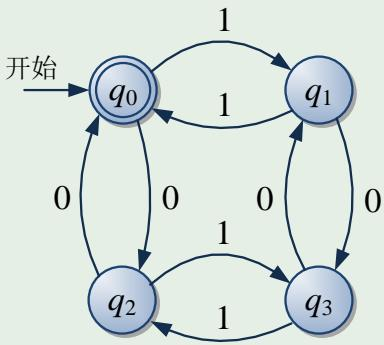

flowchart

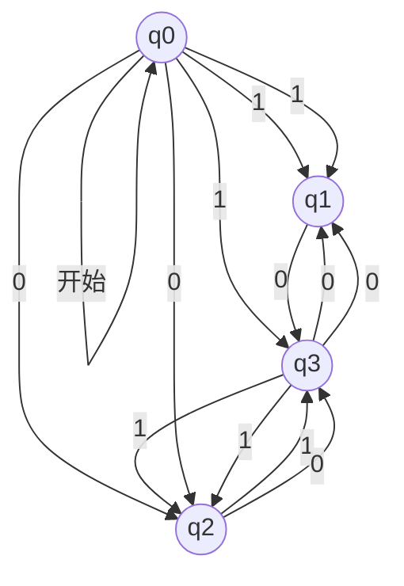
```mermaid
graph TD
  q0((q0)) -->|1| q1((q1))
  q0 -->|0| q2((q2))
  q0 -->|1| q3((q3))
  q1 -->|0| q3
  q2 -->|1| q3
  q3 -->|0| q1
  q3 -->|1| q2
  q0 -->|0| q2
  q0 -->|1| q1
  q2 -->|0| q3
  q3 -->|1| q2
  q3 -->|0| q1
  q0 -->|开始| q0
```

转移图表达了五元组的全部信息

## 定义 3.2

对于有穷自动机 $M = ( Q , \varSigma , \delta , q _ { 0 } , F )$

扩充转移函数 $\hat { \delta }$ 为映射 $\hat { \delta } : Q \times \Sigma ^ { * } {  Q }$

具体定义如下：

1 $\hat { \delta } ( q , \varepsilon ) = q$  
2 ˆδ(q, aw) = ˆδ(δ(q, a), w)

其中， $q \in Q , a \in \Sigma , w \in \Sigma ^ { * }$

递归定义

将原来 δ 中的第二个变元由一个字符扩充为一个字符串

$\hat { \delta } ( q , \varepsilon ) = q$

$\hat { \delta } ( q , a w ) = \hat { \delta } ( \delta ( q , a ) , w )$

## 例

对于例3.1的FA，

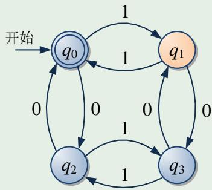

flowchart

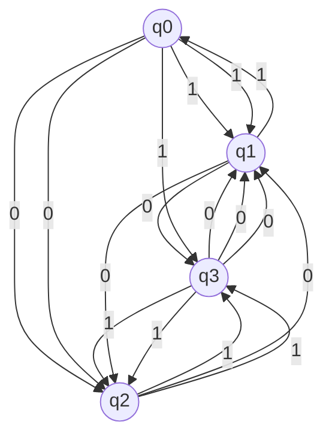
```mermaid
graph TD
  q0((q0)) -->|1| q1((q1))
  q0 -->|0| q2((q2))
  q1 -->|0| q3((q3))
  q2 -->|1| q3
  q3 -->|0| q1
  q0 -->|0| q2
  q0 -->|1| q1
  q1 -->|1| q0
  q2 -->|0| q1
  q3 -->|1| q2
  q3 -->|0| q1
  q0 -->|1| q3
  q1 -->|0| q2
  q2 -->|1| q3
  q3 -->|0| q1
  q3 -->|1| q2
```

计算

$$
\begin{array}{l} \hat {\delta} (q _ {0}, 0 1 0) = \hat {\delta} (\delta (q _ {0}, 0), 1 0) \\ = \hat {\delta} (q _ {2}, 1 0) \\ = \hat {\delta} (\delta (q _ {2}, 1), 0) \\ = \hat {\delta} (q _ {3}, 0) \\ = \hat {\delta} (\delta (q _ {3}, 0), \varepsilon) \\ = \hat {\delta} (q _ {1}, \varepsilon) \\ = q _ {1} \\ \end{array}
$$

ˆδ(q, x) 的值：

. 从状态q 出发，用基本转移函数 δ  
每越过x 的一个符号后，改变一次状态  
直到越过x 的最后一个符号所得到的状态

从δ 到 $\hat { \delta }$ 的扩充很自然

δ 就是 $\hat { \delta }$ 的特例（当 $| x | = 1$ 时）  
今后不再强调 $\hat { \delta }$ ，而一律用 δ 表示

例

$$
\delta (q _ {0}, 0) = q _ {2}
$$

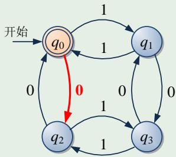

flowchart

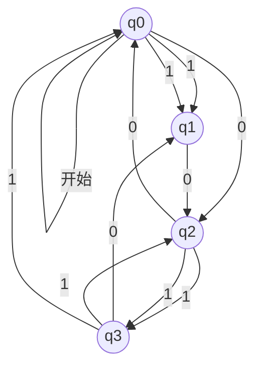
```mermaid
graph TD
  q0((q0)) -->|1| q1((q1))
  q0 -->|0| q2((q2))
  q2 -->|1| q3((q3))
  q3 -->|0| q1
  q3 -->|1| q2
  q2 -->|0| q0
  q0 -->|1| q1
  q1 -->|0| q2
  q2 -->|1| q3
  q3 -->|1| q0
  q0 -->|开始| q0
```

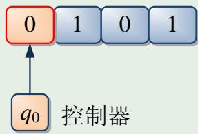

flowchart

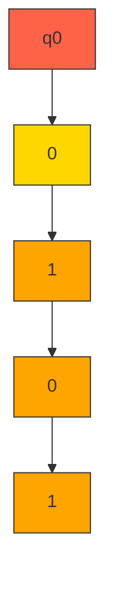
```mermaid
graph TD
  A["0"] --> B["1"]
  B --> C["0"]
  C --> D["1"]
  E["q0"] --> A
    style A fill:#FFD700,stroke:#333
    style B fill:#FFA500,stroke:#333
    style C fill:#FFA500,stroke:#333
    style D fill:#FFA500,stroke:#333
    style E fill:#FF6347,stroke:#333
```

输入带

例

$$
\delta (q _ {2}, 1) = q _ {3}
$$

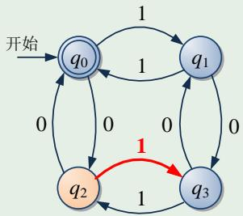

flowchart

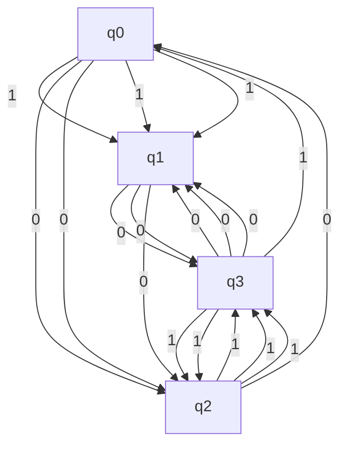
```mermaid
graph TD
  q0 -->|1| q1
  q0 -->|0| q2
  q1 -->|0| q3
  q2 -->|1| q3
  q3 -->|0| q1
  q3 -->|1| q0
  q0 -->|0| q2
  q2 -->|0| q0
  q0 -->|1| q1
  q1 -->|0| q3
  q2 -->|1| q3
  q3 -->|0| q1
  q3 -->|1| q2
  q0 -->|1| q1
  q1 -->|0| q2
  q2 -->|1| q3
  q3 -->|0| q1
  q3 -->|1| q2
```

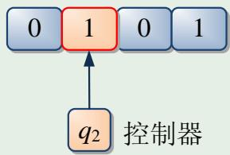

flowchart

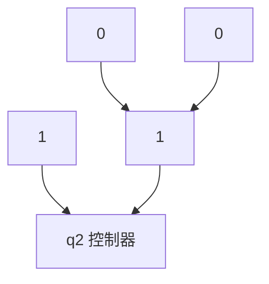
```mermaid
graph TD
  A["0"] --> B["1"]
  C["0"] --> B
  D["1"] --> E["q2 控制器"]
  B --> E
```

输入带

例

$$
\delta (q _ {3}, 0) = q _ {1}
$$

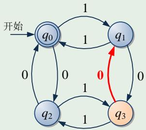

flowchart

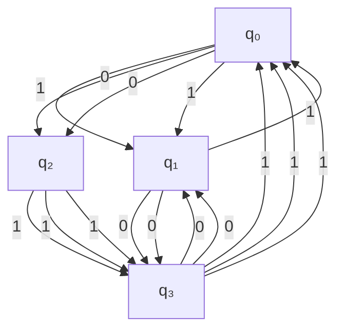
```mermaid
graph TD
  q0[" q₀ "] -->|1| q1[" q₁ "]
  q0 -->|0| q2[" q₂ "]
  q1 -->|0| q3[" q₃ "]
  q2 -->|1| q3
  q3 -->|0| q1
  q3 -->|1| q0
  q0 -->|0| q2
  q1 -->|1| q0
  q2 -->|1| q3
  q3 -->|1| q0
  q3 -->|0| q1
  q0 -->|1| q1
  q1 -->|0| q3
  q2 -->|1| q3
  q3 -->|1| q0
```

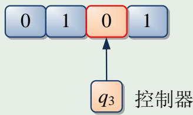

flowchart

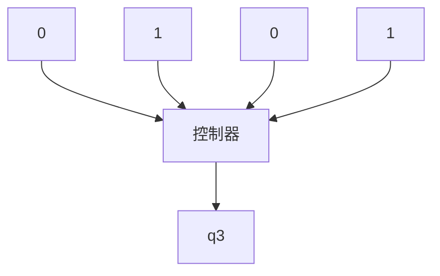
```mermaid
graph TD
  A["0"] --> C["控制器"]
  B["1"] --> C
  D["0"] --> C
  E["1"] --> C
  C --> F["q3"]
```

输入带

例

$$
\delta (q _ {1}, 1) = q _ {0}
$$

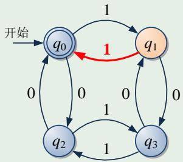

flowchart

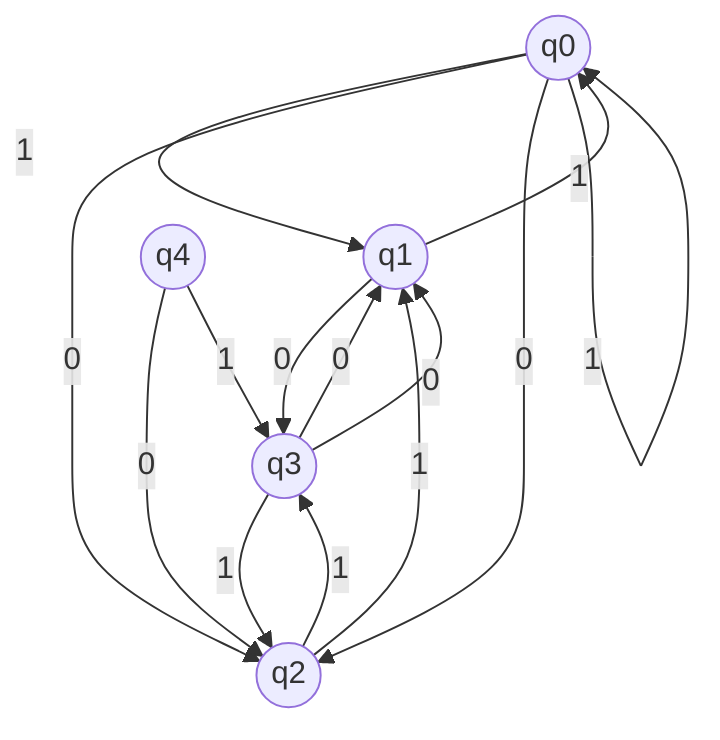
```mermaid
graph TD
  q0((q0)) -->|1| q1((q1))
  q0 -->|0| q2((q2))
  q1 -->|0| q3((q3))
  q2 -->|1| q3
  q3 -->|0| q1
  q0 -->|0| q2
  q0 -->|1| q0
  q1 -->|1| q0
  q2 -->|1| q1
  q3 -->|1| q2
  q3 -->|0| q1
  q4((q4)) -->|0| q2
  q4 -->|1| q3
```

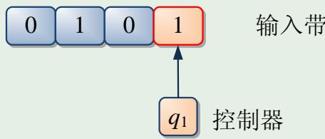

flowchart

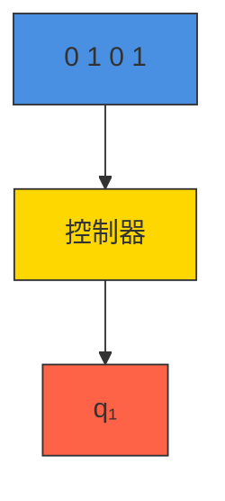
```mermaid
graph TD
  A["0 1 0 1"] --> B["控制器"]
  B --> C["q₁"]
    style A fill:#4A90E2,stroke:#333
    style B fill:#FFD700,stroke:#333
    style C fill:#FF6347,stroke:#333
```

例

$$
\delta (q _ {0}, 0 1 0 1) = q _ {0}
$$

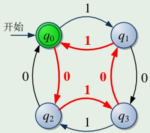

flowchart

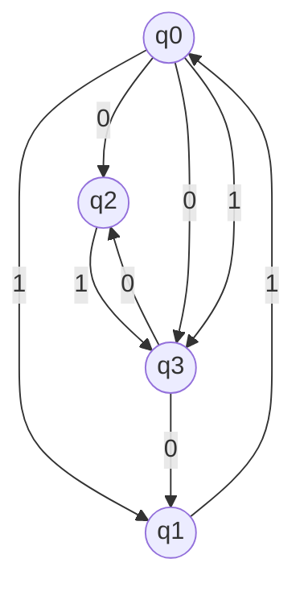
```mermaid
graph TD
  q0((q0)) -->|1| q1((q1))
  q0 -->|0| q2((q2))
  q0 -->|0| q3((q3))
  q1 -->|1| q0
  q2 -->|1| q3
  q3 -->|0| q1
  q3 -->|0| q2
  q0 -->|1| q3
```

text_image

0 1 0 1
输入带
q₀ 控制器

例

$$
\delta (q _ {0}, 0 1 0 1) = q _ {0}
$$

flowchart

```mermaid
graph TD
  q0((q0)) -->|1| q1((q1))
  q0 -->|0| q2((q2))
  q0 -->|0| q3((q3))
  q1 -->|1| q0
  q2 -->|1| q3
  q3 -->|0| q1
  q3 -->|0| q2
  q0 -->|1| q3
```

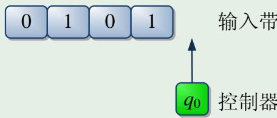

text_image

0 1 0 1
输入带
q₀ 控制器

输入串 和FA 是什么关系？

例

$$
\delta (q _ {0}, 0 1 0 1) = q _ {0}
$$

flowchart

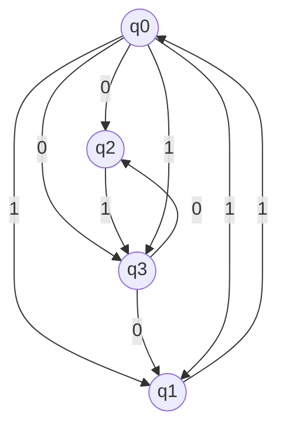
```mermaid
graph TD
  q0((q0)) -->|1| q1((q1))
  q0 -->|0| q2((q2))
  q0 -->|0| q3((q3))
  q1 -->|1| q0
  q2 -->|1| q3
  q3 -->|0| q1
  q3 -->|0| q2
  q0 -->|1| q1
  q0 -->|1| q3
```

text_image

0 1 0 1
输入带
q₀ 控制器

输入串 和FA 是什么关系？接受状态集F 所起的作用

## 内容提要

非形式化描述  
有穷自动机的定义  
有穷自动机接受的语言

## 定义 3.3

给出FA $M = ( Q , \varSigma , \delta , q _ { 0 } , F )$

$$
\text {若} \delta (q _ {0}, x) = p \in F (x \in \Sigma^ {*})
$$

则称字符串 x 被M 接受

被 M 接受的全部字符串的集合，称为 M 接受的语言，记作 $L ( M )$

$$
L (M) = \{x \mid \delta (q _ {0}, x) \in F \}
$$

。 刻画了FA和语言的关系

## 例

例3.1中FA

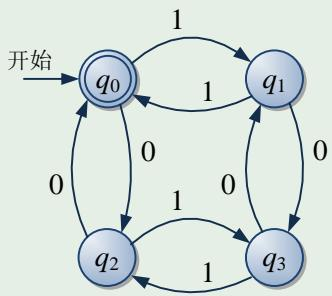

flowchart

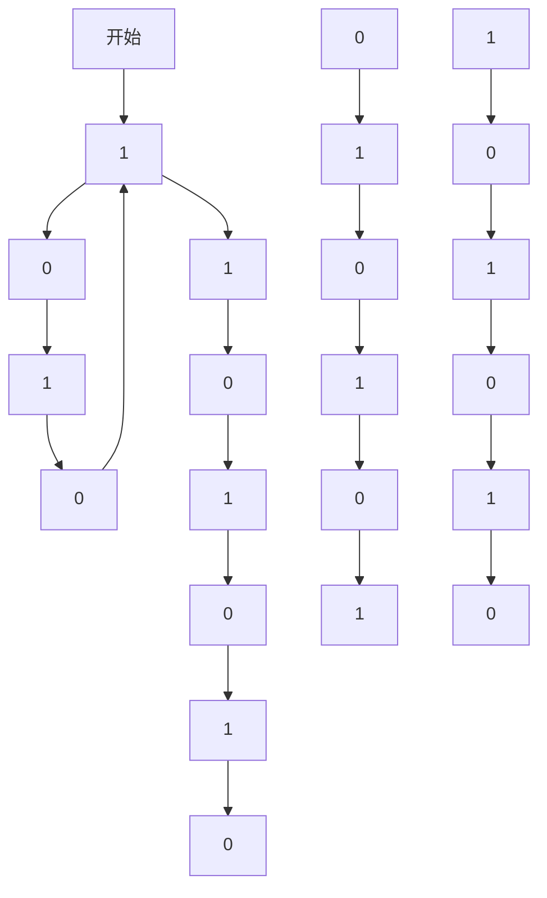
```mermaid
graph TD
  q0["开始"] --> q0_1["1"]
  q0_1 --> q0_2["0"]
  q0_2 --> q0_3["1"]
  q0_3 --> q0_4["0"]
  q0_4 --> q0_1
  q0_1 --> q1["1"]
  q1 --> q1_1["0"]
  q1_1 --> q1_2["1"]
  q1_2 --> q1_3["0"]
  q1_3 --> q1_4["1"]
  q1_4 --> q1_5["0"]
  q2["0"] --> q2_1["1"]
  q2_1 --> q2_2["0"]
  q2_2 --> q2_3["1"]
  q2_3 --> q2_4["0"]
  q2_4 --> q2_5["1"]
  q3["1"] --> q3_1["0"]
  q3_1 --> q3_2["1"]
  q3_2 --> q3_3["0"]
  q3_3 --> q3_4["1"]
  q3_4 --> q3_5["0"]
```

接受什么样的语言？

## 例

例3.1中FA

flowchart

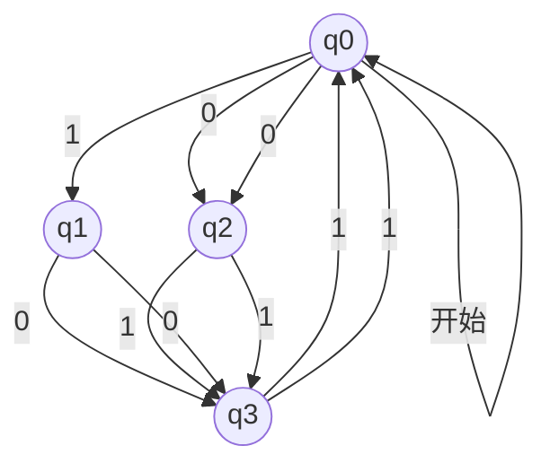
```mermaid
graph TD
  q0((q0)) -->|1| q1((q1))
  q0 -->|0| q2((q2))
  q1 -->|0| q3((q3))
  q2 -->|1| q3
  q3 -->|1| q0
  q0 -->|0| q2
  q1 -->|0| q3
  q2 -->|1| q3
  q3 -->|1| q0
  q0 -->|开始| q0
```

接受什么样的语言？

分析：4个状态起什么作用？

## 例

例3.1中FA

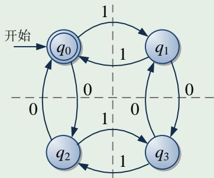

flowchart

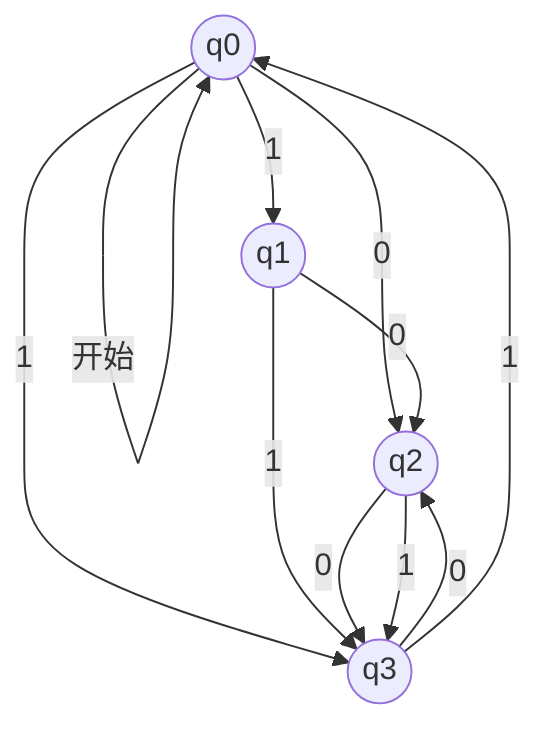
```mermaid
graph TD
  q0((q0)) -->|1| q1((q1))
  q0 -->|0| q2((q2))
  q0 -->|1| q3((q3))
  q1 -->|0| q2
  q1 -->|1| q3
  q2 -->|0| q3
  q2 -->|1| q3
  q3 -->|0| q2
  q3 -->|1| q0
  q0 -->|开始| q0
```

接受什么样的语言？

分析：4个状态起什么作用？

## 例

例3.1中FA

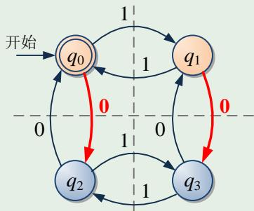

flowchart

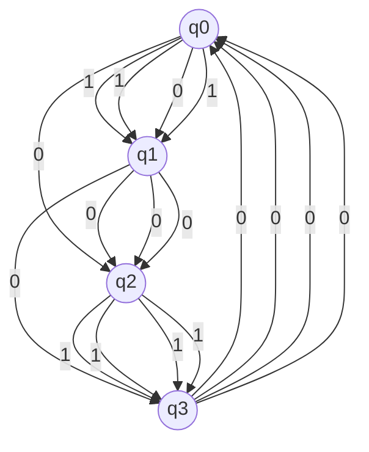
```mermaid
graph TD
  q0((q0)) -->|1| q1((q1))
  q0 -->|0| q2((q2))
  q1 -->|0| q3((q3))
  q2 -->|1| q3
  q3 -->|0| q0
  q0 -->|1| q1
  q1 -->|0| q2
  q2 -->|1| q3
  q3 -->|0| q0
  q0 -->|0| q1
  q1 -->|0| q2
  q2 -->|1| q3
  q3 -->|0| q0
  q0 -->|1| q1
  q1 -->|0| q2
  q2 -->|1| q3
  q3 -->|0| q0
```

接受什么样的语言？

分析：4个状态起什么作用？

## 例

例3.1中FA

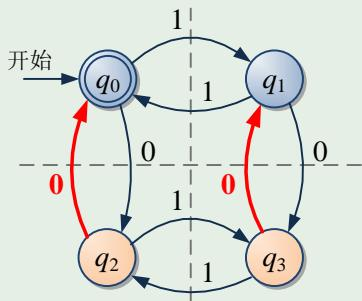

flowchart

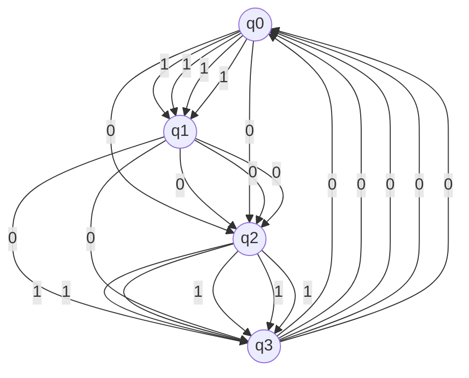
```mermaid
graph TD
  q0((q0)) -->|1| q1((q1))
  q0 -->|0| q2((q2))
  q1 -->|0| q3((q3))
  q2 -->|1| q3
  q3 -->|0| q0
  q0 -->|1| q1
  q1 -->|0| q2
  q2 -->|1| q3
  q3 -->|0| q0
  q0 -->|0| q2
  q1 -->|0| q3
  q2 -->|1| q3
  q3 -->|0| q0
  q0 -->|1| q1
  q1 -->|0| q2
  q2 -->|1| q3
  q3 -->|0| q0
  q0 -->|1| q1
  q1 -->|0| q2
  q2 -->|1| q3
  q3 -->|0| q0
```

接受什么样的语言？

分析：4个状态起什么作用？

## 例

例3.1中FA

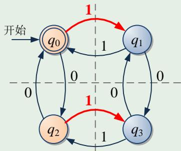

flowchart

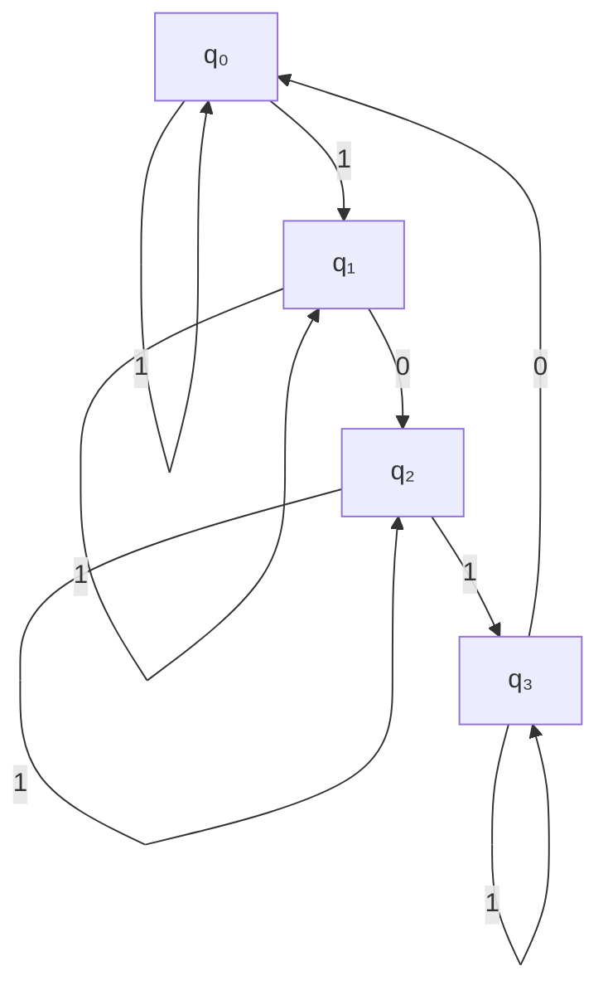
```mermaid
graph TD
  q0[" q₀ "] -->|1| q1[" q₁ "]
  q1 -->|0| q2[" q₂ "]
  q2 -->|1| q3[" q₃ "]
  q3 -->|0| q0
  q0 -->|0| q0
  q1 -->|0| q1
  q2 -->|1| q2
  q3 -->|1| q3
  q0 -->|1| q0
  q1 -->|1| q1
  q2 -->|1| q2
  q3 -->|1| q3
```

接受什么样的语言？

分析：4个状态起什么作用？

## 例

例3.1中FA

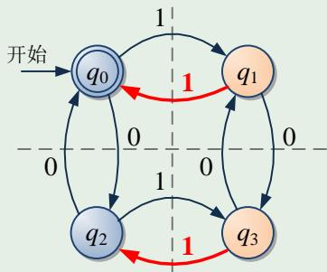

flowchart

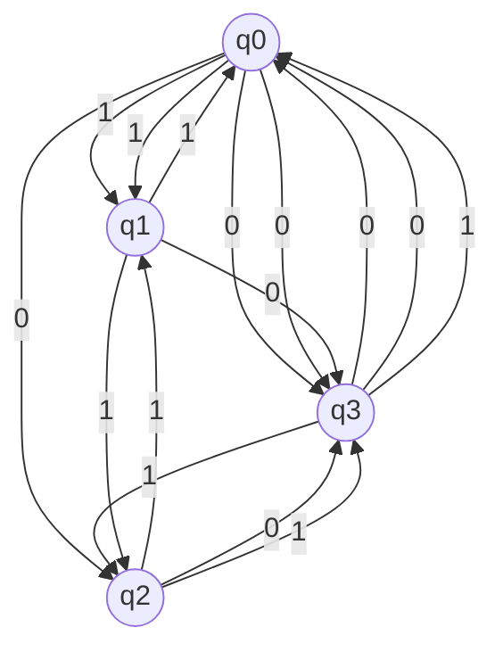
```mermaid
graph TD
  q0((q0)) -->|1| q1((q1))
  q0 -->|0| q2((q2))
  q0 -->|0| q3((q3))
  q1 -->|1| q0
  q2 -->|1| q1
  q3 -->|1| q2
  q3 -->|0| q0
  q0 -->|0| q3
  q1 -->|0| q3
  q2 -->|0| q3
  q3 -->|0| q0
  q0 -->|1| q1
  q1 -->|1| q2
  q2 -->|1| q3
  q3 -->|1| q0
```

接受什么样的语言？

分析：4个状态起什么作用？

## 例

例3.1中FA

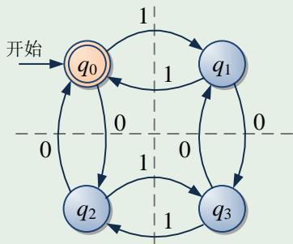

flowchart

```mermaid
graph TD
  q0((q0)) -->|1| q1((q1))
  q0 -->|0| q2((q2))
  q0 -->|1| q3((q3))
  q1 -->|0| q2
  q1 -->|1| q3
  q2 -->|0| q3
  q2 -->|1| q3
  q3 -->|0| q2
  q3 -->|1| q0
  q0 -->|开始| q0
```

接受什么样的语言？

分析：4个状态起什么作用？

q0：已读过偶数个 0 ，偶数个 1

## 例

例3.1中FA

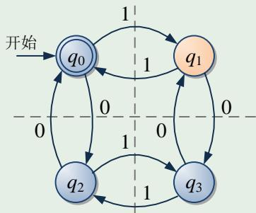

flowchart

```mermaid
graph TD
  q0((q0)) -->|1| q1((q1))
  q0 -->|0| q2((q2))
  q1 -->|1| q0
  q1 -->|0| q3((q3))
  q2 -->|1| q3
  q2 -->|0| q0
  q3 -->|1| q0
  q3 -->|0| q1
  q3 -->|1| q2
  q2 -->|0| q0
  q0 -->|1| q1
  q1 -->|0| q2
  q2 -->|1| q3
  q3 -->|0| q1
  q3 -->|1| q2
```

接受什么样的语言？

分析：4个状态起什么作用？

q ：已读过偶数个0，偶数个1  
q1：已读过偶数个0，奇数个1

## 例

例3.1中FA

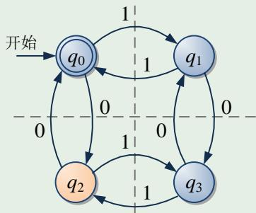

flowchart

```mermaid
graph TD
  q0((q0)) -->|1| q1((q1))
  q0 -->|0| q2((q2))
  q1 -->|1| q3((q3))
  q2 -->|0| q3
  q3 -->|1| q2
  q0 -->|0| q3
  q1 -->|0| q2
  q2 -->|1| q3
  q3 -->|0| q1
  q3 -->|1| q2
  q0 -->|开始| q0
```

接受什么样的语言？

分析：4个状态起什么作用？

q ：已读过偶数个0，偶数个1  
q1：已读过偶数个0，奇数个1  
q2：已读过奇数个0，偶数个1

## 例

例3.1中FA

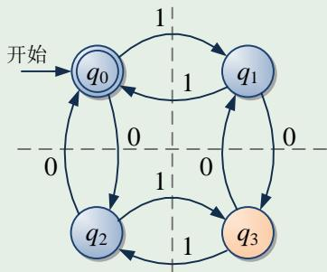

flowchart

```mermaid
graph TD
  q0((q0)) -->|1| q1((q1))
  q0 -->|0| q2((q2))
  q1 -->|1| q3((q3))
  q2 -->|0| q3
  q3 -->|1| q2
  q0 -->|0| q3
  q1 -->|0| q2
  q2 -->|1| q3
  q3 -->|0| q1
  q3 -->|1| q2
  q0 -->|开始| q0
```

接受什么样的语言？

分析：4个状态起什么作用？

q ：已读过偶数个0，偶数个1  
q1：已读过偶数个0，奇数个1  
q2：已读过奇数个0，偶数个1  
q3：已读过奇数个 0 ，奇数个 1

## 例

例3.1中FA

flowchart

```mermaid
graph TD
  q0((q0)) -->|1| q1((q1))
  q0 -->|0| q2((q2))
  q0 -->|1| q3((q3))
  q1 -->|0| q2
  q1 -->|1| q3
  q2 -->|0| q3
  q2 -->|1| q3
  q3 -->|0| q2
  q3 -->|1| q0
  q0 -->|开始| q0
```

接受什么样的语言？

分析：4个状态起什么作用？

q ：已读过偶数个0，偶数个1  
q1：已读过偶数个0，奇数个1  
q2：已读过奇数个0，偶数个1  
q3：已读过奇数个 0 ，奇数个 1

## 例

例3.1中FA

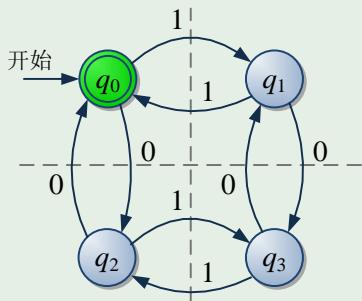

flowchart

```mermaid
graph TD
  q0((q0)) -->|1| q1((q1))
  q0 -->|0| q2((q2))
  q0 -->|1| q3((q3))
  q1 -->|0| q2
  q1 -->|1| q3
  q2 -->|0| q3
  q2 -->|1| q3
  q3 -->|0| q2
  q3 -->|1| q0
  q0 -->|开始| q0
```

接受什么样的语言？

分析：4个状态起什么作用？

q ：已读过偶数个0，偶数个1  
q1：已读过偶数个0，奇数个1  
q2：已读过奇数个0，偶数个1  
q3：已读过奇数个 0 ，奇数个 1

L(M) = {一切含有偶数个 0和偶数个1 的字符串}

1 给出 FA，指明它所接受的语言

FA =⇒ 语言

给出语言，构造接受它的 FA

语言=⇒ FA

## 例 例3.2

给出两个集合：

$$
L _ {1} = \{x \mid x \in \{0, 1 \} ^ {*}, \text {且} x \text {中至少包含一个子串} 0 1 0 \}
$$

$$
L _ {2} = \{x \mid x \in \{0, 1 \} ^ {*}, \text {且} x \text {中不能出现子串} 0 1 0 \}
$$

要求构造两个FA $M _ { 1 }$ 和 $M _ { 2 }$ ，分别接受 $L _ { 1 }$ 和 $L _ { 2 }$

## 例 例3.2

给出两个集合：

$$
L _ {1} = \{x \mid x \in \{0, 1 \} ^ {*}, \text {且} x \text {中至少包含一个子串} 0 1 0 \}
$$

$$
L _ {2} = \{x \mid x \in \{0, 1 \} ^ {*}, \text {且} x \text {中不能出现子串} 0 1 0 \}
$$

要求构造两个FA $M _ { 1 }$ 和 $M _ { 2 }$ ，分别接受 $L _ { 1 }$ 和 $L _ { 2 }$

## 例 例3.2

给出两个集合：

$$
L _ {1} = \{x \mid x \in \{0, 1 \} ^ {*}, \text {且} x \text {中至少包含一个子串} 0 1 0 \}
$$

$$
L _ {2} = \{x \mid x \in \{0, 1 \} ^ {*}, \text {且} x \text {中不能出现子串} 0 1 0 \}
$$

要求构造两个FA $M _ { 1 }$ 和 $M _ { 2 }$ ，分别接受 $L _ { 1 }$ 和 $L _ { 2 }$

分析 $L _ { 1 }$

## 例 例3.2

给出两个集合：

$$
L _ {1} = \{x \mid x \in \{0, 1 \} ^ {*}, \text {且} x \text {中至少包含一个子串} 0 1 0 \}
$$

$$
L _ {2} = \{x \mid x \in \{0, 1 \} ^ {*}, \text {且} x \text {中不能出现子串} 0 1 0 \}
$$

要求构造两个FA $M _ { 1 }$ 和 $M _ { 2 }$ ，分别接受 $L _ { 1 }$ 和 $L _ { 2 }$

分析 $L _ { 1 }$

从左向右扫描输入串，从 $M _ { 1 }$ 的初始状态出发

遇到1：暂时和要辨认的串无关，

可仍保留在原状态，

继续读下一个符号；

## 例 例3.2

给出两个集合：

$$
L _ {1} = \{x \mid x \in \{0, 1 \} ^ {*}, \text {且} x \text {中至少包含一个子串} 0 1 0 \}
$$

$$
L _ {2} = \{x \mid x \in \{0, 1 \} ^ {*}, \text {且} x \text {中不能出现子串} 0 1 0 \}
$$

要求构造两个FA $M _ { 1 }$ 和 $M _ { 2 }$ ，分别接受 $L _ { 1 }$ 和 $L _ { 2 }$

分析 $L _ { 1 }$

从左向右扫描输入串，从 $M _ { 1 }$ 的初始状态出发

遇到0：要引起注意了，

可能是子串010的开头，如何应对？

必须改变一个状态以应对这种情况，这个状态记为 $^ { 6 6 } 0 ^ { 9 9 }$ ”状态。

## 例 例3.2

给出两个集合：

$$
L _ {1} = \{x \mid x \in \{0, 1 \} ^ {*}, \text {且} x \text {中至少包含一个子串} 0 1 0 \}
$$

$$
L _ {2} = \{x \mid x \in \{0, 1 \} ^ {*}, \text {且} x \text {中不能出现子串} 0 1 0 \}
$$

要求构造两个FA $M _ { 1 }$ 和 $M _ { 2 }$ ，分别接受 $L _ { 1 }$ 和 $L _ { 2 }$

分析 $L _ { 1 }$

在“0”状态：

若读过1，进一步引起注意，

连续读过0、1的情况，更接近于子串010，如何应对？

用状态“01”表示。

## 例 例3.2

给出两个集合：

$$
L _ {1} = \{x \mid x \in \{0, 1 \} ^ {*}, \text {且} x \text {中至少包含一个子串} 0 1 0 \}
$$

$$
L _ {2} = \{x \mid x \in \{0, 1 \} ^ {*}, \text {且} x \text {中不能出现子串} 0 1 0 \}
$$

要求构造两个FA $M _ { 1 }$ 和 $M _ { 2 }$ ，分别接受 $L _ { 1 }$ 和 $L _ { 2 }$

分析 $L _ { 1 }$

在“01”状态：

## 例 例3.2

给出两个集合：

$$
L _ {1} = \{x \mid x \in \{0, 1 \} ^ {*}, \text {且} x \text {中至少包含一个子串} 0 1 0 \}
$$

$$
L _ {2} = \{x \mid x \in \{0, 1 \} ^ {*}, \text {且} x \text {中不能出现子串} 0 1 0 \}
$$

要求构造两个FA $M _ { 1 }$ 和 $M _ { 2 }$ ，分别接受 $L _ { 1 }$ 和 $L _ { 2 }$

分析 $L _ { 1 }$

在“01”状态：

再遇到0，已经出现子串010，怎么样？

## 例 例3.2

给出两个集合：

$$
L _ {1} = \{x \mid x \in \{0, 1 \} ^ {*}, \text {且} x \text {中至少包含一个子串} 0 1 0 \}
$$

$$
L _ {2} = \{x \mid x \in \{0, 1 \} ^ {*}, \text {且} x \text {中不能出现子串} 0 1 0 \}
$$

要求构造两个FA $M _ { 1 }$ 和 $M _ { 2 }$ ，分别接受 $L _ { 1 }$ 和 $L _ { 2 }$

分析 $L _ { 1 }$

在“01”状态：

再遇到0，已经出现子串010，怎么样？

该输入串被接受，

## 例 例3.2

给出两个集合：

$$
L _ {1} = \{x \mid x \in \{0, 1 \} ^ {*}, \text {且} x \text {中至少包含一个子串} 0 1 0 \}
$$

$$
L _ {2} = \{x \mid x \in \{0, 1 \} ^ {*}, \text {且} x \text {中不能出现子串} 0 1 0 \}
$$

要求构造两个FA $M _ { 1 }$ 和 $M _ { 2 }$ ，分别接受 $L _ { 1 }$ 和 $L _ { 2 }$

分析 $L _ { 1 }$

在“01”状态：

再遇到0，已经出现子串010，怎么样？

该输入串被接受，如何应对？

## 例 例3.2

给出两个集合：

$$
L _ {1} = \{x \mid x \in \{0, 1 \} ^ {*}, \text {且} x \text {中至少包含一个子串} 0 1 0 \}
$$

$$
L _ {2} = \{x \mid x \in \{0, 1 \} ^ {*}, \text {且} x \text {中不能出现子串} 0 1 0 \}
$$

要求构造两个FA $M _ { 1 }$ 和 $M _ { 2 }$ ，分别接受 $L _ { 1 }$ 和 $L _ { 2 }$

分析 $L _ { 1 }$

在“01”状态：

再遇到0，已经出现子串010，怎么样？

该输入串被接受，如何应对？

用状态“010”表示接受状态。

## 例 例3.2

给出两个集合：

$$
L _ {1} = \{x \mid x \in \{0, 1 \} ^ {*}, \text {且} x \text {中至少包含一个子串} 0 1 0 \}
$$

$$
L _ {2} = \{x \mid x \in \{0, 1 \} ^ {*}, \text {且} x \text {中不能出现子串} 0 1 0 \}
$$

要求构造两个FA $M _ { 1 }$ 和 $M _ { 2 }$ ，分别接受 $L _ { 1 }$ 和 $L _ { 2 }$

分析 $L _ { 1 }$

此后，

再遇到任何符号（0或1），怎么样？

都仍然进入该接受状态。

## 例 例3.2

给出两个集合：

$$
L _ {1} = \{x \mid x \in \{0, 1 \} ^ {*}, \text {且} x \text {中至少包含一个子串} 0 1 0 \}
$$

$$
L _ {2} = \{x \mid x \in \{0, 1 \} ^ {*}, \text {且} x \text {中不能出现子串} 0 1 0 \}
$$

要求构造两个FA $M _ { 1 }$ 和 $M _ { 2 }$ ，分别接受 $L _ { 1 }$ 和 $L _ { 2 }$

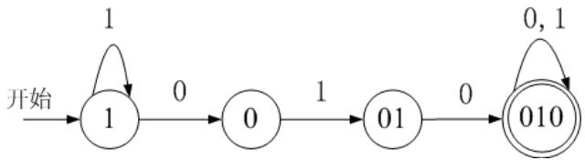

flowchart

```mermaid
graph LR
  A["开始"] --> B["1"]
  B -->|0| C["0"]
  C -->|1| D["01"]
  D -->|0| E["010"]
  E -->|0,1| E
  B -->|1| F
```

FA $M _ { 1 }$ 接受 $L _ { 1 }$ 完整吗？还差什么？

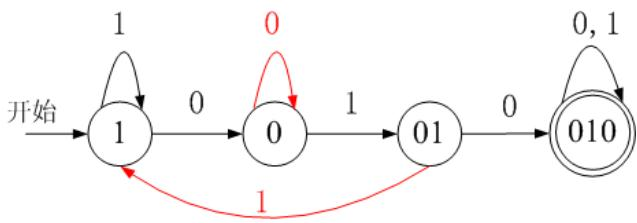

flowchart

```mermaid
graph LR
  A["开始"] --> B["1"]
  B -->|0| C["0"]
  C -->|1| D["01"]
  D -->|0| E["010"]
  E -->|0,1| E
  B -->|1| C
  C -->|1| D
  B -->|1| C
```

“0”状态遇0，保持在“0”状态；  
“01”状态遇1，“半途而废，从头再来”，返回“1”状态。

若输入串中含有子串010，则一定能到达接受状态；

若输入串中不含子串010，则一定不能到达接受状态。

$$
\therefore L (M _ {1}) = L _ {1}
$$

## 例 例3.2

给出两个集合：

$$
L _ {1} = \{x \mid x \in \{0, 1 \} ^ {*}, \text {且} x \text {中至少包含一个子串} 0 1 0 \}
$$

$$
L _ {2} = \{x \mid x \in \{0, 1 \} ^ {*}, \text {且} x \text {中不能出现子串} 0 1 0 \}
$$

要求构造两个FA $M _ { 1 }$ 和 $M _ { 2 }$ ，分别接受 $L _ { 1 }$ 和 $L _ { 2 }$

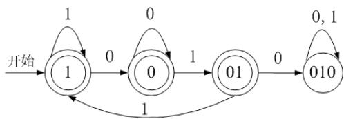

flowchart

```mermaid
graph LR
  A["开始"] --> B["1"]
  B -->|0| C["0"]
  C -->|1| D["01"]
  D -->|0| E["010"]
  E -->|0,1| E
  B -->|1| D
```

FA $M _ { 2 }$ 接受 $L _ { 2 }$

## 例 例3.3

构造一个FA M，它接受的语言为：

$L = \{ x \mid x \in \{ 0 , 1 \} ^ { + }$ ，且把x看成二进制数时，x模5余0}

（即x为二进制数，能被5整除）

## 例 例3.3

构造一个FA M，它接受的语言为：

$L = \{ x \mid x \in \{ 0 , 1 \} ^ { + }$ ，且把x看成二进制数时，x模5余0}

（即x为二进制数，能被5整除）

提示：

当二进制数x的位数向右不断增加时，其值的增加有规律：

二进制x0，十进制2x；  
二进制x1，十进制 $2 x + 1$ 。

## 例 例3.3

构造一个FA M，它接受的语言为：

$L = \{ x \mid x \in \{ 0 , 1 \} ^ { + }$ ，且把x看成二进制数时，x模5余0}

x0

x1

x模5余0， $2 x ^ { \cdot }$ 模5余0， $2 x + 1$ 模5余1；  
x模5余1， $2 x ^ { \cdot }$ 模5余2， $2 x + 1$ 模5余3；  
x模5余2， $2 x$ 模5余4， $2 x + 1$ 模5余0；  
x模5余3， $2 x$ 模5余1， $2 x + 1$ 模5余2；  
x模5余4， $2 x$ 模5余3， $2 x + 1$ 模5余4；

## 例 例3.3

构造一个 $\mathrm { \cdot } \mathrm { F A } \ M$ ，它接受的语言为：

$L = \{ x \mid x \in \{ 0 , 1 \} ^ { + }$ ，且把x看成二进制数时，x模5余0}

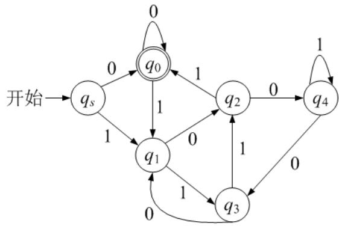

flowchart

```mermaid
graph TD
  node["开始"] --> qs
  qs -->|0| q0
  qs -->|1| q1
  q0 -->|1| q2
  q0 -->|0| q3
  q1 -->|0| q2
  q1 -->|1| q3
  q2 -->|0| q4
  q2 -->|1| q3
  q3 -->|0| q4
  q3 -->|1| q2
  q4 -->|1| q4
```

有穷自动机的定义

五元组：

$$
M = (Q, \Sigma , \delta , q _ {0}, F)
$$

转移图

扩充转移函数： ˆδ

2 有穷自动机接受的语言

接受状态集F 的作用

$L ( M ) = \{ x \mid \delta ( q _ { 0 } , x ) \in F \}$

FA ⇐⇒ 语言