# 1 The Church-Turing Thesis

# 丘奇-图灵论题

杨雅君

yjyang@tju.edu.cn

智能与计算学部

text_image

TIANJIN UNIVERSITY (PEIYANG UNIVERSITY)
1895
天津大學

## Outline

Turing Machines 图灵机  
图灵机的变形  
算法的定义

## Outline

Turing Machines 图灵机

图灵机的形式化定义  
图灵机的例子

图灵机的变形

算法的定义

## Turing Machines 图灵机

## Turing machine 图灵机

该模型由 Alan Turing 在 1936 年首次提出  
图灵机与有穷自动机类似，但具有比有穷自动机和下推自动机更强大的能力  
图灵机具有无限大容量的存储且可以访问任意内部数据  
o 图灵机是一种更加精确的通用计算机模型  
能够模拟实际计算机的所有计算行为

图灵机也有不能解的问题

这些问题已经超出了计算理论的极限

## 艾伦·图灵（Alan Turing）

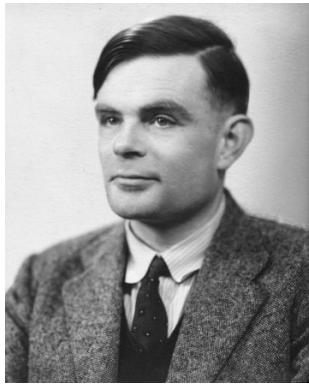

natural_image

Portrait of a man in formal attire (no visible text or symbols)

艾伦·图灵（Alan Turing）

June 23, 1912 – June 7, 1954 (aged 41)

英国数学家、逻辑学家

“计算机科学之父”

“人工智能之父”

## Turing Machines 图灵机

图灵机用一个无限长的纸带作为无限存储.

它有一个读写头, 能在纸带上读、写和左右移动.  
图灵机在开始工作时, 纸带上只有输入串, 其他地方都是空白的.  
如果需要保存信息, 它可将这个信息写在纸带上.

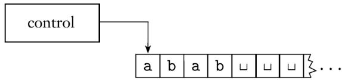

flowchart

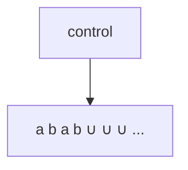

## Turing Machines 图灵机

图灵机用一个无限长的纸带作为无限存储.

为了读已经写下的信息, 它可将读写头往回移动到这个信息所在的位置.  
机器不停地计算, 直至产生输出为止.  
机器预置了接受和拒绝两种状态, 如果进入这两种状态, 就产生输出接受(accept)和拒绝(reject).  
如果不能进入任何接受或拒绝状态, 就继续执行下去, 永不停止.

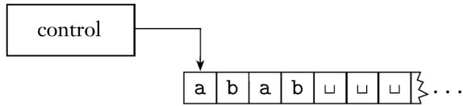

flowchart

## Turing Machines 图灵机

## 下面是有穷自动机与图灵机之间的区别

图灵机在纸带上既能读也能写.  
图灵机的读写头既能向左移动也能向右移动.  
图灵机的纸带是无限长的.  
图灵机进入拒绝和接受状态将立即停机.

## Turing Machines 图灵机

## Example (Turing machine M1)

考虑图灵机 $M _ { 1 }$ , 它检查语言B 的成员关系

$$
B = \{w \# w \mid w \in \{0, 1 \} ^ {*} \}
$$

即要设计 $M _ { 1 }$ , 使得如果输入是B 的成员, 它就接受, 否则拒绝.

## Turing Machines 图灵机

## Example (图灵机 M1)

$$
B = \{w \# w \mid w \in \{0, 1 \} ^ {*} \}
$$

对于输入字符串w:

在# 两边对应的位置来回移动. 检查这些对应位置是否包含相同的符号, 如不是, 或者没有# , 则拒绝. 为记录对应的符号, 消去所有检查过的符号.  
当# 左边的所有符号都被消去时, 检查# 的右边是否还有符号, 如果是, 则拒绝, 否则接受.

## Turing Machines 图灵机

## Example (图灵机 M1)

下图是 $M _ { 1 }$ 在输入 011000#011000 开始之后, $M _ { 1 }$ 纸带的几个非连续快照.

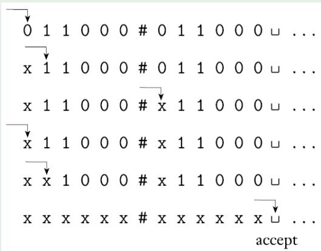

text_image

0 1 1 0 0 0 # 0 1 1 0 0 0 ∪ ... 
x 1 1 0 0 0 # 0 1 1 0 0 0 ∪ ... 
x 1 1 0 0 0 # x 1 1 0 0 0 ∪ ... 
x 1 1 0 0 0 # x 1 1 0 0 0 ∪ ... 
x x 1 0 0 0 # x 1 1 0 0 0 ∪ ... 
x x x x x x # x x x x x x ∪ ... 
accept

## 图灵机的形式化定义

## Definition (TM (图灵机))

图灵机 (TM)是一个 7-元组 $( Q , \Sigma , \Gamma , \delta , q _ { 0 } , q _ { \mathsf { a c c e p t } } , q _ { \mathsf { r e j e c t } } )$ , 其中Q, Σ, Γ 都是有穷集合, 并且

1 Q 是状态集,  
2 Σ 是输入字母表, 不包括特殊空白符号t,  
3 Γ是纸带字母表, 其中 $\sqcup \in \Gamma , \Sigma \subseteq \Gamma$ ,  
4 $\delta : Q \times \Gamma  Q \times \Gamma \times \{ \mathsf { L } , \mathsf { R } \}$ 是转移函数,  
5 $q _ { 0 } \in Q$ 是起始状态,  
6 $q _ { \mathsf { a c c e p t } } \in Q$ 是接受状态,  
7 $q _ { \mathsf { r e j e c t } } \in Q$ 是拒绝状态, 且 $q _ { \mathsf { a c c e p t } } \neq q _ { \mathsf { r e j e c t } }$

## 图灵机的格局

图灵机的格局(configuration):

当前状态  
当前纸带内容  
读写头当前位置

图灵机的格局

$$
u q v
$$

当前状态为 q  
当前纸带内容为uv  
读写头当前位置是v 的第一个符号

纸带上v 的最后一个符号以后的符号都是空白符. 1011q701111

## 图灵机的格局

图灵机的格局(configuration):

## 图灵机的格局

$$
u q v
$$

当前状态为 q  
当前纸带内容为uv  
读写头当前位置是v 的第一个符号

纸带上v 的最后一个符号以后的符号都是空白符. $1 0 1 1 q _ { 7 } 0 1 1 1 1$

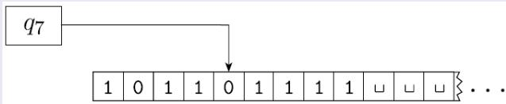

flowchart

```mermaid
graph TD
  A["q7"] --> B["16"]
  B --> C["0"]
  C --> D["1"]
  D --> E["1"]
  E --> F["0"]
  F --> G["1"]
  G --> H["1"]
  H --> I["1"]
  I --> J["1"]
  J --> K["1"]
  K --> L["1"]
  L --> M["1"]
  M --> N["1"]
  N --> O["1"]
  O --> P["1"]
  P --> Q["1"]
  Q --> R["1"]
  R --> S["1"]
  S --> T["1"]
  T --> U["1"]
  U --> V["1"]
  V --> W["1"]
  W --> X["1"]
  X --> Y["1"]
  Y --> Z["1"]
```

## 图灵机的计算方式

格局 $C _ { 1 }$ 产生 $( y i e l d s )$ 格局 $C _ { 2 }$

如果图灵机能够合法地从格局 $C _ { 1 }$ 一步进入 $C _ { 2 }$ .

## 形式化定义

设 $a , b \in \Gamma , u , v \in \Gamma ^ { * } , q _ { i } , q _ { j } \in Q$

· $u a q _ { i } b v$ 产生 $u q _ { j } a c v$

$$
\text { if } \delta (q _ {i}, b) = (q _ {j}, c, \mathsf {L})
$$

$u a q _ { i } b v$ 产生 $u a c q _ { j } v$ if $\delta ( q _ { i } , b ) = ( q _ { j } , c , \mathsf { R } )$

## 图灵机的计算方式

格局 $C _ { 1 }$ 产生 $( y i e l d s )$ 格局 $C _ { 2 }$

如果图灵机能够合法地从格局 $C _ { 1 }$ 一步进入 $C _ { 2 }$ .

## 形式化定义

当读写头处于格局的两个端点之一时, 会发生特殊变化.

对于左端点,

向左移动: $q _ { i } b v$ 产生 $q _ { j } c v$  
向右移动: $q _ { i } b v$ 产生 $c q _ { j } v$

对于右端点

· $u a q _ { i }$ 等价于 $u a q _ { i } \sqcup$

## 图灵机的计算方式

图灵机M 读入输入字符串w

起始格局(start configuration): q0w  
接受格局(accepting configuration): · · · qaccept · · ·  
拒绝格局(rejecting configuration): · · · qreject · · ·

接受状态和拒绝状态都是停机格局(halting configurations), 它们都不再产生新的格局.

因为机器只在接受或拒绝状态下才停机, 因此可以等价地将转移函数记为

δ : Q0 × Γ → Q × Γ × {L, R}, where Q0 = Q − {qaccept, qreject}

## 图灵机的计算方式

图灵机M 接受(accepts)输入w, 如果存在格局的序列 $C _ { 1 } , C _ { 2 } , \ldots , C _ { k }$ 使得

$C _ { 1 }$ 是M 在输入w 上的起始格局,  
每一个 $C _ { i }$ 产生 $C _ { i + 1 }$  
$C _ { k }$ 是接受格局.

M 接受的字符串的集合称为M 的语言, 或被 M识别的语言, 记为$L ( M )$ .

## Turing-recognizable 图灵可识别

## Definition (Turing-recognizable 图灵可识别)

如果一个语言能被某一图灵机识别, 则称该语言是图灵可识别的(Turing-recognizable)

(图灵可识别语言也可被称为递归可枚举语言(recursively enumerablelanguage).) 在输入上运行一个图灵机时, 可能出现三种结果.

1 接受  
拒绝  
循环

这里循环(loop)仅仅指机器不停机.

## Turing-decidable 图灵可判定的

对于一个输入, 图灵机M 有两种方式不接受它, 一种是进入拒绝状态而拒绝它, 另一种是进入循环

有时候很难区分机器是进入了循环还是需要耗费长时间的运行因此, 人们更喜欢对所有输入都停机的图灵机, 它们永不循环.  
这种机器被称为判定器(deciders), 因为它们总能决定是接受还是拒绝.  
对于可以识别某个语言的判定器, 称其判定(decide)该语言.

## Turing-decidable 图灵可判定的

这种机器被称为判定器(deciders), 因为它们总能决定是接受还是拒绝.  
对任何输入都停机的图灵机, 又被称为总停机的图灵机, 总停机的图灵机也被称为算法.  
对于可以识别某个语言的判定器, 称其判定(decide)该语言.

## Definition (Turing-decidable 图灵可判定的)

如果一个语言能被某一图灵机判定, 则称它是图灵可判定

的(Turing-decidable), 简称可判定的(decidable).

(图灵可判定语言也被称为递归语言(recursively language).)

每一个图灵可判定语言都是图灵可识别的.

## 各类型语言之间的关系

## Theorem

每一个上下文无关语言都是图灵可判定语言.

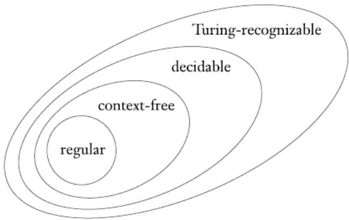

text_image

Turing-recognizable
decidable
context-free
regular

## Example (构造图灵机 M2, 它判定的语言为 A = {02n|n ≥ 0})

$M _ { 2 }$ 对于输入字符串w：

1 从左往右扫描整个纸带, 隔一个字符消去一个0.  
2 如果在第1 步之后, 纸带上只剩下唯一的一个0, 则接受.  
如果在第1 步之后, 纸带上包含不止一个0, 并且0 的个数是奇数,则拒绝.  
读写头返回纸带的最左端.  
转到第1 步.

## Example (构造图灵机 $1 1 6 2$ , 它判定的语言为 $a _ { n } = a _ { 1 } + ( 1 - \frac { 2 \sqrt { 2 } } { 2 } ) \sqrt { 2 } = ( 1 - \frac { 2 \sqrt { 2 } } { 2 } )$

下面给出 $M _ { 2 }$ 的形式化描述： $M _ { 2 } = ( Q , \Sigma , \Gamma , \delta , q _ { 1 } , q _ { \mathrm { a c c e p t } } , q _ { \mathrm { r e j e c t } } )$

1 Q = {q1, q2, q3, q4, q5, qaccept, qreject}

2 Σ = {0}

3 Γ = {0, x, F}

将δ 描述为状态转移图

5 开始、接受和拒绝状态分别是 q1, qaccept 和 $q _ { \mathrm { r e j e c t } }$

Example (构造图灵机 M2, 判定语言 $a = ( 0 ) ^ { 2 } ( 1 0 ) = ( 1 )$ , 输入: 0000)  
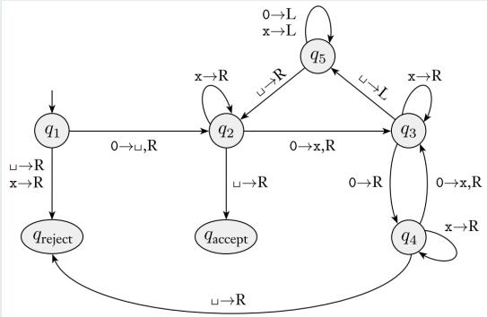

flowchart

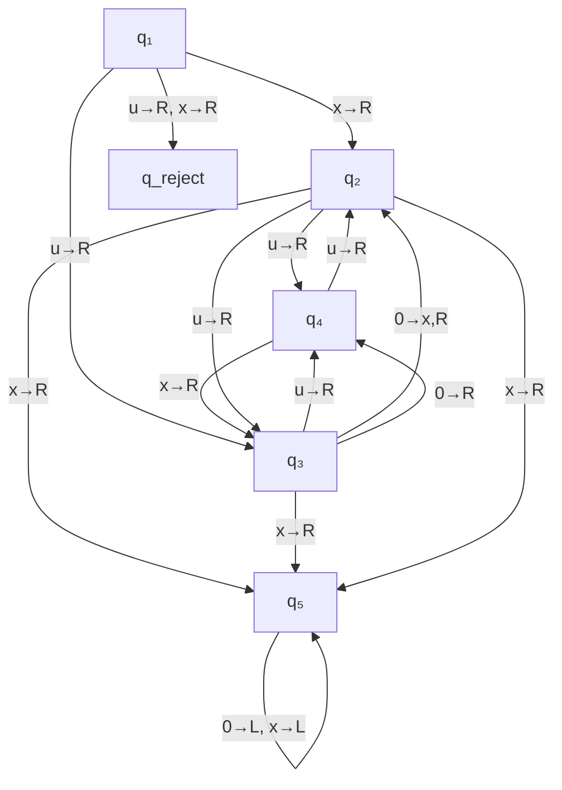

<table><tr><td> $q_{1}0000$ </td><td> $\sqcup q_{5}x0x\sqcup$ </td><td> $\sqcup xq_{5}xx\sqcup$ </td></tr><tr><td> $\sqcup q_{2}000$ </td><td> $q_{5}\sqcup x0x\sqcup$ </td><td> $\sqcup q_{5}xxx\sqcup$ </td></tr><tr><td> $\sqcup xq_{3}00$ </td><td> $\sqcup q_{2}x0x\sqcup$ </td><td> $q_{5}\sqcup xxx\sqcup$ </td></tr><tr><td> $\sqcup x0q_{4}0$ </td><td> $\sqcup xq_{2}0x\sqcup$ </td><td> $\sqcup q_{2}xxx\sqcup$ </td></tr><tr><td> $\sqcup x0xq_{3}\sqcup$ </td><td> $\sqcup xxq_{3}x\sqcup$ </td><td> $\sqcup xq_{2}xx\sqcup$ </td></tr><tr><td> $\sqcup x0q_{5}x\sqcup$ </td><td> $\sqcup xxxq_{3}\sqcup$ </td><td> $\sqcup xxq_{2}x\sqcup$ </td></tr><tr><td> $\sqcup xq_{5}0x\sqcup$ </td><td> $\sqcup xxq_{5}x\sqcup$ </td><td> $\sqcup xxxq_{2}\sqcup$ </td></tr></table>

uXXXuqaccept

## Example (构造图灵机 M1, 它判定的语言为 $1 0 0 - 1 0 0 = 1 0 0 0 - 2 0 0 = 1 0 0 0 0 0 0 ( c m )$

$M _ { 1 }$ 的形式化描述： $M _ { 1 } = ( Q , \Sigma , \Gamma , \delta , q _ { 1 } , q _ { \mathsf { a c c e p t } } , q _ { \mathsf { r e j e c t } } )$

1 Q = {q1, · · · , q8, qaccept, qreject}

2 $\Sigma = \{ 0 , 1 , \# \}$

3 $\Gamma = \{ 0 , 1 , \# , x , \sqcup \}$

4 将δ 描述为状态转移图

5 开始、接受和拒绝状态分别是 $q _ { 1 } , q _ { \mathsf { a c c e p t } }$ 和 $q _ { \mathrm { r e j e c t } }$

Example (构造图灵机 M1, 它判定的语言为 B = {w#w | w ∈ {0, 1}∗},输入: 011000#011000)

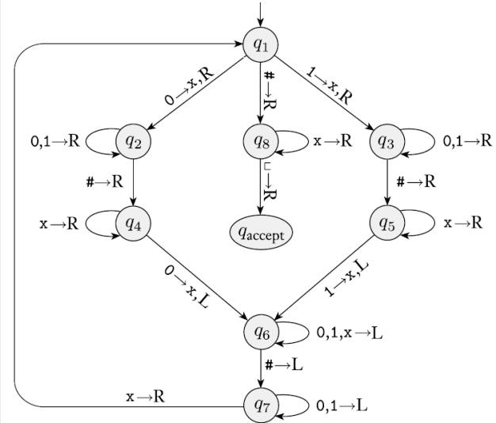

flowchart

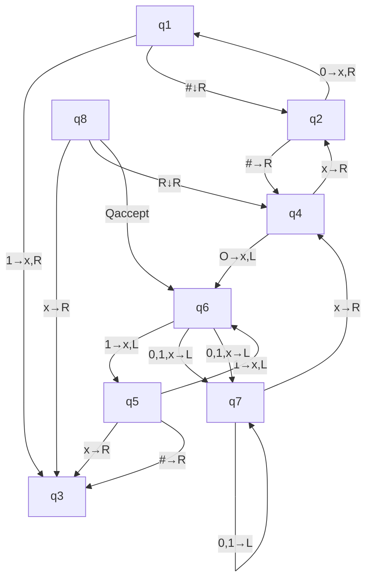

## Outline

Turing Machines 图灵机  
图灵机的变形

Multitape Turing Machines 多带图灵机  
Nondeterministic Turing Machines 非确定型图灵机  
Enumerators 枚举器  
与其他模型的等价性

算法的定义

## Multitape Turing Machines 多带图灵机

## 多带图灵机

多带图灵机(multitape Turing machine)很像普通图灵机, 只是有多条纸带, 每条纸带都有自己的读写头用于读和写. 开始时, 输入出现在第1 条纸带上, 其他纸带都是空白的.  
转移函数： $\delta : Q \times \Gamma ^ { k }  Q \times \Gamma ^ { k } \times \{ L , R , S \} ^ { k }$ , 这里 k 是纸带的数量.  
$\delta ( q _ { i } , a _ { 1 } , \cdots , a _ { k } ) = ( q _ { j } , b _ { 1 } , \cdots , b _ { k } , L , R , \cdots , L )$

## Theorem

每个多带图灵机等价于某一个单带图灵机.

## Multitape Turing Machines 多带图灵机

## Theorem

每个多带图灵机等价于某一个单带图灵机.

证明思路: 将一个多带图灵机M 转换为一个与之等价的单带图灵机S.关键是怎样用S 来模拟M.

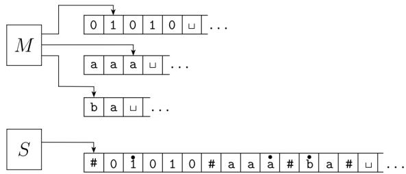

flowchart

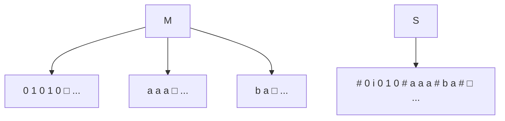

## Multitape Turing Machines 多带图灵机

## Theorem

每个多带图灵机等价于某一个单带图灵机.

证明: S 对于输入任一字符串 $w = w _ { 1 } \cdot \cdot \cdot w _ { n }$

1 S 在自己的纸带上放入

$$
\# \dot {w} _ {1} w _ {2} \dots w _ {n} \# \dot {\sqcup} \# \dot {\sqcup} \# \dots \#
$$

此格式表示了M 的全部k 个纸带的内容

2 为了模拟多带机的一步移动, S 在其纸带上从标记左端点的第一个# 开始扫描, 一直扫描到标记右端点的第k + 1 个#, 其目的是确定虚拟读写头下的符号. 然后S 进行第二次扫描, 并根据M 的转移函数指示的运行方式更新纸带.

## Multitape Turing Machines 多带图灵机

## Theorem

每个多带图灵机等价于某一个单带图灵机.

证明: S 对于输入任一字符串 $w = w _ { 1 } \cdot \cdot \cdot w _ { n }$

3 任何时候, 只要S 将某个虚拟读写头向右移动到某个# 上面, 就意味着M 已将自己相应的读写头移动到了其所在的纸带中的空白区域上, 即以前没有读过的区域上. 因此, S 在这个纸带方格上写下空白符, 并将这个纸带方格到最右端的各个纸带方格中的内容都向右移动一个. 然后再像之前一样继续模拟.

## Corollary

一个语言是图灵可识别的, 当且仅当存在多带图灵机识别它.

## Nondeterministic Turing Machines 非确定型图灵机

$$
\bullet \delta : Q \times \Gamma \to \mathcal {P} (Q \times \Gamma \times \{\mathrm{L}, \mathrm{R} \})
$$

## Theorem

每个非确定型图灵机都等价于某一个确定型图灵机.

## Nondeterministic Turing Machines 非确定型图灵机

## Theorem

每个非确定型图灵机都等价于某一个确定型图灵机.

证明思路: 用确定型图灵机D 来模拟非确定型图灵机N 的证明思路是：让D 试验N 的非确定型计算的所有可能分支. 若D 能在某个分支到达接受状态, 则接受; 否则D 的模拟将永不终止.

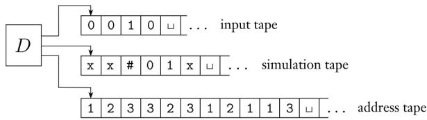

flowchart

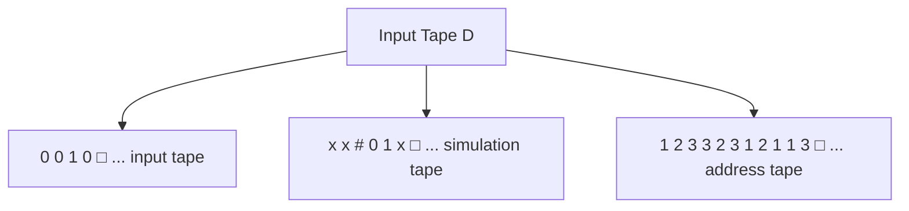

## Nondeterministic Turing Machines 非确定型图灵机

## Theorem

每个非确定型图灵机都等价于某一个确定型图灵机.

证明: D 的描述如下:

1 开始时, 第一条纸带包含输入w, 第二条纸带和第三条纸带都是空白的.  
2 把第一条纸带复制到第二条纸带上, 并将第三条纸带的字符串初始化为 .  
3 用第二条纸带去模拟N 在输入w 上的非确定计算的某个分支. 在N 的每一步动作之前, 查询第三条纸带上的下一个数字, 以决定在N 的转移函数所允许的选择中做何选择.

## Nondeterministic Turing Machines 非确定型图灵机

## Theorem

每个非确定型图灵机都等价于某一个确定型图灵机.

证明: D 的描述如下:

如果第三条纸带上没有符号剩下, 或这个非确定型的选择是无效的,则放弃这个分支, 转到第4 步. 如果遇到拒绝格局也转到第4 步. 如果遇到接受格局, 则接受这个输入.  
4 在第三条纸带上, 用字符串顺序的下一个串来替代原有的串. 转到第2 步, 以模拟N 的计算的下一个分支.

## Nondeterministic Turing Machines 非确定型图灵机

## Theorem

每个非确定型图灵机都等价于某一个确定型图灵机.

## Corollary

一个语言是图灵可识别的, 当且仅当存在非确定型图灵机识别它.

证明: 确定型图灵机自然是一个非确定型图灵机, 此推论的一个方向由此立刻得证. 另一个方向可由定理3.10 得证.

## Corollary

一个语言是图灵可判定的, 当且仅当存在非确定型图灵机判定它.

证明: 修改定理3.10 的证明, 如果N 在计算的所有分支上都能停机, 则D 也总能停机.

## Enumerators 枚举器

枚举器是一个k 带图灵机，最后一带作为输出带。枚举器产生的语言：L(M) = {w|w ∈ Σ∗, w能被M打印在输出带上, # ∈/ Σ}

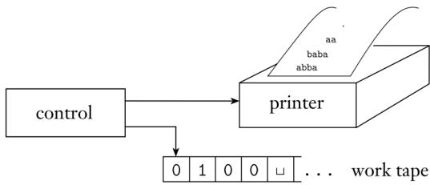

flowchart

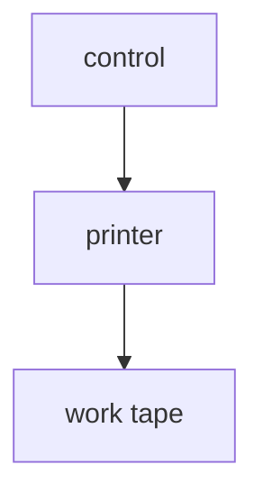

## Theorem

一个语言是图灵可识别的, 当且仅当存在枚举器枚举它.

## Enumerators 枚举器

## Theorem

一个语言是图灵可识别的, 当且仅当存在枚举器枚举它.

证明：首先证明：如果有枚举器E 枚举语言A, 则有图灵机M 识别A. 图灵机M 对于输入w:

运行E, 每当E 输出一个串时, 将之与w 比较.  
如果w 曾经在E 的输出中出现过, 则接受.

现在证明另一个方向. 设 $s _ { 1 } , s _ { 2 } , s _ { 3 } , \cdots$ 是 $\Sigma ^ { * }$ 中所有可能的串, 如果图灵机M 识别语言A, 则为A构造枚举器E 如下：

对 i = 1, 2, 3, · · · , 重复下列步骤.  
对 $s _ { 1 } , s _ { 2 } , \cdots , s _ { i }$ 中的每一个i, M 以其作为输入运行i 步.  
如果有计算接受, 则打印出相应的 $s _ { j }$ .

## 与其他模型的等价性

双向无穷带图灵机  
。 多头图灵机  
多维图灵机  
离线图灵机  
λ-演算

## Outline

Turing Machines 图灵机  
图灵机的变形  
算法的定义

希尔伯特问题  
描述图灵机的术语

## 丘奇-图灵论题(Church–Turing thesis)

希尔伯特第10 问题旨在设计一个算法来检测一个多项式是否有整数根.

Intuitive notion of algoritbms equals

Turing macbine algoritbms

The Church–Turing Thesis 邱奇-图灵论题

所有合理的计算模型都是等价的.

## 描述图灵机的术语

描述的详细程度有三种：

1 第一种是形式化描述, 即详尽地写出图灵机的状态、转移函数等,这是最低层次.  
第二种描述的抽象水平要高一些, 称为实现描述.

这种方法使用日常语言来描述图灵机的动作, 如怎么移动读写头、怎么在纸带上存储数据,  
这种程度的描述没有给出状态和转移函数的细节.

3 第三种是高层次描述, 它也是使用日常语言描述算法, 但忽略了实现的细节.

。 这种程度的描述不再需要提及机器如何管理它的纸带或读写头.

## 描述图灵机的术语

## Example

设 A 是由表示连通无向图的串构成的语言, A = {hGi|G 是无向连通图},下面是判定A的图灵机M 的一个高层次描述:

M 对于输入是图 G 的编码 hGi：

1 选择G 的第一个顶点, 并标记之.  
2 重复下列步骤, 直到没有新的顶点可作标记.  
对于G 的每一个顶点, 如果能够通过一条边将其连到另一个已被标记的顶点, 则标记该顶点.  
扫描G 的所有顶点, 确定它们是否都已作了标记. 如果是, 则接受,否则拒绝.