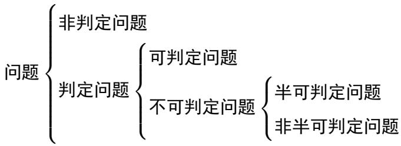
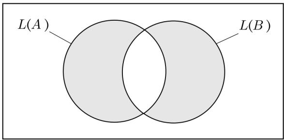
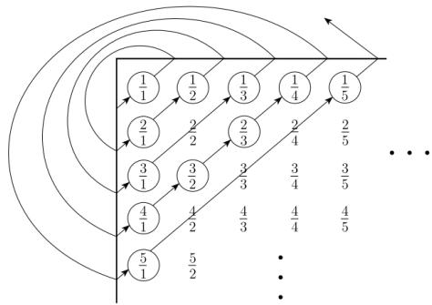
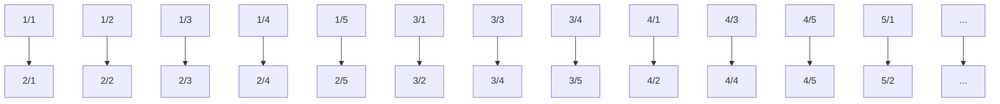
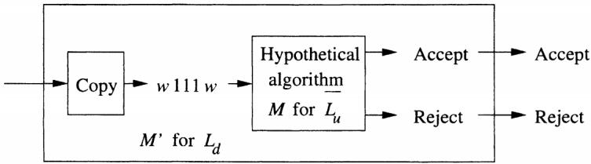
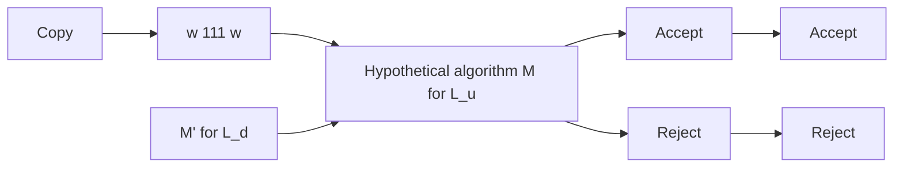
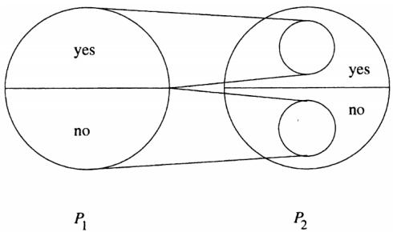

# 2 Decidability

# 可判定性

杨雅君

yjyang@tju.edu.cn

智能与计算学部

2022

text_image

TSINGHUA UNIVERSITY (PEIYANG UNIVERSITY)
1895
天津大學

## Outline

Decidable Language 可判定语言  
Undecidable Language 不可判定语言  
Reducibility 归约

## Outline

## Decidable Language 可判定语言

判定问题  
图灵机的编码  
。 与正则语言相关的可判定性问题  
与上下文无关语言相关的可判定性问题

## Undecidable Language 不可判定语言

## Reducibility 归约

## 判定问题

## 问题与问题的实例

问题的实例：一个具体的问题  
问题：抽象化描述, 该问题全部实例的集合

## Definition (判定问题)

一个问题Π被称为判定问题, 如果Π的每个实例I 的解为“是”或者“否”.

例：语言 $L \subseteq \{ 0 , 1 \} ^ { * }$ 是递归的吗？

例：图G = (V, E) 是哈密尔顿图吗？

编码, 问题对应的语言

设Π是一个问题, 对每个实例I 用某个字母表Σ 上的字符串编码.  
问题 $\frac { x + 5 + 1 5 1 } { \frac { 3 } { 4 } \times 5 }$ 答案为“是”的实例的编码之集L ⇐⇒ 对应的语言

## 判定问题

编码, 问题对应的语言

## Definition (问题对应的语言)

问题Π的答案为“是”的实例的编码串之集称为Π对应的语言.

判定问题与不可判定问题

## Definition (判定问题)

问题Π是可判定的当且仅当Π对应的语言是递归的; 如果Π对应的语言不是递归, 则Π称为不可判定问题. 如果不可判定问题Π对应的语言是递归可枚举的, 则Π称为半可判定的.

## 判定问题

## 问题的分类

pure_formula_zh

\mathrm {问 题} \left\{ \begin{array}{l l} {{\mathrm {非 判 定 问 题}}} \\ {{\mathrm {判 定 问 题} \left\{ \begin{array}{l l} {{\mathrm {可 判 定 问 题}}} \\ {{\mathrm {不 可 判 定 问 题} \left\{ \begin{array}{l l} {{\mathrm {半 可 判 定 问 题}}} \\ {{\mathrm {非 半 可 判 定 问 题}}} \end{array} \right.}} \end{array} \right.}} \end{array} \right.

## 递归语言的性质

## Theorem

如果语言L 是递归的, 则 $\overline { { L } }$ 也是递归语言.

证明：对于某个总停机的图灵机 $M$ , 设 $L = L ( M )$ . 构造一个新的图灵机 $\overline { { M } }$ , 使得 $\overline { { L } } = L ( \overline { { M } } )$ ).

M 的接受状态都改变成 $\overline { { M } }$ 的非接受状态, 在这些状态中, M 将停机不接受.  
$\overline { { M } }$ 有一个新的接受状态r, 没有从r 出发的转移.  
对于使得M 没有转移(即M 停机不接受)的M 的非接受状态都添加一个到接受状态r 的转移.

由于 $M$ 保证停机, 则 $\overline { { M } }$ 也保证停机. 而且, $\overline { { M } }$ 恰好接受 $M$ 所不接受的串. 因此 $\overline { { M } }$ 接受 $\overline { { L } }$ .

## 递归语言的性质

## Theorem

如果一个语言L 和它的补 $\overline { { L } }$ 都是递归可枚举的, 则L 是递归的.

证明：设 $L = L ( M _ { 1 } )$ 且 $\overline { { L } } = L ( M _ { 2 } )$ . 构造图灵机M 平行地模拟 $M _ { 1 }$ 和$M _ { 2 }$ . 考虑M 是2带图灵机, M 的一条纸带模拟 $M _ { 1 }$ 的纸带进行工作, $M$ 的另一条纸带模拟 $M _ { 2 }$ 的纸带进行工作. $M _ { 1 }$ 和 $M _ { 2 }$ 的状态分别是M 的状态的一个分量.

如果M 的输入w 属于L, 则 $M _ { 1 }$ 最终将接受. 此时, M 接受且停机.  
如果w 不属于L, 则 $w \in \overline { { L } }$ , 所以 $M _ { 2 }$ 最终将接受. 当 $M _ { 2 }$ 接受时, $M$ 停机不接受.

因此, 在所有输入上M 都停机, $L ( M )$ 恰好是L. 因为M 总是停机, 且$L ( M ) = L$ , 所以L 是递归的.

## 图灵机的编码

设计图灵机的二进制编码, 使得可以认为具有输入字母表{0,1}的每个图灵机都是二进制串.

为了把 $\mathsf { T M } M = ( Q , ( 0 , 1 ) , \Gamma , \delta , q _ { 1 } , q _ { 2 } )$ 表示成二进制串, 必须把整数指派给状态、带符号以及方向L 和R.

1 假设对于某个r, 状态是 $q _ { 1 } , q _ { 2 } , \cdots , q _ { r }$ . 初始状态总是 $q _ { 1 } , \ q _ { 2 }$ 是唯一的接受状态.  
2 假设对于某个s, 带符号是 $X _ { 1 } , X _ { 2 } , \cdot \cdot \cdot , X _ { r } . ~ X _ { 1 }$ 永远是符号 $0 , X _ { 2 }$ 永远是符号1, $X _ { 3 }$ 永远是符号t(空格). 其他带符号可以任意地指派给其余整数.  
我们把方向L 称为 $D _ { 1 }$ , 方向R 称为 $D _ { 2 }$ .

## 图灵机的编码

一旦选定了整数表示每个状态、符号以及方向, 就能编码转移函数δ.

假设对于某些整数 $i , j , k , l , m ,$ 一条转移规则是

$$
\delta (q _ {i}, X _ {j}) = (q _ {k}, X _ {l}, D _ {m})
$$

把这条规则编码成串 $0 ^ { i } 1 0 ^ { j } 1 0 ^ { k } 1 0 ^ { l } 1 0 ^ { m }$ .

3 注意 $i , j , k , l , m$ 都至少为1, 所以在单个转移的编码中, 没有两个以上连续的1.

## 图灵机的编码

整个图灵机M 的编码由所有转移的编码组成, 按照某种顺序排列, 用成对的1分隔： $C _ { 1 } 1 1 C _ { 2 } 1 1 \cdot \cdot \cdot C _ { n - 1 } 1 1 C _ { n }$ , 其中每个 $C _ { i }$ 都是M 的一个转移的编码.

## 图灵机的编码

Example (讨论图灵机 M = ({q1, q2, q3}, {0, 1}, {0, 1, t}, δ, q1, q2))

δ 包括规则：

1 δ(q1, 1) = (q3, 0, R): 0100100010100  
2 δ(q3, 0) = (q1, 1, R): 0001010100100  
3 δ(q3, 1) = (q2, 0, R): 00010010010100  
4 δ(q3, t) = (q3, 1, L): 0001000100010010

图灵机M 的编码是：

01001000101001100010101001001100010010010100110001000100010010

图灵机M 共有多少种可能的编码？4! = 24 种

## 与正则语言相关的可判定性问题

DFA 接受问题：检测一个特定的确定型有穷自动机是否接受给定的串考虑语言

$$
A _ {\mathrm{DFA}} = \{\langle B, w \rangle | B \text {是DFA并且接受输入串} w \}
$$

问题 $\neg \neg \neg \neg \neg \neg$ 是否接受输入 $w ^ { " }$ 与问题 $" \langle B , w \rangle$ i是否是 $A _ { \mathsf { D F A } }$ 的元素”等价

## Theorem

$A _ { D F A }$ 是一个可判定语 $\frac { \partial } { \overline { { \overline { { \mathbf { u } } } } } }$ .

该定理证明了问题“一个给定的有穷自动机是否接受一个给定的串”是可判定的.

## 与正则语言相关的可判定性问题

## Theorem

$A _ { D F A }$ 是一个可判定语言.

证明：只要设计一个判定 $A _ { \mathsf { D F A } }$ 的图灵机M 即可.

M 对于输入 hB, wi, 其中 B 是 DFA, w 是输入字符串：

在输入w 上模拟B  
2 如果模拟以接受状态结束, 则接受; 如果以非接受状态结束, 则拒绝.  
输入hB, wi 的编码为B111w . 当M 收到输入时, 首先检查它是否正确地表示了DFA B 和字符串w, 如果不是, 则拒绝. 然后M 直接执行模拟.

## 与正则语言相关的可判定性问题

对于非确定型有穷自动机, 可以证明类似的定理. 设

$$
A _ {\mathrm{NFA}} = \{\langle B, w \rangle | B \text {是NFA并且接受输入串} w \}
$$

## Theorem

ANFA 是一个可判定语言.

证明：构造一个判定 $A _ { \mathsf { N F A } }$ 的图灵机N. 可以考虑将N 设计成与M 一样. 下面说明一个新的想法：

用M 作为N 的子程序. 因为M 只接收DFA 作为输入, 故先将N 作为输入所收到的NFA 转换成DFA, 然后再将它传给M.

## 与正则语言相关的可判定性问题

## Theorem

$A _ { N F A }$ 是一个可判定语言.

证明：用M 作为N 的子程序. 因为M 只接收DFA作为输入, 故先将N作为输入所收到的NFA 转换成DFA, 然后再将它传给M.

N 对于输入 hB, wi, 其中 B 是 NFA, w 是输入字符串：

将 NFA B 转换成一个等价的 DFA C.  
在输入hC, wi 上运行图灵机M.  
如果M 接受, 则接受, 否则拒绝.

第2 步中, “运行图灵机 $M ^ { \prime \prime }$ 的含义是：将M 作为一个子程序加进N 的设计中.

## 与正则语言相关的可判定性问题

令： $E _ { \mathsf { D F A } } = \{ \langle A \rangle | A$ 是 DFA 且 $L ( A ) = \emptyset \}$

## Theorem

E 是一个可判定语言.

证明：DFA 接受一个串当且仅当：从起始状态出发, 沿着此DFA 的箭头方向, 能够到达一个接收状态. 设计一个使用标记算法的图灵机T. T 对于输入 hAi, 其中 A 是一个 DFA:

标记A的起始状态.  
重复下列步骤, 知道所有状态都被标记.  
3 对于一个状态, 如果有一个到达它的转移是从某个已经标记过的状态出发的, 则将其标记.  
如果没有接受状态被标记, 则接受, 否则拒绝.

## 与正则语言相关的可判定性问题

检查两个DFA 是否识别同一个语言是可判定的. 设

$$
E Q _ {\mathrm{DFA}} = \{\langle A, B \rangle | A \text {和} B \text {都是} \mathrm{DFA} \text {且} L (A) = L (B) \}
$$

## Theorem

$E Q _ { D F A }$ 是一个可判定语言.

证明：由A和B 来构造一个新的DFA C, 使得C 只接受这样的串: A或B 接受但不是都接受. 显然, 如果A和B 识别相同的语言, 则C 不接受任何串. 即C 的语言是

$$
L (C) = \left(L (A) \cap \overline {{L (B)}}\right) \cup \left(\overline {{L (A)}} \cap L (B)\right)
$$

## 与正则语言相关的可判定性问题

## Theorem

$E Q _ { D F A }$ 是一个可判定语言.

证明：L(C) 表示 L(A) 和 $L ( B )$ ) 的对称差

text_image

L(A)
L(B)

## 与正则语言相关的可判定性问题

## Theorem

EQDFA 是一个可判定语言.

证明：检查 L(C) 是否为空, 如果它是空的, L(A) 与 L(B) 必定相等. F对于输入 hA, Bi, 其中 A 和 B 都是 DFA.

1 如上描述构造DFA C.  
2 在输入hCi 上运行上一定理中的图灵机T.  
如果T 接受, 则接受; 如果T 拒绝, 则拒绝.

## 与上下文无关语言相关的可判定性问题

检查某个CFG 是否派生一个特定的串

Theorem

ACFG 是一个可判定语言.

检查某个CFG 是否派生一个特定的串检查一个CFG 是否不派生任何串.

Theorem

E 是一个可判定语言.

上下文无关语言都可以用图灵机判定

Theorem

每个上下文无关语言都是可判定的.

## Outline

Decidable Language 可判定语言  
Undecidable Language 不可判定语言

. 非递归可枚举语言  
通用图灵机  
不可判定语言

Reducibility 归约

## 非递归可枚举语言

## 受限制的图灵机

考虑图灵机 $M = ( Q , \Sigma , \Gamma , \delta , q _ { 1 } , q _ { 2 } )$

1 Q = q1, q2, · · · , qn  
2 Σ = {0, 1}  
3 $\Gamma = \{ 0 , 1 , \sqcup \}$  
4 $q _ { 1 }$ 为起始状态  
5 $q _ { 2 }$ 为接受状态

6 简便起见, 省略拒绝状态 $q _ { \mathrm { r e j e c t } }$

这样的图灵机是一个受限制的图灵机, 显然, 通过对字符的0,1编码, 非受限制的图灵机与受限制的图灵机等价.

## 非递归可枚举语言

我们可以对受限制的图灵机进行编码,

如果 $w _ { i }$ 为某个图灵机的编码, 则这个图灵机记为 $M _ { i }$ ,  
如果 $w _ { i }$ 不是图灵机的编码, 约定 $w _ { i }$ 也是一个图灵机的编码, 记为$M _ { i }$ 且 $L ( M _ { i } ) = \emptyset$ ,  
于是有图灵机序列 $M _ { 1 } , M _ { 2 } , \cdots$ .

因为由0,1 构成的所有字符串的集合 $\{ 0 , 1 \} ^ { * }$ 是可数集合, 我们可知

## Corollary

递归可枚举语言有可数个

这说明不可判定问题比可判定问题要多得多.

## 对角化方法

## Definition (可数)

如果集合 A 是有限的或者可与自然数集 N 一一对应, 则称 A 是可数的.

## Example

正有理数集合 $\begin{array} { r } { Q = \{ \frac { m } { n } | m , n \in N \} } \end{array}$ 是可数的.

flowchart

## 对角化方法

## Example

实数集R 是不可数的.

证明：采用康托对角线法进行证明.

因为 f : (0, 1) → R 是双射函数, 令 $S = \{ x | x \in R \land ( 0 < x < 1 ) \}$ . 若能证明S 是不可数集, 则R 也是不可数集.

反证法. 假设 S 可数, 则 S 可表示为： ${ \cal S } = \{ S _ { 1 } , S _ { 2 } , \cdots \}$ , 其中 $S _ { i }$ 为 (0, 1)区间的任一实数. 设 $S _ { i } = 0 . y _ { 1 } y _ { 2 } y _ { 3 } \cdot \cdot \cdot$ , 其中 $y _ { i } \in \{ 0 , 1 , 2 , \cdot \cdot \cdot , 9 \}$ , 设

$$
S _ {1} = 0. a _ {1 1} a _ {1 2} a _ {1 3} \dots a _ {1 n} \dots
$$

$$
S _ {2} = 0. a _ {2 1} a _ {2 2} a _ {2 3} \dots a _ {2 n} \dots
$$

$$
S _ {3} = 0. a _ {3 1} a _ {2 2} a _ {3 3} \dots a _ {3 n} \dots
$$

## 对角化方法

## Example

实数集R 是不可数的.

证明：其次, 我们构造一个实数 $r = 0 . b _ { 1 } b _ { 2 } b _ { 3 } \cdot \cdot$ · 使

$$
b _ {j} = \left\{ \begin{array}{l l} 1, & a _ {j j} \neq 1, j = 1, 2, \dots \\ 2, & a _ {j j} = 1, j = 1, 2, \dots \end{array} \right.
$$

这样, r 与所有实数 $S _ { 1 } , S _ { 2 } , \cdots , S _ { n } , \cdots$ 不同, 因为它与 $S _ { 1 }$ 在位置1 不同,与 $S _ { 2 }$ 在位置2 不同, · · ·, 等等. 这证明了 $r \not \in S$ , 产生矛盾. 因此S 是不可数的, 进而R 是不可数集.

## 非递归可枚举语言

根据康托定理, (0,1)∗ 上的所有语言的集合为不可数集. 因此,

## Corollary

一定存在不能被任何图灵机识别的语言.

我们可以找到一个非递归可枚举语言.

考虑问题0: 第i 个图灵机 $M _ { i }$ 不接受第i 个字符串 $w _ { i }$ 吗？其对应语言为 $L _ { d }$ , 即

$$
L _ {d} = \{w _ {i} | w _ {i} \in \{0, 1 \} ^ {*}, w _ {i} \notin L (M _ {i}) \}
$$

## Theorem

$L _ { d }$ 不是递归可枚举语言. 也就是说, 不存在接受语言 $L _ { d }$ 的图灵机.

## 非递归可枚举语言

## Theorem

$L _ { d }$ 不是递归可枚举语言. 也就是说, 不存在接受语言 $L _ { d }$ 的图灵机.

证明：反证法. 假设 $L _ { d }$ 是递归可枚举语言, 则存在某个图灵机M , 使得$L ( M ) = L _ { d }$ . 因为 $L _ { d }$ 是字母表{0,1}上的语言, 则M 至少有一个编码$j$ , 即 $M = M _ { j }$ .

现在询问 $w _ { j }$ 是否属于 $L ( M _ { j } )$ .

若 $w _ { j } \in L ( M _ { j } )$ , 则 $w _ { j } \in L _ { d }$ . 由 $L _ { d }$ 定义, 可知 $w _ { j }$ 不能被 $L ( M _ { j } )$ 接受, 即 $w _ { j } \notin { L ( M _ { j } ) }$ , 矛盾.  
若 $w _ { j } \notin { L ( M _ { j } ) }$ , 则 $w _ { j } \notin L _ { d }$ , 由 $L _ { d }$ 定义, 从而 $w _ { j } \in L ( M _ { j } )$ . 矛盾因此, 假设存在矛盾, $L _ { d }$ 不是递归可枚举语言.

## 通用图灵机

考虑问题1：图灵机M 是否接受一个字符串w. 其对应语言为 $L _ { u }$ , 即

$$
L _ {u} = \{\langle M, w \rangle | w \in \{0, 1 \} ^ {*}, M \text {是一个图灵机且接受} w \}
$$

语言 $L _ { u }$ 称为通用语言. 如果存在一台图灵机 $M _ { u }$ , 使得 $L ( M _ { u } ) = L _ { u }$ , 则称 $M _ { u }$ 为通用图灵机.

## Theorem

$L _ { u }$ 是递归可枚举语言, 即通用图灵机 $M _ { u }$ 是存在的.

通用图灵机的存在性说明了现代电子计算机是可以制造出来的.

## 通用图灵机

## Theorem

$L _ { u }$ 是递归可枚举语言, 即通用图灵机 $M _ { u }$ 是存在的.

证明：设计 $M _ { u }$ 为一个3带图灵机, 其中

第1 带存放 $\langle M , w \rangle$ 的编码, 即 $M 1 1 1 w$ .  
第2 带用于 $M _ { u }$ 模拟M 在w 上的运算.  
第 3 带始终存放 M 的当前状态 $q _ { i } \left( 0 ^ { i } \right)$ .

$M _ { u }$ 的工作方式如下：

$M _ { u }$ 检查输入是否正确.  
2 初始化：

。 把第1 带上的w 抄写到第2 带上, 读写头指向w 的第1 个符号;  
在第 3 带上打印 $0 \left( q _ { 1 } \right)$ .

## 通用图灵机

## Theorem

$L _ { u }$ 是递归可枚举语言, 即通用图灵机 $M _ { u }$ 是存在的.

$M _ { u }$ 检查输入是否正确.  
初始化：  
3 $M _ { u }$ 模拟 M 的每一个动作, 若当前 M 处于状态 $q _ { i }$ (第 3 带上为 $0 ^ { i } )$ ),第 2 带读写头读入的符号为 $x _ { j }$ , 若 δ 有定义 $\delta ( q _ { i } , x _ { j } ) = ( q _ { k } , x _ { l } , D _ { m } )$ )则 $M _ { u }$ 在第1 带上找其编码 $0 ^ { i } 1 0 ^ { j } 1 0 ^ { k } 1 0 ^ { l } 1 0 ^ { m }$ , 然后执行:

1 抹去第 3 带上的 $0 ^ { i }$ 并打印 $0 ^ { k }$ (状态 $q _ { k } )$ .  
2 第 2 带读写头注视的方格上打印 $0 ^ { l }$ (符号 $x _ { l } )$ .  
3 第2 带读写头根据 $m = 1$ 或 $m = 2$ , 执行向左移动或者向右移动.

如果δ 无定义(第二带上找不到编码), 则 $M _ { u }$ 停机.

## 通用图灵机

通用图灵机的伟大贡献：

通用图灵机 $M _ { u }$ 是现代电子计算机的抽象数学模型, 证明了现在电子计算机是可以制造出来的.  
2 计算机硬件各种不同的设计都是等价的, 它们的能力都一样, 但性能有所差异.  
为以后高级语言的解释器奠定了基础.  
可以作为操作语义.

## 不可判定语言

## Theorem

通用语言 $L _ { u }$ 不是递归语言, 即 $L _ { u }$ 是不可判定语 $\frac { \underline { { \underline { { \mathbf { \Pi } } } } } } { \overline { { \underline { { \mathbf { \Pi } } } } } }$ .

证明：根据递归语言的性质, 只需证明 $\overline { { L } } _ { u }$ 不是递归语言即可.

反证法. 假设 $\overline { { L } } _ { u }$ 是递归的, 则存在一台总停机的图灵机M 接受 $\overline { { L } } _ { u }$ , 从而可以构造一台图灵机 $M ^ { \prime }$ 接受 $L _ { d }$ . 这与 $L _ { d }$ 是非递归可枚举语言矛盾.

因为 $L ( M ) = \overline { { L } } _ { u }$ , 如下图所示, 可以将图灵机 M 改造成 $M ^ { \prime }$ , $M ^ { \prime }$ 接受 $L _ { d }$ 的工作方式如下:

flowchart

# 不可判定语言

## Theorem

通用语言 $L _ { u }$ 不是递归语言, 即 $L _ { u }$ 是不可判定语言.

证明：

给定串w 作为输入, 在检查了w 中不含连续三个1 之后(若w 含111, 则立即拒绝 w), $M ^ { \prime }$ 把输入改成 w111w.  
$M ^ { \prime }$ 在新的输入上模拟M. 若w 是图灵机的编码 $w _ { i }$ , 则 $M ^ { \prime }$ 确定 $M _ { i }$ 是否接受 $w _ { i }$ . M 接受 $\overline { { L } } _ { u }$ , 所以M 接受当且仅当 $M _ { i }$ 不接受 $w _ { i }$ , 即$w _ { i } \in L _ { d } .$ .

因此 $M ^ { \prime }$ 接受w 当且仅当 $w _ { i } \in L _ { d }$ , 因此 $M ^ { \prime }$ 存在, 其与 $L _ { d }$ 是非递归可枚举语言矛盾. 因此, $L _ { u }$ 不是递归语言.

## 不可判定语言

考虑图灵停机问题：图灵机M 在输入串w 上停机吗？

$$
L _ {h} = \{\langle M, w \rangle | w \in \{0, 1 \} ^ {*}, M \text {是一个图灵机且对} w \text {停机} \}
$$

## Theorem

$L _ { h }$ 不是递归语言, 即图灵停机问题是不可判定的.

证明：反证法. 假设 $L _ { h }$ 是递归的, 则存在一台总停机的图灵机M 接受$L _ { h }$ , 从而可以构造一台图灵机 $M ^ { \prime }$ 接受 $L _ { d }$ , 构造方法与上一定理类似, 从而得出矛盾, 因此 $L _ { h }$ 不是递归语言.

## Outline

Decidable Language 可判定语言  
Undecidable Language 不可判定语言  
Reducibility 归约

. 归约  
莱斯定理

## 归约

## Definition (归约)

如果有一个算法把问题 $P _ { 1 }$ 的全部实例转化成问题 $P _ { 2 }$ 的具有相同答案的实例, 则称 $P _ { 1 }$ 归约到 $P _ { 2 }$ .

必须把 $P _ { 1 }$ 具有“是”回答的任何实例都变成 $P _ { 2 }$ 具有“是”回答的实例  
必须把 $P _ { 1 }$ 具有“否”回答的任何实例都变成 $P _ { 2 }$ 具有“否”回答的实例

text_image

yes
no
P₁
yes
no
P₂

## 归约

## Definition (归约)

如果有一个算法把问题 $P _ { 1 }$ 的全部实例转化成问题 $P _ { 2 }$ 的具有相同答案的实例, 则称 $P _ { 1 }$ 归约到 $P _ { 2 }$ .

归约表明 $P _ { 2 }$ 至少和 $P _ { 1 }$ 一样难. 下面给出归约的形式化定义.

## Definition (映射可归约)

语言A是映射可归约到语言B 的, 如果存在可计算函数f : $\Sigma ^ { * }  \Sigma ^ { * }$ 使得对每个 w,

$$
w \in A \Leftrightarrow f (w) \in B
$$

记作 $A \leqslant _ { m } B$ . 称函数 f 为从 A 到 B 的归约.

## 归约

## Theorem (归约)

如果存在从 $P _ { 1 }$ 到 $P _ { 2 }$ 的归约, 那么：

1 若 $P _ { 1 }$ 是不可判定的, 则 $P _ { 2 }$ 也是不判定的.  
2 若 $P _ { 1 }$ 是非递归可枚举的, 则 $P _ { 2 }$ 也是非递归可枚举的.

证明：

1 若可以判定 $P _ { 2 }$ , 则可以把从 $P _ { 1 }$ 到 $P _ { 2 }$ 的归约与判定 $P _ { 2 }$ 的算法组合起来, 构造一个判定 $P _ { 1 }$ 的算法. 具体地说, 给定 $P _ { 1 }$ 的一个实例 $x ,$ ,对x 使用归约算法, 这个算法将x 转化成 $P _ { 2 }$ 的一个实例 $y$ . 对 $y$ 使用判定 $P _ { 2 }$ 的算法.

若算法结果为“是”, 因为 $P _ { 1 }$ 可归约到 $P _ { 2 }$ , 所以 $P _ { 1 }$ 对于 $w$ 回答为是.  
若算法结果为“否”, 因为 $P _ { 1 }$ 可归约到 $P _ { 2 }$ , 所以 $P _ { 1 }$ 对于 $w$ 回答为否.

## 归约

## Theorem (归约)

如果存在从 $P _ { 1 }$ 到 $P _ { 2 }$ 的归约, 那么：

1 若 $P _ { 1 }$ 是不可判定的, 则 $P _ { 2 }$ 也是不判定的.  
2 若 $P _ { 1 }$ 是非递归可枚举的, 则 $P _ { 2 }$ 也是非递归可枚举的.

证明：

2 假设 $P _ { 1 }$ 是非递归可枚举的, 而 $P _ { 2 }$ 是递归可枚举的, 则存在一台图灵机识别 $P _ { 2 }$ . 从 $P _ { 1 }$ 的一个实例x开始, 将其归约为 $P _ { 2 }$ 的一个实例 $y$ .

。 如果x 属于 $P _ { 1 }$ , 则 $y$ 属于 $P _ { 2 }$ , 所以图灵机接受 $x ,$  
。 如果 $x$ 不属于 $P _ { 1 }$ , 则 $y$ 不属于 $P _ { 2 }$ , 所以图灵机将不接受x.

这就构造出一台识别 $P _ { 1 }$ 的图灵机, 这与 $P _ { 1 }$ 是非递归可枚举矛盾.

## 莱斯定理

考虑以下问题：

## Example

图灵机 M 接受的语言是空的吗？ $L _ { e } = \{ \langle M \rangle | L ( M ) = \emptyset \}$  
图灵机 M 接受的语言是非空的吗？ $L _ { n e } = \{ \langle M \rangle | L ( M ) \neq \emptyset \}$

## Definition (递归可枚举语言的性质)

递归可枚举语言的任一集合P 就称为递归可枚举语言的一个性质. 如果P 非空, 也不是所有的递归可枚举语言, 则P 称为递归可枚举语言的非平凡性质.

P 对应的语言： $L _ { p } = \{ \langle M \rangle | L ( M ) \in P \}$

## 莱斯定理

## Theorem

递归可枚举语言的每个非平凡性质都是不可判定的

莱斯定理的应用: 所有只涉及图灵机接受的语言的与图灵机有关的问题都是不可判定的.

## Example

一台图灵机接受的语言是否为空  
一台图灵机接受的语言是否有穷  
一台图灵机接受的语言是否是正则语言  
一台图灵机接受的语言是否是上下文无关语言

莱斯定理并没有蕴含与一台图灵机有关的每个问题都是不可判定的.

## 总结

## 可判定语言

判定问题  
图灵机的编码  
与正则语言相关的可判定性问题  
与上下文无关语言相关的可判定性问题

## 总结

可判定语言

判定问题  
图灵机的编码  
与正则语言相关的可判定性问题  
与上下文无关语言相关的可判定性问题

不可判定语言

非递归可枚举语言  
通用图灵机  
. 不可判定语言

归约

. 归约  
. 莱斯定理