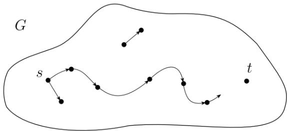
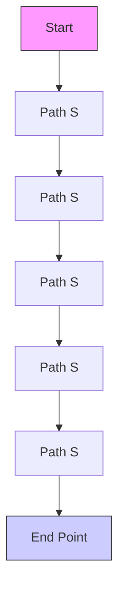
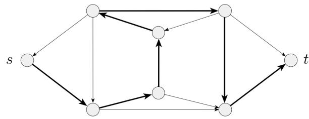
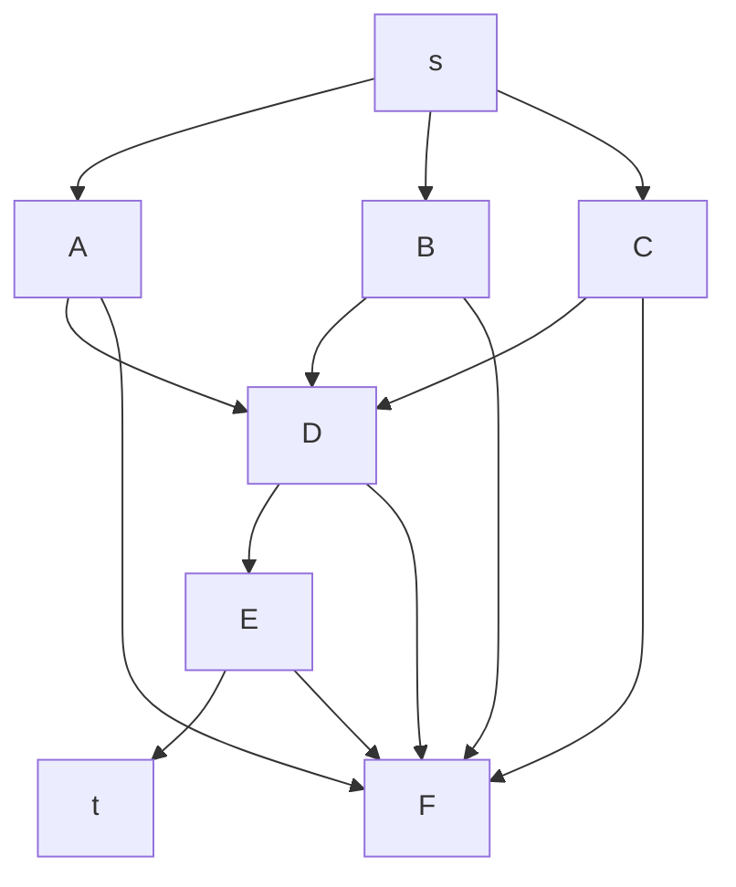
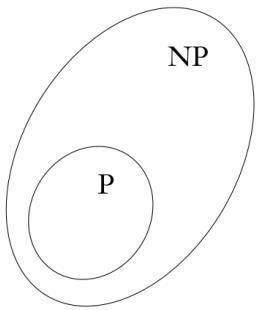
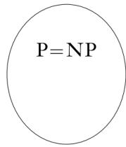
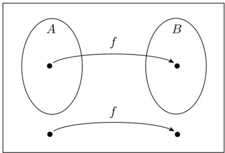
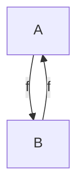
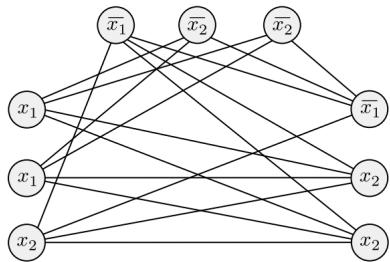
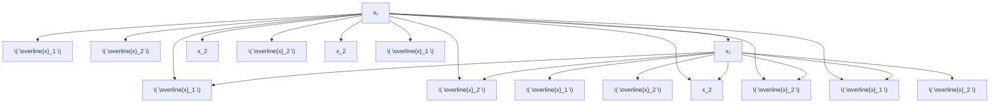

# 3 Complexity

# 计算复杂性

杨雅君

yjyang@tju.edu.cn

智能与计算学部

text_image

TANJIN UNIVERSITY (PEIYANG UNIVERSITY)
1895
天津大學

## Outline

度量复杂性  
2 P 类  
NP 类  
NP 完全性  
几个NP 完全问题  
NP 难问题

## Outline

## 度量复杂性

大O 和小o 记法  
分析算法  
模型间的复杂性关系

## 2 P 类

## NP 类

## NP 完全性

## 几个NP 完全问题

## 度量复杂性

考察递归语言 $A = \{ 0 ^ { k } 1 ^ { k } | k \geqslant 0 \}$ , 单带图灵机需要多少时间来判定A？

## 度量复杂性

考察递归语言 $A = \{ 0 ^ { k } 1 ^ { k } | k \geqslant 0 \}$ , 单带图灵机需要多少时间来判定A？

## Example (判定语言 A 的图灵机 M )

M1 = 对输入串 w

扫描纸带, 如果在1 的右边发现0, 就拒绝  
2 如果纸带上既有0也有1, 就重复下一步  
扫描纸带, 删除一个0 和一个1.  
如果所有1 都被删除以后还有0, 或者所有0 都被删除以后还有1,就拒绝. 否则, 如果在纸带上既没有剩下0 也没有剩下1, 就接受.

## 度量复杂性

本章节我们将学会分析判定A的图灵机 $M _ { 1 }$ 的算法所需的时间. 在一个特定的输入上, 算法所使用的步数可能与若干参数有关. 下面给出时间复杂度的定义：

## 度量复杂性

本章节我们将学会分析判定A的图灵机 $M _ { 1 }$ 的算法所需的时间. 在一个特定的输入上, 算法所使用的步数可能与若干参数有关. 下面给出时间复杂度的定义：

## Definition (时间复杂度)

令M 是一个总停机的确定型图灵机. M 的运行时间 (running time)或者时间复杂度 (time complexity) 是一个函数 f : N → N, 其中 N 是非负整数集合. f(n) 是M 在所有长度为n 的输入上运行时所经过的最大步数.若f(n) 是M 的运行时间, 则称M 在时间f(n) 内运行, M 是f(n) 的时间图灵机. 通常使用n 表示输入的规模.

## 大O 和小o记法

因为算法的精确运行时间通常是一个复杂的表达式, 所以一般只是估计它的趋势和级别.

## 大O 和小o记法

因为算法的精确运行时间通常是一个复杂的表达式, 所以一般只是估计它的趋势和级别.

函数 $f ( n ) = 6 n ^ { 3 } + 2 n ^ { 2 } + 2 0 n + 4 5$ , 称f 渐近地不大于 $n ^ { 3 }$ .

## 大O 和小o记法

因为算法的精确运行时间通常是一个复杂的表达式, 所以一般只是估计它的趋势和级别.

函数 $f ( n ) = 6 n ^ { 3 } + 2 n ^ { 2 } + 2 0 n + 4 5$ , 称f 渐近地不大于 $n ^ { 3 }$ .

这种关系的表达方式被称为渐近记法或大 O 记法, 记为 $f ( n ) = O ( n ^ { 3 } )$

## Definition (上界)

设 f 和 g 是两个函数 $f , g : \mathbf { N } \to \mathbf { R } ^ { + }$ . 称 $f ( n ) = O ( g ( n ) )$ , 若存在正整数$c$ 和 $n _ { 0 }$ , 使得对所有 $n \geqslant n _ { 0 }$ 有

$$
f (n) \leqslant c g (n)
$$

当 $f ( n ) = O ( g ( n ) )$ 时, 称 g(n) 是 f(n) 的上界 (upper bound), g(n) 是$f ( n )$ 的渐近上界, 以强调没有考虑常数因子.

## 大O 和小o记法

## Example

设 f1(n) 是函数 $5 n ^ { 3 } + 2 n ^ { 2 } + 2 2 n + 6$ . 保留最高次项 $5 n ^ { 3 }$ , 并且舍去它的系数 5, 得到 $f _ { 1 } ( n ) = O ( n ^ { 3 } )$ .

验证一下这个结果是否满足上面的的形式化定义.

## 大O 和小o记法

## Example

设 $f _ { 1 } ( n )$ 是函数 $5 n ^ { 3 } + 2 n ^ { 2 } + 2 2 n + 6$ . 保留最高次项 $5 n ^ { 3 }$ , 并且舍去它的系数 5, 得到 $f _ { 1 } ( n ) = O ( n ^ { 3 } )$ .

验证一下这个结果是否满足上面的的形式化定义.

令 $c = 6 , n _ { 0 } = 1 0$ , 则对于所有 $n \geqslant 1 0$ , 有 $5 n ^ { 3 } + 2 n ^ { 2 } + 2 2 n + 6 \leqslant 6 n ^ { 3 }$

## 大O 和小o记法

## Example

设 $f _ { 1 } ( n )$ 是函数 $5 n ^ { 3 } + 2 n ^ { 2 } + 2 2 n + 6$ . 保留最高次项 $5 n ^ { 3 }$ , 并且舍去它的系数 5, 得到 $f _ { 1 } ( n ) = O ( n ^ { 3 } )$ .

验证一下这个结果是否满足上面的的形式化定义.

令 $c = 6 , n _ { 0 } = 1 0$ , 则对于所有 $n \geqslant 1 0$ , 有 $5 n ^ { 3 } + 2 n ^ { 2 } + 2 2 n + 6 \leqslant 6 n ^ { 3 }$ .此外, $f _ { 1 } ( n ) = O ( n ^ { 4 } )$ , 因为 $n ^ { 4 }$ 比 $n ^ { 3 }$ 大, 所以它也是 $f _ { 1 }$ 的一个渐近上界.

## 大O 和小o记法

## Example

设 $f _ { 1 } ( n )$ 是函数 $5 n ^ { 3 } + 2 n ^ { 2 } + 2 2 n + 6$ . 保留最高次项 $5 n ^ { 3 }$ , 并且舍去它的系数 5, 得到 $f _ { 1 } ( n ) = O ( n ^ { 3 } )$ .

验证一下这个结果是否满足上面的的形式化定义.

令 $c = 6 , n _ { 0 } = 1 0$ , 则对于所有 $n \geqslant 1 0$ , 有 $5 n ^ { 3 } + 2 n ^ { 2 } + 2 2 n + 6 \leqslant 6 n ^ { 3 }$ .此外, $f _ { 1 } ( n ) = O ( n ^ { 4 } )$ , 因为 $n ^ { 4 }$ 比 $n ^ { 3 }$ 大, 所以它也是 $f _ { 1 }$ 的一个渐近上界.但是, $f _ { 1 } ( n ) \neq O ( n ^ { 2 } )$ , 无论c 和 $n _ { 0 }$ 如何赋值, 始终无法满足定义.

## 大 O 和小 o 记法

## Example

设 $f _ { 1 } ( n )$ 是函数 $5 n ^ { 3 } + 2 n ^ { 2 } + 2 2 n + 6$ . 保留最高次项 $5 n ^ { 3 }$ , 并且舍去它的系数 5, 得到 $f _ { 1 } ( n ) = O ( n ^ { 3 } )$ .

验证一下这个结果是否满足上面的的形式化定义.

令 $c = 6 , n _ { 0 } = 1 0$ , 则对于所有 $n \geqslant 1 0$ , 有 $5 n ^ { 3 } + 2 n ^ { 2 } + 2 2 n + 6 \leqslant 6 n ^ { 3 }$ .此外, $f _ { 1 } ( n ) = O ( n ^ { 4 } )$ , 因为 $n ^ { 4 }$ 比 $n ^ { 3 }$ 大, 所以它也是 $f _ { 1 }$ 的一个渐近上界.但是, $f _ { 1 } ( n ) \neq O ( n ^ { 2 } )$ , 无论c 和 $n _ { 0 }$ 如何赋值, 始终无法满足定义.

## Example

因 $\begin{array} { r } { \log _ { b } n = \frac { \log _ { 2 } n } { \log _ { 2 } b } } \end{array}$ , 故 $f ( n ) = O ( \log n )$ 不必指明基数, 因为忽略常数因子.令 $f _ { 2 } ( n ) = 3 n \log _ { 2 } n + 5 n \log _ { 2 } \log _ { 2 } n + 2$ , 此时有 $f _ { 2 } ( n ) = O ( n \log n )$ .

## 大O 和小o记法

与大O 记法相伴的有小o 记法. 大O 记法指一个函数渐近地不大于另一个函数. 要说一个函数渐近地小于另一个函数, 则用小o 记法.

## 大O 和小o记法

与大O 记法相伴的有小o 记法. 大O 记法指一个函数渐近地不大于另一个函数. 要说一个函数渐近地小于另一个函数, 则用小o 记法. 大O 记法与小o 记法的区别类似于6 和< 之间的区别.

## Definition (上界)

设f 和g 是两个函数 $f , g : \mathbf { N } \to \mathbf { R } ^ { + }$ . 如果

$$
\lim _ {n \to \infty} \frac {f (n)}{g (n)} = 0
$$

则称 $f ( n ) = o ( g ( n ) )$ . 换言之, $f ( n ) = o ( g ( n ) )$ 意味着对于任何实数$c > 0$ , 存在一个数 $n _ { 0 }$ , 使得对所有的 $n \geqslant n _ { 0 } , f ( n ) < c g ( n )$ .

## 大O 和小o记法

## 容易验证下面的等式

## Example

1 ${ \sqrt { n } } = o ( n )$  
2 $n = o ( n \log ( \log n ) )$  
3 $n \log ( \log n ) = o ( n \log n )$  
4 $n \log n = o ( n ^ { 2 } )$  
5 $n ^ { 2 } = o ( n ^ { 3 } )$

## 大O 和小o记法

## 容易验证下面的等式

## Example

1  n = o ( n )  
2 n = o(n log(log n))  
3 n log(log n) = o(n log n)  
4 n log n = o(n2)  
5 $n ^ { 2 } = o ( n ^ { 3 } )$

但是, 以上例子中 f(n) 不会等于 $o ( f ( n ) )$ .

## 分析算法

## Example (判定语言 A 的图灵机 M1)

M = 对输入串w

扫描纸带, 如果在1 的右边发现0, 就拒绝  
2 如果纸带上既有0也有1, 就重复下一步  
3 扫描纸带, 删除一个0 和一个1.  
如果所有1 都被删除以后还有0, 或者所有0 都被删除以后还有1,就拒绝. 否则, 如果在纸带上既没有剩下0 也没有剩下1, 就接受.

## 分析算法

## Example (判定语言 A 的图灵机 M1)

$M _ { 1 }$ = 对输入串w

扫描纸带, 如果在1 的右边发现0, 就拒绝  
如果纸带上既有0也有1, 就重复下一步  
3 扫描纸带, 删除一个0 和一个1.  
如果所有1 都被删除以后还有0, 或者所有0 都被删除以后还有1,就拒绝. 否则, 如果在纸带上既没有剩下0 也没有剩下1, 就接受.

为了分析 $M _ { 1 }$ , 把他的四个步骤分开来考虑

## 分析算法

为了分析 $M _ { 1 }$ , 把他的四个步骤分开来考虑：

## 分析算法

为了分析 $M _ { 1 }$ , 把他的四个步骤分开来考虑：

## Example (分析图灵机 M1)

步骤1: 扫描纸带验证输入合法, 执行此次扫描需要n 步. 将读写头重新放置在纸带左端需要另外n 步. 所以这一步骤共需2n 步, 用大O 记法为 $O ( n )$ 步.

## 分析算法

为了分析 $M _ { 1 }$ , 把他的四个步骤分开来考虑：

## Example (分析图灵机 M1)

步骤1: 扫描纸带验证输入合法, 执行此次扫描需要n 步. 将读写头重新放置在纸带左端需要另外n 步. 所以这一步骤共需2n 步, 用大O 记法为 $O ( n )$ 步.  
步骤2 和步骤3: 机器反复扫描纸带, 每次扫描中删除一个0 和一个1. 每次扫描需n 步. 因为每次扫描删除两个符号, 所以至多扫描 $\frac { n } { 2 }$ 次, 故步骤2 和步骤3 需要的全部时间为 ${ \textstyle \frac { n } { 2 } } O ( n ) = O ( n ^ { 2 } )$ .

## 分析算法

为了分析 $M _ { 1 }$ , 把他的四个步骤分开来考虑：

## Example (分析图灵机 M1)

步骤1: 扫描纸带验证输入合法, 执行此次扫描需要n 步. 将读写头重新放置在纸带左端需要另外n 步. 所以这一步骤共需2n 步, 用大O 记法为 $O ( n )$ 步.  
步骤2 和步骤3: 机器反复扫描纸带, 每次扫描中删除一个0 和一个1. 每次扫描需n 步. 因为每次扫描删除两个符号, 所以至多扫描 $\frac { n } { 2 }$ 次, 故步骤2 和步骤3 需要的全部时间为 ${ \textstyle \frac { n } { 2 } } O ( n ) = O ( n ^ { 2 } )$ .  
3 步骤 4: 机器扫描一次决定接受或拒绝, 此步骤需时至多是 $O ( n )$ .

## 分析算法

为了分析 $M _ { 1 }$ , 把他的四个步骤分开来考虑：

## Example (分析图灵机 M1)

步骤1: 扫描纸带验证输入合法, 执行此次扫描需要n 步. 将读写头重新放置在纸带左端需要另外n 步. 所以这一步骤共需2n 步, 用大O 记法为 O(n) 步.  
步骤2 和步骤3: 机器反复扫描纸带, 每次扫描中删除一个0 和一个1. 每次扫描需 n 步. 因为每次扫描删除两个符号, 所以至多扫描 $\frac { n } { 2 }$ 次, 故步骤2 和步骤3 需要的全部时间为 ${ \textstyle \frac { n } { 2 } } O ( n ) = O ( n ^ { 2 } )$ .  
步骤 4: 机器扫描一次决定接受或拒绝, 此步骤需时至多是 $O ( n )$ .$M _ { 1 }$ 在规模为 n 的输入上的运行时间为 $O ( n ) + O ( n ^ { 2 } ) + O ( n ) = O ( n ^ { 2 } )$ .

## 分析算法

## Definition (时间复杂性类)

令 $t : \mathbf { N } \to \mathbf { R } ^ { + }$ 是一个函数. 定义时间复杂性类 ${ \mathsf { T I M E } } ( t ( n ) )$ 为由$O ( t ( n ) )$ 时间的图灵机判定的所有语言的集合

## 分析算法

## Definition (时间复杂性类)

令 $t : \mathbf { N } \to \mathbf { R } ^ { + }$ 是一个函数. 定义时间复杂性类 ${ \mathsf { T I M E } } ( t ( n ) )$ 为由$O ( t ( n ) )$ 时间的图灵机判定的所有语言的集合

回忆语言 $A = \{ 0 ^ { k } 1 ^ { k } | k \geqslant 0 \}$ . $M _ { 1 }$ 在时间 $O ( n ^ { 2 } )$ 内判定A, 因为${ \mathsf { T I M E } } ( n ^ { 2 } )$ 包括所有在时间 $O ( n ^ { 2 } )$ 内可以判定的语言, 故 $A \in \mathsf { T I M E } ( n ^ { 2 } )$ ).

## 分析算法

## Definition (时间复杂性类)

令 $t : \mathbf { N } \to \mathbf { R } ^ { + }$ 是一个函数. 定义时间复杂性类 ${ \mathsf { T I M E } } ( t ( n ) )$ 为由$O ( t ( n ) )$ 时间的图灵机判定的所有语言的集合

回忆语言 $A = \{ 0 ^ { k } 1 ^ { k } | k \geqslant 0 \}$ . $M _ { 1 }$ 在时间 $O ( n ^ { 2 } )$ 内判定A, 因为${ \mathsf { T I M E } } ( n ^ { 2 } )$ 包括所有在时间 $O ( n ^ { 2 } )$ 内可以判定的语言, 故 $A \in \mathsf { T I M E } ( n ^ { 2 } )$ ).是否存在渐进更快地判定语言A的图灵机呢？

## 分析算法

$M _ { 2 }$ 采用不同的方法, 可以渐近更快地判定 A. 它表明 $A \in { \mathsf { T I M E } } ( n \log n )$

## 分析算法

$M _ { 2 }$ 采用不同的方法, 可以渐近更快地判定 A. 它表明 $A \in { \mathsf { T I M E } } ( n \log n )$

## Example

$M _ { 2 }$ 对输入串w:

1 扫描纸带, 如果在1 的右边发现0, 就拒绝.  
2 只要在纸带上还有0 和1 , 就重复下面的步骤.  
扫描纸带, 检查剩余的0 和1 的总数是偶数还是奇数. 若是奇数, 就拒绝.  
再次扫描纸带, 从第一个0开始, 隔一个删除一个0, 然后从第一个1开始, 隔一个删除一个1 .  
5 如果纸带上不再有0 和1 , 就接受. 否则, 拒绝.

## 分析算法

如果图灵机有第二条纸带, 就可以在O(n) 时间(也称为线性时间) 内判定语言 A.

## 分析算法

如果图灵机有第二条纸带, 就可以在O(n) 时间(也称为线性时间) 内判定语言 A.

## Example

$M _ { 3 }$ 对输入串 w:

1 扫描纸带1, 如果在1 的右边发现0, 就拒绝.  
2 扫描纸带1 上的0, 直到第一个1 时停止, 同时把0 复制到纸带2 上.  
扫描纸带1 上的1 直到输入的末尾. 每次从纸带1 上读到一个1, 就在纸带2 上删除一个0, 如果在读完1 之前所有的0 都被删除, 就拒绝.  
4 如果所有的0 都被删除, 就接受. 如果还有0 剩下, 就拒绝.

## 模型间的复杂性关系

考察三种模型：单带图灵机, 多带图灵机和非确定型图灵机

## 模型间的复杂性关系

考察三种模型：单带图灵机, 多带图灵机和非确定型图灵机

## Theorem

设t(n) 是一个函数, $t ( n ) \geqslant n$ . 则每一个t(n) 时间的多带图灵机都和某一个 $O ( t ^ { 2 } ( n ) )$ 时间的单带图灵机等价.

## 模型间的复杂性关系

考察三种模型：单带图灵机, 多带图灵机和非确定型图灵机

## Theorem

设t(n) 是一个函数, $t ( n ) \geqslant n$ . 则每一个t(n) 时间的多带图灵机都和某一个 $O ( t ^ { 2 } ( n ) )$ ) 时间的单带图灵机等价.

## Definition (非确定型图灵机的运行时间)

设N 是非确定型图灵机, 且是判定器. N 的运行时间是函数 $f : \mathbf { N }  \mathbf { N }$ ,其中f(n) 是在任何长度为n 的输入上所有分支中的最大步数.

# 模型间的复杂性关系

考察三种模型：单带图灵机, 多带图灵机和非确定型图灵机

## Theorem

设t(n) 是一个函数, $t ( n ) \geqslant n$ . 则每一个t(n) 时间的多带图灵机都和某一个 $O ( t ^ { 2 } ( n ) )$ 时间的单带图灵机等价.

## Definition (非确定型图灵机的运行时间)

设N 是非确定型图灵机, 且是判定器. N 的运行时间是函数 $f : \mathbf { N }  \mathbf { N }$ ,其中f(n) 是在任何长度为n 的输入上所有分支中的最大步数.

## Theorem

设 t(n) 是一个函数, $t ( n ) \geqslant n$ . 则每一个 t(n) 时间的非确定型图灵机都和某一个 $2 ^ { O ( t ( n ) ) }$ 时间的单带图灵机等价.

## Outline

度量复杂性  
2 P 类

。 多项式时间  
P 中的问题举例

NP 类  
NP 完全性  
几个NP 完全问题

## 多项式时间

运行时间的多项式差异可以认为是较小的, 而是指数差异被认为是大的.

## 多项式时间

运行时间的多项式差异可以认为是较小的, 而是指数差异被认为是大的.

说明：

所有合理的确定型计算模型都是多项式等价的, 也就是说, 它们中任何一个模型都可以模拟另一个, 而运行时间只增长多项式倍.

## 多项式时间

运行时间的多项式差异可以认为是较小的, 而是指数差异被认为是大的.

说明：

所有合理的确定型计算模型都是多项式等价的, 也就是说, 它们中任何一个模型都可以模拟另一个, 而运行时间只增长多项式倍.

现在给出复杂性理论中的一个重要定义.

Definition (P 类)

P 是确定型单带图灵机在多项式时间内可判定的语言类. 换言之,

$$
P = \bigcup_ {k} \operatorname{TIME} (n ^ {k})
$$

## 多项式时间

在复杂性理论中, P 类扮演核心的角色, 它的重要性在于：

对于所有与确定型单带图灵机多项式等价的计算模型来说, P 是不变.  
2 P 大致对应于在计算机上实际可解的那一类问题.

## 多项式时间

在复杂性理论中, P 类扮演核心的角色, 它的重要性在于：

1 对于所有与确定型单带图灵机多项式等价的计算模型来说, P 是不变.  
2 P 大致对应于在计算机上实际可解的那一类问题.

## 说明：

第1 条表明, 在数学上, P 是一个稳健的类, 它不受所采用的的具体计算模型的影响.  
第2 条表明, 从实用的观点看, P 是恰当的. 当一个问题在P 中的时候, 就有办法在时间nk (k 是常数) 内求解它.

## P中的问题举例

有向图G 包含节点s 和t, 如下图所示, PATH 问题就是要确定是否存在从s 到t 的有向路径. 令

$P A T H = \{ \langle G , s , t \rangle | G$ 是具有从s 到t 的有向路径的有向图}

flowchart

## P中的问题举例

Theorem

PATH ∈ P

## P中的问题举例

Theorem

$$
P A T H \in P
$$

证明：PATH 的一个多项式时间算法M 运行如下:

## P中的问题举例

## Theorem

$$
P A T H \in P
$$

证明：PATH 的一个多项式时间算法M 运行如下:

M 对输入 hG, s, ti, G 是包含结点 s 和 t 的有向图：

在结点s 上做标记.  
重复下面步骤3, 直到不再有结点被标记.  
扫描G 的所有边. 如果找到一条边(a, b), a 被标记而b 没有被标记,那么标记 b.  
若t 被标记, 则接受; 否则, 拒绝.

## P中的问题举例

令RELPRIME 代表检查两个数是否互素的问题, 即

## P中的问题举例

令RELPRIME 代表检查两个数是否互素的问题, 即

$$
R E L P R I M E = \{\langle x, y \rangle | x \text {与} y \text {互素} \}
$$

## P中的问题举例

令RELPRIME 代表检查两个数是否互素的问题, 即

$$
R E L P R I M E = \{\langle x, y \rangle | x \text {与} y \text {互素} \}
$$

Theorem

$$
R E L P R I M E \in P
$$

## P中的问题举例

令RELPRIME 代表检查两个数是否互素的问题, 即

$$
R E L P R I M E = \{\langle x, y \rangle | x \text {与} y \text {互素} \}
$$

Theorem

$$
R E L P R I M E \in P
$$

Theorem

每一个上下文无关语言都是P 的成员.

## Outline

度量复杂性  
2 P 类  
NP 类

NP 问题  
NP 中的问题举例  
P 与NP 的关系

NP 完全性  
几个NP 完全问题

## NP 问题

有向图G 中的哈密顿路径是通过每个结点恰好一次的有向路径. 考虑这样一个问题: 验证一个有向图是否包含一条哈密顿路径连接着两个指定的结点. 令

## NP 问题

有向图G 中的哈密顿路径是通过每个结点恰好一次的有向路径. 考虑这样一个问题: 验证一个有向图是否包含一条哈密顿路径连接着两个指定的结点. 令

$H A M P A T H = \{ \langle G , s , t \rangle | G$ 是包含从s 到t 的哈密顿路径的有向图}

flowchart

## NP 问题

没有人知道HAMPATH 是否能在多项式时间内求解, 但其具有一个特点,称为多项式可验证性.

## NP 问题

没有人知道HAMPATH 是否能在多项式时间内求解, 但其具有一个特点,称为多项式可验证性.

## Definition (验证机)

语言A的验证机是一个算法V, 这里

$$
A = \{w | \text {对某个字符串} c, V \text {接受} \langle w, c \rangle \}
$$

因为只根据w 的长度来度量验证机的时间, 所以多项式时间验证机在w的长度的多项式时间内运行. 若语言A有一个多项式验证机, 则称它为多项式时间可验证的.

## NP 问题

## Definition (NP)

NP 是具有多项式时间验证机的语言类.

## NP 问题

## Definition (NP)

NP 是具有多项式时间验证机的语言类.

## 定理

一语言在NP 中, 当且仅当它能被某个非确定型多项式时间图灵机判定.

## NP 问题

## Definition (NP)

NP 是具有多项式时间验证机的语言类.

## 定理

一语言在NP 中, 当且仅当它能被某个非确定型多项式时间图灵机判定.

## Definition (非确定型时间复杂类)

NTIME(t(n)) = {L|L 是被 O(t(n)) 时间的非确定型图灵机判定的语言}

## NP 问题

## Definition (NP)

NP 是具有多项式时间验证机的语言类.

## 定理

一语言在NP 中, 当且仅当它能被某个非确定型多项式时间图灵机判定.

## Definition (非确定型时间复杂类)

NTIME(t(n)) = {L|L 是被 O(t(n)) 时间的非确定型图灵机判定的语言}

## 推论

$$
\mathsf {N P} = \bigcup_ {k} \mathsf {N T I M E} (n ^ {k})
$$

## NP中的问题举例

## Example (团问题)

无向图中的一个团是一个子图, 其中每两个结点都有边相连. k 团就是包含k 个结点的团. 团问题旨在判定一个图是否包含指定大小的团. 令：

$$
C L I Q U E = \{\langle G, k \rangle | G \text {是包含} k \text {团的无向图} \}
$$

团问题 CLIQUE 属于 NP.

## NP中的问题举例

## Example (团问题)

无向图中的一个团是一个子图, 其中每两个结点都有边相连. k 团就是包含k 个结点的团. 团问题旨在判定一个图是否包含指定大小的团. 令：

$$
C L I Q U E = \{\langle G, k \rangle | G \text {是包含} k \text {团的无向图} \}
$$

团问题 CLIQUE 属于 NP.

## Example (SUBSET-SUM 问题)

判定一个集合中是否存在一个加起来等于t 的子集, 即

$$
\begin{array}{r l} \text { SUBSET - SUM } & = \{\langle s, t \rangle | s = \{x _ {1}, \dots , x _ {k} \}, \text { 且存在   } \{y _ {1}, \dots , y _ {l} \} \subseteq \\ & \quad \{x _ {1}, \dots , x _ {k} \} \text {   使得   } \sum y _ {i} = t \} \end{array}
$$

SUBSET-SUM 问题属于 NP.

## P与NP的关系

P = NP 是否成立的问题是理论计算机科学和当代数学中最大的悬而未决的问题之一. 如果这两个类相等, 那么所有多项式可验证的问题都将是多项式可判定的. 大多数研究者相信这两个类是不相等的.

text_image

NP
P

text_image

P=NP

## Outline

度量复杂性  
2 P 类  
NP 类  
NP 完全性

多项式时间可归约性  
NP 完全性的定义  
库克-列文定理

几个NP 完全问题

## NP完全性

在 P 与 NP 问题上的一个重大进展是在 20 世纪 70 年代由 Stephen Cook和Leonid Levin 完成的. 他们发现NP 中某些问题的复杂性与整个类的复杂性相关联.

## NP完全性

在 P 与 NP 问题上的一个重大进展是在 20 世纪 70 年代由 Stephen Cook和Leonid Levin 完成的. 他们发现NP 中某些问题的复杂性与整个类的复杂性相关联.

这些问题中任何一个如果存在多项式时间算法, 那么所有NP 问题都是多项式时间可解的.

## NP完全性

在 P 与 NP 问题上的一个重大进展是在 20 世纪 70 年代由 Stephen Cook和Leonid Levin 完成的. 他们发现NP 中某些问题的复杂性与整个类的复杂性相关联.

这些问题中任何一个如果存在多项式时间算法, 那么所有NP 问题都是多项式时间可解的.  
这些问题被称为 NP 完全的 (NP-complete).

## NP完全性

在 P 与 NP 问题上的一个重大进展是在 20 世纪 70 年代由 Stephen Cook和Leonid Levin 完成的. 他们发现NP 中某些问题的复杂性与整个类的复杂性相关联.

这些问题中任何一个如果存在多项式时间算法, 那么所有NP 问题都是多项式时间可解的.  
这些问题被称为 NP 完全的 (NP-complete).

NP 完全问题对于理论和实践都具有重要意义：

在理论方面, 试图证明P 不等于NP 可以将注意力集中到一个NP完全问题上.  
在实践方面, NP 完全性可以防止为某一具体问题浪费时间去寻找本不存在的多项式时间算法.

## NP完全性

下面给出第一个NP 完全问题：可满足性问题

## NP完全性

下面给出第一个NP 完全问题：可满足性问题

## 布尔可满足性问题

布尔公式是包含布尔变量和运算的表达式. 例如： $\phi = ( \overline { { x } } \wedge y ) \vee ( x \wedge \overline { { z } } )$ 是一个布尔公式. 如果对变量的某个0,1 赋值使得一个公式的值等于1,则该布尔公式是可满足的. 上面的公式是可满足的, 因为赋值x = 0,$y = 1 , z = 0$ 使得φ 的值为1. 称该赋值满足φ. 可满足性问题就是判定一个布尔公式是否是可满足的. 令 $S A T = \{ \langle \phi \rangle | \phi$ 是可满足的布尔公式}

## NP完全性

下面给出第一个NP 完全问题：可满足性问题

## 布尔可满足性问题

布尔公式是包含布尔变量和运算的表达式. 例如： $\phi = ( \overline { { x } } \wedge y ) \vee ( x \wedge \overline { { z } } )$ 是一个布尔公式. 如果对变量的某个0,1 赋值使得一个公式的值等于1,则该布尔公式是可满足的. 上面的公式是可满足的, 因为赋值x = 0,$y = 1 , z = 0$ 使得φ 的值为1. 称该赋值满足φ. 可满足性问题就是判定一个布尔公式是否是可满足的. 令 $S A T = \{ \langle \phi \rangle | \phi$ 是可满足的布尔公式}

现给一个把SAT 问题的复杂性与NP所有问题的复杂性联系起来的定理

## NP完全性

下面给出第一个NP 完全问题：可满足性问题

## 布尔可满足性问题

布尔公式是包含布尔变量和运算的表达式. 例如： $\phi = ( \overline { { x } } \wedge y ) \vee ( x \wedge \overline { { z } } )$ 是一个布尔公式. 如果对变量的某个0,1 赋值使得一个公式的值等于1,则该布尔公式是可满足的. 上面的公式是可满足的, 因为赋值x = 0,$y = 1 , z = 0$ 使得 $\phi$ 的值为1. 称该赋值满足φ. 可满足性问题就是判定一个布尔公式是否是可满足的. 令 $S A T = \{ \langle \phi \rangle | \phi$ 是可满足的布尔公式}

现给一个把SAT 问题的复杂性与NP所有问题的复杂性联系起来的定理

## Theorem

$S A T \in P$ 当且仅当 $P = N P$ .

## 多项式时间可归约性

在分析NP 完全性过程中一个重要的概念是多项式时间可归约性

## 多项式时间可归约性

在分析NP 完全性过程中一个重要的概念是多项式时间可归约性

## Definition (多项式时间可计算函数)

若存在多项式时间图灵机 M, 使得在任何输入 w 上, M 停机时 f(w) 恰好在带子上, 则称函数 $f : \Sigma ^ { * } \to \Sigma ^ { * }$ 为多项式时间可计算函数.

## 多项式时间可归约性

在分析NP 完全性过程中一个重要的概念是多项式时间可归约性

## Definition (多项式时间可计算函数)

若存在多项式时间图灵机 M, 使得在任何输入 w 上, M 停机时 f(w) 恰好在带子上, 则称函数 $f : \Sigma ^ { * } \to \Sigma ^ { * }$ 为多项式时间可计算函数.

## Definition (多项式时间归约)

语言A称为多项式时间映射可归约到语言B, 或简称为多项式时间可归约到B, 记为 $A \leqslant P \ B$ , 若存在多项式时间可计算函数 $f : \Sigma ^ { * } \to \Sigma ^ { * }$ , 对于每一个w, 有

$$
w \in A \Leftrightarrow f (w) \in B
$$

函数f 称为A到B 的多项式时间归约.

## 多项式时间可归约性

多项式时间可归约性是映射可归约性的有效近似.

如同一般的映射归约一样, A到B 的多项式时间归约提供了一种方法, 把A的成员资格判定转化为B 的成员资格判定,  
。 只是现在这种转化是有效完成的.

flowchart

## 多项式时间可归约性

## Theorem

若 $A \leqslant _ { P } B$ 且 $B \in P$ , 则 $A \in P$

## 多项式时间可归约性

## Theorem

若 $A \leqslant _ { P }$ B 且 $B \in P$ , 则 $A \in P$

证明：设M 是判定B 的多项式时间算法, f 是从A到B 的多项式时间归约. 判定A的多项式时间算法N 的描述如下：

## 多项式时间可归约性

## Theorem

若 $A \leqslant _ { P }$ B 且 $B \in P$ , 则 $A \in P$

证明：设M 是判定B 的多项式时间算法, f 是从A到B 的多项式时间归约. 判定A的多项式时间算法N 的描述如下：

N 对输入 w:

## 多项式时间可归约性

## Theorem

若 $A \leqslant _ { P }$ B 且 $B \in P$ , 则 $A \in P$

证明：设M 是判定B 的多项式时间算法, f 是从A到B 的多项式时间归约. 判定A的多项式时间算法N 的描述如下：

N 对输入 w:

1 计算 $f ( w )$  
在输入 $f ( w )$ 上运行M, 输出M 的输出

# 多项式时间可归约性

## Theorem

若 $A \leqslant _ { P }$ B 且 $B \in P$ , 则 $A \in P$

证明：设M 是判定B 的多项式时间算法, f 是从A到B 的多项式时间归约. 判定A的多项式时间算法N 的描述如下：

N 对输入 w:

1 计算 $f ( w )$  
在输入f(w) 上运行M, 输出M 的输出

若 $w \in A$ , 则 $f ( w ) \in B$ , 因为f 是从A到B 的归约. 于是, 只要 $w \in A$ ,M 就接受f(w). 另外, 因为N 的两个步骤都在多项式时间内运行, 故N在多项式时间内运行.

## 多项式时间可归约性

我们在看多项式归约的一个例子之前, 首先介绍3SAT, 它是可满足性问题的一种特殊情况, 因为其中所有公式都具有一种特殊形式

## 多项式时间可归约性

我们在看多项式归约的一个例子之前, 首先介绍3SAT, 它是可满足性问题的一种特殊情况, 因为其中所有公式都具有一种特殊形式

文字是一个布尔变量或布尔变量的非, 如x 或x

## 多项式时间可归约性

我们在看多项式归约的一个例子之前, 首先介绍3SAT, 它是可满足性问题的一种特殊情况, 因为其中所有公式都具有一种特殊形式

文字是一个布尔变量或布尔变量的非, 如x 或 $\textstyle { \overline { { x } } }$  
子句是由 ∨ 连接起来的若干文字, 如 $( x _ { 1 } \lor \overline { { x _ { 2 } } } \lor \overline { { x _ { 3 } } } \lor x _ { 4 } )$

## 多项式时间可归约性

我们在看多项式归约的一个例子之前, 首先介绍3SAT, 它是可满足性问题的一种特殊情况, 因为其中所有公式都具有一种特殊形式

文字是一个布尔变量或布尔变量的非, 如x 或 $\textstyle { \overline { { x } } }$  
子句是由 ∨ 连接起来的若干文字, 如 $( x _ { 1 } \lor \overline { { x _ { 2 } } } \lor \overline { { x _ { 3 } } } \lor x _ { 4 } )$ 号  
一个布尔公式若是由∧ 连接的若干子句组成, 则为合取范式, 称它为 cnf 公式,

## 多项式时间可归约性

我们在看多项式归约的一个例子之前, 首先介绍3SAT, 它是可满足性问题的一种特殊情况, 因为其中所有公式都具有一种特殊形式

文字是一个布尔变量或布尔变量的非, 如x 或 $\textstyle { \overline { { x } } }$  
子句是由 ∨ 连接起来的若干文字, 如 $( x _ { 1 } \lor \overline { { x _ { 2 } } } \lor \overline { { x _ { 3 } } } \lor x _ { 4 } )$ 号  
一个布尔公式若是由∧ 连接的若干子句组成, 则为合取范式, 称它为 cnf 公式, 如： $( x _ { 1 } \vee \overline { { x _ { 2 } } } \vee \overline { { x _ { 3 } } } \vee \overline { { x _ { 4 } } } ) \wedge ( x _ { 3 } \vee \overline { { x _ { 5 } } } \vee \overline { { x _ { 6 } } } ) \wedge ( x _ { 3 } \vee \overline { { x _ { 6 } } } )$

## 多项式时间可归约性

我们在看多项式归约的一个例子之前, 首先介绍3SAT, 它是可满足性问题的一种特殊情况, 因为其中所有公式都具有一种特殊形式

文字是一个布尔变量或布尔变量的非, 如x 或 $\textstyle { \overline { { x } } }$  
子句是由 ∨ 连接起来的若干文字, 如 $( x _ { 1 } \lor \overline { { x _ { 2 } } } \lor \overline { { x _ { 3 } } } \lor x _ { 4 } )$ 号  
一个布尔公式若是由∧ 连接的若干子句组成, 则为合取范式, 称它为 cnf 公式, 如： $( x _ { 1 } \vee \overline { { x _ { 2 } } } \vee \overline { { x _ { 3 } } } \vee \overline { { x _ { 4 } } } ) \wedge ( x _ { 3 } \vee \overline { { x _ { 5 } } } \vee \overline { { x _ { 6 } } } ) \wedge ( x _ { 3 } \vee \overline { { x _ { 6 } } } )$  
若所有子句都有三个文字, 则为3cnf 公式, 如：

## 多项式时间可归约性

我们在看多项式归约的一个例子之前, 首先介绍3SAT, 它是可满足性问题的一种特殊情况, 因为其中所有公式都具有一种特殊形式

文字是一个布尔变量或布尔变量的非, 如x 或 $\textstyle { \overline { { x } } }$  
子句是由 ∨ 连接起来的若干文字, 如 $( x _ { 1 } \lor \overline { { x _ { 2 } } } \lor \overline { { x _ { 3 } } } \lor x _ { 4 } )$  
一个布尔公式若是由∧ 连接的若干子句组成, 则为合取范式, 称它为 cnf 公式, 如： $( x _ { 1 } \vee \overline { { x _ { 2 } } } \vee \overline { { x _ { 3 } } } \vee \overline { { x _ { 4 } } } ) \wedge ( x _ { 3 } \vee \overline { { x _ { 5 } } } \vee \overline { { x _ { 6 } } } ) \wedge ( x _ { 3 } \vee \overline { { x _ { 6 } } } )$ 号  
若所有子句都有三个文字, 则为3cnf 公式, 如：

$$
\left(x _ {1} \vee \overline {{x _ {2}}} \vee \overline {{x _ {3}}}\right) \wedge \left(x _ {3} \vee \overline {{x _ {5}}} \vee x _ {6}\right) \wedge \left(x _ {3} \vee \overline {{x _ {6}}} \vee x _ {4}\right) \wedge \left(x _ {4} \vee x _ {5} \vee x _ {6}\right)
$$

令 $3 S A T = \{ \langle \phi \rangle | \phi$ 是可满足的3cnf 公式}. 如果一个赋值满足一个cnf 公式, 那么每一个子句必须至少包含一个值为1 的文字.

## 多项式时间可归约性

下面的定理给出3SAT 问题到CLIQUE 问题的多项式时间归约.

## 多项式时间可归约性

下面的定理给出3SAT 问题到CLIQUE 问题的多项式时间归约.

## Theorem

3SAT 多项式时间可归约到 CLIQUE.

## 多项式时间可归约性

下面的定理给出3SAT 问题到CLIQUE 问题的多项式时间归约.

## Theorem

3SAT 多项式时间可归约到 CLIQUE.

证明思路：给出从3SAT 到CLIQUE 的多项式时间归约f, 把公式转化为图. 在构造的图中, 指定大小的团对应于公式的满足赋值.

flowchart

归约从 $\phi = \left( x _ { 1 } \vee x _ { 1 } \vee x _ { 2 } \right) \wedge \left( { \overline { { x _ { 1 } } } } \vee { \overline { { x _ { 2 } } } } \vee { \overline { { x _ { 2 } } } } \wedge \left( { \overline { { x _ { 1 } } } } \vee x _ { 2 } \vee x _ { 2 } \right) \right)$ ) 生成的图.

## NP完全性的定义

## Definition (NP 完全的)

如果语言 B 满足下面两个条件, 就成为 NP 完全的 (NP-complete):

1 B 属于 NP, 并且  
2 NP 中的每个A都多项式时间可归约到B.

## NP完全性的定义

## Definition (NP 完全的)

如果语言 B 满足下面两个条件, 就成为 NP 完全的 (NP-complete):

1 B 属于 NP, 并且  
2 NP 中的每个A都多项式时间可归约到B.

## Theorem

若上述的 B 是 NP 完全的, 且 B ∈ P, 则 P = NP

## NP完全性的定义

## Definition (NP 完全的)

如果语言 B 满足下面两个条件, 就成为 NP 完全的 (NP-complete):

1 B 属于 NP, 并且  
2 NP 中的每个A都多项式时间可归约到B.

## Theorem

若上述的B 是NP 完全的, 且 $B \in P _ { i }$ , 则 $P = N P$

## Theorem

若上述的 B 是 NP 完全的, 且 $B \leqslant _ { P } C , C$ 属于 NP, 则 C 是 NP 完全的.

## 库克-列文定理

库克-列文定理给出了第一个NP 完全问题

## 库克-列文定理

库克-列文定理给出了第一个NP 完全问题

Theorem

SAT 是 NP 完全的

## 库克-列文定理

库克-列文定理给出了第一个NP 完全问题

Theorem

SAT 是 NP 完全的

一旦有了一个NP 完全问题, 就可以从它出发, 通过多项式时间归约得到其他NP 完全问题.

## 库克-列文定理

库克-列文定理给出了第一个NP 完全问题

## Theorem

SAT 是 NP 完全的

一旦有了一个NP 完全问题, 就可以从它出发, 通过多项式时间归约得到其他NP 完全问题.

## NPC 问题的重要意义

在理论方面, 试图证明P 不等于NP 可以将注意力集中到一个NP完全问题上. 试图证明P 等于NP 可以证明一个NPC 问题属于P.  
在实践方面, NP 完全性可以防止为某一具体问题浪费时间去寻找本不存在的多项式时间算法.

## Outline

度量复杂性  
2 P 类  
NP 类  
NP 完全性  
几个NP 完全问题  
NP 难问题

## 几个NP完全问题

## Corollary 1

## 3SAT 是 NP 完全的.

## 几个NP完全问题

Corollary 1

3SAT 是 NP 完全的.

Corollary 2

CLIQUE 是 NP 完全的.

## 几个NP完全问题

## Corollary 1

3SAT 是 NP 完全的.

## Corollary 2

CLIQUE 是 NP 完全的.

## 顶点覆盖问题

若G 是无向图, 则G 的顶点覆盖 (vertex-cover) 是结点的一个子集, 使得G 的每条边都与子集中的结点之一相关联. 顶点覆盖问题旨在确定图中是否存在指定规模的顶点覆盖：

${ \cal V } E R T E X - C O V E R = \{ \langle G , k \rangle | G$ 是具有k 个结点的顶点覆盖的无向图}顶点覆盖问题是NP 完全的

## 几个NP完全问题

## 独立集问题

若G 是无向图, 如果在G 的顶点子集I 中任何亮点都没有G 的边相连,则称I 是独立集. 如果一个独立集不小于(顶点数不少于) 原图的任何独立集, 则这个独立集就是最大的.

$$
I S = \{\langle G, k \rangle | G \text {是具有} k \text {个结点的独立集的无向图} \}
$$

独立集问题是NP 完全的

## 几个NP完全问题

## 独立集问题

若G 是无向图, 如果在G 的顶点子集I 中任何亮点都没有G 的边相连,则称I 是独立集. 如果一个独立集不小于(顶点数不少于) 原图的任何独立集, 则这个独立集就是最大的.

$$
I S = \{\langle G, k \rangle | G \mathrm{是具有} k \mathrm{个结点的独立集的无向图} \}
$$

独立集问题是NP 完全的

## Theorem

哈密顿路径问题HAMPATH 是NP 完全的

## 几个NP完全问题

## 独立集问题

若G 是无向图, 如果在G 的顶点子集I 中任何亮点都没有G 的边相连,则称I 是独立集. 如果一个独立集不小于(顶点数不少于) 原图的任何独立集, 则这个独立集就是最大的.

$$
I S = \{\langle G, k \rangle | G \mathrm{是具有} k \mathrm{个结点的独立集的无向图} \}
$$

独立集问题是NP 完全的

## Theorem

哈密顿路径问题HAMPATH 是NP 完全的

## Theorem

子集和问题 SUBSET-SUM 是 NP 完全的

## Outline

度量复杂性  
2 P 类  
NP 类  
NP 完全性  
几个NP 完全问题  
NP 难问题

## NP难问题

## Definition (NP 难问题)

有些问题L 是如此困难的, 以至于虽然能证明NP 完全性定义中条件(2)(NP 中每个语言都在多项式时间里归约到L), 但不能证明条件(1) (L 属于NP). 如果是这样, 就称L 为NP 难的

## NP难问题

## Definition (NP 难问题)

有些问题L 是如此困难的, 以至于虽然能证明NP 完全性定义中条件(2)(NP 中每个语言都在多项式时间里归约到L), 但不能证明条件(1) (L 属于NP). 如果是这样, 就称L 为NP 难的

证明L是NP难的, 就足以证明L非常可能需要指数时间或更糟糕. 但是如果L不属于NP, 则证明L明显的困难性并不支持论证所有NP完全问题都是困难的. 也就是说, 也许事实是P = NP, 而L仍然需要指数时间.

## NP难问题

## Definition (NP 难问题)

有些问题L 是如此困难的, 以至于虽然能证明NP 完全性定义中条件(2)(NP 中每个语言都在多项式时间里归约到L), 但不能证明条件(1) (L 属于NP). 如果是这样, 就称L 为NP 难的

证明L是NP难的, 就足以证明L非常可能需要指数时间或更糟糕. 但是如果L不属于NP, 则证明L明显的困难性并不支持论证所有NP完全问题都是困难的. 也就是说, 也许事实是P = NP, 而L仍然需要指数时间.

## NP 难问题与NP 问题、NP 完全问题的关系

NP 难问题与NP 问题有交集  
NPC 难问题包含NP 完全问题

## 总结

度量复杂性

大O 和小o 记法  
计算复杂性类  
模型间的复杂性关系

P 问题

多项式时间  
P 中的问题举例

. NP 问题

NP 问题的定义  
NP 中的问题举例  
P 与NP 的关系

## 总结

度量复杂性

大O 和小o 记法  
计算复杂性类  
模型间的复杂性关系

P 问题

多项式时间  
P 中的问题举例

. NP 问题

NP 问题的定义  
NP 中的问题举例  
P 与NP 的关系

NP 完全性

多项式时间可归约性  
NP 完全性定义  
。 库克-列文定理

几个NP 完全问题

最大团问题  
最小顶点覆盖问题  
最大独立集问题  
哈密顿路径问题

NP 难问题

NP 难问题的定义和关系