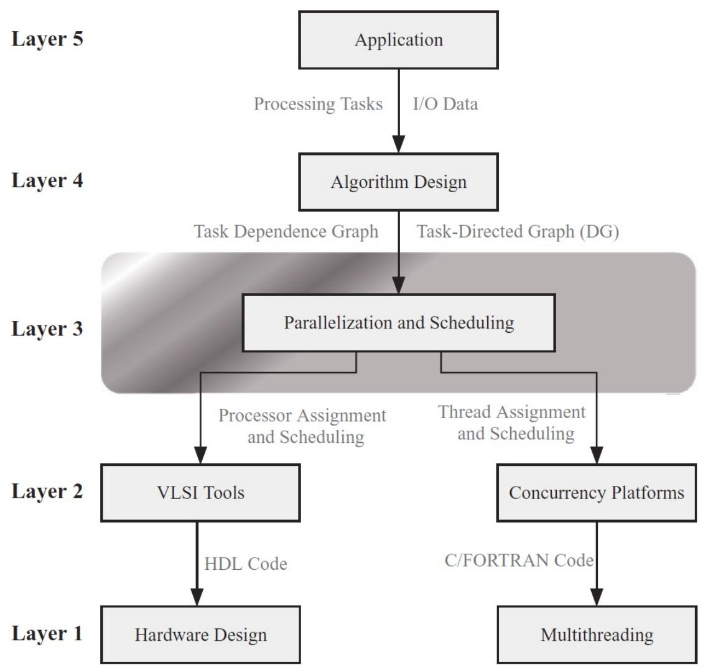
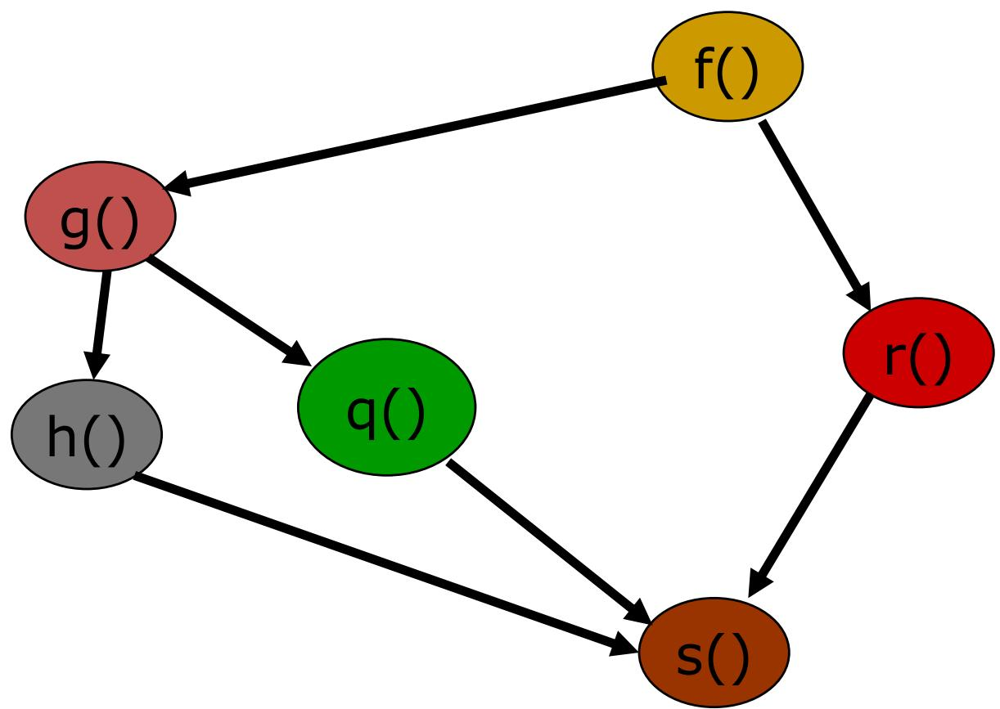

# 并行计算概述

## 目录
- [什么是并行计算](#什么是并行计算)
- [为什么需要并行计算](#为什么需要并行计算)
- [并行计算的应用需求](#并行计算的应用需求)
- [并行计算硬件发展](#并行计算硬件发展)
- [并行程序设计](#并行程序设计)
- [并行化方法](#并行化方法)

## 什么是并行计算

并行计算是指同时使用多个计算资源来解决一个计算问题。简单来说，就是让多个处理器（CPU）一起工作，加快计算速度。

### 基本概念
- **计算**：不仅仅是数学计算，还包括数据处理、信号处理、文本处理等各种信息处理任务
- **性能**：通常用FLOPS（每秒浮点运算次数）来衡量
  - K: 10³（千）
  - M: 10⁶（百万）
  - G: 10⁹（十亿）
  - T: 10¹²（万亿）
  - P: 10¹⁵（千万亿）

**处理器浮点计算能力**：
- 主频 × 每时钟周期浮点指令数（理论上）
- 例如：Xeon D-2146NT 8核，2.3GHz → 73.6G FLOPS
- NV Tesla V100：7 TFLOPS（双精度），112 TFLOPS（Tensor）

## 为什么需要并行计算

### 1. 满足不断增长的计算力需求
- 用更快的硬件（减少每条指令执行时间）
- 优化算法或编译器
- **用多个处理器同时解决一个问题**（这就是并行计算）

### 2. 单处理器性能提升受限
- 1986-2002年：性能每年提升50%（10年增长60倍）
- 2002年以后：每年提升20%（10年仅增长6倍）

### 3. 存储和I/O瓶颈
- 数据访问/传输速度提升远落后于处理器速度

### 4. 硬件发展推动
- 集群广泛应用
- 多核处理器技术普及
- 并行计算环境无处不在

## 并行计算的应用需求

并行计算在各个领域都有广泛应用：

### 1. 天气预报
- 由7个方程构成的方程组
- 网格点尺度决定预报精度
- **精度提高一倍，计算量提高16倍**

### 2. 核物理
- 粒子物理模拟
- 核反应计算

### 3. 工业设计
- 汽车碰撞模拟
- 飞机气动设计
- 产品仿真测试

### 4. 生命科学
- DNA序列分析
- 蛋白质结构预测
- 药物设计

### 5. 宇宙演化
- 星系形成模拟
- 宇宙大爆炸模型

### 6. 高性能计算与互联网应用
- **天猫2019双11**：2684亿元，峰值54.4万订单/秒
- **12306春运**：日点击量峰值1577.8亿次
- **百度**：日均搜索60亿次
- **腾讯微信**：活动用户数10.5亿

### 7. 人工智能应用
- **深蓝（1997）**：32 CPU + 480 VLSI芯片，11.38G FLOPS
- **沃森（2011）**：90台服务器，2800个处理器，80T FLOPS
- **AlphaGo（2016-2017）**：深度学习+强化学习
- **大模型**：参数>10⁹，训练成本数千万到上亿美元

## 并行计算硬件发展

### 超级计算机
- **天河一号**（2010）：造价6亿，电费每天约10万
- **天河二号**（2013）：造价25亿，电费每天约60万
- **神威太湖之光**（2016）：造价18亿，电费每天约20万

### 多核处理器
- IBM、SUN、Intel、AMD等厂商
- 从单核到多核的发展

### 异构计算
- GPU（图形处理器）
- FPGA（现场可编程门阵列）
- AI专用芯片

### 超级计算机面临的问题
1. **应用与研发**
   - 并行程序编制、调试复杂
   - 同步、数据交换困难
   - GPU加速模式复杂
   - 工具支持不足

2. **能源消耗**
   - 东数西算战略

## 并行程序设计

并行程序设计是将计算任务分配给多个处理器执行的过程。

## 并行化方法

### 1. 域分解（Domain Decomposition）
**思路**：先确定数据如何划分到各个处理器，再确定每个处理器需要做什么

**示例：求数组中的最大值**
- 将数组分成若干段
- 每个处理器计算一段的最大值
- 最后汇总得到全局最大值

### 2. 任务分解（Task Decomposition）
**思路**：先将任务划分到各个处理器，再确定各个处理器需要处理的数据

**示例：GUI事件处理**
- 不同处理器处理不同的用户界面事件
- 每个事件可能需要访问不同的数据

### 3. 流水线（Pipelining）
**思路**：将任务分成多个阶段，不同处理器负责不同阶段

**示例：洗衣流程**
- 洗衣：30分钟
- 烘干：40分钟  
- 叠衣：20分钟
- 串行：每人需90分钟
- 流水线并行：3.5小时完成4人洗衣

**指令级流水线**：
- IF（取指令）
- ID（译码）
- EX（执行）
- MA（访存）
- WB（写回）

## 重要概念

### FLOPS
- **定义**：每秒浮点运算次数（Floating-point Operations Per Second）
- **用途**：衡量计算机性能的重要指标
- **换算**：1 GFLOPS = 10⁹ FLOPS，1 TFLOPS = 10¹² FLOPS

### 并行计算的优势
1. **提高计算速度**：多个处理器同时工作
2. **处理更大规模问题**：可以处理单机无法处理的数据量
3. **提高资源利用率**：充分利用多核处理器能力
4. **降低成本**：用多个便宜处理器替代昂贵大型机

### 并行计算的挑战
1. **程序设计复杂**：需要考虑同步、通信等问题
2. **负载均衡**：如何让各处理器工作量均匀
3. **数据依赖**：处理任务间的依赖关系
4. **调试困难**：并行程序错误难以复现和调试

## 学习建议
1. 先理解串行算法，再学习并行化方法
2. 从简单的并行模式开始（如域分解）
3. 注意理解并行程序中的同步机制
4. 多实践，从简单的并行程序开始编写

## 参考资料
- 课程PPT
- 《并行计算》教材
- Top500超级计算机排行榜