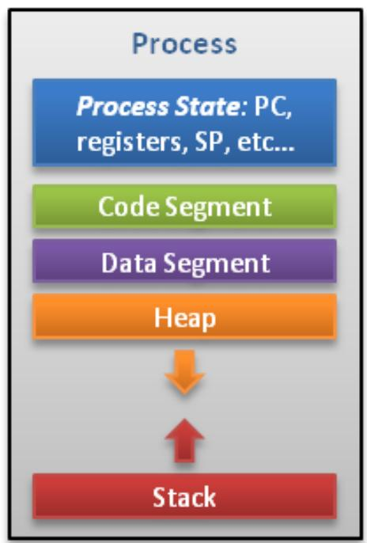
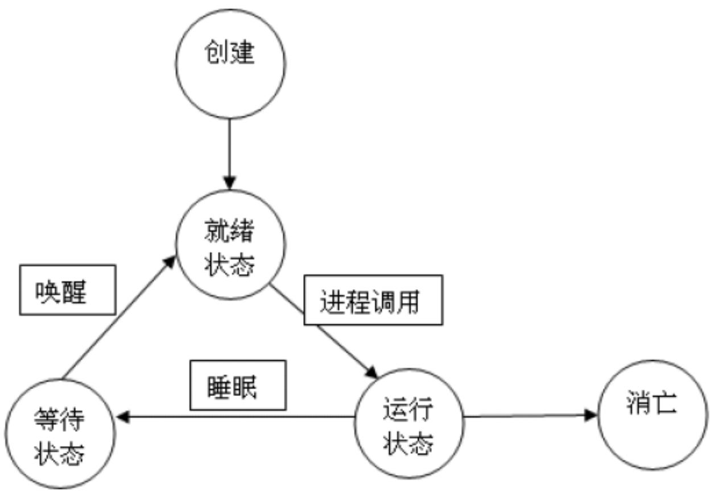
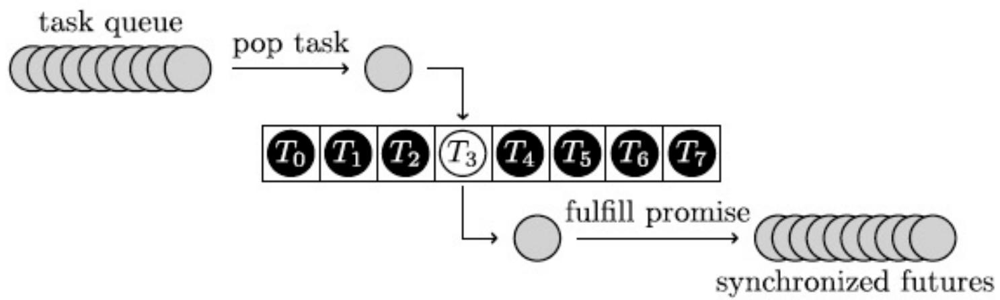
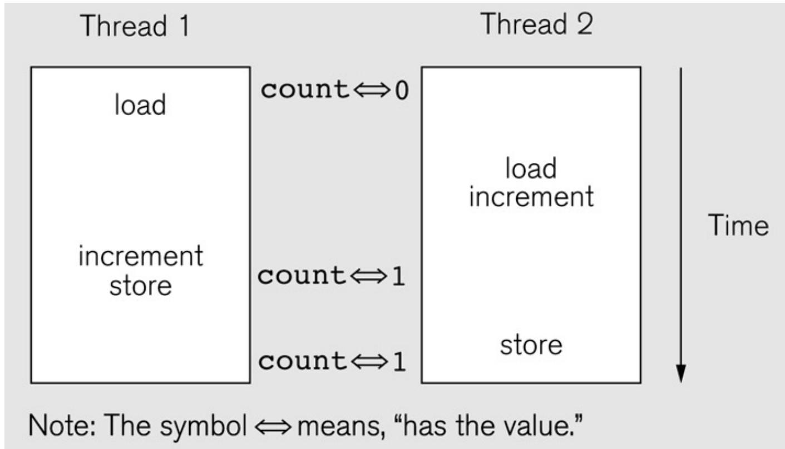
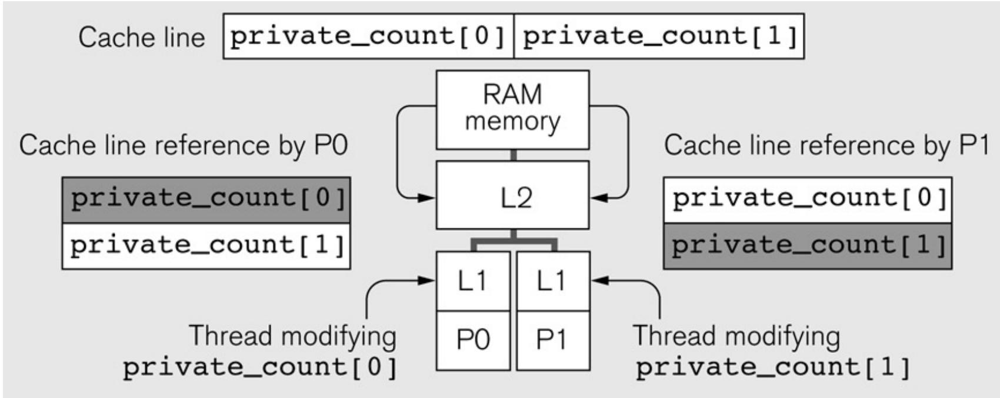

# 多线程并行程序设计

## 目录
- [多线程基本概念](#多线程基本概念)
- [共享存储访问问题](#共享存储访问问题)
- [多线程算法实例分析](#多线程算法实例分析)
- [PThread多线程编程](#pthread多线程编程)
- [Java多线程编程](#java多线程编程)

## 多线程基本概念

### 线程与进程的区别

#### 进程（Process）
- 资源分配的实体
- 拥有独立的内存空间
- 创建和切换开销大

#### 线程（Thread）
- 被调度执行的基本单元
- 又称"轻量级进程"
- 共享进程的内存空间
- 创建和切换开销小



### 线程与进程的对比

| 方面 | 进程 | 线程 |
|------|------|------|
| **调度** | CPU调度和分派的基本单位 | CPU调度的基本单位 |
| **并发性** | 进程间并发 | 进程内线程间并发 |
| **拥有资源** | 拥有系统资源 | 不拥有系统资源（除栈和寄存器） |
| **系统开销** | 创建/撤销开销大 | 创建/撤销开销小 |
| **切换开销** | 涉及整个CPU环境 | 只需保存少量寄存器 |

### 线程的层次

1. **用户级线程**：通过线程库实现，不涉及系统调用
2. **核心级线程**：操作系统直接支持
3. **硬件线程**：在硬件执行资源上的表现形式

### 线程的生命周期
```
创建 → 就绪 → 运行 → 阻塞 → 终止
```



### 线程池（Thread Pool）
- 维护多个线程等待调度器分配任务
- **优点**：
  - 避免频繁创建和销毁线程的开销
  - 保证内核充分利用
  - 防止过分调度
- **线程数量**：取决于可用的并发处理器、核心数、内存等



## 共享存储访问问题

### 缓存一致性（Cache Coherence）
**问题**：在多处理器系统中，保证各缓存中数据与主存数据一致

**解决方案**：
- 监听协议（Snooping）
- 目录协议（Directory）


### 竞态条件（Race Conditions）
**定义**：多个线程同时访问共享数据，结果取决于线程执行顺序

**示例**：
```c
// 两个线程同时执行
x = x + 1;
```
可能的结果：
1. 线程1读取x（假设x=5）
2. 线程2读取x（x=5）
3. 线程1计算x+1=6，写入x
4. 线程2计算x+1=6，写入x
5. 最终x=6，而不是期望的7



### 临界区（Critical Section）
**定义**：访问共享数据的一段代码，需要保证互斥访问

**特点**：
- 任意时刻至多只能有一个线程在临界区内执行
- 其他线程必须等待

**结构**：
```
进入区 → 临界区 → 退出区 → 剩余区
```

### 互斥锁（Mutex）
**定义**：实现线程间同步的机制，保证互斥访问

**工作原理**：
1. 线程访问共享资源前必须先获得锁
2. 如果锁已被其他线程占用，则等待
3. 只有当前占有锁的线程才能释放锁

**示例**：
```c
mutex.lock();
// 临界区代码
mutex.unlock();
```

### 死锁（Deadlock）
**定义**：多个线程互相等待对方释放资源，导致都无法继续执行

**产生条件**（同时满足）：
1. 互斥条件
2. 占有并等待
3. 非抢占条件
4. 循环等待

**预防方法**：
- 破坏四个条件之一
- 使用资源有序分配法

## 多线程算法实例分析

### 实验环境
- 多核计算机系统
- 数组规模：50M
- 随机分布30%的数值3

### 算法1：无同步的并行计数
**问题**：直接对共享变量count++，产生竞态条件

```c
// 线程函数
void count3s_thread(int id) {
    int length_per_thread = length / t;
    int start = id * length_per_thread;
    
    for (i = start; i < start + length_per_thread; i++) {
        if (array[i] == 3) {
            count++;  // 竞态条件！
        }
    }
}
```

**结果**：不能获得正确结果

### 算法2：加互斥锁
**改进**：使用互斥锁保护临界区

```c
void count3s_thread(int id) {
    int length_per_thread = length / t;
    int start = id * length_per_thread;
    
    for (i = start; i < start + length_per_thread; i++) {
        if (array[i] == 3) {
            mutex_lock(m);
            count++;
            mutex_unlock(m);
        }
    }
}
```

**性能**：正确但效率低，每次都要获取锁

### 算法3：使用私有变量
**改进**：每个线程使用私有计数器，最后汇总

```c
int private_count[MaxThreads];

void count3s_thread(int id) {
    int length_per_thread = length / t;
    int start = id * length_per_thread;
    
    for (i = start; i < start + length_per_thread; i++) {
        if (array[i] == 3) {
            private_count[id]++;
        }
    }
    
    mutex_lock(m);
    count += private_count[id];
    mutex_unlock(m);
}
```

**性能**：显著提升，减少锁竞争

### 算法4：避免伪共享（False Sharing）
**问题**：private_count[0]和private_count[1]在同一个缓存行中，导致缓存失效

**解决方案**：填充数据结构，使不同线程的计数器在不同缓存行

```c
struct padded_int {
    int value;
    char padding[60];  // 填充到64字节
} private_count[MaxThreads];
```

**性能**：进一步提升，避免缓存行冲突



## PThread多线程编程

### POSIX Thread简介
- **POSIX**：可移植操作系统接口
- **PThread**：POSIX线程标准
- 提供源代码级软件可移植性

### 主要函数

#### 1. pthread_create() - 创建线程
```c
int pthread_create(
    pthread_t *tid,                    // 线程ID
    const pthread_attr_t *attr,        // 线程属性
    void *(*startRoutine)(void *),     // 线程函数
    void *arg                          // 参数
);
```

#### 2. pthread_join() - 等待线程结束
```c
int pthread_join(
    pthread_t tid,      // 要等待的线程ID
    void **status       // 退出状态
);
```

#### 3. pthread_self() - 获取线程ID
```c
pthread_t pthread_self();
```

#### 4. pthread_equal() - 比较线程ID
```c
int pthread_equal(pthread_t t1, pthread_t t2);
```

#### 5. pthread_exit() - 线程退出
```c
void pthread_exit(void *status);
```

#### 6. pthread_cancel() - 取消线程
```c
int pthread_cancel(pthread_t thread);
```

#### 7. pthread_detach() - 分离线程
```c
int pthread_detach(pthread_t thread);
```

### 示例：积分法求π

#### 串行代码
```c
double factor = 1.0;
double sum = 0.0;
for (i = 0; i < n; i++, factor = -factor) {
    sum += factor / (2*i+1);
}
pi = 4.0 * sum;
```

#### 并行代码（有竞态条件）
```c
void* Thread_sum(void* rank) {
    long my_rank = (long) rank;
    double factor;
    long long i;
    long long my_n = n / thread_count;
    long long my_first_i = my_n * my_rank;
    long long my_last_i = my_first_i + my_n;
    
    if (my_first_i % 2 == 0)
        factor = 1.0;
    else
        factor = -1.0;
    
    for (i = my_first_i; i < my_last_i; i++, factor = -factor) {
        sum += factor / (2*i+1);  // 竞态条件！
    }
    
    return NULL;
}
```

#### 改进：使用Busy-waiting
```c
void* Thread_sum(void* rank) {
    // ... 初始化 ...
    
    for (i = my_first_i; i < my_last_i; i++, factor = -factor) {
        while (flag != my_rank);  // 等待轮到自己
        sum += factor / (2*i+1);
        flag = (flag+1) % thread_count;  // 传递给下一个线程
    }
    
    return NULL;
}
```

#### 改进：使用Mutex
```c
void* Thread_sum(void* rank) {
    // ... 初始化 ...
    double my_sum = 0.0;  // 私有变量
    
    for (i = my_first_i; i < my_last_i; i++, factor = -factor) {
        my_sum += factor / (2*i+1);  // 计算私有和
    }
    
    pthread_mutex_lock(&mutex);
    sum += my_sum;  // 一次性更新共享变量
    pthread_mutex_unlock(&mutex);
    
    return NULL;
}
```

#### 性能比较
| 线程数 | Busy-waiting | Mutex |
|--------|--------------|-------|
| 1 | 2.90s | 2.90s |
| 2 | 1.45s | 1.45s |
| 4 | 0.73s | 0.73s |
| 8 | 0.38s | 0.38s |
| 16 | 0.50s | 0.38s |
| 32 | 0.80s | 0.40s |
| 64 | 3.56s | 0.38s |

**结论**：Mutex在多线程时性能更好

### 条件变量（Condition Variable）

#### 作用
- 通知共享数据状态信息
- 当特定条件满足时，等待或唤醒其他线程
- 需要与互斥锁配合使用

#### 主要操作
1. **pthread_cond_signal**：唤醒一个等待线程
2. **pthread_cond_broadcast**：唤醒所有等待线程
3. **pthread_cond_wait**：等待条件变量

#### 示例
```c
pthread_mutex_t mutex = PTHREAD_MUTEX_INITIALIZER;
pthread_cond_t cond = PTHREAD_COND_INITIALIZER;

void *thread1(void *) {
    for (i = 1; i <= 9; i++) {
        pthread_mutex_lock(&mutex);
        if (i % 3 == 0)
            pthread_cond_signal(&cond);  // 通知thread2
        else
            printf("thread1: %d\n", i);
        pthread_mutex_unlock(&mutex);
        sleep(1);
    }
}

void *thread2(void *) {
    while (i < 9) {
        pthread_mutex_lock(&mutex);
        if (i % 3 != 0)
            pthread_cond_wait(&cond, &mutex);  // 等待条件
        printf("thread2: %d\n", i);
        pthread_mutex_unlock(&mutex);
        sleep(1);
    }
}
```

## Java多线程编程

### 创建线程的方法

#### 方法1：继承Thread类
```java
class UserThread extends Thread {
    int sleepTime;
    
    public UserThread(String id) {
        super(id);
        sleepTime = (int)(Math.random() * 1000);
    }
    
    public void run() {
        System.out.println("运行的线程是：" + getName());
        try {
            Thread.sleep(sleepTime);
        } catch (InterruptedException e) {
            System.err.println("运行异常：" + e.toString());
        }
    }
}

// 使用
UserThread t1 = new UserThread("NO 1");
t1.start();
```

#### 方法2：实现Runnable接口
```java
class UserMultThread implements Runnable {
    int num;
    
    UserMultThread(int n) {
        num = n;
    }
    
    public void run() {
        for (int i = 0; i < 3; i++) {
            System.out.println("运行线程：" + num);
        }
        System.out.println("结束：" + num);
    }
}

// 使用
Thread mt1 = new Thread(new UserMultThread(1));
mt1.start();
mt1.join();  // 等待线程结束
```

### 线程调度模型
- 选择就绪状态中优先级最高的线程
- 相同优先级的线程轮流调度

### 同步方法（synchronized）

#### 作用
- 实现线程同步
- 保证同一时刻只有一个线程访问对象

#### 使用方法
1. **锁定对象**：
```java
synchronized (objRef) {
    // 需要同步的代码
}
```

2. **锁定方法**：
```java
synchronized void method() {
    // 方法体
}
```

#### 注意事项
- 不能对run()方法加锁
- 不能对构造函数加锁

## 最佳实践

### 1. 减少锁竞争
- 使用私有变量减少共享数据访问
- 缩短临界区代码长度
- 使用读写锁（读多写少场景）

### 2. 避免死锁
- 按顺序获取锁
- 使用超时机制
- 避免嵌套锁

### 3. 注意伪共享
- 填充数据结构到缓存行大小
- 对齐数据访问

### 4. 选择合适的同步机制
- **Mutex**：简单互斥
- **条件变量**：复杂同步
- **信号量**：资源计数
- **读写锁**：读多写少

### 5. 性能优化
- 减少线程创建销毁次数（使用线程池）
- 合理设置线程数量（通常等于CPU核心数）
- 使用无锁数据结构（高级技巧）

## 常见问题及解决方案

### 问题1：竞态条件
**解决方案**：使用互斥锁保护临界区

### 问题2：死锁
**解决方案**：
- 按顺序获取锁
- 使用`pthread_mutex_trylock()`
- 设置超时

### 问题3：性能低下
**解决方案**：
- 减少锁粒度
- 使用私有变量
- 避免伪共享

### 问题4：线程安全
**解决方案**：
- 使用线程安全的数据结构
- 避免全局变量
- 使用不可变对象

## 学习建议

1. **理解基础概念**：先掌握线程、进程、同步等基本概念
2. **从简单开始**：先编写简单的多线程程序
3. **注意调试**：多线程程序调试困难，要善用日志
4. **性能测试**：测试不同线程数的性能表现
5. **阅读源码**：学习优秀开源项目的多线程实现

## 参考资料
- 课程PPT
- 《POSIX多线程编程》
- Java并发编程实战
- PThread官方文档