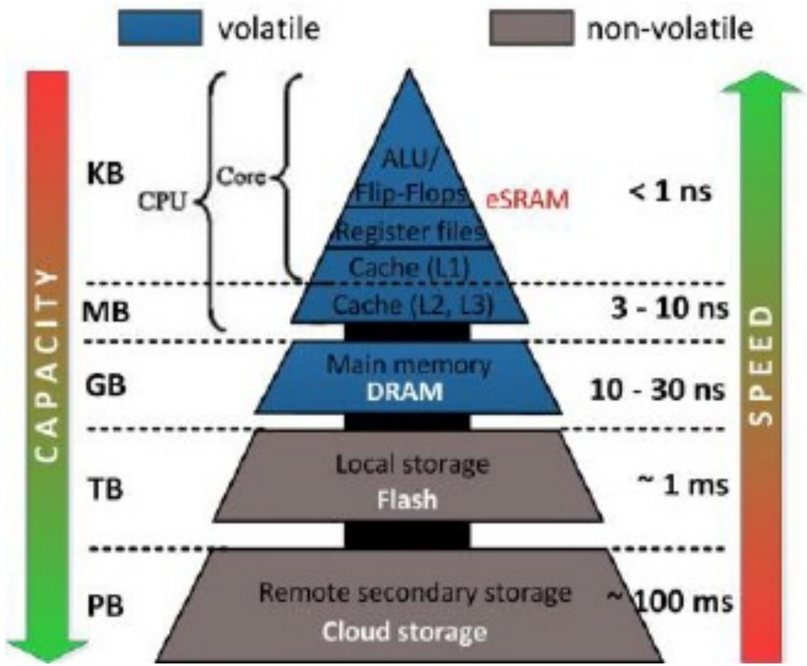
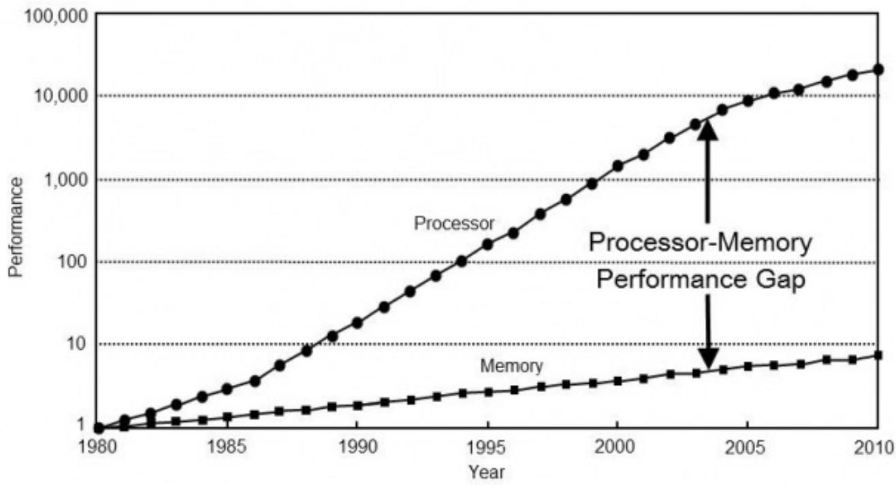

# 并行计算的性能评测

> [!tip] 本章重点
> 理解并行计算性能评测的核心指标：**加速比、效率、代价**，以及**内存系统**对性能的影响。

## 📑 目录

1. [并行计算的性能](#并行计算的性能)
2. [内存系统对性能的影响](#内存系统对性能的影响)
3. [加速比定律](#加速比定律)
4. [可扩放性评测](#可扩放性评测)

---

## 并行计算的性能

### 什么是性能？

**性能（Performance）**：通常指机器的**速度**，是程序执行时间的倒数。

$$
\text{性能} = \frac{1}{\text{执行时间}}
$$

**通俗理解**：就像汽车的速度一样，完成一个任务越快，性能就越高。

### 执行时间的组成

- **用户响应时间**：包括访问磁盘、存储器、CPU时间、I/O时间和操作系统开销
- **CPU时间**：CPU实际工作时间，不包括I/O等待和其他任务时间

### 为什么要进行性能评测？

| 角色 | 目的 |
|------|------|
| **管理员** | 发挥并行机长处，提高使用效率 |
| **用户** | 减少购机盲目性，降低投资风险 |
| **架构师** | 改进系统结构设计，优化"结构-算法-应用"组合 |
| **市场人士** | 提供客观、公正的评价标准 |

### 计算量度量

**工作负载（计算量/任务量）**：
- 计算执行时间（t，真实世界时间）
- 浮点运算数（FLOPS）
- 指令数目（MIPS）

**并行计算执行时间**：

$$
t_p = t_{comp} + t_{paro} + t_{comm}
$$

其中：
- $t_{comp}$：计算时间
- $t_{paro}$：并行开销时间  
- $t_{comm}$：通信时间

### 并行计算性能指标

#### 1. 加速比（Speedup）

**定义**：串行执行时间与并行执行时间之比

$$
S(n) = \frac{\text{单处理器执行时间}}{\text{多处理器执行时间}} = \frac{t_s}{t_p}
$$

**通俗理解**：就像10个人一起搬砖比1个人搬砖快多少倍。

#### 2. 计算/通信比

$$
\frac{\text{计算时间}}{\text{通信时间}} = \frac{t_{comp}}{t_{comm}}
$$

**意义**：这个比值越大，并行效率通常越高。

#### 3. 开销来源

- 部分处理器空闲
- 并行版本中的额外计算
- 消息通信时间

#### 4. 效率（Efficiency）

$$
E = \frac{t_s}{t_p \times n} = \frac{S(n)}{n}
$$

**通俗理解**：如果n个处理器一起工作，效率就是实际加速比与理想加速比（n倍）的比值。

#### 5. 代价（Cost）

$$
\text{代价} = \text{执行时间} \times \text{处理器总数}
$$

**意义**：衡量并行计算的资源消耗。

---

## 内存系统对性能的影响

### 存储器层次与度量

**三个关键指标**：
- **容量（C）**：能保存数据的字节数
- **延迟（L）**：读取一个字所需时间
- **带宽（B）**：1秒内传送的字节数

### 延迟 vs 带宽

**消防龙头比喻**：
- **延迟**：打开消防龙头后2秒水才流出
- **带宽**：水管每秒能流出5加仑水

**应用场景**：
- 想立刻扑灭火灾 → 减少延迟
- 想扑灭更大的火 → 提高带宽

### 内存延迟示例

考虑一个1GHz处理器（1纳秒时钟），DRAM延迟100纳秒（无高速缓存）：
- 处理器峰值：4GFLOPS
- 每次内存访问需等待100个周期
- 计算点积：每次浮点运算需取一次数据
- 实际速度：10MFLOPS（仅峰值的0.25%）

### 高速缓存的作用

**高速缓存**：处理器与DRAM之间的更小但更快的内存单元。

**关键概念**：
- **缓存命中率**：由高速缓存提供的数据份额
- **时间本地性**：对相同数据项的重复引用
- **空间本地性**：连续的数据字被连续指令使用

### 提高性能的策略

1. **利用时间本地性**：重复使用相同数据
2. **利用空间本地性**：确保连续计算使用连续数据
3. **优化数据布局**：合理组织计算次序
4. **提高计算/内存访问比**：减少内存访问次数

---

## 加速比定律

### 核心参数定义

| 符号 | 含义 |
|------|------|
| $P$ | 处理器数 |
| $W$ | 问题规模（总计算量） |
| $W_s$ | 串行分量，$f = W_s/W$ |
| $W_p$ | 可并行化部分，$1-f$ |
| $T_s$ | 串行执行时间 |
| $T_p$ | 并行执行时间 |
| $S$ | 加速比 |
| $E$ | 效率 |

### 1. Amdahl定律

**出发点**：固定不变的计算负载

**核心思想**：程序中串行部分限制了加速比的上限。

**公式**：

$$
S = \frac{p}{1 + f(p - 1)}
$$

当 $p \to \infty$ 时，$S_{max} = \frac{1}{f}$

**通俗理解**：如果一个程序有10%是串行的（f=0.1），那么无论用多少处理器，最大加速比只能是10倍。

**考虑额外开销**：

$$
S = \frac{p}{1 + f(p - 1) + W_p / W}
$$

### 2. Gustafson定律

**出发点**：固定执行时间，增大计算量

**核心思想**：在实际应用中，增加处理器时应该相应增大问题规模。

**公式**：

$$
S' = p - f(p - 1)
$$

**通俗理解**：如果给定固定时间（如1小时），用更多处理器可以解决更大规模的问题。

### 3. Sun-Ni定律

**出发点**：存储容量受限

**核心思想**：只要存储空间许可，应尽量增大问题规模以产生更好和更精确的解。

**存储受限加速公式**：

$$
S'' = \frac{f + (1 - f)G(p)}{f + (1 - f)G(p)/p}
$$

其中 $G(p)$ 反映存储容量增加到p倍时并行工作负载的增加量。

### 三大定律对比

| 定律 | 出发点 | 适用场景 |
|------|--------|----------|
| **Amdahl** | 固定负载 | 计算密集型，问题规模固定 |
| **Gustafson** | 固定时间 | 需要在固定时间内提高精度 |
| **Sun-Ni** | 存储受限 | 内存受限，需要充分利用存储 |

---

## 可扩放性评测

### 什么是可扩放性？

**可扩放性（Scalability）**：计算机系统（或算法、程序）性能随处理器数增加而按比例提高的能力。

### 影响加速比的因素

1. 求解问题中的串行分量
2. 并行处理引起的额外开销（通信、等待、竞争、冗余操作、同步）
3. 处理器数超过算法并发程度

### 等效率度量标准

**核心公式**：

$$
E = \frac{1}{1 + \frac{T_o}{W}}
$$

**意义**：
- 为了维持一定效率，当处理器数p增大时，需要相应增大问题规模W
- **曲线1**：算法具有很好的扩放性
- **曲线2**：算法是可扩放的
- **曲线3**：算法是不可扩放的

### 实际应用建议

1. **选择合适的并行算法**：根据问题特性选择
2. **优化通信开销**：减少不必要的通信
3. **负载均衡**：确保各处理器工作量均衡
4. **利用局部性**：充分利用缓存和内存层次

---

## 📝 实验与练习

### 计算题示例

**问题**：一个程序串行部分占20%（f=0.2），使用8个处理器，计算：
1. Amdahl定律下的加速比
2. Gustafson定律下的加速比

**解答**：
1. Amdahl：$S = \frac{8}{1 + 0.2 \times (8-1)} = \frac{8}{2.4} ≈ 3.33$
2. Gustafson：$S' = 8 - 0.2 \times (8-1) = 8 - 1.4 = 6.6$

### 思考题

1. 为什么实际加速比往往低于理论值？
2. 如何提高程序的计算/通信比？
3. 在什么情况下应该选择Amdahl定律，在什么情况下选择Gustafson定律？

---

> [!note] 关键术语
> - **加速比（Speedup）**：串行时间与并行时间之比
> - **效率（Efficiency）**：加速比与处理器数之比
> - **可扩放性（Scalability）**：性能随资源增加而提升的能力
> - **时间局部性（Temporal Locality）**：重复访问相同数据
> - **空间局部性（Spatial Locality）**：访问相邻数据