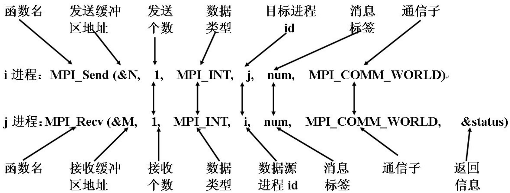

# MPI基础

> [!tip] 本章重点
> 理解**MPI**的基本概念、**点对点通信**、**组通信**和**阻塞通信模式**，能够编写简单的MPI程序。

## 📑 目录

1. [MPI概述](#mpi概述)
2. [MPI程序结构](#mpi程序结构)
3. [点对点通信](#点到点通信)
4. [组通信](#组通信)
5. [阻塞通信模式](#阻塞通信模式)
6. [集群与作业管理](#集群与作业管理)

---

## MPI概述

### 什么是MPI？

**MPI**（Message Passing Interface）是一种**消息传递编程模型**的标准或规范，而不是特指某一个具体实现。

**核心特点**：
- **标准规范**：所有并行计算机制造商都提供支持
- **消息传递**：通过发送和接收消息进行通信
- **库实现**：MPI是一个库，而不是一门语言
- **语言扩展**：FORTRAN+MPI或C+MPI可看作并行语言

### MPI与OpenMP对比

| 特性 | MPI | OpenMP |
|------|-----|--------|
| **内存模型** | 分布式内存 | 共享内存 |
| **通信方式** | 显式消息传递 | 直接内存访问 |
| **编程复杂度** | 相对复杂 | 相对简单 |
| **扩展性** | 优秀（适合集群） | 有限（适合多核） |
| **数据分布** | 显式数据分布 | 隐式数据共享 |

### SPMD模式

**SPMD**（Single Program Multiple Data）：单程序多数据


**说明**：
- 所有进程运行相同的程序
- 每个进程处理不同的数据
- 通过进程编号（rank）区分不同进程

---

## MPI程序结构

### 基本结构

```c
#include <mpi.h>

int main(int argc, char *argv[]) {
    // 1. 初始化MPI环境
    MPI_Init(&argc, &argv);
    
    // 2. 获取进程信息
    int rank, size;
    MPI_Comm_rank(MPI_COMM_WORLD, &rank);  // 获取进程编号
    MPI_Comm_size(MPI_COMM_WORLD, &size);  // 获取进程总数
    
    // 3. 并行计算代码
    // ... 使用MPI函数进行通信 ...
    
    // 4. 终止MPI环境
    MPI_Finalize();
    
    return 0;
}
```

### 六个基本接口

#### 1. 开始与结束

```c
MPI_Init(&argc, &argv);      // 初始化MPI环境
MPI_Finalize();              // 终止MPI环境
```

**注意**：
- `MPI_Init`必须是第一个MPI调用
- `MPI_Finalize`必须是最后一个MPI调用
- 没有`MPI_Finalize`，程序将不会终止

#### 2. 进程身份标识

```c
MPI_Comm_size(MPI_COMM_WORLD, &size);   // 获取通信域内进程数目
MPI_Comm_rank(MPI_COMM_WORLD, &myrank); // 获取进程在通信域的编号
```

**通信域**：进程组和上下文的组合，缺省为`MPI_COMM_WORLD`

#### 3. 发送与接收消息

```c
MPI_Send(buffer, count, datatype, destination, tag, communicator);
MPI_Recv(address, count, datatype, source, tag, communicator, status);
```

### Hello World示例

```c
#include <stdio.h>
#include <mpi.h>

int main(int argc, char *argv[]) {
    int err;
    
    err = MPI_Init(&argc, &argv);
    printf("Hello world!\n");
    err = MPI_Finalize();
    
    return 0;
}
```

---

## 点到点通信

### 基本概念

**点到点通信**：两个进程之间的消息传递。



**特点**：
- 每条消息有**唯一发送进程**
- 每条消息有**唯一接收进程**
- 通信是**双向的**（发送和接收）

### MPI_Send详解

**函数原型**：
```c
int MPI_Send(
    void *buf,           // 发送缓冲区起始地址
    int count,           // 数据项个数
    MPI_Datatype datatype, // 数据类型
    int dest,            // 目标进程编号
    int tag,             // 消息标签
    MPI_Comm comm        // 通信域
);
```

**参数说明**：
1. **buf**：指向发送数据的指针
2. **count**：发送数据项的数量
3. **datatype**：数据类型（如MPI_INT、MPI_FLOAT）
4. **dest**：目标进程的rank
5. **tag**：消息标签，用于区分不同消息
6. **comm**：通信域

**示例**：
```c
int N = 100;
MPI_Send(&N, 1, MPI_INT, 1, 0, MPI_COMM_WORLD);
```

### MPI_Recv详解

**函数原型**：
```c
int MPI_Recv(
    void *buf,           // 接收缓冲区起始地址
    int count,           // 最大数据项个数
    MPI_Datatype datatype, // 数据类型
    int source,          // 源进程编号
    int tag,             // 消息标签
    MPI_Comm comm,       // 通信域
    MPI_Status *status   // 状态信息
);
```

**参数说明**：
1. **buf**：指向接收数据的指针
2. **count**：最多接收的数据项数量
3. **datatype**：数据类型
4. **source**：源进程的rank（MPI_ANY_SOURCE表示任意源）
5. **tag**：消息标签（MPI_ANY_TAG表示任意标签）
6. **comm**：通信域
7. **status**：状态信息结构

**示例**：
```c
int tmp;
MPI_Status status;
MPI_Recv(&tmp, 1, MPI_INT, 0, 0, MPI_COMM_WORLD, &status);
```

### 状态信息

**MPI_Status结构**：
- `status.MPI_SOURCE`：源进程编号
- `status.MPI_TAG`：消息标签
- `MPI_Get_count(&status, MPI_INT, &count)`：实际接收的数据项数

### 消息标签的作用

**为什么需要标签？**

**问题场景**：
```c
// 进程P
send(A, 32, Q);
recv(X, 32, P);

send(B, 16, Q);
recv(Y, 16, P);
```

如果消息B先到达，会被第一个recv接收，导致错误。

**解决方案**：
```c
// 进程P
send(A, 32, Q, tag1);
recv(X, 32, P, tag1);

send(B, 16, Q, tag2);
recv(Y, 16, P, tag2);
```

**标签的其他用途**：
- 区分不同类型的消息
- 简化服务请求处理
- 实现复杂通信模式

### 消息传递过程


**系统缓存**：
- 发送消息可能被系统缓存
- 接收消息从系统缓存获取
- 缓冲机制由MPI系统决定

---

## 组通信

### 通信类型分类

| 类型 | 操作 | 说明 |
|------|------|------|
| **一到多** | Broadcast, Scatter | 一个进程发送给多个进程 |
| **多到一** | Reduce, Gather | 多个进程发送给一个进程 |
| **多到多** | Allreduce, Allgather | 所有进程互相通信 |
| **同步** | Barrier | 同步所有进程 |

### 1. 广播（Broadcast）

**函数原型**：
```c
int MPI_Bcast(
    void *buf,           // 缓冲区起始地址
    int count,           // 数据项个数
    MPI_Datatype datatype, // 数据类型
    int root,            // 发送进程编号
    MPI_Comm comm        // 通信域
);
```

**功能**：标号为root的进程发送相同的消息给通信域中所有进程。


**示例**：
```c
int rank, value;
MPI_Init(&argc, &argv);
MPI_Comm_rank(MPI_COMM_WORLD, &rank);

if (rank == 0) {
    scanf("%d", &value);
}

MPI_Bcast(&value, 1, MPI_INT, 0, MPI_COMM_WORLD);
printf("Process %d got %d\n", rank, value);

MPI_Finalize();
```

### 2. 散射（Scatter）

**函数原型**：
```c
int MPI_Scatter(
    void *sendbuf,       // 发送缓冲区
    int sendcount,       // 每个进程接收的数据项数
    MPI_Datatype sendtype, // 发送数据类型
    void *recvbuf,       // 接收缓冲区
    int recvcount,       // 接收数据项数
    MPI_Datatype recvtype, // 接收数据类型
    int root,            // 发送进程编号
    MPI_Comm comm        // 通信域
);
```

**功能**：root进程向所有n个进程各发送一个不同的消息。


**示例**：
```c
MPI_Comm comm;
int gsize, *sendbuf;
int root, rbuf[100];

MPI_Comm_size(comm, &gsize);
sendbuf = (int *)malloc(gsize * 100 * sizeof(int));

MPI_Scatter(sendbuf, 100, MPI_INT, rbuf, 100, MPI_INT, root, comm);
```

### 3. 聚集（Gather）

**函数原型**：
```c
int MPI_Gather(
    void *sendbuf,       // 发送缓冲区
    int sendcount,       // 发送数据项数
    MPI_Datatype sendtype, // 发送数据类型
    void *recvbuf,       // 接收缓冲区
    int recvcount,       // 从每个进程接收的数据项数
    MPI_Datatype recvtype, // 接收数据类型
    int root,            // 接收进程编号
    MPI_Comm comm        // 通信域
);
```

**功能**：root进程接收各个进程的消息，按rank顺序存放。


**示例**：
```c
MPI_Comm comm;
int gsize, sendarray[100];
int root, *rbuf;

MPI_Comm_size(comm, &gsize);
rbuf = (int *)malloc(gsize * 100 * sizeof(int));

MPI_Gather(sendarray, 100, MPI_INT, rbuf, 100, MPI_INT, root, comm);
```

### 4. 全局聚集（Allgather）

**函数原型**：
```c
int MPI_Allgather(
    void *sendbuf,       // 发送缓冲区
    int sendcount,       // 发送数据项数
    MPI_Datatype sendtype, // 发送数据类型
    void *recvbuf,       // 接收缓冲区
    int recvcount,       // 从每个进程接收的数据项数
    MPI_Datatype recvtype, // 接收数据类型
    MPI_Comm comm        // 通信域
);
```

**功能**：每个进程都从其他进程收集数据，存入自己的缓冲区。

**示例**：
```c
MPI_Comm comm;
int gsize, sendarray[100];
int *rbuf;

MPI_Comm_size(comm, &gsize);
rbuf = (int *)malloc(gsize * 100 * sizeof(int));

MPI_Allgather(sendarray, 100, MPI_INT, rbuf, 100, MPI_INT, comm);
```

### 5. 归约（Reduce）

**函数原型**：
```c
int MPI_Reduce(
    void *sendbuf,       // 发送缓冲区
    void *recvbuf,       // 接收缓冲区
    int count,           // 数据项数
    MPI_Datatype datatype, // 数据类型
    MPI_Op op,           // 归约操作
    int root,            // 接收进程编号
    MPI_Comm comm        // 通信域
);
```

**归约操作**：
- `MPI_MAX`：最大值
- `MPI_MIN`：最小值
- `MPI_SUM`：求和
- `MPI_PROD`：乘积
- `MPI_LAND`：逻辑与
- `MPI_BAND`：按位与
- `MPI_LOR`：逻辑或
- `MPI_BOR`：按位或
- `MPI_LXOR`：逻辑异或
- `MPI_BXOR`：按位异或


**示例**：
```c
int inbuf, outbuf, root;
MPI_Comm comm;

// 所有进程的inbuf值求和，结果存入root进程的outbuf
MPI_Reduce(&inbuf, &outbuf, 1, MPI_INT, MPI_SUM, root, comm);
```

### 6. 全局归约（Allreduce）

**功能**：与reduce类似，但所有进程都将获得结果。


### 7. 归约散射（Reduce_scatter）

**功能**：将归约结果散播到所有进程中。

### 8. 前缀归约（Scan）

**功能**：每一个进程都对排在它前面的进程进行归约操作。

### 9. 全局交换（Alltoall）

**功能**：每个进程依次将它的发送缓冲区的第i块数据发送给第i个进程。

### 10. 屏障同步（Barrier）

**函数原型**：
```c
int MPI_Barrier(MPI_Comm comm);
```

**功能**：同步所有进程，先到达的进程等待其他进程。


---

## 阻塞通信模式

### 四种通信模式

1. **标准通信模式**（MPI_Send）
2. **缓存通信模式**（MPI_Bsend）
3. **同步通信模式**（MPI_Ssend）
4. **就绪通信模式**（MPI_Rsend）

### 1. 标准通信模式

**特点**：
- 是否缓存数据由MPI系统决定
- 发送操作可能阻塞也可能不阻塞
- 最常用的通信模式

### 2. 缓存通信模式

**函数原型**：
```c
int MPI_Bsend(void *buf, int count, MPI_Datatype datatype, 
              int dest, int tag, MPI_Comm comm);
```

**特点**：
- 用户直接管理通信缓冲区
- 发送操作总是立即返回
- 需要用户申请和释放缓冲区

**相关函数**：
```c
MPI_Buffer_attach(buffer, size);   // 申请缓冲区
MPI_Buffer_detach(buffer, size);   // 释放缓冲区
```

### 3. 同步通信模式

**函数原型**：
```c
int MPI_Ssend(void *buf, int count, MPI_Datatype datatype,
              int dest, int tag, MPI_Comm comm);
```

**特点**：
- 发送操作必须等到接收操作开始后才返回
- 确保接收进程已经准备好接收数据
- 提供更强的同步保证

### 4. 就绪通信模式

**函数原型**：
```c
int MPI_Rsend(void *buf, int count, MPI_Datatype datatype,
              int dest, int tag, MPI_Comm comm);
```

**特点**：
- 只有当接收操作已经启动时，才能启动发送操作
- 如果接收未启动就发送，会导致错误
- 性能最好，但使用最复杂

### 死锁避免

**问题示例**：
```c
// 进程0
MPI_Recv(bufA0, 1, MPI_FLOAT, 1, 101, comm, &status);
MPI_Send(bufB0, 1, MPI_FLOAT, 1, 100, comm);

// 进程1
MPI_Recv(bufA1, 1, MPI_FLOAT, 0, 100, comm, &status);
MPI_Send(bufB1, 1, MPI_FLOAT, 0, 101, comm);
```

**问题**：两个进程都先接收，导致死锁。

**解决方案1**：改变顺序
```c
// 进程0
MPI_Recv(bufA0, 1, MPI_FLOAT, 1, 101, comm, &status);
MPI_Send(bufB0, 1, MPI_FLOAT, 1, 100, comm);

// 进程1
MPI_Send(bufB1, 1, MPI_FLOAT, 0, 101, comm);  // 先发送
MPI_Recv(bufA1, 1, MPI_FLOAT, 0, 100, comm, &status);
```

**解决方案2**：使用非阻塞通信
```c
MPI_Request request;
MPI_Status status;

// 进程0
MPI_Isend(bufB0, 1, MPI_FLOAT, 1, 100, comm, &request);
MPI_Recv(bufA0, 1, MPI_FLOAT, 1, 101, comm, &status);
MPI_Wait(&request, &status);
```

---

## 集群与作业管理

### 集群分类

| 类型 | 用途 | 特点 |
|------|------|------|
| **高性能计算** | 科学计算、并行计算 | 优先考虑计算性能 |
| **大数据分析** | 分布式并行数据处理 | 优先考虑IO与存储性能 |
| **高可用服务** | 高可靠在线服务 | 最大程度减少服务中断 |

### 作业管理系统

#### PBS（Portable Batch System）

**特点**：
- 代码开放，免费获取
- 支持批处理、交互式作业
- 支持串行和多种并行作业
- 历史最悠久，支持最广泛

**分支**：
- **OpenPBS**：最早的PBS系统
- **PBS Pro**：商业版本，功能最丰富
- **Torque**：开源版本，有后续支持

#### Slurm（Simple Linux Utility for Resource Management）

**特点**：
- 高度可伸缩和容错
- 支持大型计算节点集群
- 用于天河二号等超级计算机
- 使用优化算法提高任务分配局部性

### PBS与Slurm命令对照

| 功能 | PBS | Slurm |
|------|-----|-------|
| **任务名称** | `#PBS -N name` | `#SBATCH -J name` |
| **指定队列/分区** | `#PBS -q cpu` | `#SBATCH -p cpu` |
| **最长运行时间** | `#PBS -l walltime=5:00` | `#SBATCH -t 5:00` |
| **指定节点数量** | `#PBS -l nodes=1` | `#SBATCH -N 1` |
| **指定CPU核心** | `#PBS -l ppn=4` | `#SBATCH --cpus-per-task=4` |
| **提交任务脚本** | `qsub run.pbs` | `sbatch run.slurm` |
| **查看任务状态** | `qstat` | `squeue` |
| **取消任务** | `qdel 1234` | `scancel 1234` |

---

## 📝 实验与练习

### 实验1：Hello World MPI

编写一个MPI程序，让每个进程输出"Hello from process X of Y"。

### 实验2：点对点通信

实现两个进程之间的数据交换：
- 进程0发送数据给进程1
- 进程1接收数据并发送回复
- 进程0接收回复

### 实验3：集体通信

使用MPI_Reduce计算所有进程中某个值的总和。

### 实验4：矩阵乘法

使用MPI实现并行矩阵乘法，分析不同进程数下的性能。

### 思考题

1. MPI_Send和MPI_Recv的参数有哪些，分别代表什么？
2. 消息标签（tag）有什么作用？
3. 如何避免MPI程序中的死锁？
4. 集体通信和点对点通信有什么区别？

---

> [!note] 关键术语
> - **MPI**：消息传递接口标准
> - **SPMD**：单程序多数据模式
> - **通信域**：进程组和上下文的组合
> - **点到点通信**：两个进程之间的消息传递
> - **集体通信**：涉及多个进程的通信操作
> - **阻塞通信**：操作完成前程序会等待的通信方式