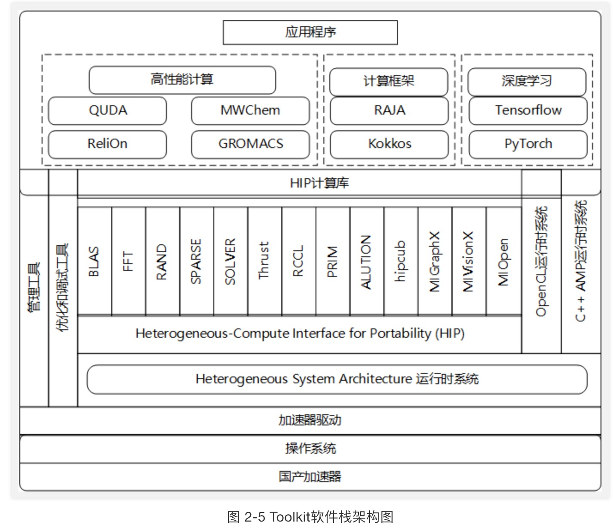

# 异构并行计算

> 📚 本章涵盖：PPT 08 异构计算（100页）、2026年实验四（CPU+GPU异构求解稀疏线性方程组）
> 
> 🎯 对应考点：名词解释、编程模型、异构平台对比、CUDA/HIP编程

---

## 一、异构计算概述

### 1.1 什么是异构并行计算？

**异构（Heterogeneous）**：
- 计算系统中同时包含**多种不同架构的处理器**
- 常见组合：X86+GPU、X86+FPGA、ARM+GPU、CPU+DCU
- 不同架构处理器对应**不同的指令集**

**并行（Parallel）**：
- 异构计算环境本身要求应用程序支持并行计算
- 所有处理器（CPU、GPU、ARM、DSP等）都是**多核向量处理器**
- 要发挥混合平台性能必须采用并行编程方式

**核心思想**：各取所长，将合适的计算任务分配给合适的处理器

### 1.2 为什么需要异构并行计算？

| 原因 | 说明 |
|------|------|
| **架构适配** | 不同处理器适合不同类型的计算问题 |
| **性能优化** | 将逻辑判别交给CPU，大规模向量计算交给GPU |
| **功耗控制** | 专用芯片可针对特定应用优化功耗 |
| **专用加速** | 为特定应用设计更优架构的处理器 |

**黄金三角**：性能、功耗与通用性不可兼得，需合理取舍

```
        性能
        /\
       /  \
      /    \
     /______\
   功耗    通用性
```

---

## 二、异构计算平台

### 2.1 协处理器类型

| 类型 | 全称 | 特点 | 适用场景 |
|------|------|------|----------|
| **GPU** | Graphics Processing Unit | SIMT并行，高吞吐 | 大规模向量计算 |
| **FPGA** | Field-Programmable Gate Array | 半定制电路，可重配 | 流水线加速 |
| **ASIC** | Application Specific Integrated Circuit | 全定制芯片 | 固定算法专用 |
| **NPU** | Neural-network Processing Unit | 神经网络专用 | AI推理 |
| **DCU** | Deep Computing Unit | 深度学习计算 | AI训练/推理 |

### 2.2 GPU（图形处理器）

**特点**：
- 将更多晶体管用于数据处理，而非控制和存储
- **SIMT（Single Instruction Multiple Threads）**并行模式
- 适合大规模并行的向量计算
- 作为CPU的辅助加速设备

**CPU vs GPU对比**：

| 特性 | CPU | GPU |
|------|-----|-----|
| **核心数** | 少（4-64核） | 多（数千核心） |
| **控制逻辑** | 复杂，分支预测强 | 简单 |
| **适用场景** | 逻辑控制、分支判断 | 数据并行、向量计算 |
| **内存带宽** | 较低 | 很高 |
| **编程难度** | 较易 | 较难 |

> 📖 **参考图示**：CPU/GPU架构对比 → **PPT 08 第12页**

### 2.3 FPGA（现场可编程门阵列）

**优点**：
- 支持深度可变的流水线结构
- 提供大量并行计算资源
- 可无限次重新编程（重配置只需几百毫秒）
- 内置存储器，带宽不受I/O引脚限制

**缺点**：
- 所有功能依靠硬件实现，无法实现复杂分支跳转
- 不能直接实现浮点运算
- 开发需要了解硬件描述语言（Verilog/VHDL）

### 2.4 ASIC（专用集成电路）

**优点**：
- 体积小、功耗低、计算性能高
- 芯片出货量越大成本越低
- 面积利用率最高

**缺点**：
- 算法固定，一旦变化可能无法使用
- 开发风险极大，周期长
- 不适合快速迭代的领域（如深度学习）

### 2.5 NPU（神经网络处理器）

**特点**：
- 专为神经网络计算设计
- 适于处理视频、图像类海量多媒体数据
- **非冯·诺伊曼结构**（存储与计算分离）
- 与CPU/GPU的主要区别在于架构设计理念

### 2.6 平台对比总结

| 平台 | 性能 | 功耗 | 灵活性 | 开发难度 | 适用场景 |
|------|------|------|--------|----------|----------|
| **CPU** | 中 | 中 | 高 | 低 | 通用计算 |
| **GPU** | 高 | 高 | 中 | 中 | 并行计算 |
| **FPGA** | 中高 | 低 | 高 | 高 | 流水线加速 |
| **ASIC** | 最高 | 最低 | 无 | 最高 | 固定算法 |
| **NPU** | 高 | 低 | 低 | 中 | AI推理 |

---

## 三、异构编程模型

### 3.1 异构编程面临的问题

1. **应用问题分析**
   - 支持什么类型的并行化方式？
   - 哪些计算需要"外包"给协处理器？

2. **硬件环境分析**
   - 有哪些类型的处理器？
   - 支持哪些编程方式？
   - 有哪些可用的并行计算库？

3. **最优匹配**
   - 计算任务如何调度？
   - 数据如何在设备间传输？

### 3.2 OpenCL（开放计算语言）

**Open Computing Language**：
- Apple设计，Khronos Group维护（2008年）
- 异构平台并行编程的**开放标准**
- 支持CPU、GPU和其他加速器
- 支持数据并行与任务并行
- API基于纯C语言

**OpenCL平台模型**：

```
┌─────────────────────────────────────┐
│           Host（主机）              │
│  ┌─────────────────────────────┐   │
│  │     OpenCL Runtime          │   │
│  └─────────────────────────────┘   │
└───────────────┬─────────────────────┘
                │
    ┌───────────┼───────────┐
    ▼           ▼           ▼
┌───────┐  ┌───────┐  ┌───────┐
│Compute│  │Compute│  │Compute│
│Device │  │Device │  │Device │
│ (GPU) │  │ (CPU) │  │(FPGA) │
└───────┘  └───────┘  └───────┘
```

**OpenCL执行模型**：
- **主机端程序**：控制流程，调度任务
- **设备端内核（Kernel）**：在设备上并行执行的函数

**OpenCL内存模型**：
- Global Memory（全局内存）
- Constant Memory（常量内存）
- Local Memory（局部内存）
- Private Memory（私有内存）

### 3.3 CUDA（NVIDIA）

**CUDA（Compute Unified Device Architecture）**：
- 2006年NVIDIA推出
- 支持C/C++/Fortran
- **SIMT（Single Instruction Multiple Threads）**模式
- 仅支持NVIDIA GPU

**CUDA编程模型**：

```
┌─────────────────────────────────────┐
│              Host (CPU)             │
│  ┌─────────────────────────────┐    │
│  │     CUDA Runtime API        │    │
│  └─────────────────────────────┘    │
└───────────────┬─────────────────────┘
                │
                ▼
┌─────────────────────────────────────┐
│           Device (GPU)              │
│  ┌───────┐ ┌───────┐ ┌───────┐      │
│  │Block 0│ │Block 1│ │Block 2│ ...  │
│  │┌─┬─┬─┐│ │┌─┬─┬─┐│ │┌─┬─┬─┐│      │
│  ││T│T│T││ ││T│T│T││ ││T│T│T││      │
│  │└─┴─┴─┘│ │└─┴─┴─┘│ │└─┴─┴─┘│      │
│  └───────┘ └───────┘ └───────┘      │
└─────────────────────────────────────┘
```

**核心概念**：

| 概念 | 说明 |
|------|------|
| **Grid** | 线程块（Block）的集合 |
| **Block** | 线程（Thread）的集合 |
| **Thread** | 基本执行单元 |
| **Kernel** | 在GPU上执行的函数 |
| **blockDim** | 每个Block的Thread数量 |
| **blockIdx** | Block在Grid中的索引 |
| **threadIdx** | Thread在Block中的索引 |

### 3.4 HIP（AMD/Hygon DCU）

**HIP（Heterogeneous-Computing Interface for Portability）**：
- AMD/海光DCU的编程模型
- 与CUDA语法高度相似
- 可移植性强

> 🎯 **2026年实验四要求**：使用HIP编程模型实现异构计算

---

## 四、GPU编程详解

### 4.1 CUDA程序基本结构

```c
int main(int argc, char** argv) {
    // 1. 在主机端分配内存 - malloc()
    // 2. 初始化输入数据
    
    // 3. 在设备端分配内存 - cudaMalloc()
    cudaMalloc((void**)&d_a, size);
    
    // 4. 将数据拷贝到设备 - cudaMemcpy()
    cudaMemcpy(d_a, a, size, cudaMemcpyHostToDevice);
    
    // 5. 设置Grid和Block维度
    dim3 gridSize(N/256);
    dim3 blockSize(256);
    
    // 6. 启动Kernel
    kernelName<<<gridSize, blockSize>>>(input_params);
    
    // 7. 将结果拷贝回主机
    cudaMemcpy(c, d_c, size, cudaMemcpyDeviceToHost);
    
    // 8. 释放设备内存
    cudaFree(d_a);
    
    // 9. 输出结果
    return 0;
}
```

### 4.2 GPU计算过程（三步曲）

```
步骤1：数据传输 Host → Device
┌──────────┐    PCIe Bus    ┌──────────┐
│ CPU内存  │  ───────────→  │ GPU显存  │
│ a, b, c  │                │ d_a,d_b  │
└──────────┘                └──────────┘

步骤2：在GPU上执行Kernel
┌──────────┐
│ GPU显存  │
│ Kernel执行 │
│ 并行计算  │
└──────────┘

步骤3：结果传输 Device → Host
┌──────────┐    PCIe Bus    ┌──────────┐
│ GPU显存  │  ───────────→  │ CPU内存  │
│   d_c    │                │    c     │
└──────────┘                └──────────┘
```

### 4.3 向量加法示例

**Kernel函数**：
```c
__global__ void add(int *a, int *b, int *c, int n) {
    int index = threadIdx.x + blockIdx.x * blockDim.x;
    if (index < n) {
        c[index] = a[index] + b[index];
    }
}
```

**主机端调用**：
```c
#define N 2048*2048
#define THREADS_PER_BLOCK 512

int main(void) {
    int *a, *b, *c;           // 主机端数组
    int *d_a, *d_b, *d_c;     // 设备端数组
    
    int size = N * sizeof(int);
    
    // 主机端分配内存
    a = (int*)malloc(size);
    b = (int*)malloc(size);
    c = (int*)malloc(size);
    
    // 设备端分配内存
    cudaMalloc((void**)&d_a, size);
    cudaMalloc((void**)&d_b, size);
    cudaMalloc((void**)&d_c, size);
    
    // 初始化数据
    random_ints(a, N);
    random_ints(b, N);
    
    // 拷贝到设备
    cudaMemcpy(d_a, a, size, cudaMemcpyHostToDevice);
    cudaMemcpy(d_b, b, size, cudaMemcpyHostToDevice);
    
    // 启动Kernel：N/THREADS_PER_BLOCK个Block，每个Block有THREADS_PER_BLOCK个Thread
    add<<<N/THREADS_PER_BLOCK, THREADS_PER_BLOCK>>>(d_a, d_b, d_c, N);
    
    // 拷贝回主机
    cudaMemcpy(c, d_c, size, cudaMemcpyDeviceToHost);
    
    // 清理
    free(a); free(b); free(c);
    cudaFree(d_a); cudaFree(d_b); cudaFree(d_c);
    
    return 0;
}
```

### 4.4 线程索引计算

**全局索引公式**：
```c
int index = threadIdx.x + blockIdx.x * blockDim.x;
```

**示例**：blockDim.x = 8, blockIdx.x = 2, threadIdx.x = 5
```
index = 5 + 2 * 8 = 21

Block 0        Block 1        Block 2        Block 3
[0][1][2][3]  [8][9][10][11] [16][17][18][19] [24][25][26][27]
[4][5][6][7]  [12][13][14][15] [20][21][22][23] [28][29][30][31]
                ↑
          index = 21
```

---

## 五、实验四：异构求解稀疏线性方程组（2026年重点！）

### 5.1 实验目标

使用**CPU+GPU异构并行**方式加速共轭梯度法（CG），将最耗时的**稀疏矩阵向量乘（SpMV）**移植到GPU上执行。

### 5.2 异构策略

| 组件 | 职责 |
|------|------|
| **CPU** | 控制流、点积计算、向量更新 |
| **GPU** | SpMV计算（计算密集部分） |

### 5.3 数据传输策略

```
每次迭代的数据流：

CPU (Host)                              GPU (Device)
┌─────────────┐                        ┌─────────────┐
│  向量 p     │ ──────cudaMemcpy────→  │   d_p       │
│  矩阵A(CSR) │ ──────cudaMemcpy────→  │   d_A       │
└─────────────┘                        └──────┬──────┘
                                              │
                                              ▼
                                      ┌─────────────┐
                                      │ SpMV Kernel │
                                      │ d_Ap = d_A*d_p│
                                      └──────┬──────┘
                                             │
┌─────────────┐                        ┌─────┴───────┐
│  向量 Ap    │ ←─────cudaMemcpy──────  │   d_Ap      │
└─────────────┘                        └─────────────┘
```

### 5.4 优化建议

**减少传输开销**：
- 将p和Ap始终留在设备端
- 点积需要主机端访问，仍需传输
- 高级优化：将点积也移至GPU

**CSR格式传输**：
```c
// 矩阵数据（在设备端分配）
cudaMalloc(&d_values, nnz * sizeof(double));
cudaMalloc(&d_row_ptr, (n+1) * sizeof(int));
cudaMalloc(&d_col_idx, nnz * sizeof(int));

// 拷贝到设备
cudaMemcpy(d_values, values, nnz*sizeof(double), cudaMemcpyHostToDevice);
cudaMemcpy(d_row_ptr, row_ptr, (n+1)*sizeof(int), cudaMemcpyHostToDevice);
cudaMemcpy(d_col_idx, col_idx, nnz*sizeof(int), cudaMemcpyHostToDevice);
```

### 5.5 SpMV CUDA Kernel示例

```c
__global__ void spmv_csr_kernel(
    int n,
    const double* values,
    const int* row_ptr,
    const int* col_idx,
    const double* x,
    double* y
) {
    int row = blockIdx.x * blockDim.x + threadIdx.x;
    if (row < n) {
        double sum = 0.0;
        for (int j = row_ptr[row]; j < row_ptr[row+1]; j++) {
            sum += values[j] * x[col_idx[j]];
        }
        y[row] = sum;
    }
}
```

**调用方式**：
```c
int threadsPerBlock = 256;
int blocksPerGrid = (n + threadsPerBlock - 1) / threadsPerBlock;
spmv_csr_kernel<<<blocksPerGrid, threadsPerBlock>>>(
    n, d_values, d_row_ptr, d_col_idx, d_p, d_Ap
);
```

---

## 六、名词解释汇总

| 术语 | 英文 | 定义 |
|------|------|------|
| **异构计算** | Heterogeneous Computing | 使用不同架构处理器协同工作 |
| **SIMT** | Single Instruction Multiple Threads | GPU的并行执行模式 |
| **CUDA** | Compute Unified Device Architecture | NVIDIA的GPU编程模型 |
| **HIP** | Heterogeneous-Computing Interface for Portability | AMD/DCU的编程模型 |
| **OpenCL** | Open Computing Language | 异构平台开放编程标准 |
| **Kernel** | - | 在GPU上执行的函数 |
| **Grid** | - | Block的集合 |
| **Block** | - | Thread的集合 |
| **Thread** | - | GPU上的基本执行单元 |
| **FPGA** | Field-Programmable Gate Array | 现场可编程门阵列 |
| **ASIC** | Application Specific Integrated Circuit | 专用集成电路 |
| **NPU** | Neural-network Processing Unit | 神经网络处理器 |
| **DCU** | Deep Computing Unit | 深度计算单元 |

---

## 七、复习要点

### ✅ 必须掌握
1. 异构计算的概念和必要性
2. CPU/GPU/FPGA/ASIC的特点对比
3. CUDA/HIP编程模型的基本概念
4. GPU计算的三步流程
5. 线程索引计算公式

### ⚠️ 常见考题
- 解释异构计算的含义（名词解释）
- 比较CPU和GPU的特点（简答题）
- 描述GPU计算的基本流程（简答题）
- 写出简单的CUDA程序（编程题）
- 解释Grid/Block/Thread的关系

### 📖 参考图示
- CPU/GPU架构对比 → **PPT 08 第12-13页**
- 协处理器类型图 → **PPT 08 第11页**
- GPU计算流程 → **PPT 08 第44-46页**
- CUDA线程层次 → **PPT 08 第62-64页**
- 异构计算系统架构 → **PPT 08 第36页**

---

*整理自：08 异构计算.pdf (100页)、2026年并行计算实验指导书*
