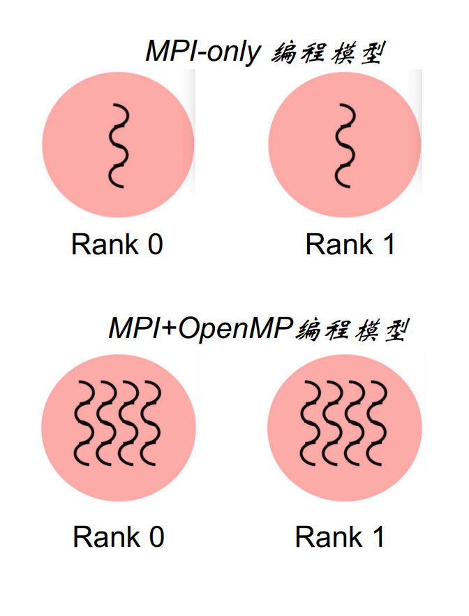

# 09 MPI多级混合编程

> [!info] 课程信息
> 讲师：汤善江副教授 | 天津大学智能与计算学部

## 目录

- [[#1 多级混合编程概述]]
- [[#2 MPI+OpenMP混合编程]]
- [[#3 MPI+CUDA混合编程]]

---

## 1 多级混合编程概述

### 1.1 为什么需要多级混合编程？

现代大规模计算系统的硬件是**多级化**的：

```
节点间（分布式）：通过高速网络互连多个计算节点
    ↓
节点内（共享内存）：多个CPU核心共享内存
    ↓
核心内（加速器）：GPU/FPGA等协处理器提供大规模并行
```

单一的编程模型无法充分利用所有层级的并行性，因此需要**混合编程**。

### 1.2 性能提升的两种模式

**Scale Up（纵向扩展）**：单节点越来越强大
- 单核 → 多核 → 众核（CPU）
- GPU、MIC、FPGA 等加速器


**Scale Out（横向扩展）**：可计算节点越来越多
- 通过高速互连网络连接大量节点


> [!example] 天河二号
> 16000个运算节点，每节点配备2颗Xeon E5 12核CPU + 3个Xeon Phi 57协处理器，共312万颗计算核心。

### 1.3 多级并行计算系统架构

#### 架构一：SMP集群（MPI+OpenMP）

> 节点内多核共享内存（OpenMP），节点间通过网络通信（MPI）


#### 架构二：GPU集群（MPI+CUDA）

> 单节点内多个GPU（CUDA），节点间通过网络通信（MPI）


### 1.4 编程模型对应关系

| 层级 | 并行方式 | 编程模型 |
|-----|---------|---------|
| **节点间** | 分布式内存 | MPI |
| **节点内（CPU）** | 共享内存 | OpenMP |
| **节点内（GPU）** | 大规模并行 | CUDA/HIP |

---

## 2 MPI+OpenMP混合编程

### 2.1 MPI vs OpenMP 对比

| | 纯MPI | 纯OpenMP |
|---|------|---------|
| **优点** | 高可扩展、可移植 | 易部署、低延迟、隐式通信 |
| **缺点** | 开发难、显式通信、负载平衡难 | 仅共享内存、扩展性有限 |

> [!tip] 混合编程的好处
> - 两级并发，概念简洁
> - 适合多核节点架构
> - 缓解纯MPI的可扩展性问题，减少进程数和网络流量

### 2.2 MPI+OpenMP 编程模型

**纯MPI**：每个MPI进程是一个独立执行单元

**MPI+OpenMP**：每个MPI进程内有多个OpenMP线程，共享MPI对象

### 2.3 MPI+OpenMP 基本步骤

```
Step 1: 初始化 MPI（MPI_Init）
Step 2: 在每个MPI进程中创建 OpenMP 并行区域
Step 3: 在串行或并行区域调用 MPI 库函数
Step 4: 结束 MPI（MPI_Finalize）
```

#### 示例代码（C）

```c
#include <mpi.h>
#include <omp.h>

int main(int argc, char **argv) {
    int rank, size;

    // Step 1: 初始化MPI
    MPI_Init(&argc, &argv);
    MPI_Comm_rank(MPI_COMM_WORLD, &rank);
    MPI_Comm_size(MPI_COMM_WORLD, &size);

    // Step 2: 创建OpenMP并行区域
    #pragma omp parallel for
    for (int i = 0; i < n; i++) {
        // 并行计算
    }

    // Step 3: MPI通信
    MPI_Allreduce(...);

    // Step 4: 结束MPI
    MPI_Finalize();
    return 0;
}
```

### 2.4 MPI线程支持级别

使用 `MPI_Init_thread` 替代 `MPI_Init`，指定线程支持级别：

```c
int MPI_Init_thread(int *argc, char ***argv, int required, int *provided);
```

| 级别 | 含义 |
|-----|------|
| `MPI_THREAD_SINGLE` | 只有一个线程执行 |
| `MPI_THREAD_FUNNELED` | 多线程但只有主线程调用MPI（**默认**） |
| `MPI_THREAD_SERIALIZE` | 多线程可调用MPI，但不能同时调用 |
| `MPI_THREAD_MULTIPLE` | 任何线程随时可调用MPI（最灵活，最复杂） |

### 2.5 通过主线程调用MPI（FUNNELED模式）

> 只有主线程（master）调用MPI，其他线程休眠

```c
#pragma omp parallel
{
    #pragma omp barrier
    #pragma omp master
    {
        MPI_Send(...);  // 只有主线程执行MPI
    }
    #pragma omp barrier
}
```

> [!note] 注意
> 在 `OMP_MASTER` 结构中没有隐式barrier，需要显式调用 `OMP_BARRIER` 进行同步。

### 2.6 通过单个线程调用MPI（SERIALIZED模式）

> 任意一个线程可调用MPI，但一次只能有一个

```c
#pragma omp parallel
{
    #pragma omp barrier
    #pragma omp single
    {
        MPI_Send(...);  // 任一线程执行MPI
    }
    // single有隐式同步，不需要额外barrier
}
```

### 2.7 任意线程调用MPI（MULTIPLE模式）

> 最灵活，但最复杂——任何线程可随时调用MPI，有潜在死锁风险

```c
int provided;
MPI_Init_thread(&argc, &argv, MPI_THREAD_MULTIPLE, &provided);
if (provided < MPI_THREAD_MULTIPLE)
    MPI_Abort(MPI_COMM_WORLD, 1);

#pragma omp parallel for
for (int i = 0; i < 100; i++) {
    compute(buf[i]);
    MPI_Send(...);  // 任何线程都可能调用MPI
}
```

### 2.8 计算与通信重叠

> 一个线程负责通信，其他线程继续计算 → 提升整体效率

```c
#pragma omp parallel
{
    if (omp_get_thread_num() == 0) {
        MPI_Recv(...);  // 线程0负责通信
    } else {
        compute(...);   // 其他线程继续计算
    }
}
```

### 2.9 MPI消息通信方式

**单线程通信**：一个线程处理所有通信

**多线程通信**：多个线程都可以进行MPI通信

### 2.10 实例：MPI+OpenMP计算π

$$\pi = \int_0^1 \frac{4}{1+x^2}dx \approx \sum_{0 \le i \le N} \frac{4}{1+(\frac{i+0.5}{N})^2} \times \frac{1}{N}$$

**分工策略**：
- 每个MPI进程负责 `1/nproc` 范围的求和
- 每个MPI进程内，`nthreads` 个OpenMP线程并行局部求和

```c
#include <stdio.h>
#include <mpi.h>
#include <omp.h>

#define NBIN 100000
#define MAX_THREADS 8

void main(int argc, char **argv) {
    int nbin, myid, nproc, nthreads, tid;
    double step, sum[MAX_THREADS] = {0.0}, pi = 0.0, pig;

    MPI_Init(&argc, &argv);
    MPI_Comm_rank(MPI_COMM_WORLD, &myid);
    MPI_Comm_size(MPI_COMM_WORLD, &nproc);

    nbin = NBIN / nproc;
    step = 1.0 / (nbin * nproc);

    #pragma omp parallel private(tid)
    {
        int i;
        double x;
        nthreads = omp_get_num_threads();
        tid = omp_get_thread_num();

        for (i = nbin * myid + tid; i < nbin * (myid + 1); i += nthreads) {
            x = (i + 0.5) * step;
            sum[tid] += 4.0 / (1.0 + x * x);
        }
    }

    for (tid = 0; tid < nthreads; tid++)
        pi += sum[tid] * step;

    MPI_Allreduce(&pi, &pig, 1, MPI_DOUBLE, MPI_SUM, MPI_COMM_WORLD);
    if (myid == 0) printf("PI = %f\n", pig);
    MPI_Finalize();
}
```

**编译与运行**：
```bash
mpicc -o hpi hpi.c -fopenmp
export OMP_NUM_THREADS=4
mpirun -np 2 ./hpi
```

---

## 3 MPI+CUDA混合编程

### 3.1 GPU集群的三级并发


| 层级 | 并发方式 | 编程模型 |
|-----|---------|---------|
| **GPU层** | 多处理器上运行的线程 | CUDA |
| **节点层** | CPU+GPU+网卡绑定 | — |
| **集群层** | 节点间互连 | MPI |

### 3.2 MPI+CUDA 分工策略


- **CUDA** 处理GPU层次的并发
- **MPI** 负责节点间的并发
- 每个GPU由一个MPI进程负责（不是必须，但常见）

### 3.3 节点间GPU数据通信

> [!warning] 关键问题
> GPU有自己的显存，MPI不能直接发送显存中的数据。需要通过CPU内存中转。

**传统方式（4步）**：


```
1. Device→Host：GPU显存数据拷贝到CPU内存
2. MPI_Send：通过网络发送CPU内存数据
3. MPI_Recv：远端接收数据到CPU内存
4. Host→Device：CPU内存数据拷贝到GPU显存
```

```c
if (0 == rank) {
    cudaMemcpy(host_buffer, device_buffer, size, cudaMemcpyDeviceToHost);
    MPI_Send(host_buffer, size, MPI_CHAR, 1, tag, MPI_COMM_WORLD);
} else {
    MPI_Recv(host_buffer, size, MPI_CHAR, 0, tag, MPI_COMM_WORLD, &status);
    cudaMemcpy(device_buffer, host_buffer, size, cudaMemcpyHostToDevice);
}
```

### 3.4 GPUDirect P2P

> 同一节点内的多个GPU可以直接互相拷贝数据，**无需经过CPU内存**


### 3.5 GPUDirect RDMA

> 数据从GPU显存直接推送到网卡，通过网络发送到另一台机器，**绕过CPU**


**优势**：
- 避免CPU参与，提高性能
- 不需要往系统主存写数据

```c
// 使用GPUDirect RDMA，直接发送/接收GPU显存数据
if (0 == rank) {
    MPI_Send(device_buffer, size, MPI_CHAR, 1, tag, MPI_COMM_WORLD);
} else {
    MPI_Recv(device_buffer, size, MPI_CHAR, 0, tag, MPI_COMM_WORLD, &status);
}
```


### 3.6 统一寻址（Unified Memory）

> CUDA 6.0起支持，Host内存和Device显存之间自动迁移数据，程序员无需关心数据在哪。


```c
int *ret;
cudaMallocManaged(&ret, 1000 * sizeof(int));  // 统一分配
AplusB<<<1, 1000>>>(ret, 10, 100);
cudaDeviceSynchronize();  // 等待kernel完成
for (int i = 0; i < 1000; i++)
    printf("%d: A+B=%d\n", i, ret[i]);
cudaFree(ret);
```

### 3.7 实例：MPI+CUDA计算π

**分工策略**：
- 每个MPI进程负责 `1/nproc` 范围的离散求和
- 每个MPI进程内，`NUM_BLOCK × NUM_THREAD` 个CUDA线程并行求和

```c
#include <stdio.h>
#include <mpi.h>
#include <cuda.h>

#define NBIN 10000000
#define NUM_BLOCK 13
#define NUM_THREAD 192

// CUDA Kernel
__global__ void cal_pi(float *sum, int nbin, float step, float offset,
                       int nthreads, int nblocks) {
    int idx = blockIdx.x * blockDim.x + threadIdx.x;
    for (int i = idx; i < nbin; i += nthreads * nblocks) {
        float x = offset + (i + 0.5) * step;
        sum[idx] += 4.0 / (1.0 + x * x);
    }
}

int main(int argc, char **argv) {
    int myid, nproc;
    float step, offset, pi = 0.0, pig;

    MPI_Init(&argc, &argv);
    MPI_Comm_rank(MPI_COMM_WORLD, &myid);
    MPI_Comm_size(MPI_COMM_WORLD, &nproc);

    int nbin = NBIN / nproc;
    step = 1.0 / (float)(nbin * nproc);
    offset = myid * step * nbin;

    dim3 dimGrid(NUM_BLOCK, 1, 1);
    dim3 dimBlock(NUM_THREAD, 1, 1);

    // 分配Host和Device内存
    size_t size = NUM_BLOCK * NUM_THREAD * sizeof(float);
    float *sumHost = (float *)malloc(size);
    float *sumDev;
    cudaMalloc((void **)&sumDev, size);
    cudaMemset(sumDev, 0, size);

    // 在GPU上计算
    cal_pi<<<dimGrid, dimBlock>>>(sumDev, nbin, step, offset,
                                   NUM_THREAD, NUM_BLOCK);

    // 拷回结果
    cudaMemcpy(sumHost, sumDev, size, cudaMemcpyDeviceToHost);

    // CUDA线程归约
    for (int i = 0; i < NUM_THREAD * NUM_BLOCK; i++)
        pi += sumHost[i];
    pi *= step;

    // MPI进程间归约
    MPI_Allreduce(&pi, &pig, 1, MPI_FLOAT, MPI_SUM, MPI_COMM_WORLD);
    if (myid == 0) printf("PI = %f\n", pig);

    free(sumHost);
    cudaFree(sumDev);
    MPI_Finalize();
    return 0;
}
```

**编译与运行**：
```bash
nvcc -c cuda_pi.cu -o cuda_pi.o
mpicc cuda_pi.o -lcudart -o hypi
mpirun -np 4 ./hypi
```

---

## 小结

| 主题 | 核心要点 |
|-----|---------|
| **多级混合编程** | 充分利用节点间、节点内、核心内三级并行 |
| **MPI+OpenMP** | MPI负责节点间通信，OpenMP负责节点内并行 |
| **线程支持级别** | SINGLE/FUNNELED/SERIALIZED/MULTIPLE |
| **MPI+CUDA** | MPI负责节点间通信，CUDA负责GPU并行计算 |
| **数据传输** | 传统需Host中转，GPUDirect可直接传输 |
| **Unified Memory** | Host/Device自动数据迁移，简化编程 |
