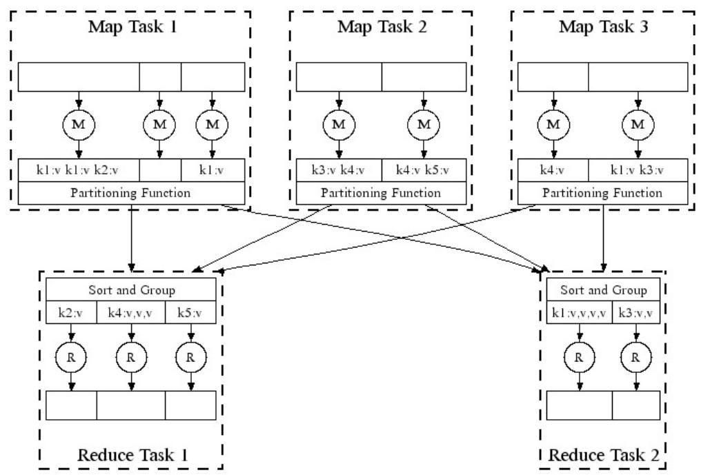
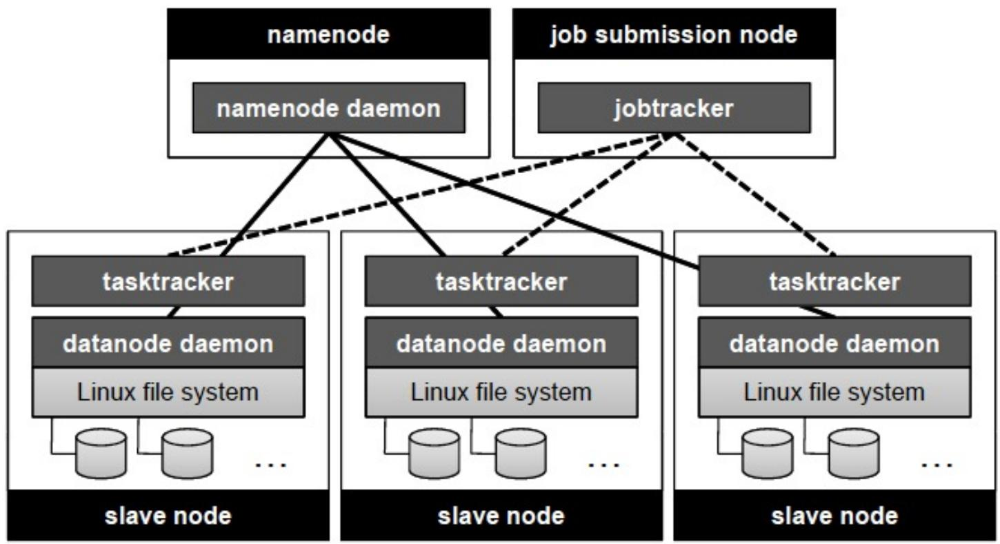

# MapReduce编程

## 目录
- [[#大数据背景]]
- [[#MapReduce起源]]
- [[#MapReduce编程模型]]
- [[#WordCount示例]]
- [[#Inverted Index（倒排索引）]]
- [[#Hadoop生态系统]]
- [[#HDFS分布式文件系统]]
- [[#YARN资源管理]]

---

## 大数据背景

### 什么是大数据？

大数据是指**数据量极大、增长速度极快、类型多样**的数据集合。这些数据来自：
- **电子商务**：购物记录、用户行为
- **社交网络**：微博、微信、抖音等
- **图像视频**：监控录像、短视频
- **科学数据**：天文观测、基因测序


### 大数据的增长


### 大数据处理挑战

处理大数据面临的主要挑战：
- **硬件故障**：任务计算失败、网络异常、断电
- **性能问题**：大量网络通信、负载不均衡
- **协调困难**：不同机器运行进度不一致


---

## MapReduce起源

### Google搜索的挑战

Google搜索引擎需要处理**海量数据**：
- 每次搜索需要**200+ CPU**
- 处理**200TB以上**数据
- 在**0.1秒内**响应


### Google数据中心


### MapReduce论文

**Jeff Dean**和**Sanjay Ghemawat**在2004年发表了著名的MapReduce论文，提出了这个简化大数据处理的编程模型。


---

## MapReduce编程模型

### 核心思想

MapReduce是一个**编程模型**，也是一种**大数据处理系统**：
- **模型抽象简洁**，程序员易用
- 运行于**大规模分布式集群**（>2000节点）
- **自动实现**分布式并行计算
- 支持**容错和负载平衡**

### 两个核心函数

用户只需要实现**两个函数接口**：

**Map函数**：处理输入的键值对，产生中间结果
```
map(in_key, in_value) -> list of (out_key, intermediate_value)
```

**Reduce函数**：将相同key的中间结果进行归约
```
reduce(out_key, list of intermediate_value) -> list of out_value
```

### 数据流程


### 并行执行

- `map()`**并行执行**，不同输入数据生成不同中间结果
- `reduce()`**并行执行**，分别处理不同的output key
- map和reduce过程中**不发生通信**
- **瓶颈**：map处理全部结束后，reduce才能开始



---

## WordCount示例

### 问题描述

统计**各个单词**在所有文件中出现的**总次数**。

### 源数据
```
Page 1: "the weather is good"
Page 2: "today is good"  
Page 3: "good weather is good"
```

### Map阶段

**输入**：(文件名, 文件内容)

**输出**：(单词, 1)

```
Worker 1: (Page 1, "the weather is good")
  → 输出: (the,1), (weather,1), (is,1), (good,1)

Worker 2: (Page 2, "today is good")
  → 输出: (today,1), (is,1), (good,1)

Worker 3: (Page 3, "good weather is good")
  → 输出: (good,1), (weather,1), (is,1), (good,1)
```

### Shuffle阶段（洗牌）

系统自动将**相同单词**的键值对分组：
```
(the, [1])
(is, [1, 1, 1])
(weather, [1, 1])
(today, [1])
(good, [1, 1, 1, 1])
```

### Reduce阶段

**输入**：(单词, 计数列表)

**输出**：(单词, 总次数)

```
Worker 1: (the, [1]) → (the, 1)
Worker 2: (is, [1,1,1]) → (is, 3)
Worker 3: (weather, [1,1]) → (weather, 2)
Worker 4: (today, [1]) → (today, 1)
Worker 5: (good, [1,1,1,1]) → (good, 4)
```

### 代码实现

```python
# Map函数
def map(input_key, input_value):
    # input_key: document name
    # input_value: document contents
    for word in input_value.split():
        emit(word, "1")

# Reduce函数  
def reduce(output_key, intermediate_values):
    # output_key: a word
    # output_values: a list of counts
    result = 0
    for v in intermediate_values:
        result += int(v)
    emit(str(result))
```

---

## Inverted Index（倒排索引）

### 问题描述

统计**各个单词**分别在**哪些文件**中出现过。

这是搜索引擎的核心技术：给定一个单词，快速找到包含该单词的所有文档。

### 源数据
```
foo: "This page contains so much text"
bar: "My page contains text too"
```

### Map阶段

**关键区别**：Map输出的value是**文件名**，而不是计数

```
Worker 1: (foo, "This page contains so much text")
  → 输出: (this,"foo"), (page,"foo"), (contains,"foo"), 
          (so,"foo"), (much,"foo"), (text,"foo")

Worker 2: (bar, "My page contains text too")
  → 输出: (my,"bar"), (page,"bar"), (contains,"bar"), 
          (text,"bar"), (too,"bar")
```

### Reduce阶段

```
Worker 1: (this, "foo") → (this, "foo")
Worker 2: (page, ["foo","bar"]) → (page, "foo bar")
Worker 3: (contains, ["foo","bar"]) → (contains, "foo bar")
Worker 4: (so, "foo") → (so, "foo")
Worker 5: (much, "foo") → (much, "foo")
Worker 6: (text, ["foo","bar"]) → (text, "foo bar")
Worker 7: (too, "bar") → (too, "bar")
Worker 8: (my, "bar") → (my, "bar")
```

### 数据流程图


### 代码实现

```python
# Map函数
def map(input_key, input_value):
    # input_key: document name
    # input_value: document contents
    for word in input_value.split():
        emit(word, input_key)  # 注意：这里是input_key

# Reduce函数
def reduce(output_key, intermediate_values):
    # output_key: a word
    # output_values: a list of document names
    result = ""
    for v in intermediate_values:
        result += " " + v
    emit(result)
```

---

## Hadoop生态系统

### 什么是Hadoop？

Hadoop是一个**分布式系统基础架构**，由Apache基金会开发：
- 用户可以在**不了解分布式底层细节**的情况下开发分布式程序
- 充分利用集群的威力高速运算和存储
- 由**Doug Cutting**创建


### Google vs Hadoop

| Google技术 | Hadoop等价 |
|-----------|-----------|
| MapReduce | Hadoop |
| GFS | HDFS |
| Bigtable | HBase |

### Hadoop集群结构



### Hadoop工作流程


---

## HDFS分布式文件系统

### HDFS特点

- **基于块的文件存储**：默认块大小64MB
- **按块复制**：默认副本数3
- **随机选择存储节点**
- **适合MapReduce应用程序**

### HDFS架构


### HDFS文件系统


### HDFS适用场景

✅ **适合**：
- 大文件，顺序读
- 一次写入，多次读取
- 流式数据访问

❌ **不适合**：
- 大量小文件
- 随机读写
- 需要频繁修改的文件

---

## YARN资源管理

### 第一代Hadoop的缺陷

- **单点故障**：JobTracker只有一个
- **扩展性差**：节点超过4000个时不稳定
- **仅支持MapReduce**
- **资源利用率低**

### YARN架构

YARN（Yet Another Resource Negotiator）将**资源管理**和**作业调度**分离：


### YARN核心组件

**ResourceManager (RM)**：
- 控制整个集群
- 管理资源分配
- 包含调度器和应用管理器

**ApplicationMaster (AM)**：
- 每个应用程序一个AM
- 与RM协商资源
- 监控任务运行状态

**NodeManager (NM)**：
- 每个节点上的资源管理器
- 向RM汇报资源使用情况
- 接收并处理AM的请求

**Container**：
- YARN中的资源抽象
- 封装内存、CPU、磁盘、网络等资源

### YARN工作流程


---

## 总结

### MapReduce核心要点

1. **编程模型**：只需要实现Map和Reduce两个函数
2. **自动并行化**：系统自动处理分布式并行计算
3. **容错机制**：自动处理节点故障
4. **数据本地性**：尽量在数据所在节点进行计算

### 学习建议

1. **理解数据流**：Input → Map → Shuffle → Reduce → Output
2. **掌握两个经典案例**：WordCount和Inverted Index
3. **了解Hadoop生态**：HDFS、YARN、MapReduce的关系
4. **动手实践**：在本地或云平台运行Hadoop程序

---

> [!note] 参考资料
> - MapReduce: Simplified Data Processing on Large Clusters (Dean & Ghemawat, 2004)
> - Hadoop官方文档：https://hadoop.apache.org/
> - 《Hadoop权威指南》