# 并行算法设计

## 目录
- [[#并行算法设计概述]]
- [[#串行算法的直接并行化]]
- [[#从问题描述开始设计并行算法]]
- [[#借用已有算法求解新问题]]
- [[#设计方法总结]]

---

## 并行算法设计概述

### 什么是并行算法？

**算法**：计算指令序列（逻辑），是一组明确定义的规则或过程，用于在有限步骤内解决问题。

**串行算法**：只有一组计算指令，按顺序执行。

**并行算法**：一些**可同时执行的计算任务的集合**，这些计算任务分工合作获得给定问题的求解。


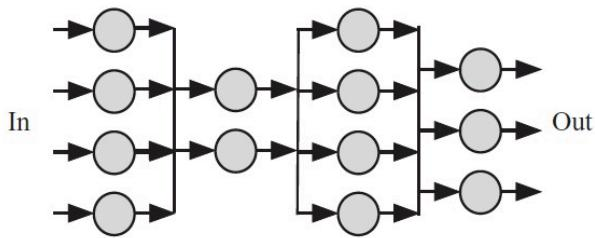

### 并行算法设计思想

并行算法设计**不是串行算法设计的进阶**：
- 串行算法基于**冯式架构**，指令逻辑顺序清晰
- 并行计算硬件环境**没有统一的体系结构**
- 并行算法中部分计算过程可以是串行算法
- 串行算法中的部分计算过程也可以并行化
- 并行算法的设计，**与问题本身以及硬件平台均相关**

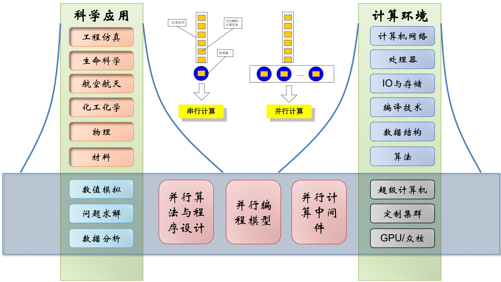

### 如何进行并行计算？

1. **分析应用问题的本质**
   - 计算密集？数据分析？
   - 是否可以分解为可并发执行的子任务？

2. **并行算法分析与设计**
   - 可用的计算资源
   - 现有平台各层次硬件参数

3. **设计和实现解决方案**
   - 使用商业/开源软件？
   - 基于中间件开发新程序？
   - 从底层开始设计开发新程序？

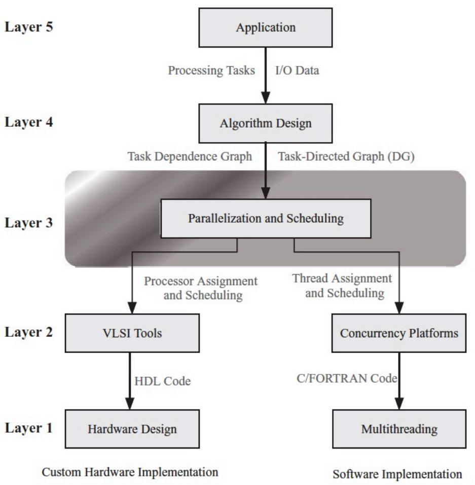

### 设计并行算法的三种策略

1. **分析现有串行算法中固有的并行性**，直接将其并行化
   - 该方法并不是对所有问题都可行，但对很多应用问题仍不失为一种有效的方法

2. **从问题本身的描述出发**，根据问题的固有属性，从头设计一个全新的并行算法
   - 这种方法有一定难度，但所设计的并行算法通常更高效

3. **借助已有的并行算法求解新问题**

---

## 串行算法的直接并行化

### 方法描述

**发掘和利用现有串行算法中的并行性**，直接将串行算法改造为并行算法。

### 特点

- 由串行算法直接并行化的方法是并行算法设计的**最常用方法之一**
- **不是所有的串行算法都可以直接并行化**
- 一个好的串行算法**未必能并行化为一个好的并行算法**
- 许多数值串行算法可以并行化为有效的数值并行算法

### 示例1：数组求和

#### 问题描述

给定一个数组，求所有元素的和。

#### 串行算法

```c
sum = 0;
for (i = 0; i < n; i++) {
    sum += a[i];
}
```

#### 并行化方法：数据分解

**按块均分**：将数组分成若干块，每块分配给一个处理器


**平衡树方法**：使用树形结构进行并行求和


### 示例2：排序算法

#### 并行排序的必要性

- 排序是计算机经常完成的操作
- 排序后的数据更容易处理（查找效率更高）
- 大数据量排序在单处理器上串行执行需要**大量时间**
- 基于比较的排序算法最低时间复杂度是 **O(n log n)**

#### 并行排序的关键问题

1. **数据如何分配到不同的处理器上**
2. **不同处理器上的元素如何进行大小比较**

#### 问题1：数据分配

**方法1**：所有数据放在一个结点上，其它结点从此结点取数据
- 缺点：该结点成为瓶颈

**方法2**：数据按编号取模分布到相应处理器上
- 排序结果在各个处理器上均匀分布
- 满足小编号处理器上的每个元素均小于大编号处理器上的每个元素

#### 问题2：元素比较

在并行算法中，比较操作并不简单，因为两个元素分别位于不同的结点上。

**极端情况**：待排序元素与处理器个数一样多，每个处理器存储一个元素。

**比较方法**：

**版本1**：P1发送A给P2，P2比较后返回结果


**版本2**：P1和P2互相发送数据，各自比较后保留结果

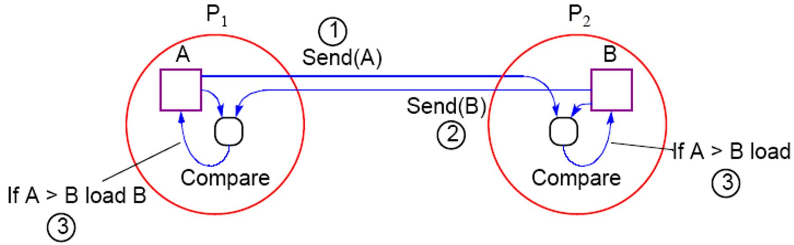

#### 多个元素的情况

每个处理器存储多个元素（n/p个），定义**超元素**：
- 超元素E1中的所有元素都不大于E2中的任何元素时，定义为E1≤E2
- 比较过程：通信-比较-合并-拆分


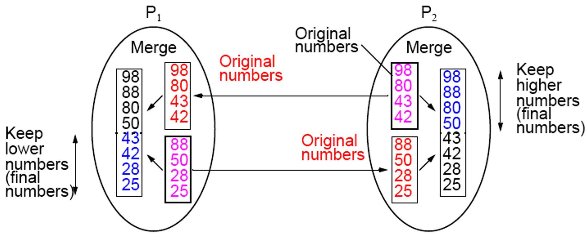

### 枚举排序

#### 串行算法思想

对每一个待排序的元素**统计小于它的所有元素的个数**，从而得到该元素最终处于序列中的位置。

时间复杂度：**O(n²)**

#### 串行代码

```c
// 输入：a[1]…a[n]
// 输出：b[1]…b[n]
for (i = 1; i <= n; i++) {
    k = 1;
    for (j = 1; j <= n; j++) {
        if (a[i] > a[j]) {
            k = k + 1;
        }
    }
    b[k] = a[i];
}
```

#### 并行化方法

使用n个处理器，每个处理器负责完成对其中一个元素的定位：
1. P0播送a[1]…a[n]给所有Pi
2. 所有Pi并行执行：统计比a[i]小的元素个数k
3. P0收集k并按序定位

**时间复杂度**：O(n)
**通信复杂度**：O(n²)

### 冒泡排序

#### 串行算法

```c
void BUBBLE_SORT(n) {
    for (i = n-1; i >= 1; i--) {
        for (j = 1; j <= i; j++) {
            compare-exchange(a[j], a[j+1]);
        }
    }
}
```

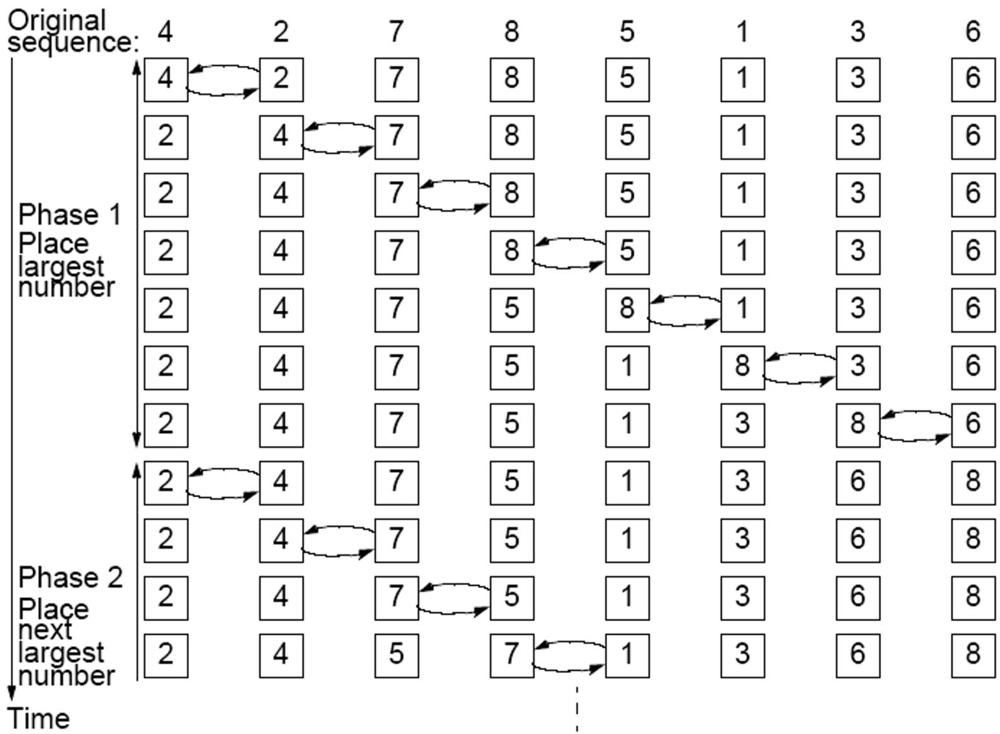

#### 并行化挑战

冒泡排序顺次比较相邻元素，**本质上是串行过程**，很难并行化。

#### 流水线并行

考虑到内循环的下一次迭代的"冒泡"动作可以在前一次迭代完成之前开始，可以开发**流水线并行算法**。


### 奇偶置换冒泡排序

#### 算法思想

将排序过程分为两类阶段：
- **奇操作阶段**：奇数索引元素与右邻居比较交换
- **偶操作阶段**：偶数索引元素与右邻居比较交换

经过n个阶段后，序列有序。

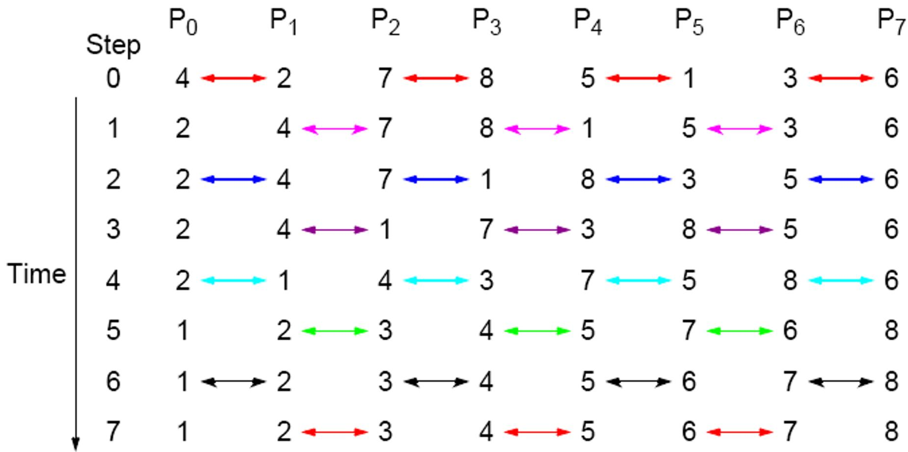

#### 并行化代码

```c
void ODD-EVEN_PAR(n) {
    id = processor's label;
    for (i = 1; i <= n; i++) {
        if (i is odd) {
            if (id is odd) compare-exchange_min(id+1);
            else compare-exchange_max(id-1);
        }
        if (i is even) {
            if (id is even) compare-exchange_min(id+1);
            else compare-exchange_max(id-1);
        }
    }
}
```

---

## 从问题描述开始设计并行算法

### 方法描述

**从问题本身描述出发**，不考虑相应的串行算法，设计一个全新的并行算法。

### 特点

- 挖掘问题的**固有特性与并行的关系**
- 设计全新的并行算法是一个**挑战性和创造性**的工作

### 示例：求前缀和

#### 问题描述

给定数组 A = {a₀, a₁, a₂, ..., aₙ}

求数组 B = {b₀, b₁, b₂, ..., bₙ}，其中 bᵢ = sum(a₀ to aᵢ)

#### 串行算法

```c
b[0] = a[0];
for (i = 1; i < n; i++) {
    b[i] = b[i-1] + a[i];
}
```

**问题**：每次迭代依赖于上一次的结果，**无法直接对循环进行拆分**

#### 并行算法：树形结构

使用树形结构进行并行计算：


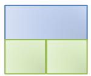


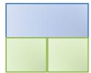
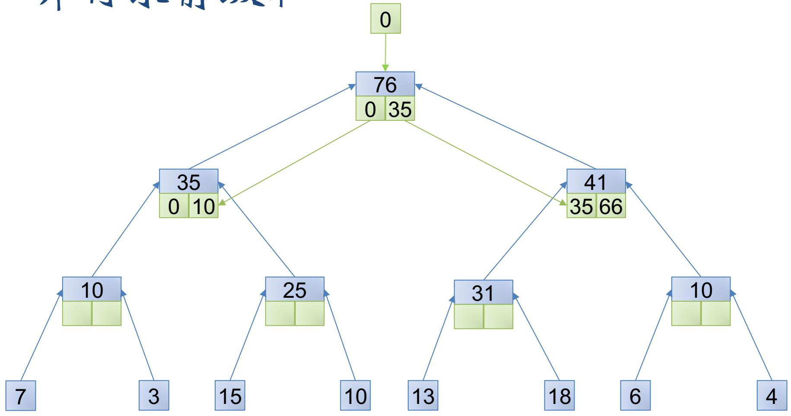
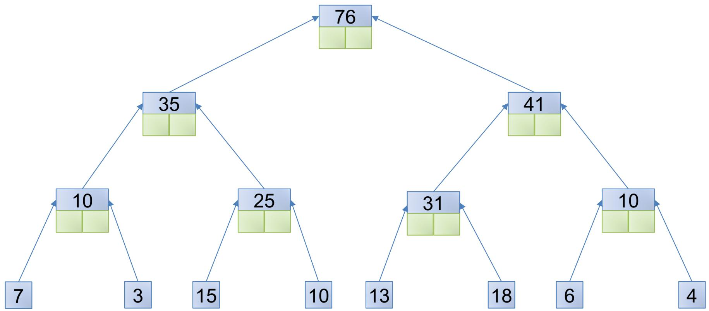
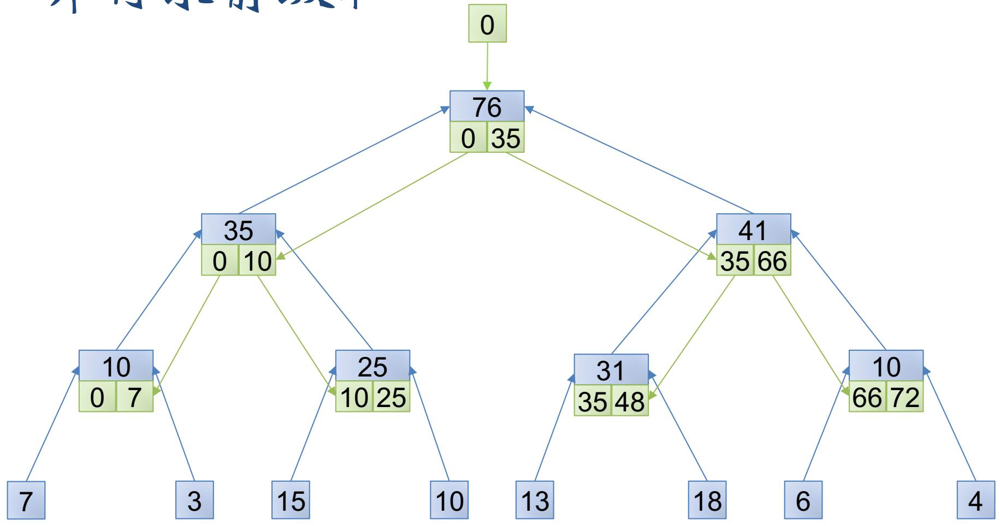

#### 并行算法：另一算法

```c
// 串行部分
for (i = 1; i < n; i++) {
    A[i] = A[i] + A[i-1];
}

// 并行部分
for (i = 0; i < ceil(log(n)); i++) {
    for (j = pow(2,i); j < n; j++) {
        // 并行执行
        A[j] = A[j] + A[j - pow(2,i)];
    }
}
```

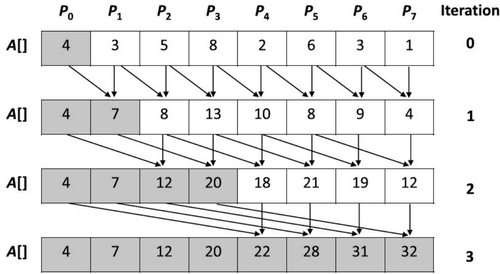

#### MPI_Scan参考

MPI_Scan：每一个进程都对排在它前面的进程进行归约操作。


---

## 借用已有算法求解新问题

### 方法描述

1. 找出求解问题和某个已解决问题之间的联系
2. 改造或利用已知算法应用到求解问题上

### 特点

这是一项**创造性的工作**。

### 示例：3PCF（三点相关函数）

#### 问题定义

给定点集D和R：
- 定义D中的点为 aᵢ ∈ D
- 定义R中的点为 bᵢ ∈ R
- 距离：r₁、r₂、r₃、err

**求**：满足以下条件的三元组（空间中三角形）的数目：
- <aᵢ, bₘ, bₙ>，且 |aᵢ - bₘ| = r₁ ± err
- 且 |aᵢ - bₙ| = r₂ ± err  
- 且 |bₘ - bₙ| = r₃ ± err

#### 直接解法

对于D中每一点aᵢ：
1. 在R中找到与之距离为r₁的点集R'
2. 找到与之距离为r₂的点集R''
3. 在点集R'与R''中，查找两点间距离为r₃的点组数目
4. 累加

#### 并行解法

**阶段一**：
- 遍历D中每一点，在R中找到与之相距为r₁或r₂的点，获得矩阵DR1和DR2
- 遍历R中每一点，在R中找到与之相距为r₃的点，形成矩阵RR

**阶段二**：ResultMatrix = DR1 × RR × DR2ᵀ

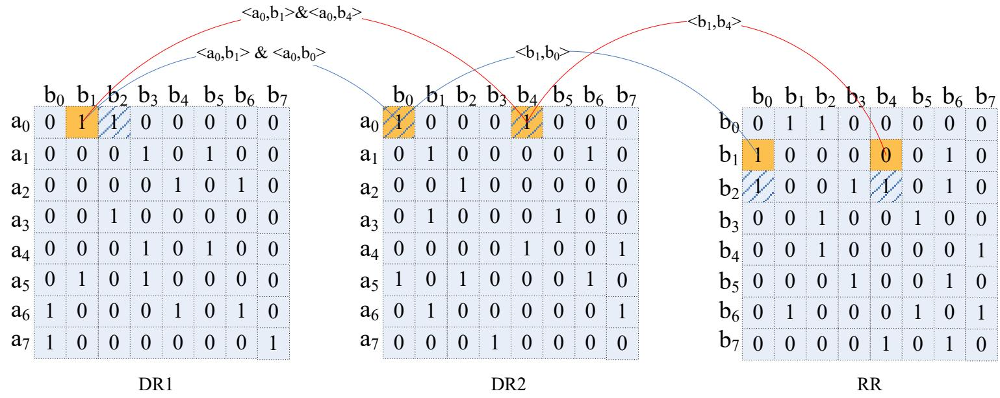

---

## 设计方法总结

### 三种方法的比较

| 方法 | 优点 | 缺点 | 适用场景 |
|------|------|------|----------|
| **串行算法直接并行化** | 简单、常用 | 不是所有算法都能并行化 | 数值计算、简单算法 |
| **从问题描述开始设计** | 可能获得更高效算法 | 难度大、需要创造力 | 新问题、特殊问题 |
| **借用已有算法** | 利用已有经验 | 需要找到问题间联系 | 问题相似性高的场景 |

### 设计原则

1. **分析问题本质**：确定是否可并行化
2. **考虑硬件特性**：不同平台适合不同算法
3. **平衡计算与通信**：减少通信开销
4. **保持负载均衡**：避免处理器空闲
5. **考虑可扩展性**：适应不同规模的问题

### 学习建议

1. **掌握基本并行模式**：数据分解、任务分解
2. **理解通信机制**：点对点、集合通信
3. **实践经典案例**：排序、搜索、数值计算
4. **多思考多总结**：并行算法设计是创造性工作

---

> [!note] 参考资料
> - 《并行计算-结构•算法•编程》陈国良
> - Introduction to Parallel Computing (Grama, Gupta, Karypis, Kumar)
> - 《算法导论》并行算法章节