# 并行程序设计方法学

## 目录
- [[#PCAM方法学概述]]
- [[#划分（Partitioning）]]
- [[#通讯（Communication）]]
- [[#组合（Agglomeration）]]
- [[#映射（Mapping）]]
- [[#并行程序设计模式]]
- [[#并行编程框架]]

---

## PCAM方法学概述

### 什么是PCAM？

PCAM是**设计并行程序的四个阶段**：
- **P**artitioning（划分）：分解成小的任务，开拓并发性
- **C**ommunication（通讯）：确定诸任务间的数据交换，监测划分的合理性
- **A**gglomeration（组合）：依据任务的局部性，组合成更大的任务
- **M**apping（映射）：将每个任务分配到处理器上，提高算法的性能


### PCAM设计流程

1. **划分**：将问题分解为多个独立的小任务
2. **通讯**：分析任务间需要的数据交换
3. **组合**：将小任务合并成更大的任务
4. **映射**：将任务分配到具体的处理器

### PCAM的重要性

PCAM提供了一种**系统化的设计方法**：
- 帮助开发者**有条理地思考**并行程序设计
- 确保**不遗漏关键设计步骤**
- 提供**设计评估标准**
- 适用于**各种并行计算平台**

---

## 划分（Partitioning）

### 划分的目标

- **充分开拓算法的并发性和可扩放性**
- 先进行数据分解（域分解），再进行计算功能的分解（功能分解）
- 使数据集和计算集**互不相交**
- 划分阶段**忽略处理器数目和目标机器的体系结构**

### 两种划分方法

1. **域分解（Domain Decomposition）**：划分的对象是数据
2. **功能分解（Functional Decomposition）**：划分的对象是计算

### 域分解

#### 基本思想

- 划分的对象是**数据**，可以是算法的输入数据、中间处理数据和输出数据
- 将数据分解成**大致相等的小数据片**
- 划分时考虑数据上的相应操作
- 如果一个任务需要别的任务中的数据，则会产生**任务间的通讯**

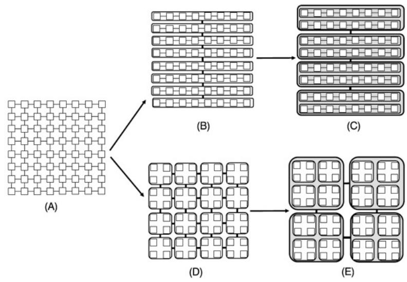

#### 一维数据分解

**BLOCK分解**：连续的数据块分配给每个处理器


**BLOCK,*分解**：带星号的BLOCK分解


**CYCLIC分解**：循环分配数据

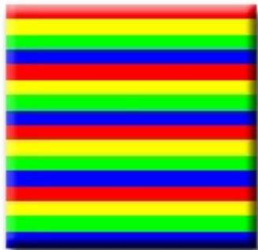

**CYCLIC,*分解**：带星号的CYCLIC分解


#### 二维数据分解

**BLOCK,BLOCK分解**：两个维度都按块分解


**BLOCK,*分解**：第一个维度按块，第二个维度按星号


***,BLOCK分解**：第一个维度按星号，第二个维度按块


**CYCLIC,CYCLIC分解**：两个维度都循环分解

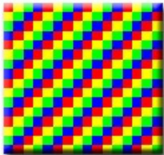

#### 三维数据分解

**1D分解**：沿一个维度分解

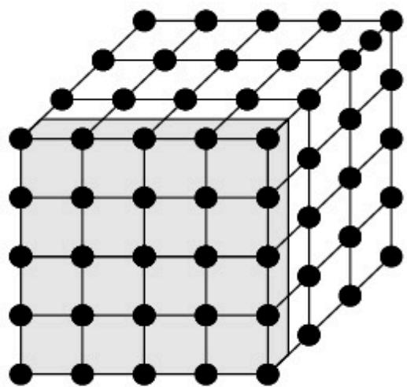

**2D分解**：沿两个维度分解

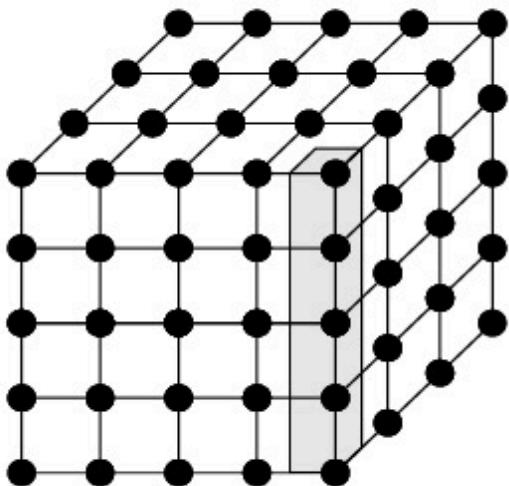

**3D分解**：沿三个维度分解


#### 不规则区域分解

对于不规则的数据分布，需要特殊处理：


#### 递归分解

**示例：快速排序**


### 功能分解（任务分解）

#### 基本思想

- 划分的对象是**计算**，将计算划分为不同的任务
- 划分后，研究不同任务所需的数据
- 如果这些数据**不相交**，则划分成功
- 如果数据有相当的重叠，意味着要重新进行域分解和功能分解
- 功能分解是一种**更深层次的分解**


#### 示例1：搜索树

搜索树没有明显的可分解的数据结构，但易于进行细粒度的功能分解：
- 开始时根生成一个任务
- 对其评价后，如果它不是一个解，就生成若干叶结点
- 这些叶结点可以分到各个处理器上并行地继续搜索

#### 示例2：气候模型


### 划分判据

评估划分是否合理的标准：
- ✅ 是否具有灵活性？
- ✅ 是否避免了冗余计算和存储？
- ✅ 任务尺寸是否大致相当？
- ✅ 任务数与问题尺寸是否成比例？
- ✅ 功能分解是一种更深层次的分解，是否合理？

---

## 通讯（Communication）

### 通讯的重要性

- 通讯是PCAM设计过程的**重要阶段**
- 划分产生的诸任务，一般**不能完全独立执行**
- 需要在任务间进行**数据交流**，从而产生了通讯
- 功能分解确定了诸任务之间的**数据流**
- 诸任务是并发执行的，通讯则**限制了这种并发性**

### 四种通讯模式

1. **局部/全局通讯**
2. **结构化/非结构化通讯**
3. **静态/动态通讯**
4. **同步/异步通讯**

### 局部通讯

**定义**：通讯限制在一个邻域内

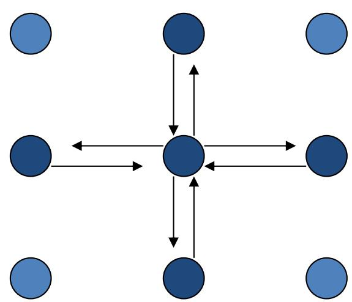

**特点**：
- 通讯范围小
- 延迟低
- 易于优化

### 全局通讯

**定义**：通讯非局部的

**示例**：
- All to All：所有进程相互通信
- Master-Worker：主从模式


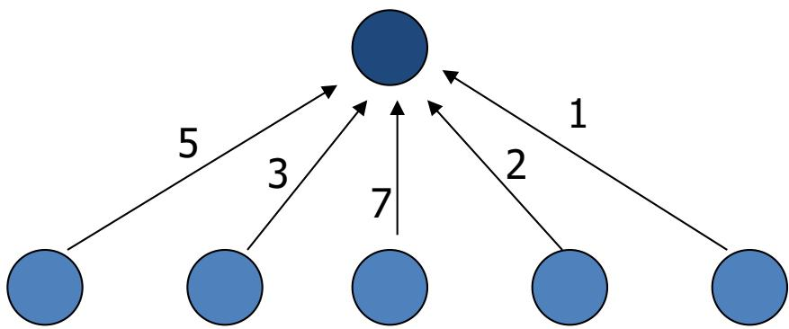

**特点**：
- 通讯范围大
- 可能成为性能瓶颈
- 需要精心设计

### 结构化通讯

**定义**：每个任务的通讯模式是相同的


**特点**：
- 模式规整，易于实现
- 便于优化和预测性能
- 常见于规则网格计算

### 非结构化通讯

**定义**：没有一个统一的通讯模式

**示例**：无结构化网格


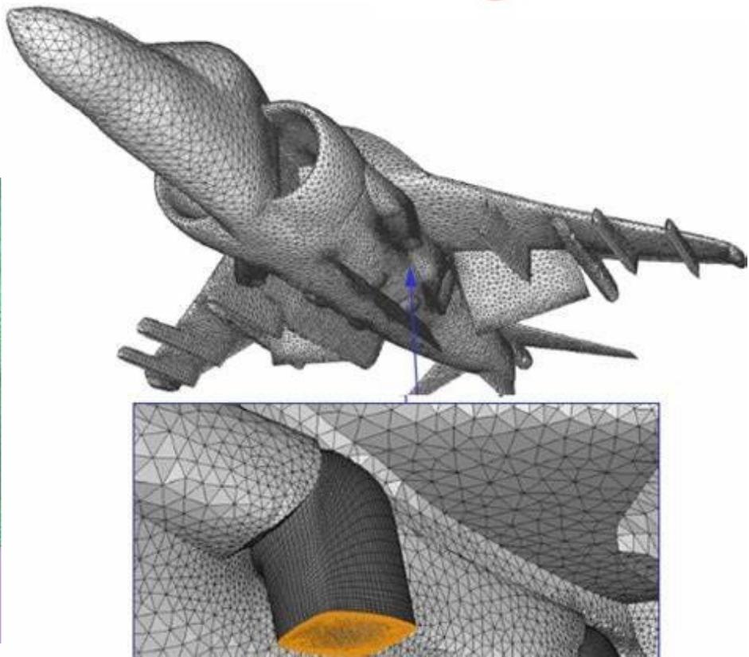

**特点**：
- 模式不规整
- 难以优化
- 常见于自适应网格、图计算

### 通讯判据

评估通讯是否合理的标准：
- ✅ 所有任务是否执行大致相当的通讯？
- ✅ 是否尽可能的局部通讯？
- ✅ 通讯操作是否能并行执行？
- ✅ 同步任务的计算能否并行执行？

---

## 组合（Agglomeration）

### 组合的目标

- **提升数据本地性**
- **优化通信**
- **增加任务粒度**


### 方法描述

- 组合是由**抽象到具体**的过程
- 将组合的任务能在一类并行机上有效的执行
- **合并小尺寸任务**，减少任务数
- 如果任务数恰好等于处理器数，则也完成了映射过程
- 增加任务的粒度和重复计算，可以**减少通讯成本**
- 保持映射和扩展的灵活性，**降低软件工程成本**

### 表面-容积效应

**原理**：通讯量与任务子集的**表面**成正比，计算量与任务子集的**体积**成正比

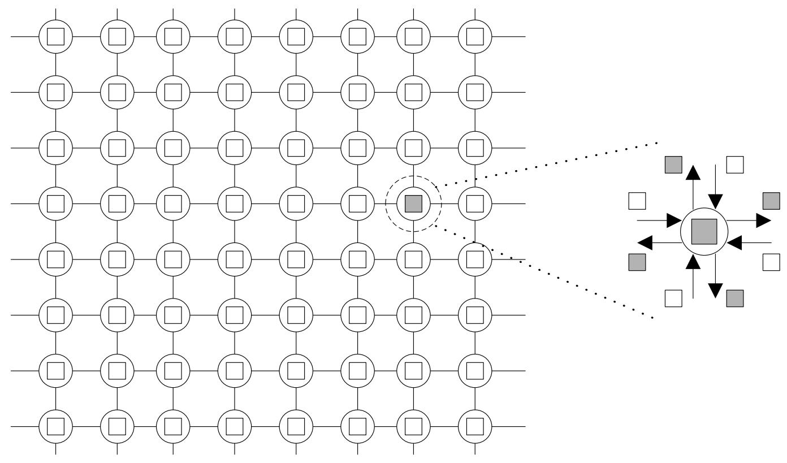

**应用**：
- 增大任务尺寸可以**减少通讯比例**
- 但会**减少并行性**
- 需要在两者之间找到**平衡点**

### 重复计算

#### 基本思想

- 重复计算**减少通讯量**，但**增加了计算量**
- 应保持恰当的平衡
- 重复计算的目标应**减少算法的总运算时间**

#### 示例：二叉树求和

**问题**：N个处理器求N个数的全和，要求每个处理器均保持全和

**方法1：二叉树结构**


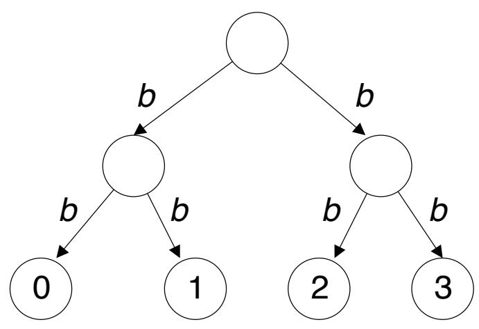

共需 **2logN** 步

**方法2：蝶式结构**

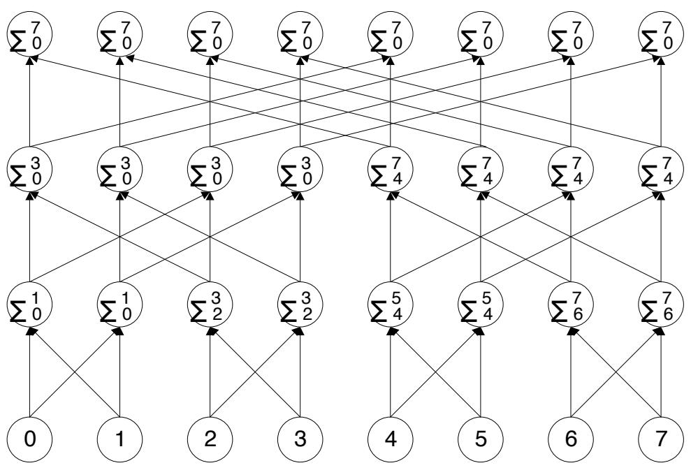
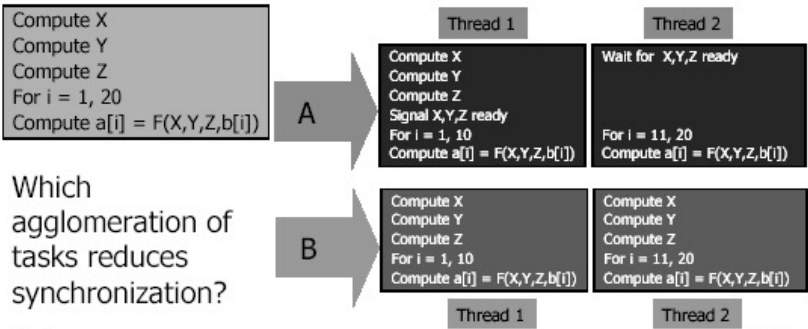

使用了重复计算，共需 **logN** 步

### 组合判据

评估组合是否合理的标准：
- ✅ 增加粒度是否减少了通讯成本？
- ✅ 重复计算是否已权衡了其得益？
- ✅ 是否保持了灵活性和可扩放性？
- ✅ 组合的任务数是否与问题尺寸成比例？
- ✅ 是否保持了类似的计算和通讯？
- ✅ 有没有减少并行执行的机会？

---

## 映射（Mapping）

### 映射的目标

每个任务要映射到具体的处理器（计算资源），定位到运行机器上：
- **并发的任务** → **不同的处理器**
- **任务之间存在高通讯** → **同一处理器**

### 映射的挑战

- 任务数大于处理器数时，存在**负载平衡和任务调度**问题
- 映射的目标：**减少算法的执行时间**
- 映射实际是一种**权衡**，属于**NP完全问题**

### 任务映射的考虑因素

#### 1. 计算量

**简单情况**：所有任务具有相同的（单位）成本


**较难情况**：任务具有不同的但已知的时间

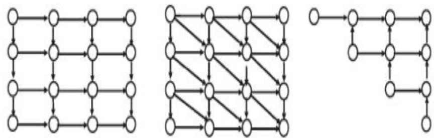

**最困难情况**：任务成本直到执行后才可知

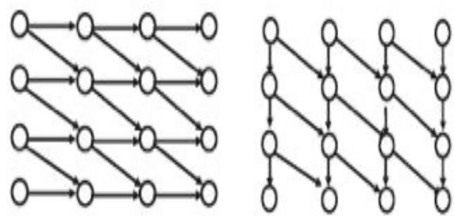

#### 2. 依赖关系

**简单情况**：任务可以按任何顺序执行

**较难情况**：任务具有可预测的结构

**最困难情况**：结构动态变化（缓慢或快速）

#### 3. 通信关系

**简单情况**：任务一旦创建，不再通信

**较难情况**：任务以可预测的模式通信

**最困难情况**：通信模式不可预测

### 静态映射技术

#### 基于数据划分的映射

我们可以合并数据划分和计算划分为任务，计算划分依照"拥有者进行计算"原则进行。

**1-D按块分布模式**：

按行分布：
```
P0: [行0-11]
P1: [行12-23]
P2: [行24-35]
...
```

按列分布：
```
P0: [列0-11]  P1: [列12-23]  P2: [列24-35]  ...
```

**2-D按块分布模式**：
```
P0  P1  P2  P3
P4  P5  P6  P7
P8  P9  P10 P11
P12 P13 P14 P15
```

#### 循环映射模式

96个任务映射到6个处理器，任意两个相邻的任务都不在同一计算资源：

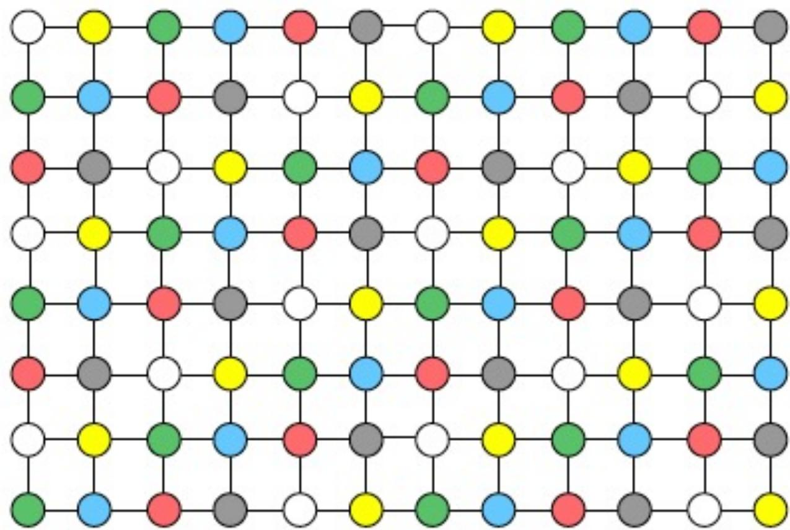

#### 基于不规则数据分解的映射

尽量将等量节点给每个计算资源，从而最小化图划分中边的计数：

**随机划分**：

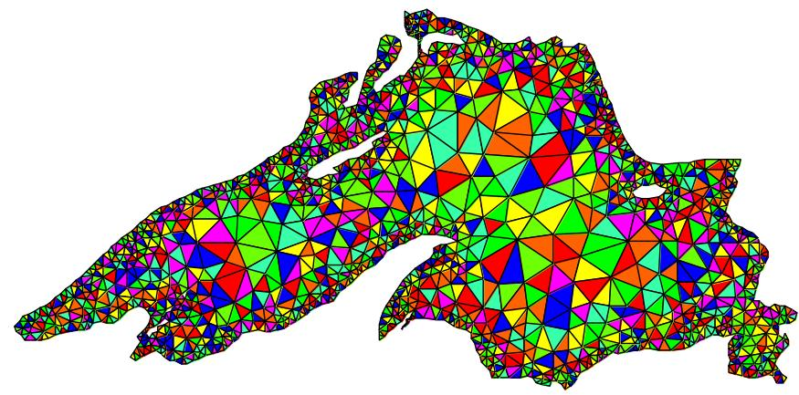

**按最小割划分**：

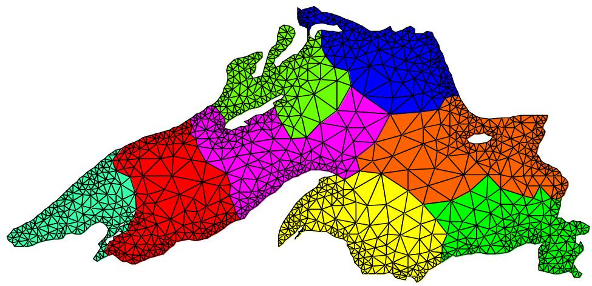

#### 基于任务划分的映射

- 根据任务依赖图将各个任务映射到计算资源
- 确定一个通用任务依赖图的优化映射是一个**NP完全问题**
- 对结构化图有好的启发式方法存在


### 动态映射技术

#### 集中式动态映射

- 进程被设定为**主和从**
- 当一个从进程完成工作便向主进程请求新工作
- 当从进程增加时，主进程可能成为**瓶颈**
- 为了缓和此问题，从进程可以每一次拿多个任务（块调度）

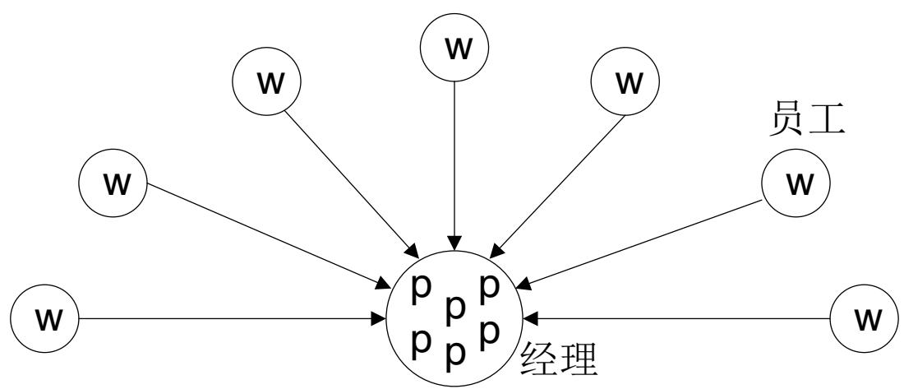

#### 分布式动态映射

- 每个进程可以发送任务给其它任务或从其它接收任务
- **P2P方式**：每个任务地位相同，调度方案需各任务协商
- 减轻了集中式模式的瓶颈

**四方面关键问题**：
1. 发送和接收的进程如何配对
2. 哪个进程初始化传输
3. 传多少数据
4. 何时启动传输

### 映射的原则：最小化交互开销

1. **最大化数据局部性**
   - 只要可能就复用中间数据
   - 重建计算以使数据在较小的窗口内得到重用

2. **最小化数据交换量**

3. **最小化交互的频度**

4. **最小化竞争和热点**

5. **计算与通信重叠**
   - 使用非阻塞式通信
   - 多线程
   - 预取以隐藏时延

6. **使用成组通信而非点对点通信**

### 映射判据

评估映射是否合理的标准：
- ✅ 采用集中式负载平衡方案，是否存在通讯瓶颈？
- ✅ 采用动态负载平衡方案，调度策略的成本如何？

---

## PCAM小结

### 四个阶段总结

| 阶段 | 目标 | 关键活动 |
|------|------|----------|
| **划分** | 分解为可并行执行的任务 | 域分解、功能分解 |
| **通讯** | 任务间的数据交换 | 分析通讯模式、优化通讯 |
| **组合** | 合并部分任务使得计算过程更高效 | 提升粒度、重复计算 |
| **映射** | 将任务分配到处理器，并保持负载平衡 | 静态映射、动态映射 |

### 设计流程

```
问题分析 → 划分 → 通讯 → 组合 → 映射 → 实现
   ↓         ↓       ↓       ↓       ↓
 识别并行性  分解任务  分析通信  合并任务  分配资源
```

---

## 并行程序设计模式

### 什么是设计模式？

设计模式描述了在特定条件下解决重复出现问题的有效方法，能够将成功的经验记录下来，供面临相似问题的研发人员参考。

**每个模式包括**：
- 模式名称
- 问题
- 解决方案
- 效果

### 并行程序设计模式的层次

1. **分析并发性**：关注应用问题的宏观分析，完成问题的分解
2. **算法结构**：细化设计方案，使得设计更接近能够并行执行的程序
3. **支持结构**：将算法转换为程序
4. **实现机制**：将高层次空间中的模式映射到具体的并行计算环境

### 分析并发性

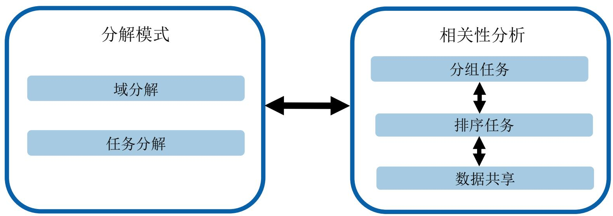

### 算法结构


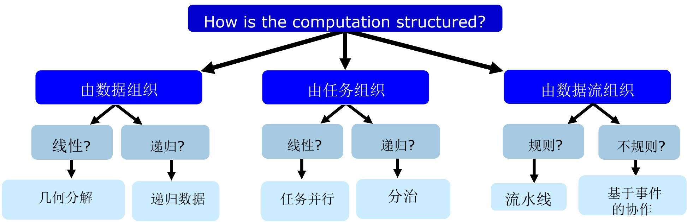

### 支持结构


### 实现机制

将高层次空间中的模式映射到具体的并行计算环境，用于描述进程及线程的管理和数据交换等：

- **执行单元（UE）管理**
  - 线程控制
  - 进程控制
- **同步**
  - Memory sync/fences
  - 互斥锁
  - 路障
- **通信**
  - 消息传递
  - 组通信
  - 其他通信方式

---

## 并行编程框架

### 出发点

**简化一类问题的并行编程难度和复杂度**

### 实现方式

- 对并行算法的**抽象描述**
- 提供**编程API**
- 兼容多种并行计算平台的**运行时环境**
- **自动任务分配和调度**
- **运行期监控和容错**

### 并行编程框架的价值

- **降低开发门槛**：开发者不需要深入了解底层并行机制
- **提高开发效率**：使用框架提供的高级抽象
- **保证程序正确性**：框架处理复杂的同步和通信
- **优化性能**：框架自动进行性能优化

### 我国高性能计算基础软件需求

- **并行编程框架**
- **高性能算法库**
- **编译器与编译环境**

---

## 总结

### PCAM方法学要点

1. **系统化设计**：按照划分、通讯、组合、映射四个步骤进行
2. **平衡考虑**：在并行性、通讯开销、负载均衡之间找到平衡
3. **灵活应用**：根据具体问题调整设计策略

### 学习建议

1. **理解每个阶段的目标和方法**
2. **掌握常见的分解和映射技术**
3. **学习经典的并行程序设计模式**
4. **实践具体的并行编程框架**

### 未来发展趋势

1. **更高级的抽象**：降低并行编程门槛
2. **自动化工具**：自动并行化和优化
3. **异构计算支持**：CPU、GPU、FPGA等混合计算
4. **分布式系统**：云计算、边缘计算环境

---

> [!note] 参考资料
> - 《并行程序设计导论》(Pacheco)
> - 《并行计算-结构•算法•编程》(陈国良)
> - Design Patterns for Parallel Programming (Mattson, Sanders, Massingill)
> - 《大规模并行处理器程序设计》(Kirk, Hwu)