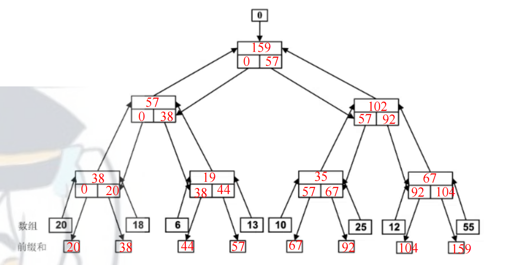

# 一 名词解释
## 1 并行计算
指同时使用多种计算资源来解决一个计算问题的过程 。其核心思想是将一个大的计算任务分解成若干个小的子任务，并分配给多个处理器并行地执行，从而提高求解速度或处理更大规模的问题
## 2 共享内存
指在多处理器系统中，所有的处理器都可以访问同一个全局物理存储器（或同一个逻辑地址空间）的架构模式 。在这种模式下，不同处理器（或线程）之间通过读写这些共享的内存单元来实现数据的交换和通信
### 共享存储访问方式
#### UMA（均匀存储访问）
每个处理器等同地访问统一存储空间
#### NUMA（非均匀存储访问）
- 存储全局统一编址，每个处理器均可直接访问
- 处理器访问本地存储比远程存储快
## 3 集群
是指一组通过**高速网络**连接的独立的**计算机（节点）**，它们通过统一的中间件或软件管理，作为一个单一的、紧密集成的计算资源池来协同工作 。
## 4 多线程
线程是进程上下文中执行的代码序列，是 **CPU 调度和分派的基本单位** 。多线程是指在一个进程内同时运行多个线程，它们共享进程的资源（如内存、文件句柄），但拥有各自的程序计数器和栈 。
## 5 互斥锁
一种用于多线程编程中防止多个线程同时访问共享资源（临界区）的机制 。它确保在任何时刻，**只有一个线程**能够持有锁并进入临界区执行代码，从而避免竞态条件 。
## 6 加速比
是指同一个任务在单处理器系统上的**串行执行时间**与在 $p$ 个处理器并行系统上的**并行执行时间**之比，计算公式如下
$$S_p = \frac{T_s}{T_p}$$
- **$T_s$**：单处理器下的串行执行时间 。
- **$T_p$**：$p$ 个处理器并行执行的时间 。
## 7 OpenMP 编译制导语句
### OpenMP
一种面向**共享内存**多处理器架构的、基于指令（Directive-based）的多线程并行编程模型 。它通过编译器指令、库函数和环境变量来显式制导并行化 。
### 编译制导语句
在 OpenMP 中，以 `#pragma omp` 开头的特殊代码行 。它们告诉编译器如何对随后的代码块进行并行化处理（例如创建线程组、分配循环任务等），如果编译器不支持 OpenMP，这些语句会被当作注释忽略 。
## 8 MPI编程模型
一种基于**消息传递**的并行编程模型，主要用于分布式存储系统 。它定义了一套标准的消息传递库接口，程序员通过显式的发送（Send）和接收（Recv）操作来实现不同进程间的数据交换和同步 。
# 二 简答题
## 1 加速比定律
### Amdahl定律（固定负载）
**出发点**：固定不变的计算负载，增加处理器数。

**公式**：
$$S = \frac{p}{1 + f(p - 1)}$$
当 $p \to \infty$ 时，最大加速比 $S_{max} = \frac{1}{f}$

其中 $f$ 为串行部分占比，$p$ 为处理器数。

**含义**：程序中串行部分限制了加速比的上限。若串行部分占 $f$，则无论用多少处理器，最大加速比不超过 $1/f$。

### Gustafson定律（固定时间）
**出发点**：固定执行时间，增加处理器时相应增大计算量。

**公式**：
$$S' = p - f(p - 1)$$

**含义**：在实际应用中，增加处理器时应增大问题规模，此时加速比随处理器数近似线性增长。

### Sun-Ni定律（存储受限）
**出发点**：存储容量受限，充分利用可用存储。

**公式**：
$$S'' = \frac{f + (1 - f)G(p)}{f + (1 - f)G(p)/p}$$
其中 $G(p)$ 反映存储容量增加到 $p$ 倍时并行工作负载的增加量。

### 三大定律对比
| 定律 | 出发点 | 适用场景 |
|------|--------|----------|
| **Amdahl** | 固定负载 | 计算密集型，问题规模固定 |
| **Gustafson** | 固定时间 | 需要在固定时间内提高精度 |
| **Sun-Ni** | 存储受限 | 内存受限，需充分利用存储 |

## 2 MPI通信接口
- **`MPI_Init`**：初始化 MPI 执行环境 。
- **`MPI_Finalize`**：结束 MPI 执行环境 。
- **`MPI_Comm_rank`**：获取当前进程在通信域中的编号（ID） 。
- **`MPI_Comm_size`**：获取通信域中的总进程数 。
- **`MPI_Send`**：发送消息到目标进程 。
- **`MPI_Recv`**：从源进程接收消息 。
## 3 PCAM设计方法学
- **P (Partitioning) 划分**：分解成小的任务，开拓并发性 。
- **C (Communication) 通讯**：确定任务间的数据交换，监测划分的合理性 。
- **A (Agglomeration) 组合**：根据任务的局部性，将小任务合并成更大的任务，减少开销 。
- **M (Mapping) 映射**：将任务分配到具体的处理器上，平衡负载 。
## 4 并行算法设计策略与思想
- **串行算法的直接并行化**：最简单直接，分析串行算法中的并行性并实现 。
- **从问题描述开始设计**：不考虑现有的串行算法，直接根据问题的本质寻求并行解法（如 3PCF 的暴力解法转并行） 。
- **借用已有算法求解新问题**：找出新问题与已解决问题之间的联系，改造已知算法（这是最高级的策略） 。
## 5 域分解 功能分解 概念及区别
### 域分解（Domain Decomposition）
- 划分的对象是**数据**，可以是输入数据、中间数据和输出数据
- 将数据分解成**大致相等的小数据片**
- 划分时考虑数据上的相应操作
- 如果一个任务需要别的任务中的数据，则会产生**任务间的通讯**
- 常见方式：BLOCK（块）分解、CYCLIC（循环）分解、二维/三维分解等

### 功能分解（Functional Decomposition）
- 划分的对象是**计算**，将计算划分为不同的任务
- 划分后，研究不同任务所需的数据
- 如果数据**不相交**，则划分成功；如果数据有相当重叠，需重新划分
- 功能分解是一种**更深层次的分解**
- 适用于没有明显可分解数据结构的问题（如搜索树、气候模型）

### 两者区别
| 对比项 | 域分解 | 功能分解 |
|--------|--------|----------|
| **划分对象** | 数据 | 计算（任务） |
| **关注点** | 数据如何划分 | 计算任务如何划分 |
| **层次** | 基础分解 | 更深层次分解 |
| **适用场景** | 数据规整的问题 | 无明显数据结构的问题 |
| **后续分析** | 研究数据上的操作 | 研究任务所需的数据 |

# 三 计算题
## 1 加速比定律
（1）经测试发现，一个串行程序 94%的执行时间花费在一个可以并行化的函数中。现使其并行化，问该并行程序在 20 个处理机上执行所能达到的加速比是多少？能达到的最大加速比是多少？

**解**：
- 可并行化部分占比：94%，即 $1 - f = 0.94$
- 串行部分占比：$f = 0.06$
- 处理器数：$p = 20$

根据 Amdahl 定律：
$$S = \frac{p}{1 + f(p - 1)} = \frac{20}{1 + 0.06 \times (20 - 1)} = \frac{20}{1 + 1.14} = \frac{20}{2.14} \approx 9.35$$

最大加速比（当 $p \to \infty$）：
$$S_{max} = \frac{1}{f} = \frac{1}{0.06} \approx 16.67$$

（2）一个并行程序，在单个处理机上执行，8%的时间花费在一个 I/O 函数中，问要达到加速比 10 至少需要多少个处理机？

**解**：
- 串行部分（I/O）占比：$f = 0.08$
- 目标加速比：$S = 10$

根据 Amdahl 定律 $S = \dfrac{p}{1 + f(p - 1)}$，代入：
$$10 = \frac{p}{1 + 0.08(p - 1)}$$
$$10(1 + 0.08p - 0.08) = p$$
$$10(0.92 + 0.08p) = p$$
$$9.2 + 0.8p = p$$
$$9.2 = 0.2p$$
$$p = 46$$

答：至少需要 **46 个处理机**。

## 2 内存系统
### 存储器层次结构
| 层次 | 特点 | 容量 | 延迟 |
|------|------|------|------|
| 寄存器 | 最快，CPU内 | 极少 | ~1ns |
| 高速缓存（L1/L2/L3） | 快，昂贵 | KB~MB级 | 1~10ns |
| 主存（DRAM） | 较慢，便宜 | GB级 | 100ns |
| 外存（磁盘/SSD） | 最慢，容量大 | TB级 | ms级 |

### 关键指标
- **容量（C）**：能保存数据的字节数
- **延迟（L）**：读取一个字所需时间（消防龙头出水等待时间）
- **带宽（B）**：1秒内传送的字节数（消防龙头出水流量）

### 延迟 vs 带宽
- **减少延迟**：适合需要立刻获取数据的场景
- **提高带宽**：适合需要处理大量数据的场景

### 高速缓存与局部性
- **时间局部性**：对相同数据项的重复引用（刚用过的数据很可能再次使用）
- **空间局部性**：连续的计算使用连续的数据字（数组遍历）
- **缓存命中率**：由高速缓存提供的数据份额，命中率越高性能越好

### 内存系统对并行性能的影响
- 1GHz处理器（1ns时钟），DRAM延迟100ns（无缓存）：每次内存访问需等待100个周期
- 计算点积时每次浮点运算需取一次数据，实际速度可能仅为峰值的0.25%
- **提高策略**：利用时间/空间局部性、优化数据布局、提高计算/内存访问比

### UMA vs NUMA
| 对比项 | UMA（均匀存储访问） | NUMA（非均匀存储访问） |
|--------|-------------------|----------------------|
| 存储编址 | 统一编址 | 全局统一编址 |
| 访问速度 | 所有处理器访问速度相同 | 访问本地存储比远程快 |
| 扩展性 | 扩展性有限 | 扩展性较好 |
| 适用场景 | SMP对称多处理器 | 大规模多处理器 |

### 常见计算题示例
#### 题型1：延迟与周期数换算
**例题**：某1GHz处理器（时钟周期1ns），DRAM访问延迟为100ns（无高速缓存）。处理器峰值性能为4GFLOPS，计算点积时每次浮点运算需要访问一次内存数据，求实际能达到的浮点运算性能。
**解**：
- 一次DRAM访问需要的时钟周期数：$100ns / 1ns = 100$ 周期
- 每次浮点运算需等待内存访问完成，实际性能受内存带宽限制。按知识库示例，实际速度仅为峰值的~0.25%，即 $4GFLOPS \times 0.25\% = 10MFLOPS$。

#### 题型2：平均内存访问时间（缓存命中率）
**例题**：某系统存储层次参数如下：
- L1缓存：访问时间1ns，命中率95%
- L2缓存：访问时间10ns，在L1未命中的情况下命中率80%
- 主存：访问时间100ns
求系统的平均内存访问时间。
**解**：
$$
\begin{aligned}
T_{avg} &= T_{L1} \times H_1 + (1-H_1) \times (T_{L2} \times H_2 + (1-H_2) \times T_{mem}) \\
&= 1 \times 0.95 + 0.05 \times (10 \times 0.8 + 0.2 \times 100) \\
&= 0.95 + 0.05 \times (8 + 20) \\
&= 0.95 + 1.4 = 2.35ns
\end{aligned}
$$

#### 题型3：内存带宽计算
**例题**：某内存系统带宽为40GB/s，数据块传输大小为64字节。
（1）传输1MB数据需要多少时间？
（2）若处理器需要连续传输1GB数据，需要多少秒？
**解**：
（1）1MB = $1024 \times 1024 = 1048576$ 字节
$$t = \frac{1048576}{40 \times 10^9} \approx 2.62 \times 10^{-5}s = 26.2\mu s$$
（2）1GB = $10^9$ 字节
$$t = \frac{10^9}{40 \times 10^9} = 0.025s$$

#### 题型4：存储受限加速比（Sun-Ni定律）
**例题**：某程序串行部分占比 $f=0.1$，可并行部分占 $1-f=0.9$。在存储容量为原来的4倍时（$G(p)=4$），使用8个处理器，求Sun-Ni定律下的加速比。
**解**：
Sun-Ni公式：
$$S'' = \frac{f + (1 - f)G(p)}{f + (1 - f)G(p)/p}$$
代入数值：
$$
S'' = \frac{0.1 + 0.9 \times 4}{0.1 + 0.9 \times 4 / 8} = \frac{0.1 + 3.6}{0.1 + 0.45} = \frac{3.7}{0.55} \approx 6.73
$$

#### 题型5：计算/通信比
**例题**：某并行程序在8个处理器上运行，单处理器计算时间为80ms，内存访问通信时间为20ms，求计算/通信比。若优化后内存通信时间降至5ms，计算/通信比变为多少？
**解**：
- 优化前：$\frac{t_{comp}}{t_{comm}} = \frac{80}{20} = 4$
- 优化后：$\frac{80}{5} = 16$

# 四 并行算法描述
## 1 分布式并行编程相关算法题（MapReduce）
### Inverted Index
以如下数据为例分步骤描述基于 MapReduce 模型的Inverted Index 算法 
Page1: I like Tianjin university
Page2: Tianjin university is the oldest university in China
Page3: Tianjin is a beautiful city
Page4: He is being studied in Tianjin university
###  Word Count
以如下数据为例分步骤描述基于 MapReduce 模型的 Word Count 算法

**源数据**：
```
Page 1: "the weather is good"
Page 2: "today is good"
Page 3: "good weather is good"
```

**Map 阶段**（输入：(文件名, 文件内容) → 输出：(单词, 1)）：
```
Worker 1: (Page1, "the weather is good")
  → 输出: (the,1), (weather,1), (is,1), (good,1)

Worker 2: (Page2, "today is good")
  → 输出: (today,1), (is,1), (good,1)

Worker 3: (Page3, "good weather is good")
  → 输出: (good,1), (weather,1), (is,1), (good,1)
```

**Shuffle 阶段**（系统自动将相同单词的键值对分组）：
```
(the, [1])
(is, [1, 1, 1])
(weather, [1, 1])
(today, [1])
(good, [1, 1, 1, 1])
```

**Reduce 阶段**（输入：(单词, 计数列表) → 输出：(单词, 总次数)）：
```
Worker 1: (the, [1]) → (the, 1)
Worker 2: (is, [1,1,1]) → (is, 3)
Worker 3: (weather, [1,1]) → (weather, 2)
Worker 4: (today, [1]) → (today, 1)
Worker 5: (good, [1,1,1,1]) → (good, 4)
```

**伪代码**：
```
// Map函数
map(input_key, input_value):
    for word in input_value.split():
        emit(word, "1")

// Reduce函数
reduce(output_key, intermediate_values):
    result = 0
    for v in intermediate_values:
        result += int(v)
    emit(str(result))
```

## 2 多线程共享编程相关算法题（OpenMP、MPI）
### MPI 并行编程求 $f(n)=1^3+2^3+\dots+n^3$
#### 参考思路及伪代码
1. **初始化**：调用 `MPI_Init`。
2. **找准位子**：获取自己的 `my_rank` 和进程总数 `p` 。
3. **划定范围**：
    - 每个进程计算的个数 `local_n = n / p`。
    - 自己的起始点 `start = my_rank * local_n + 1`。
    - 自己的终点 `end = (my_rank + 1) * local_n`。
4. **局部计算**：每个进程用一个循环累加自己负责范围内的立方和，存入 `local_sum`。
5. **全局汇总**：调用 `MPI_Reduce`，将所有进程的 `local_sum` 相加，结果交给进程 0 存入 `total_sum` 。
6. **结束**：进程 0 打印结果，所有进程调用 `MPI_Finalize` 。
$$
\begin{aligned}
&\text{MPI\_Init()} \\
&\text{my\_rank} \leftarrow \text{MPI\_Comm\_rank(MPI\_COMM\_WORLD)} \\
&\text{p} \leftarrow \text{MPI\_Comm\_size(MPI\_COMM\_WORLD)} \\[8pt]
&\textbf{if my\_rank == 0 then} \\
&\quad n \leftarrow \text{输入 } n \\
&\textbf{end if} \\[6pt]
&\text{MPI\_Bcast}(n, \text{root}=0) \quad \text{// 广播 n 给所有进程} \\[8pt]
&\text{// 任务划分（负载均衡）} \\
&\text{chunk} \leftarrow n / p \quad;\quad \text{remainder} \leftarrow n \bmod p \\[6pt]
&\textbf{if my\_rank < remainder then} \\
&\quad \text{start} \leftarrow \text{my\_rank} \times (\text{chunk} + 1) + 1 \\
&\quad \text{end} \leftarrow \text{start} + \text{chunk} \\
&\textbf{else} \\
&\quad \text{start} \leftarrow \text{my\_rank} \times \text{chunk} + \text{remainder} + 1 \\
&\quad \text{end} \leftarrow \text{start} + \text{chunk} - 1 \\
&\textbf{end if} \\[6pt]
&\textbf{if start > n then} \\
&\quad \text{start} \leftarrow 1;\quad \text{end} \leftarrow 0 \quad \text{// 防止空进程} \\
&\textbf{end if} \\[8pt]
&\text{local\_sum} \leftarrow 0 \\
&\textbf{for } i = \text{start} \textbf{ to } \text{end} \textbf{ do} \\
&\quad \text{local\_sum} \leftarrow \text{local\_sum} + i \times i \times i \\
&\textbf{end for} \\[8pt]
&\text{MPI\_Reduce}(\text{local\_sum}, \text{total\_sum}, \text{MPI\_SUM}, \text{root}=0) \\[8pt]
&\textbf{if my\_rank == 0 then} \\
&\quad \text{print } 1^3 + 2^3 + \dots +  + n^3 = \text{total\_sum} \\
&\textbf{end if} \\[6pt]
&\text{MPI\_Finalize()}
\end{aligned}
$$
```pseudocode 
MPI_Init() 
my_rank ← MPI_Comm_rank(MPI_COMM_WORLD) 
p ← MPI_Comm_size(MPI_COMM_WORLD)

if my_rank == 0 then 
	n ← 输入 n 
end if

MPI_Bcast(n, root = 0) // 广播 n 给所有进程

// 任务划分（负载均衡） chunk ← n / p remainder ← n % p

if my_rank < remainder then 
	start ← my_rank × (chunk + 1) + 1 
	end ← start + chunk 
else 
	start ← my_rank × chunk + remainder + 1 
	end ← start + chunk - 1 
end if

if start > n then 
	start ← 1; 
	end ← 0 // 防止空进程 
end if

local_sum ← 0 

for i = start to end do 
	local_sum ← local_sum + i * i * i
end for

MPI_Reduce(local_sum, total_sum, MPI_SUM, root=0)

if my_rank == 0 then 
	print "1³ + 2³ + … + " + n + "³ = " + total_sum

MPI_Finalize()
```
#### 代码实现
```C
#include <stdio.h>
#include <mpi.h>

int main(int argc, char **argv)
{
    int rank, size;
    long long n, local_sum = 0, global_sum = 0;
    long long start, end;

    MPI_Init(&argc, &argv);
    MPI_Comm_rank(MPI_COMM_WORLD, &rank);
    MPI_Comm_size(MPI_COMM_WORLD, &size);

    // 只有 0 号进程读 n
    if (rank == 0) {
        printf("请输入 n: ");
        scanf("%lld", &n);
    }

    // 把 n 广播给所有进程
    MPI_Bcast(&n, 1, MPI_LONG_LONG, 0, MPI_COMM_WORLD);

    if (n <= 0) {
        if (rank == 0) printf("n 必须大于 0\n");
        MPI_Finalize();
        return 0;
    }

    // 计算每个进程负责的范围（负载均衡）
    long long chunk = n / size;
    long long remainder = n % size;

    start = rank * chunk + 1;
    end   = (rank + 1) * chunk;

    if (rank == size - 1) {
        end += remainder;   // 最后一个进程多拿余数
    }

    // 本地计算立方和
    for (long long i = start; i <= end; i++) {
        local_sum += i * i * i;
    }

    // 归约到 0 号进程
    MPI_Reduce(&local_sum, &global_sum, 1, MPI_LONG_LONG, MPI_SUM, 0, MPI_COMM_WORLD);

    if (rank == 0) {
        printf("1^3 + 2^3 + ... + %lld^3 = %lld\n", n, global_sum);
    }

    MPI_Finalize();
    return 0;
}
```
## 五 并行算法分析
## 将并行求前缀和的算法示意图补充完整

**问题**：给定数组 A = {a₀, a₁, a₂, ..., aₙ}，求前缀和数组 B = {b₀, b₁, b₂, ..., bₙ}，其中 bᵢ = sum(a₀ to aᵢ)。

**串行算法**：
```c
b[0] = a[0];
for (i = 1; i < n; i++) {
    b[i] = b[i-1] + a[i];
}
```
串行算法每次迭代依赖上一次结果，无法直接拆分循环。

**并行算法（树形结构）**：

以数组 [a₀, a₁, a₂, a₃, a₄, a₅, a₆, a₇] 为例，按以下步骤进行：

**第1轮**（距离=1，并行执行）：
- b₁ = a₀ + a₁
- b₃ = a₂ + a₃
- b₅ = a₄ + a₅
- b₇ = a₆ + a₇

**第2轮**（距离=2，并行执行）：
- b₂ = b₁ + a₂
- b₃ = b₃ + a₂  （b₃已更新为a₂+a₃，现加上a₀+a₁的结果b₁）
- b₆ = b₅ + a₆
- b₇ = b₇ + a₆

**第3轮**（距离=4，并行执行）：
- b₄ = b₃ + a₄
- b₅ = b₅ + b₃（加上前4个的和）
- b₆ = b₆ + b₃
- b₇ = b₇ + b₃

**共需 log₂(n) 轮**，每轮内各计算可并行执行。

**通用公式**（PRAM模型）：
```
for i = 0 to ceil(log(n))-1:
    for j = 2^i to n-1 (并行):
        A[j] = A[j] + A[j - 2^i]
```

**MPI对应**：`MPI_Scan` 操作，每一个进程都对排在它前面的进程进行归约操作。

**时间复杂度**：O(n) 串行 → O(log n) 并行（PRAM模型，n个处理器）

参考解答：

# 论述题
## 往年题中一个主题和疫情相关，一个说考前会给题，没有参考价值
## 推测今年会考查类似并行计算对于AI/大模型时代的意义相关主题