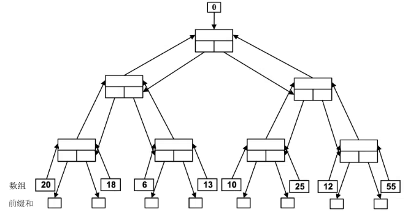

# 一 名词解释
## 1 并行计算
指同时使用多种计算资源来解决一个计算问题的过程 。其核心思想是将一个大的计算任务分解成若干个小的子任务，并分配给多个处理器并行地执行，从而提高求解速度或处理更大规模的问题
## 2 共享内存
指在多处理器系统中，所有的处理器都可以访问同一个全局物理存储器（或同一个逻辑地址空间）的架构模式 。在这种模式下，不同处理器（或线程）之间通过读写这些共享的内存单元来实现数据的交换和通信
### 共享存储访问方式
#### UMA（均匀存储访问）
每个处理器等同地访问统一存储空间
#### NUMA（非均匀存储访问）
- 存储全局统一编址，每个处理器均可直接访问
- 处理器访问本地存储比远程存储快
## 3 集群
是指一组通过**高速网络**连接的独立的**计算机（节点）**，它们通过统一的中间件或软件管理，作为一个单一的、紧密集成的计算资源池来协同工作 。
## 4 多线程
线程是进程上下文中执行的代码序列，是 **CPU 调度和分派的基本单位** 。多线程是指在一个进程内同时运行多个线程，它们共享进程的资源（如内存、文件句柄），但拥有各自的程序计数器和栈 。
## 5 互斥锁
一种用于多线程编程中防止多个线程同时访问共享资源（临界区）的机制 。它确保在任何时刻，**只有一个线程**能够持有锁并进入临界区执行代码，从而避免竞态条件 。
## 6 加速比
是指同一个任务在单处理器系统上的**串行执行时间**与在 $p$ 个处理器并行系统上的**并行执行时间**之比，计算公式如下
$$S_p = \frac{T_s}{T_p}$$
- **$T_s$**：单处理器下的串行执行时间 。
- **$T_p$**：$p$ 个处理器并行执行的时间 。
## 7 OpenMP 编译制导语句
### OpenMP
一种面向**共享内存**多处理器架构的、基于指令（Directive-based）的多线程并行编程模型 。它通过编译器指令、库函数和环境变量来显式制导并行化 。
### 编译制导语句
在 OpenMP 中，以 `#pragma omp` 开头的特殊代码行 。它们告诉编译器如何对随后的代码块进行并行化处理（例如创建线程组、分配循环任务等），如果编译器不支持 OpenMP，这些语句会被当作注释忽略 。
## 8 MPI编程模型
一种基于**消息传递**的并行编程模型，主要用于分布式存储系统 。它定义了一套标准的消息传递库接口，程序员通过显式的发送（Send）和接收（Recv）操作来实现不同进程间的数据交换和同步 。
# 二 简答题
## 1 加速比定律
### Amdahl定律（固定负载）
**出发点**：固定不变的计算负载，增加处理器数。
**公式**：
$$S = \frac{W_s+W_p}{W_s + \frac{W_P}{p}} =\frac{f+(1-f)}{f + \frac{1-f}{p}}= \frac{p}{1 + f(p - 1)}$$
当 $p \to \infty$ 时，最大加速比 $S_{max} = \frac{1}{f}$

其中 $f$ 为串行部分占比，$p$ 为处理器数。

**含义**：程序中串行部分限制了加速比的上限。若串行部分占 $f$，则无论用多少处理器，最大加速比不超过 $1/f$。

**考虑额外开销$W_O$:**
$$S = \frac{W_s+W_p}{W_s + \frac{W_P}{p}+W_O} =\frac{W}{fW + \frac{W(1-f)}{p}+W_O}= \frac{p}{1 + f(p - 1)+\frac{W_O}{W}}$$
### Gustafson定律（固定时间）
**出发点**：固定执行时间，增加处理器时相应增大计算量。

**公式**：
$$S' = \frac{W_S+pW_p}{W_S+\frac{pW_p}{p}}=\frac{f+p(1-f)}{f+(1-f)} = p - f(p - 1)$$

**含义**：在实际应用中，增加处理器时应增大问题规模，此时加速比随处理器数近似线性增长。

**考虑额外开销$W_O$:**
$$S' = \frac{W_S+pW_p}{W_S+\frac{pW_p}{p}+W_O}=\frac{f+p(1-f)}{f+(1-f)+\frac{W_O}{W}} =\frac{f+p(1-f)}{1+\frac{W_O}{W}} $$

### Sun-Ni定律（存储受限）
**出发点**：存储容量受限，充分利用可用存储。

**公式**：
$$S'' = \frac{W_S+W_PG(p)}{W_S+\frac{W_PG(p)}{p}}=\frac{fW+(1-f)WG(p)}{fW+\frac{(1-f)WG(p)}{p}}=\frac{f + (1 - f)G(p)}{f + (1 - f)G(p)/p}$$
其中 $G(p)$ 反映存储容量增加到 $p$ 倍时并行工作负载的增加量。

**考虑额外开销$W_O$:**
$$S'' = \frac{W_S+W_PG(p)}{W_S+\frac{W_PG(p)}{p}+W_O}=\frac{fW+(1-f)WG(p)}{fW+\frac{(1-f)WG(p)}{p}+W_O}=\frac{f + (1 - f)G(p)}{f + (1 - f)G(p)/p+W_O/W}$$
### 三大定律对比
| 定律 | 出发点 | 适用场景 |
|------|--------|----------|
| **Amdahl** | 固定负载 | 计算密集型，问题规模固定 |
| **Gustafson** | 固定时间 | 需要在固定时间内提高精度 |
| **Sun-Ni** | 存储受限 | 内存受限，需充分利用存储 |

## 2 MPI通信接口
- **`MPI_Init`**：初始化 MPI 执行环境 。
- **`MPI_Finalize`**：结束 MPI 执行环境 。
- **`MPI_Comm_rank`**：获取当前进程在通信域中的编号（ID） 。
- **`MPI_Comm_size`**：获取通信域中的总进程数 。
- **`MPI_Send`**：发送消息到目标进程 。
- **`MPI_Recv`**：从源进程接收消息 。
## 3 PCAM设计方法学
- **P (Partitioning) 划分**：分解成小的任务，开拓并发性 。
- **C (Communication) 通讯**：确定任务间的数据交换，监测划分的合理性 。
- **A (Agglomeration) 组合**：根据任务的局部性，将小任务合并成更大的任务，减少开销 。
- **M (Mapping) 映射**：将任务分配到具体的处理器上，平衡负载 。
## 4 并行算法设计策略与思想
- **串行算法的直接并行化**：最简单直接，分析串行算法中的并行性并实现 。
- **从问题描述开始设计**：不考虑现有的串行算法，直接根据问题的本质寻求并行解法（如 3PCF 的暴力解法转并行） 。
- **借用已有算法求解新问题**：找出新问题与已解决问题之间的联系，改造已知算法（这是最高级的策略） 。
## 5 域分解 功能分解 概念及区别
### 域分解（Domain Decomposition）
- 划分的对象是**数据**，可以是输入数据、中间数据和输出数据
- 将数据分解成**大致相等的小数据片**
- 划分时考虑数据上的相应操作
- 如果一个任务需要别的任务中的数据，则会产生**任务间的通讯**
- 常见方式：BLOCK（块）分解、CYCLIC（循环）分解、二维/三维分解等

### 功能分解（Functional Decomposition）
- 划分的对象是**计算**，将计算划分为不同的任务
- 划分后，研究不同任务所需的数据
- 如果数据**不相交**，则划分成功；如果数据有相当重叠，需重新划分
- 功能分解是一种**更深层次的分解**
- 适用于没有明显可分解数据结构的问题（如搜索树、气候模型）

### 两者区别
| 对比项 | 域分解 | 功能分解 |
|--------|--------|----------|
| **划分对象** | 数据 | 计算（任务） |
| **关注点** | 数据如何划分 | 计算任务如何划分 |
| **层次** | 基础分解 | 更深层次分解 |
| **适用场景** | 数据规整的问题 | 无明显数据结构的问题 |
| **后续分析** | 研究数据上的操作 | 研究任务所需的数据 |

# 三 计算题
## 1 加速比定律
（1）经测试发现，一个串行程序 94%的执行时间花费在一个可以并行化的函数中。现使其并行化，问该并行程序在 20 个处理机上执行所能达到的加速比是多少？能达到的最大加速比是多少？

**解**：
- 可并行化部分占比：94%，即 $1 - f = 0.94$
- 串行部分占比：$f = 0.06$
- 处理器数：$p = 20$

根据 Amdahl 定律：
$$S = \frac{p}{1 + f(p - 1)} = \frac{20}{1 + 0.06 \times (20 - 1)} = \frac{20}{1 + 1.14} = \frac{20}{2.14} \approx 9.35$$

最大加速比（当 $p \to \infty$）：
$$S_{max} = \frac{1}{f} = \frac{1}{0.06} \approx 16.67$$

（2）一个并行程序，在单个处理机上执行，8%的时间花费在一个 I/O 函数中，问要达到加速比 10 至少需要多少个处理机？

**解**：
- 串行部分（I/O）占比：$f = 0.08$
- 目标加速比：$S = 10$

根据 Amdahl 定律 $S = \dfrac{p}{1 + f(p - 1)}$，代入：
$$10 = \frac{p}{1 + 0.08(p - 1)}$$
$$10(1 + 0.08p - 0.08) = p$$
$$10(0.92 + 0.08p) = p$$
$$9.2 + 0.8p = p$$
$$9.2 = 0.2p$$
$$p = 46$$

答：至少需要 **46 个处理机**。

## 2 内存系统
### 存储器层次结构
| 层次 | 特点 | 容量 | 延迟 |
|------|------|------|------|
| 寄存器 | 最快，CPU内 | 极少 | ~1ns |
| 高速缓存（L1/L2/L3） | 快，昂贵 | KB~MB级 | 1~10ns |
| 主存（DRAM） | 较慢，便宜 | GB级 | 100ns |
| 外存（磁盘/SSD） | 最慢，容量大 | TB级 | ms级 |

### 关键指标
- **容量（C）**：能保存数据的字节数
- **延迟（L）**：读取一个字所需时间（消防龙头出水等待时间）
- **带宽（B）**：1秒内传送的字节数（消防龙头出水流量）

### 延迟 vs 带宽
- **减少延迟**：适合需要立刻获取数据的场景
- **提高带宽**：适合需要处理大量数据的场景

### 高速缓存与局部性
- **时间局部性**：对相同数据项的重复引用（刚用过的数据很可能再次使用）
- **空间局部性**：连续的计算使用连续的数据字（数组遍历）
- **缓存命中率**：由高速缓存提供的数据份额，命中率越高性能越好

### 内存系统对并行性能的影响
- 1GHz处理器（1ns时钟），DRAM延迟100ns（无缓存）：每次内存访问需等待100个周期
- 计算点积时每次浮点运算需取一次数据，实际速度可能仅为峰值的0.25%
- **提高策略**：利用时间/空间局部性、优化数据布局、提高计算/内存访问比

### UMA vs NUMA
| 对比项  | UMA（均匀存储访问） | NUMA（非均匀存储访问） |
| ---- | ----------- | ------------- |
| 存储编址 | 统一编址        | 全局统一编址        |
| 访问速度 | 所有处理器访问速度相同 | 访问本地存储比远程快    |
| 扩展性  | 扩展性有限       | 扩展性较好         |
| 适用场景 | SMP对称多处理器   | 大规模多处理器       |

### 参考例题（PPT 并行计算的性能）
已知某处理器的主频为 **1GHz**（每个时钟周期为 1ns），内部设有 2 个乘加部件，与之相连的 DRAM 内存访问延迟为 **100ns**。每个时钟周期理论上最多能执行 **4 条** 浮点指令。
- 理论峰值 1GHz × 4 FLOPS = 4 GFLOPS
#### 1 计算访存受限下的速度
若该处理器**没有高速缓存（Cache）**，且内存交换的**块大小（Block Size）为 1 个字**。现执行两个长向量的点积运算（$a \cdot b = \sum a_i b_i$），已知每次浮点运算都需要取一次数据。
- 在该平台上执行此点积运算的**实际速度**是多少？（以 MFLOPS 为单位）
$$\frac{1 \text{FLOP}} {100\text{ns}} = 10 \text{ MFLOPS}$$
- 此时处理器的效率（实际速度 / 理论峰值）是多少？
$$\frac{10\text{MFLOPS}}{4\text{GFLOPS}}=0.25\%$$
#### 计算高速缓存对性能的提升（时间本地性）
在上述硬件基础上，增加一个容量为 **32KB** 的高速缓存（Cache），其延迟可忽略不计（1ns）。完成 $32 \times 32$ 的**矩阵乘法**（$C = A \times B$）。已知$32 \times 32$ 的矩阵 A 和 B 总计占用 **2K 个字**，可完整放入 Cache。矩阵乘法的运算步数遵循 $2n^3=2\times32^3=64\text{K}$ 公式。
- 请计算完成该矩阵乘法所需的**总时间**（从内存加载数据到 Cache 的时间 + 在 Cache 内计算的时间）。
$$\text{加载时间}=2\text{K}×100\text{ns}=200,000\text{ns} = \mathbf{200 \mu s}$$
$$计算时间=\frac{64 \text{K}}{4} = 16000\text{ns} = \mathbf{16 \mu s}$$
$$总时间=\mathbf{200 \mu s}+\mathbf{16 \mu s}=\mathbf{216 \mu s}$$
- 计算该算法在该系统下的**有效计算速度**（MFLOPS）
$$有效计算速度=\frac{计算步数}{总时间}=\frac{64\text{K}}{216\mu s}=303\text{MFLOPS}=30.3\times 10 \text{MFLOPS}$$
#### 计算内存带宽的影响（空间本地性）
回到第（1）小题的**向量点积**运算（无 Cache 情况）。若将内存交换的**块大小（Block Size）从 1 个字增加到 4 个字**，且假设向量数据在内存中是线性排列的（符合空间本地性）。
- 请计算此时点积运算的**峰值计算速度**是多少？
- **计算**：100ns 拿回 4 个数。算点积需要从 A 和 B 两个数组取数，所以 200ns 能拿回 4 对数（执行 8 个 FLOPs）。
- **结果**：$8 \text{ FLOPs} / 200\text{ns} = \mathbf{40 \text{ MFLOPS}}$。性能翻了 4 倍。
---
# 四 并行算法描述
## 1 分布式并行编程相关算法题（MapReduce）
### Inverted Index
以如下数据为例分步骤描述基于 MapReduce 模型的Inverted Index 算法 
Page1: I like Tianjin university
Page2: Tianjin university is the oldest university in China
Page3: Tianjin is a beautiful city
Page4: He is being studied in Tianjin university

**问题描述**：统计各个单词分别在哪些文件中出现过，是搜索引擎的核心技术：给定一个单词，快速找到包含该单词的所有文档。

**Map 阶段**（输入：(文件名, 文件内容) → 输出：(单词, 文件名)）：
```
Worker 1: (Page1, "I like Tianjin university")
  → 输出: (I,Page1), (like,Page1), (Tianjin,Page1), (university,Page1)

Worker 2: (Page2, "Tianjin university is the oldest university in China")
  → 输出: (Tianjin,Page2), (university,Page2), (is,Page2), (the,Page2), (oldest,Page2), (university,Page2), (in,Page2), (China,Page2)

Worker 3: (Page3, "Tianjin is a beautiful city")
  → 输出: (Tianjin,Page3), (is,Page3), (a,Page3), (beautiful,Page3), (city,Page3)

Worker 4: (Page4, "He is being studied in Tianjin university")
  → 输出: (He,Page4), (is,Page4), (being,Page4), (studied,Page4), (in,Page4), (Tianjin,Page4), (university,Page4)
```

**Shuffle 阶段**（系统自动将相同单词的键值对分组）：
```
(I, [Page1])
(like, [Page1])
(Tianjin, [Page1, Page2, Page3, Page4])
(university, [Page1, Page2, Page2, Page4])
(is, [Page2, Page3, Page4])
(the, [Page2])
(oldest, [Page2])
(in, [Page2, Page4])
(China, [Page2])
(a, [Page3])
(beautiful, [Page3])
(city, [Page3])
(He, [Page4])
(being, [Page4])
(studied, [Page4])
```

**Reduce 阶段**（输入：(单词, 文档名列表) → 输出：(单词, 文档名集合)）：
```
Worker 1: (I, [Page1]) → (I, "Page1")
Worker 2: (like, [Page1]) → (like, "Page1")
Worker 3: (Tianjin, [Page1, Page2, Page3, Page4]) → (Tianjin, "Page1 Page2 Page3 Page4")
Worker 4: (university, [Page1, Page2, Page2, Page4]) → (university, "Page1 Page2 Page2 Page4")
Worker 5: (is, [Page2, Page3, Page4]) → (is, "Page2 Page3 Page4")
Worker 6: (the, [Page2]) → (the, "Page2")
Worker 7: (oldest, [Page2]) → (oldest, "Page2")
Worker 8: (in, [Page2, Page4]) → (in, "Page2 Page4")
Worker 9: (China, [Page2]) → (China, "Page2")
Worker 10: (a, [Page3]) → (a, "Page3")
Worker 11: (beautiful, [Page3]) → (beautiful, "Page3")
Worker 12: (city, [Page3]) → (city, "Page3")
Worker 13: (He, [Page4]) → (He, "Page4")
Worker 14: (being, [Page4]) → (being, "Page4")
Worker 15: (studied, [Page4]) → (studied, "Page4")
```

**伪代码**：
```
// Map函数：输出(单词, 文件名)
map(input_key, input_value):
    for word in input_value.split():
        emit(word, input_key)

// Reduce函数：合并相同单词的文档名
reduce(output_key, intermediate_values):
    result = ""
    for v in intermediate_values:
        result += " " + v
    emit(result)
```

###  Word Count
以如下数据为例分步骤描述基于 MapReduce 模型的 Word Count 算法

**源数据**：
```
Page 1: "the weather is good"
Page 2: "today is good"
Page 3: "good weather is good"
```

**Map 阶段**（输入：(文件名, 文件内容) → 输出：(单词, 1)）：
```
Worker 1: (Page1, "the weather is good")
  → 输出: (the,1), (weather,1), (is,1), (good,1)

Worker 2: (Page2, "today is good")
  → 输出: (today,1), (is,1), (good,1)

Worker 3: (Page3, "good weather is good")
  → 输出: (good,1), (weather,1), (is,1), (good,1)
```

**Shuffle 阶段**（系统自动将相同单词的键值对分组）：
```
(the, [1])
(is, [1, 1, 1])
(weather, [1, 1])
(today, [1])
(good, [1, 1, 1, 1])
```

**Reduce 阶段**（输入：(单词, 计数列表) → 输出：(单词, 总次数)）：
```
Worker 1: (the, [1]) → (the, 1)
Worker 2: (is, [1,1,1]) → (is, 3)
Worker 3: (weather, [1,1]) → (weather, 2)
Worker 4: (today, [1]) → (today, 1)
Worker 5: (good, [1,1,1,1]) → (good, 4)
```

**伪代码**：
```
// Map函数
map(input_key, input_value):
    for word in input_value.split():
        emit(word, "1")

// Reduce函数
reduce(output_key, intermediate_values):
    result = 0
    for v in intermediate_values:
        result += int(v)
    emit(str(result))
```

## 2 多线程共享编程相关算法题（OpenMP、MPI）
### MPI 并行编程求 $f(n)=1^3+2^3+\dots+n^3$
#### 参考思路
1. **初始化**：调用 `MPI_Init`。
2. **找准位子**：获取自己的 `my_rank` 和进程总数 `p` 。
3. **划定范围**：
    - 每个进程计算的个数 `local_n = n / p`。
    - 自己的起始点 `start = my_rank * local_n + 1`。
    - 自己的终点 `end = (my_rank + 1) * local_n`。
4. **局部计算**：每个进程用一个循环累加自己负责范围内的立方和，存入 `local_sum`。
5. **全局汇总**：调用 `MPI_Reduce`，将所有进程的 `local_sum` 相加，结果交给进程 0 存入 `total_sum` 。
6. **结束**：进程 0 打印结果，所有进程调用 `MPI_Finalize` 。
#### 伪代码
$$
\begin{aligned}
&\text{MPI\_Init()} \\
&\text{my\_rank} \leftarrow \text{MPI\_Comm\_rank(MPI\_COMM\_WORLD)} \\
&\text{p} \leftarrow \text{MPI\_Comm\_size(MPI\_COMM\_WORLD)} \\[6pt]
&\textbf{if } \text{my\_rank == 0 } \textbf{then} \\
&\quad n \leftarrow \text{输入 } n \\
&\textbf{end if} \\[8pt]
&\text{MPI\_Bcast}(n, \text{root}=0) \quad \text{// 广播 n 给所有进程} \\[8pt]
&\text{// 任务划分（负载均衡）} \\
&\text{chunk} \leftarrow n / p \quad;\quad \text{remainder} \leftarrow n \bmod p \\[6pt]
&\textbf{if } \text{my\_rank < remainder } \textbf{then} \\
&\quad \text{start} \leftarrow \text{my\_rank} \times (\text{chunk} + 1) + 1 \\
&\quad \text{end} \leftarrow \text{start} + \text{chunk} \\
&\textbf{else} \\
&\quad \text{start} \leftarrow \text{my\_rank} \times \text{chunk} + \text{remainder} + 1 \\
&\quad \text{end} \leftarrow \text{start} + \text{chunk} - 1 \\
&\textbf{end if} \\[6pt]
&\textbf{if } \text{start > n } \textbf{then} \\
&\quad \text{start} \leftarrow 1;\quad \text{end} \leftarrow 0 \quad \text{// 防止空进程} \\
&\textbf{end if} \\[8pt]
&\text{local\_sum} \leftarrow 0 \\
&\textbf{for } i = \text{start} \textbf{ to } \text{end} \textbf{ do} \\
&\quad \text{local\_sum} \leftarrow \text{local\_sum} + i \times i \times i \\
&\textbf{end for} \\[8pt]
&\text{MPI\_Reduce}(\text{local\_sum}, \text{total\_sum}, \text{MPI\_SUM}, \text{root}=0) \\[6pt]
&\textbf{if } \text{my\_rank == 0 } \textbf{then} \\
&\quad \text{print } 1^3 + 2^3 + \dots +  + n^3 = \text{total\_sum} \\
&\textbf{end if} \\[8pt]
&\text{MPI\_Finalize()}
\end{aligned}
$$
#### C代码实现
```C
#include <stdio.h>
#include <mpi.h>

int main(int argc, char **argv)
{
    int rank, size;
    long long n, local_sum = 0, global_sum = 0;
    long long start, end;

    MPI_Init(&argc, &argv);
    MPI_Comm_rank(MPI_COMM_WORLD, &rank);
    MPI_Comm_size(MPI_COMM_WORLD, &size);

    // 只有 0 号进程读 n
    if (rank == 0) {
        printf("请输入 n: ");
        scanf("%lld", &n);
    }

    // 把 n 广播给所有进程
    MPI_Bcast(&n, 1, MPI_LONG_LONG, 0, MPI_COMM_WORLD);

    if (n <= 0) {
        if (rank == 0) printf("n 必须大于 0\n");
        MPI_Finalize();
        return 0;
    }

    // 计算每个进程负责的范围（负载均衡）
    long long chunk = n / size;
    long long remainder = n % size;

    start = rank * chunk + 1;
    end   = (rank + 1) * chunk;

    if (rank == size - 1) {
        end += remainder;   // 最后一个进程多拿余数
    }

    // 本地计算立方和
    for (long long i = start; i <= end; i++) {
        local_sum += i * i * i;
    }

    // 归约到 0 号进程
    MPI_Reduce(&local_sum, &global_sum, 1, MPI_LONG_LONG, MPI_SUM, 0, MPI_COMM_WORLD);

    if (rank == 0) {
        printf("1^3 + 2^3 + ... + %lld^3 = %lld\n", n, global_sum);
    }

    MPI_Finalize();
    return 0;
}
```
## 五 并行算法分析
## 将并行求前缀和的算法示意图补充完整

**问题**：给定数组 $A = \{a₀, a₁, a₂, ..., aₙ\}$，求前缀和数组 $B = \{b₀, b₁, b₂, ..., bₙ\}$，其中 $bᵢ = sum(a₀ to aᵢ)$。

**串行算法**：
```c
b[0] = a[0];
for (i = 1; i < n; i++) {
    b[i] = b[i-1] + a[i];
}
```
串行算法每次迭代依赖上一次结果，无法直接拆分循环。

**并行算法（树形结构）**：

以数组 [a₀, a₁, a₂, a₃, a₄, a₅, a₆, a₇] 为例，按以下步骤进行：

**第1轮**（距离=1，并行执行）：
- b₁ = a₀ + a₁
- b₃ = a₂ + a₃
- b₅ = a₄ + a₅
- b₇ = a₆ + a₇

**第2轮**（距离=2，并行执行）：
- b₂ = b₁ + a₂
- b₃ = b₃ + a₂  （b₃已更新为a₂+a₃，现加上a₀+a₁的结果b₁）
- b₆ = b₅ + a₆
- b₇ = b₇ + a₆

**第3轮**（距离=4，并行执行）：
- b₄ = b₃ + a₄
- b₅ = b₅ + b₃（加上前4个的和）
- b₆ = b₆ + b₃
- b₇ = b₇ + b₃

**共需 log₂(n) 轮**，每轮内各计算可并行执行。

**通用公式**（PRAM模型）：
```
for i = 0 to ceil(log(n))-1:
    for j = 2^i to n-1 (并行):
        A[j] = A[j] + A[j - 2^i]
```

**MPI对应**：`MPI_Scan` 操作，每一个进程都对排在它前面的进程进行归约操作。

**时间复杂度**：O(n) 串行 → O(log n) 并行（PRAM模型，n个处理器）

参考解答：

# 论述题
## 往年题中一个主题和疫情相关，一个说考前会给题，没有参考价值
## 并行计算对于AI/大模型时代的意义

> 以下为参考素材，考试时结合自身理解展开论述，不必死记硬背。

### 一、总述：从"优化手段"到"基础设施"
并行计算已从"性能优化手段"升级为AI/大模型时代的**刚需基础设施**。没有并行计算，千亿乃至万亿参数的大模型训练与推理根本无法实现。课程中学到的并行算法设计、PCAM方法学、MPI/MapReduce编程模型、加速比定律等知识，正是理解这一时代的钥匙。

---

### 二、技术层面：并行计算解决大模型核心痛点

#### 1. 突破单硬件物理瓶颈（对应课程：并行计算硬件环境、内存系统）
- **参数规模远超单卡容量**：GPT-3（1750亿参数）仅模型状态（权重+梯度+优化器）就需约 **2.1TB** 显存，而单张 H100 仅 80GB。
- **课程知识对应**：
  - GPU 的 SIMD 架构适合数据并行（课程：02-并行计算硬件环境 → SIMD）
  - NUMA/UMA 内存架构影响多卡通信效率（课程：名词解释-共享内存）
  - 缓存局部性优化对大模型训练性能至关重要（课程：04-并行计算的性能 → 内存系统）

#### 2. 三大并行策略是大模型训练的"三驾马车"（对应课程：并行算法设计、PCAM方法学）

| 并行策略 | 课程对应知识点 | 大模型应用案例 |
|---------|--------------|--------------|
| **数据并行(DP)** | 串行算法直接并行化（11-并行算法设计） | 每个GPU存完整模型副本，分批处理数据；DeepSeek-V3用2048张H800，54天完成671B参数预训练 |
| **张量并行(TP)** | 域分解（12-PCAM方法学） | 将权重矩阵按行/列切分到不同GPU；单机内用NVLink高速互联（GPT-5.5部署在GB200 NVL72） |
| **流水线并行(PP)** | 功能分解+组合（12-PCAM） | 模型层分段到不同GPU，用微批次减少"气泡"；Meta Llama3.1 405B用16384张H100训练54天 |

#### 3. 加速比定律的现实印证（对应课程：04-加速比定律）
- **Amdahl定律**：大模型中的串行部分（如梯度同步、参数广播）限制了加速比上限。千卡集群效率损失需控制在15%以内。
- **Gustafson定律**：固定训练时间（如1个月），用更多GPU可训练更大模型（如从405B到671B参数）。
- **Sun-Ni定律**：存储受限场景，DeepSeek-V3用8GB激活参数+671B总参数（MoE架构），充分利用显存容量。

---

### 三、产业层面：并行计算决定AI竞争力

#### 1. 训练效率对比

| 项目 | 硬件配置 | 模型规模 | 训练周期 | 算力利用率 |
|------|---------|---------|---------|-----------|
| GPT-3（2020） | 1024张A100 | 175B | ~1个月 | ~40% |
| Meta Llama3.1（2024） | 16384张H100 | 405B | 54天 | ~45% |
| DeepSeek-V3（2025） | 2048张H800 | 671B | 54天 | ~60% |
| 字节MegaScale（2025） | 12288张A100/A800 | GPT-3规模 | 1.75天 | **55.2%** |

#### 2. 成本优化（对应课程：代价 Cost = 时间 × 处理器数）
- 混合并行（3D并行+ZeRO）比纯数据并行节省 **30%以上** 成本（700B模型：8.8万 vs 19.2万美元）
- 推理加速：Parallel-R1框架使LLaMA3 70B推理速度从12→45 tokens/sec（3.75倍）；NVIDIA GB200部署使每百万token成本降低35倍

#### 3. 支撑前沿探索
- **MoE架构**：专家并行（EP）让DeepSeek-V3仅激活37B参数即可达到671B模型效果
- **多模态与长上下文**：序列并行（SP）、上下文并行（CP）支持百万token输入（Qwen2.5-VL-72B）
- **超大规模模型**：Switch Transformer（1.6万亿参数）依赖混合并行才能训练

---

### 四、课程知识在大模型中的直接应用

#### 1. PCAM方法学的直接映射
| PCAM阶段 | 大模型中的对应实践 |
|---------|------------------|
| **划分(P)** | 数据分片（DP）、模型层切分（PP）、权重矩阵切分（TP） |
| **通信(C)** | All-Reduce（梯度同步）、点对点传输（PP）、All-to-All（EP） |
| **组合(A)** | 微批次（micro-batch）减少流水线气泡、激活重计算 |
| **映射(M)** | 任务调度到GPU/节点，NVLink域内优先TP，跨节点用PP |

#### 2. 并行编程模型的演进
- **MPI思想** → NCCL（NVIDIA集合通信库）实现All-Reduce/Gather等
- **MapReduce思想** → 分布式训练中的数据分片与归约
- **OpenMP** → CPU-GPU异构编程、多线程数据预处理

#### 3. 内存系统知识的应用
- 缓存局部性 → 数据布局优化（SoA vs AoS）、算子融合减少内存访问
- 带宽vs延迟 → HBM3e显存（带宽4TB/s）+ NVLink（900GB/s）解决通信瓶颈
- 计算/通信比 → 通信-计算重叠（CUDA Stream异步），通信耗时占比从50%降至20%以下

---

### 五、未来趋势（对应课程：并行计算未来发展方向）
1. **自动并行**：人工调优占项目周期40%，Alpa/GSPMD等自动并行框架正在落地
2. **异构计算**：CPU+GPU+TPU混合集群，国产算力适配（对应课程：异构计算支持）
3. **推理优先**：张量并行+投机采样+量化，让大模型在边缘设备部署（Parallel-R1推理速度提升3-7倍）
4. **绿色AI**：通信-计算重叠、功耗感知调度，降低每token能耗（GB200每兆瓦产出提升50倍）

---

### 六、万能论述框架（考试可直接套用）

**开头**：点明并行计算对AI/大模型的基础性作用。
> 并行计算是AI/大模型时代的核心驱动力。从课程中的Amdahl定律到产业中的千卡集群，从PCAM方法学到3D混合并行，并行计算的理论与实践贯穿了整个大模型发展历程。

**主体**（选2-3个角度展开）：
- 角度1：**理论印证** — Amdahl/Gustafson定律解释为什么更多GPU不等于线性加速
- 角度2：**技术实现** — 数据并行、张量并行、流水线并行三大策略与课程PCAM的对应关系
- 角度3：**产业价值** — 训练效率、成本优化、前沿探索（MoE、多模态）

**结尾**：升华到并行计算作为"桥梁"和"发动机"的双重角色。
> 并行计算不仅是AI/大模型时代的"发动机"，更是连接课程理论与产业实践的桥梁。从Amdahl定律到3D混合并行，从PCAM方法学到千卡集群调度，课程中的每个知识点都在大模型训练中得到印证和升华。未来，随着模型规模持续扩大，并行计算的创新将直接决定AI技术的发展边界。

---

### 参考资料
1. 《大模型训练的混合并行技术综述》，计算机学报，2026年1月
2. NVIDIA Megatron-LM & 腾讯云最佳实践（3D并行技术详解）
3. 字节跳动 MegaScale 系统技术报告（万卡集群实践）
4. DeepSeek-V3 技术报告（MoE+混合并行，2048张H800）
5. NVIDIA GB200 与 OpenAI 合作报告（GPT-5.5部署，10万GPU集群）
