# 并行计算硬件环境

汤善江 副教授

天津大学智能与计算学部

tashj@tju.edu.cn

http://cic.tju.edu.cn/faculty/tangshanjiang/

# Outline

• PRAM模型  
• 处理器  
• 互联网络   
• 内存访问模式  
• 并行计算系统体系结构

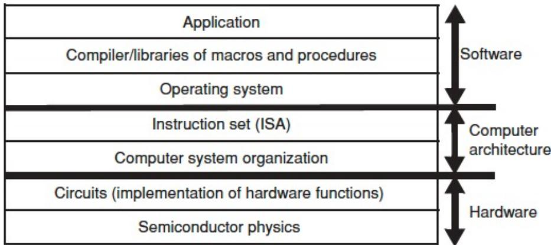

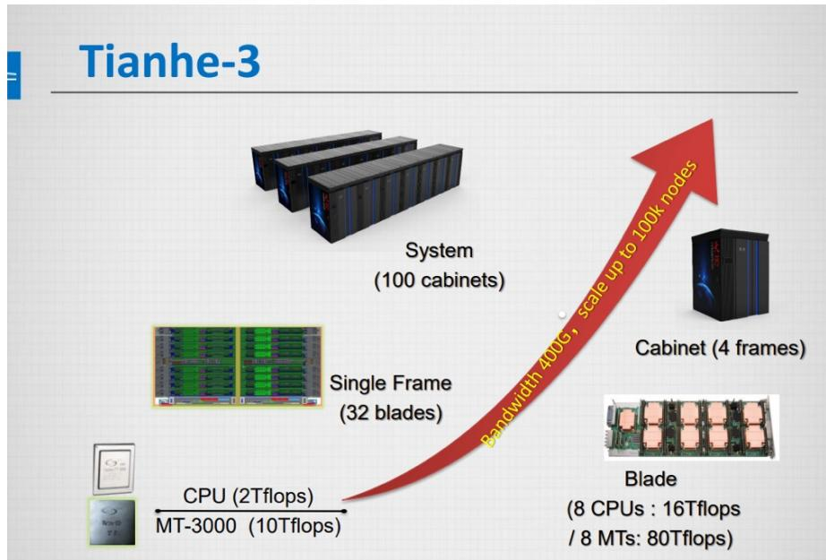

# Outline

• PRAM模型  
• 处理器  
• 互联网络   
•内存访问模式  
并行计算系统体系结构

# PRAM模型

# • Parallel Random Access Machine

• Read phase：每个处理器可同时自共享的内存中读取数据到自己的寄存器  
Compute phase：每个处理器执行计算过程，数据存储在本地寄存器  
Write phase：每个处理器可同时将数据写入到共享的内存（潜在冲突）

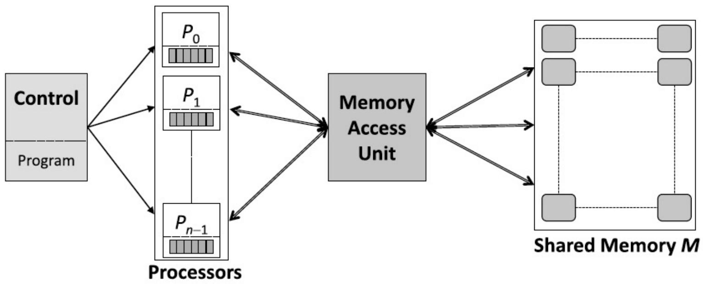

# PRAM衍生模型

• ER: Exclusive Read   
• CR: Concurrent Read   
• EW: Exclusive Write   
• CW: Concurrent Write

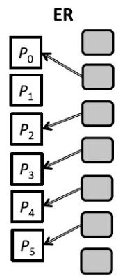

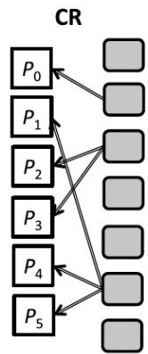

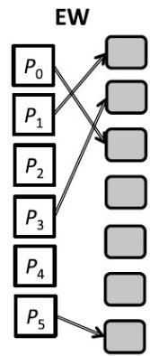

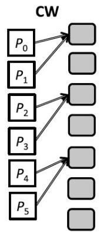

• EREW

• 任意两个处理器不能并发读，也不能并发写

• CREW

• 可以并发读，但不会并发写

• CRCW

• 可以并发读，也可以并发写（不安全，但更实际）

# 基于PRAM模型的并行算法设计

• 前缀求和

$$
\text {f o r} (i = 1; i <   n; i + +)
$$

$$
A [ i ] = A [ i ] + A [ i - 1 ]
$$

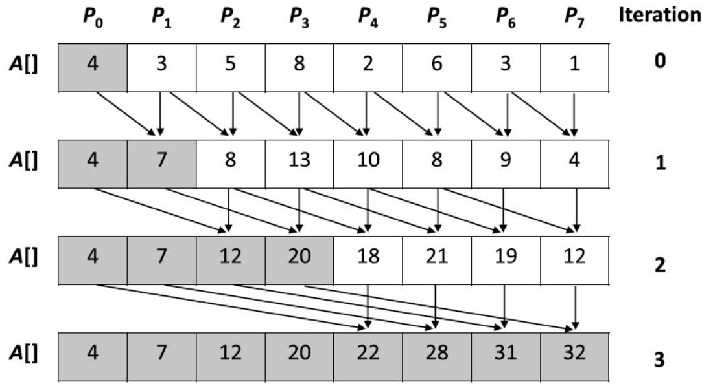

for $\scriptstyle \dot { ] } = \Theta$ $\scriptstyle { \mathrm { j } } < { \mathsf { n } }$ $\mathrm { j } + +$ ） do_in_parallel

$\mathsf { r e g \mathrm { _ { - } j } = A [ j ] }$ ；

for ( $\scriptstyle \dot { 1 } = 0$ ；i<ceil(log(n)); $\dot { \bf 1 } + +$ ） do

for(j = pow(2,i)；j<n; $\mathrm { j } + +$ ）do_in_parallel{

reg-j $+ =$

}

求log(n)，向上取整，外循环次数

内层循环，自第2i个数开始

# 基于PRAM模型的并行算法设计

# • 数组压缩

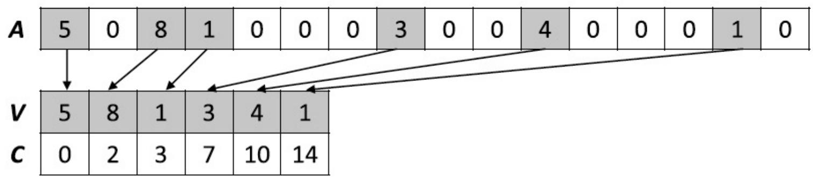

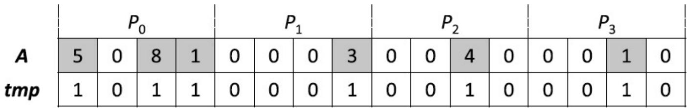

求前缀和，得到压缩后数组中的位置信息（不是C）

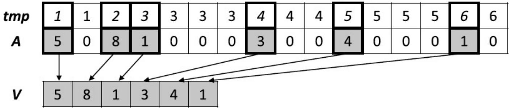  
parallel prefix summation(tmp)

# Outline

• PRAM模型  
• 处理器

• SIMD   
• 多核处理器  
• GPU

互联网络   
• 内存访问模式  
•并行计算系统体系结构

# Flynn分类

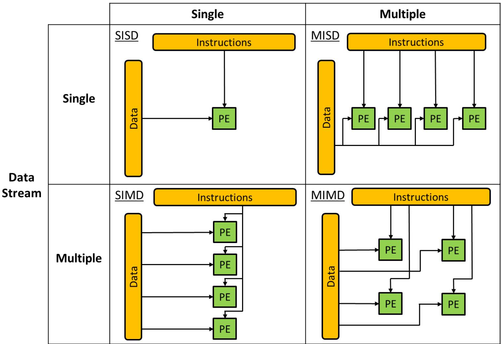  
Instruction Stream

# SIMD指令执行

$$
\begin{array}{l} f o r (i = 0; i <   n; i + +) \\ i f (u [ i ] > 0) \\ w [ i ] = u [ i ] - v [ i ]; \\ e l s e \\ w [ i ] = u [ i ] + v [ i ]; \\ \end{array}
$$

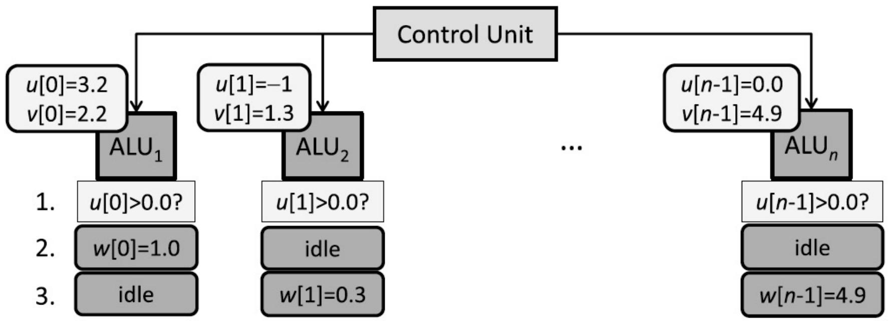

# X86 SSE/AVX 指令集

Intel 公司设计、对其 X86体系的 SIMD 扩展指令集  
支持向量化数据并行，同时操作的数据个数由向量寄存器的长度与数据类型共同决定

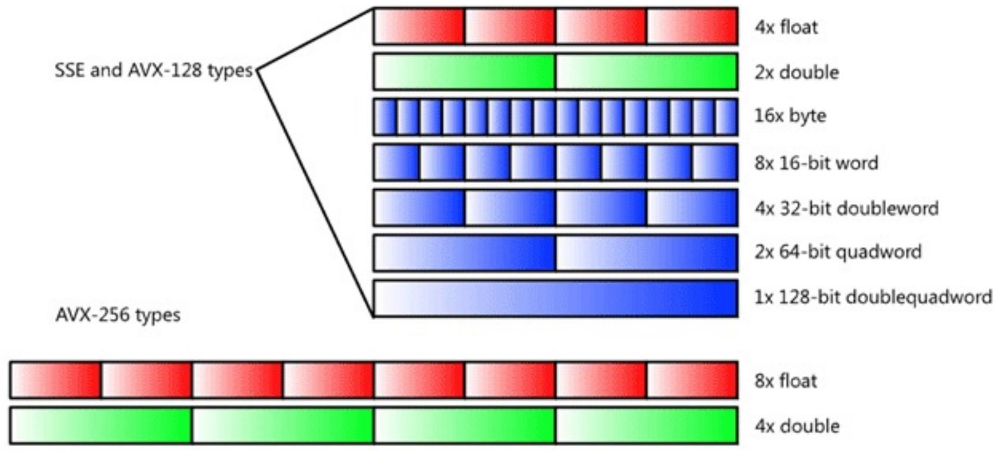

# AVX2示例

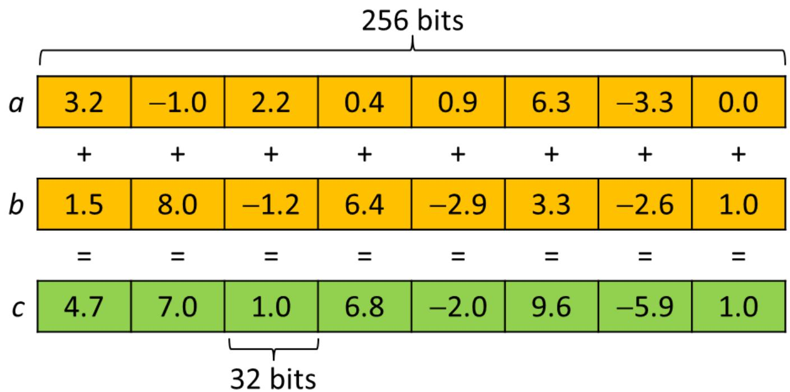

```lisp
//AVX2-Programming with C/C++ Intrinsics
_m256 a, b, c; // declare AVX registers
...
// initialize a and b
c = _mm256_add_ps(a, b); // c[0:8] = a[0:8] + b[0:8] 
```

# SSE 示例

```batch
gcc -msse4.1 test.c -o test 
```

```txt
6.000000 13.000000 20.000000 27.000000 
```

```c
include <x86intrin.h> #include<stdio.h> 
```

16字节对齐（128位）int main()float_attribute_((aligned(16)))a[4]={1,3,5,7};float_attribute_((aligned(16)))b[4]={5,10,15,20};_m128A=mm_load_ps(a);_m128B=mm_load_ps(b);_m128C=mm_add_ps(A,B);for(int $\mathrm{i} = 0$ ;i<4;i++)printf("%f",C[i]);printf("\n");return 0;

# 向量内积（常规指令集）

```matlab
float a[5] = {1,2,3,4,5};  
float b[5] = {5,4,3,2,1}; 
```

```c
include<stdio.h>   
float vectorDOT( uint32_t len, const float* a, const float* b)   
{ double sum=0; for( uint32_t i=0;i<len;i++) sum+=a[i]*b[i]; return(float)sum;   
} 
```

# 向量内积 （SSE）

```c
include<stdio.h>#include<x86intrin.h>float vector_dod( uint32_t len, const float* a, const float* b)double sum=0;uint32_t i=0;uint32_t end=len&(~3);for(;i<end;i+=4){_ml28 A=_mm_load_ps(a+i);_ml28 B=_mm_load_ps(b+i);_ml28 C=_mm_dp_ps(A,B,0xf1);sum+=C[0];}for(;i<len;i++)sum+=a[i]*b[i];return(float)sum; 计算点乘
```

# 向量内积 （AVX）

```c
float vectorDOT( uint32_t len, const float* a, const float* b)  
{ double sum = 0; uint32_t i = 0; uint32_t end; end = len & (~7); for (i < end; i++) { _m256 tmp = _mm256_dp_ps(_mm256_load_ps(a + i), _mm256_load_ps(b + i), 0xf1); sum += tmp[0] + tmp[4]; } end = len & (~3); for (i < end; i++) { _m128 C = _mm_dp_ps(_mm_load_ps(a + i), _mm_load_ps(b + i), 0xf1); sum += C[0]; } for (i < len; i++) sum += a[i] * b[i]; return (float) sum; } 
```

# Intel SIMD 指令集发展历史

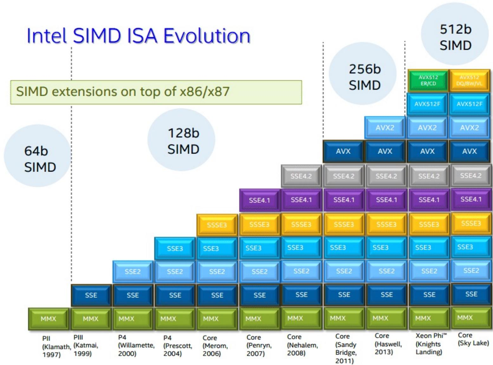

# AVX / AVX2 / AVX512

# • AVX

2008年Intel与AMD提出（2011年，Sandy Bridge以及Bulldozer架构）。  
AVX对 XMM 寄存器做了扩展，从原来的128-bit扩展到了256-bit，256-bit的寄存器命名为 YMM 。YMM的低128-bit与XMM混用。  
AVX对SSE指令集做了扩展，添加了前缀VEX。但VEX前缀只能加在浮点指令上，因此AVX只支持256-bit的SIMD浮点数据的并行处理。

# • AVX2

2013年Intel发布的Haswell处理器上开始支持AVX2，AMD则是2015年的Excavator处理器。  
AVX2主要为处理整型数据的指令提供VEX前缀，为256-bit的SIMD整型数据的并行处理提供支持。

# • AVX512

AVX-512由Intel在2013年提出，并在2016年推出首次支持了AVX-512的处理器Xeon Phi x200 (Knights Landing)。  
• 操作512-bit的ZMM时使用的前缀为EVEX。

# AoS与SoA

• AoS：Array of Structure （结构体构成的数组）

$$
\text {a t o x y z} = \text {n e w f l o a t} [ 3 * n ];
$$

SoA：Structure of Array （数组构成的结构体）

$$
\begin{array}{l} \text {a t o x = n e w f l o a t [ n ] ;} \\ \text {a t o y = n e w f l o a t [ n ] ;} \\ \text {a t o z = n e w f l o a t [ n ] ;} \end{array}
$$

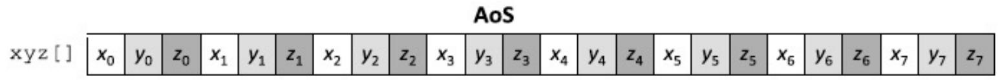

SoA   

<table><tr><td>x[ ]</td><td>x0</td><td>x1</td><td>x2</td><td>x3</td><td>x4</td><td>x5</td><td>x6</td><td>x7</td></tr><tr><td>y[ ]</td><td>y0</td><td>y1</td><td>y2</td><td>y3</td><td>y4</td><td>y5</td><td>y6</td><td>y7</td></tr><tr><td>z[ ]</td><td>z0</td><td>z1</td><td>z2</td><td>z3</td><td>z4</td><td>z5</td><td>z6</td><td>z7</td></tr></table>

$$
\hat {v} _ {i} = \frac {v _ {i}}{\| v _ {i} \|} = \left(\frac {x _ {i}}{\rho_ {i}}, \frac {y _ {i}}{\rho_ {i}}, \frac {z _ {i}}{\rho_ {i}}\right) \quad \text {w h e r e} \quad \rho_ {i} = \sqrt {x _ {i} ^ {2} + y _ {i} ^ {2} + z _ {i} ^ {2}}
$$

哪种数据结构更适于SIMD？

参考：Parallel Programming: Concepts and Practice，第三章

# Outline

• PRAM模型  
• 处理器

• SIMD   
• 多核处理器  
• GPU

• 互联网络   
• 内存访问模式  
并行计算系统体系结构

# 摩尔定律

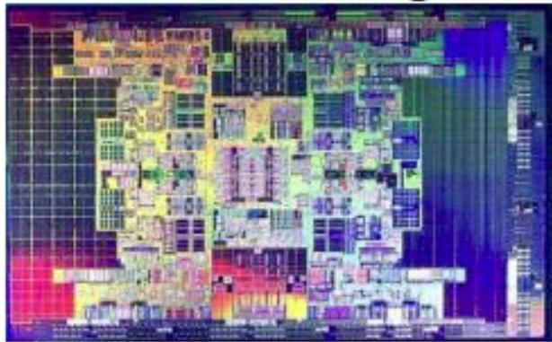  
Quad-Core Itanium (2G@65n)

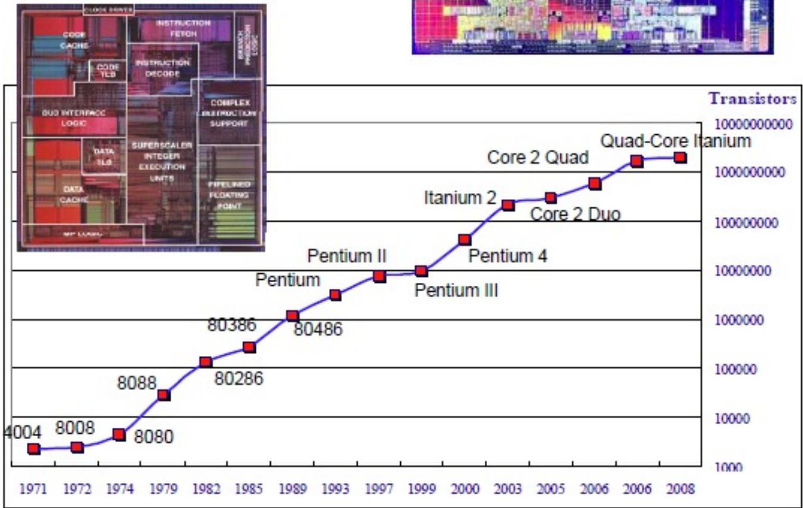  
Pentium 4(42M@.18μ)

# Power Wall

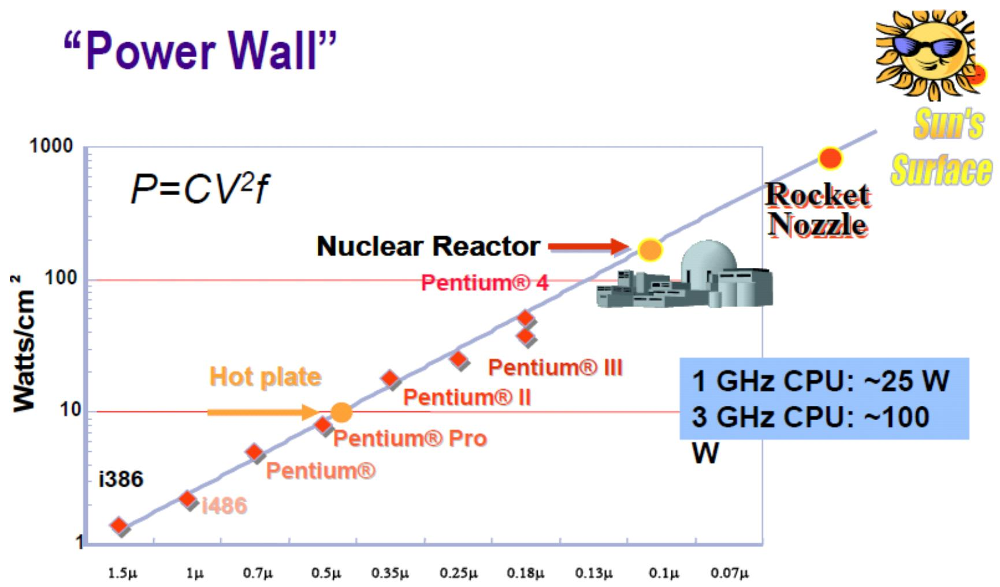

# Memory Wall

缓存占据>70%芯片面积！

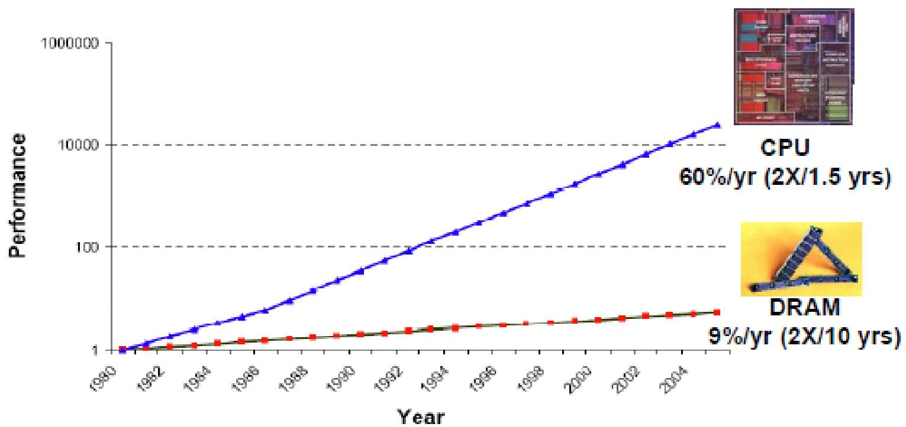

# 隐式指令级并行

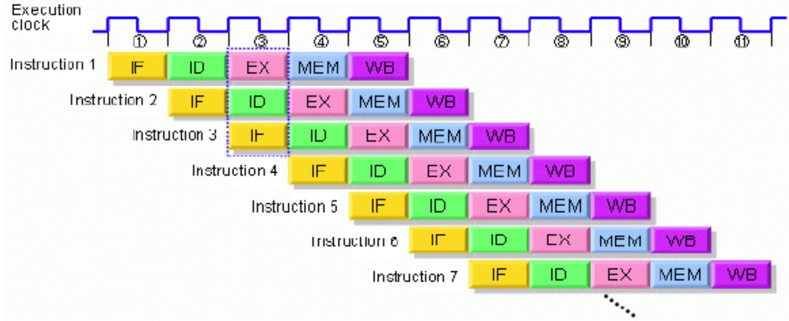  
Instruction execution in 5-stage pipeline

# 多核时代

# • 多核计算环境

• 多个复杂度适中，相对低功耗的处理核 $\curvearrowleft$ 并行工作  
• CPU时钟频率基本不变   
• 计算机硬件不会更快，但会更“宽”  
• 操作系统、应用程序设计？？

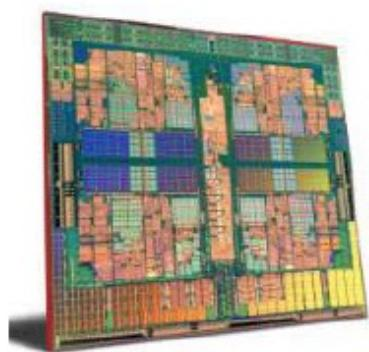  
Quad-core Opteron

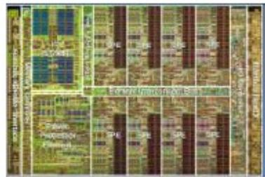  
IBM Cell Broadband Engine

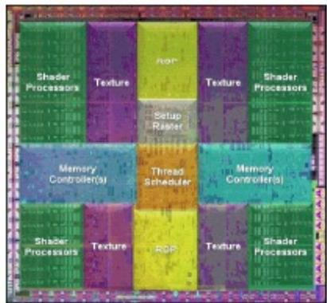  
nVidia GT200

# 双核技术 VS. 超线程技术

• 双核是真正意义上的双处理器

• 不会发生资源冲突   
• 每个线程拥有自己的缓存、寄存器和运算器

• 一个3.2GHz Smithfiled在性能上并非等同于3.2GHz P4 with HT 的2倍

• HT 使处理器的性能至少提升了1/3   
. 双核的性能相当于2块 non-HT 处理器

• 双核技术与HT技术在性能上的对比  
• Ex 1: 两个floating point线程 (Smithfield client)

• 每个线程拥有自己的FPU, 没有资源冲突  
. 尽管性能上没有提升太多，但仍然优于HT

• Ex 2: 一个integer线程与一个floating point线程

性能大幅度提升   
• 没有资源冲突

# Single core , With HT

# ( Eg. Pentium 4 Processor With HT )

Integer and Floating Point Threads

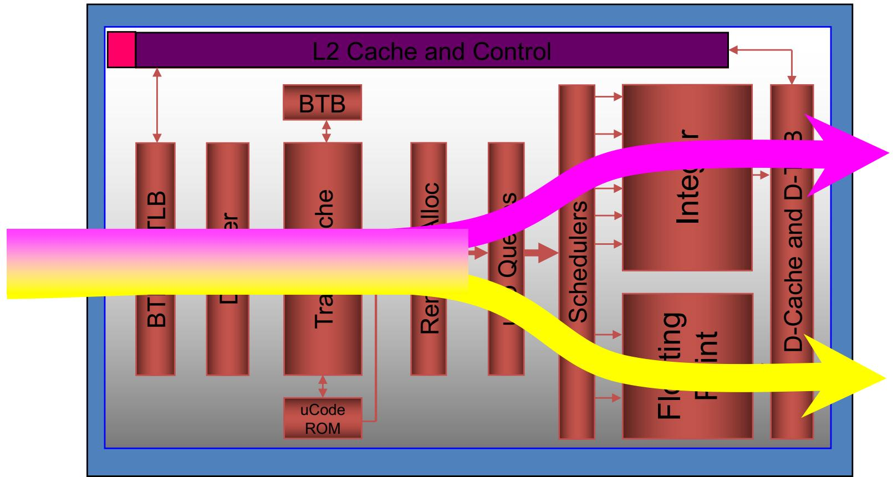

2 threads can be executed at the same time (per processor) if they’re not competing for the same execution resource

# Single core , With HT

# ( Eg. Pentium 4 Processor with HT )

Two Floating Point Threads

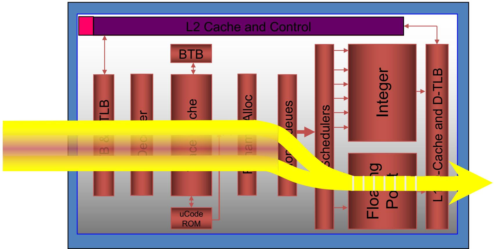

2 threads CANNOT be executed at the same time (per processor) if they’re competing for the same execution resource (eg. 2 floating point threads in a P4P architecture)

# Dual core , Without HT

# ( Eg. Pentium D Processor )

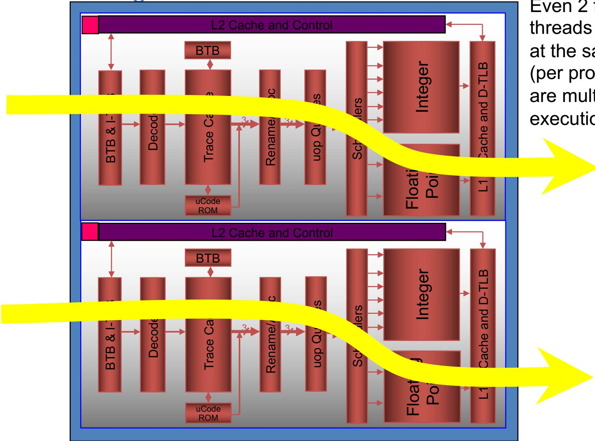  
Two Floating Point Threads

2 floating point can be executed ame time now cessor) as there ltiple floating poin on units

# ( Eg. Dual Core Pentium Processor Extreme Edition )

# Supports HT

Multiple Integer and Floating Point Threads

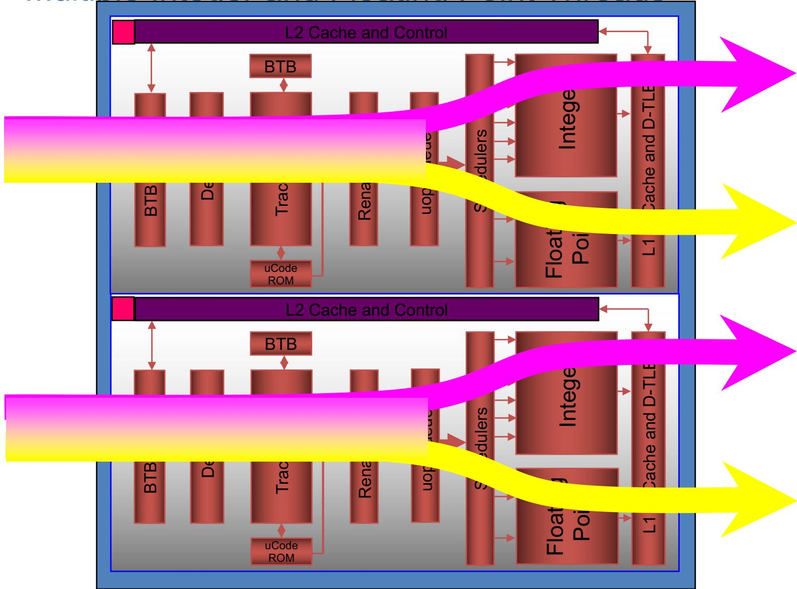

With dual core & HT together, maximum # of threads that can be executed at a time is 4 per processor

# Outline

• PRAM模型  
• 处理器

• SIMD   
• 多核处理器  
• GPU

互联网络   
• 内存访问模式  
并行计算系统体系结构

# GPU: Graphic Processing Unit

# • GPU在显卡中的地位相当于计算机中的CPU

• GPU使显卡减少了对CPU的依赖，并进行部分原本CPU的工作  
当前GPU已经不再局限于3D图形处理，GPU通用计算技术发展已经引起业界的关注，事实也证明在浮点运算、并行计算等部分计算方面，GPU可以提供数十倍乃至于上百倍于CPU的性能

# GPU设计哲学

§ GPU将更多元件用于数据处理，而非控制和存储

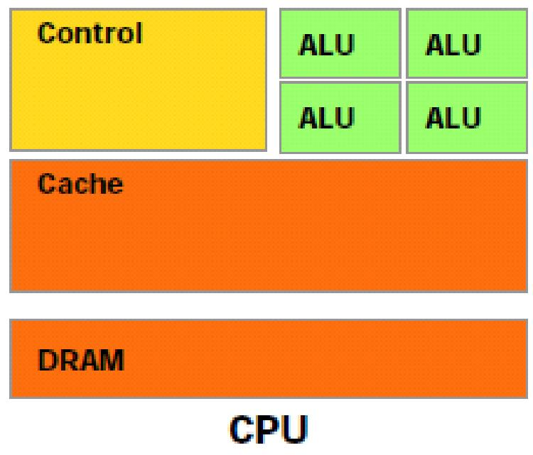

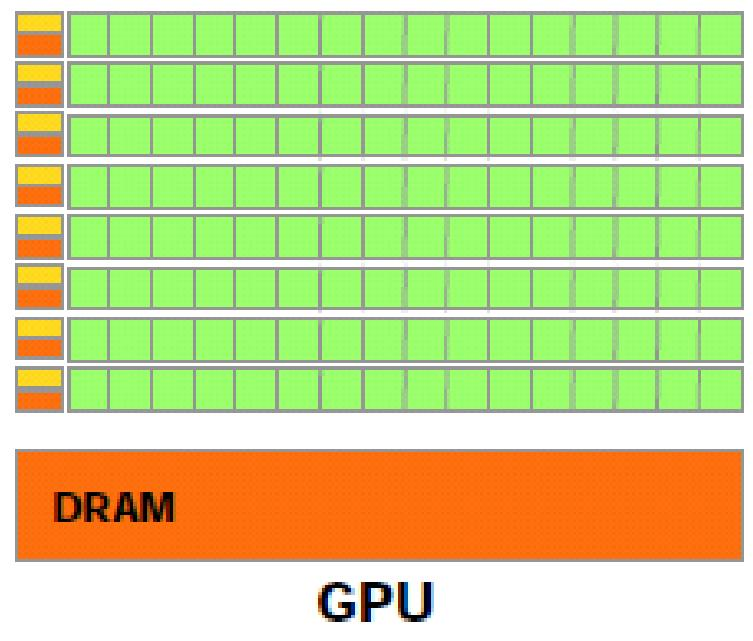

# GPU编程

# § GPU编程模型

. GPU可以视为超大规模并行协处理器  
• SPMD（单程序多数据）模式，数据并行

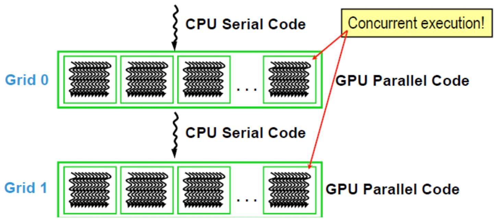

# Nvidia CUDA

CUDA Optimized Libraries: math.h,FFT,BA,...

Integrated CPU + GPU C Source Code

NVIDIA C Compiler

NVIDIA Assembly for Computing (PTX)

CUDA Driver

Debugger Profiler

GPU

CPU Host Code

Standard C Compiler

CPU

# APU: Accelerated Processing Units

APU（加速处理器）集成了高性能串行和并行处理内核，在视觉运算、安全性、每瓦性能以及设备外形方面取得了重大的突破。


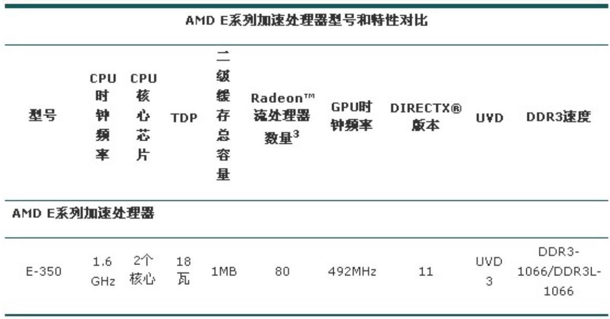

# APU

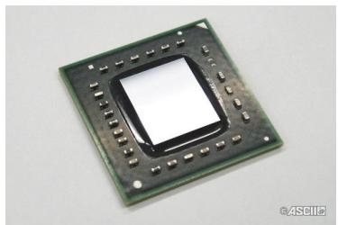

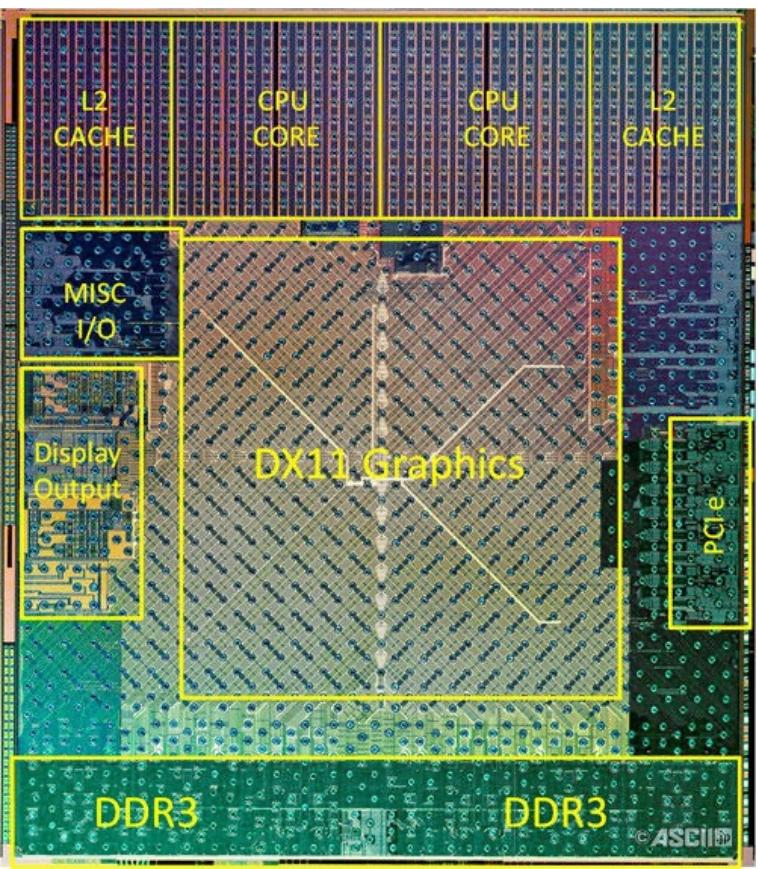

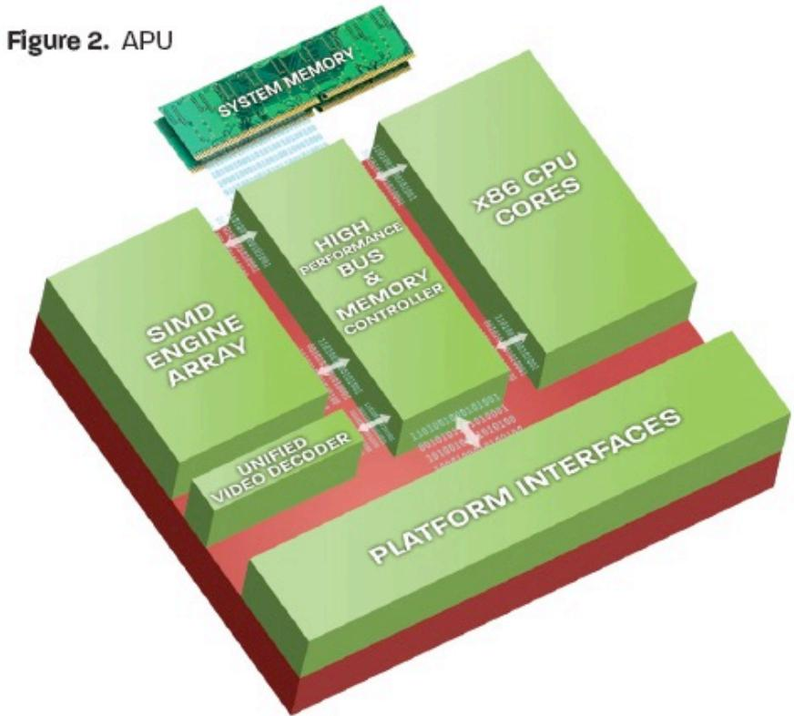

# MIC: Intel Phi

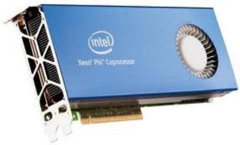

核数：57   
缓存：28.5MB  
主频：1.1GHz  
内存：8GB  
§ 通道：12

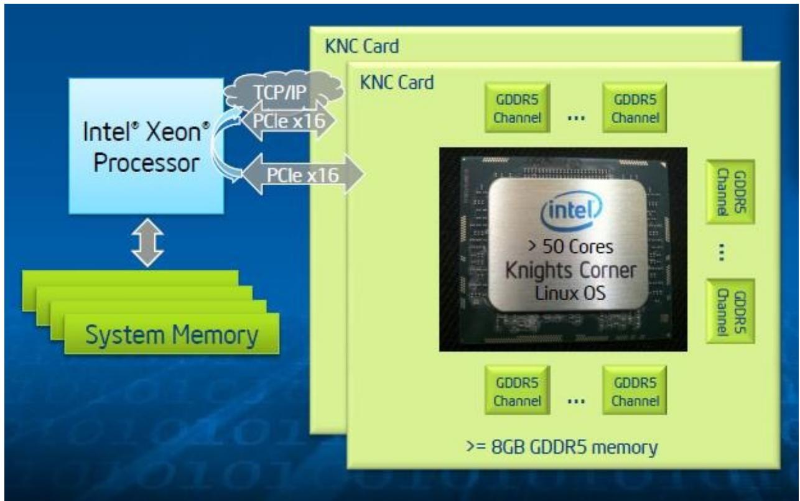

# Outline

• PRAM模型  
• 处理器  
• 互联网络   
• 内存访问模式  
• 并行计算系统体系结构

# 互连网络

§ 静态互连网络：处理单元间有着固定连接的一类网络，在程序执行期间，这种点到点的链接保持不变；  
§ 动态网络：用交换开关构成的，可按应用程序的要求动态地改变连接组态；

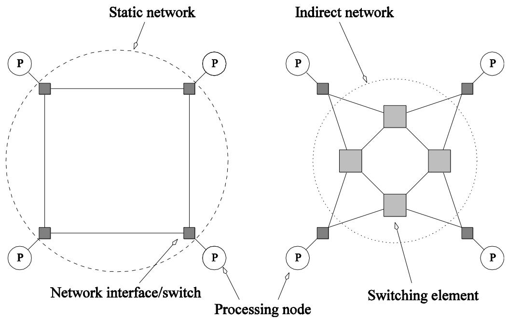

# 静态互连网络（1）

# § 一维线性阵列（1-D Linear Array）：

• 并行机中最简单、最基本的互连方式，  
• 每个节点只与其左、右近邻相连，也叫二近邻连接，  
N个节点用N-1条边串接之，内节点度为2，直径为N-1，对剖宽度为1，  
• 当首、尾节点相连时可构成循环移位器，在拓扑结构上等同于环，环可以是单向或双向。

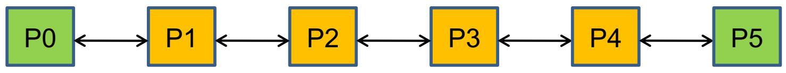

# 静态互连网络（2）

# . 二维网孔（2-D Mesh）：

• 每个节点只与其上、下、左、右的近邻相连（边界节点除外）  
在垂直方向上带环绕，水平方向呈蛇状，称为Illiac网孔  
• 垂直和水平方向均带环绕，则为2-D环绕

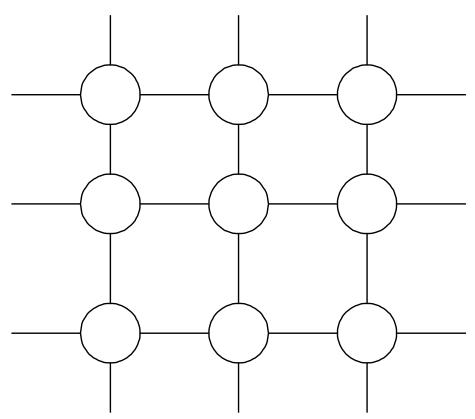  
( a) 2- D网孔

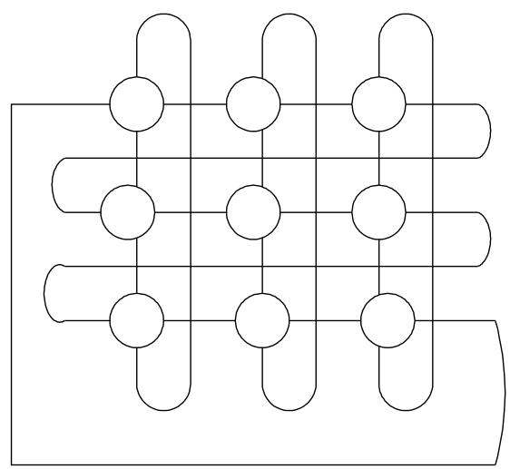  
( b) I l l i ac网孔

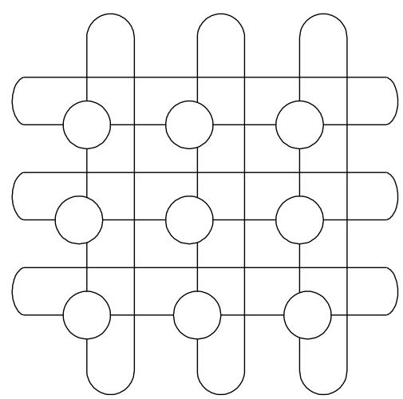  
( c) 2- D环绕

# 静态互连网络（3）

# §二叉树：

• 除了根、叶节点，每个内节点只与其父节点和两个子节点相连。  
• 传统二叉树的主要问题是根易成为通信瓶颈。胖树节点间的通路自叶向根逐渐变宽。

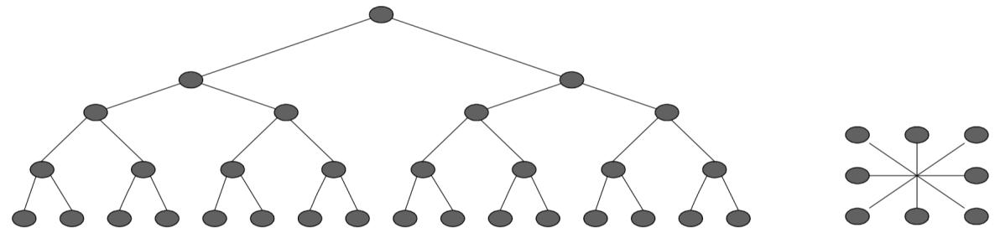  
(a)二叉树

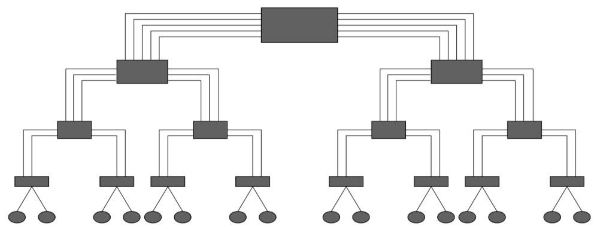  
(c)二叉胖树

# 静态互连网络（4）

# 超立方

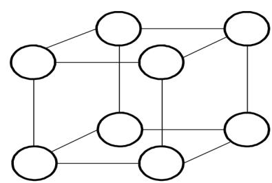  
(a)3-立方

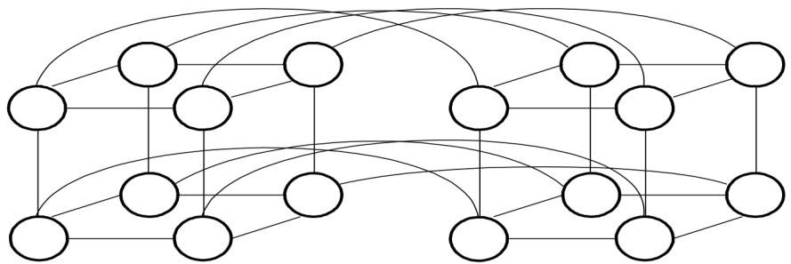  
(b)4-立方

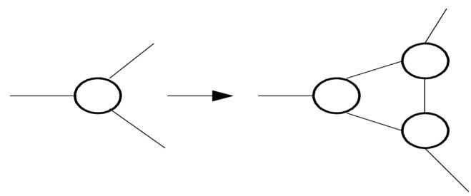  
(c)顶点代之以环

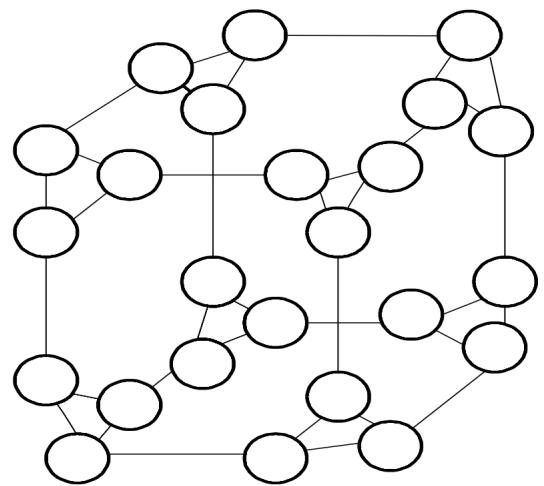  
(d)3-立方环

# 动态互连网络 (1)

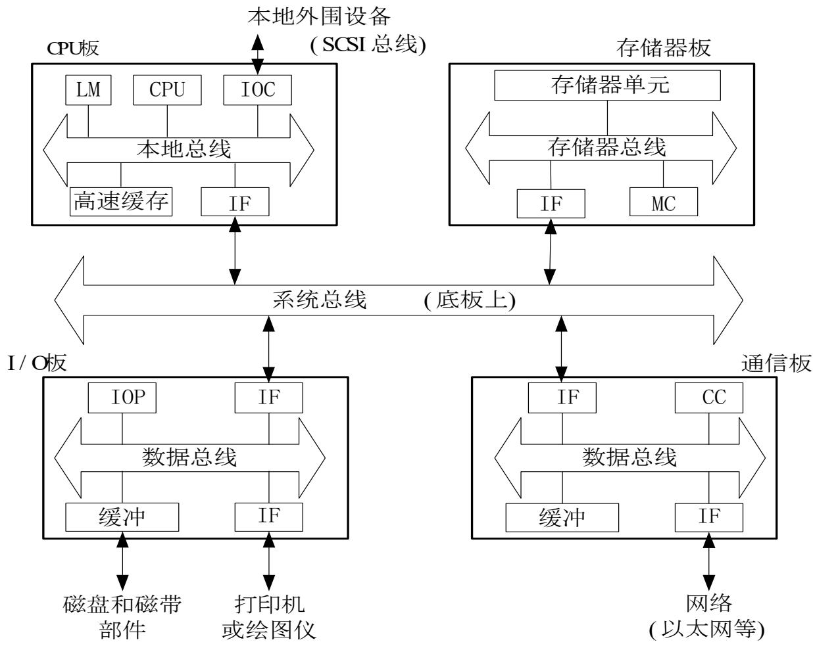  
§ 总线

# 动态互连网络 （2）

# § 交叉开关（Crossbar）


Input2is connected to ouput2, input 3is connected to output 4, input4 is connectedto output3.

Note:Connections between free inputs and outputs are always possible.

A Small Crossbar Switch

# 动态互联网络 （3）

单级交叉开关级联起来形成多级互连网络


  
( a) 4种可能的开关连接  
( b) 一种8输入的Omega网络

# Outline

• PRAM模型  
• 处理器  
• 互联网络   
• 内存访问模式  
• 并行计算系统体系结构

# von Neumann体系结构模型

  
von Neumann模型

  
CPU逻辑结构

# 共享存储访问


UMA   
均匀存储访问   
每个处理器可以等同地访问统一的存储空间

• NUMA   
非均匀存储访问  
存储全局统一编址，每个处理器均可直接访问  
处理器访问本地存储速度比远程存储快

# 分布式存储访问


• 每个物理节点有自己私有的存储空间，各物理节点通过高速网络连接；  
• 运行在不同物理节点的任务，不能直接访问其他物理节点的存储空间，相互数据交换通过消息传递实现。


# 多层混合并行计算


• 物理节点内部任务可实现为OpenMP或多线程代码  
• 运行在不同物理节点的任务通过消息传递交换数据

• 物理节点内部分计算分配到GPU  
• 物理节点间的任务通过消息传递交换数据


# Outline

• PRAM模型  
• 处理器  
互联网络   
• 内存访问模式  
• 并行计算系统体系结构

# PVP （ Parallel Vector Processor ）

§ 含有为数不多、功能强大的定制向量处理器（VP），定制的高带宽纵横交叉开关及高速的数据访问。  
通常不使用高速缓存，而是使用大量向量寄存器及指令缓存，使得该系统对程序编制的要求较高。  
只有充分考虑了向量处理特点的程序才能在该系统上获得较好的性能。  
例 $\frac { 4 } { 3 } \sigma$ ：银河I，NEC地球模拟器，GPU。。。

# 地球模拟器


# SMP （ Symmetric Multiprocessor ）

• 多个处理器通过总线或交叉开关连接到共享存储器。  
•每个处理器可等同地访问共享存储器、I/O设备和操作系统服务  
• 扩展性有限   
例如：胖节点服务器（大内存多路服务器）  
• 多核CPU也可认为是SMP

# 天河二计算节点


上：计算+协处理  
左：计算节点（4处理器）

# MPP （Massively Parallel Processor）

处理节点采用商品微处理器  
§ 系统中有物理上的分布式存储器  
采用高通信带宽和低延迟的互连网络（专门设计和定制的）  
能扩展至成百上千乃至上万个处理器  
异步MIMD，构成程序的多个进程有自己的地址空间，进程间通信消息传递相互作用  
例如：Tianhe, K-Computer, Cray XT5,BlueGene。。。。

# Tianhe-1A


# Tianhe2


# Tianhe2逻辑结构


# 集群 （Cluster） 技术

. 集群概念最早由IBM于20世纪60年代提出  
• 集群一般由高速网络连接起来的高性能工作站或PC机组成。集群在工作中像一个统一的整合资源，所有节点使用单一界面。

  
NOW

# 集群计算系统体系结构


# Cluster （集群）

• 分布式存储，MIMD，工作站+商用互连网络，每个节点是一个完整的计算机，有自己的磁盘和操作系统，而MPP中只有微内核

• 优点：

• 投资风险小   
• 系统结构灵活  
• 性能/价格比高  
• 能充分利用分散的计算资源  
• 可扩展性好

• 问题

• 通信性能  
• 并行编程环境

# Cluster1350


