# 多线程并行程序设计

汤善江 副教授

天津大学智能与计算学部

tashj@tju.edu.cn

http://cic.tju.edu.cn/faculty/tangshanjiang/

## Outline

- 多线程基本概念  
- 共享存储访问   
- 多线程算法实例分析  
- PThread多线程  
- Java 多线程

## Outline

- 多线程基本概念  
- 共享存储访问   
- 多线程算法实例分析  
- PThread多线程  
- Java 多线程

## 线程与进程的区别

线程（thread）是进程上下文（context）中执行的代码序列，又被称为轻量级进程（light weight process）  
在支持多线程的系统中，进程是资源分配的实体，而线程是被调度执行的基本单元。


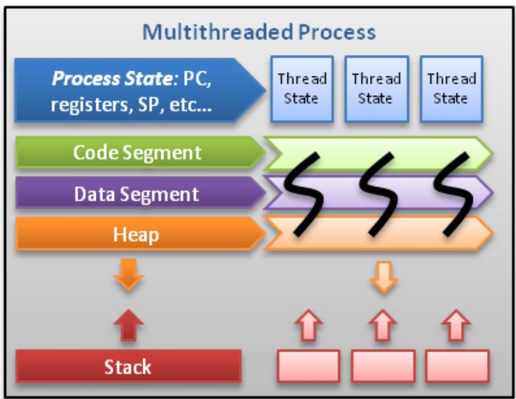  
Threads contain only necessary information,such as a stack (for local variables, function arguments, return values), a copy of the registers, program counter and any thread-specific data to allow them to be scheduled individually. Other data is shared within the process between allthreads.

## 线程与进程的区别

- 调度  
- 并发性   
- 拥有资源  
- 系统开销

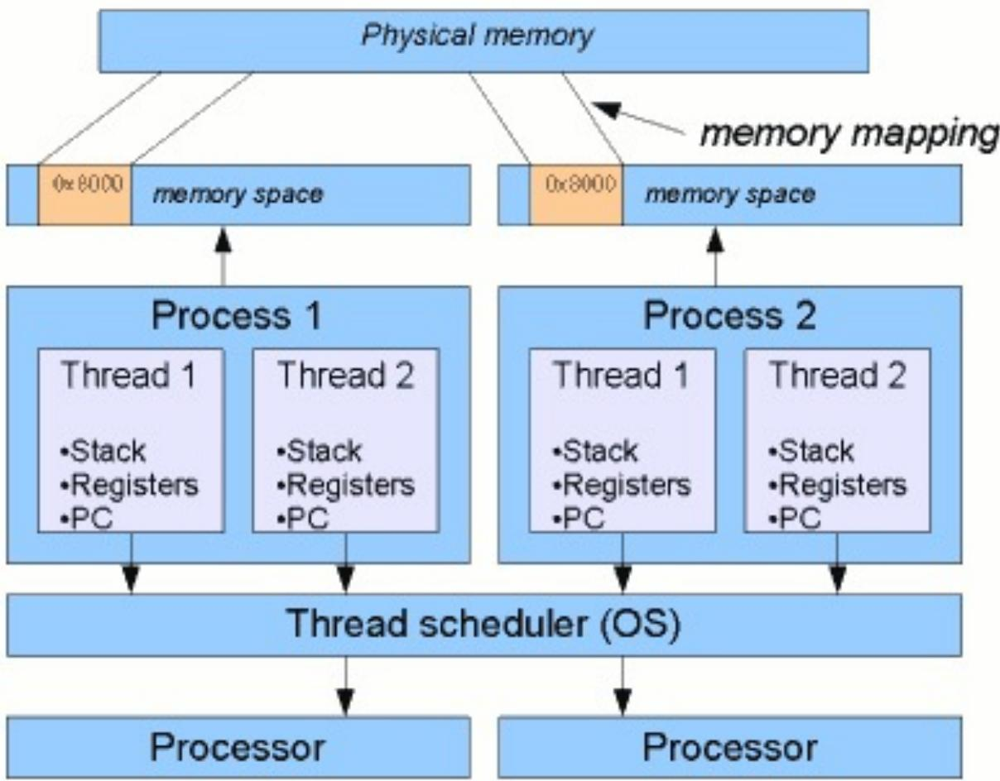

### 调度

- 在传统的操作系统中，CPU调度和分派的基本单位是进程。  
在引入线程的操作系统中，则把线程作为CPU 调度和分派的基本单位，进程则作为资源拥有的基本单位，从而使传统进程的两个属性分开，线程便能轻装运行，这样可以显著地提高系统的并发性。  
同一进程中线程的切换不会引起进程切换，从而避免了昂贵的系统调用。

但是在由一个进程中的线程切换到另一进程中的线程时，依然会引起进程切换。

### 并发性

在引入线程的操作系统中，不仅进程之间可以并发执行，而且在一个进程中的多个线程之间也可以并发执行，因而使操作系统具有更好的并发性，从而能更有效地使用系统资源和提高系统的吞吐量。

- 例 $\frac{4}{3}\sigma$ ，在一个未引入线程的单CPU操作系统中，若仅设置一个文件服务进程，当它由于某种原因被封锁时，便没有其他的文件服务进程来提供服务。

- 在 $z | \sim \jmath$ 线程的操作系统中，可以在一个文件服务进程中设置多个服务线程。

- 当第一个线程等待时，文件服务进程中的第二个线程可以继续运行；当第二个线程封锁时，第三个线程可以继续执行，从而显著地提高了文件服务的质量以及系统的吞吐量。

### 拥有资源

# - 进程

- 不论是引入了线程的操作系统，还是传统的操作系统，进程都是拥有系统资源的一个独立单位，它可以拥有自己的资源。

# - 线程

线程自己不拥有系统资源（除部分必不可少的资源，如栈和寄存器），但它可以访问其隶属进程的资源。亦即一个进程的代码段、数据段以及系统资源（如已打开的文件、I/O设备等），可供同一进程的其他所有线程共享。

### 系统开销

# - 进程

创建或撤消进程时，系统都要为之分配或回收资源，如内存空间、I/O 设备等。  
- 在进行进程切换时，涉及到整个当前进程CPU 环境的保存环境的设置以及新被调度运行的进程的CPU 环境的设置。

# - 线程

- 切换只需保存和设置少量寄存器的内容，并不涉及存储器管理方面的操作。  
- 此外，由于同一进程中的多个线程具有相同的地址空间，致使它们之间的同步和通信的实现也变得比较容易。在有的系统中，线程的切换、同步和通信都无需操作系统内核的干预。

## 创建进程与线程的开销对比

<table><tr><td rowspan="2">平台</td><td colspan="3">fork()</td><td colspan="3">pthread_create()</td></tr><tr><td>real</td><td>user</td><td>sys</td><td>real</td><td>user</td><td>sys</td></tr><tr><td>AMD 2.4 GHz Opteron (8cpus/node)</td><td>41.07</td><td>60.08</td><td>9.01</td><td>0.66</td><td>0.19</td><td>0.43</td></tr><tr><td>IBM 1.9 GHz POWER5 p5-575 (8cpus/node)</td><td>64.24</td><td>30.78</td><td>27.68</td><td>1.75</td><td>0.69</td><td>1.10</td></tr><tr><td>IBM 1.5 GHz POWER4 (8cpus/node)</td><td>104.05</td><td>48.64</td><td>47.21</td><td>2.01</td><td>1.00</td><td>1.52</td></tr><tr><td>INTEL 2.4 GHz Xeon (2 cpus/node)</td><td>54.95</td><td>1.54</td><td>20.78</td><td>1.64</td><td>0.67</td><td>0.90</td></tr><tr><td>INTEL 1.4 GHz Itanium2 (4 cpus/node)</td><td>54.54</td><td>1.07</td><td>22.22</td><td>2.03</td><td>1.26</td><td>0.67</td></tr></table>

## 线程层次

- 用户级线程在用户层通过线程库来实现。对它的创建、撤销和切换都不利用系统的调用。  
- 核心级线程由操作系统直接支持，即无论是在用户进程中的线程，还是系统进程中的线程，它们的创建、撤消和切换都由核 实现。  
- 硬件线程就是线程在硬件执行资源上的表现形式。  
- 单个线程一般都包括上述三个层次的表现：用户级线程通过操作系统被作为核心级线程实现，再通过硬件相应的接口作为硬件线程来执行。

## 线程的生命周期（简化描述）


## 线程池

- 维护多个线程，等待着调度器分配可并发执行的任务。  
- 避免了在处理短时间任务时创建与销毁线程的代价。  
- 线程池不仅能够保证内核的充分利用，还能防止过分调度。  
可用线程数量应该取决于可用的并发处理器、处理器内核、内存、网络sockets等的数量。


## Outline

- 多线程基本概念  
- 共享存储访问   
- 多线程算法实例分析  
- PThread多线程  
- Java 多线程

## 缓存一致性

. 采用层次结构存储系统的计算机系统中，保证高速缓冲存储器中数据与主存储器中数据相同机制。

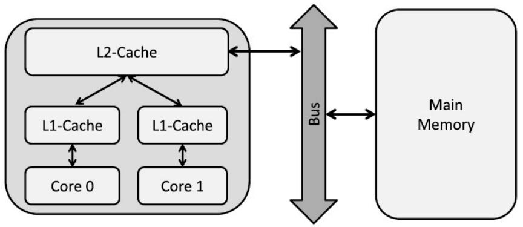

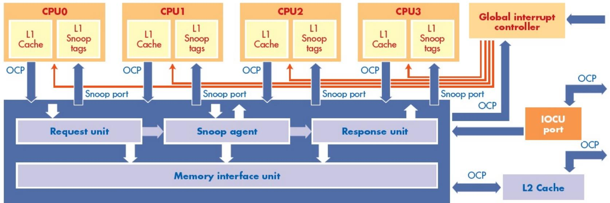  
A coherent processing system.   
Figure 1

## 竞态条件

- 当两个或多个线程试图在同一时刻访问共享内存，或读写某些共享数据，而最后的结果取决于线程执行的顺序(线程运行时序)，就称为竞态条件(Race Conditions)


## 临界区

临界区(critical section)

- 指包含有访问共享数据的一段代码，这些代码可能被多个线程执行。  
- 临界区的存在就是为了保证当有一个线程在临界区内执行的时候，不能有其他任何线程被允许在临界区执行。

- 设想有A,B两个线程执行同一段代码，则在任意时刻至多只能有一个线程在执行临界区内的代码。

- 如果A线程正在临界区执行，B线程则只能在进入区等待。  
- 只有当A 线程执行完临界区的代码并退出临界区，原先处于等待状态的B线程才能继续向下执行并进入临界区。

进入区

临界区

退出区

## 竞态条件示例

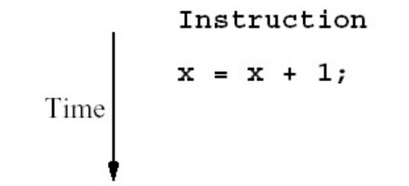

Task 1 Task 2

Read x Read x

Compute x + 1 Compute x + 1

Write to x Write to x

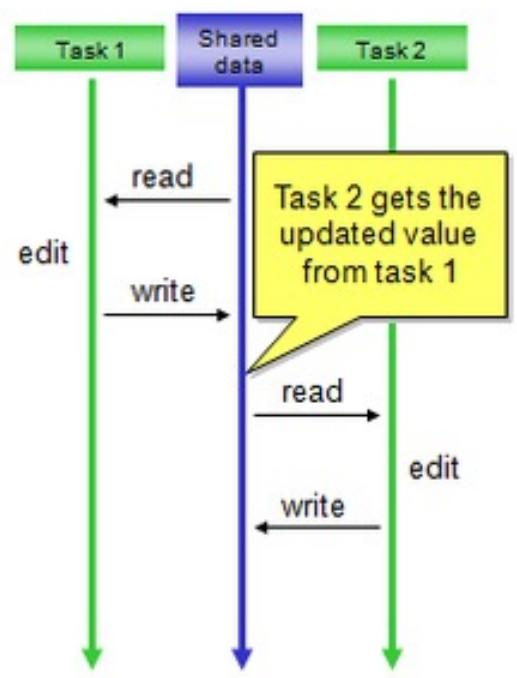  
Correctbehavior

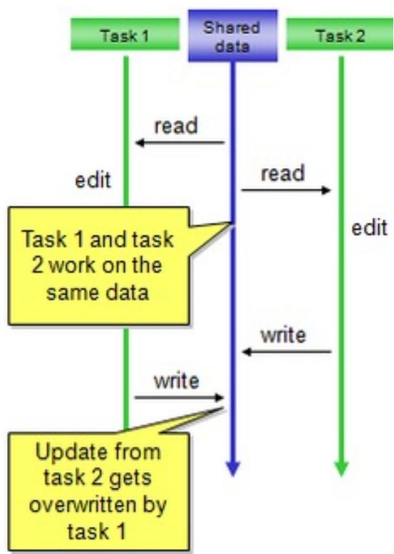  
Incorrectbehavior

## 竞态条件示例

shared double balance;

Code for DEPOSIT $(\mathfrak{p}_1)$ Code for WITHDRAWAL $(\mathfrak{p}_2)$ balance $=$ balance $^+$ amount; balance $=$ balance - amount;

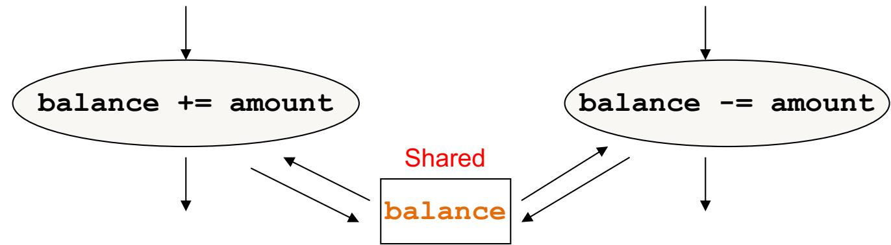

### Assembly code for p1

load R1, balance

load R2, amount

add R1, R2

store R1, balance

### Assembly code for p2

load R1, balance

load R2, amount

sub R1, R2

store R1, balance

## Busy-waiting

```txt
shared boolean lock = FALSE;  
shared double balance; 
```

Code for $\mathbf{p}_{\underline{1}}$

```javascript
/*Acquire the lock */ while (lock) /*loop*/; 
```

Code for $\mathbf{p}_{2}$

```javascript
/*Acquire the lock */ while (lock) /*loop*/; 
```

$\mathrm{lock} = \mathrm{TRUE}$ ;

```txt
/* Execute critical sect */ balance = balance + amount; /* Release lock */ lock = FALSE; 
```

```c
lock = TRUE;  
/* Execute critical sect */  
balance = balance - amount;  
/* Release lock */  
lock = FALSE; 
```

对lock 的访问并不是原子操作（ atomic ），可能会出错！

# 新方案

```txt
shared boolean lock = FALSE;  
shared list L; 
```

Code for p1   
```txt
get lock); <execute critical section> release (lock) 
```

Code for p2   
```c
get (lock); <execute critical section> release (lock); 
```

get(lock) 和release(lock) 必须是原子操作（atomic ）。

# 互斥锁

互斥锁（mutex 是 MUTual EXclusion 的缩写）是实现线程间同步的一种方法。  
互斥锁是一种锁，线程对共享资源进行访问之前必须先获得锁；否则线程将保持等待状态，直到该锁可用。  
- 只有其他线程都不占有它时一个线程才可以占有它，在该线程主动放弃它之前也没有另外的线程可以占有它。  
- 占有这个锁的过程就叫做锁定或者获得互斥锁。

# 互斥锁

```dart
thread A
void someMethod()
{
    print("A Hello one");
    print("A Hello two");
} 
```

```dart
thread B
void someMethod()
{
    print("B Hello one");
    print("B Hello two");
} 
```

两个线程A 和B，如果不加任何同步原语的话，线程A和B的输出将产生交错，即可能产生类似

A Hello one   
B Hello one   
B Hello two   
A Hello one

# 互斥锁

```dart
thread A
void someMethod()
{
    mutex.lock();
    print("A Hello one");
    print("A Hello two");
    mutex.unlock();
} 
```

```dart
thread B
void someMethod()
{
    mutex.lock();
    print("B Hello one");
    print("B Hello two");
    mutex.unlock();
} 
```

- 可能的输出结果：

A Hello one

A Hello two

B Hello one

B Hello two

或

B Hello one

B Hello two

A Hello one

A Hello two

# 多个锁

shared lock1 = FALSE;

shared lock2 $=$ FALSE;

Code for p1

/* Enter CS-1 */

get(lock1);

<critical section 1>;

release(lock1);

<other computation>;

/* Enter CS-2 */

get(lock2);

<critical section $2 >$ ;

release(lock2);

shared lock1 = FALSE;

shared lock2 $=$ FALSE;

Code for p2

/* Enter CS-2*/

get(lock2);

<critical section $2 >$ ;

release(lock2);

<other computation>;

/* Enter CS-1 */

get(lock1);

<critical section 1>;

release(lock1);

# 死锁

shared boolean lock1 = FALSE;   
shared boolean lock2 $=$ FALSE;

# Code for p1

get(lock1);

<delete element>;

/* Enter CS to update length */

get(lock2);

<update length>;

release(lock2);

release(lock1);

# Code for p2

get(lock2);

<update length>;

/* Enter CS to add element */

get(lock1);

<add element>;

releaselock1);

release(lock2);

## Outline

- 多线程基本概念  
- 共享存储访问   
- 多线程算法实例分析  
- PThread多线程  
- Java 多线程

# 实验环境中多核计算机系统结构

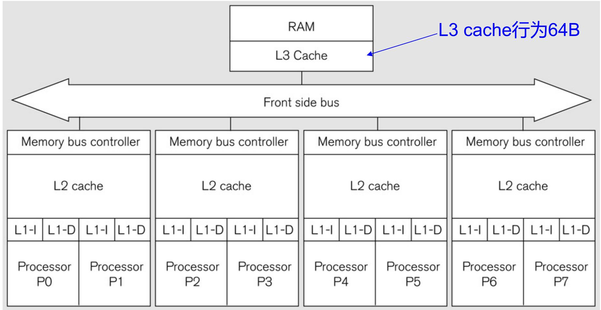

# 统计3的个数：串行代码（伪代码）

int *array;   
int length;   
int count;   
int count3s()   
{ int i; count $= 0$ for $(\mathrm{i} = 0$ ;i<length;i++) { if(array[i] $\equiv   =   3$ ） { count++; } } return count;

# 对数组的划分

- 长度为16，线程数为4

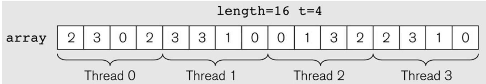

- 实际实验中数组规模为50M，随机分布30%的数值3。实验结果是1000次运行的均值。

# 并行算法1

共享变量

创建线程

线程函数

此算法不能获得正确的结果

1 int t; /* number of threads */   
2 int \*array;   
3 int length;   
4 int count;   
5   
6 void count3s()   
7 {   
8 int i;   
9 count $= 0$ .   
10 /\* Create t threads \*/   
11 for(i=0;i<t；i++)   
12 {   
13 thread_create(count3s_thread,i);   
14 }   
15   
16 return count;   
17 }   
18   
19void count3s_thread(int id)   
20 {   
21 /\* Compute portion of the array that this thread should work on \*/   
22 int length_per_thread=length/t;   
23 int start=id\*length_per_thread;   
24   
25 for(i $\equiv$ start；i<start+length_per_thread；i++)   
26 {   
27 if(array[i] $\equiv = 3$ ）   
28 { count++;   
30 }   
31 }   
32 }

# 并行算法2：加互斥锁

1 mutex m;   
2   
3 void count3s_thread(int id)   
4 {   
5 /\* Compute portion of the array that this thread should work on \*/   
6 int length_per_thread=length/t;   
7 int start=id\*length_per_thread;   
8   
9 for(i $\equiv$ start; i<start+length_per_thread; i++)   
10 {   
11 if(array[i] $\equiv = 3$ ）   
12 {   
13 mutex_lock(m); count++;   
14 count++;   
15 mutex_unlock(m);   
16 }   
17 }   
18 }

# 并行算法2的性能

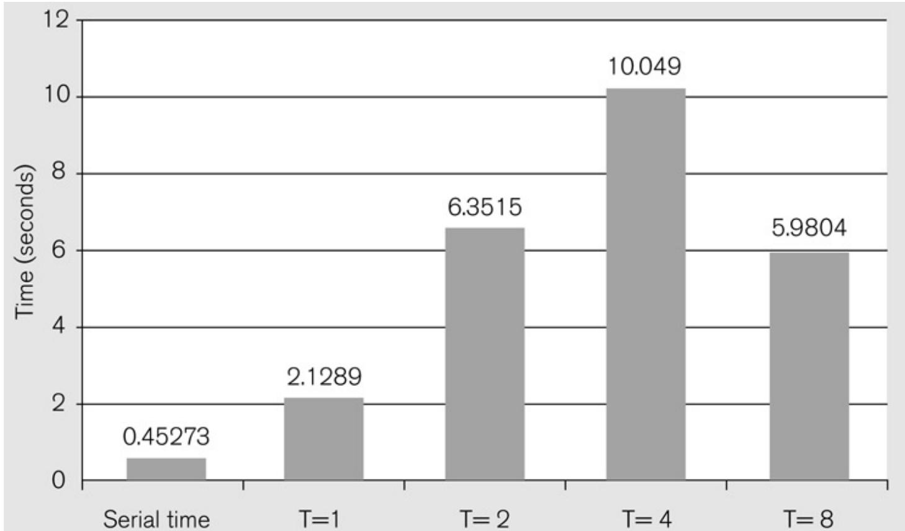

# 并行算法3

共享数组

```c
1 private_count[MaxThreads];   
2 mutex m;   
3   
4 void count3s_thread(int id)   
5 {   
6 /\* Compute portion of array for this thread to work on \*/   
7 int length_per_thread=length/t;   
8 int start=id\*length_per_thread;   
9   
10 for(i=start; i<start+length_per_thread; i++)   
11 {   
12 if(array[i] == 3)   
13 {   
14 private_count[id]++;   
15 }   
16 }   
17 mutex_lock(m);   
18 count+=private_count[id];   
19 mutex_unlock(m);   
20 } 
```

# 并行算法3的性能

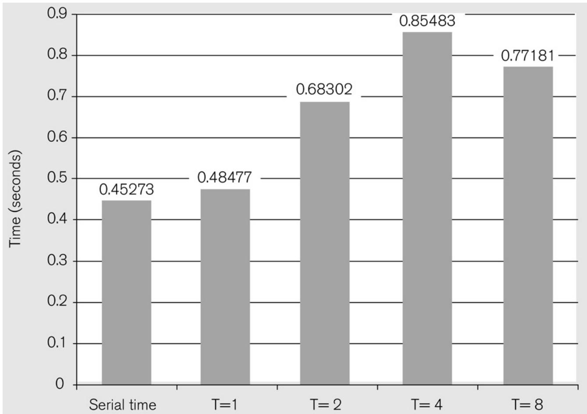

# cache一致性与伪共享（false sharing）

- cache一致性的单位是行（本例中一行为64B）

- 对cache行中的任意部分的修改等同于对整个行的修改  
. L3 cache行修改后将触发L2、L1缓存的更新

处理器P0和P1上的线程对private_count[0]或private_count[1]进行互斥访问，但底层系统将它们置于同一个64B的cache行中。


# 并行算法4：避免false sharing

```txt
1 struct padded_int   
2 {   
3 int value;   
4 char padding[60];   
5 } private_count[MaxThreads];   
6   
7 void count3s_thread(int id)   
8 {   
9 /\* Compute portion of the array this thread should work on \*/   
10 int length_per_thread=length/t;   
11 int start=id\*length_per_thread;   
12   
13 for(i=start;i<start+length_per_thread;i++)   
14 { if(array[i] == 3)   
15 {   
16 private_count[id]++; (private_count[id].value++;);   
17 }   
18 }   
19 }   
20 mutex_lock(m);   
21 count+=private_count[id].value;   
22 mutex_unlock(m);   
23 } 
```

cache行大小为 64B

# 并行算法4的性能

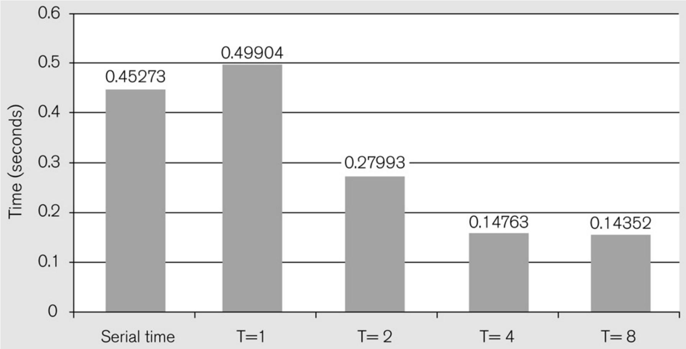

## Outline

- 多线程基本概念  
- 共享存储访问   
- 多线程算法实例分析  
- PThread多线程  
- Java 多线程

# POSIX Thread API

- POSIX ：Portable Operating System Interface  
POSIX 是基于UNIX 的，这一标准意在期望获得源代码级的软件可移植性。为一个POSIX 兼容的操作系统编写的程序，应该可以在任何其它的POSIX 操作系统（即使是来自另一个厂商）上编译执行。  
- POSIX 标准定义了操作系统应该为应用程序提供的接口：系统调用集。  
- POSIX是由IEEE（Institute of Electrical and Electronic Engineering）开发的，并由ANSI（American National Standards Institute）和ISO（International Standards Organization）标准化。

# 程序示例

# 线程函数

# 创建线程（并运行）

# 等待线程结束

include <pthread.h> $\text{水}$ \* The function to be executed by the thread should take a \* void\* parameter and return a void\* exit status code. \*/   
void \*thread_function(void \*arg)   
{ // Cast the parameter into what is needed. int \*incoming $=$ (int \*)arg; // Do whatever is necessary using \*incoming as the argument. // The thread terminates when this function returns. return NULL;   
}   
int main(void)   
{PTHREAD_t thread_ID; void \*exit_status; int value; //Put something meaningful into value. value $= 42$ .   
// Create the thread, passing &value for the argument. pthread_create(&thread_ID，NULL，thread_function，&value); //The main program continues while the thread executes. //Wait for the thread to terminate. pthread_join thread_ID，&exit_status); //Only the main thread is running now. return 0;

# 执行 Pthread 线程

IEEEPortable Operating System Interface,POSIX,section 10o3.1 standard

# Executing a Pthread Thread

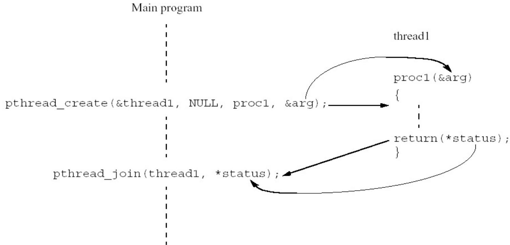

# Pthread线程主要操作函数

<table><tr><td>POSIX 函数</td><td>描述</td></tr><tr><td>pthread_cancel</td><td>终止另一个线程</td></tr><tr><td>pthread_create</td><td>创建一个线程</td></tr><tr><td>pthread_detach</td><td>设置线程以释放资源</td></tr><tr><td>pthread_equal</td><td>测试两个线程 ID 是否相等</td></tr><tr><td>pthread_exit</td><td>退出线程，而不退出进程</td></tr><tr><td>pthread_join</td><td>等待一个线程</td></tr><tr><td>pthread_self</td><td>找出自己的线程 ID</td></tr></table>

# pthread_creat()：创建线程

pthread_create()  
```c
int pthread_create( // create a new thread  
pthread_t *tid, // thread ID  
const pthread_attr_t *attr, // thread attributes  
void *(startRoutine)(void *), // pointer to function to execute  
void *arg // argument to function  
); 
```

# Arguments:

■The thread ID of the successfully created thread.   
■The thread's atributes, explained below; the NuLL value specifies default attributes.   
■ The function that the new thread will execute once it is created.   
■An argument passed to the start_routine().

# Return value:

O if successful. Error code from <errno.h> otherwise.

# Notes:

Use a structure to pass multiple arguments to the start routine.

# pthread_join()：等待线程结束

pthread_join()   
```txt
int pthread_join( // wait for a thread to terminate  
    pthread_t tid, // thread ID to wait for  
    void **status // exit status  
); 
```

# Arguments:

■The ID of the thread to wait for.   
The completion status of the exiting thread will be copied into *status unless status is NuLL,in which case the completion status is not copied.

# Return value:

0 for success.Error code from <errno.h> otherwise.

# Notes:

Once a thread is joined,the thread no longer exists,its thread ID is no longer valid,and it cannot be joined with any other thread.

# pthread_self()： 获取自己的 ID

```bazel
pthread_self() 
```

```rust
pthread_t pthread_self(); //Get my thread ID 
```

```txt
Return value: 
```

The ID of the thread that called this function.

# pthread_equal()：两个线程是否是同一个

pthread_equal()   
```c
int pthreadequal( pthread_t t1, pthread_t t2 ); 
```

```txt
// Test for equality 
```

```javascript
// First operand thread ID 
```

```txt
// Second operand thread ID 
```

Arguments:   
```txt
Two thread IDs 
```

Return value:   
```txt
- Nonzero if the two thread IDs are the same (following the C convention). 
```

```txt
0 if the two threads are different. 
```

# pthread_exit()： 线程退出

void pthread_exit()   
```c
void pthread_exit( // terminate a thread  
void *status // completion status); 
```

# Arguments:

The completion status of the thread that has exited.This pointer value is available to other threads.

# Return value:

None.

# Notes:

When a thread exits by simply returning from the start routine,the thread’'s completion status is set to the start routine's return value.

# pthread_cancel()：取消其他线程

int pthread_cancel(pthread_t thread) ;

参数thread 是要取消的目标线程的线程ID。该函数并不阻塞调用线程，它发出取消请求后就返回。如果成功，pthread_cancel 返回0，如果不成功，pthread_cancel 返回一个非零的错误码。  
- 线程收到一个取消请求时会发生什么情况取决于它的状态和类型。

- 如果线程处于PTHREAD_CANCEL_ENABLE 状态，它就接受取消请求，  
- 如果线程处于PTHREAD_CANCEL_DISABLE状态，取消请求就会被保持在挂起状态。  
默认情况下，线程处于PTHREAD_CANCEL_ENABLE状态。

# pthread_detach()： 分离线程

int pthread_detach(pthread_t thread)

- 设置线程的内部选项来说明线程退出后，其所占有的资源可以被回收。参数thread是要分离的线程的ID。被分离的的线程退出时不会报告它们的状态。  
如果函数调用成功，pthread_detach 返回0，如果不成功，pthread_detach 返回一个非零的错误码。

<table><tr><td>错误</td><td>原因</td></tr><tr><td>EINVALID</td><td>thread 对应的不是一个可分离的线程.</td></tr><tr><td>ESRCH</td><td>没有 ID 为 thread 的线程</td></tr></table>

# 算法示例： 积分法求π

# 公式：

$$
\pi = 4 \left(1 - \frac {1}{3} + \frac {1}{5} - \frac {1}{7} + \dots + (- 1) ^ {n} \frac {1}{2 n + 1} + \dots\right)
$$

# 串行代码：

double factor $= 1.0$ double sum $= 0.0$ for $(\mathrm{i} = 0;\mathrm{i} <   \mathrm{n};\mathrm{i} + + ,$ factor $= -$ factor）{sum $+ =$ factor/(2*i+1);  
}  
pi $= 4.0*$ sum;

# 线程函数

```c
1 void* Thread_sum(void* rank) {
2 long my_rank = (long) rank;
3 double factor;
4 long long i;
5 long long my_n = n/thread_count;
6 long long my_first_i = my_n * my_rank;
7 long long my_last_i = my_first_i + my_n;
8
9 if (my_first_i % 2 == 0) /* my_first_i is even */
10 factor = 1.0;
11 else /* my_first_i is odd */
12 factor = -1.0;
13
14 for (i = my_first_i; i < my_last_i; i++, factor = -factor) {
15 sum += factor / (2*i+1);
16 }
17
18 return NULL;
19 } /* Thread_sum */ 
```

数据个数，起始位置，终止位置

sum 是共享变量

- 可能的结果：

<table><tr><td rowspan="2"></td><td colspan="4">n</td></tr><tr><td>10^5</td><td>10^6</td><td>10^7</td><td>10^8</td></tr><tr><td>π</td><td>3.14159</td><td>3.141593</td><td>3.1415927</td><td>3.14159265</td></tr><tr><td>1 Thread</td><td>3.14158</td><td>3.141592</td><td>3.1415926</td><td>3.14159264</td></tr><tr><td>2 Threads</td><td>3.14158</td><td>3.141480</td><td>3.1413692</td><td>3.14164686</td></tr></table>

## Busy-waiting方法

# 示例：

# 关闭编译器自动优化，否则可能被编译为

y = Compute(my_rank);

while (flag != my_rank);

flag++;

# 使用Busy-waiting的线程

```c
1 void* Thread_sum(void* rank) {
2 long my_rank = (long) rank;
3 double factor;
4 long long i;
5 long long my_n = n/thread_count;
6 long long my_first_i = my_n * my_rank;
7 long long my_last_i = my_first_i + my_n;
8
9 if (my_first_i % 2 == 0)
10 factor = 1.0;
11 else
12 factor = -1.0;
13
14 for (i = my_first_i; i < my_last_i; i++, factor = -factor) {
15 while (flag != my_rank);
16 sum += factor / (2*i+1);
17 flag = (flag+1) % thread_count;
18 }
19
20 return NULL;
21 } /* Thread_sum */ 
```

如果 flag 不是自己的编号，则等待

本轮计算结束，flag 增1

## Busy-waiting改进

```c
void* Thread_sum(void* rank) {
    long my_rank = (long) rank;
    double factor, my_sum = 0.0;
    long long i;
    long long my_n = n/thread_count;
    long long my_first_i = my_n * my_rank;
    long long my_last_i = my_first_i + my_n;
    if (my_first_i % 2 == 0)
        factor = 1.0;
    else
        factor = -1.0;
    for (i = my_first_i; i < my_last_i; i++, factor = -factor)
        my_sum += factor / (2*i+1);
    while (flag != my_rank);
        sum += my_sum;
        flag = (flag+1) % thread_count;
    return NULL;
} /* Thread_sum */ 
```

使用线程私有变量

# Pthread中的互斥锁

- 在 Pthreads 中，锁实现为 mutually exclusive lock 变量或者 “mutex”变量。  
- 要使用 mutex，必须将其声明为 pthread_mutex_t 类型，并初始化：

```c
pthread_mutex_t mutex1; pthread_mutex_lock(&mutex1);   
.   
. critical section   
.   
pthread_mutex_init(&mutex1, NULL); pthread_mutex_unlock(&mutex1); 
```

- 使用 pthread_mutex_destroy() 销毁 mutex。

# Mutex

```c
1 void* Thread_sum(void* rank) {
2 long my_rank = (long) rank;
3 double factor;
4 long long i;
5 long long my_n = n/thread_count;
6 long long my_first_i = my_n * my_rank;
7 long long my_last_i = my_first_i + my_n;
8 double my_sum = 0.0;
9
10 if (my_first_i % 2 == 0)
11 factor = 1.0;
12 else
13 factor = -1.0;
14
15 for (i = my_first_i; i < my_last_i; i++, factor = -factor) {
16 my_sum += factor / (2*i+1);
17 }
18 pthread_mutex_lock(& mutex);
19 sum += my_sum;
20 pthread_mutex_unlock(& mutex);
21
22 return NULL;
23 } /* Thread_sum */
24 
```

# Mutex与Busy-waiting效率比较

Table 4.1 Run-Times (in Seconds) of π Programs Using n=1O Terms on a System with Two Four-Core Processors   

<table><tr><td>Threads</td><td>Busy-Wait</td><td>Mutex</td></tr><tr><td>1</td><td>2.90</td><td>2.90</td></tr><tr><td>2</td><td>1.45</td><td>1.45</td></tr><tr><td>4</td><td>0.73</td><td>0.73</td></tr><tr><td>8</td><td>0.38</td><td>0.38</td></tr><tr><td>16</td><td>0.50</td><td>0.38</td></tr><tr><td>32</td><td>0.80</td><td>0.40</td></tr><tr><td>64</td><td>3.56</td><td>0.38</td></tr></table>

# 条件变量

条件变量(Condition variable)是用来通知共享数据状态信息的。  
. 当特定条件满足时，线程等待或者唤醒其他合作线程。  
- 条件变量不提供互斥，需要一个互斥锁来同步对共享数据的访问。

# 条件变量主要操作

# - pthread_cond_signal

使在条件变量上等待的线程中的一个线程重新开始。如果没有等待的线程，则什么也不做。如果有多个线程在等待该条件，只有一个能重启动，但不能指定哪一个。

# - pthread_cond_broadcast

- 重启动等待该条件变量的所有线程。如果没有等待的线程，则什么也不做。

# 条件变量主要操作

# - pthread_cond_wait

自动解锁互斥锁 ( $\frac { 4 0 } { 3 0 }$ 同执行了 pthread_unlock_mutex)，并等待条件变量触发。  
这时线程挂起，不占用 CPU 时间，直到条件变量被触发。  
在调用 pthread_cond_wait 之前，应用程序必须加锁互斥锁。  
pthread_cond_wait 函数返回前，自动重新对互斥锁加锁(如同执行了 pthread_lock_mutex)。

# 互斥锁的解锁和在条件变量上挂起都是自动进行。

在条件变量被触发前， $\frac{4}{3}\sigma$ 果所有的线程都要对互斥锁加锁，这种机制可保证在线程加锁互斥锁和进入等待条件变量期间，条件变量不被触发。

# 条件变量示例

```txt
include <pthread.h> #include<stdio.h> #include<stdlib.h> 
```

```c
pthread_mutex_t mutex = PTHREAD_MUTEX_INITIALIZER; /*初始化互斥锁*/
pthread_cond_t cond = PTHREAD_COND_INITIALIZER; /*初始化条件变量*/ 
```

```c
void *thread1(void *);  
void *thread2(void *); 
```

int i=1; //全局变量  
```c
int main(void)   
{ pthread_t t_a; pthread_t t_b; pthread_create(&t_a,NULL,thread2,(void \*NULL);/*创建进程t_a*/ pthread_create(&t_b,NULL,thread1,(void \*NULL);/*创建进程t_b*/ pthread_join(t_b, NULL);/*等待进程t_b结束*/ pthread_mutex_destroy(&_mutex); pthread_cond_destroy(&cond); exit(0);   
} 
```

# 条件变量示例

```c
void *thread1(void *junk)  
{  
    for(i=1;i<=9;i++)  
    {  
        pthread_mutex_lock(& mutex);/*锁住互斥锁*/  
        if(i%3==0)  
           pthread_cond_signal(&cond);/*条件改变，发送信号，通知b进程*/  
        else  
            printf("thread1:%d\n",i);  
        pthread_mutex_unlock(& mutex);/*解锁互斥锁*/  
        sleep(1);  
}  
void *thread2(void *junk)  
{  
    while(i<9)  
    {  
        pthread_mutex_lock(& mutex);  
        if(i%3!=0)  
            pthread_cond_wait(&cond,&mutex);/*等待*/  
            printf("thread2:%d\n",i);  
            pthread_mutex_unlock(& mutex);  
            sleep(1);  
} 
```

输出结果：

thread1:1

thread1:2

thread2:3

thread1:4

thread1:5

thread2:6

thread1:7

thread1:8

thread2:9

## Outline

- 多线程基本概念  
- 共享存储访问   
- 多线程算法实例分析  
- PThread多线程  
- Java 多线程

# 创建多线程的方法

- 方法1：通过Thread类的子类实现多线程。  
- 方法2：定义一个实现Runnable接口的类实现多线程。

# 创建多线程的方法(续)

- 方法1：通过创建Thread类的子类实现多线程，步骤如下 ：

1. 定义Thread类的一个子类。  
2. 定义子类中的方法run( )，覆盖父类中的方法run( )。  
3. 创建该子类的一个线程对象。  
4. 通过start( )方法启动线程。

# class UserThread extends Thread{ int sleepTime;

# public UserThread(String id) { // 构造函数 super(id);

```javascript
sleepTime=(int)(Math.random() * 1000); System.out.println("线程名: "+.getName()+", 睡眠: "+"sleepTime+"毫秒"); } 
```

public void run( ) {   
System.out.println("运行的线程是："+ getName( ));   
```txt
try{ // 通过线程睡眠模拟程序的执行 Thread.sleep(sleepTime); }catch(InterruptedException e){ System.err.println("运行异常:" + e.toString()); }
```

```txt
1 
```

public class multThreadTest{ public static void main(String args[ ]) { UserThread t1,t2,t3,t4;

t1=new UserThread("NO 1");   
t2=new UserThread("NO 2");   
t3=new UserThread("NO 3");   
t4=new UserThread("NO 4");

t1.start( ); t2.start( );   
t3.start( ); t4.start( );

```txt
} 1 
```

# 程序某次的运行结果：

线程名： NO 1，睡眠： 885 毫秒

线程名： NO2，睡眠： 66毫秒

线程名： NO 3，睡眠： 203 毫秒

线程名： NO 4，睡眠： 294 毫秒

目前运行的线程是：NO 2

目前运行的线程是：NO 3

目前运行的线程是：NO 4

目前运行的线程是：NO 1

注意：Thread类中的run( )方法具有public属性，覆盖该方法时，前面必须带上public。

# 创建多线程的方法(续)

方法2：通过接口创建多线程，步骤如下：

1.定义一个实现Runnable接口的类。  
2.定义方法run( )。Runnable接口中有一个空的方法run( )，实现它的类必须覆盖此方法。  
3.创建该类的一个线程对象，并将该对象作参数，传递给Thread类的构造函数，从而生成Thread类的一个对象。// 注意这一步!  
4.通过start( )方法启动线程。例如：

class UserMultThread implements Runnable{   
public void run( ) { for(int i=0;i<3;i++)   
```c
int num;   
UserMultThread(int n){ num=n; 
```

System.out.println("运行线程："+num);   
```javascript
System.out.println("结束： "+num); } }
```

public class multThreadZero {   
public static void main(String args[ ])   
```javascript
throws扰乱Exception { Thread mt1=new Thread( new UserMultThread(1)); Thread mt2=new Thread( new UserMultThread(2)); 
```

```javascript
mt1.start(); 
```

mt1.join( ); // 等待线程死亡  
```javascript
mt2.start(); 
```

```javascript
mt2.join(); 
```

```txt
} 
```

# 程序运行某次的输出结果：

运行线程：1

运行线程：2

运行线程：1

运行线程：2

运行线程：1

运行线程：2

结束 ： 1

结束 ： 2

# 创建多线程的方法(续)

- 需要注意的 $2 . 5$ ：

1. mt1.join( )是等待线程死亡，对该方法必须捕捉异常，或通过throws关键字指明可能要发生的异常。  
2. 对一个线程不能调用start( )两次，否则会产生IllegalThreadStateException异常。

# Java线程调度模型

线程调度程序挑选线程时，将选择处于就绪状态且优先级最高的线程。  
- 如果多个线程具有相同的优先级，它们将被轮流调度。

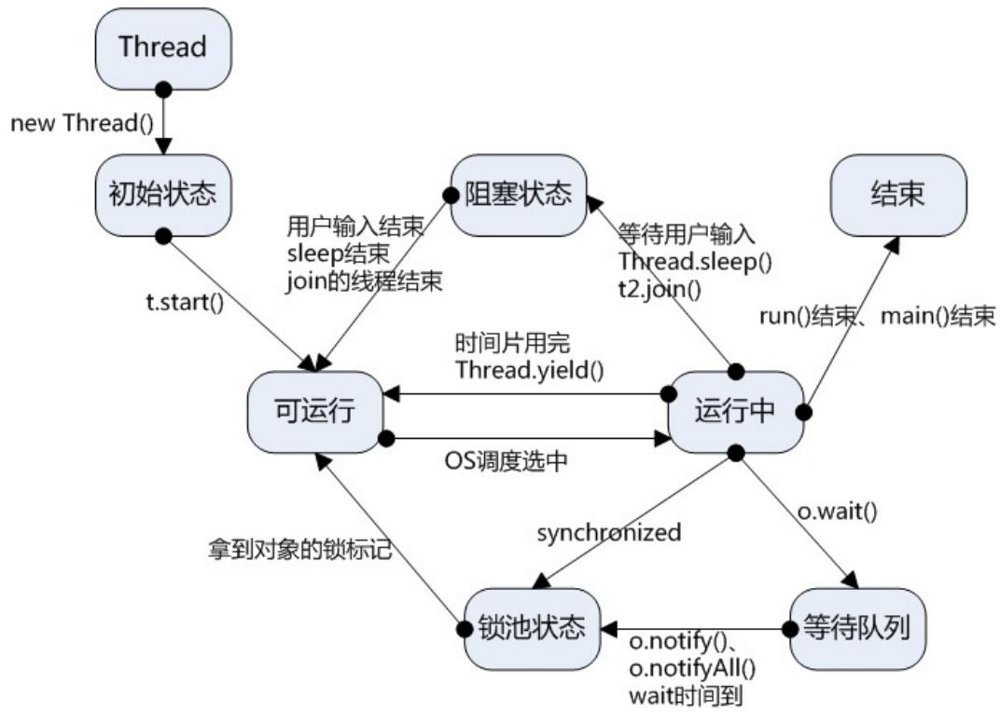

# 同步方法

- Java通过关键字synchronized实现同步。  
- 当对一个对象(含方法)使用synchronized，这个对象便被锁定或者说进入了监视器。在一个时刻只能有一个线程可以访问被锁定的对象。它访问结束时，让高优先级并处于就绪状态的线程，继续访问被锁定的对象，从而实现资源同步。  
- 加锁的方法有两种：锁定冲突的对象，或锁定冲突的方法。

# 同步方法(续)

1. 锁定冲突的对象。语法格式：

```txt
synchronized (ObjRef){Block //需要同步执行的语句体}锁定对象可以出现在任何一个方法中。
```

# 同步方法(续)

2. 锁定冲突的方法。语法格式：

synchronized 方法的定义

synchronized void Play(int n) {…… //中间的程序代码略}

# 注意：

1. 对方法run( )无法加锁，不可避免冲突；  
2. 对构造函数不能加锁，否则出现语法错误。