# 并行计算的性能评测

汤善江 副教授

天津大学智能与计算学部

tashj@tju.edu.cn

http://cic.tju.edu.cn/faculty/tangshanjiang/

# Questions

# Outline

• 并行计算的性能  
• 内存系统对性能的影响  
• 加速比定律   
• 可扩放性评测

# Outline

• 并行计算的性能  
. 内存系统对性能的影响  
• 加速比定律   
• 可扩放性评测

# 计算机的性能

• Performance: 通常是指机器的速度，它是程序执行时间的倒数  
• 程序执行时间：是指用户的响应时间 (访问磁盘和访问存储器的时间， CPU时间， I/O时间以及操作系统的开销)  
• CPU时间：它表示CPU的工作时间，不包括I/O等待时间和运行其它任务的时间

# 为什么要进行并行机性能评测？

• 对管理人员来说：

• 发挥并行机长处，提高并行机的使用效率

对用户来说

• 减少用户购机盲目性，降低投资风险

对架构师和设计人员来说：

• 改进系统结构设计，提高机器的性能  
• 促进软/硬件结合，合理功能划分  
• 优化 “结构-算法-应用”的最佳组合

• 对市场人士来说：

• 提供客观、公正的评价并行机的标准

# 如何进行并行机性能评测

# 计算量度量

• 工作负载（计算量/任务量）

• 计算执行时间(t，真实世界时间)  
. 浮点运算数 (FLOPS)  
. 指令数目(MIPS)

. 并行计算执行时间 $( t _ { \rho } )$

tcomp 为计算时间，tparo为并行开销时间，tcomm为相互通信时间

$$
\mathsf {t _ {p}} = \mathsf {t _ {c o m p}} + \mathsf {t _ {p a r o}} + \mathsf {t _ {c o m m}}
$$

# 并行计算性能指标

加速比: 串行执行时间与并行执行时间之比

$$
S (n) = \frac {\text {E x e c u t i o n t i m e (o n e p r o c e s s o r s y s t e m)}}{\text {E x e c u t i o n t i m e (m u l t i p r o c e s s o r s y s t e m)}} = \frac {t _ {s}}{t _ {p}}
$$

• 计算/通信比

$$
\frac {\mathrm {C o m p u t a t i o n T i m e}}{\mathrm {C o m m u n i c a t i o n T i m e}} = \frac {t _ {\mathrm {c o m p}}}{t _ {\mathrm {c o m m}}}
$$

# 并行计算性能指标

# 开销

•部分处理器的空闲  
•并行版本中所需的顺序计算中不会出现的额外计算  
• 发送消息所需的通信时间

# 效率

$$
\begin{array}{l} E = \frac {\text {E x e c u t i o n t i m e u s i n g o n e p r o c e s s o r}}{\text {E x e c u t i o n t i m e u s i n g a m u l t i p r o c e s s o r} \times \text {n u m b e r o f p r o c e s s o r s}} \\ = \frac {t _ {s}}{t _ {p} \times n} = S (n) / n \\ \end{array}
$$

# 并行计算性能指标

• 代价 (Cost)

代价 $=$ (执行时间)×(所使用的处理器总数)

•对于串行计算

•代价 = 执行时间 $( t _ { s } )$

•对于并行计算

$$
\cdot t _ {p} = t _ {s} / S (n)
$$

•代价 $= \mathrm { t _ { p } } ^ { \star } \mathsf { n } = \mathrm { t _ { s } } ^ { \star } \mathsf { n } / \mathsf { S } ( \mathsf { n } ) = \mathrm { t _ { s } } / \mathsf { E }$

# 并行计算程序性能分析示例

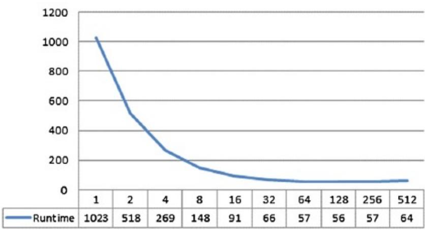  
Runtime

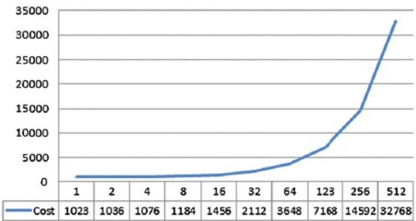  
Cost

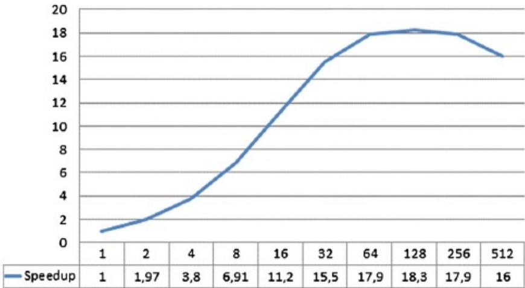  
Speedup

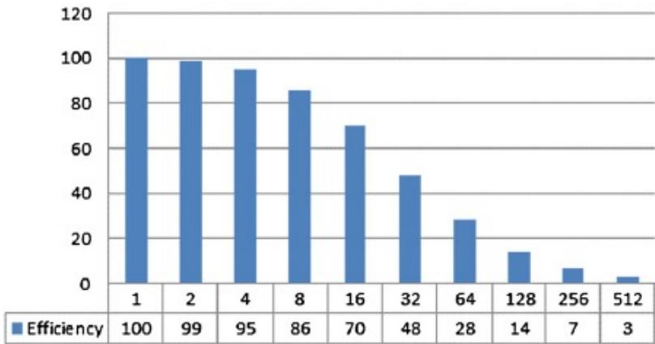  
Efficiency (in %)

# Outline

• 并行计算的性能  
• 内存系统对性能的影响  
• 加速比定律   
• 可扩放性评测

# 存储器层次与度量

容量C：能保存数据的字节数

延迟L：读取一个字所需时间

带宽B：1秒内传送的字节数

# 内存系统对性能的影响

• 对于很多应用而言，瓶颈在于内存系统，而不是CPU  
• 内存系统的性能包括两个方面：延迟和带宽

延迟：处理器向内存发起访问直至获取数据所需要的时间  
• 带宽：内存系统向处理器传输数据的速率

# 延迟和带宽的区别

• 考虑消防龙头的情形。

• 打开消防龙头后2秒水才从消防水管的尽头流出，那么这个系统的延迟就是2秒。  
当水开始流出后，如果水管1秒钟能流出5加仑的水，那么这个水管的“带宽”就是5加仑/秒。

• 如果想立刻扑灭火灾

• 需要减少延迟的时间。

• 如果是希望扑灭更大的火

• 需要更高的带宽。

# 内存延迟示例

考虑某一处理器以1GHz（1纳秒时钟）运行，与之相连的DRAM有100纳秒的延迟（没有高速缓存）。假设处理器有两个multiply-add部件，在每1纳秒的周期内能执行4条指令。

处理器的峰值是4GFLOPS。  
• 由于内存延迟是100个周期，并且块大小为一个字（word），每次处理内存访问请求时，处理器必须要等待100个周期，才能够获得数据。

# 内存延迟示例

• 在以上平台上，考虑计算两个向量点积的问题。

• 计算点积对每对向量元素进行一次乘法-加法运算，即每一次浮点运算需要取一次数据。  
• 此计算的峰值速度的限制是，每100纳秒才能够进行一次浮点计算，速度为10MFLOPS，只是处理器峰值速度的很小一部分。

# 使用高速缓存改善延迟

• 高速缓存是处理器与DRAM之间的更小但更快的内存单元  
• 低延迟高带宽的存储器  
如果某块数据被重复使用，高速缓存就能减少内存系统的有效延迟  
由高速缓存提供的数据份额称为高速缓存命中率(hitratio )  
• 高速缓存命中率严重影响内存受限程序的性能

# 高速缓存

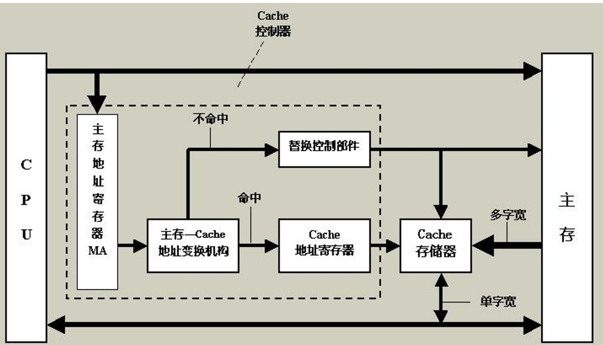

# 缓存效果示例

• 继续考虑前一示例。  
在其中加入一个大小为32KB，延迟时间为1纳秒(或1个周期)的高速缓存。  
使用此系统来计算矩阵乘法，两个矩阵A和B的维数为32 ×32。

$$
\begin{array}{l} \left[ \begin{array}{c c c c} a _ {1 1} & a _ {1 2} & \dots & a _ {1 s} \\ \dots & \dots & \dots & \dots \\ \hline a _ {i 1} & a _ {i 2} & \dots & a _ {i s} \\ \hline \dots & \dots & \dots & \dots \\ a _ {m 1} & a _ {m 2} & \dots & a _ {m s} \end{array} \right]. \left[ \begin{array}{c c c c c} b _ {1 1} & \dots & b _ {1 j} & \dots & b _ {1 n} \\ b _ {2 1} & \dots & b _ {2 j} & \dots & b _ {2 n} \\ \dots & \dots & \dots & \dots & \dots \\ b _ {s 1} & \dots & b _ {s j} & \dots & b _ {s n} \end{array} \right] \\ = = \left[ \begin{array}{l l l l l} c _ {1 1} & \dots & a _ {i 1} b _ {1 j} + a _ {i 2} b _ {2 j} + \dots \dots + a _ {i s} b _ {s j} \\ \dots & \dots & \dots & \dots & \dots \\ c _ {i 1} & & \boxed {c _ {i j}} & & c _ {i n} \\ \dots & \dots & \dots & \dots & \dots \\ c _ {m 1} & \dots & c _ {m j} & \dots & c _ {m n} \end{array} \right] \\ \end{array}
$$

# 缓存效果示例

# • 结果如下

• 将两个矩阵取到高速缓存中等同于取2K个字，需要大约 200 µs。   
• 两个n × n 的矩阵乘需要 $2 n ^ { 3 }$ 步计算。在本例中，需要64K步计算，如果每个周期执行4条指令，则需要16K个周期，即 16 µs。  
总计算时间大约是加载存储时间以及计算时间之和，即200 + 16 µs。  
• 峰值计算速度为64K/216 =303 MFLOPS。

# 时间本地性

对相同数据项的重复引用相当于“时间本地性(temporallocality)”  
• 对于高速缓存的性能来说，数据的重复使用至关重要。

# 内存带宽的影响

内存带宽由内存总线的带宽和内存部件决定。  
• 可以通过增加内存块的大小来提高带宽。  
• 底层系统在 L时间单位内(L为系统的延迟)存取B单位的数据(B为块大小)

# 内存带宽的影响示例

继续上一示例，将块大小由1个字改为4个字。同样考虑点积计算：

假定向量数据在内存中线性排列，则在200个周期内能够执行8FLOPs(4次乘法-加法)  
• 这是因为每一次内存访问取出向量中4个连续的字  
因此，两次连续访问能够取出每个向量中的4个元素。  
这就相当于每25ns执行一次FLOP，即峰值速度为40MFLOPS。

# 内存带宽的影响

• 增加带宽可以提高峰值计算速度  
• 增加块的大小，并不能改变系统的延迟。  
• 物理上讲，本例中的情形可以认为是与多个存储区相连接的宽的数据总线(4个字，或者128位)  
• 实际上，构建这样的宽总线的代价是昂贵的。  
在更切实可行的系统中，得到第一个字后，连续的字在紧接着的总线周期里被送到内存总线。

# 空间本地性

• 对数据布局的假设：  
• 连续的数据字被连续的指令所使用(空间本地性，spatial locality )  
如果以数据布局为中 $\curvearrowleft$ ，那么计算的步骤应该确保连续的计算使用连续的数据  
• 数据结构+算法

# 小结

• 利用应用程序的空间本地性与时间本地性对于减少内存延迟及提高有效内存带宽非常重要。  
内存的布局以及合理组织计算次序能对空间本地性和时间本地性产生重大影响。  
• 提高整体计算性能的参考指标之一：  
• 计算次数/内存访问次数

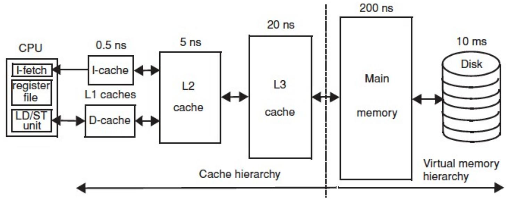

# 实际测试

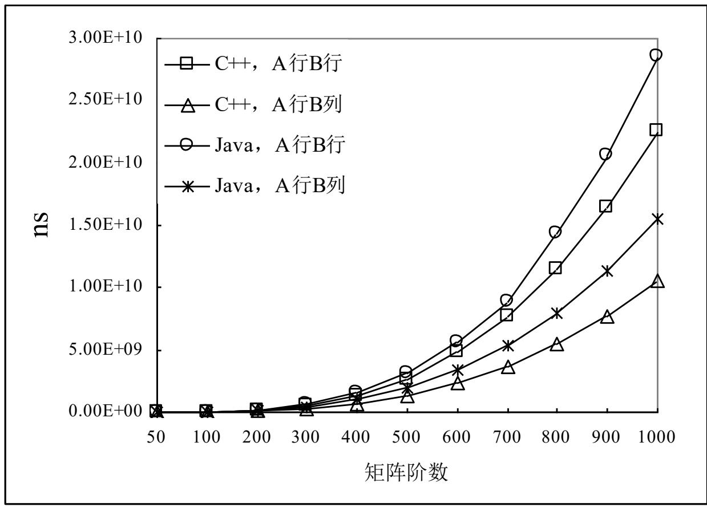

2.93GHz Intel 处理器，1M高速缓存，512M主存（533MHz）

# Outline

• 并行计算的性能  
• 内存系统对性能的影响  
• 加速比定律   
• 可扩放性评测

# 加速比性能定律

Amdahl 定律  
Gustafson 定律  
§ Sun and Ni 定律

# 参数定义

$\equiv { \sf P }$ ：处理器数；  
$= W$ ：问题规模（计算负载、工作负载，给定问题的总计算量）；

$\cdot \ W _ { s }$ ：应用程序中的串行分量，f是串行分量比例 $( \mathsf { f } = \mathsf { W } _ { \mathsf { s } } / \mathsf { W } )$ ；  
$\cdot W _ { \mathsf P }$ ：应用程序中可并行化部分，1-f为并行分量比例；  
. $W _ { s } + W _ { p } = W ;$

Ts ：串行执行时间，Tp ：并行执行时间；  
$= S$ ：加速比，E：效率。

# 加速比性能定律

Amdahl 定律  
Gustafson 定律  
Sun and Ni 定律

# Amdahl 定律

• 出发点：

• 固定不变的计算负载；  
• 固定的计算负载分布在多个处理器上的，  
• 增加处理器加快执行速度，从而达到加速的目的。

  
1922-

• 给定一个应用，不断增加并行计算机和处理器数目，是不是可以无限制的提升加速比呢？

NO

# Amdahl 定律：应用情形

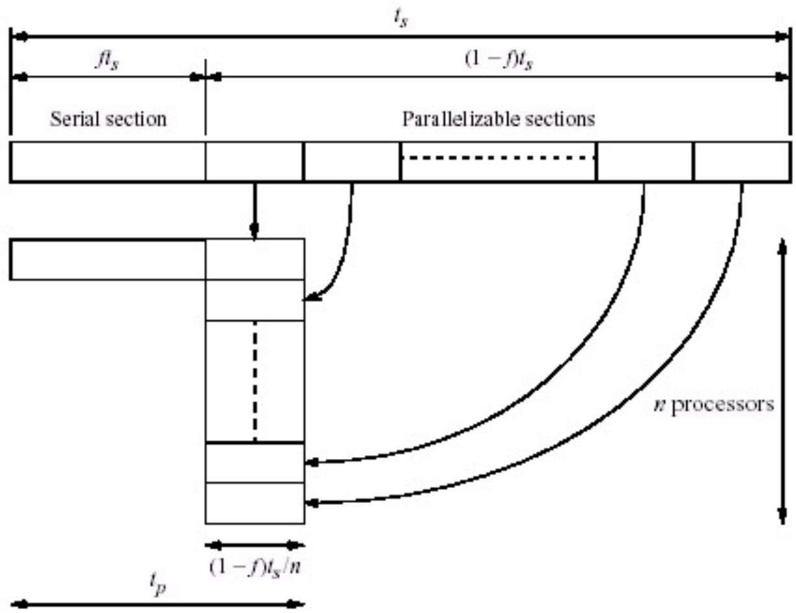  
(a)Oneprocessor   
(b) Multiple processors

# Amdahl 定律： 示例（1）

程序由 5 个相同的部分组成，且每个部分运行时间均花费100 秒

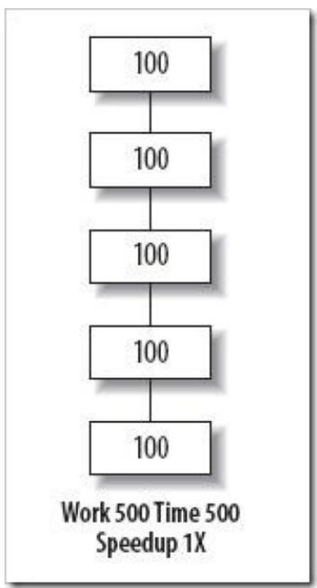

# Amdahl 定律： 示例 （2）

§并行化其中两个部分

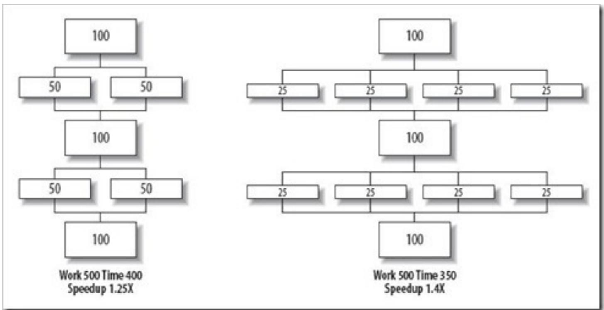

# Amdahl 定律： 示例（3）

增加处理器数

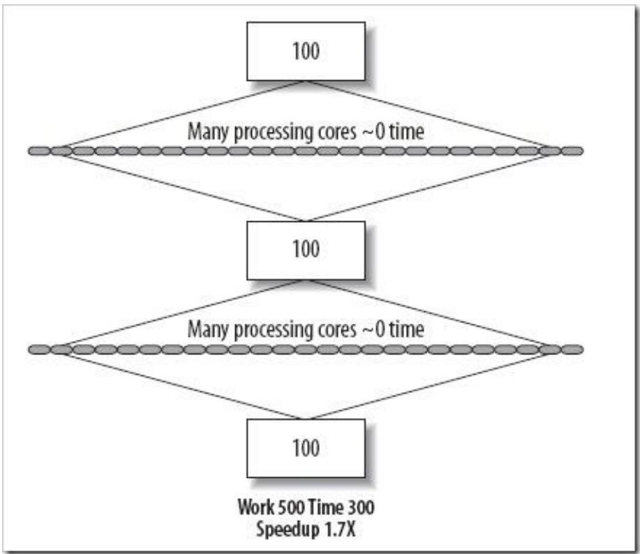

# Amdahl 定律： 公式

• 固定负载的加速公式：

$$
S = \frac {W s + W p}{W s + W _ {P} / p}
$$

• W s+ W p可相应地表示为f+（1-f）

$$
S = \frac {f + (1 - f)}{f + \frac {1 - f}{p}} = \frac {p}{1 + f (p - 1)}
$$

• p→∞时，上式极限为： S= 1 / f

# Amdahl 定律： 曲线图

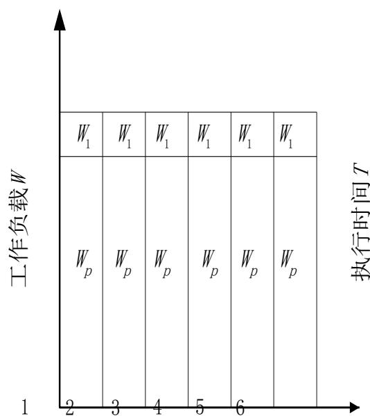  
处理器数P

(a)

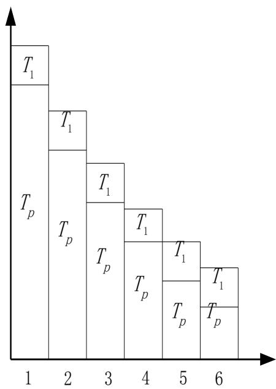  
处理器数P

(b)

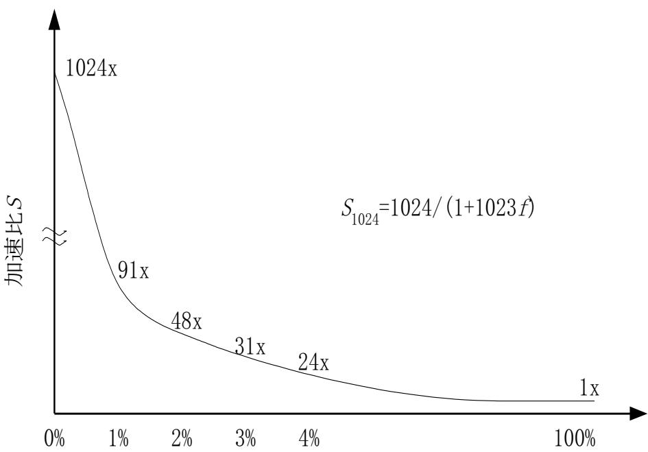  
程序中顺序部分的百分比 $\boldsymbol { f }$

(c)

# Amdahl 定律：考虑额外开销

§ W o为额外开销

$$
S = \frac {W _ {S} + W _ {P}}{W _ {S} + \frac {W _ {P}}{p} + W _ {O}} = \frac {W}{f W + \frac {W (1 - f)}{p} + W _ {O}} = \frac {p}{1 + f (p - 1) + W _ {O} p / W}
$$

# 加速比性能定律

Amdahl 定律  
Gustafson 定律  
Sun and Ni 定律

# Gustafson 定律

# 出发点：

• 对于很多大型计算，精度要求很高，即在此类应用中精度是个关键因素，而计算时间是固定不变的。此时为了提高精度，必须加大计算量，相应才 ；  
除非学术研究，在实际应用中没有必要固定工作负载而计算程序运行在不同数目的处理器上，增多处理器必须相应地增大问题规模才有实际意义。 多处理器必须相应地增大问题规模才有实际意义。

§ 给定一个应用，不断增加并行计算机和处理器数目，是不是可以无限制的提升加速比呢？

Gustafson YES!

# 并行的同时增加计算量

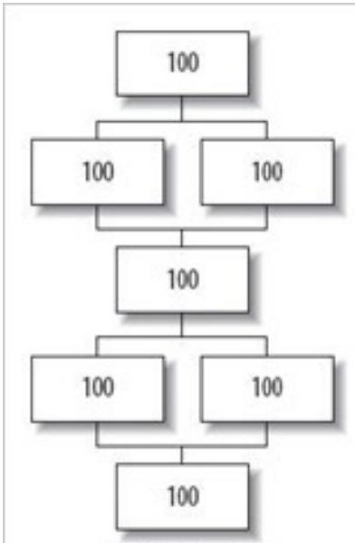  
Work700Time500 Speedup1.4X

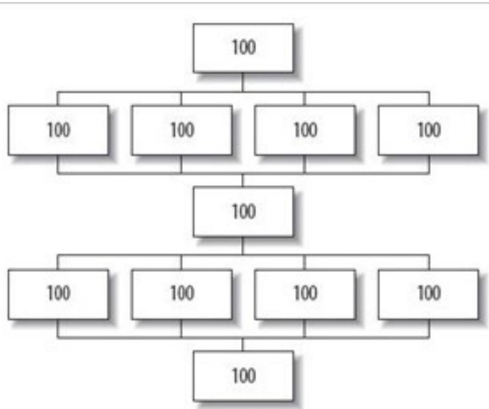  
Work1100Time500 Speedup2.2X

# 增加处理器数与计算量

串行部分仍然花费相同的时间量，随着其在整体中所占比例的下降，变得越来越不重要。

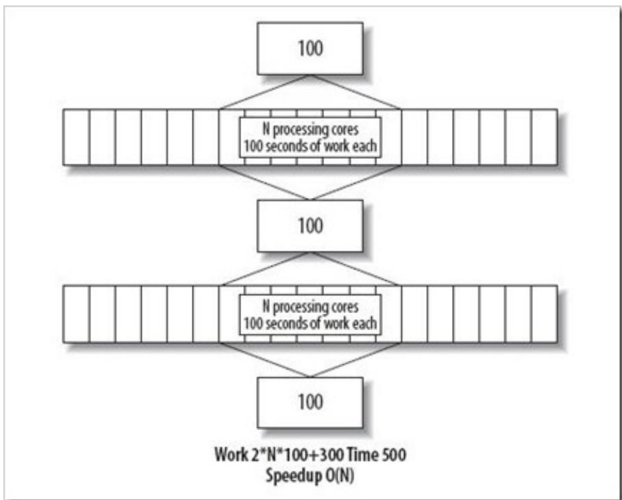

# Gustafson 定律： 公式

• Gustafson加速定律 :

$$
S ^ {\prime} = \frac {W _ {S} + p W p}{W _ {S} + p \cdot W p / p} = \frac {W _ {S} + p W p}{W _ {S} + W _ {P}}
$$

$$
S ^ {\prime} = f + p (1 - f) = p + f (1 - p) = p - f (p - 1)
$$

• 并行开销W o ：

$$
S ^ {\prime} = \frac {W _ {S} + p W _ {P}}{W _ {S} + W _ {P} + W _ {O}} = \frac {f + p (1 - f)}{1 + W _ {O} / W}
$$

# Gustafson 定律： 曲线图

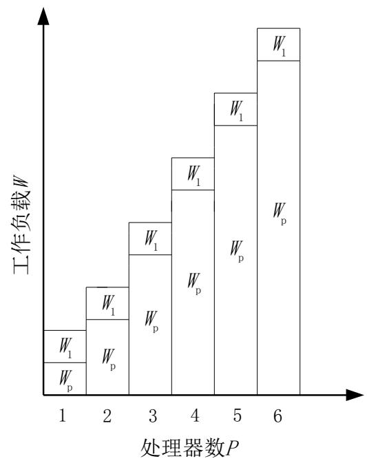  
(a)

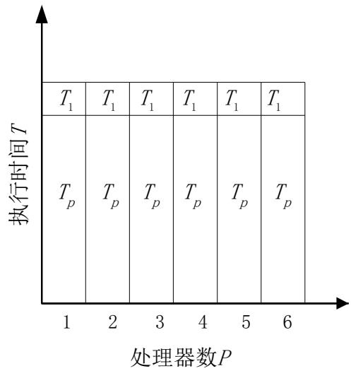  
(b)

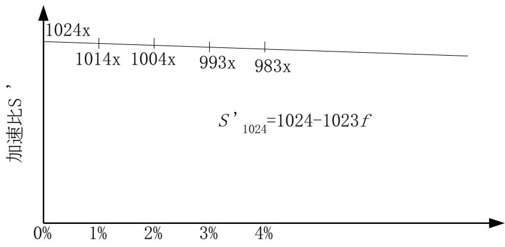  
程序中顺序部分的百分比 $\boldsymbol { f }$   
(c)

# 加速比性能定律

Amdahl 定律  
Gustafson 定律  
§ Sun and Ni 定律

# Sun-Ni定律

• 基本思想：

• 只要存储空间许可，应尽量增大问题规模以产生更好和更精确的解时可能使执行时间略有增加）。  
• 假定在单节点上使用了全部存储容量M并在相应于W的时间内求解之，此时工作负载W= fW + （1-f）W。  
在p 个节点的并行系统上，能够求解较大规模的问题是因为存储容量可增加到pM。令因子G（p）反应存储容量增加到p倍时并行工作负载的增加量，所以扩大后的工作负载W = fW + （1-f）G（p）W。

• 存储受限的加速公式 ：

$$
S ^ {\prime \prime} = \frac {f W + (1 - f) G (p) W}{f W + (1 - f) G (p) W / p} = \frac {f + (1 - f) G (p)}{f + (1 - f) G (p) / p}
$$

• 并行开销W o:

$$
S ^ {\prime} = \frac {f W + (1 - f) W G (p)}{f W + (1 - f) G (p) W / p + W _ {O}} = \frac {f + (1 - f) G (p)}{f + (1 - f) G (p) / p + W _ {O} / W}
$$

# Sun-Ni定律(cont’d)

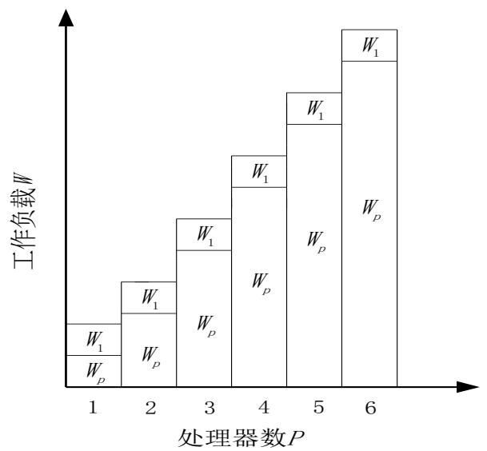  
(a)

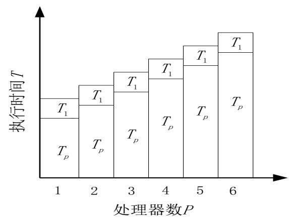

$\textsf { \textbf { G } } ( \mathsf { p } ) = 1$ 时就是Amdahl加速定律；  
• $G ( \rho ) = \rho$ 变为 f + p（1-f），就是Gustafson加速定律  
$G \ ( { \mathsf { p } } ) \ { \mathsf { > p } }$ 时，相应于计算机负载比存储要求增加得快，此时 Sun和N i 加速均比 Amdahl 加速和 Gustafson 加速为高。

# Outline

• 并行计算的性能  
• 内存系统对性能的影响  
• 加速比定律   
• 可扩放性评测

# 可扩放性评测标准

• 并行计算的可扩放性（Scalability）

• 评价并行计算性能的又一指标  
• 计算机系统（或算法或程序等）性能随处理器数的增加而按比例提高的能力  
• 反映并行算法能否有效利用可扩充PE数的能力

# 并行计算的可扩放性

• 加速比：由3个定律可知，增加PE和求解问题的规模可以提高加速比  
• 影响加速比的因素：处理器数与问题规模

• 求解问题中的串行分量  
• 并行处理所引起的额外开销（通信、等待、竞争、冗余操作和同步等）  
• 加大的处理器数超过了算法中的并发程度

# 并行计算的可扩放性

增加规模有利于提高加速比的因素：

• 较大的问题规模可以提高较高的并发度  
• 额外开销的增加可能慢于有效计算的增加  
• 算法中的串行分量比例不是固定不变的（因问题规模增加而缩小）

# 可扩放性的内涵

• 可扩放性:调整什么和按什么比例调整

• 并行计算要调整的是处理数p和问题规模W  
• 两者可按不同比例进行调整，此比例关系（可能是线性的，多项式的或指数的等）就反映了可扩放的程度

# 可扩放性评测标准

# • 可扩放性研究的主要目的：

确定解决某类问题用何种并行算法与何种并行体系结构的组合，可以有效地利用大量的处理器；  
• 对于运行于某种体系结构的并行机上的某种算法当移植到大规模处理机上后运行的性能；  
• 对固定的问题规模，确定在某类并行机上最优的处理器数与可获得的最大的加速比；  
• 用于指导改进并行算法和并行机体系结构，以使并行算法尽可能地充分利用可扩充的大量处理器。

# 等效率度量标准

• 令t ie ：并行系统上第i个处理器的有用计算时间  
• t io：第i个处理器的额外开销时间（包括通信、同步和空闲等待时间等）  
. T p ：p个处理器系统上并行算法的运行时间  
• W：串行算法所完成的计算量

$$
T _ {e} = \sum_ {i = 0} ^ {p - 1} t _ {e} ^ {i} \qquad T _ {o} = \sum_ {i = 0} ^ {p - 1} t _ {o} ^ {i}
$$

• 对于任意i，显然有 ${ \boldsymbol { \mathsf { T } } } _ { \mathsf { p } } = { \boldsymbol { \mathsf { t } } } _ { \mathsf { e } } ^ { \mathsf { i } } + { \boldsymbol { \mathsf { t } } } _ { 0 } ^ { \mathsf { i } } \ ,$ ，且 T e+ T o= pT p  
• 问题的规模W为最佳串行算法所完成的计算量W=Te

# 等效率度量标准

$$
\begin{array}{l} S = \frac {T _ {e}}{T _ {p}} = \frac {T _ {e}}{\frac {T _ {e} + T _ {o}}{p}} = \frac {p}{1 + \frac {T _ {o}}{T _ {e}}} = \frac {p}{1 + \frac {T _ {o}}{W}} \\ E = \frac {S}{P} = \frac {1}{1 + \frac {T _ {o}}{T _ {e}}} = \frac {1}{1 + \frac {T _ {o}}{W}} \\ \end{array}
$$

• 说明：

• 如果问题规模W 保持不降。

• 为了维持一定的效率（介于0与1之间），当处理数p增大时，需要相应地增大问题规模W的值。

# 等效率度量标准

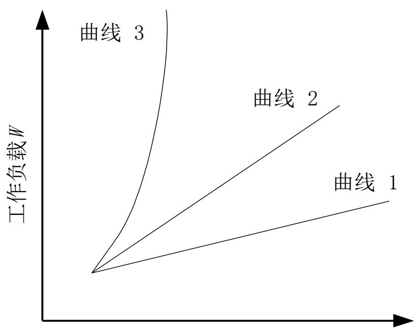  
处理器数 $P$

• 曲线1表示算法具有很好的扩放性；  
• 曲线2表示算法是可扩放的；  
• 曲线 3表示算法是不可扩放的。