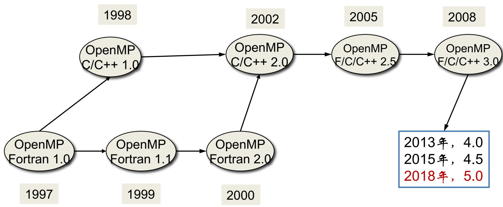
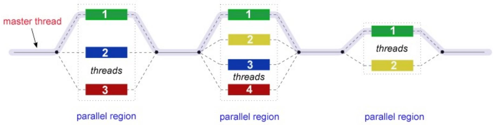
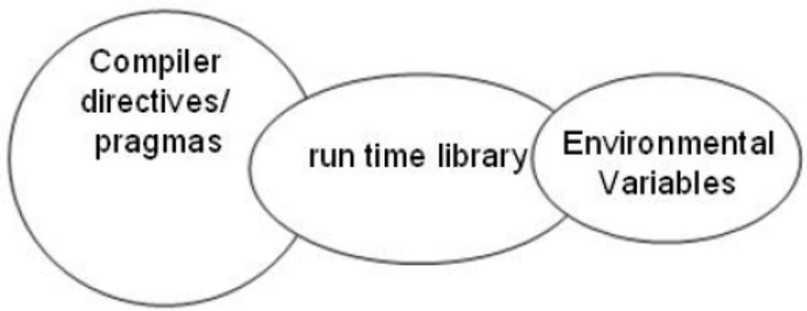
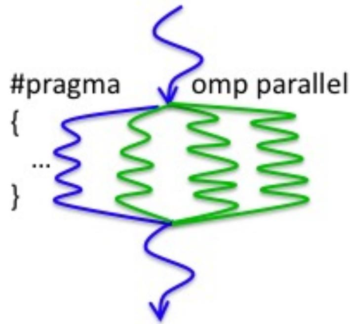
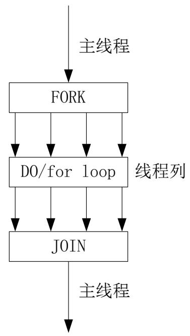
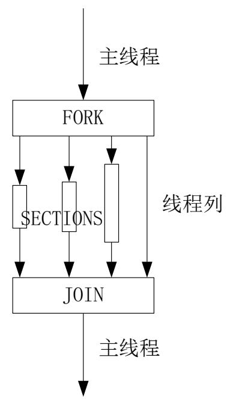
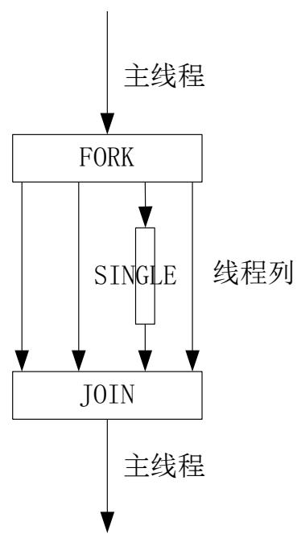
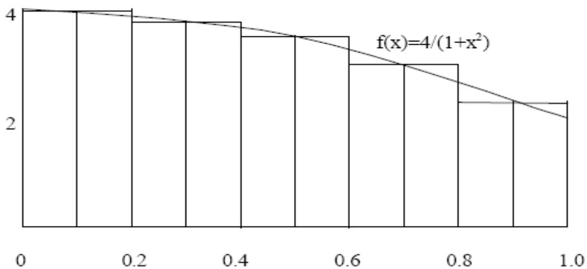

# OpenMP

汤善江 副教授

天津大学智能与计算学部

tashj@tju.edu.cn

http://cic.tju.edu.cn/faculty/tangshanjiang/

# Outline

§ OpenMP概述  
编译制导语句   
运行时库函数  
环境变量  
§实例

# Outline

§ OpenMP概述  
编译制导语句   
运行时库函数  
环境变量  
§ 实例

# OpenMP概述

OpenMP 是一种面向共享内存以及分布式共享内存的多处理器多线程并行编程语言。  
OpenMP是一种能够被用于显式制导多线程、共享内存并行的应用程序编程接口（API）   
§ OpenMP标准诞生于1997 年，目前其结构审议委员会（Architecture Review Board, ARB）已经制定并发布OpenMP 5.0 版本。  
www.openmp.org

# OpenMP发展历程



# OpenMP编程模型：Fork-Join

§ 在开始执行的时候，只有主线程程存在。  
主线程在运行过程中，当遇到需要进行并行计算的时候，派生（Fork）线程来执行并行任务。

§ 在并行执行的时候，主线程和派生线程共同工作。

在并行代码结束执行后，派生线程退出或者挂起，不再工作，控制流程回到单独的主线程中（Join） 。



# OpenMP的实现

编译制导语句   
运行时库函数  
环境变量



# Outline

§ OpenMP概述  
编译制导语句   
运行时库函数  
环境变量  
§实例

# 编译制导语句（Compiler Directive）

并行域  
§ 共享任务  
§ 同步  
§ 数据域

• 数据共享属性子句  
• threadprivate子句   
• 数据拷贝子句

# 编译制导语句（Compiler Directive）

•编译制导语句的含义是在编译器编译程序的时候，会识别特定的注释，而这些特定的注释就包含着OpenMP 程序的一些语义。

• 在C/C++程序中，用#pragma omp parallel 来标 $i \pi -$ 段并行程序块。在一个无法识别OpenMP 语义的普通编译器中，这些特定的注释会被当作普通的注释而被忽略。

#pragma omp <directive> [clause[ [,] clause]…]

# 编译制导语句（Compiler Directive）

将循环拆分到多个线程执行  

```c
void main() #include "omp.h" void main() double Res[1000]; for(int i=0;i<1000;i++) { do_huge_comp(Res[i]); } 串行代码 并行代码
```


# 编译制导语句（Compiler Directive）

并行域  
§ 共享任务  
§ 同步 一  
数据域

• threadprivate   
• 数据域属性子句

# 并行域 （parallel region）



# 并行域

• 并行域中的代码被所有的线程执行  
• 具体格式

• #pragma omp parallel [clause[[,]clause]…]newline   
• clause=

• if(scalar-expression)   
• private(list)   
• firstprivate(list)   
• default(shared | none)   
. shared(list)   
• copyin(list)   
• reduction(operator: list)   
• num_threads(integer-expression)

# 并行域示例

#include <omp.h>

main () { int nthreads, tid;

/* Fork a team of threads giving them their own copies of variables */ #pragma omp parallel private(tid) {

/* Obtain and print thread id */ tid = omp_get_thread num(); printf("Hello World from thread = %d\n", tid);

/* Only master thread does this */ if (tid == 0) { nthreads = omp_get_num_threads(); printf("Number of threads = %d\n", nthreads); } /* All threads join master thread and terminate */ }

# 编译制导语句

§ 并行域  
共享任务  
§ 同步  
数据域

• 数据共享属性子句  
• threadprivate子句   
• 数据拷贝子句

# 共享任务

§ 共享任务结构将它所包含的代码划分给线程组的各成员来执行

• 并行for循环   
• 并行sections   
• 串行执行







# for编译制导语句

for语句指定紧随它的循环语句必须由线程组并行执行；  
• 语句格式

• #pragma omp for [clause[[,]clause]…] newline   
• [clause]=

• Schedule(type [,chunk])   
• ordered   
• private (list)   
• firstprivate (list)   
• lastprivate (list)   
• shared (list)   
• reduction (operator: list)   
. nowait

# for编译制导语句

# §schedule (type [,chunk])

<table><tr><td>Thread</td><td>0</td><td>1</td><td>2</td><td>3</td></tr><tr><td>no chunk *</td><td>1-4</td><td>5-8</td><td>9-12</td><td>13-16</td></tr><tr><td>chunk = 2</td><td>1-2</td><td>3-4</td><td>5-6</td><td>7-8</td></tr><tr><td></td><td>9-10</td><td>11-12</td><td>13-14</td><td>15-16</td></tr></table>

§ 描述如何将循环的迭代划分给线程组中的线程  
§ chunk

每个线程分配的计算量。  
§ 如果没有指定chunk大小，迭代会尽可能的平均分配给每个线程

type

static，循环被分成大小为 chunk的块，静态分配给线程  
dynamic,循环被动态划分为大小为chunk的块，动态分配给线程

# for示例

```c
include <omp.h>  
#define CHUNKSIZE 100  
#define N 1000 
```

```txt
main () {  
int i, chunk;  
float a[N], b[N], c[N];
```

```c
/* Some initializations */  
for (i=0; i<N; i++)  
    a[i] = b[i] = i * 1.0;  
chunk = CHUNKSIZE; 
```

```c
#pragma omp parallel shared(a,b,c,chunk) private(i)  
{  
#pragma omp for schedule(dynamic,chunk) nowait  
for (i=0; i<N; i++)  
    c[i] = a[i] + b[i];  
} /* end of parallel section */ 
```

# Sections编译制导语句

• sections编译制导语句指定内部的代码被划分给线程组中的各线程  
• 不同的section由不同的线程执行  
• Section语句格式：

```txt
#pragma omp sections [ clause[.,]clause]...] newline   
{   
[#pragma omp section newline]   
...   
[#pragma omp section newline]   
...   
} 
```

# Sections编译制导语句

• clause=

• private (list)   
• firstprivate (list)   
• lastprivate (list)   
• reduction (operator: list)   
• nowait

• 在sections语句结束处有一个隐含的路障，使用了nowait子句除外

# Sections编译制导语句

include <omp.h>   
#define N 1000   
main(){ int i; float a[N],b[N],c[N],d[N]; $\text{一} ^ { \text{一} }$ Some initializations\*/   
for $(\mathrm{i} = 0$ . $\mathrm{i} <   \mathrm{N}$ .i++) $\mathrm{a[i] = i*1.5};$ $\mathrm{b[i] = i + 22.35};$ #pragma omp parallel shared(a,b,c,d) private(i){ #pragma omp sections nowait{ #pragma omp section for $(\mathrm{i} = 0;\mathrm{i} <   \mathrm{N};\mathrm{i} + + )$ $\mathrm{c[i] = a[i] + b[i]};$ #pragma omp section for $(\mathrm{i} = 0;\mathrm{i} <   \mathrm{N};\mathrm{i} + + )$ $\mathrm{d[i] = a[i]*b[i]};$ }/\*end of sections\*/ }/\*end of parallel section\*/

# single编译制导语句

• 指定内部代码只有线程组中的一个线程执行。  
• 线程组中没有执行single语句的线程会一直等待代码块的结束，使用nowait子句除外  
•语句格式：

• #pragma omp single [clause[[,]clause]…] newline   
• clause=

• private(list)   
• firstprivate(list)   
• nowait

# single示例

```c
include<stdio.h>   
void work1(){   
void work2{   
void a12()   
{ #pragma omp parallel { #pragma omp single printf("Beginning work1.\n"); work1(); #pragma omp single printf("Finishing work1.\n"); #pragma omp single nowait printf("Finished work1 and beginning work2.\n"); work2(); }   
} 
```

# parallel for编译制导语句

• Parallel for编译制导语句表明一个并行域包含一个独立的for语句  
• 语句格式

• #pragma omp parallel for [clause…] newline   
• clause=

• if (scalar_logical_expression)   
• default (shared | none)   
• schedule (type [,chunk])   
• shared (list)   
• private (list)   
• firstprivate (list)   
• lastprivate (list)   
reduction (operator: list)   
• copyin (list)

# parallel for编译制导语句

include <omp.h>   
#define N 1000   
#define CHUNKSIZE 100   
int main ()   
{ int i, chunk; float a[N], b[N], c[N]; /\* Some initializations \*/ for $(\mathrm{i} = 0;\mathrm{i} <   \mathrm{N};\mathrm{i} + + )$ $\mathbf{a}[\mathbf{i}] = \mathbf{b}[\mathbf{i}] = \mathbf{i}^{*}\mathbf{1.0};$ chunk $=$ CHUNKSIZE; #pragma omp parallel for shared(a,b,c,chunk) private(i) schedule(static,chunk) for $(\mathrm{i} = 0;\mathrm{i} <   \mathrm{n};\mathrm{i} + + )$ $\mathbf{c}[\mathbf{i}] = \mathbf{a}[\mathbf{i}] + \mathbf{b}[\mathbf{i}]$ .

# parallel sections编译制导语句

parallel sections编译制导语句表明一个并行域包含单独的一个sections语句  
• 语句格式

#pragma omp parallel sections [clause…] newline   
• clause=

• default (shared | none)   
• shared (list)   
• private (list)   
• firstprivate (list)   
• lastprivate (list)   
• reduction (operator: list)   
• copyin (list)   
• ordered

# parallel sections 示例

```txt
void XAXIS();   
void YAXIS();   
void ZAXIS();   
void all()   
{ #pragma omp parallel sections { #pragma omp section XAXIS(); #pragma omp section YAXIS(); #pragma omp section ZAXIS(); }   
} 
```

# 编译制导语句

§ 并行域  
§ 共享任务  
§ 同步  
数据域

• 数据共享属性子句  
• threadprivate子句   
• 数据拷贝子句

# 同步

master 制导语句   
critical制导语句   
barrier制导语句   
§ atomic制导语句   
flush制导语句   
§ ordered制导语句

# master 制导语句

§master制导语句指定代码段只有主线程执行  
语句格式

• #pragma omp master newline

# critical制导语句

critical制导语句表明域中的代码一次只能执行一个线程  
• 其他线程被阻塞在临界区  
语句格式：

• #pragma omp critical [name] newline

# critical制导语句

int deque(float \*a);   
void work(int i, float \*a);   
void a16(float \*x, float \*y)   
{ int ix_next, iy_next; #pragma omp parallel shared(x,y) private (ix_next, iy_next) { #pragma omp critical (xaxis) ix_next $=$ dequeue(x); work(ix_next,x); #pragma omp critical (yaxis) iy_next $=$ dequeue(y); work(iy_next,y); }   
}

# barrier制导语句

barrier制导语句用来同步一个线程组中所有的线程  
§ 先到达的线程在此阻塞，等待其他线程  
barrier语句最小代码必须是一个结构化的块  
§语句格式

• #pragma omp barrier newline

# atomic制导语句

atomic制导语句指定特定的存储单元将被原子更新  
语句格式

• #pragma omp atomic newline

atomic使用的格式

$$
\begin{array}{l} \times \mathrm {b i n o p} = \mathrm {e x p r} \\ x + + \\ + + X \\ x - - \\ - - X \\ \end{array}
$$

x是一个标量

expr是一个不含对x引用的标量表达式，且不被重载

binop是 $+ , + , - , / , \alpha , \hat { ~ } , | ,  , 0 r < < \vec { < } - ,$ ，且不被重载

# atomic示例

include<iostream>   
#include<omp.h>   
int main()   
{ int sum $= 0$ std::cout<<"Before:"<<sum<<std::endl; #pragma omp parallel for for (int $\mathrm{i} = 0$ . $\mathrm{i} <   20000$ ++i) { #pragma omp atomic sum++; } std::cout<<"After:"<<sum<<std::endl; return 0;

输出：

Before: 0 After:20000

无atomic，则输出结果会不确定。

# flush制导语句

§ flush制导语句用以标识一个同步点，用以确保所有的线程看到一致的存储器视图  
§ 语句格式

• #pragma omp flush (list) newline

flush将在下面几种情形下隐含运行，nowait子句除外

barrier

critical:进入与退出部分

ordered:进入与退出部分

parallel:退出部分

for:退出部分

sections:退出部分

single:退出部分

# ordered制导语句

ordered制导语句指出其所包含循环的执行按循环次序进行  
任何时候只能有一个线程执行被ordered所限定部分  
• 只能出现在for或者parallel for语句的动态范围中  
• 语句格式：

• #pragma omp ordered newline

# ordered示例

void work(int i){   
void a24_good(int n) { int i;   
#pragma omp for ordered for $(1 = 0$ . $1 <   n$ . $1 + + )$ { if $(1 <   = 10)$ { #pragma omp ordered work(i); } if $(1 > 10)$ { #pragma omp ordered work(1+1); }   
}

# 编译制导语句

§ 并行域  
§ 共享任务  
§ 同步  
数据域

. 数据共享属性子句  
. threadprivate子句   
• 数据拷贝子句

# 数据共享属性子句

变量作用域范围  
数据域属性子句

• private子句   
• shared子句   
• default子句   
• firstprivate子句   
• lastprivate子句   
. reduction子句

# private子 句

private子句表示它列出的变量对于每个线程是局部的 。  
• 语句格式

•private(list)

# private()

```txt
include<stdio.h> 4线程  
int main()  
{ int i, x = 100; #pragma omp parallel for private(x) { \{ x += i; printf("x = %d\n", x); } printf("global x = %d\n", x); return 1; } global x = 100 
```

# shared子句

shared子句表示它所列出的变量被线程组中所有的线程共享  
• 所有线程都能对它进行读写访问  
语句格式

• shared (list)

# default子 句

default子句让用户自行规定在一个并行域的静态范围中所定义的变量的缺省作用范围  
语句格式

• default (shared | none)

# firstprivate子句

• firstprivate子句是private子句的超集   
对变量做原子初始化  
语句格式：

firstprivate (list)

# firstprivate()

#include <stdio.h>

4线程

int main()   
{ int i, x = 100; #pragma omp parallel for firstprivate(x) for $(\mathrm{i} = 0;\mathrm{i} <   8;\mathrm{i} + + )$ { x += i; printf("x=%d\n",x); } printf("global x=%d\n",x); return 1;   
}

x = 100

x = 101

x = 102

x = 105

x = 106

x = 113

x = 104

x = 109

global x = 100

# lastprivate子句

• lastprivate子句是private子句的超集   
将变量从最后的循环迭代或段复制给原始的变量  
• 语句格式

• lastprivate (list)

# lastprivate()

#include <stdio.h>   
```lua
int main() 4线程：  
{ x = 100  
int i, x = 100; x = 101  
#pragma omp parallel for firstprivate(x) lastprivate(x) x = 102  
for (i=0; i<8; i++) x = 105  
{ x = 106  
x += i; x = 113  
printf("x = %d\n", x); x = 104  
}  
printf("global x = %d\n", x); x = 109  
return 1; global x = 113  
} 
```

# reduction子句

§reduction子句使用指定的操作对其列表中出现的变量进行规约  
初始时，每个线程都保留一份私有拷贝  
在结构尾部根据指定的操作对线程中的相应变量进行规约，并更新该变量的全局值  
语句格式

• reduction (operator: list)

# reduction子句

include <omp.h>   
int main ()   
{ int i, n, chunk; float a[100], b[100], result; /\* Some initializations \*/ n = 100; chunk $= 10$ . result $= 0.0$ for $(\mathrm{i} = 0;\mathrm{i} <   \mathrm{n};\mathrm{i} + + )$ { a[i] $=$ i\*1.0; b[i] $=$ i\*2.0; } #pragma omp parallel for default(shared) private(i)\ schedule(static,chunk) reduction(+:result) for $(\mathrm{i} = 0;\mathrm{i} <   \mathrm{n};\mathrm{i} + + )$ result $=$ result $^+$ (a[i] \*b[i]); printf("Final result $\equiv \% \mathrm{f}\backslash \mathrm{n}''$ ,result);   
}

# threadprivate编译制导语句

threadprivate语句使一个全局文件作用域的变量在并行域内变成每个线程私有  
• 每个线程对该变量复制一份私有拷贝  
语句格式:

• #pragma omp threadprivate (list) newline

# threadprivate编译制导语句

```txt
include<omp.h> 
```

```typescript
int counter = 0; 
```

```txt
pragma omp threadprivate(counter) 
```

```txt
void inc_counter(){counter++;} 
```

```txt
int main(int argc, char * argv[])
int i; 
```

```txt
#pragma omp parallel private (i) 
```

```txt
{ for(i=0;i<1000;i++) inc counter(); printf("counter=%d\n",counter); } printf("counter=%d\n",counter); 
```

8线程：

```txt
counter=1000 
```

```txt
counter=1000 
```

```txt
counter=1000 
```

```txt
counter=1000 
```

```txt
counter=1000 
```

```txt
counter=1000 
```

```txt
counter=1000 
```

```txt
counter=1000 
```

```txt
counter=1000 
```

# threadprivate编译制导语句

int alpha[10], beta[10], i;//eg3

#pragma omp threadprivate(alpha)

int main ()

/* First parallel region */

#pragma omp parallel private(i,beta)

for (i=0; i < 10; i++)

$$
\mathrm {a l p h a [ i ] = b e t a [ i ] = i};
$$

/* Second parallel region */

#pragma omp parallel

printf("alpha[3]= %d and beta[3]=%d\n",alpha[3],beta[3]); }

8线程：

alpha[3]= 3 and beta[3] $= 0$

alpha[3]= 3 and beta[3] $= 0$

alpha[3]= 3 and beta[3] $= 0$

alpha[3]= 3 and beta[3] $= 0$

alpha[3]= 3 and beta[3] $= 0$

alpha[3]= 3 and beta[3] $= 0$

alpha[3]= 3 and beta[3] $= 0$

alpha[3]= 3 and beta[3] $= 0$

# private和threadprivate区别

<table><tr><td></td><td>PRIVATE</td><td>THREADPRIVATE</td></tr><tr><td>数据类型</td><td>变量</td><td>变量</td></tr><tr><td>位置</td><td>在域的开始或共享任务单元</td><td>在块或整个文件区域的例程的定义上</td></tr><tr><td>持久性</td><td>否</td><td>是</td></tr><tr><td>扩充性</td><td>只是词法的-除非作为子程序的参数而传递</td><td>动态的</td></tr><tr><td>初始化</td><td>使用FIRSTPRIVATE</td><td>使用COPYIN</td></tr></table>

# copyin子 句

copyin子句用来为线程组中所有线程的 threadprivate变量赋相同的值   
• 主线程该变量的值作为初始值   
语句格式

• copyin(list)

# copyin示例

include<omp.h> int global $\equiv 0$ #pragma omp threadprivate(global) int main(int argc, char \* argv[]) { global $= 1000$ #pragma omp parallel copyin(global) { printf("global=%d\n",global); global $\equiv$ omp_get_thread_num(); } printf("global=%d\n",global); printf("parallel again\n"); #pragma omp parallel printf("global=%d\n",global);   
}

```txt
global=1000  
global=1000  
global=1000  
global=1000  
global=1000  
global=1000  
global=1000  
global=0  
parallel again  
global=0  
global=2  
global=1  
global=4  
global=3  
global=5  
global=6  
global=7 
```

# copyprivate 子句

copyprivate子句提供了一种机制用一个私有变量将一个值从一个线程广播到执行同一并行区域的其他线程。  
• 语句格式：

copyprivate(list)

copyprivate子句可以关联single构造，在single构造的barrier到达之前就完成了广播工作。

# copyprivate子 句

int counter = 0;   
#include omp threadprivate(counter) ThreadId: 2, count = 51   
int increment_counter() ThreadId: 0, count = 51   
{ counter++; return(counter); ThreadId: 3, count = 51   
}   
#include omp parallel   
{ int count; #pragma omp single copyprivate(counter) ThreadId: 2, count = 1 { counter $= 50$ ; ThreadId: 1, count = 1 } count $=$ increment_counter(); ThreadId: 3, count = 1 printf("ThreadId: %ld, count = %ld\n", omp_get_thread_num(), count);

# Outline

§ OpenMP概述  
编译制导语句   
运行时库函数  
环境变量  
§实例

# 运行库例程与环境变量

# • 运行库例程

• OpenMP标准定义了一个应用编程接 $\pmb { \alpha }$ 来调用库中的多种函数  
• 对于C/C++，在程序开头需要引用文件“omp.h”

# • 环境变量

• OMP_SCHEDULE：线程调度类型，只能用到for, parallel for中  
• OMP_NUM_THREADS：定义执行中最大的线程数  
OMP_DYNAMIC：通过设定变量值TRUE或FALSE,来确定是否动态设定并行域执行的线程数  
• OMP_NESTED：确定是否可以并行嵌套

# Outline

§ OpenMP概述  
§编译制导语句   
运行时库函数  
环境变量  
实例

# OpenMP计算实例

§ 矩形法则的数值积分方法估算Pi的值

$$
P _ {i} = \int_ {0} ^ {1} \frac {4}{1 + x ^ {2}} d x \approx \frac {1}{N} \sum_ {i = 1} ^ {N} f (\frac {i}{N} - \frac {1}{2 N}) = \frac {1}{N} \sum_ {i = 1} ^ {N} f (\frac {i - 0 . 5}{N})
$$



# OpenMP计算实例

// 串行代码

```txt
static long num_steps = 100000;  
double step;  
void main()  
{ int i; double x, pi, sum = 0.0; step = 1.0/(double) num_steps for (i=0;i<num_steps; i++) { x = (i+0.5)*step; sum = sum + 4.0/(1.0+} pi = step * sum; } 
```

```c
//使用并行域并行化的程序
#include <omp.h>
static long num_steps = 100000;
double step;
#define NUM_THREAD 2
void main()
{
    int i;
    double x, pi, sum[NUM_THREAD];
    step = 1.0/(double) num_steps;
    omp_set_num Threads[NUM_THREAD); // 
    #pragma omp parallel
    {
        double x;
        int id;
        id = omp_get_thread_num();
        for (i=id, sum[id] == 0.0; i<num_steps; i=i+NUM_THREAD) {}
            x = (i+0.5)*step;
            sum[id] += 4.0/(1.0+x*x);
        }
    }
    for (i=0, pi=0.0; i<NUM_THREAD;i++)
        pi += sum[i] * step;
} 
```

```c
//使用共享任务结构并行化的程序  
#include <omp.h>  
static long num_steps = 100000;  
double step;  
#define NUM_THREAD 2  
void main()  
{  
    int i;  
    double x, pi, sum[NUM_THREAD];  
    step = 1.0/(double) num_steps;  
    omp_set_num Threads(NUM_THREAD); //**********  
    #pragma omp parallel //**********  
    {  
        double x;  
        int id;  
        id = omp_get_thread_num();  
        sum[id] = 0; //**  
        #pragma omp for///**********  
        for (i=0;i<num_steps; i++) {  
            x = (i+0.5)*step;  
            sum[id] += 4.0/(1.0+x*x);  
        }  
    }  
for(i=0, pi=0.0;i<NUM_THREAD;i++) pi += sum[i] * step; 
```

```c
//使用private子句和critical部分并行化的程序  
#include <omp.h>  
static long num_steps = 100000;  
double step;  
#define NUM_THREAD 2  
void main()  
{  
    int i;  
    double x, sum, pi = 0.0;  
    step = 1.0/(double) num_steps;  
    omp_set_num Threads(NUM_THREAD)  
    #pragma omp parallel private (x, sum)  
{  
        id = omp_get_thread_num();  
        for (i = id, sum = 0.0; i < num_steps; i = i + NUM_THREAD) {  
            x = (i + 0.5)*step;  
            sum += 4.0/(1.0 + x*x);  
        }  
        #pragma omp critical  
        pi += sum  
    } 
```

//使用并行归约得出的并行程序

#include <omp.h>

static long num_steps = 100000;

double step;

#define NUM_THREADS 2

void main ()

{ int i;

double x, pi, sum = 0.0;

step = 1.0/(double) num_steps;

omp_set_num_threads(NUM_THREADS)

#pragma omp parallel for reduction(+:sum) private(x)

for (i=0;i<num_steps; i++){

x = (i+0.5)*step;

sum = sum + 4.0/(1.0+x*x);

pi = step * sum;