# MPI基础

汤善江 副教授

天津大学智能与计算学部

tashj@tju.edu.cn

http://cic.tju.edu.cn/faculty/tangshanjiang/

# 集群逻辑体系结构

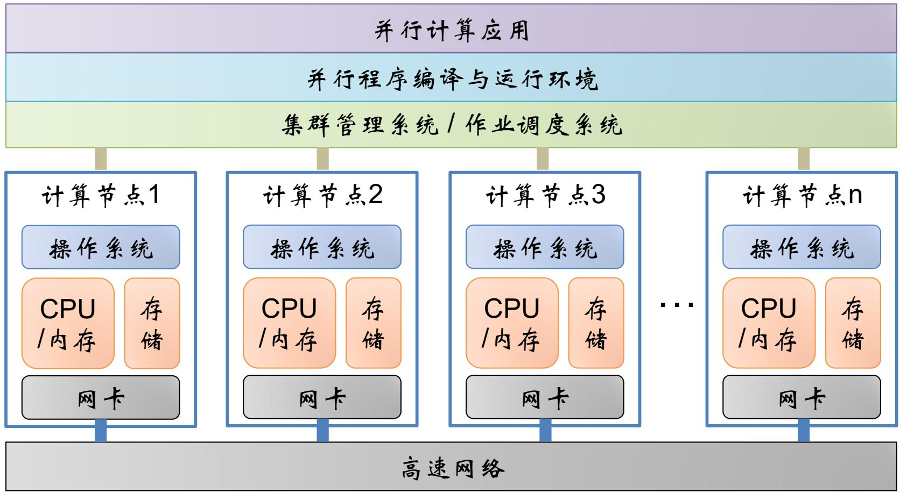

# 集群分类（按用途）

# - 高性能计算

- 科学计算，并行计算  
- 优先考虑计算性能

# - 大数据分析

- 分布式并行数据处理  
- 优先考虑IO与存储性能优化

# - 高可用服务

- 高可靠在线服务  
- 最大程度减少对外服务中断

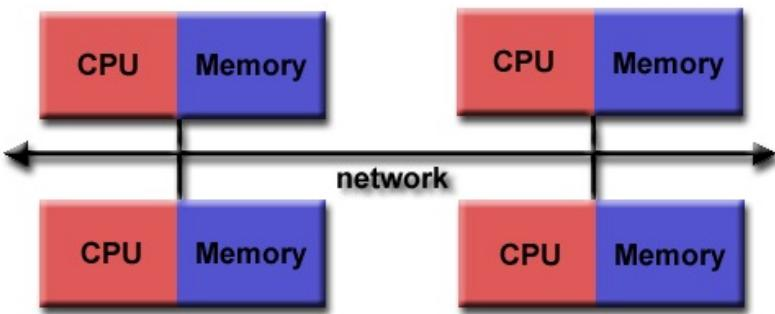

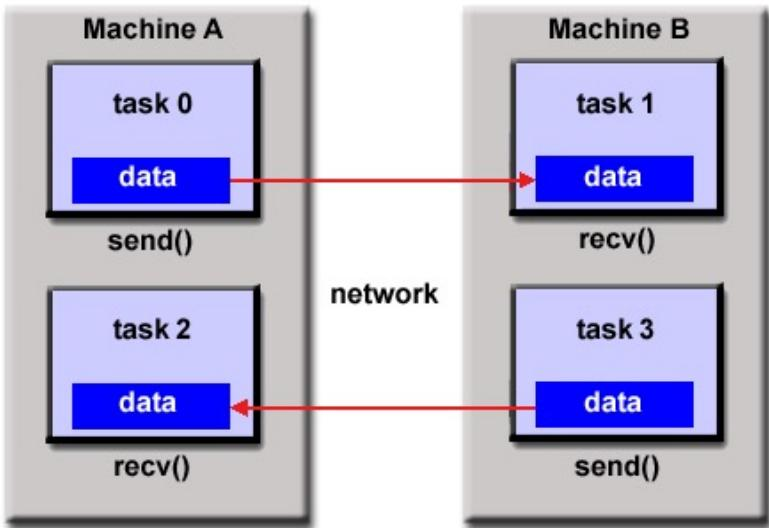

# Cluster1350

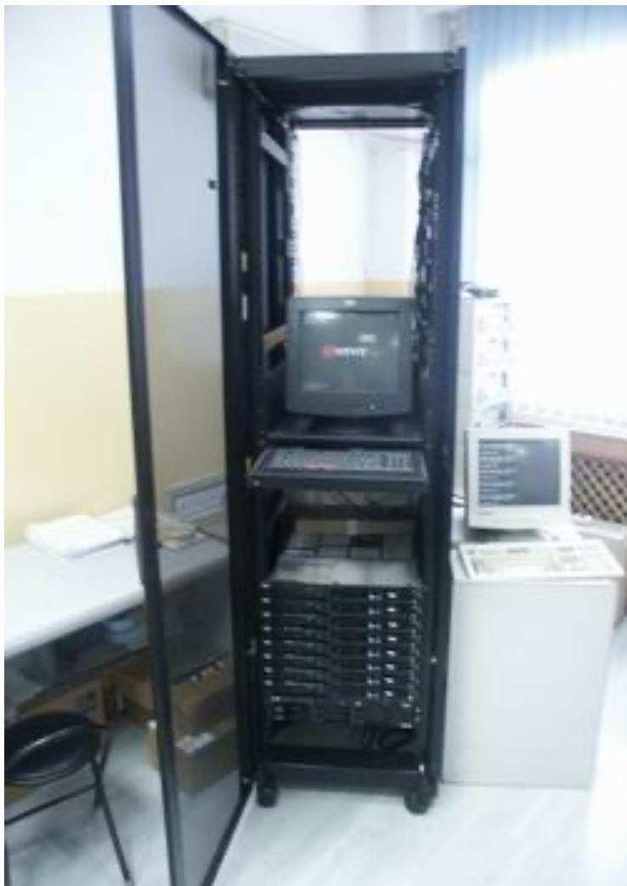

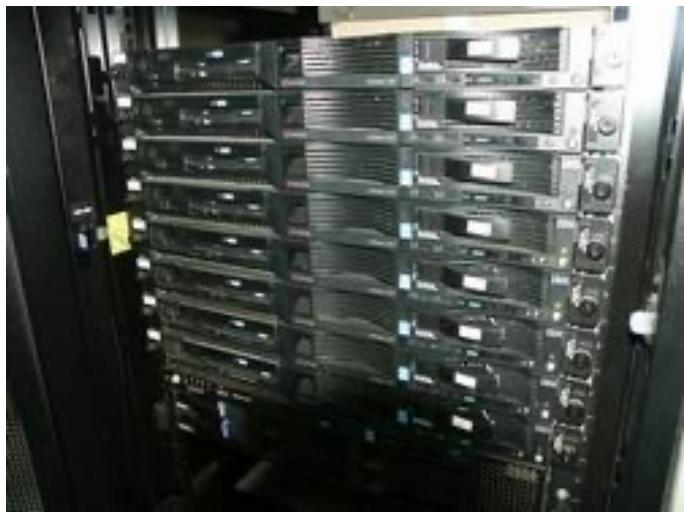

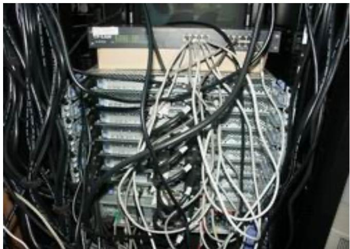

# 管理网络示例

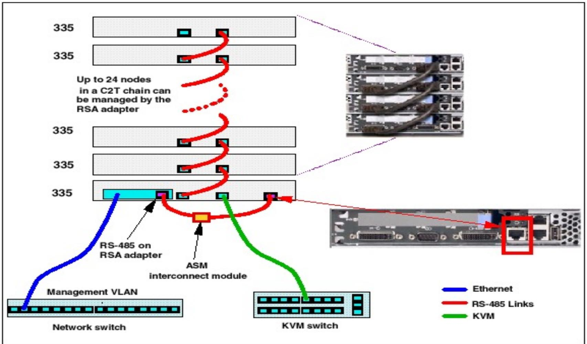  
Figure2-4Managementprocessornetwork

# 网络配置示例

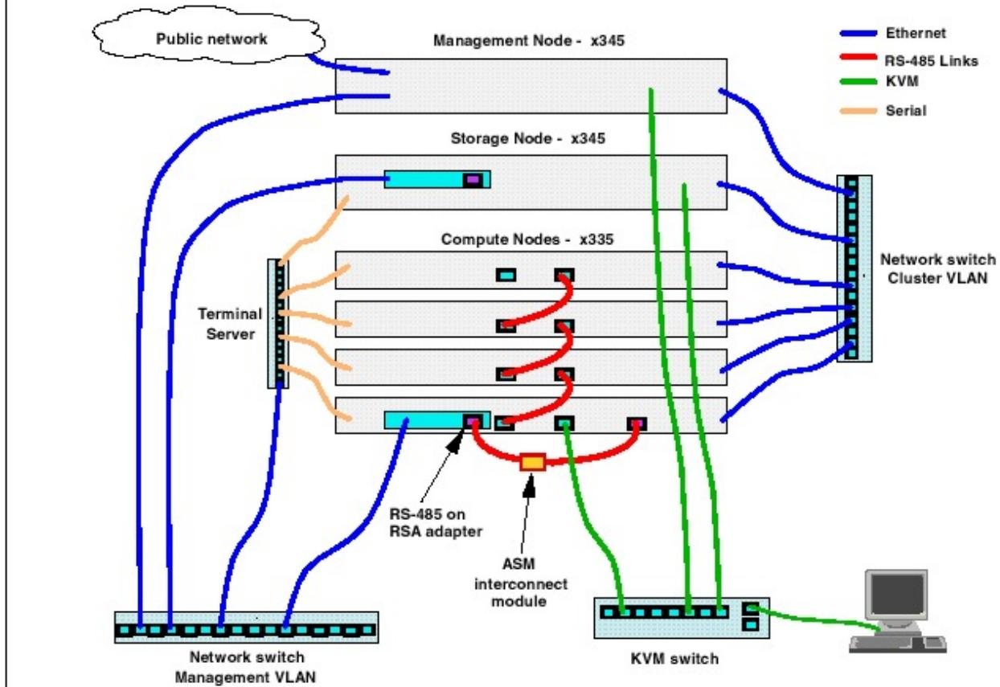  
Figure5-1 Labclusterconfiguration

# 并行计算作业管理

在大规模集群或者超级计算机平台上，一般不能随意地直接运行用户的并行计算程序，而必须通过其上提供的作业管理系统来提交计算任务。  
- 集群作业管理系统的功能

- 统一管理和调度集群的软硬件资源  
- 保证用户作业公平合理地共享集群资源  
- 提高系统利用率和吞吐率。

- 常用的作业管理系统

- PBS   
- Slurm   
- LSF

# PBS

PBS(Portable Batch System)最初由NASA的Ames研究中心开发，提供能满足异构计算网络需要的软件包，用于灵活的批处理，满足高性能计算的需要。  
- PBS的主要特点有：

- 代码开放，免费获取；  
支持批处理、交互式作业和串行、多种并行作业，如MPI、PVM、HPF、MPL；  
- PBS是功能最为齐全, 历史最悠久, 支持最广泛的本地集群调度器之一。

- PBS的目前包括openPBS, PBS Pro和Torque三个主要分支.

- OpenPBS是最早的PBS系统, 目前已经没有太多后续开发  
- PBS pro是PBS的商业版本, 功能最为丰富  
Torque是Clustering公司接管了OpenPBS, 并给与后续支持的一个开源版本

# PBS 逻辑架构

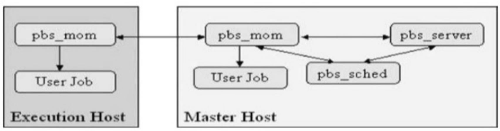

- pbs_mom：后台监控进程  
- pbs_server：调度服务器  
- pbs_sched：调度策略

# Slurm

SLURM （Simple Linux Utility for Resource Management）是一种可用于大型计算节点集群的高度可伸缩和容错的集群管理器和作业调度系统，主要功能包括：

- 在一段时间内为用户分配资源（计算机节点）的独占和/或非独占访问权限，以便他们可以执行工作。  
- 提供了一个框架，用于在一组分配的节点上启动，执行和监视工作（通常是并行作业，例如MPI）。  
- 通过管理待处理作业队列来仲裁资源争用。

- Slurm是TOP500超级计算机中约60%的工作负载管理器，其中包括天河二号。  
Slurm使用基于希尔伯特曲线调度或胖树网络拓扑的最佳拟合算法来优化并行计算机上任务分配的局部性。

# Slurm逻辑架构

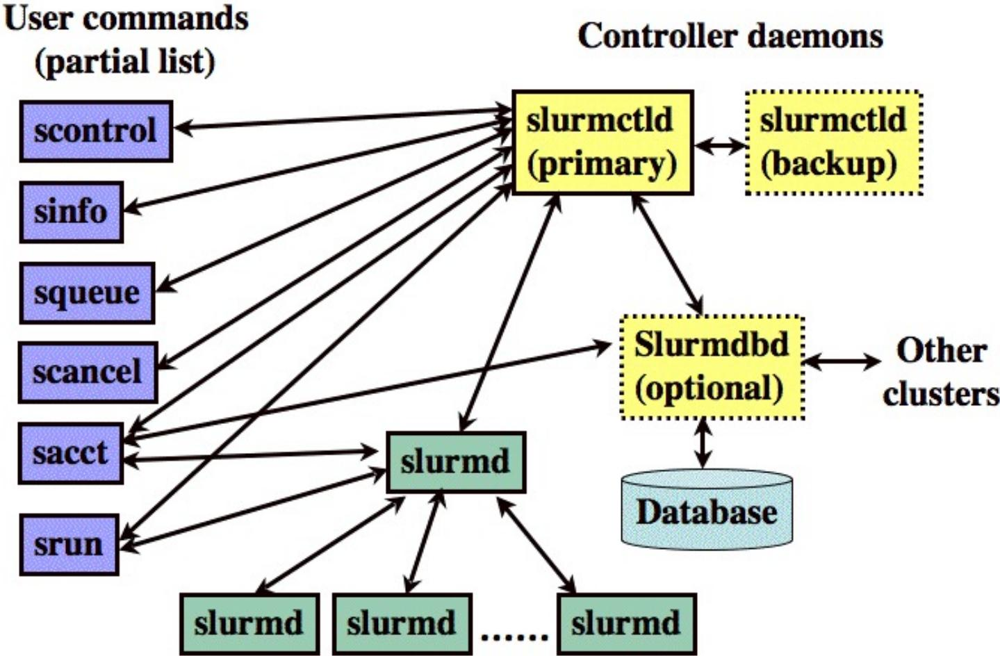  
Compute node daemons

# Slurm部署

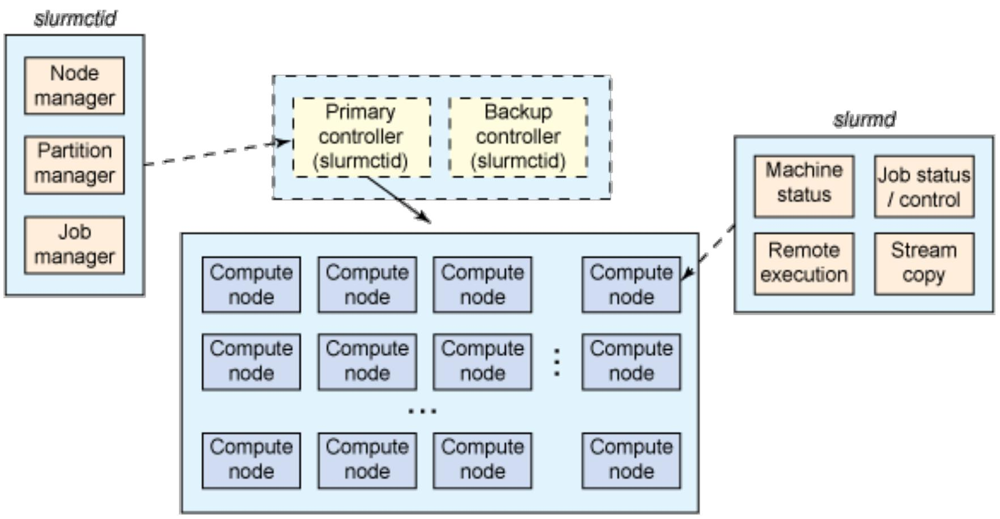

# Slurm 资源分区

- 节 点 的 特以节 性 不 帮 ， 同， 助 用特 ，点 的择 ， 最 适 合算。 己进 行 运   
- 集有 中， 那么设置 部 部分机 器使在 得只有部 这 个分 区  
- 分区(Partition)可看做一系列节点的集合。

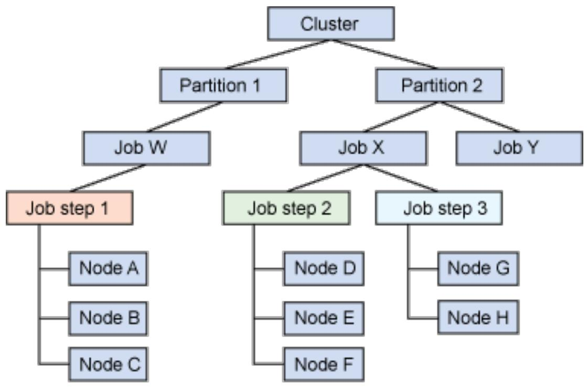

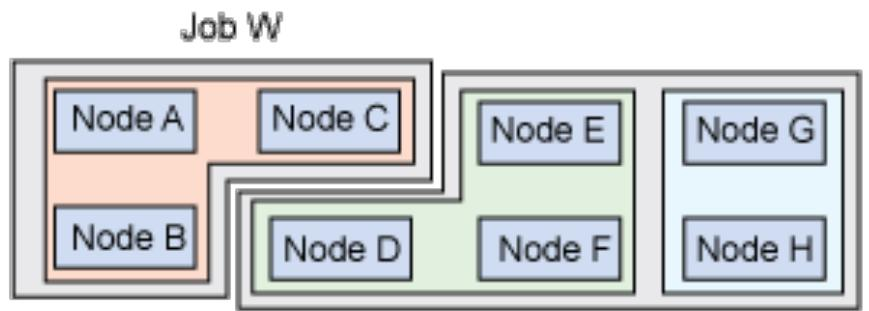  
Job X

# PBS 与 Slurm 的功能及命令对照

<table><tr><td>功能</td><td>PBS</td><td>SLURM</td></tr><tr><td>任务名称</td><td>#PBS -N name</td><td>#SBATCH -J name</td></tr><tr><td>指定队列/分区</td><td>#PBS -q cpu</td><td>#SBATCH -p cpu</td></tr><tr><td>指定 QoS</td><td>#PBS --qos=debug,需调度器支持</td><td>#SBATCH --qos=debug</td></tr><tr><td>最长运行时间</td><td>#PBS -l walltime=5:00</td><td>#SBATCH -t 5:00</td></tr><tr><td>指定节点数量</td><td>#PBS -l nodes=1</td><td>#SBATCH -N 1</td></tr><tr><td>指定CPU核心</td><td>#PBS -l ppn=4</td><td>#SBATCH --cpus-per-task=4</td></tr><tr><td>指定GPU卡</td><td>不支持</td><td>#SBATCH --gres=gpu:1</td></tr><tr><td>作业数组</td><td>#PBS -t 0-2</td><td>#SBATCH -a 0-2</td></tr><tr><td>输出文件</td><td>#PBS -o test.out</td><td>#SBATCH -o test.out</td></tr><tr><td>提交任务脚本</td><td>qsub run.pbs</td><td>sbatch run.slurm</td></tr><tr><td>查看任务状态</td><td>qstat</td><td>squeue</td></tr><tr><td>取消任务</td><td>qdel 1234</td><td>scancel 1234</td></tr><tr><td>交互式任务</td><td>qsub -I,自动切换</td><td>salloc,手动切换</td></tr><tr><td>指定特定节点</td><td>qsub -l nodes=comput1</td><td>#SBATCH --nodelist=comput1</td></tr></table>

# Outline

MPI概述  
- 点到点通信  
- 组通信  
- 阻塞通信模式

# Outline

- MPI概述  
- 点到点通信  
- 组通信  
- 阻塞通信模式

# MPI概述

§串行程序

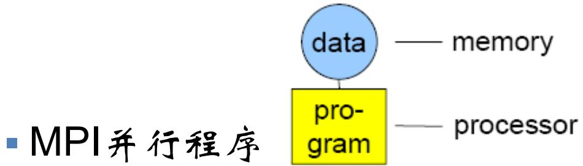

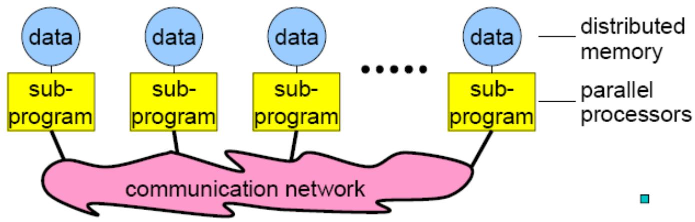

# MPI (Message passing interface)

MPI是一种标准或规范的代表，而不特指某一个对它的具体实现。 MPI同时也是一种消息传递编程模型，并成为这种编程模型的代表和事实上的标准。

迄今为止所有的并行计算机制造商都提供对MPI的支持，可以在网上免费得到MPI在不同并行计算机上的实现。

MPI的实现是一个库，而不是一门语言。

- 可以把FORTRAN+MPI或 $C { + } M P$ 看作是一种在原来串行语言基础之上扩展后得到的并行语言。

# MPI程序示例: Hello World!

# Fortran

```txt
PROGRAM hello  
INCLUDE 'mpif.h'  
INTEGER err  
CALL MPI_INIT(err)  
PRINT *, "hello world!"  
CALL MPI_FINALIZE(err)  
END 
```

C   
#include<stdio.h>   
#include<mpi.h>   
void main (int argc, char \* argv[])   
{ int err; err $=$ MPI_Init(&argc,&argv); printf("Hello world!\n”）; err $=$ MPI_Final();   
}

# MPI程序的执行

SPMD: Single Program Multiple Data(MIMD)


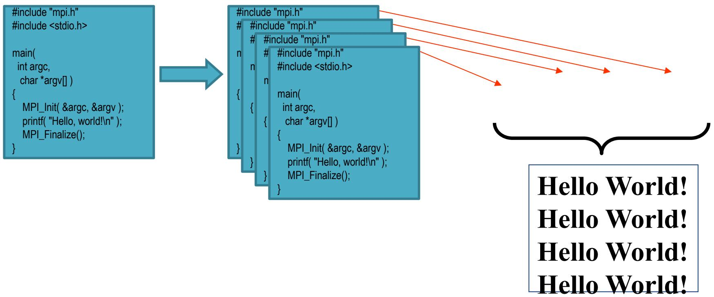

# MPI程序结构

MPI include file

Declarations,prototypes,etc.

Program Begins

Serial code

Initialize MPI environment

Parallel codebegins

Do work and make message passing calls

Terminate MPI Environment

Parallel codeends

Serial code

Program Ends

# MPI 的六个基本接口

开始与结束

- MPI_INIT   
- MPI_FINALIZE

进程身份标识

- MPI_COMM_SIZE   
- MPI_COMM_RANK

发送与接收消息

- MPI_SEND   
- MPI_RECV

# MPI 程序的开始与结束

MPI代码开始之前必须进行如下调用：

MPI_Init(&argc, &argv);

- MPI系统将通过argc,argv得到命令行参数

MPI代码的最后一行必须是：

MPI_Finalize();

- 如果没有此行，MPI程序将不会终止。

# MPI进程身份标识

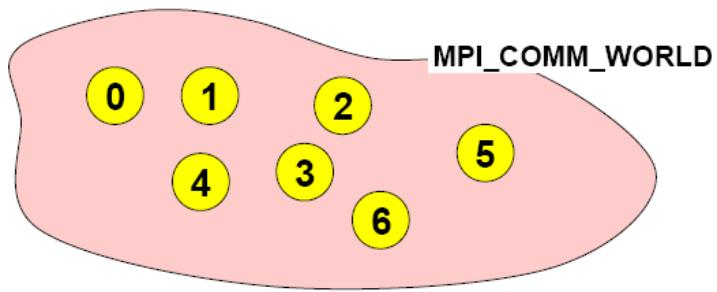

通信域

- 缺省的通信域为MPI_COMM_WORLD

§ MPI_Comm_size(MPI_COMM_WORLD, &size)   
. 获得缺省通信域内所有进程数目，赋值给size  
§ MPI_Comm_rank(MPI_COMM_WORLD, &myrank)   
- 获得进程在缺省通信域的编号，赋值给myrank

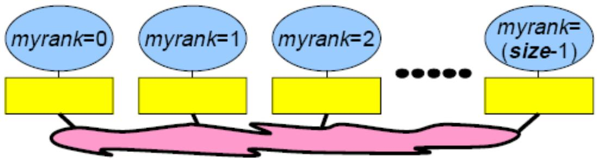

# 发送和接收消息


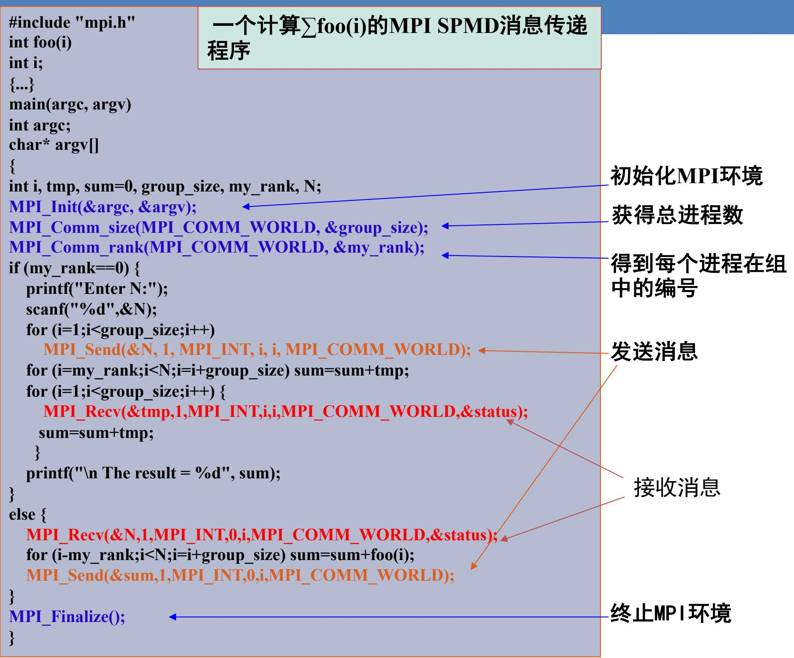

# 消息传递的过程

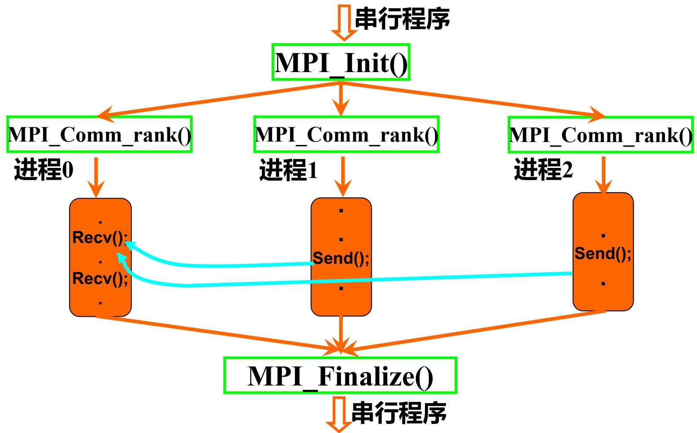

# Outline

- MPI概述  
- 点到点通信  
- 组通信  
- 阻塞通信模式

# 点到点通信

# § 对于某一消息

- 唯一发送进程  
- 唯一接收进程

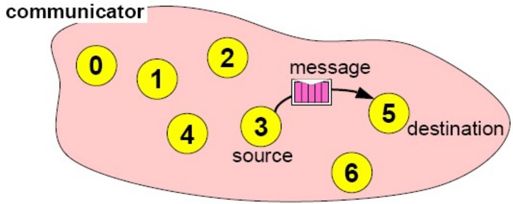

# MPI Send

# MPI_Send(buffer, count, datatype, destination, tag, communicator)

- MPI_Send(&N, 1, MPI_INT, i, i , MPI_COMM_WORLD);  
- 第一个参数指明消息缓存的起始地址，即存放要发送的数据信息。  
- 第二个参数指明消息中给定的数据类型有多少项，数据类型由第三个参数给定。  
- 数据类型要么是基本数据类型，要么是导出数据类型，后者由用户生成指定一个可能是由混合数据类型组成的非连续数据项。  
- 第四个参数是目的进程的标识符(进程编号)。  
- 第五个是消息标签。  
- 第六个参数标识进程组和上下文，即通信域。通常，消息只在同组的进程间传送。但是MPI允许通过intercommunicators在组间通信。

# MPI Receive

# MPI_Recv(address, count, datatype,source, tag, communicator, status)

MPI_Recv(&tmp, 1, MPI_INT, i, i, PI_COMM_WORLD,&Status)   
- 第一个参数指明接收消息缓冲的起始地址，即存放接收消息的内存地址。  
- 第二个参数指明给定数据类型可以被接收的最大项数。  
- 第三个参数指明接收的数据类型。  
- 第四个参数是源进程标识符 (编号)。  
- 第五个是消息标签。  
- 第六个参数标识一个通信域。  
- 第七个参数是一个指针, 指向一个结构：MPI_Status Status

- 存放有关接收消息的各种信息。(Status.MPI_SOURCE, Status.MPI_TAG)

- MPI_Get_count(&Status, MPI_INT, &C)读出实际接收到的数据项数。

# 消息的接收（系统缓存）

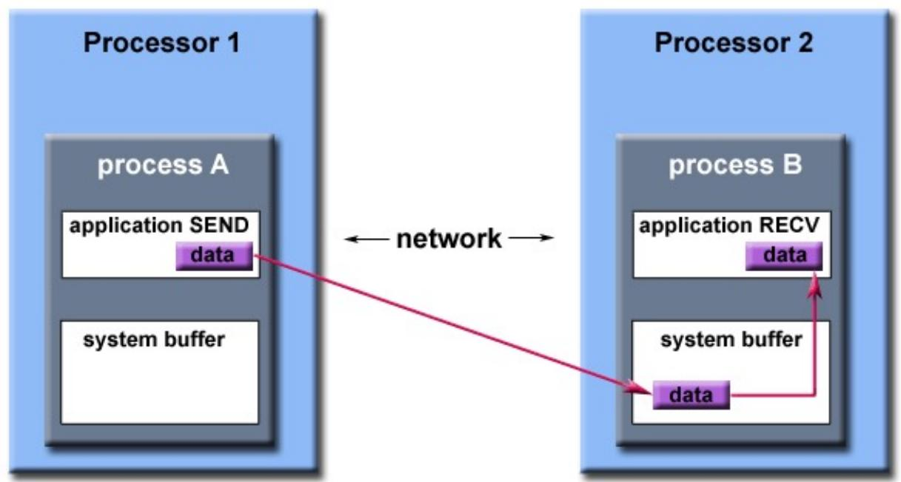  
Path of a message buffered at the receiving process

# 标签的使用

# 为什么要使用消息标签(Tag)?

这段代码需要传送A的前32个字节进入X，传送B的前16个字节进入Y。但是，如果消息B尽管后发送但先到达进程Q，就会被第一个recv()接收在X中。

使用标签可以避免这个错误。

# 未使用标签

Process P:

Process Q:

send(A,32,Q)

recv(X, 32, P)

send(B,16,Q)

recv(Y, 16, P)

# 使用了标签

Process P:

Process Q:

send(A,32,Q,tag1)

recv (X, 32, P, tag1)

send(B,16,Q,tag2)

recv (Y, 16, P, tag2)

# 标签的使用

Process P:

send (request1,32, Q)

Process R:

send (request2, 32, Q)

Process Q:

while (true) { recv (received_request, 32, Any_Process); process received_request; }

使用标签的另一个原因是可以简化对下列情形的处理。

假定有两个客户进程P和R，每个发送一个服务请求消息给服务进程Q。

Process P:

send(request1, 32, Q, tag1)

Process R:

send(request2, 32, Q, tag2)

Process Q:

while (true){ recv(received_request, 32, Any_Process, Any_Tag, Status); if (Status.Tag $\underbrace { \phantom { \left( i \alpha \mathcal { Q } - R e ^ { - 1 } \right) } } _ { \left. \phantom { \left( - i \alpha \mathcal { Q } \right) } \right. } =$ tag1) process received_request in one way; if (Status.Tag $\mathrm { = } \mathrm { = }$ tag2) process received_request in another way; }

# Outline

- MPI概述  
- 点到点通信  
组通信  
- 阻塞通信模式

# 组通信

一到多 (Broadcast, Scatter)  
多到一 (Reduce, Gather)  
多到多 (Allreduce, Allgather)  
同步 (Barrier)

# 广播 （Broadcast）

MPI_Bcast(Address, Count, Datatype, Root, Comm)

- 标号为Root的进程发送相同的消息给标记为Comm的通信子中的所有进程。  
消息的内容如同点对点通信一样由三元组(Address, Count, Datatype)标识。对Root进程来说，这个三元组既定义了发送缓冲也定义了接收缓冲。对其它进程来说，这个三元组只定义了接收缓冲。

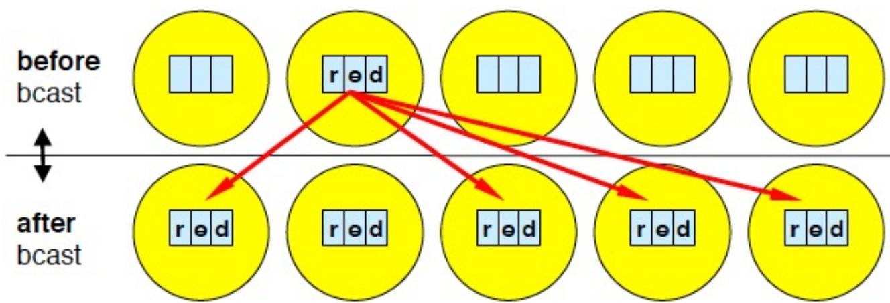

# MPI Bast

int argc;

char **argv;

int rank, value;

MPI_Init( &argc, &argv );

MPI_Comm_rank( MPI_COMM_WORLD, &rank );

if $( \mathrm { r a n k } = = 0 )$ /*进程0读入需要广播的数据*/

scanf( "%d", &value );

MPI_Bcast( &value, 1, MPI_INT, 0, MPI_COMM_WORLD );/*将该数据广播出去*/

printf( "Process $\% \mathrm { d }$ got $\% \mathrm { d u m } "$ , rank, value );/*各进程打印收到的数据*/

} while (value $\scriptstyle > = 0$ );

MPI_Finalize( );

return 0;

# Scatter

MPI_Scatter (SendAddress,SendCount,SendDatatype, RecvAddress,RecvCount,RecvDatatype,Root,Comm)

Root进程发送给所有n个进程各发送一个不同的消息，包括自已。  
这n个消息在Root进程的发送缓冲区中按标号的顺序有序地存放。每个接收缓冲由三元组(RecvAddress, RecvCount, RecvDatatype)标识。非Root进程忽略发送缓冲。  
- 对Root进程，发送缓冲由三元组(SendAddress, SendCount, SendDatatype)标识.

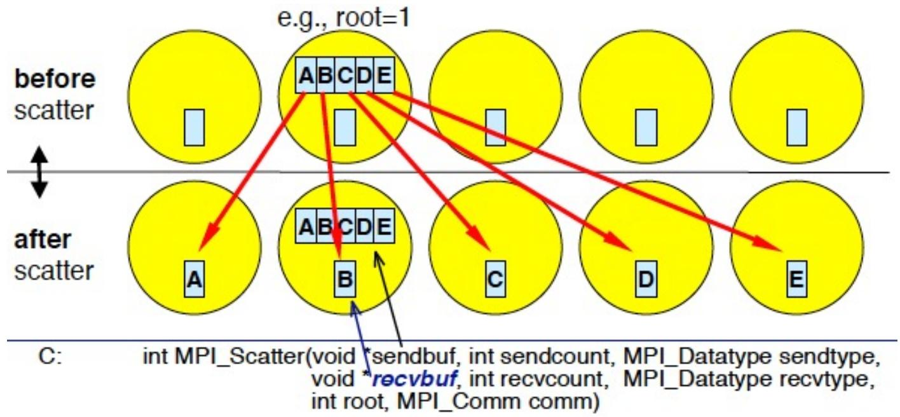

# MPI Scatter

§ 根进程向组内每个进程散播100个整型数据

```txt
MPI_Comm comm;  
int gsize,*sendbuf;  
int root,rbuf[100];
```

```c
MPI_Comm_size Comm, &gsize);   
sendbuf = (int *)malloc(gsize*100*sizeof(int)); 
```

```javascript
MPI_S Scattersendbuf, 100, MPI_INT, rbuf, 100, MPI_INT, root, comm); 
```

# MPI Scatterv

# § 根进程向各个进程发送个数不等的数据

MPI_SCAERV(sendbuf,sendcounts,displs,sendtype,recvbuf,recvcount,recvtyp,root, comm)

INsendbuf 发送消息缓冲区的起始地址(可选数据类型)

INsendcounts 发送数据的个数，整数数组 (整型)

INdispls 发送数据偏移，整数数组(整型)

INsendtype 发送消息缓冲区中元素类型(句柄)

OUTrecvbuf 接收消息缓冲区的起始地址(可变)

INrecvcount 接收消息缓冲区中数据的个数(整型)

INrecvtype 接收消息缓冲区中元素的类型(句柄)

INroot 发送进程的标识号(句柄)

IN comm 通信域(句柄)

int MPI_Scaterv(void*sendbuf,int *sendcounts, int *displs,MPI_Datatypesendtype void*recvbuf,int recvcount,MPI_Datatyperecvtype,introot, MPI_Comm comm)

# Gather

MPI_Gather (SendAddress,SendCount,SendDatatype, RecvAddress,RecvCount,RecvDatatype,Root,Comm)

Root进程接收各个进程(包括它自已)的消息。这n个消息的连接按序号rank进行，存放在Root进程的接收缓冲中。  
- 每个发送缓冲由三元组(SendAddress, SendCount, SendDatatype) 标识。  
非Root进程忽略接收缓冲。对Root进程，发送缓冲由三元组(RecvAddress, RecvCount,RecvDatatype)标识。RecvCount是自每个进程接收数据个数。

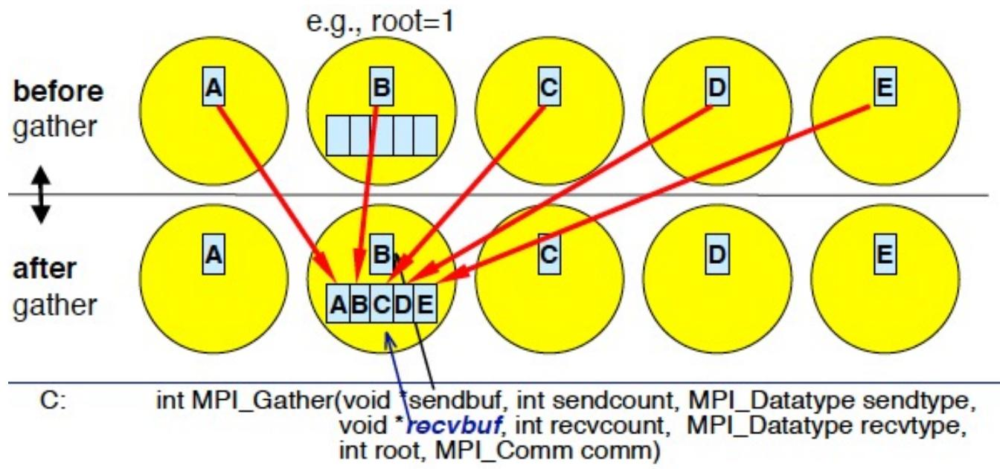

# MPI Gather

§ 自进程组中每个进程收集100个整型数给根进程

```txt
MPI_Comm comm;  
int gsize, sendarray[100];  
int root,*rbuf;
```

```c
MPI_Comm_size Comm, & gsize);  
rbuf = (int *) malloc(gsize * 100 * sizeof(int));  
MPI_GatherSendarray, 100, MPI_INT, rbuf 
```

# MPI Gatherv

# 从不同进程接收不同数量的数据

```txt
MPI_GATHERVsendbuf, sendcount, sendtype, recvbuf, recvcounts, displs, recvtype, root, comm) 
```

IN sendbuf 发送消息缓冲区的起始地址(可选数据类型)

IN sendcount 发送消息缓冲区中的数据个数(整型)

IN sendtype 发送消息缓冲区中的数据类型(句柄)

OUT recvbuf 接收消息缓冲区的起始地址(可选数据类型仅对于根进程有意义)

IN recvcounts 整型数组(长度为组的大小)，其值为从每个进程接收的数据个数

IN displs 整数数组每个入口表示相对于recvbuf的位移

IN recvtype 接收消息缓冲区中数据类型 (句柄)

IN root 接收进程的标识号(句柄)

IN comm 通信域(句柄)

intMPI_Gatherv(void* sendbuf,int sendcount,MPI_Datatype sendtype,void*recvbuf, int*recvcounts,int*displs,MPI_atatyperecvtype,introot,PCommcomm)

# Allgather

MPI_Allgather ( SendAddress, SendCount, SendDatatype, RecvAddress, RecvCount, RecvDatatype, Comm

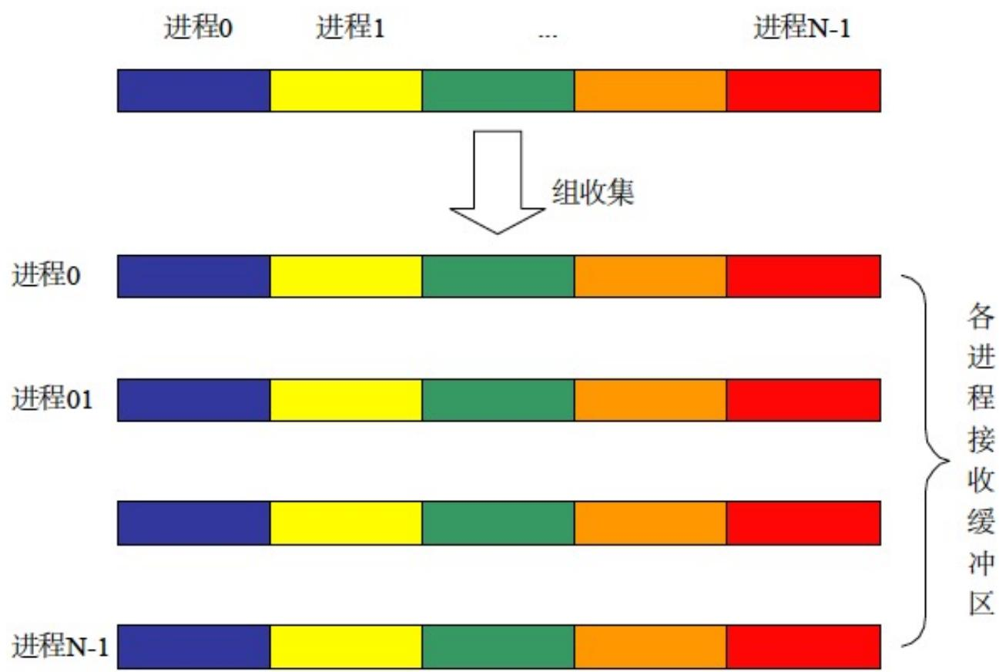  
各进程发送缓冲区中的数据

# MPI _Allgather

每个进程都从其他进程收集100个数据，存入自己的缓冲区内

MPI_Comm comm;int gsize,sendarray[100];int *rbuf;

MPI_Comm_size(comm, &gsize); rbuf $=$ (int *)malloc(gsize*100*sizeof(int));

MPI_Allgather(sendarray, 100, MPI_INT, rbuf, 100, MPI_INT, comm);

# 归约 （Reduce）

所有进程向同一进程发送消息，与broadcast的消息发送方向相反。  
接收进程对所有收到的消息进行归约处理。  
归约操作：

- MAX, MIN, SUM, PROD, LAND, BAND, LOR, BOR, LXOR, BXOR, MAXLOC, MINLOC

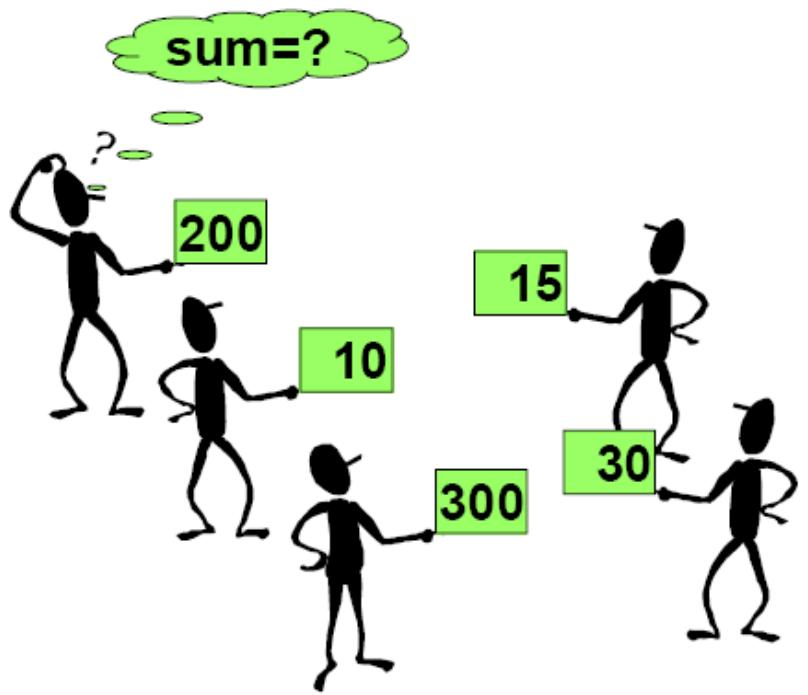

# MPI_Reduce

MPI_REDUCE(inbuf,result,count,datatype,op,root,comm)

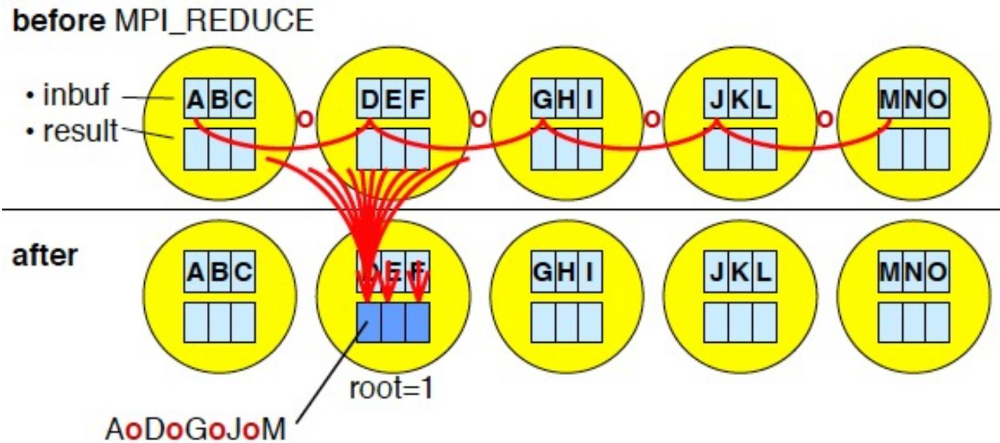

# MPI _Allreduce

语法与reduce类似，但无root参数  
所有进程都将获得结果

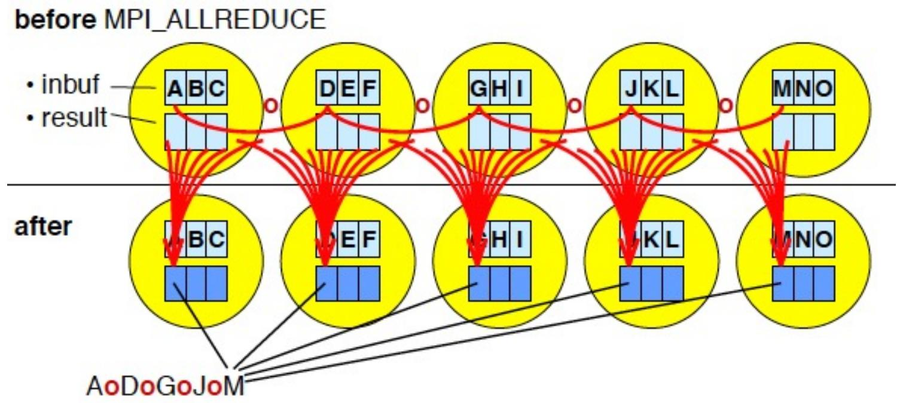

# MPI Reduce scatter

# § 将归约结果散播到所有进程中

MPI_REDUCE_SCATTER(sendbuf,recvbuf, recvcounts,datatype,op,comm)

IN sendbuf

发送消息缓冲区的起始地址(可选数据类型)

OUT recvbuf

接收消息缓冲区的起始地址(可选数据类型)

IN recvcounts

接收数据个数（整型数组）

IN datatype

发送缓冲区中的数据类型(句柄)

IN op

操作(句柄)

IN comm

通信域(句柄)

intMPI_Reduce_scatter(void* sendbuf,void* recvbuf,int *recvcounts

MPI_Datatype datatype,MPI_Opop,MPI_Commcomm)

# MPI Reduce scatter

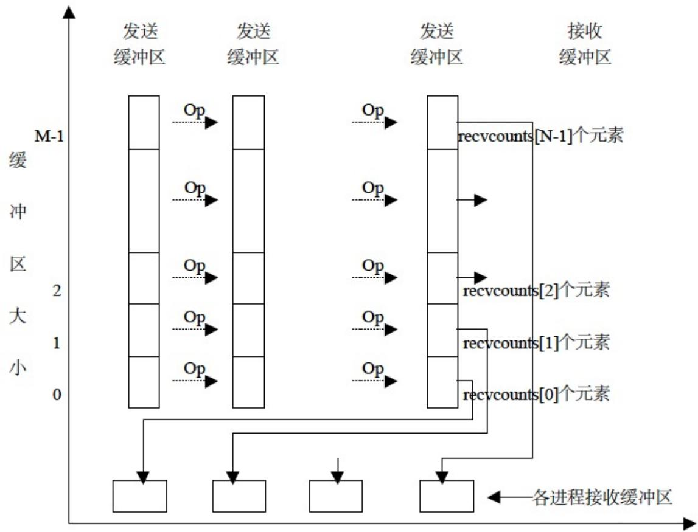

进程0

进程1

进程N-1

# MPI Scan

§ 每一个进程都对排在它前面的进程进行归约操作。  
§MPI_SCAN调用的结果是，对于每一个进程i，它对进程0,...,i的发送缓冲区的数据进行指定的归约操作，结果存入进程i的接收缓冲区。

MPI_SCAN(sendbuf, recvbuf,count,datatype,op,comm)

IN sendbuf 发送消息缓冲区的起始地址(可选数据类型)

OUTrecvbuf 接收消息缓冲区的起始地址（可选数据类型)

IN count 输入缓冲区中元素的个数(整型)

IN datatype 输入缓冲区中元素的类型(句柄)

IN op 操作(句柄)

IN comm 通信域(句柄)

int MPI_Scan(void* sendbuf, void* recvbuf, int count,MPI_Datatype datatype,MPI_Op op,MPI_Comm comm)

# 不同类型的归约操作对比

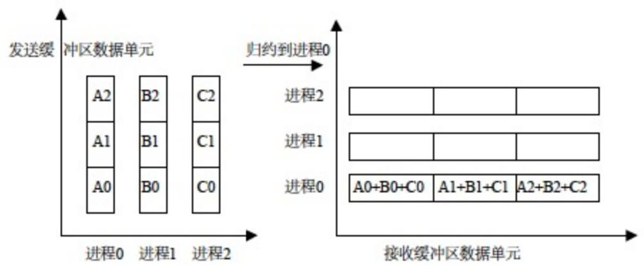  
Reduce

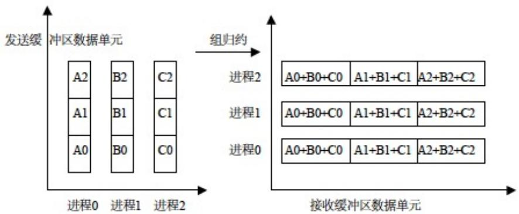  
Allreduce

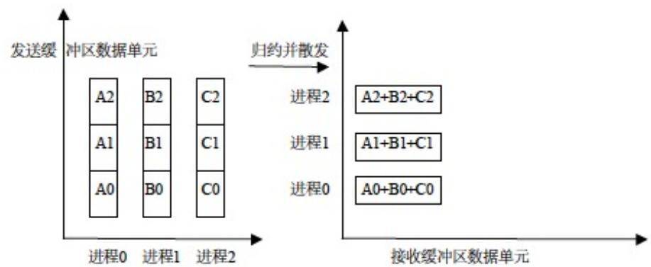  
Reduce_scatter

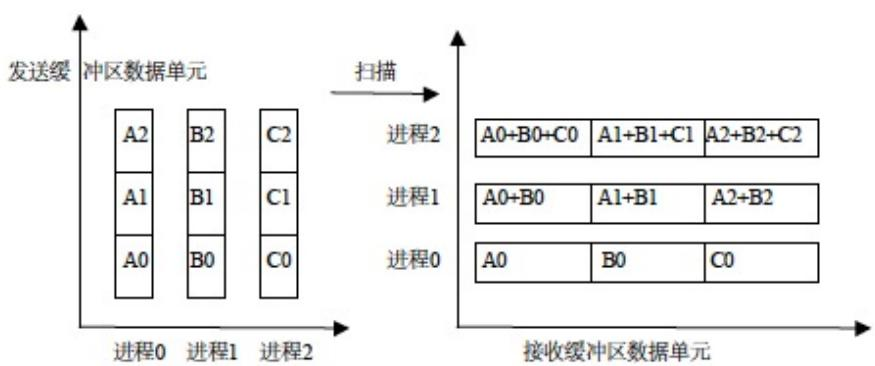  
Scan

# MPI Alltoall

MPI_Alltoall(void* sendbuf, int sendcount, MPI_Datatype sendtype, void* recvbuf, int recvcount, MPI_Datatype recvtype, MPI_Comm comm)

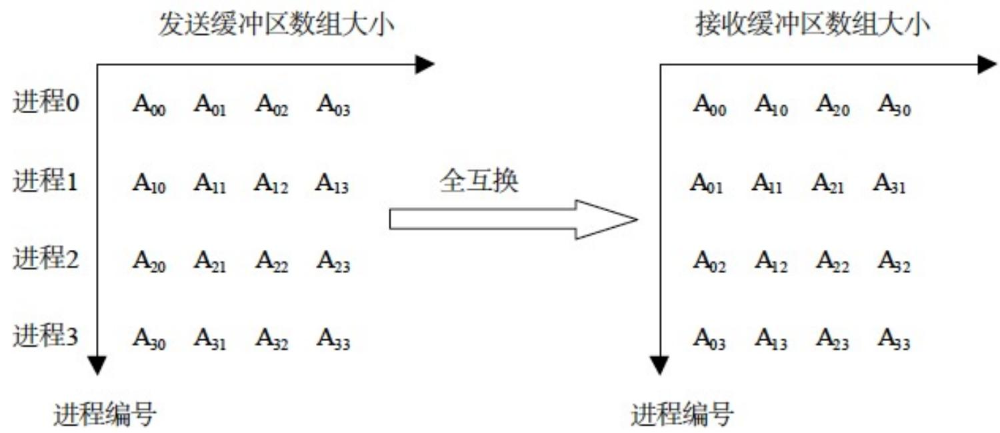

每个进程依次将它的发送缓冲区的第i块数据发送给第i个进程，同时每个进程又都依次从第j个进程接收数据放到各自接收缓冲区的第j块数据区的位置

# MPI Barrier


# MPI Barrier

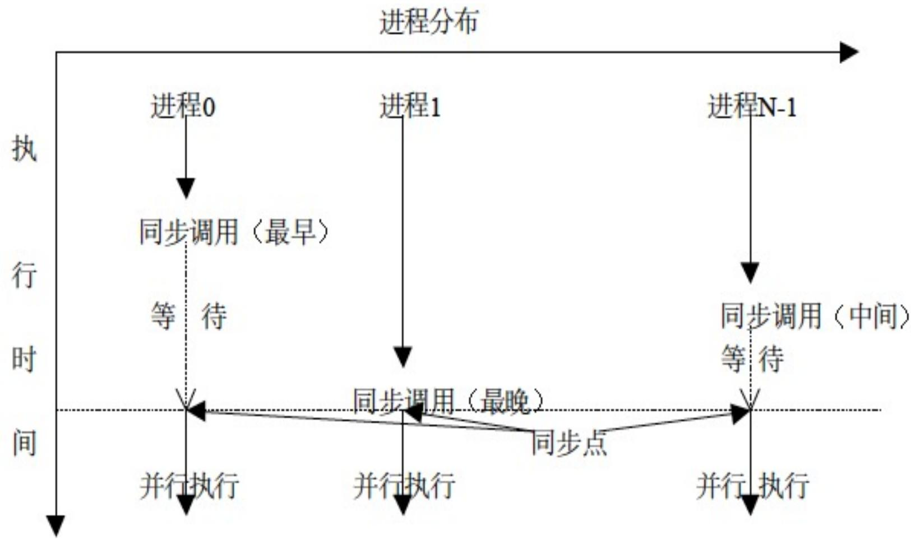

# Outline

- MPI概述  
- 点到点通信  
- 组通信  
- 阻塞通信模式

# 阻塞通信模式

§ 标准通信模式  
§ 缓存通信模式  
同步通信模式  
就绪通信模式

# 标准通信模式

MPI_Send   
在MPI采用标准通信模式时，是否对发送的数据进行缓存是由MPI自身决定的，而不是由并行程序员来控制。  
如果MPI决定缓存将要发出的数据，发送操作不管接收操作是否执行，都可以进行，而且发送操作可以正确返回，而不要求接收操作收到发送的数据。

# 标准通信模式

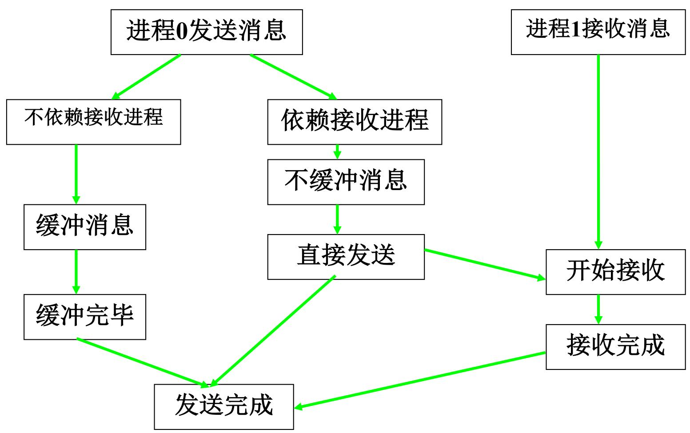

# 不缓存发送

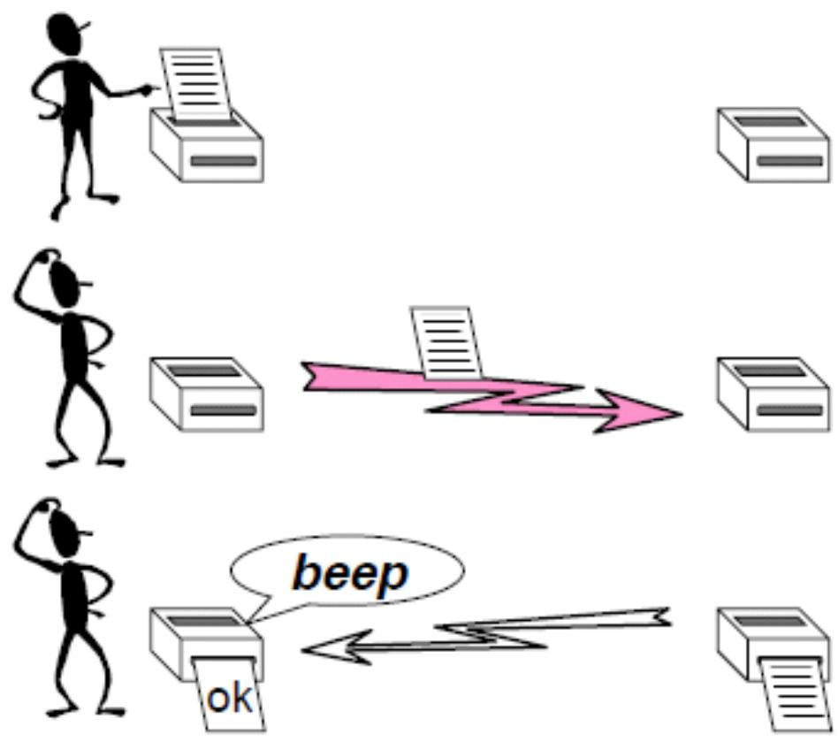

# 不缓存发送

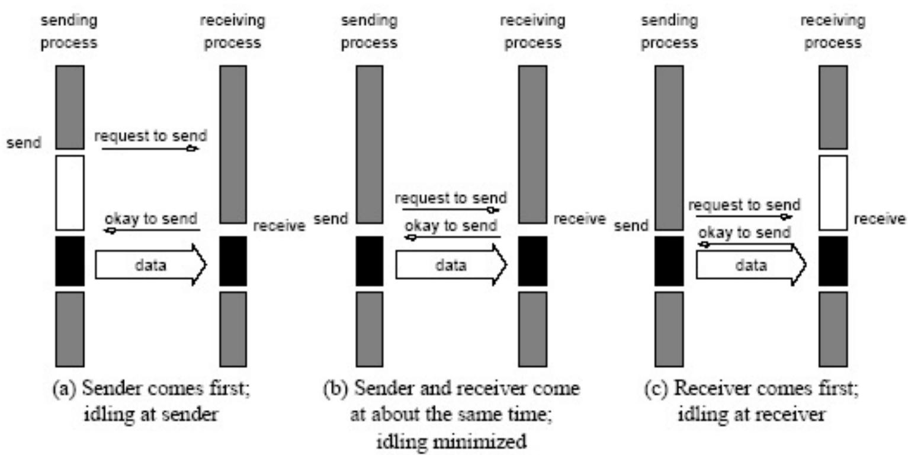

# 缓存发送


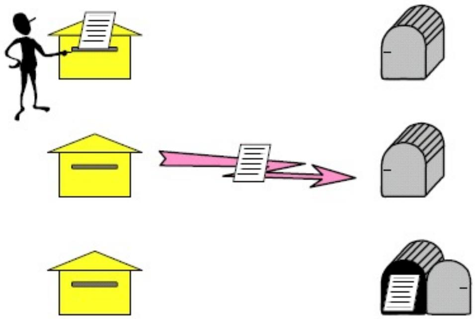

# 缓存发送

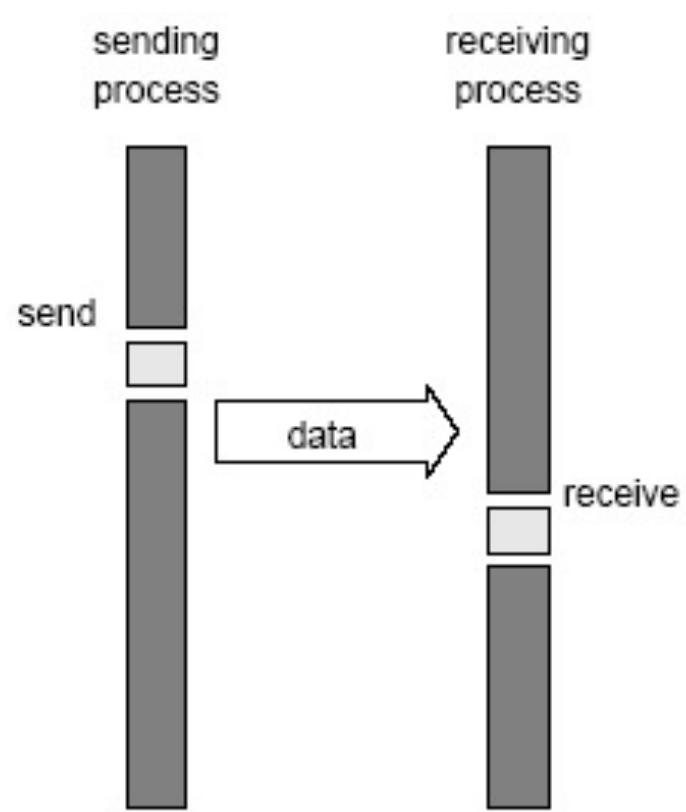  
使用系统缓存

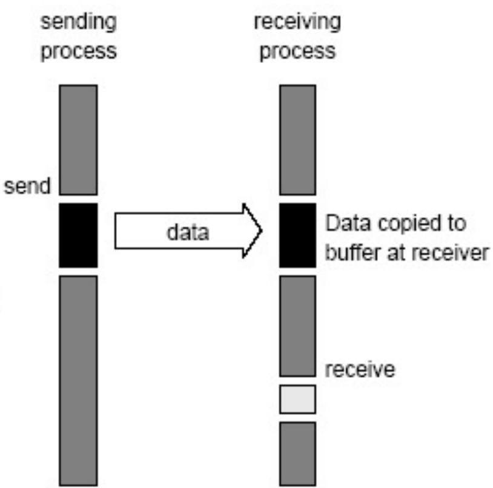  
不使用系统缓存

# 进程间通信的组织

```txt
中
```

```txt
MPI_Comm_dup (MPI_COMM_WORLD, &comm); 
```

```txt
If ( myid==0) { 
```

```javascript
MPI_Recv(bufA0,1,MPI_Float,1,101,comm,{status}); 
```

```javascript
MPI_Send(bufB0,1,MPI_Float,1,100,comm);} 
```

```txt
else if (myid==1){ 
```

```javascript
MPI_Recv(bufA1,1,MPI_Float,0,100,comm,{status}); 
```

```javascript
MPI_Send(bufB1,1,MPI_Float,0,101,comm);} 
```

```txt
· 
```

# 进程间通信的组织

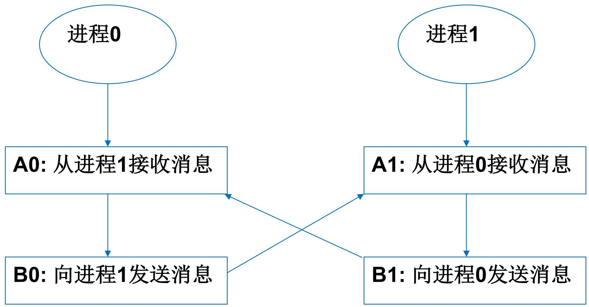

# 进程间通信的组织

```txt
· 
```

```txt
MPI_Comm_dup (MPI_COMM_WORLD, &comm); If (myid==0) { 
```

```javascript
MPI_Recv(bufA0,1,MPI_101,101,comm.status); MPI_Send(bufB0,1,MPI_101,100,comm);} 
```

```txt
else if (myid==1){ 
```

```txt
MPI_Recv(bufA1,1,MPI_Stat0,100,comm,{status}; MPI_Send(bufB1,1,MPI_Stat0,101,comm);} 
```

# 死锁的避免

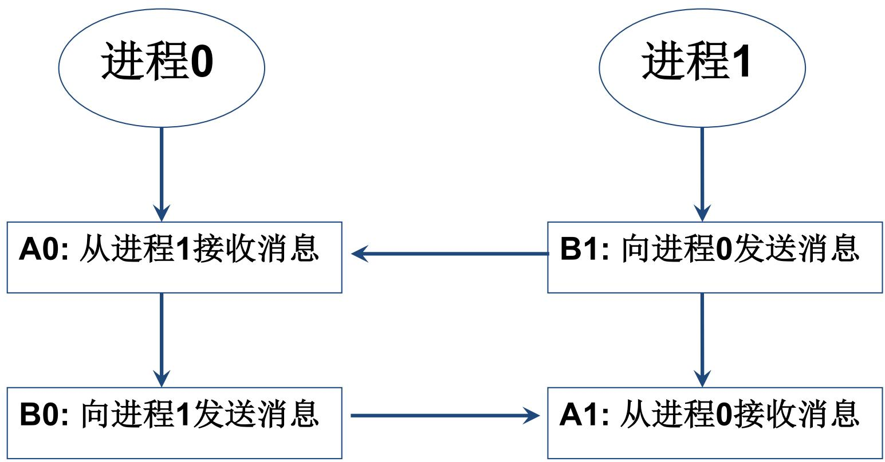

# 上例的修改

```javascript
If (myid==0) { 
```

```javascript
MPI_Recv(bufA0,1,MPI_Float,1,101, comm, status); MPI_Send(bufB0,1,MPI_Float,1,100, comm);} else if (myid==1){ 
```

```txt
MPI_Send(bufB1,1,MPI_Float,0,101,comm);}  
MPI_Recv(bufA1,1,MPI_Float,0,100,comm,status); 
```

# 缓存通信模式

# MPI Bsend

§ 由用户直接对通信缓冲区进行申请、使用和释放。  
缓存模式下对通信缓冲区的合理与正确使用由程序设计人员自己保证。

MPI_BSEND参数的含义和MPI_SEND的完全相同，不同之处仅表现在通信时是使用标准的系统提供的缓冲区还是用户自己提供的缓冲区。

# 缓存通信模式

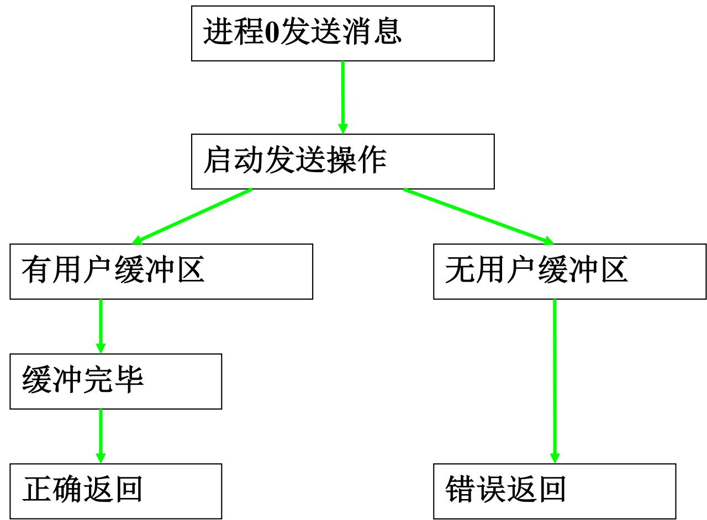

# 缓存通信模式

# MPI BUFFER ATTACH

将大小为size的缓冲区递交给MPI， 这样该缓冲区就可以作为缓存发送时的缓存来使用。

# MPI_BUFFER DETACH

将提交的大小为size的缓冲区buffer收回。  
§ 该调用是阻塞调用它一直等到使用该缓存的消息发送完成后才返回，这一调用返回后用户可以重新使用该缓冲区，或者将这一缓冲区释放。

# 同步通信模式

# MPI Ssend

同步通信模式的开始不依赖于接收进程相应的接收操作是否已经启动，但是同步发送必须等到相应的接收进程开始后才可以正确返回。  
同步发送返回后，意味着发送缓冲区中的数据已经全部被系统缓冲区缓存并且已经开始发送。  
§ 当同步发送返回后发送缓冲区可以被释放或重新使用。

# 同步通信模式

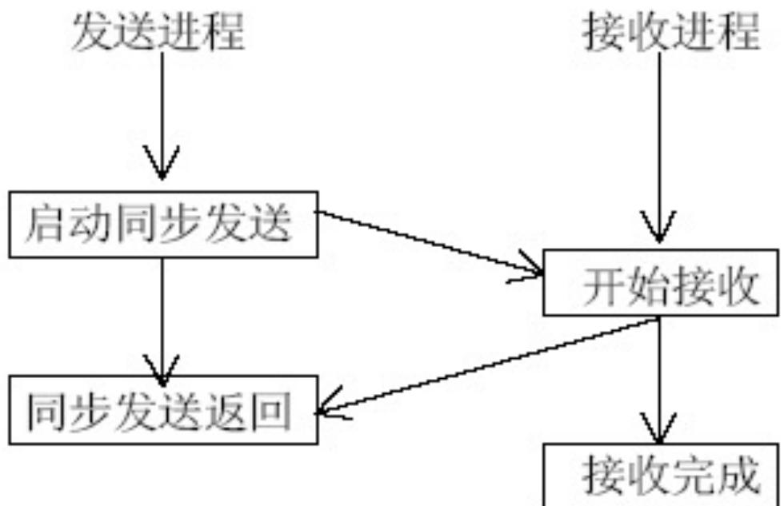

# 就绪通信模式

# MPI _Rsend

只有当接收进程的接收操作已经启动时，才可以在发送进程启动发送操作，否则，当发送操作启动而相应的接收还没有启动时，发送操作将出错。  
对于非阻塞发送操作的正确返回，并不意味着发送已完成；但对于阻塞发送的正确返回，则发送缓冲区可以重复使用。

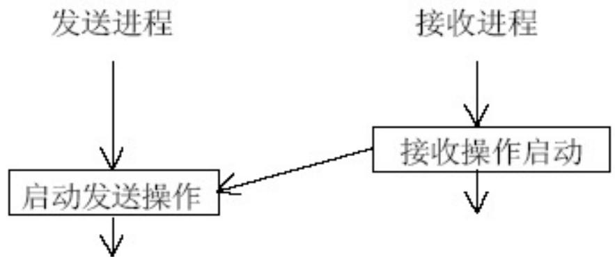

# 就绪通信模式

# 一种安全的就绪通信模式

进程0

进程1

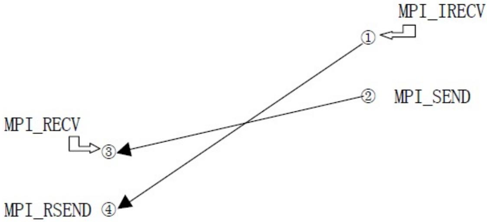

时间