# MPI进阶

汤善江副教授

天津大学智能与计算学部

tashj@tju.edu.cn

http://cic.tju.edu.cn/faculty/tangshanjiang/

# Outline

非阻塞通信  
- MPI_Sendrecv和虚进程  
自定义数据类型  
- 虚拟进程拓扑

# Outline

·非阻塞通信   
- MPI_Sendrecv和虚进程  
自定义数据类型  
- 虚拟进程拓扑

# 非阻塞通信

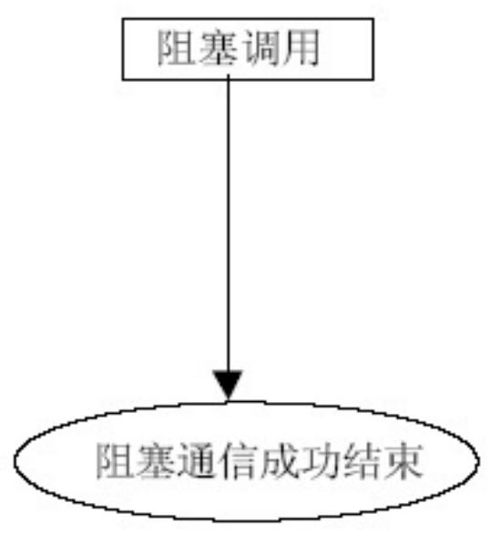

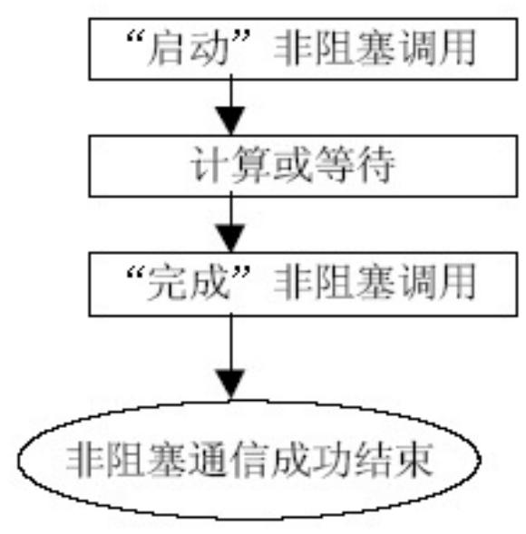

# 非阻塞操作

Non-blocking send

MPI_Isend(...)

doing some other work

MPI_Wait(…)


Non-blocking receive

MPI_Recv(...)

doing some other work

MPI_Wait(...)


1

# 非阻塞标准发送和接收

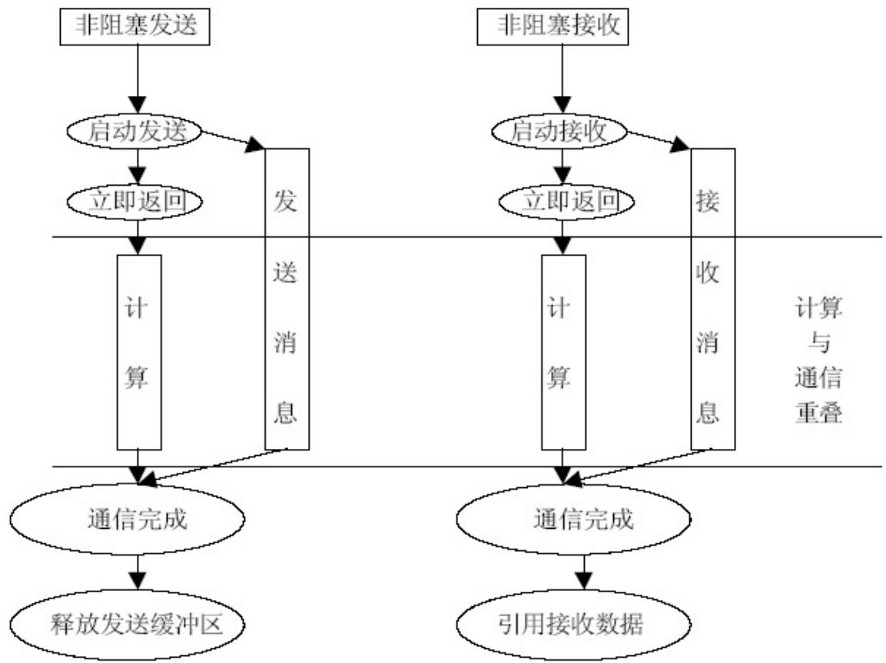

# MPI_Isend

- int MPI_Isend(void* buf, int count, MPI_Datatype datatype, int dest, int tag, MPI_Comm comm, MPI_Request *request)   
- MPI_Request: 非阻塞通信对象

- MPI内部的对象，通过一个句柄存取。  
- 识别非阻塞通信操作的各种特性

- 发送模式  
- 和它联结的通信缓冲区  
通信上下文  
- 用于发送的标识和目的参数  
- 用于接收的标识和源参数

# 非阻塞通信与其它三种通信模式的组合

- 对于阻塞通信的四种消息通信模式：标准通信模式，缓存通信模式，同步通信模式和接收就绪通信模式，非阻塞通信也具有相应的四种不同模式。  
- MPI使用与阻塞通信一样的命名约定，前缀B、S、R分别表示缓存通信模式、同步通信模式和就绪通信模式。  
- 前缀l(immediate)表示这个调用是非阻塞的。

# 非阻塞MPI通信模式

<table><tr><td colspan="2">通信模式</td><td>发送</td><td>接收</td></tr><tr><td colspan="2">标准通信模式</td><td>MPI_ISEND</td><td>MPI_IRECV</td></tr><tr><td colspan="2">缓存通信模式</td><td>MPI_IBSEND</td><td></td></tr><tr><td colspan="2">同步通信模式</td><td>MPI_ISSEND</td><td></td></tr><tr><td colspan="2">就绪通信模式</td><td>MPI_IRSEND</td><td></td></tr><tr><td rowspan="4">重复非阻塞通信</td><td>标准通信模式</td><td>MPI_SEND_INIT</td><td>MPI_RECV_INIT</td></tr><tr><td>缓存通信模式</td><td>MPI_BSEND_INIT</td><td></td></tr><tr><td>同步通信模式</td><td>MPI_SSEND_INIT</td><td></td></tr><tr><td>就绪通信模式</td><td>MPI_RSEND_INIT</td><td></td></tr></table>

# 不同类型的发送与接收的匹配

<table><tr><td rowspan="4">阻塞发送</td><td>标准通信模式</td></tr><tr><td>缓存通信模式</td></tr><tr><td>同步通信模式</td></tr><tr><td>就绪通信模式</td></tr><tr><td rowspan="4">非阻塞发送</td><td>标准通信模式</td></tr><tr><td>缓存通信模式</td></tr><tr><td>同步通信模式</td></tr><tr><td>就绪通信模式</td></tr></table>

# 非阻塞通信的完成

对于非阻塞通信，通信调用的返回并不意味着通信的完成，因此需要专门的通信语句来完成或检查该非阻塞通信。  
不管非阻塞通信是什么样的形式，对于完成调用是不加区分的。  
当非阻塞完成调用结束后，就可以保证该非阻塞通信已经正确完成了。

# 非阻塞通信的完成与检测

<table><tr><td>非阻塞通信的数量</td><td>检测</td><td>完成</td></tr><tr><td>一个非阻塞通信</td><td>MPI_TEST</td><td>MPI_WAIT</td></tr><tr><td>任意一个非阻塞通信</td><td>MPI_TESTANY</td><td>MPI_WAITANY</td></tr><tr><td>一到多个非阻塞通信</td><td>MPI_TESTSOME</td><td>MPI_WAITSOME</td></tr><tr><td>所有非阻塞通信</td><td>MPI_TESTALL</td><td>MPI_WAITALL</td></tr></table>

# 单个非阻塞通信的完成

int MPI_Wait(MPI_Request *request, MPI_Status *status)   
- 阻塞，通信完成后才能够返回，释放对象  
- int MPI_Test(MPI_Request*request, int *flag, MPI_Status *status)   
- 非阻塞，直接返回状态结果。若返回false则不释放对象

# 多个非阻塞通信的完成 (1)

- int MPI_Waitany(int count,

MPI_Request *array_of_request,

int *index,

MPI_Status *status)

- MPI_WAITANY返回后index=i，即MPI_WAITANY完成的是非阻塞通信对象表中的第i个对象对应的非阻塞通信，则其效果等价于调用了

MPI_WAIT(array_of_request[i],status)

- int MPI_Testany (int count, MPI_Request

*array_of_request, int *index, int *flag, MPI_Status
*status)

# 多个非阻塞通信的完成 (2)

- int MPI_Waitall(int count,

MPI_Request *array_of_request, MPI_Status *array_of.statuses)

对象个数

对象数组

- int MPI_Testall (int count,

MPI_Request *array_of_request, int *flag,

对象个数

对象数组

MPI_Status *array_of statuses)

是否已经全部完成

# 多个非阻塞通信的完成 (3)

- int MPI_Waitsome(int incount, 对象个数

MPI_Request *array_of_request, 对象数组

int *outcount, 已完成对象的个数

int *array_ofIndices, 已完成对象下标数组

MPI_Status *array_of statuses)

- int MPI_Testsome (int incount, 对象个数

MPI_Request *array_of_request, 对象数组

int *outcount, 已完成对象的个数

int *array_of Indices, 已完成对象下标数组

MPI_Status *array_of statuses)

# MPI_Cancel

# 非阻塞通信的取消

- int MPI_Cancel(MPI_Request *request)   
- 如果一个非阻塞通信已经被执行了取消操作，则该通信的MPI_WAIT或MPI_TEST将释放取消通信的非阻塞通信对象，并且在返回结果status中指明该通信已经被取消。

• int MPI_Test_cancelled(MPI_Status status, int *flag)  
- 返回结果flag=true则表明该通信已经被成功取消，否则说明该通信还没有被取消。

# MPI_Request_free

# 非阻塞通信对象的释放

- int MPI_Request_free(MPI_Request * request)   
- 非阻塞通信操作完成，将该对象所占用的资源释放  
- request变为MPI_REQUEST_NULL   
- 执行了释放操作后，非阻塞通信对象就无法再通过其它任何的调用访问  
但如果与该非阻塞通信对象相联系的通信还没有完成,则该对象的资源并不会立即释放, 它将等到该非阻塞通信结束后再释放, 因此非阻塞通信对象的释放并不影响该非阻塞通信的完成

# 消息到达的检查

int MPI_Probe(int source, int tag, MPI_Comm comm, MPI_Status *status) 源进程标识（可任意源）标签值（可任意标签）  
- MPI_Probe是阻塞调用，检测到消息后才返回  
int MPI_lprobe(int source, int tag, MPI_Comm comm, int *flag, 是否有消息到达 MPI_Status *status)

# 重复非阻塞通信

通信重复执行，比如循环结构内的通信调用  
- 将通信参数和MPI的内部对象建立固定的联系，然后通过该对象完成重复通信的任务，并优化以降低开销  
这样的通信方式在MPI中都是非阻塞通信

1 通信的初始化，比如MPI_SEND_INIT  
2 启动通信，MPI_START   
3 完成通信，MPI_WAIT  
4 释放查询对象，MPI_REQUESTFREE

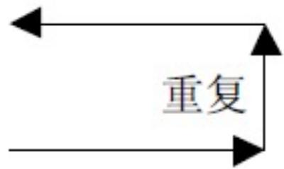

# 阻塞与非阻塞操作总结

# 阻塞操作

- 阻塞发送的返回，意味着发送缓冲区可被再次使用，而不会影响接收方，但并不意味接收方已经完成接收（有可能保存在系统缓冲区内）  
- 阻塞发送可以同步方式工作，发送方和接收方需要实施一个握手协议来确保发送动作的安全  
- 阻塞发送可以异步进行，此时需要系统缓冲区进行缓存  
- 阻塞接收操作仅当消息接收完成后才返回

# 阻塞与非阻塞操作总结

# 非阻塞操作

- 非阻塞的发送和接收，在调用后都可以立即返回，不会等待任何与通信相关的事件  
- 非阻塞只对MPI环境提出一个要求 - 在可能的时候启动通信。用户无法预测通信何时发生  
- 在通过某种手段确定MPI环境确实执行了通信之前，修改发送缓冲区的数据是不安全的  
- 非阻塞通信的主要目的是把计算和通信重叠起来，从而改进并行效率

# 死锁

Code in each MPI process: MPI_Ssend(..., right_rank, ...) MPI_Recv(..., left_rank, ...)

Will block and never return, because MPI_Recv cannot be called in the right-hand MPI process

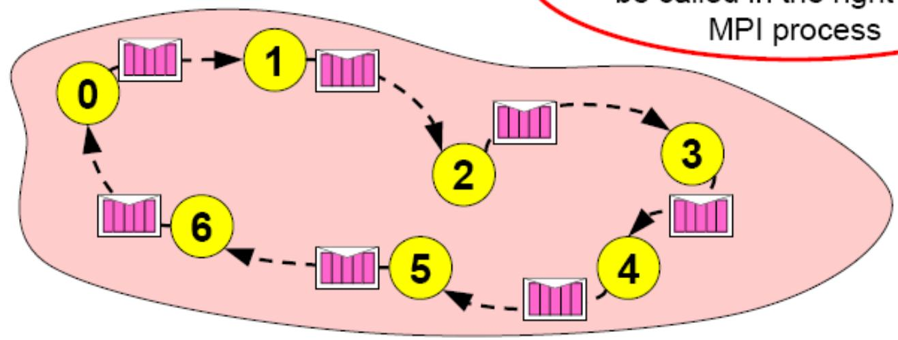

- Same problem with standard send mode (MPI_Send), if MPI implementation chooses synchronous protocol

# 非阻塞操作，避免死锁

使用非阻塞发送

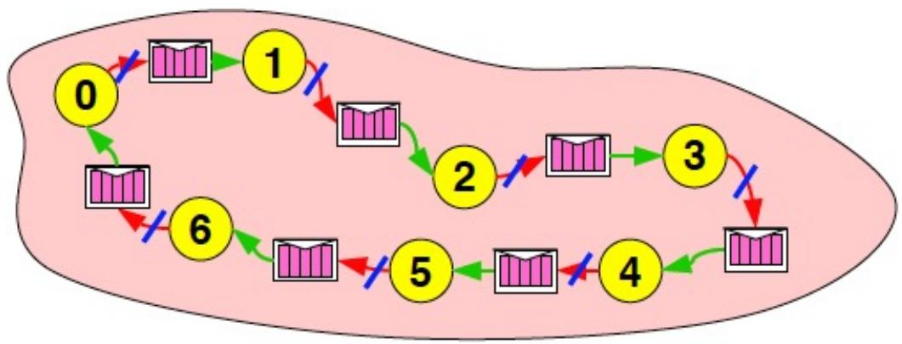

使用非阻塞接收

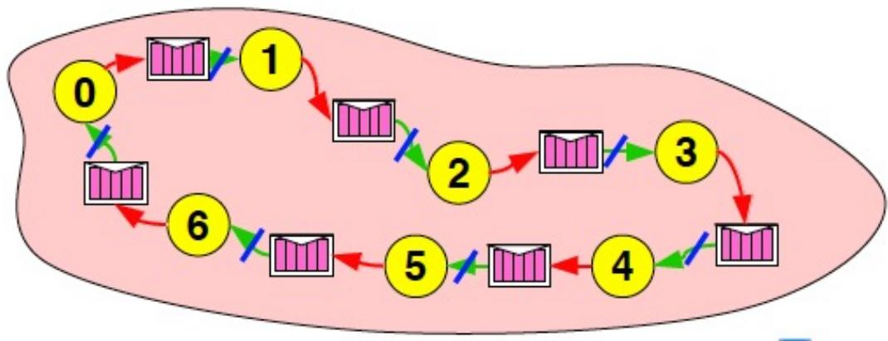

# Outline

非阻塞通信  
- MPI_Sendrecv和虚进程  
自定义数据类型  
- 虚拟进程拓扑

# 问题: Jacobi迭代

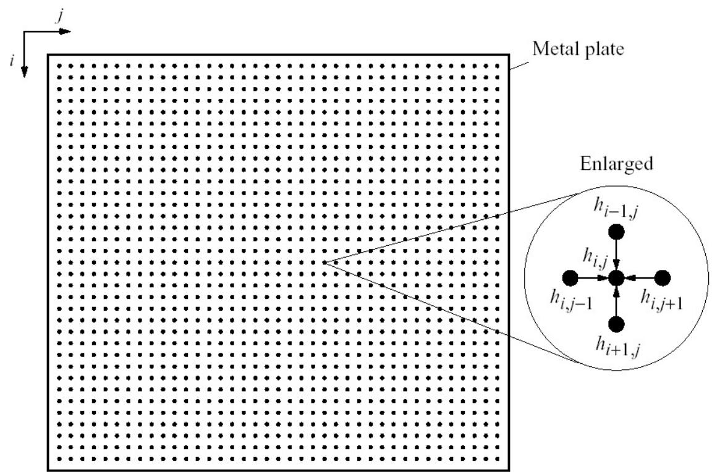

$$
h _ {i, j} = \frac {h _ {i - 1 , j} + h _ {i + 1 , j} + h _ {i , j - 1} + h _ {i , j + 1}}{4}
$$

# Jacobi迭代

# 伪代码描述：

$\ldots$ REAL A(N+1,N+1), B(N+1,N+1)

DO K=1,STEP

DO $J = 1,N$

DO I=1,N

[ \mathsf{B}(\mathsf{I},\mathsf{J}) = 0.25^{*}(\mathsf{A}(\mathsf{I} - 1,\mathsf{J}) + \mathsf{A}(\mathsf{I} + 1,\mathsf{J}) + \mathsf{A}(\mathsf{I},\mathsf{J} + 1) + \mathsf{A}(\mathsf{I},\mathsf{J} - 1)) ]

END DO

END DO

DO J=1,N

DO I=1,N

$\mathrm{A}(\mathrm{I}, \mathrm{J}) = \mathrm{B}(\mathrm{I}, \mathrm{J})$

END DO

END DO

# Jacobi迭代：数据划分

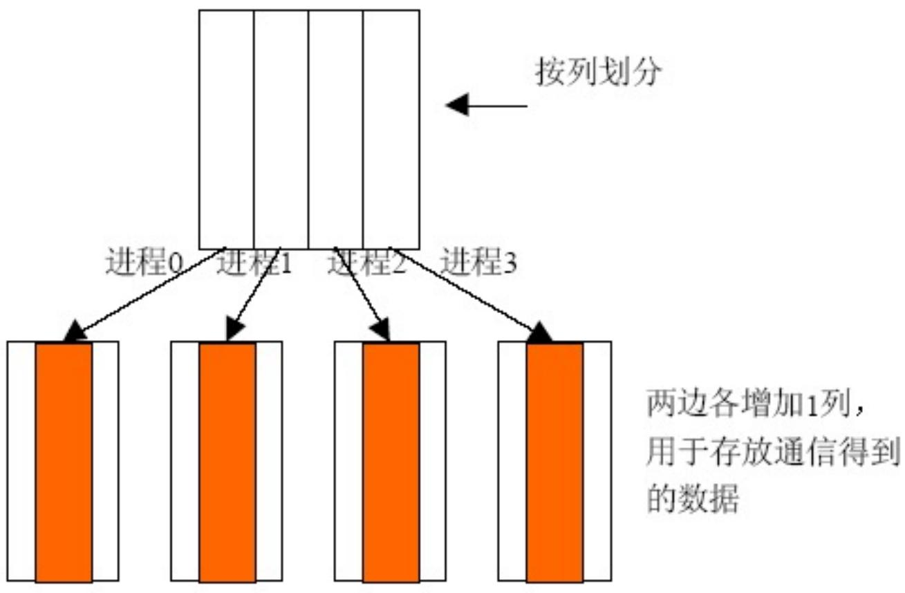

# Jacobi迭代：通信

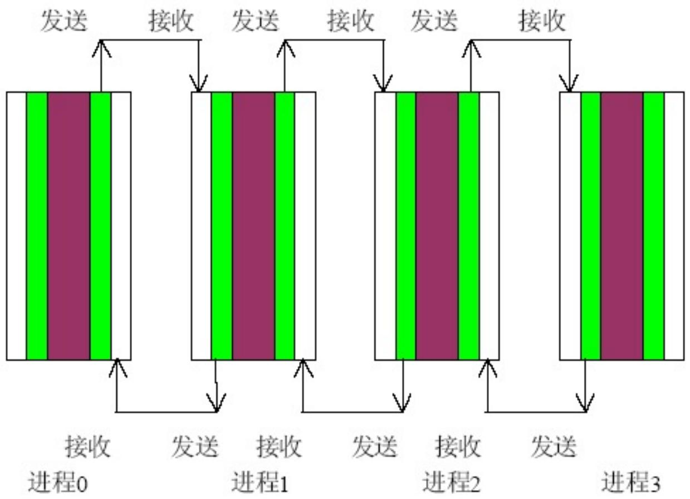

# MPI_Sendrecv (捆绑发送接收)

- Jacobi迭代中，每一个进程都要向相邻的进程发送数据，同时从相邻的进程接收数据。

- 潜在死锁，且算法逻辑复杂

- MPI提供了MPI_Sendrecv（捆绑发送和接收）操作，可以在一条MPI语句中同时实现向其它进程的数据发送和从其它进程接收数据操作。

# MPI_Sendrecv

- 把发送一个消息到一个目的地和从另一个进程接收一个消息合并到一个调用中，源和目的可以相同  
在语义上等同于一个发送操作和一个接收操作的结合  
- 但可以有效地避免由于单独书写发送或接收操作时，由于次序的错误而造成的死锁  
- 因为该操作由通信系统来实现，系统会优化通信次序从而有效地避免不合理的通信次序，最大限度避免死锁的产生

# MPI_Sendrecv

int MPI_Sendrecv(void *sendbuf,

int sendcount,

MPI_Datatype sendtype,

intdest,

int sendtag,

void *recvbuf,

int recvcount,

MPI_Datatype recvtype,

int source,

int recvtag,

MPI_Comm comm,

MPI_Status *status)

# MPI_Sendrecv

捆绑发送接收操作是不对称的，即一个由捆绑发送接收调用发出的消息可以被一个普通接收操作接收，一个捆绑发送接收调用可以接收一个普通发送操作发送的消息。  
该操作执行一个阻塞的发送和接收，接收和发送使用同一个通信域。  
发送缓冲区和接收缓冲区必须分开，可以是不同的数据长度和不同的数据类型。

# 用MPI_Sendrecv实现Jacobi迭代

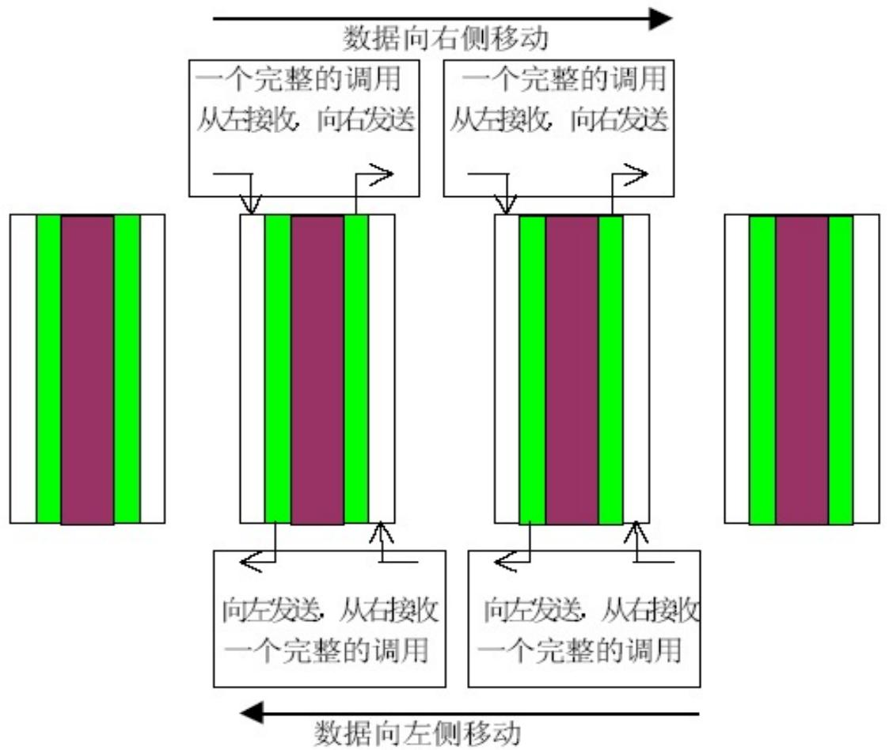

# 虚拟进程

虚拟进程

(MPI_PROC_null) 是不存在的假想进程，在MPI中的主要作用是充当真实进程通信的目或源。

引入虚拟进程的目的是为了在某些情况下编写通信语句的方便。  
当一个真实进程向一个虚拟进程发送数据或从一个虚拟进程接收数据时，该真实进程会立即正确返回，如同执行了一个空操作。

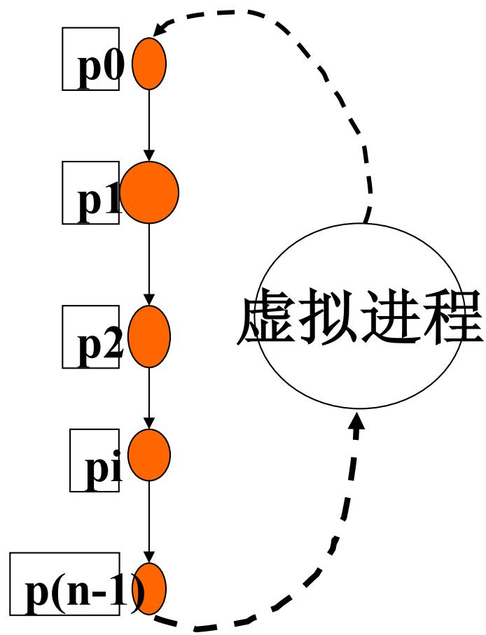

# 虚拟进程

- 一个真实进程向虚拟进程MPI_PROC_NULL发送消息时，会立即成功返回。  
一个真实进程从虚拟进程MPI_PROC_null的接收消息时，也会立即成功返回，并且对接收缓冲区没有任何改变。

# 使用MPI_Sendrecv和虚拟进程的数据交换

```c
if (myid > 0)  
    left = myid - 1;  
else  
    left = MPI_PROC_NULL;  
if (myid < n-1)  
    right = myid + 1;  
else  
    right = MPI_PROC_NULL; 
```

//从左向右平移数据

```txt
MPI_Sendrecv ( sendData1, sendCount, MPI FLOAT, right, tag1, recvData1, recvCount, MPI_FLOAT, left, tag1, MPICOMM_WORLD, status) 
```

//从右向左平移数据

```autohotkey
MPI_Sendrecv (sendData2, sendCount, MPI_FLOAT, left, tag1, recvData2, recvCount, MPI_FLOAT, right, tag1, MPICOMM_WORLD, status) 
```

# Outline

非阻塞通信  
- MPI_Sendrecv和虚进程  
自定义数据类型  
- 虚拟进程拓扑

# MPI基本数据类型

<table><tr><td>MPI Datatype</td><td>C datatype</td></tr><tr><td>MPI_CHAR</td><td>signed char</td></tr><tr><td>MPI SHORT</td><td>signed short int</td></tr><tr><td>MPI_INT</td><td>signed int</td></tr><tr><td>MPI LONG</td><td>signed long int</td></tr><tr><td>MPI_UNSIGNED_CHAR</td><td>unsigned char</td></tr><tr><td>MPI_UNSIGNED SHORT</td><td>unsigned short int</td></tr><tr><td>MPI_UNSIGNED</td><td>unsigned int</td></tr><tr><td>MPI_UNSIGNED LONG</td><td>unsigned long int</td></tr><tr><td>MPI_FLOAT</td><td>float</td></tr><tr><td>MPI Double</td><td>double</td></tr><tr><td>MPI LONG DOUBLE</td><td>long double</td></tr><tr><td>MPI_BYTE</td><td></td></tr><tr><td>MPI PACKED</td><td></td></tr></table>

# 自定义数据类型

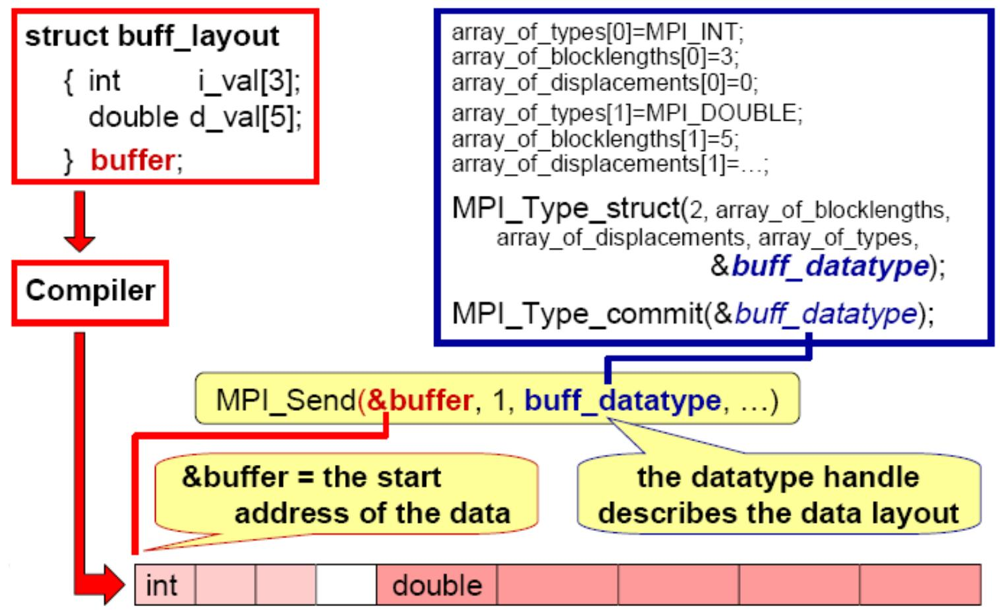

# 自定义数据类型：连续数据


C: intMPI_TYPE_contiguous(int count, MPI_Datatype oldtype, MPI_Datatype *newtype)   
- Fortran: MPI_TYPE_CONTIGUOUS(COUNT, OLdtype, NEWTYPE, IERROR)  
    INTEGER COUNT, OLdtype  
    INTEGER NEWTYPE, IERROR

# 自定义数据类型：向量

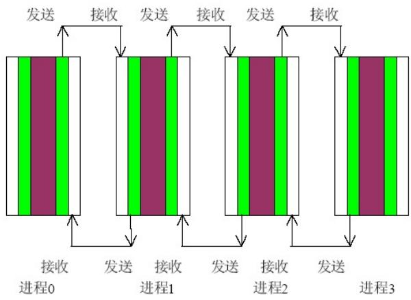

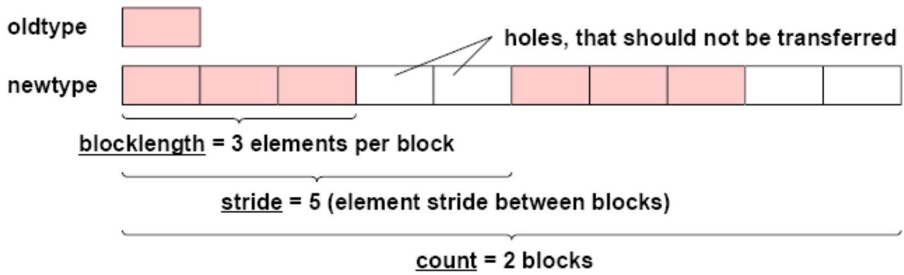

C: int MPI_Type_vector(int count, int blocklength, int stride, MPI_Datatype oldtype, MPI_Datatype *newtype)   
- Fortran: MPI_TYPE_VECTOR(COUNT, BLOCKLENGTH, STRIDE, OLdtype, NEWTYPE, IERROR)  
    INTEGER COUNT, BLOCKLENGTH, STRIDE  
    INTEGER OLdtype, NEWTYPE, IERROR

# 自定义数据类型：结构体

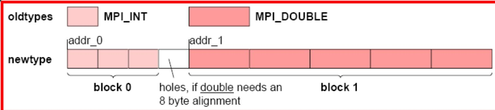

C: intMPI_TYPE_struct(int count, int *array_of_blocklengths, MPI_Aint *array_of_displacements, MPI_Datatype *array_of_types, MPI_Datatype *newtype)   
- Fortran: MPI_TYPESTRUCT(COUNT, ARRAY_OF_BLOCKLENGTHS, ARRAY_OF_DISPLACEMENTS, ARRAY_OF_types, NEWTYPE, IERROR)

# Outline

非阻塞通信  
- MPI_Sendrecv和虚进程  
自定义数据类型  
- 虚拟进程拓扑

# 虚拟进程拓扑

- 在许多并行应用程序中，进程的线性排列不能充分地反映进程间在逻辑上的通信模型（通常由问题几何和所用的算法决定）。  
- 进程经常被排列成二维或三维网格形式的拓扑模型，而且通常用一个图来描述逻辑进程排列。  
- 这种逻辑进程排列称为虚拟拓扑。

# 虚拟进程拓扑

- 拓扑是组内通信域上的额外、可选的属性，它不能附加在组间通信域(inter-communicator)上。  
- 便于命名。拓扑能够提供一种方便的命名机制，对于有特定拓扑要求的算法使用起来直接、自然而方便。  
- 简化代码编写。  
- 拓扑还可以辅助运行时系统将进程映射到实际的硬件结构之上。  
- 便于MPI内部对通信进行优化。

# 虚拟进程拓扑

# 笛卡儿拓扑

- 每个进程处于一个虚拟的网格内，与其邻居通信  
- 边界可以构成环   
通过笛卡尔坐标来标识进程  
- 任何两个进程也可以通信

# 图拓扑

- 适用于复杂通信形

# 二维阵列拓扑

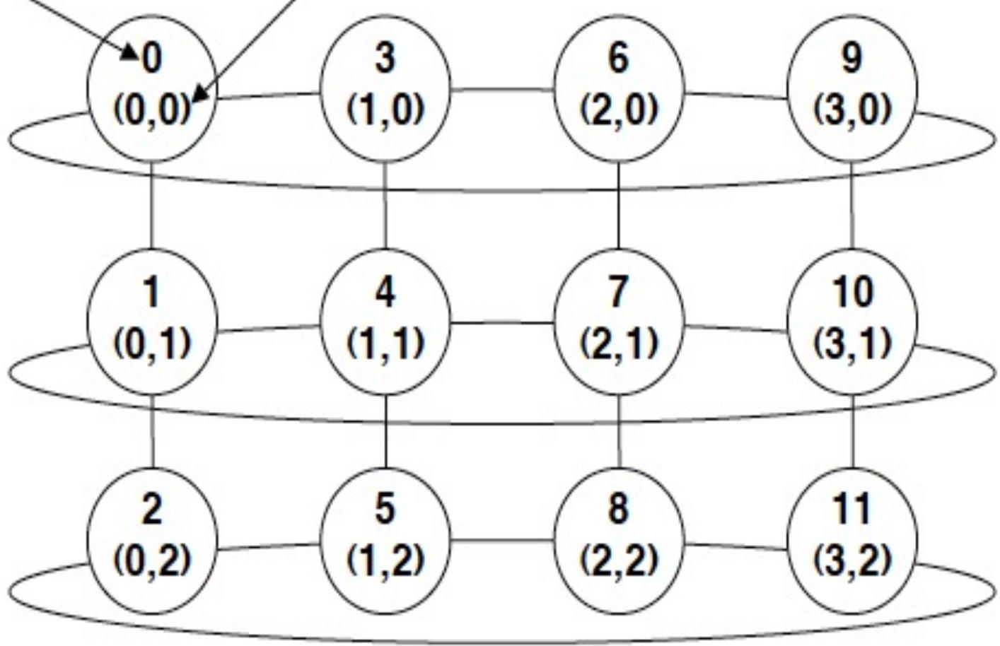  
Ranks and Cartesian process coordinates

# 创建虚拟拓扑

C: intMPI_Cart_create(MPI_Comm comm_old, int ndims, int *dims, int *periods, int reorder, MPI_Comm *comm_car)   
Fortran:MPI_CART_CREATE(COMM_old,NDIMS,DIMS,PERIODS, REORDER,COMM_CART,IERROR) INTEGER COMM OLD,NDIMS,DIMS\*) LOGICAL PERIODS\*REORDER INTEGER COMM CART,IERROR

comm_old = MPICOMM_WORLD

ndlms = 2

dIms = (4, 3)

periods = (1/.true., 0/.false.)

reorder = see next slide

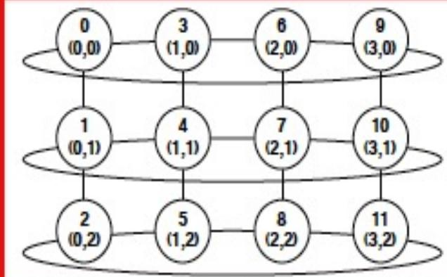

# 创建虚拟拓扑

Ranks and Cartesian process coordinates in comm-cart

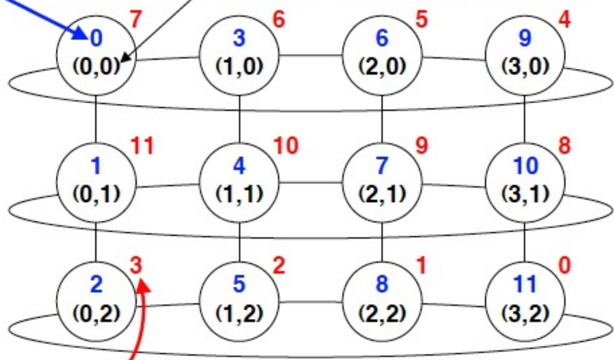

Ranks in comm and comm-cart may differ, if reorder = 1 or .TRUE.

This reordering can allow MPI to optimize communications

# 进程序号到迪卡尔坐标的映射

- 给定进程号，返回该进程的迪卡尔坐标

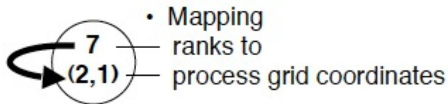

```c
C: intMPI_Cart_coordinates(MPI_Comm comm-cart, int rank, int maxdims, int *coords)  
Fortran: MPI_CARTocoORDS(COMM_CART, RANK, MAXDIMS, COORDS, IERROR)  
INTEGER COMM_CART, RANK  
INTEGER MAXDIMS, COORDS(*), IERROR 
```

# 迪卡尔坐标到进程序号的映射

- 给定迪卡尔坐标，返回进程号

- Mapping process grid coordinates to ranks

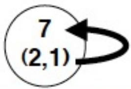

C: intMPI_Cart_rank(MPI_Comm comm-cart, int *coords, int *rank)   
- Fortran: MPI_CART_RATE(COMM_CART, COORDS, RANK, IERROR)

INTEGER COMM_CART, COORDS(*)

INTEGER RANK, IERROR

# 计算当前进程的坐标

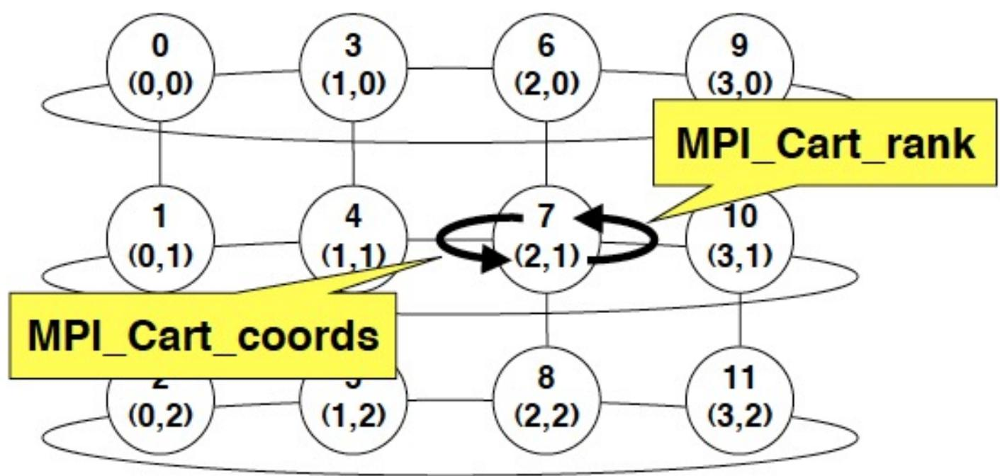

Each process gets its own coordinates with

MPI_Comm_rank Comm_car, my_rank, ierror)

MPI_Cart_coordinates comm_car, my_rank, maxdims, my_coordinates, ierror)

# 数据平移

int MPI_Cart-shift(MPI_Comm comm-cart, int direction, int disp, int *rank_source, int *rank_DEST)

计算相邻进程的rank  
- 如果没有邻居，返回 MPI_PROC_NULL

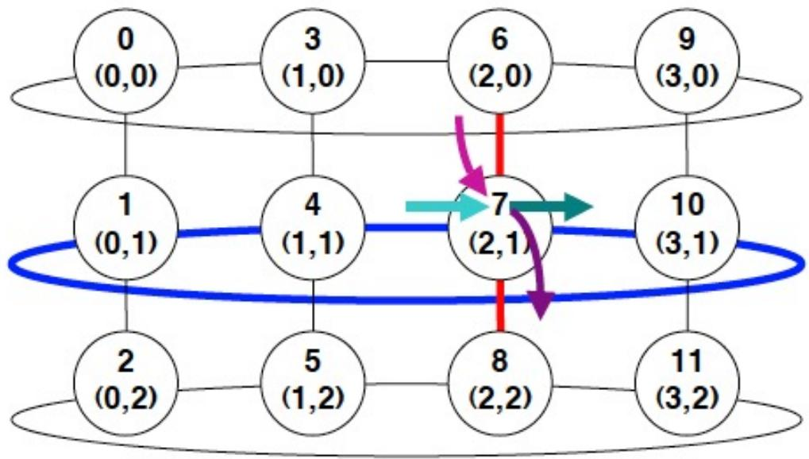

invisible input argument: my_rank in cart  
MPI_Cart_shift( cart, direction, displace, rank_source, rank_DEST, ierror)  
example on 0 or +1 4 10  
process rank=7 1 +1 6 8

# MPI_Cart_sub（划分子拓扑）

Ranks and Cartesian process coordinates in comm_sub

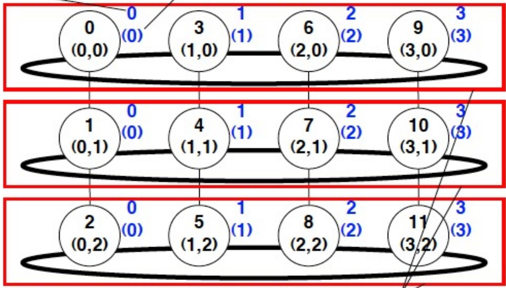

MPI_Cart_sub Comm_car, remain_dims, comm_sub, ierror)

(true, false)

# Jacobi迭代

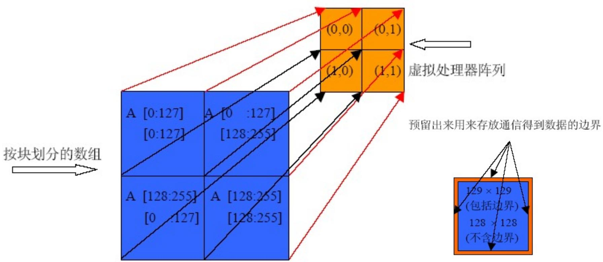

# Jacobi迭代

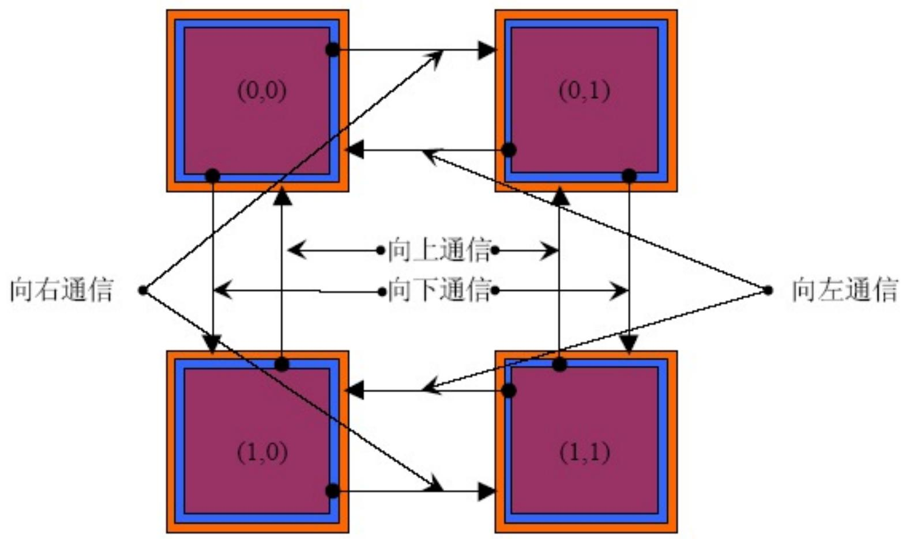