# 异构并行计算

于策

# Outline

- 指令集  
- 异构并行计算平台  
- 编程环境与编程模型  
- GPU/DCU并行编程

# Outline

# - 指令集

- 异构并行计算平台  
- 编程环境与编程模型  
- GPU/DCU并行编程

# 指令集

CPU中用来计算和控制计算机系统的一套指令的集合

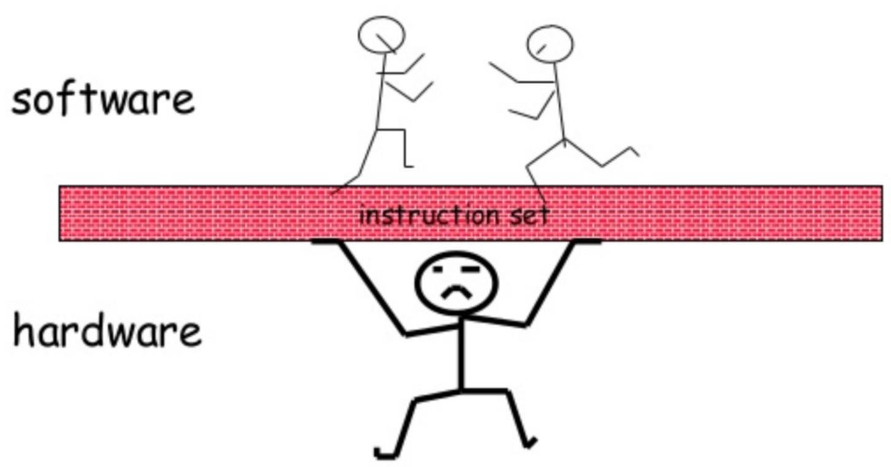

# 程序语言层次

# Levels of Program Code

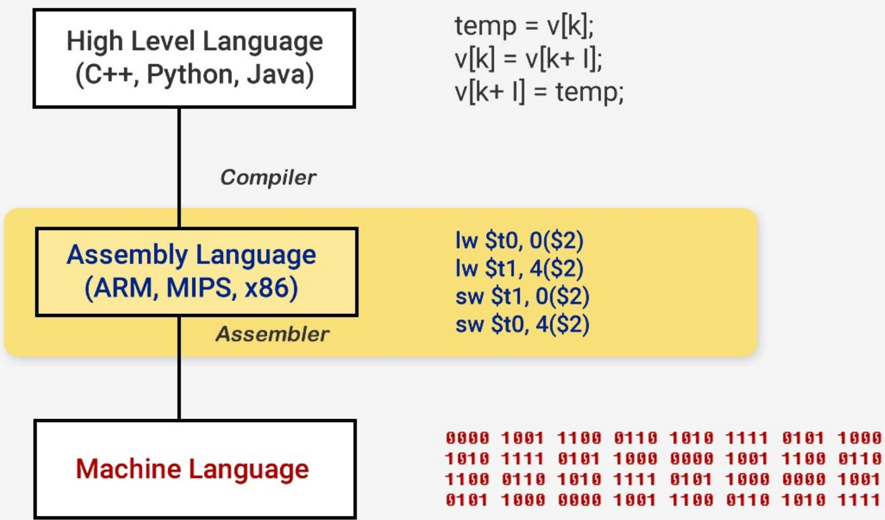

# 指令的执行

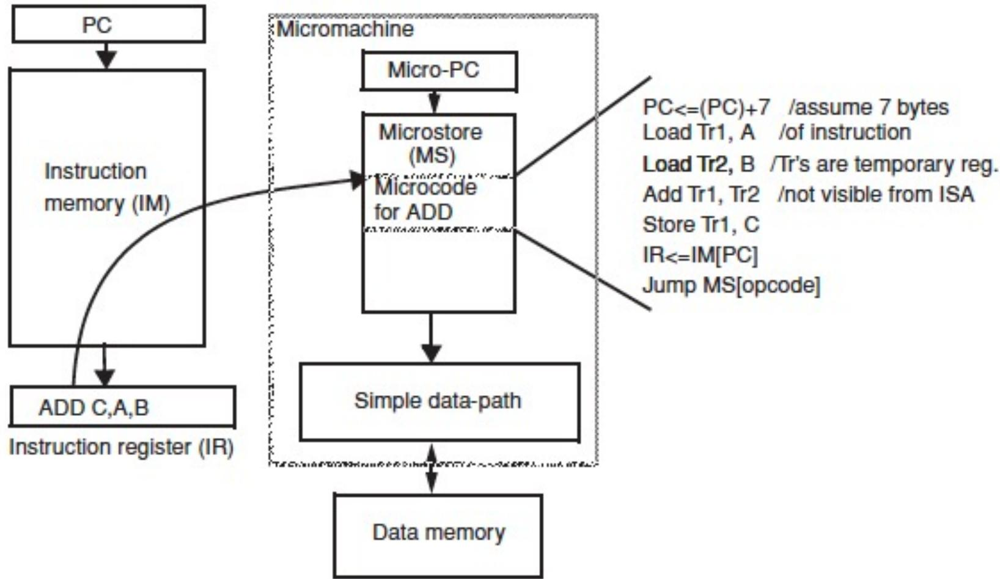

# 指令格式

<table><tr><td>opcode</td><td>Rs</td><td>Rt</td><td>displacement/immediate/offset</td></tr></table>

LWRt, displacement(Rs)

SWRt, displacement(Rs)

ADDIRt,Rs,immediate

BEQRt,Rs,ofst

<table><tr><td>opcode</td><td>Rs</td><td>Rt</td><td>Rd</td><td></td></tr></table>

ADD Rd, Rt, Rs

<table><tr><td>31</td><td>26</td><td>25</td><td></td><td></td><td></td><td></td><td></td><td></td><td></td><td></td><td></td><td></td><td></td><td></td><td></td><td></td><td></td><td></td><td></td><td></td><td></td><td></td><td></td><td></td><td></td><td></td><td></td><td></td><td></td><td></td><td></td><td></td><td></td><td></td><td></td><td></td><td></td><td></td><td></td><td></td><td></td><td></td><td></td><td></td><td></td><td></td><td></td><td></td><td></td><td></td><td></td><td></td><td></td><td></td><td></td><td></td><td></td><td></td><td></td><td></td><td></td><td></td><td></td><td></td><td></td><td></td><td></td><td></td><td></td><td></td><td></td><td></td><td></td><td></td><td></td><td></td><td></td><td></td><td></td><td></td><td></td><td></td><td></td><td></td><td></td><td></td><td></td><td></td><td></td><td></td><td></td><td></td><td></td><td></td><td></td><td></td><td></td><td></td><td></td><td></td><td></td><td></td></tr><tr><td colspan="101">opcode</td><td></td><td></td></tr></table>

Jtarget

JAL target

# Outline

- 指令集  
异构并行计算平台  
- 编程环境与编程模型  
- GPU/DCU并行编程

# 什么是异构并行计算？

# - 异构

计算系统中同时包括多种不同架构的处理器

- X86+GPU、X86+FPGA、ARM/Power+ GPU等  
- 不同架构处理器对应不同的指令集

# - 并行

- 异构计算环境本身要求应用程序支持并行计算  
- 无论是X86处理器，还是ARM和GPU处理器以及DSP，这所有的处理器都是多核向量处理器，要发挥多种处理器混合平台的性能也必须要采用并行的编程方式

# 为什么需要异构并行计算？

不同处理器架构适合处理不同类型的计算问题

将不同类型的计算合理分布到不同类型硬件上能够获得更好的计算性能，比如将逻辑判别计算调度到X86架构的通用CPU，而将需要能够大规模向量并行的计算部分调度到GPU。

- 为特定应用设计更优架构的处理器

处理器架构设计可以依据应用的具体特点来优化，可兼顾功耗与性能。  
但性能、功耗与通用性不可兼得，需要根据实际情况合理取舍。

# 异构并行计算平台

- CPU + 协处理器  
- 协处理器类型

- 高性能计算（GPU等）  
- 半定制计算芯片（FPGA）  
- 专用计算芯片（ASIC）  
- 神经网络计算（NPU）

# GPU

将更多元件用于数据处理，而非控制和存储  
§ SIMT（单指令多线程）并行  
§ 适于可大规模并行的向量计算

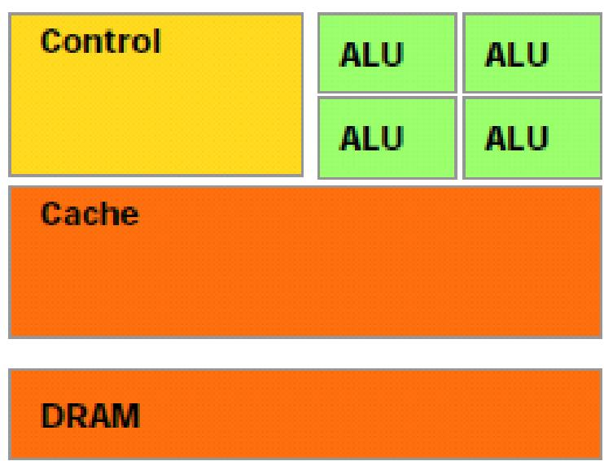  
CPU

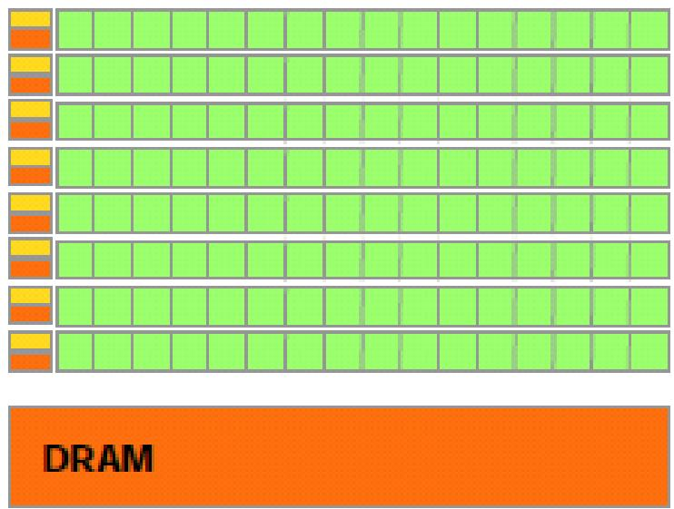  
GPU

# DCU (Deep Computing Unit)


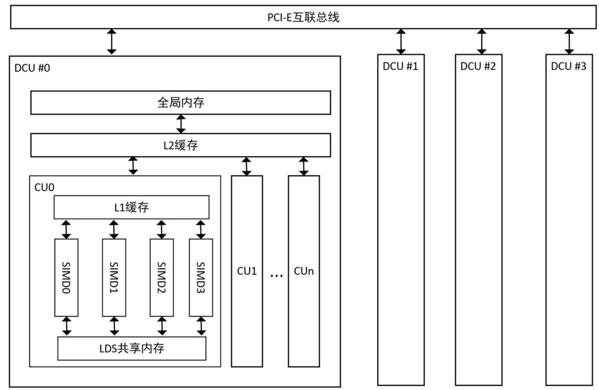

# FPGA（ Field-Programmable Gate Array）

- 半定制电路  
FPGA的优点如下

- 由逻辑单元、RAM、乘法器等硬件资源组成，通过将这些硬件资源合理组织，可实现乘法器、寄存器、地址发生器等硬件电路。  
. 可通过使用框图或者Verilog HDL来设计，从简单的门电路到FIR或者FFT电路。  
- 可无限地重新编程，加载一个新的设计方案只需几百毫秒，利用重配置可以减少硬件的开销。  
- 工作频率由FPGA芯片以及设计决定，可以通过修改设计或者更换更快的芯片来达到某些苛刻的要求。

- FPGA的缺点如下：

- 所有功能均依靠硬件实现，无法实现分支条件跳转等操作。  
- 不能直接实现浮点运算。

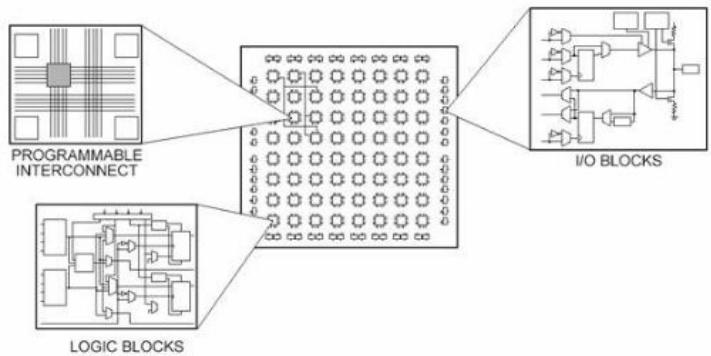

<table><tr><td>Input 1</td><td>Input 2</td><td>Output</td></tr><tr><td>0</td><td>0</td><td>0</td></tr><tr><td>0</td><td>1</td><td>0</td></tr><tr><td>1</td><td>0</td><td>0</td></tr><tr><td>1</td><td>1</td><td>1</td></tr></table>

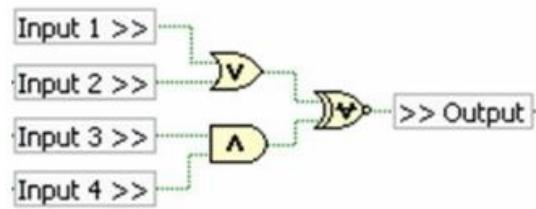

<table><tr><td>LUT Index</td><td>Output</td></tr><tr><td>0 (0000)</td><td>1</td></tr><tr><td>1 (0001)</td><td>1</td></tr><tr><td>2 (0010)</td><td>1</td></tr><tr><td>3 (0011)</td><td>0</td></tr><tr><td>4 (0100)</td><td>0</td></tr><tr><td>5 (0101)</td><td>0</td></tr><tr><td>6 (0110)</td><td>0</td></tr><tr><td>7 (0111)</td><td>1</td></tr><tr><td>8 (1000)</td><td>0</td></tr><tr><td>9 (1001)</td><td>0</td></tr><tr><td>10 (1010)</td><td>0</td></tr><tr><td>11 (1011)</td><td>1</td></tr><tr><td>12 (1100)</td><td>0</td></tr><tr><td>13 (1101)</td><td>0</td></tr><tr><td>14 (1110)</td><td>0</td></tr><tr><td>15 (1111)</td><td>1</td></tr></table>

# FPGA优势

# - 性能潜力

. 支持深度可变的流水线结构  
- 提供大量的并行计算资源，一个时钟周期内就可以完成非常复杂的功能

# . 可编程能力

能够满足应用软件的特殊需求，不存在设计定制协处理器的成本或者延迟问题，可以在一个芯片中为多种应用提供非常灵活的定制协处理功能。

# - 内置存储器

- 协处理器逻辑的存储器访问带宽不会受到器件I/O引脚数量的限制，  
存储器和运算逻辑紧密结合，不再需要采用外部高速存储器缓冲，也避免了大功耗的缓冲访问和一致性问题。

# ASIC（Application Specific Integrated Circuit）

- 为了某种特定的需求而专门定制的芯片，芯片的计算能力和计算效率都可以根据算法需要进行定制  
- 优越性：  
. 体积小、功耗低、计算性能高、计算效率高、芯片出货量越大成本越低。  
- 缺点：  
- 算法是固定的，一旦算法变化就可能无法使用。


<table><tr><td></td><td>上市速度</td><td>性能</td><td>一次性成本</td><td>量产成本</td><td>可配置</td><td>目标市场</td></tr><tr><td>FPGA</td><td>快</td><td>差(1x)</td><td>低</td><td>高(100x)</td><td>完全</td><td>企业军工</td></tr><tr><td>ASIC</td><td>慢</td><td>好(10x)</td><td>高</td><td>低(1x)</td><td>有限</td><td>消费电子</td></tr></table>

# CPU/GPU/FPGA/ASIC比较

<table><tr><td>平台。</td><td>架构区别。</td><td>芯片工艺。</td><td>最高性能器件。</td><td>单精度浮点峰值运算能力。</td><td>功耗。</td><td>能耗比。</td></tr><tr><td>CPU。</td><td>70%晶体管用来构建Cache,还有一部分控制单元,计算单元少,适合运算复杂,逻辑复杂。。</td><td>22nm。</td><td>E5-2699 V3。</td><td>1.33TFLOPS。</td><td>145W。</td><td>9 GFLOPS/W。</td></tr><tr><td>GPU。</td><td>晶体管大部分构建计算单元,运算复杂度低,适合大规模并行计算。</td><td>28nm。</td><td>Tesla K80。</td><td>8.74TFLOPS。</td><td>300W。</td><td>29 GFLOPS/W。</td></tr><tr><td>FPGA。</td><td>可编程逻辑,计算效率高,更接近底层IO,通过冗余晶体管和连线实现逻辑可编程。</td><td>28nm。</td><td>Virtex7-690T。</td><td>1.8 TFLOPS。</td><td>30W。</td><td>60GFLOPS/W。</td></tr><tr><td>ASIC。</td><td>晶体管根据算法定制,不会有冗余,功耗低、计算性能高、计算效率高。</td><td>65nm。</td><td>DianNao。</td><td>452GOPS。</td><td>485mW。</td><td>932 GFLOPS/W。</td></tr></table>

# CPU/GPU/FPGA/ASIC比较

# - CPU&GPU

存在大量的开源软件和应用软件，CPU编程的资源丰富而且容易获得，开发成本低，开发周期短

# - FPGA

动态可重配的，当在数据中心部署之后，可以根据业务形态来配置不同的逻辑实现不同的硬件加速功能  
采用Verilog/VHDL等底层硬件描述语言实现，需要开发者对FPGA的芯片特性有较为深入的了解，但其高并行性的特性往往可以使业务性能得到量级的提升

# - ASIC

可以获得最优的性能，即面积利用率高、速度快、功耗低  
AISC开发风险极大，需要有足够大的市场来保证成本价格，而且从研发到市场的时间周期很长，不适合例如深度学习CNN等算法正在快速迭代的领域。

# NPU（neural-network processing units）

# - NPU

. 神经网络处理器  
. 适于处理视频、图像类的海量多媒体数据

# - 与CPU、 GPU的区别

非冯·诺伊曼结构（存储与计算分离，适于通用计算）

# 基本的神经网络计算

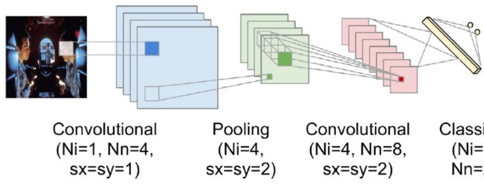

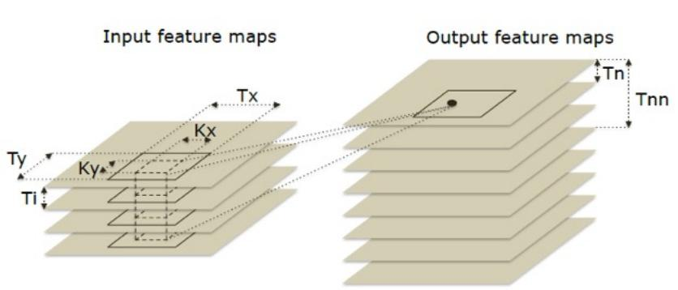  
Figure 1. Neural network hierarchy containing convolutional, pooling and classifier layers.   
Figure 3. Convolutional layer tiling.

I- Original code-

$$
\begin{array}{l} \text {f o r} (\text {i n t} \mathrm {n} = \mathrm {n n}; \mathrm {n} <   \mathrm {n n} + \mathrm {T n}; \mathrm {n} + +) \\ \text {f o r} (\text {i n t} \mathrm {i} = \mathrm {i i}; \mathrm {i} <   \mathrm {i i} + \mathrm {T i}; \mathrm {i} + +) \\ \operatorname {s u m} [ n ] + = \operatorname {s y n a p s e} [ n ] [ i ] * \operatorname {n e u r o n} [ i ]; \\ \text {f o r} (\text {i n t} \mathrm {n} = \mathrm {n n}; \mathrm {n} <   \mathrm {n n} + \mathrm {T n}; \mathrm {n} + +) \\ \operatorname {n e u r o n} [ n ] = \operatorname {s i g m o i d} (\operatorname {s u m} [ n]); \\ \end{array}
$$

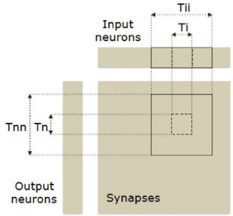  
Figure 2. Clasfer layer tiling.

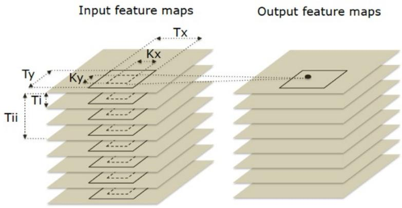  
Figure 4. Pooling layer ilting.

# 完全硬件实现的神经网络

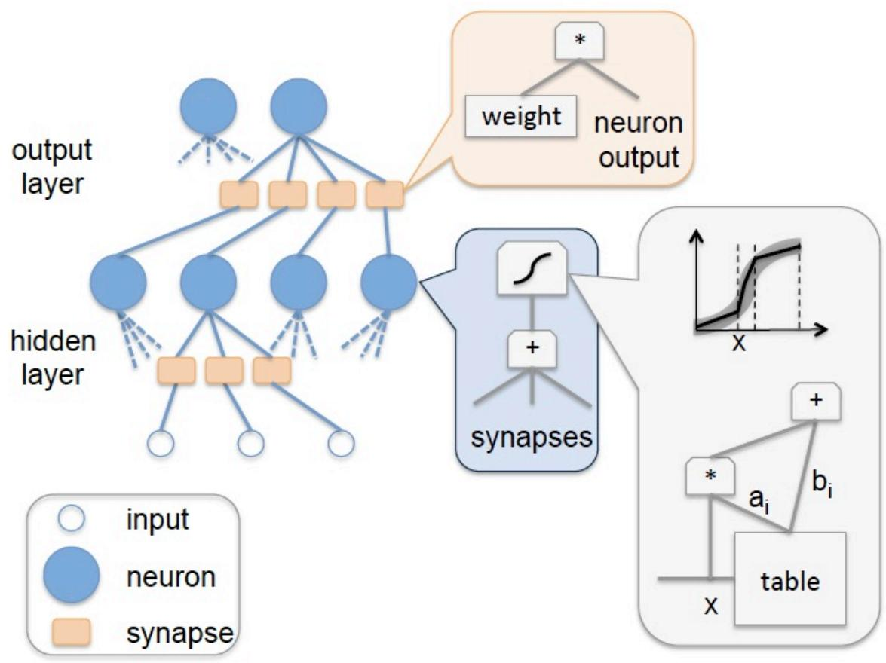  
Figure 9. Full hardware implementation of neural networks.

# Outline

- 指令集  
- 异构并行计算平台  
- 编程环境与编程模型  
- GPU/DCU并行编程

# 异构并行编程所面临的问题

# - 要求解的应用问题

. 支持什么类型的并行化方式？  
. 哪些计算过程需要“外包”给协处理器？

- 数值计算？神经网络计算？。。。

# - 所使用的异构并行计算环境

- 已有（可以拥有）哪些类型的处理器？  
- 支持哪些方式的并行编程？  
- 有哪些可用的并行计算库？

# - 应用问题与硬件环境的最优匹配

. 计算任务调度优化模式？

# OpenCL

- Open Computing Language   
Apple设计，Khronons Group维护（2008年）  
- 异构平台并行编程的开放标准，也是编程框架  
- 支持CPU、 GPU和其他加速器  
- 支持数据并行与任务并行  
- API基于纯C语言编写   
NVIDIA、AMD、Intel提供的OpenCL实现仅支持自己产品

- AMD、Intel的OpenCL实现支持自己的全系列处理器

# OpenCL平台模型

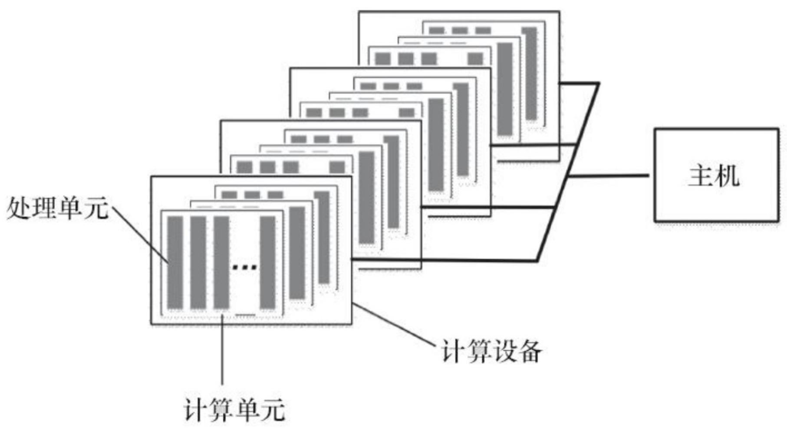

# OpenCL执行模型

- 主机端程序  
- 设备端内核（kernel）程序

- OpenCL内核   
- 用OpenCL C编写并编译的函数

- 原生内核   
- OpenCL之外创建的函数（通过函数指针访问），可以是主机源代码中定义的函数，或库函数  
- 内建内核   
- 绑定到特定设备且不需要再编译的函数

# OpenCL内存模型

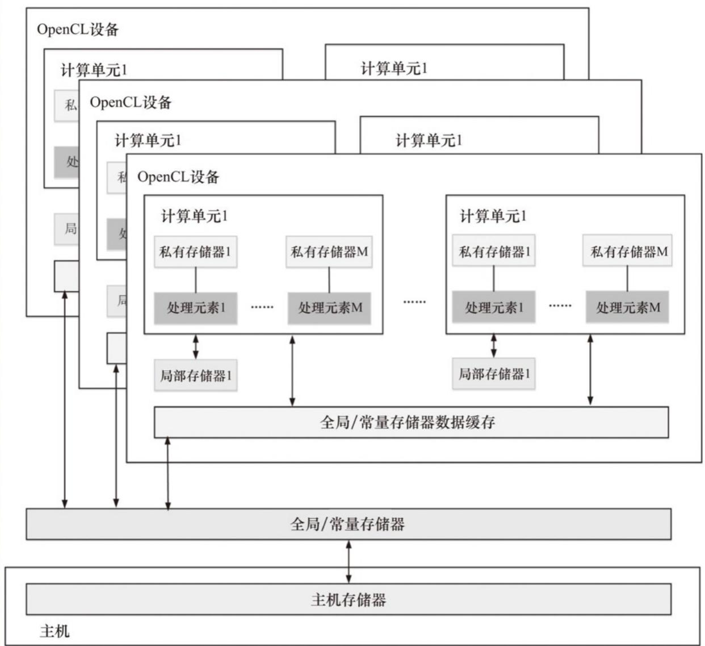

# 异构并行计算工程师技能树

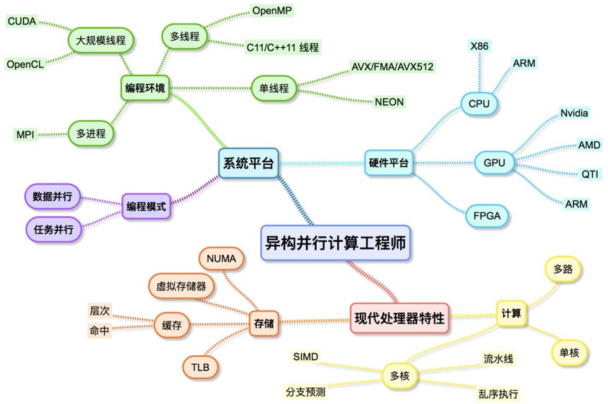

# Outline

- 指令集  
- 异构并行计算平台  
- 编程环境与编程模型  
- GPU/DCU并行编程

# GPU/DCU并行编程

- GPU/DCU体系结构  
- GPU/DCU编程基本概念  
- 多线程并行  
- 线程层次与管理  
- 存储访问   
- 共享与同步   
- 性能优化

# GPU发展简史

- 2000年以前

- 固定渲染流水线  
- 不可编程

. 2001年-2006年

- 弱可编程（OpenGL/DirectX）  
加速渲染（图形学计算）

- 2006年以后

- 通用计算

Input: description of a scene:   
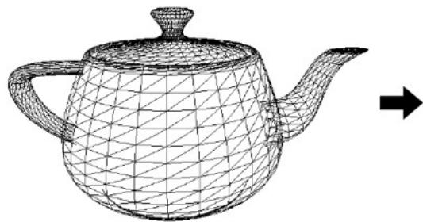  
3Dsurface geometry(e.g.,triangle mesh) surfacematerials,lights,camera,etc.

  
Image credit: Henrik Wan Jensen   
Output: image of the scene

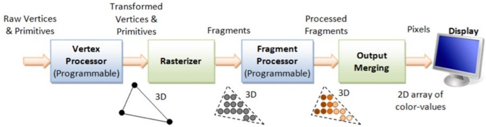  
3DGraphics Rendering Pipeline:Output of one stage is fedas input of the next stage.Avertex has attributes suchas $( x , y , z )$ position,color (RGB or RGBA),vertex-normal $( n _ { x } , n _ { y } , n _ { z } ) ,$ and texture.Aprimitive ismadeupof oneor morevertices.The rasterizer raster-scans each primitive to producea setof grid-aligned fragments,by interpolating the vertices.

# GPU通用计算基本思路

# -专注于计算

- 以SIMD/SIMT的方式支持大规模并行计算  
- 并非任何计算过程都可迁移到GPU

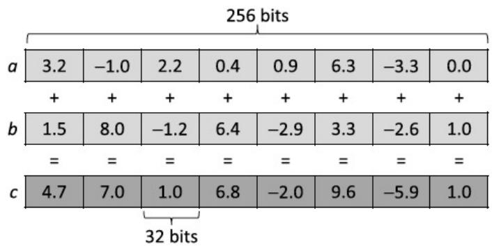

- 不支持复杂的逻辑，不单独使用  
- 仅作为辅助CPU的加速计算设备

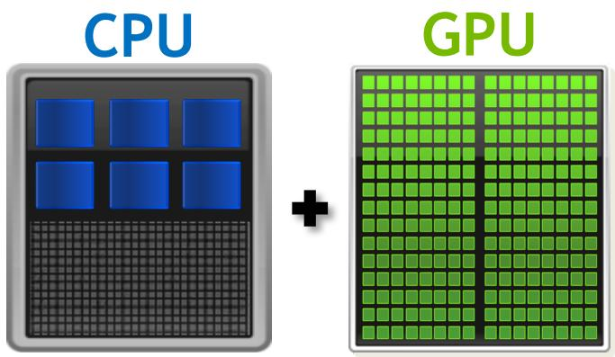

# GPU/CPU浮点计算能力对比

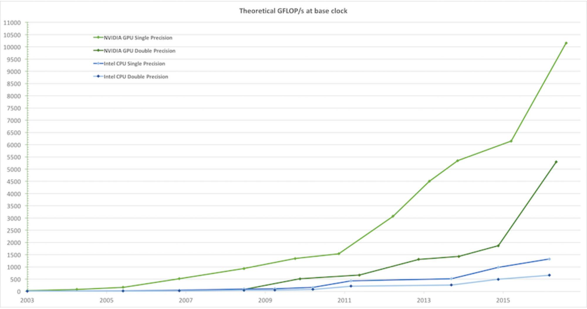

# GPU/CPU内存带宽对比

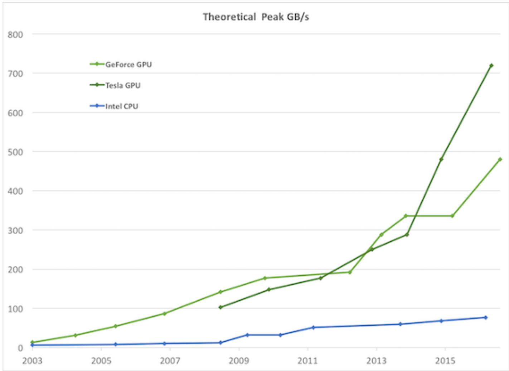

# DCU核心架构

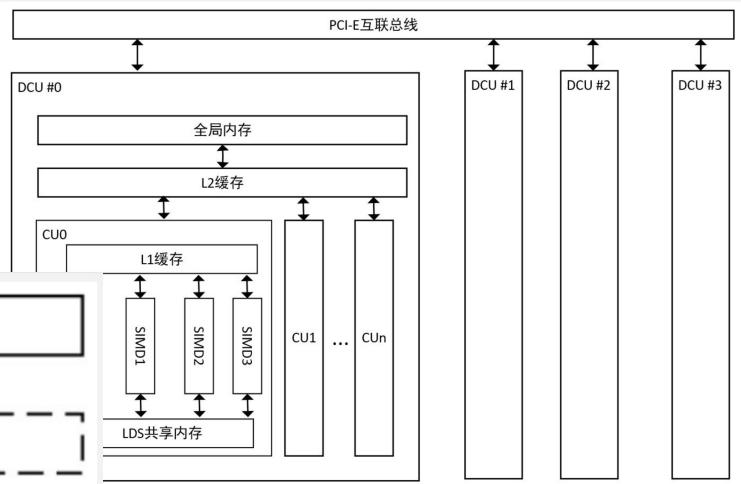

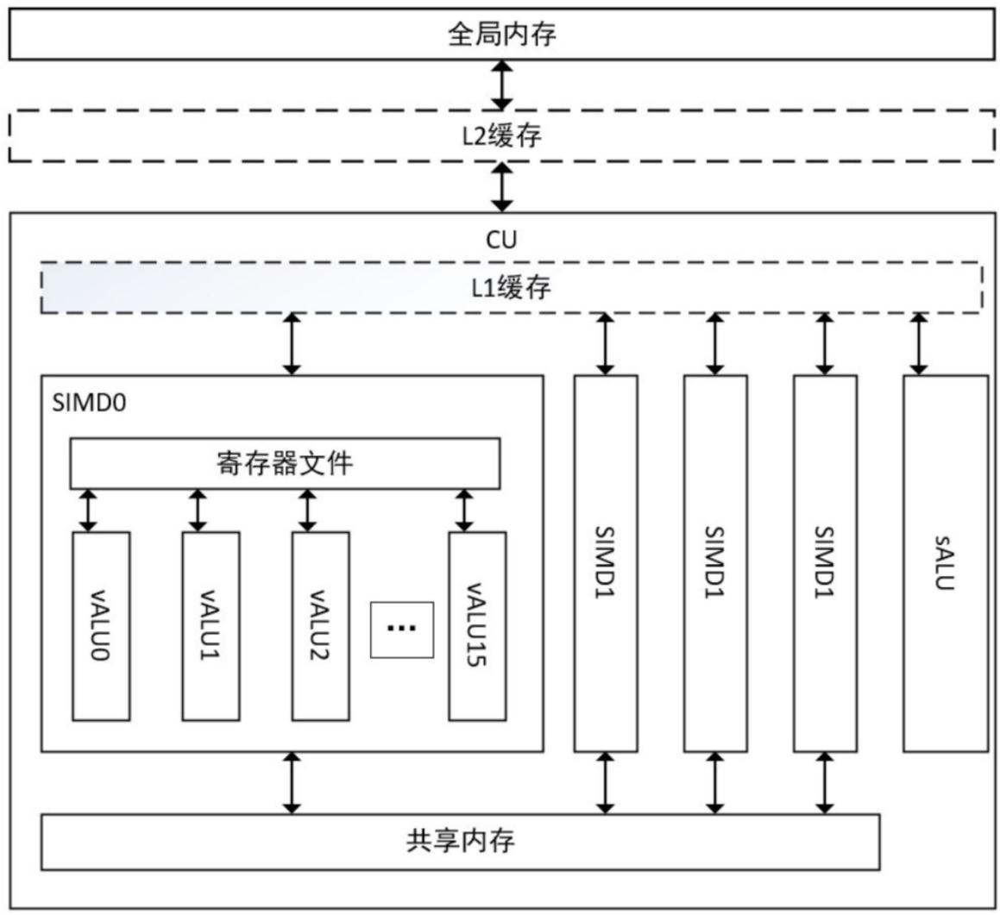

# 异构计算系统架构

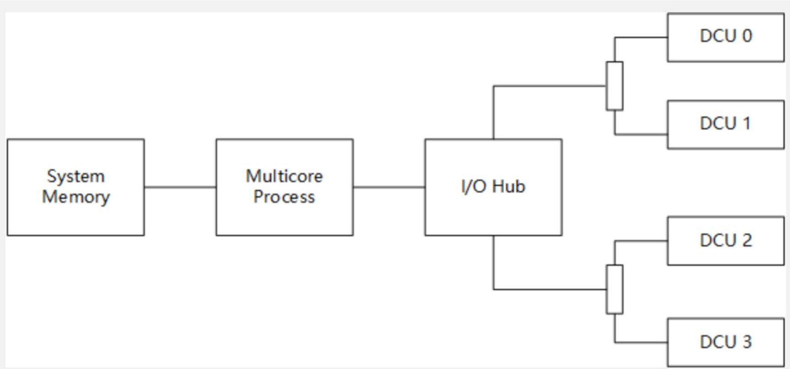  
图2-3常见异构计算节点内部互连结构

# DCU内部互连结构

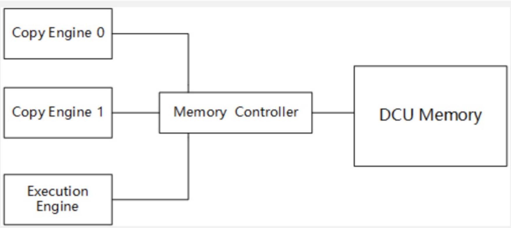  
图2-4DCU内部互连结构

# GPU/DCU并行编程

- GPU/DCU体系结构  
GPU/DCU编程基本概念  
- 多线程并行  
- 线程层次与管理  
- 存储访问   
- 共享与同步   
- 性能优化

# CUDA

- 2006年，NVIDIA 推出  
- 支持多种编程语言  
- SIMT 模式

单指令多线程

- 参考文档

- https://docs.nvidia.com/cuda/

- 软件工具

https://developer.nvidia.com/cuda-downloads

- 编程指南

. https://docs.nvidia.com/cuda/cuda-c-programmingguide/index.html

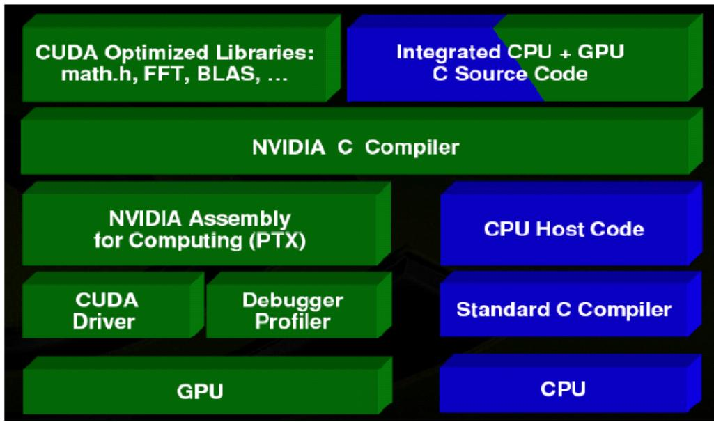

# CUDA

<table><tr><td colspan="9">GPU Computing Applications</td></tr><tr><td colspan="9">Libraries and Middleware</td></tr><tr><td>cuDNN TensorRT</td><td colspan="2">cuFFT, cuBLAS, cuRAND, cuSPARSE</td><td>CULA MAGMA</td><td>Thrust NPP</td><td>VSIPL, SVM, OpenCurrent</td><td colspan="2">PhysX, OptiX, iRay</td><td>MATLAB Mathematica</td></tr><tr><td colspan="9">Programming Languages</td></tr><tr><td>C</td><td colspan="2">C++</td><td>Fortran</td><td>Java, Python, Wrappers</td><td>DirectCompute</td><td colspan="3">Directives (e.g., OpenACC)</td></tr><tr><td colspan="9">CUDA-enabled NVIDIA GPUs</td></tr><tr><td colspan="2">Turing Architecture (Compute capabilities 7.x)</td><td>DRIVE/JETSON AGX Xavier</td><td colspan="2">GeForce 2000 Series</td><td colspan="2">Quadro RTX Series</td><td colspan="2">Tesla T Series</td></tr><tr><td colspan="2">Volta Architecture (Compute capabilities 7.x)</td><td>DRIVE/JETSON AGX Xavier</td><td colspan="2"></td><td colspan="2"></td><td colspan="2">Tesla V Series</td></tr><tr><td colspan="2">Pascal Architecture (Compute capabilities 6.x)</td><td>Tegra X2</td><td colspan="2">GeForce 1000 Series</td><td colspan="2">Quadro P Series</td><td colspan="2">Tesla P Series</td></tr><tr><td colspan="2">Maxwell Architecture (Compute capabilities 5.x)</td><td>Tegra X1</td><td colspan="2">GeForce 900 Series</td><td colspan="2">Quadro M Series</td><td colspan="2">Tesla M Series</td></tr><tr><td colspan="2">Kepler Architecture (Compute capabilities 3.x)</td><td>Tegra K1</td><td colspan="2">GeForce 700 Series GeForce 600 Series</td><td colspan="2">Quadro K Series</td><td colspan="2">Tesla K Series</td></tr><tr><td colspan="2"></td><td>EMBEDDED</td><td colspan="2">CONSUMER DESKTOP, LAPTOP</td><td colspan="2">PROFESSIONAL WORKSTATION</td><td colspan="2">DATA CENTER</td></tr></table>

# DCU软件栈 （HIP）

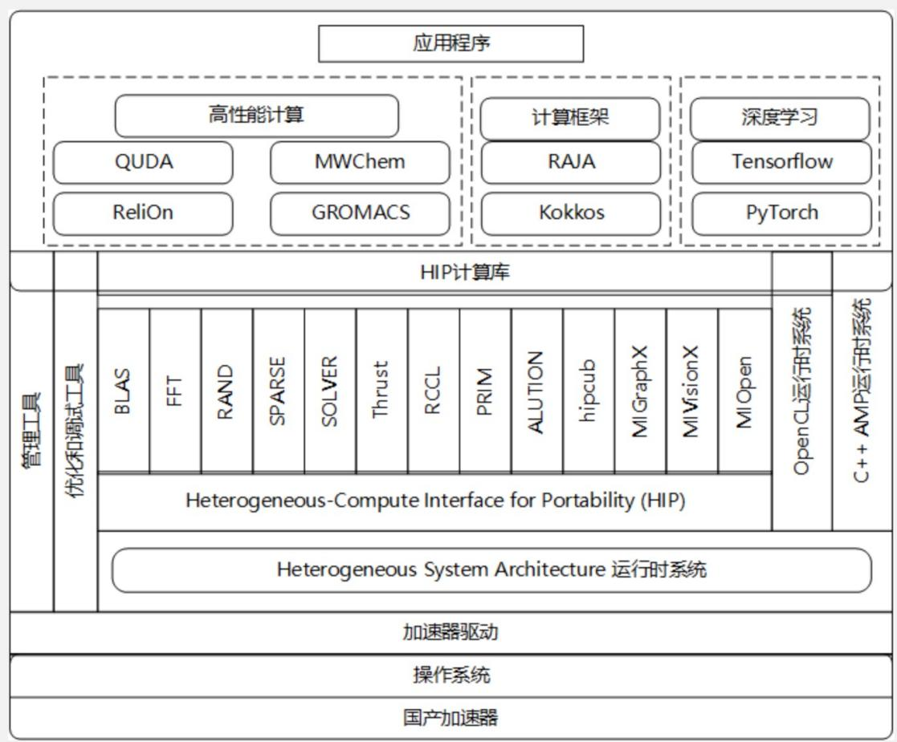  
图2-5Toolkit软件栈架构图

https://developer.sourcefind.cn/gitbook//dcu_developer/DeveloperGuide/dcu _programming/DCU_programming_prefix.html

# CPU+GPU/DCU 异构计算

# - 可用于计算的硬件分为两部分

Host（主机，CPU），负责控制/指挥 GPU/DCU 工作  
. Device（GPU），协处理

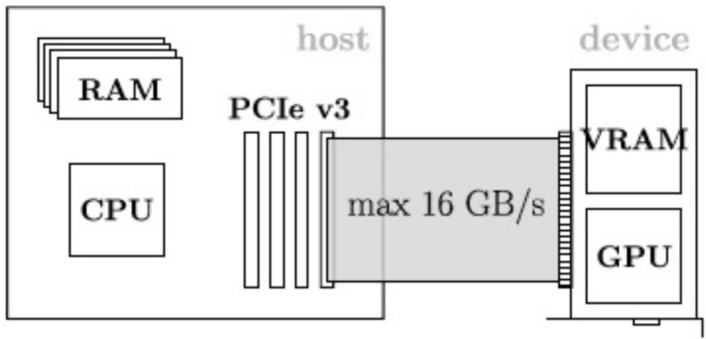

# GPU异构计算编程模型

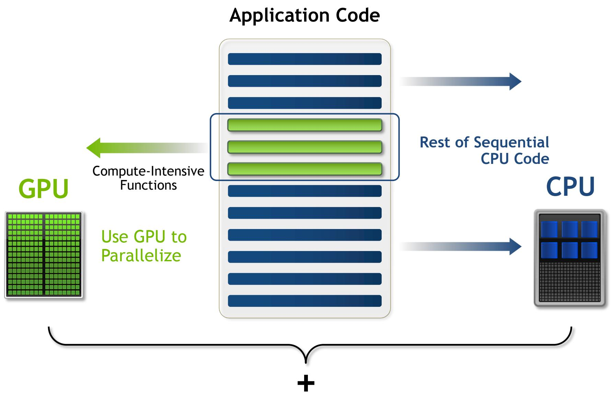

# GPU计算过程

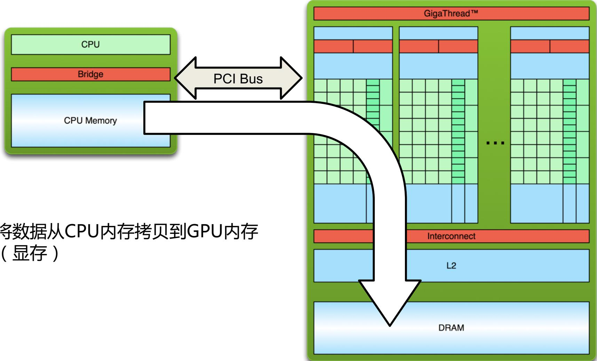

# GPU计算过程

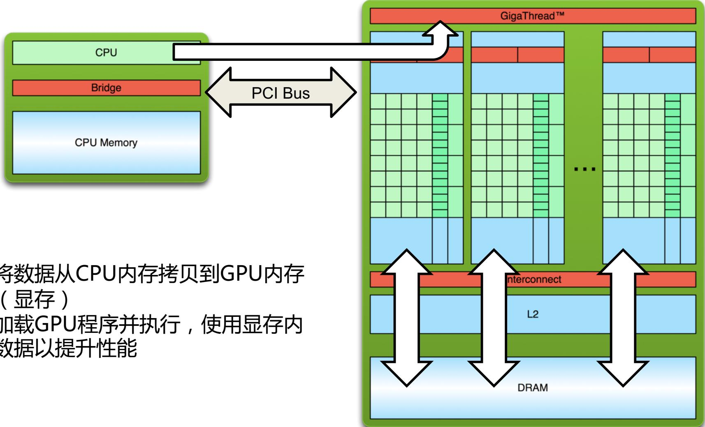

1. 将  
2. 加数

# GPU计算过程

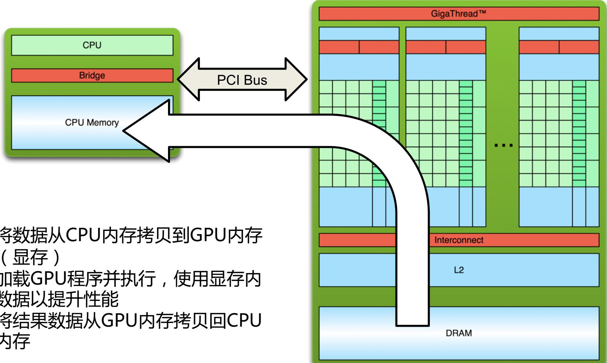

1. 将  
2. 加数  
3. 将内

# Hello World!

```c
int main(void) { printf("Hello World!\n"); return 0; }
```

编译运行:

```txt
$ nvcc hello_world.cu 
```

$ a.out

```txt
Hello World! 
```

host上运行的是标准C语言代码  
使用NVIDIA编译器 (nvcc)可以编译没有device代码的程序

# Hello World! with Device Code

```txt
global void mykernel(void) { }
```

```c
int main(void) { mykernel<<1,1>>>(); printf("Hello World!\n"); return 0; } 
```

- __global 表示此函数在device上执行，自host调用。  
- mykernel() 在此没有进行任何计算。

输出:

$ nvcc hello.cu

$ a.out

Hello World!

$

# CUDA程序基本结构

```c
int main(int argc, char** argv)   
{ // Allocate memory on the host for input data - malloc() // Initialize input data from file, user input, etc. // Allocate memory on the device - CUDAAlloc() // Send input data to the device - CUDAMemcpy() // Set up grid and block dimensions - dim3 variables //Invoke the kernel on the device (GPU) - kWName<<gridSize,blockSize>>>(input.params); //Copy results from device to host - CUDAMemcpy() //Free up device memory -CUDAFree() //Print results at the host, because device can't. //printf() from kernel only works in emulation mode } 
```

# GPU求和计算：kernel

- 两个整数求和的kernel

```txt
__global__ void add(int *a, int *b, int *c) {
    *c = *a + *b;
} 
```

- add() 在device运行，所以 a, b 和 c 需要指向device内存  
- 所以需要在GPU上分配内存空间

# GPU求和计算: main()

int main(void) {   
```txt
int a, b, c; // host copies of a, b, c  
int *d_a, *d_b, *d_c; // device copies of a, b, c  
int size = sizeof(int); 
```

// Allocate space for device copies of a, b, c ， 分配内存

```txt
CUDAAlloc((void \*\*)&d_a,size);   
CUDAAlloc((void \*\*)&d_b,size);   
CUDAAlloc((void \*\*)&d_c,size); 
```

// Setup input values ， 设置输入数据

```txt
a = 2; 
```

```txt
b = 7; 
```

# GPU求和计算: main()

// Copy inputs to device ， 拷贝数据到 GPU 的显存

cudaMemcpy(d_a, &a, size, cudaMemcpyHostToDevice);

cudaMemcpy(d_b, &b, size, cudaMemcpyHostToDevice);

// Launch add() kernel on GPU ， 执行 kernel

add<<<1,1>>>(d_a, d_b, d_c);

// Copy result back to host ， 数据拷贝回 host 内存

cudaMemcpy(&c, d_c, size, cudaMemcpyDeviceToHost);

// Cleanup ， 释放内存

cudaFree(d_a); cudaFree(d_b); cudaFree(d_c);

return 0;

}

# GPU/DCU并行编程

- GPU/DCU体系结构  
- GPU/DCU编程基本概念  
- 多线程并行  
- 线程层次与管理  
- 存储访问   
- 共享与同步   
- 性能优化

# GPU并行计算

- GPU的优势是大规模并行

- 如何在device上并行运行代码？

```txt
add<< 1, 1 >>>(); add<< N, 1 >>>(); 
```

这样，add() 不再是只执行了一次，而是并行执行了N次

# GPU向量加

- 并行执行 add() 可以实现向量加法  
定义: add() 的每个调用定义为一个 block

- 一组 blocks 定义为 grid  
- 各个调用通过 blockIdx.x 标识

```txt
__global__void add(int *a, int *b, int *c) { c[blockIdx.x] = a[blockIdx.x] + b[blockIdx.x]; } 
```

- 使用 blockIdx.x 作为数组的索引，每个block处理各自的数据

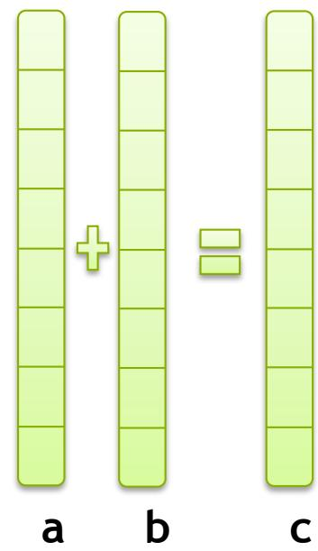

# GPU向量加

```txt
__global__void add(int *a, int *b, int *c) { c[blockIdx.x] = a[blockIdx.x] + b[blockIdx.x]; } 
```

- 在device中，各个block可以并行执行：

Block 0

```txt
c[0] = a[0] + b[0]; 
```

Block 1

```txt
c[1] = a[1] + b[1]; 
```

Block 2

```txt
c[2] = a[2] + b[2]; 
```

Block 3

```javascript
c[3] = a[3] + b[3]; 
```

# GPU向量加: main()

#define N 512

int main(void) {

int *a, *b

// host copies of a, b, c

int *d_a, *d_b, *d_c; // device copies of a, b, c

int size $=$ N * sizeof(int);

// Alloc space for device copies of a, b, c

cudaMalloc((void **)&d_a, size);

cudaMalloc((void **)&d_b, size);

cudaMalloc((void **)&d_c, size);

// Alloc space for host copies of a, b, c and setup input values

a = (int *)malloc(size); random_ints(a, N);

b = (int *)malloc(size); random_ints(b, N);

= (int *)malloc(size);

# GPU向量加: main()

// Copy inputs to device

cudaMemcpy(d_a, a, size, cudaMemcpyHostToDevice);

cudaMemcpy(d_b, b, size, cudaMemcpyHostToDevice);

// Launch add() kernel on GPU with N blocks

add<<<N,1>>>(d_a, d_b, d_c);

// Copy result back to host

cudaMemcpy(c, d_c, size, cudaMemcpyDeviceToHost);

// Cleanup

free(a); free(b); free(c);

cudaFree(d_a); cudaFree(d_b); cudaFree(d_c);

return 0;

}

# CUDA 线程

- 定义: 每个block 可以拆分为并行的 threads  
- 将add() 改为使用并行 threads ，不再使用并行 blocks

```lisp
__global__void add(int *a, int *b, int *c) { c[threadIdx.x] = a[threadIdx.x] + b[threadIdx.x]; } 
```

- 使用 threadIdx.x 替换 blockIdx.x  
- main()…中只需要修改一处

# 使用Threads进行向量加: main()

#define N 512   
```txt
int main(void) { 
```

int \*a,\*b,\*c; // host copies of a,b,c int \*d_a,\*d_b,\*d_c; // device copies of a,b,c int size $=$ N\* sizeof(int);

// Alloc space for device copies of a, b, c   
```c
CUDAAlloc((void \*\*&d_a,size);   
CUDAAlloc((void \*\*)&d_b,size);   
CUDAAlloc((void \*\*)&d_c,size); 
```

// Alloc space for host copies of a, b, c and setup input values   
```txt
a = (int *)malloc(size); random_ints(a, N);  
b = (int *)malloc(size); random_ints(b, N);  
c = (int *)malloc(size); 
```

# 使用Threads进行向量加: main()

// Copy inputs to device

cudaMemcpy(d_a, a, size, cudaMemcpyHostToDevice);

cudaMemcpy(d_b, b, size, cudaMemcpyHostToDevice);

// Launch add() kernel on GPU with N threads

add<<<1,N>>>(d_a, d_b, d_c);

// Copy result back to host

cudaMemcpy(c, d_c, size, cudaMemcpyDeviceToHost);

// Cleanup

free(a); free(b); free(c);

cudaFree(d_a); cudaFree(d_b); cudaFree(d_c);

return 0;

}

# Blocks + Threads的索引数组

- 比单独使用blockIdx.x 和 threadIdx.x更复杂  
- 每个线程需要全局唯一标识

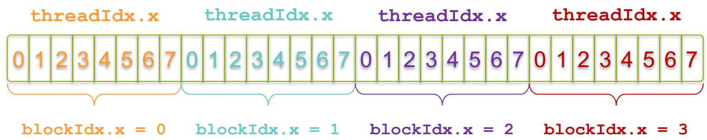

M为每个block中的thread数量，则：

int index = threadIdx.x + blockIdx.x * M;

# 索引数组示例

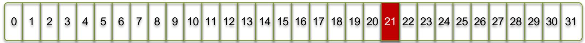

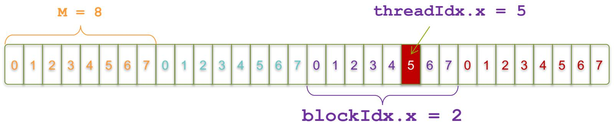

int index = threadIdx.x + blockIdx.x * M;   
= 5 + 2 * 8;   
= 21;

# 使用Blocks + Threads进行向量加

- 使用内置变量 blockDim.x （每个block的thread数量）

```txt
int index = threadIdx.x + blockIdx.x * blockDim.x; 
```

- 组合使用并行 thread 和并行 block 的add()

```txt
__global__void add(int *a, int *b, int *c) { int index = threadIdx.x + blockIdx.x * blockDim.x; c[index] = a[index] + b[index]; } 
```

- main()函数也需要修改。

# 使用Blocks + Threads进行向量加: main()

```txt
define N (2048*2048) 
```

```txt
define THREADS_PER_BLOCK 512 
```

```txt
int main(void) { 
```

```txt
int *a, *b, *c; 
```

```javascript
// host copies of a, b, c 
```

int $\star_{\mathrm{d\_a}}$ ，\*d_b，\*d_c;

```txt
// device copies of a, b, c 
```

```txt
int size = N * sizeof(int); 
```

```javascript
// Alloc space for device copies of a, b, c 
```

```txt
CUDAAlloc((void \*\* &d_a, size); 
```

```txt
CUDAAlloc((void **&d_b, size); 
```

```txt
CUDAAlloc((void **&d_c, size); 
```

```javascript
// Alloc space for host copies of a, b, c and setup input values 
```

```txt
a = (int *)malloc(size); random_ints(a, N); 
```

$\mathbf{b} =$ (int $\star$ )malloc(size); random_ints(b, N);

```txt
c = (int *)malloc(size); 
```

# 使用Blocks + Threads进行向量加: main()

// Copy inputs to device

cudaMemcpy(d_a, a, size, cudaMemcpyHostToDevice);

cudaMemcpy(d_b, b, size, cudaMemcpyHostToDevice);

// Launch add() kernel on GPU

add<<<N/THREADS_PER_BLOCK，THREADS_PER_BLOCK>>>(d_a, d_b, d_c);

// Copy result back to host

cudaMemcpy(c, d_c, size, cudaMemcpyDeviceToHost);

// Cleanup

free(a); free(b); free(c);

cudaFree(d_a); cudaFree(d_b); cudaFree(d_c);

return 0;

}

# DCU版本向量加

1 #include<iostream>   
2 #include"hip/hip_runtime.h"   
3 #include<hip/hip_runtime.h>   
4   
5 #define N 10000   
6   
7 __global__void add(float \*d_A,float \*d_B,float \*d_C){ int tid $=$ threadIdx.x $^+$ blockIdx.x \* blockDim.x; if (tid $<  \mathbb{N}$ {   
10 d_C[tid] $=$ d_A[tid] $^+$ d_B[tid];   
11 }   
12 }   
13   
14 int main() {   
15 //申请数据空间   
16 float \*A $=$ (float \*) malloc(N \* sizeof(float));   
17 float \*B $=$ (float \*) malloc(N \* sizeof(float));   
18 float \*C $=$ (float \*) malloc(N \* sizeof(float));   
19 float \*d_A $=$ NULL;   
20 float \*d_B $=$ NULL;   
21 float \*d_C $=$ NULL;   
22 hipMalloc(void \*\*) &d_A,N \*sizeof(float);   
23 hipMalloc(void \*\*) &d_B,N \*sizeof(float);   
24 hipMalloc(void \*\*) &d_C,N \*sizeof(float);   
25 //数据初始化

```cpp
26 for (int i = 0; i < N; i++) {  
27 A[i] = 1;  
28 B[i] = 1;  
29 C[i] = 0;  
30 }  
31 hipMemcpy(d_A, A, sizeof(float) * N, hipMemcpyHostToDevice);  
32 hipMemcpy(d_B, B, sizeof(float) * N, hipMemcpyHostToDevice);  
33 hipMemcpy(d_C, C, sizeof(float) * N, hipMemcpyHostToDevice);  
34 dim3 Blocksize(256, 1);  
35 dim3 gridsize(N / 256 + 1, 1);  
36 // 进行数组相加  
add<<<gridsize, blocksize >>> (d_A, d_B, d_C);  
37 // 结果验证  
hipMemcpy(C, d_C, sizeof(float) * N, hipMemcpyDeviceToHost);  
38 // 结果验证  
hipMemcpy(C, d_C, sizeof(float) * N, hipMemcpyDeviceToHost);  
40 for (int i = 0; i < N; i++) {  
41 std::cout << C[i] << std::endl;  
42 }  
43 // 释放申请空间  
free(A);  
45 free(B);  
46 free(C);  
47 hipFree(d_A);  
48 hipFree(d_B);  
49 hipFree(d_C);  
50 } 
```

# 处理任意大小的向量

向量的长度并不能保证恰好是 blockDim.x 的整数倍  
- 避免数组访问越界（最后一个 block可能会发生）：

```lisp
__global__void add(int *a, int *b, int *c, int n) {  
    int index = threadIdx.x + blockIdx.x * blockDim.x;  
    if (index < n)  
        c[index] = a[index] + b[index];  
} 
```

kernel调用方式修订（保证block数量足够）：

add<< $(N + M - 1) / M, M>>>(d_a, d_b, d_c, N)$ ;

# GPU/DCU并行编程

- GPU/DCU体系结构  
- GPU/DCU编程基本概念  
- 多线程并行  
- 线程层次与管理  
- 存储访问   
- 共享与同步   
- 性能优化

# 线程层次

- 每个kernel对应一个grid  
- 每个grid对应 一组block

- 共享全局内存

- 每个block包含多个线程

- 可同步   
- 高效数据交换

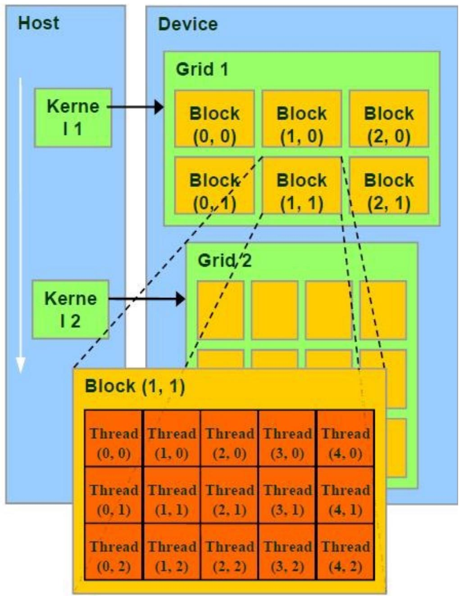

# 内置变量

- grid 与 block 的维度，block 与thread的坐标

- gridDim   
- dim3类型，grid的维度   
. blockIdx   
- uint3类型，block在grid中的位置坐标  
blockDim   
- dim3类型，block的维度   
- threadIdx   
- uint3类型，thread在block中的位置坐标  
warpSize   
- int类型，warp的大小是固定的（32）

参数与约束  

<table><tr><td>GPU</td><td>Kepler GK180</td><td>Maxwell GM200</td><td>Pascal GP100</td><td>Volta GV100</td></tr><tr><td>Compute Capability</td><td>3.5</td><td>5.2</td><td>6.0</td><td>7.0</td></tr><tr><td>Threads / Warp</td><td>32</td><td>32</td><td>32</td><td>32</td></tr><tr><td>Max Warps / SM</td><td>64</td><td>64</td><td>64</td><td>64</td></tr><tr><td>Max Threads / SM</td><td>2048</td><td>2048</td><td>2048</td><td>2048</td></tr><tr><td>Max Thread Blocks / SM</td><td>16</td><td>32</td><td>32</td><td>32</td></tr><tr><td>Max 32-bit Registers / SM</td><td>65536</td><td>65536</td><td>65536</td><td>65536</td></tr><tr><td>Max Registers / Block</td><td>65536</td><td>32768</td><td>65536</td><td>65536</td></tr><tr><td>Max Registers / Thread</td><td>255</td><td>255</td><td>255</td><td>255¹</td></tr><tr><td>Max Thread Block Size</td><td>1024</td><td>1024</td><td>1024</td><td>1024</td></tr><tr><td>FP32 Cores / SM</td><td>192</td><td>128</td><td>64</td><td>64</td></tr><tr><td>Ratio of SM Registers to FP32 Cores</td><td>341</td><td>512</td><td>1024</td><td>1024</td></tr><tr><td>Shared Memory Size / SM</td><td>16 KB/32 KB/48 KB</td><td>96 KB</td><td>64 KB</td><td>Configurable up to 96 KB</td></tr></table>

# CUDA 线程层次（示例1，1个 block）

```txt
// Kernel definition
global void MatAdd(float A[N][N], float B[N][N], float C[N][N])
{
    int i = threadIdx.x;
    int j = threadIdx.y;
    C[i][j] = A[i][j] + B[i][j];
}
int main()
{
    // Kernel invocation with one block of N * N * 1 threads
    int numBlocks = 1;
    dim3 threadsPerBlock(N, N);
    MatAdd<numBlocks, threadsPerBlock>>(A, B, C);
} 
```

# CUDA 线程层次（示例2，多个 block）

```c
// Kernel definition
__global__ void MatAdd(float A[N][N], float B[N][N], float C[N][N])
{
    int i = blockIdx.x * blockDim.x + threadIdx.x;
    int j = blockIdx.y * blockDim.y + threadIdx.y;
    if (i < N && j < N)
        C[i][j] = A[i][j] + B[i][j];
}
int main()
{
    // 先定义每个 block 中线程“形状”，再计算 block 的“形状”
    dim3 threadsPerBlock(16, 16);
    dim3 numBlocks(N / threadsPerBlock.x, N / threadsPerBlock.y);
    MatAdd<<numBlocks, threadsPerBlock>>(A, B, C);
} 
```

# 线程分组

- 对应的维度必须能被整除，分组的大小不能超过1024。  
假设GPU线程是一维的，共8个，则可以选择每2个GPU线程为1组或者每4个GPU线程为1组，但不能选择每3个GPU线程为1组，因为剩下2个GPU线程不足1组。

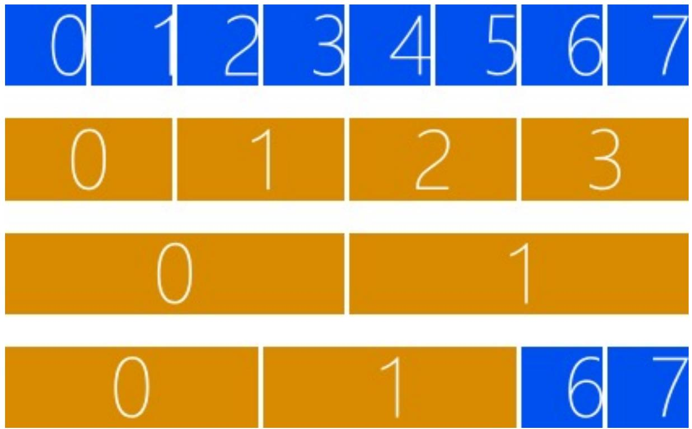

# 线程分组

- 假设GPU线程是二维的，3 x 4，共12个，则可以选择3 x 1或者3x 2作为分组方案，但不能选择2x 2作为分组的规格，因为剩下的4个GPU线程虽然满足分组的大小，分组形状不同。每个分组必须完全相同，包括大小和形状。

假设GPU线程是640 x 480，那么16 x 48、32 x 16和32 x 32都可以选择，它们分别产生40 x10、20 x 30和20 x 15个分组，但32 x 48不能选择，因为大小超过1024。

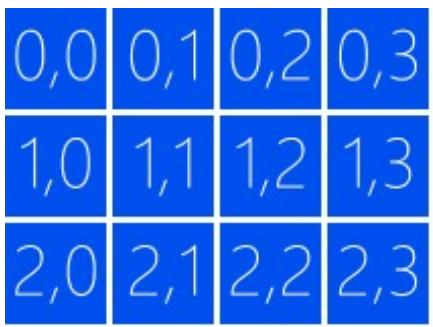


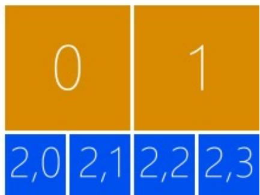

# GPU/DCU并行编程

- GPU/DCU体系结构  
- GPU/DCU编程基本概念  
- 多线程并行  
- 线程层次与管理  
- 存储访问   
- 共享与同步   
- 性能优化

# CUDA 中函数与变量类型

# 函数类型

__device__

- 在GPU中执行  
- 自GPU调用

__global

- 在GPU中执行  
- 自CPU调用

host

- 在CPU中执行/调用  
. 默认函数类型

# 变量类型

_device__

global memory space   
grid中所有线程可访问

__constant_

constant memory space   
grid中所有线程可访问

__shared__

space of a thread block   
只能由block中的线程访问

# 内置向量类型

char, short, int, long, longlong, float, double

. 内置1、2、3、4维向量  
- 结构体，数据访问：x, y, z, w  
. int2 make_int2(int x, int y);

- dim3

- unit3整型向量  
. 用于表示维度

# 存储器层次

- Register

. 线程私有

- Local memory

- 线程私有，KB

- Shared memory

- 速度快，几十KB  
. block中线程可访问

- Global memory   
- 容量大，速度慢，GB  
- Texture memory   
- GPU只读，KB  
Constant memory   
. GPU只读，KB

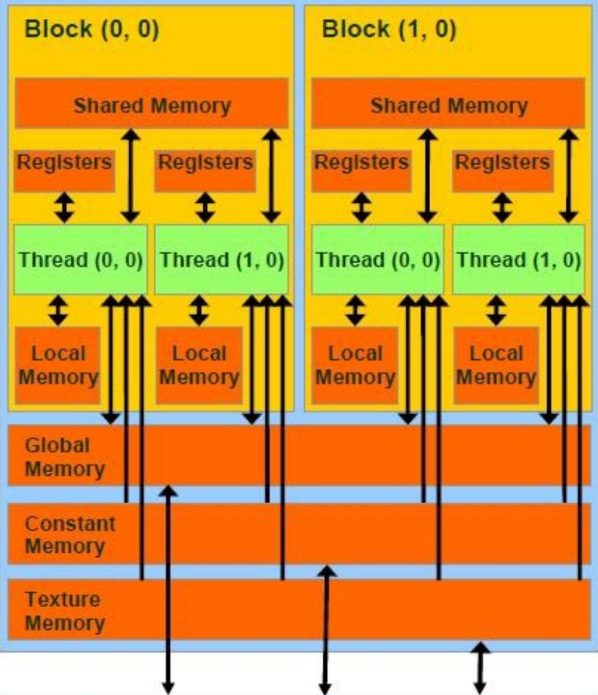  
（Device) Grid  
Host

# 内存分配

# - 内存分为两种

- 可分页内存（Pageable Memory）

- 标准C/C++函数操作，malloc() / new()

- 分页锁定内存（page-locked Memory）

- cudaMallocHost(void** ptr, size_t size)   
- cudaHostAlloc(void** pHost, size_t size, unsigned int flags)

cudaHostAllocPortable：多个 CPU线程都可访问   
. cudaHostAllocWriteCombined：数据传输快，但只允许host 写（读速度慢）  
- cudaHostAllocMapped：CPU/GPU 都可访问

- 支持 DMA

- 可分页内存转为分页锁定内存

cudaHostRegister ( void* ptr, size_t size, unsigned int flags )

# 显存分配

- cudaMalloc()   
一维数组，数据连续存储  
- cudaMallocPitch()   
二维数组，会自动对齐，可能会浪费部分内存空间  
- cudaMalloc3D()   
- 三维数组

# 数据拷贝

```cpp
int main() { int N = 256 * 1024; float* h_a = malloc(sizeof(float) * N); //Similarly for h_b, h_c. Initialize h_a, h_b float *d_a, *d_b, *d_c;udaMemalloc(&d_a, sizeof(float) * N); //Similarly for d_b, d_cudaMemcpy(d_a, h_a, sizeof(float) * N,udaMem //Similarly for d_b //Run N/256 blocks of 256 threads each vecAdd<<N/256, 256>>>(d_a, d_b, d_c);udaMemcpy(h_c, d_c, sizeof(float) * N,udaMe } 
```

# 内存映射

# - ZeroCopy

host内存直接映射到GPU 内存空间  
- 调用cudaHostAlloc() 分配时传入cudaHostAllocMapped 标签  
使用cudaHostRegister() 注册时使用cudaHostRegisterMapped标签  
device 可直接访问分页锁定内存，硬件在 kernel 访问显存时通过PCIE 总线传递，由硬件自动处理数据传输和计算的异步执行。

# - 适用于计算密集型程序

- 数据访问量小   
- 计算与数据传输重叠  
. 不需要显式内存管理

# 统一寻址（Unified Memory）

# - Managed memory (CUDA6.0起开始支持）

在 host 内存与device显存之间根据访问需要自动迁移数据，同时保证 host 和 device 都可访问，应用程序并不需要知道访问时数据所在位置  
需要进行显式同步（以保证前一步骤中数据更新操作全部完成）

# - 优势

- 编程简化  
- 数据访问性能提升

# - 适用条件

SM 体系结构3.0以上（Kepler 架构，或更新的架构）  
- 64位进程，非嵌入式系统

# 统一寻址：host 与 device 使用同一指针

# - 定义方式：cudaMallocManaged

__global__void AplusB(int \*ret，int a,int b){ ret[threadIdx.x] $=$ a $^+$ b $^+$ threadIdx.x;   
}   
int main() { int \*ret; CUDAAllocManaged(&ret，1000\*sizeof(int)); AplusB<<< 1,1000>>>(ret,10,100); CUDADeviceSynchronize();//同步，等待所有kernel完成 for(int i=0;i<1000;i++) printf("%d:A+B=%d\n",i,ret[i]); CUDAFree(ret); return 0;   
}

# 统一寻址（全局变量）

```txt
__device__ __managed__ int ret[1000];  
__global__ void AplusB(int a, int b) {  
    ret[threadIdx.x] = a + b + threadIdx.x;  
}  
int main() {  
    AplusB<< 1, 1000 >> (10, 100);  
    CUDADeviceSynchronize(); //同步  
    for (int i = 0; i < 1000; i++)  
        printf("%d: A+B = %d\n", i, ret[i]);  
    return 0;  
} 
```

# GPU/DCU并行编程

- GPU/DCU体系结构  
- GPU/DCU编程基本概念  
- 多线程并行  
- 线程层次与管理  
- 存储访问   
. 共享与同步   
- 性能优化

# 共享内存与同步函数

Shared memory中数据可以由同一block中线程访问

- 竞态条件

- 同步函数

. void syncthreads();   
- int syncthreads_count(int predicate);   
- int __syncthreads_and(int predicate);   
- int __syncthreads_or(int predicate);   
- void syncwarp(unsigned mask=0xffffffff);

# 示例： . 1D Stencil .

对1D数组进行1D stencil 处理（卷积）  
- 每个输出元素是输入元素一定“半径”内的数据和  
若半径为3，则每个输出元素是7个输入元素的和：

  
radius


# 在block内实现

-每个thread处理一个输出元素

- 每个block分配 blockDim.x 个元素（同thread数）

- 输入数据会被读取多次

. 半径为3，每个输入元素被读取7次


# Threads之间共享数据

- 在block内部，threads 可以通过 sharedmemory 共享数据  
- Shared memory特性：

- 片内，高速，用户可管理  
- 使用__shared__声明, 每个block单独分配  
- 其他block不可以读写

# 使用Shared Memory实现

# - 在shared memory中缓存数据

自global memory 读取 (blockDim.x + 2 * radius) 个输入元 素到 shared memory   
– 计算 blockDim.x 个输出元素  
–将 blockDim.x 个输出元素写回到global memory  
–需要两个“半径”大小的 halo （边界数据）

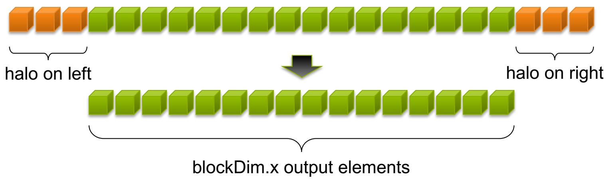

# Stencil Kernel

```txt
__global__ void stencil_1d(int *in, int *out) {
__shared__ int temp[BLOCK_SIZE + 2 * RADIUS];
int gindex = threadIdx.x + blockIdx.x * blockDim.x;
int lindex = threadIdx.x + RADIUS; 
```

有问题

Read input elements into shared memory， 读数据

temp[lindex] $=$ in[gindex];

if (threadIdx.x < RADIUS) {


temp[lindex - RADIUS] $=$ in[gindex - RADIUS];

temp[lindex + BLOCK_SIZE] $=$ in[gindex + BLOCK_SIZE];

} // 编号小于半径的线程， 多取两个边界数据


// Apply the stencil， 计算

int result $\qquad = \ 0$

for (int offset $=$ -RADIUS ; offset <= RADIUS ; offset++)

result += temp[lindex + offset];

// Store the result， 存储结果

out[gindex] $=$ result;

}

# 竞态条件

之前的 stencil 示例并不能保证结果正确  
§ 假设 thread 15 在 thread 0 完成数据缓存之前读取halo数据

```txt
temp[lindex] = in[gindex]; Store at temp[18] if (threadIdx.x < RADIUS) { temp[lindex - RADIUS = in[gindex - RADIUS]; Skipped, threadIdx > RADIUS temp[lindex + BLOCK_SIZE] = in[gindex + BLOCK_SIZE]; } int result = 0; result += temp[lindex + 1]; Load from temp[19] 
```

# __syncthreads()

- void syncthreads();   
- 同步同一个block之内的全部线程

- 用于避免 RAW / WAR / WAW 风险

. 所有线程必须都运行到barrier（路障）

– 如果是条件代码，整个block中线程对应的条件必须一致

# Stencil Kernel

_global void stencil_1d(int *in, int *out) {   
```txt
\_shared\_ int temp[BLOCK_SIZE + 2 \* RADIUS];  
int gindex = threadIdx.x + blockIdx.x \* blockDim.x;  
int lindex = threadIdx.x + radius; 
```

```txt
// Read input elements into shared memory, 读数据
temp[lindex] = in[gindex];
if (threadIdx.x < RADIUS) {
    temp[lindex - RADIUS] = in[gindex - RADIUS];
    temp[lindex + BLOCK_SIZE] = in[gindex + BLOCK_SIZE];
} 
```

```javascript
// Synchronize (ensure all the data is available)同步 __syncreads(); 
```

# Stencil Kernel

```c
// Apply the stencil  
int result = 0;  
for (int offset = -RADIUS ; offset <= RADIUS ; offset++)  
    result += temp[lindex + offset];  
// Store the result  
out[gindex] = result; 
```

# GPU/DCU并行编程

- GPU/DCU体系结构  
- GPU/DCU编程基本概念  
- 多线程并行  
- 线程层次与管理  
- 存储访问   
- 共享与同步   
性能优化

# GPU/DCU 并行计算性能优化

# - 算法选择

- 算法并行性是首要因素  
. 时间复杂度低未必合适

# - 并行度

不同于 CPU，GPU/DCU环境中线程切换效率很高  
. 使用尽可能多的线程数

# - 数据传输

- 次数尽可能少（合并传输）  
- 数据传输量尽可能少  
. 异步传输