# MPI多级混合编程

汤善江 副教授

天津大学智能与计算学部

tashj@tju.edu.cn

http://cic.tju.edu.cn/faculty/tangshanjiang/

# Outline

• 多级混合编程概述  
• MPI+OpenMP混合编程  
• MPI+CUDA混合编程

# 计算机系统性能提升方法

• Scale Up模式

• 单个计算节点计算能力越来越强大

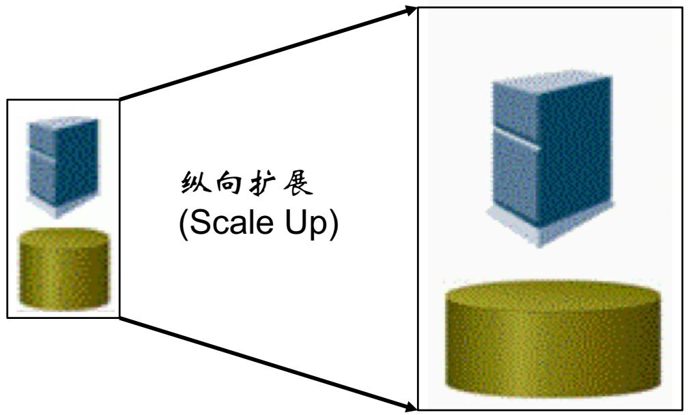

# 计算机系统性能提升方法

# • Scale Up模式

. 单个芯片和计算节点计算能力越来越强大

• CPU（单核-〉多核-〉众核），GPU，MIC

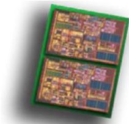  
Dual cores


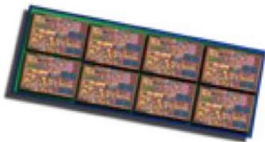  
Multi-core array

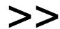

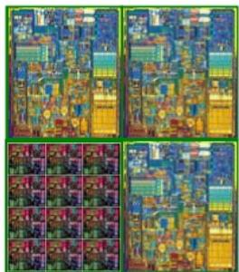

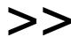

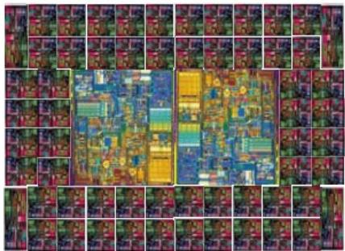  
Scalar plus many cores   
Many-core array

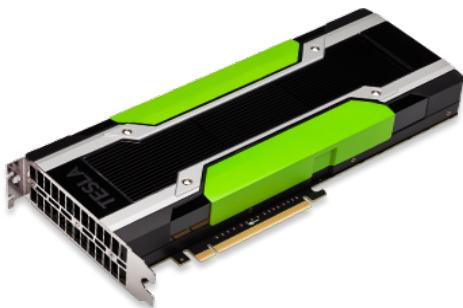  
GPU

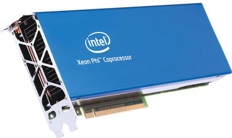  
Xeon Phi

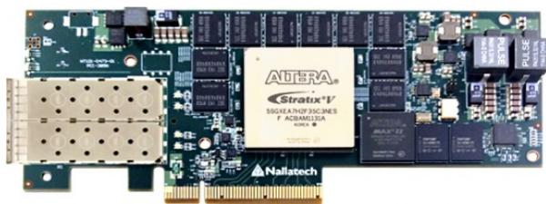  
FPGA

# 计算机系统性能模式

# • Scale Out模式

• 可计算节点的规模越来越大

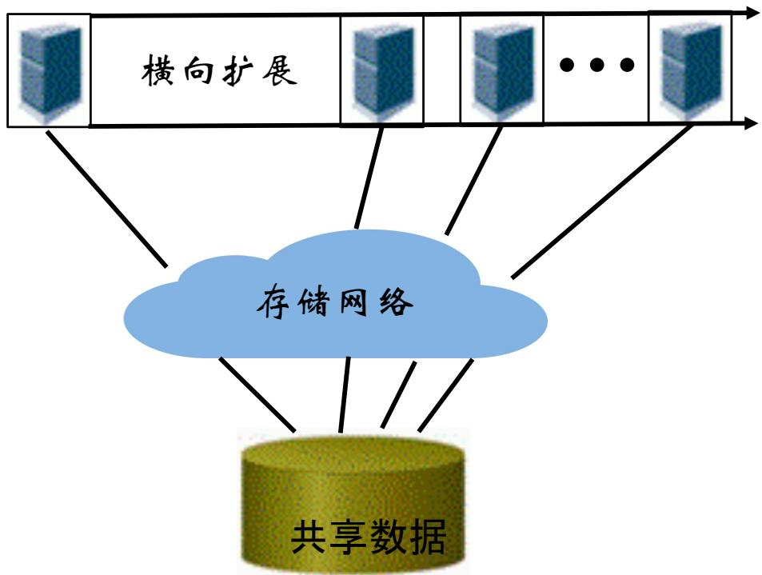

# 计算系统的发展趋势

• 多级化正成为大规模计算系统必然发展趋势

• 多级化计算机发展趋势：Scale Up + Scale Out

例如天河二号：16000个运算节点，每节点配备两颗Xen E5 12核CPU，3个Xeon Phi 57协处理器（运算加速卡），共312万颗计算核心。

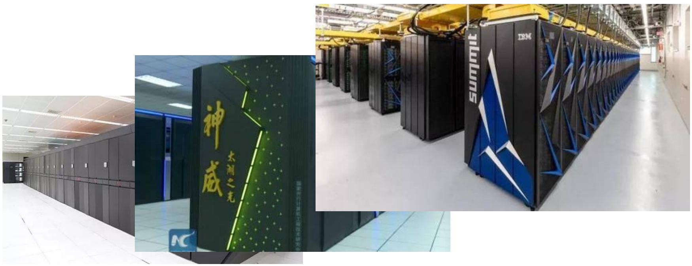

# 多级并行计算系统

# • SMP节点构成的多核集群架构

• 节点内多个处理器彼此共享内存(OpenMP)  
• 节点间通过互联网络进行连接(MPI)  
• 编程模型：MPI+OpenMP

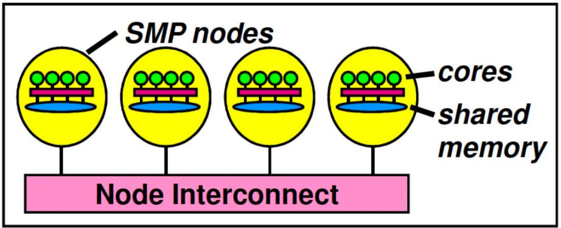

# OpenMP inside of the SMP nodes

# MPI between the nodes via node interconnect


# Node Interconnect

# 多级并行计算系统

# . 多GPUs集群架构

• 单个节点内包含多个GPUs (CUDA)   
• 节点间通过互联网络进行连接 (MPI)  
• 编程模型：MPI+CUDA

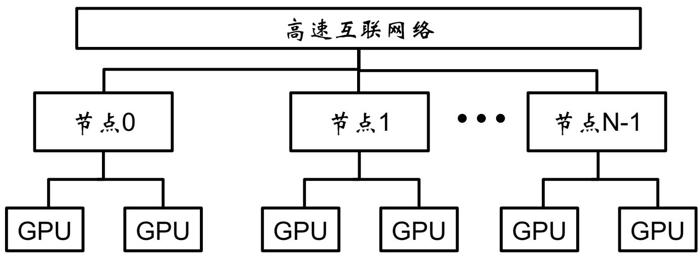

# Outline

• 多级混合编程概述  
• MPI+OpenMP混合编程  
• MPI+CUDA混合编程

# MPI VS Thread

MPI 描述了多个进程间的并行化（独立的地址空间）  
• 通常面向分布式网络计算环境，以消息发送接收的方式进行通信  
线程并行化提供了进程内部的共享内存模式  
• OpenMP是一个常用的线程并行化模型。基于用户通过提供制导语句，线程的创建和管理由编译器负责。

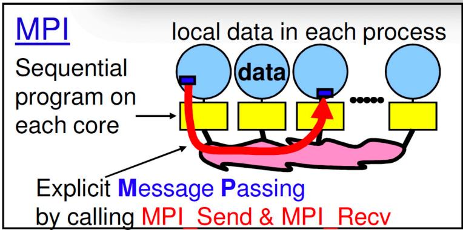

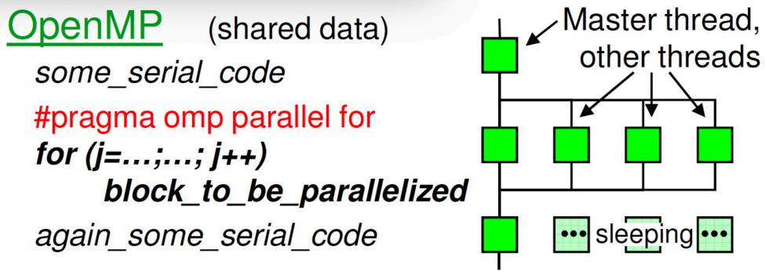

# MPI VS OpenMP

# • 纯MPI优点：

• 高可扩展性  
• 高可移植性  
节点间扩展

# • 纯OpenMP优点：

• 容易部署  
• 延迟低   
. 隐式通信  
• 粗粒度和细粒度划分  
. 动态负载平衡

# • 纯MPI缺点：

• 开发调试困难  
• 显式通信  
• 粗粒度划分  
• 负载平衡困难

# • 纯OpenMP缺点：

• 仅运行于共享内存机器  
• 仅节点内可扩展  
• 线程顺序未定义

# MPI+OpenMP

• 概念上简单和简洁，两级并发   
. 适合多核节点架构  
• 缓解纯MPI的可扩展性问题，降低进程数和网络洪水。

# Pure SMP Node

1 MPI Task

16 Threads/Task

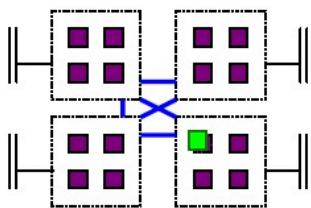

4 MPI Tasks

4 Threads/Task

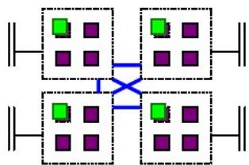

# Pure MPI Node

16 MPI Tasks

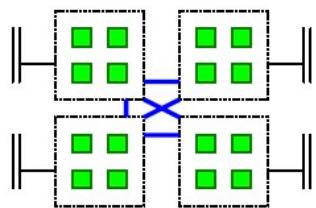


Master MPI Process $^ +$ Worker Thread


Worker Thread for Master MPl Process


Single MPl Process on Core

# MPI+OpenMP混合编程模型

• MPI-only编程

• 每一个MPI进程只有一个执行单元

• MPI+OpenMP编程

• 单个进程内存在多个并发执行线程  
• 所有线程共享所有MPI对象（通信域，请求对象）

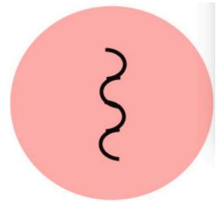  
MPI-only 编程模型  
Rank 0

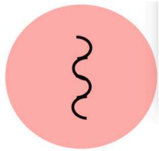  
Rank 1

  
MPI+OpenMP编程模型  
Rank 0

  
Rank 1

# MPI+OpenMP混合编程模型

• 每一个进程创建多个OpenMP线程

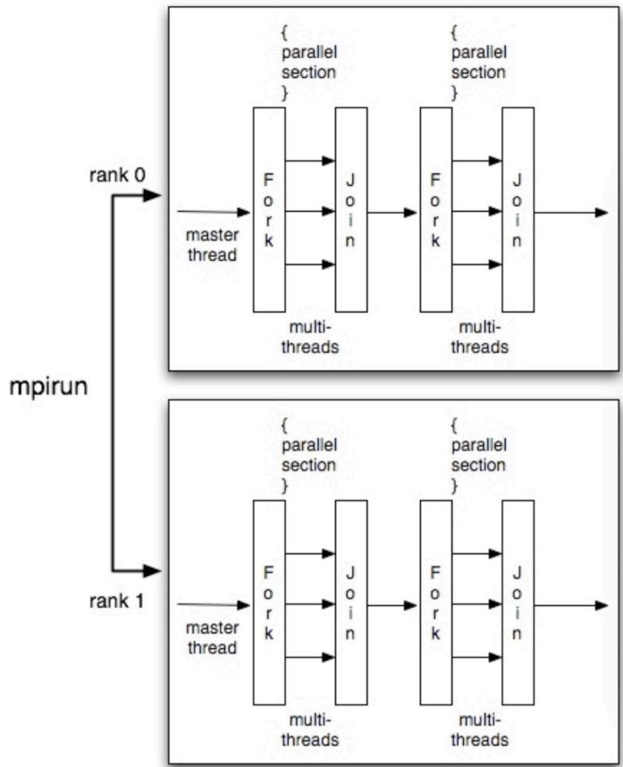

# MPI+OpenMP混合编程

• Step1:初始化MPI   
• Step2:在每一个MPI进程中创建一个OMP并行区域

• 串行区域要么是主线程或MPI任务  
• MPI rank对于所有线程而言是已知的。

• Step3:在串行或并行区域调用MPI库  
• Step4:结束MPI

# Program

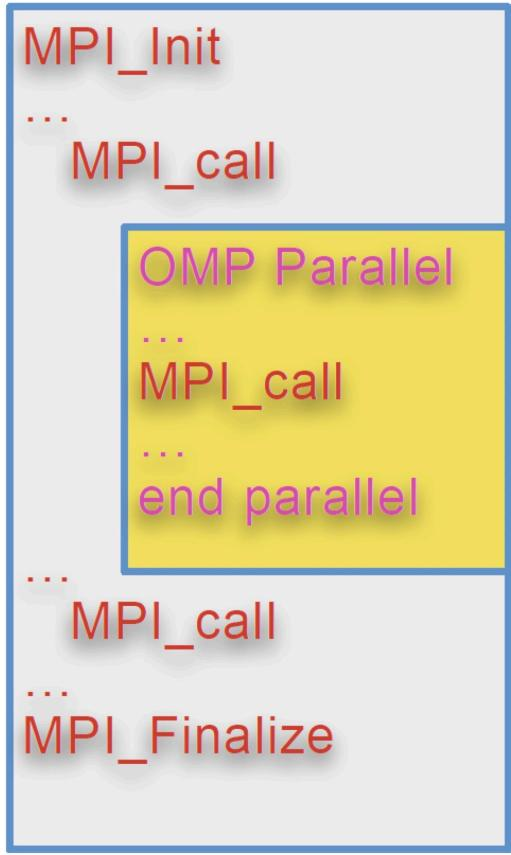

# MPI+OpenMP混合编程

# • 混合代码

# Fortran

include'mpif.h' program hybsimp

call MPI_Init(ierr) call MPl_Comm_rank (..,irank,ierr) call MPl_Comm_size (..,isize,ierr)

! Setup shared mem, comp.& Comm

!$OMP parallel do do i=1,n <work> enddo ! compute& communicate

call MPI_Finalize(ierr) end

#include <mpi.h> int main(int argc, char **argv){ int rank, size, ierr, i;

ierr= MPl_Init(&argc,&argv[]); ierr= MPl_Comm_rank (.,&rank); ierr= MPl_Comm_size (...,&size); 7/Setup shared mem, compute & Comm

#pragma omp parallel for for(i=0; i<n; i++){ <work> } // compute& communicate

ierr= MPI_Finalize();

C

# MPI+OpenMP消息通信

# • 单一线程进行通信

通信来自MPI并行区域的单一线程或者串行临界区的

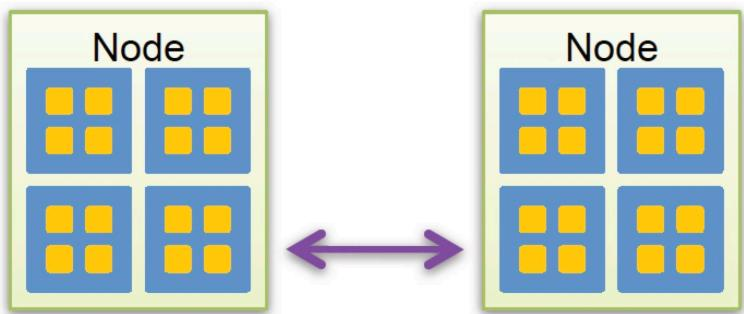  
rank to rank

# • 多线程进行通信

• 通信来自MPI并行区域的多个线程

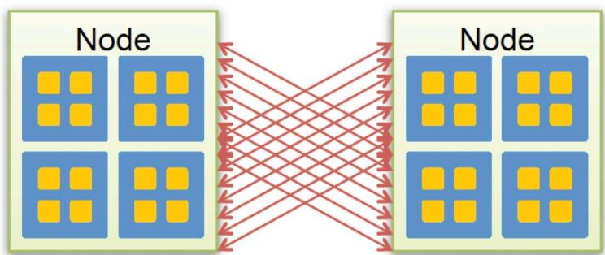  
rank-thread ID to any rank-thread ID

# 线程中执行MPI调用

• 用MPI_Init_thread来选择和决定MPI线程的支持级别  
. 替换MPI_Init

• MPI2定义了线程调用MPI 4种情况：

• Single表示不支持多线程  
Funneled表示只有主线程能够调用MPI  
• Serialized表示多个线程可以调用MPI，但是一次只允许一个线程调用。  
. Multiple表示任何线程都可以调用。

# MPI2 MPI Init thread

# Syntax:

call MPI_Init_thread( irequired, iprovided, ierr) int MPl_Init_thread(int *argc, char **argv, int required, int *provided) int MPl::Init_thread(int& argc, char**& argv, int required)

<table><tr><td>Support Levels</td><td>Description</td></tr><tr><td>MPI_THREAD_SINGLE</td><td>Only one thread will execute.</td></tr><tr><td>MPI_THREADFUNNELED</td><td>Process may be multi-threaded, but only main thread will make MPI calls (calls are &quot;funneled&quot; to main thread). “Default”</td></tr><tr><td>MPI_THREAD_SERIALIZE</td><td>Process may be multi-threaded, any thread can make MPI calls, but threads cannot execute MPI calls concurrently (MPI calls are &quot;serialized&quot;).</td></tr><tr><td>MPI_THREAD_MULTIPLE</td><td>Multiple threads may call MPI, no restrictions.</td></tr></table>

If supported, the call will return provided $=$ required.

Otherwise, the highest level of support wil be provided.

# 通过主线程进行MPI调用

• MPI _THREAD_FUNNELED   
由于在master workshare construct (OMP_MASTER)中没有隐式的barrier，需要显示调用OMP_BARRIER进行同步  
• 所有其他线程都处于休眠当中。

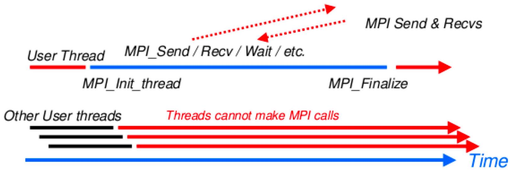

# 通过主线程进行MPI调用

Fortran   
```txt
include 'mpif.h' program hybmas   
!SOMP parallel   
!SOMP barrier   
!SOMP master   
callMPI_<Whatever>(...,ierr)   
!SOMP end master   
!SOMP barrier   
!SOMP end parallel   
end 
```

C   
```txt
include <mpi.h> int main(int argc, char \*\*argv){ int rank,size, ierr,i; #pragma omp parallel { #pragma omp barrier #pragma omp master { ierr=MPI_<Whatever>(...) } #pragma omp barrier } } 
```

# 在单个线程内进行MPI调用

• MPI _THREAD_ SERIALIZED   
• OMP_BARRIER只需要在开始的时候使用，主要是由于在SINGLEworkshare construct (OMP_SINGLE) 存在隐式的同步。  
• 所有其他线程都处于休眠当中。

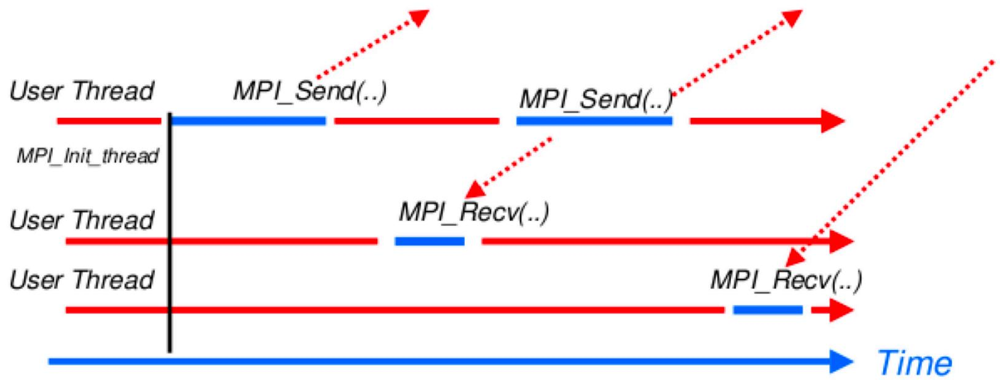

# 通过主线程进行MPI调用

# Fortran

```txt
include 'mpif.h'   
program hybsing   
call MPI_init_thread(MPI_THREAD SERIALIZED, iprovided,err) 
```

```txt
!$OMP parallel 
```

```txt
!$OMP barrier 
```

```txt
!$OMP single 
```

```batch
call MPI_<whatever>(...,ierr) 
```

```txt
!$OMP end single 
```

```txt
!!OMP barrier 
```

```txt
!$OMP end parallel end 
```

```c
include <mpi.h>   
int main(int argc, char \*\*argv){   
int rank,size,err,i;   
MPI_init_thread(MPI_THREAD_SERIALIZED, iprovided) 
```

```txt
#pragma omp parallel
{
#pragma omp barrier
#pragma omp single
{
ierr=MPI_<Whatever>(...)
} 
```

```scss
//pragma omp barrier } 
```

C

# MPI_THREAD_MULTIPLE运行模式

• 通常是最灵活的模式，也是最为复杂的  
• 任何的线程可以进行MPI通信，而没有任何约束  
• 各线程调用MPI操作顺序不确定，有潜在错误或死锁风险

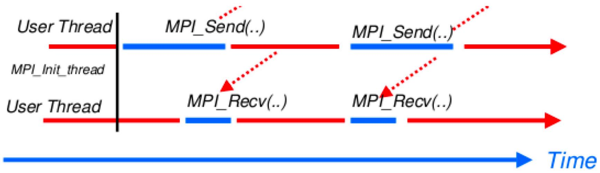

# MPI THREAD MULTIPLE例子

int main(int argc, char ** argv)   
{ int buf[100], provided; MPI_Init_thread(&argc, &argv, MPI_THREADultiple, &provided); if (provided < MPI_THREADultiple) MPI_Abort(MPI_comm_WORLD,1); #pragma omp parallel for for $(\mathrm{i} = 0;\mathrm{i} <   100;\mathrm{i} + + )$ { compute(buf[i]); /\*DoMPI stuff*/ } MPI_Final(); return 0;

# 计算与通信重叠

• 某个线程负责通信，通信过程中其余线程继续执行计算  
• 可提升整体效率，但同步与负载均衡较复杂

<table><tr><td>Fortran</td><td>C</td><td></td></tr><tr><td>include &#x27;mpif.h&#x27; program hybsing</td><td>#include &lt;mpi.h&gt; int main(int argc, char **argv) { int rank, size, ie, i; #pragma omp parallel { if (thread .eq. 0) then call MPI_Whatever&gt;(... ,ie) else &lt;work&gt;endif } $OMP end parallel end</td><td>#include &lt;mpi.h&gt; int main(int argc, char **argv) { int rank, size, ie, i; #pragma omp parallel { if (thread == 0) { ie= MPI_Whatever&gt;(...); } if (thread != 0) { &lt;work&gt; } } }</td></tr></table>

# 举例1：MPI+OpenMP计算π

• 每一个进程负责1/nproc范围的离散求和  
在每一个MPI进程内，nthreads个OpenMP线程负责局部求和计算。

$$
\pi = \int_ {0} ^ {1} \frac {4}{1 + x ^ {2}} d x \approx \sum_ {0 \leq i \leq N} \frac {4}{1 + (\frac {i + 0 . 5}{N}) ^ {2}} \times \frac {1}{N}
$$

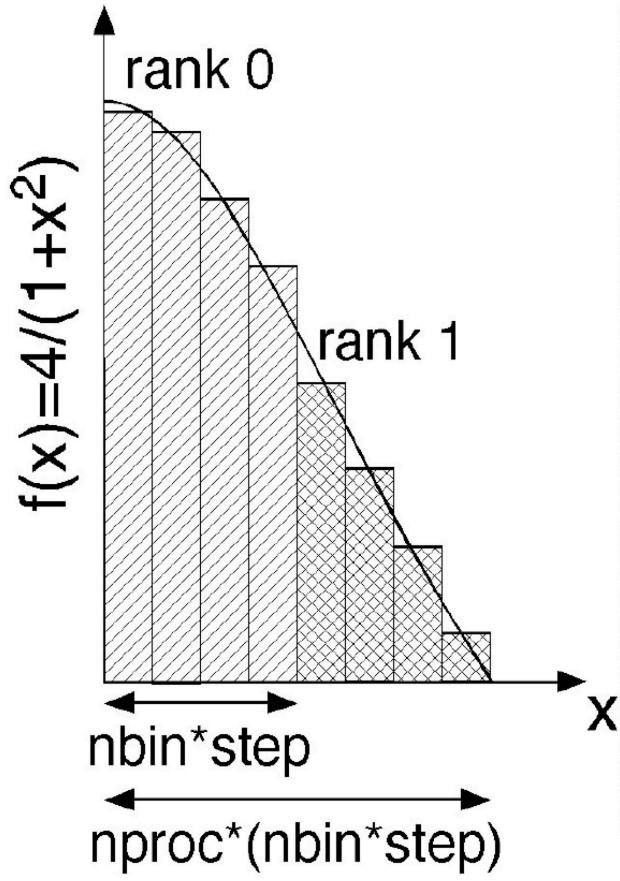

# 举例1：MPI+OpenMP计算π：hpi.c

nbin = NBIN/nproc: step = 1.0/(nbin*nproc); #pragma omp parallel private(tid)   
```c
include<stdio.h> #include<mpi.h> #include<omp.h> #define NBIN 100000 #define MAX_THREADs 8 void main(int argc,char \*\*argv){ int nbin,myid,nproc,nthreads,tid; double step,sum[MAX THREADS] = {0.0},pi=0.0,pig; MPI_Init(&argc,&argv); MPI_Comm_rank(MPICOMM_WORLD,&myid); MPI Comm size(MPI COMM WORLD,&nproc); 
```

{ int i; double x; nthreads $=$ omp_get_num Threads(); tid $=$ omp_get_thread_num(); for (i=nbin\*myid+tid; i<nbin\* (myid+1); i+=nthreads){ $\mathrm{x} = (\mathrm{i} + 0.5)^{*}$ step; sum[tid] $= 4.0 / (1.0 + \mathrm{x}^{*}\mathrm{x})$ .} printf("rank tid sum $=$ %d %d %e\n",myid,tid,sum[tid]); } for(tid=0；tid<nthreads；tid++)pi $= =$ sum[tid]\*step: MPI_Allreduce(&pi,&pig,1,MPI_DOUBLE,MPI_SUM,MPICOMM_WORLD); if (myid==0) printf("P1 $=$ %f\n",pig); MPI_Finalize();   
}

OpenMP部分

MPI部分

# 举例1：MPI+OpenMP计算π：hpi.c

# · Compilation

source /usr/usc/mpich/default/gm-intel/setup.csh mpicc -o hpi hpi.ɕ -openmp

# PBS script

```shell
#!/bin/bash
#PBS -1 nodes=2:ppn=1
#PBS -1 walltime=00:00:59
#PBS -o hpi.out
#PBS -j oe
#PBS -N hpi
source /usr/ucp/mpich/default/gm-intel/setup.sh
OMP_NUM Threads=2
export OMP_NUM Threads
WORK_HOME=/auto/rcf-12/anakano/hpc/cs596/
cd $WORK_HOME
np=$(cat $PBS_MODEFILE | wc -l)
mpirun -np $np -machinefile $PBS_MODEFILE ./hpi 
```

# ·Output

```txt
rank tid sum = 1 1 6.434981e+04  
rank tid sum = 1 0 6.435041e+04  
rank tid sum = 0 0 9.272972e+04  
rank tid sum = 0 1 9.272932e+04  
PI = 3.141593 
```

# 举例2：The Multi-Zone NAS Parallel Benchmarks

Multi-zone versions of the NAS Parallel Benchmarks   
• E.g. LU,SP, and BT

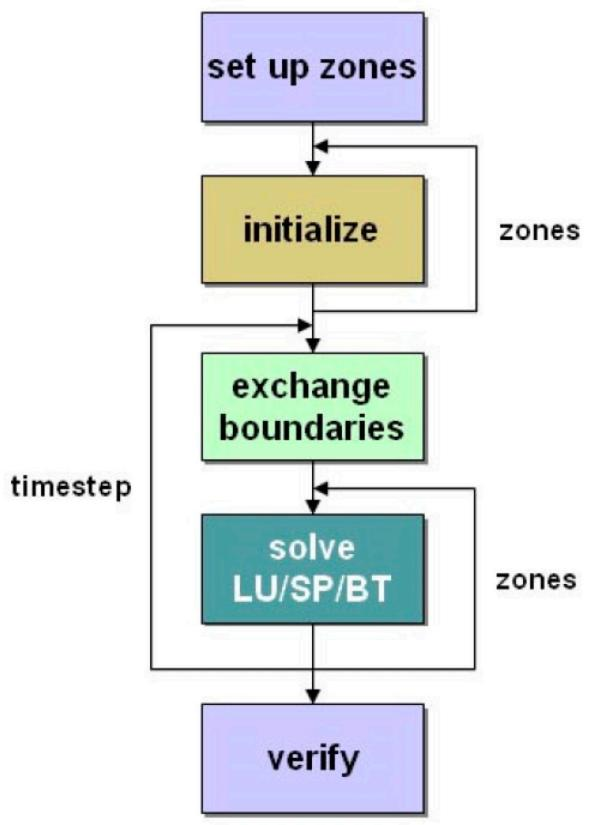

<table><tr><td></td><td>MPI/OpenMP</td></tr><tr><td>Time step</td><td>sequential</td></tr><tr><td>inter-zones</td><td>MPI
Processes</td></tr><tr><td>exchange
boundaries</td><td>Call MPI</td></tr><tr><td>intra-zones</td><td>OpenMP</td></tr></table>

# MPI/OpenMP BT-MZ

call omp_set_numthreads (weight)   
call mpi_send/recv   
do step $= 1$ ，itmax call exch_qbc(u，qbc，nx,...)

do zone $= 1$ num Zones if (iam .eq. pzone_id(zone)) then call zsolve(u,rsd,...) end if end do

```txt
enddo 
```

subroutine zsolve(u, rsd,...)   
```txt
...
!$OMP PARALLEL DEFAULT(SHARED)
!$OMP& PRIVATE(m,i,j,k...) do k = 2, nz-1 
```

```fortran
!$OMP DO
do j = 2, ny-1
do i = 2, nx-1
do m = 1, 5
u(m, i, j, k) =
dt*rsd(m, i, j, k-1)
end do
end do
end do 
```

```fortran
!$OMP END DO NOWAIT
end do
...
!$OMP END PARALLEL 
```

# MPI/OpenMP LU-MZ

call omp_set_numthreads (weight)

do step $\ l = \ 1$ ，itmax

call exch_qbc(u，qbc， nx...)

do zone $\ c = ~ 1$ ，num_zones

if (iam .eq.pzone_id(zone)） then

call ssor

end if

end do

end do

# MPI/OpenMP LU-MZ

# . Pipelined Thread Execution in SSOR

subroutine ssor
!\\(OMP PARALLEL DEFAULT(SHARED)
!\\)OMP& PRIVATE(m,i,j,k...) call sync1()
do k = 2, nz-1

```csv
! $OMP DO
do j = 2, ny-1
do i = 2, nx-1
do m = 1, 5
rsd(m, i, j, k) =
dt*rsd(m, i, j, k-1) + ...
end do
end do
end do 
```

```txt
!$OMP END DO await
end do
call sync2()
...
... 
```

```txt
!$OMP END PARALLEL 
```

subroutine sync1
...neigh =iam -1
do while (isync(neigh) .eq. 0)
! $$ OMP FLUSH(isync)
end do
isync(neigh) = 0
! $$ OMP FLUSH(isync)
...
subroutine sync2
...
neigh =iam -1
do while (isync(neigh) .eq. 1)
! $$ OMP FLUSH(isync)
end do
isync(neigh) = 1
! $$ OMP FLUSH(isync)

# Outline

• 多级混合编程概述  
• MPI+OpenMP混合编程  
• MPI+CUDA混合编程

# GPU集群

# • 三级硬件并发

• GPU层— —多处理器上运行的线程  
节点层— 将CPU、GPU和网卡绑定在一起  
• 集群层— 通过互联网络将不同节点连接在一起

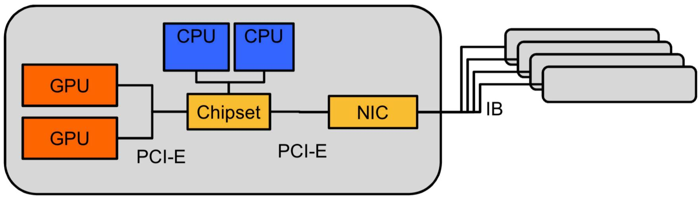

# GPU集群

# • 并发策略

• 节点内采用CUDA进行并发   
• 节点间采用MPI


# MPI+CUDA 并行模式

# • CUDA和MPI分工合作

• CUDA处理GPU层次的并发   
• MPI负责处理节点间的并发  
• 可以每一个GPU由一个MPI进程负责（不是必须）

# • 设备间的数据传输方式

• Sender：

• 将数据从设备内存拷贝到临时的host缓冲区  
• 将host缓冲区数据进行网络发送

# • Receiver

• 接收数据，将其存入host缓冲区  
• 将数据拷贝到设备内存

# MPI+CUDA数据通信

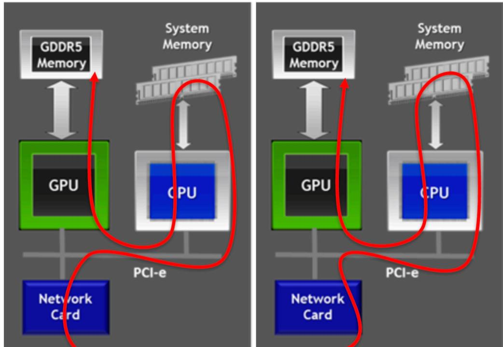

if( $0 ==$ rank）{ CUDAMemcpy(host_buffer, device_buffer, size, CUDAMemcpyDeviceToHost); MPI_Send(host_buffer, size, MPI_CHAR, 1, tag, MPICOMM_WORLD); } else{// assume MPI rank 1 MPI_Recv(host_buffer,size,MPI_CHAR,0,tag,MPICOMM_WORLD,&status); CUDAMemcy(device_buffer, host_buffer, size, CUDAMemcpyHostToDevice);   
}

1. 数据从GPU内存拷贝到host A主存  
2. 通过MPI发送到host B  
3. Host B机器接受数据放入host B 主存   
4. 将数据从host B主存拷贝到GPU 内存

# 统一寻址（Unified Memory）

# Managed memory (CUDA6.0起开始支持）

在 host 内存与device显存之间根据访问需要自动迁移数据，同时保证 host 和 device 都可访问，应用程序并不需要知道访问时数据所在位置  
需要进行显式同步（以保证前一步骤中数据更新操作全部完成）

# Unified Memory

# DramaticallyLower Developer Effort

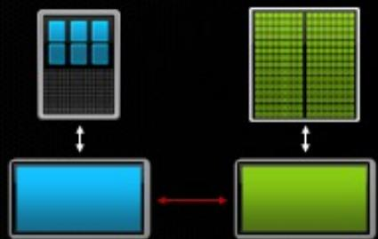  
DeveloperViewToday   
System Memory

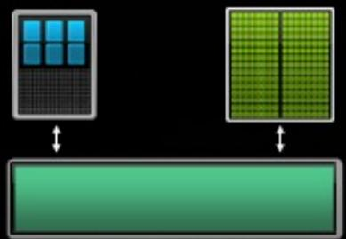  
Developer ViewWith UnifiedMemory   
UnifiedMemory

# Nvidia GPUDirect P2P

P2P(Peer-to-Peer)允许同一节点内部的多个GPU直接进行内存数据拷贝，而不需要经过主存。

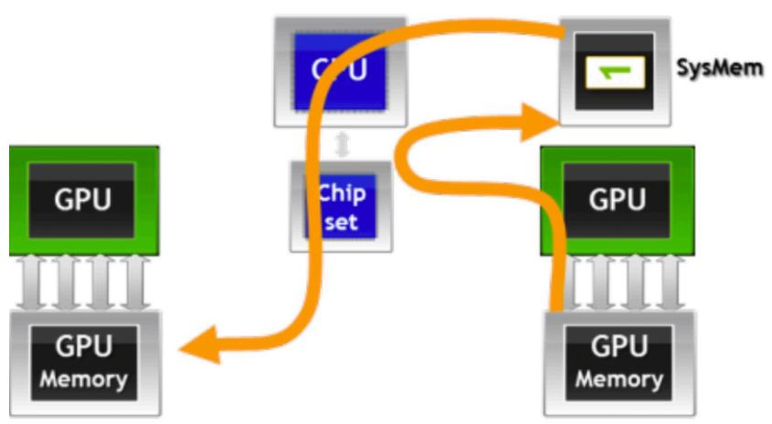  
No GPUDirect P2P

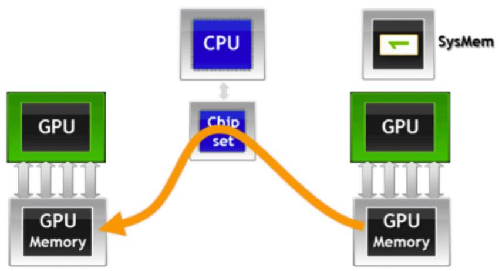  
GPUDirect P2P

# Nvidia GPUDirect RDMA

• 将数据从GPU内存直接推送到网卡，然后通过网络发送到另外一台机器。

• 避免了CPU的参与，提高了性能。  
• 同时不需要往系统主存写数据，避免了数据的额外存储与传输

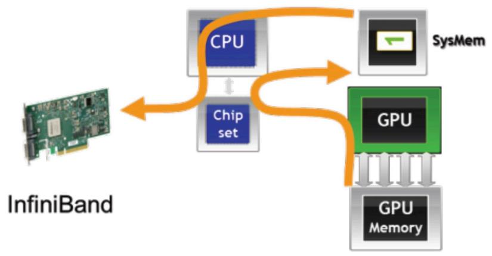  
No GPUDirect RDMA

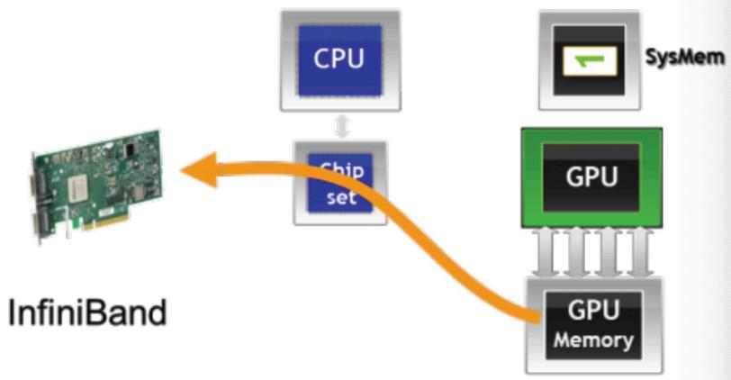  
GPUDirect RDMA

# MPI+CUDA with GPUDirect RDMA

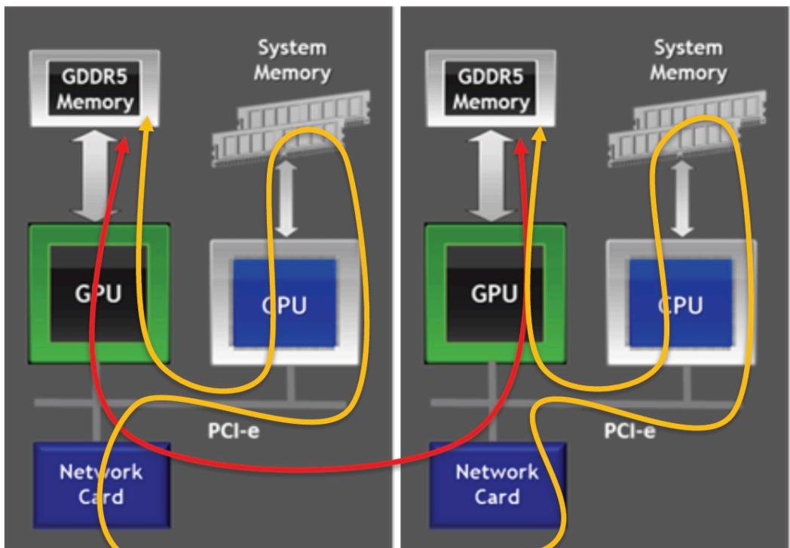

1.不在需要显式地从设备内存向CPU与系统内存进行拷贝

2.数据直接从本地发送到远程的机器。

```c
if(0 == rank) {
   udaMemcpy(host_buffer, device_buffer, size,udaMemcpyDeviceToHost);
    MPI_Send(device_buffer, size, MPI_CHAR, 1, tag, MPICOMM_WORLD);
} else { // assume MPI rank 1
    MPI_Recv(device_buffer, size, MPI_CHAR, 0, tag, MPICOMM_WORLD, &status);
   udaMemcpy(device_buffer, host_buffer, size,udaMemcpyHostToDevice);
} 
```

# 举例：MPI+CUDA计算π

Spatial Decomposition：每一个MPI进程负责1/nproc范围内的离散求和  
Interleaving：在每一个MPI进程内部，NUM_BLOCK*NUM_THREAD 个CUDA线程进行求和计算。

$$
\pi = \int_ {0} ^ {1} \frac {4}{1 + x ^ {2}} d x \approx \sum_ {0 \leq i \leq N} \frac {4}{1 + (\frac {i + 0 . 5}{N}) ^ {2}} \times \frac {1}{N}
$$

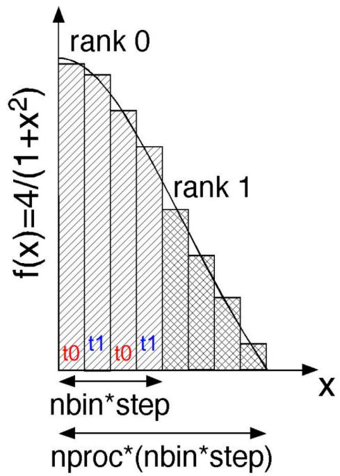

# 举例：MPI+CUDA计算π：hypi.cu (1)

```c
include<stdio.h> #include <mpi.h> #include <uda.h> 
```

```c
define NBIN 10000000 // Number of bins  
#define NUM_BLOCK 13 // Number of thread blocks  
#define NUM_THREAD 192 // Number of threads per block 
```

13个Block,每个Block192个线程  
```txt
// Kernel that executes on the CUDA device
__global__ void cal_pi(float *sum, int nbin, float step, float offset, int nthreads, int nblocks)
{
    int i;
    float x;
    int idx = blockIdx.x*blockDim.x+threadIdx.x; // Sequential thread index across blocks
    for (i=idx; i<nbin; i+=nthreads*nblocks) { // Interleaved bin assignment to threads
        x = offset + (i+0.5)*step;
        sum[idx] += 4.0/(1.0+x*x);
    }
} 
```

# 举例：MPI+CUDA计算π：hypi.cu (2)

```c
int main(int argc, char **argv) { int myid,nproc,nbin,tid; float step, offset, pi = 0.0, pig; dim3 dimGrid (NUM_BLOCK,1,1); // Grid dimensions (only use 1D) dim3 dimBlock (NUM_THREAD,1,1); // Block dimensions (only use 1D) float *sumHost,*sumDev; // Pointers to host & device arrays MPI_Init (& argc, &argv); MPI_Comm_rank (MPICOMM_WORLD, &myid); // My MPI rank MPI_Comm_size (MPI COMM_WORLD, &nproc); // Number of MPI processes nbin = NBIN/nproc; // Number of bins per MPI process step = 1.0/(float)(nbin*nproc); // Step size with redefined number of bins offset = myid*step*nbin; // Quadrature-point offset size_t size = NUM_BLOCK*NUM_THREAD*sizeof(float); // Array memory size sumHost = (float *)malloc(size); // Allocate array on host CUDAAlloc((void **) &sumDev,size); // Allocate array on device CUDAMemset (sumDev,0,size); // Reset array in device to 0 // Calculate on device (call CUDA kernel) cal_pi << dimGrid, dimBlock >> (sumDev, nbin, step, offset, NUM_THREAD, NUM_BLOCK); // Retrieve result from device and store it in host array CUDAMemcpy (sumHost, sumDev, size,udaMemcpyDeviceToHost); // Reduction over CUDA threads for(tid=0; tid<NUM_THREAD*NUM_BLOCK; tid++) pi += sumHost [tid]; pi *= step; // CUDA cleanup free (sumHost);udaFree (sumDev); printf("myid = %d: partial pi = %f\n", myid, pi); // Reduction over MPI processes MPI_Allreduce(&pi, &pig, 1, MPI_FLOAT, MPI_SUM, MPICOMM_WORLD); if (myid == 0) printf("PI = %f\n", pig); MPI_Final(); return 0; } 
```