# MapReduce编程

汤善江 副教授

天津大学智能与计算学部

tashj@tju.edu.cn

http://cic.tju.edu.cn/faculty/tangshanjiang/

# Outline

MapReduce编程模型  
• Hadoop/HDFS   
• YARN

# Outline

MapReduce编程模型  
• Hadoop/HDFS   
•YARN

# 思考问题

• 数据：10000个文本文件，英文

• 问题1。（WordCount）

• 统计各个单词在所有文件中出现的次数

. 问题2 （Inverted Index）

• 统计各个单词分别在哪些文件中出现过

• 串行算法？  
• 并行算法？

# 大数据

• 大量数据不断产生和 存储

• 电子商务  
• 社交网络  
• 图像视频   
• 科学数据

•

• 如何高效存储与处理大数据？

# SOURCES OF BIG DATA GROWTH

HITACHI

Inspire the Next


# 大数据处理挑战

• 任务计算失败

• 网络异常  
• 断电   
• 硬件故障

•大量网络通信  
• 负载不均衡

• 不同机器运行进度不一


# MapReduce起源： Google搜索


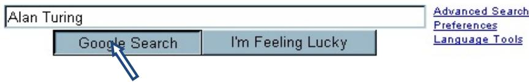

# • 每一次搜索

• 200+ CPU; 200TB以上数据; 1010 CPU周期; 0.1秒内响应; 5¢广告收入（08年数据）  
• 2012年6月数据

Google 建立的目录容量已经超过 1 亿 GB。Google 已经花费了 100 万个机器小时来构建目录。  
• 从查询开始到获得结果，搜索查询的平均旅行路程是 1500 公里。  
每天在 Google 上产生的搜索超过亿次；网页预览的平均加载时间是 1/10 秒；从 2003 年以来，Google 已经回答了 4500 亿个新查询；每天都有 16% 的新查询出现。  
Google 的排序算法会根据 200 多个信号来决定相关结果。每年，Google 对排序算法有 500 多项改进。

# Google数据中心


# MapReduce：大规模数据处理

• 处理数据（>1TB）  
• 上百/上海量千 CPU 实现并行处理  
• 简单地实现以上目的

  
Jeff Dean

MapReduce: Simplified Data Processing on Large Clusters

Jeffrey Dean and Sanjay Ghemawat

jeff@ google.com, sanjay @google.com

Google, Inc.


# MapReduce

• 编程模型

• 模型抽象简洁，程序员易用

• 大数据处理系统

• 运行于大规模分布式集群环境 (>2000节点)   
• 自动实现分布式并行计算  
• 容错和负载平衡   
• 支持任务调度和状态监控

# MapReduce编程模型

. 输入和输出：sets of <key, value> pairs   
• 用户只需要实现两个函数接口：

```txt
map (in_key, in_value) -> (out_key, intermediate_value) list 
```

• 处理<K,V> pairs  
• 产生中间结果

```erlang
- reduce (out_key, intermediate_value list) -> out_value list 
```

• 将所有相同key的中间结果的值进行归约  
• 产生出归约后的结果。

# map函数

将数据源中的记录（文本中的行、数据库中条目等）作为map函数中的(key, value)对

• 例如： （filename, line）

map()将生成一个或多个中间结果，以及与input相对应的一个output key

# reduce函数

map操作结束后，所有与某指定out key相对应的中间结果组合为一个列表（list）。  
reduce()函数将这些中间结果组合为一个或多个对应于同一output key 的 final value

• （实际上每一个output key通常只有一个final value）

# 示例： WordCount

map(String input_key, String input_value):   
```txt
// input_key: document name 
```

```txt
// input_value: document contents 
```

for each word w in input_value:   
```javascript
EmitIntermediate(w, "1"); 
```

reduce(String output_key, Iterator intermediate_values):   
```txt
// output_key: a word 
```

```rust
// output_values: a list of counts 
```

int result = 0;   
```txt
for each v in intermediate_values: 
```

result $+ =$ ParseInt(v);   
```txt
Emit(AsString(result)); 
```

MapReduce handles all the other details!

# 示例1： WordCount

# • 源数据

• Page 1:   
. the weather is good   
• Page 2:   
• today is good   
• Page 3:   
good weather is good

# Map输入 (wordCount)

• Worker 1   
• (Page 1, “the whether is good”).   
• Worker 2   
• (Page 2, “today is good”).   
• Worker 3   
• (Page 3, “good weather is good”).

# Map输出 (wordCount)

• Worker 1   
• (the, 1), (weather, 1), (is, 1), (good, 1).   
• Worker 2   
• (today, 1), (is, 1), (good, 1).   
• Worker 3   
• (good, 1), (weather, 1), (is, 1), (good, 1).

# Reduce输入 (wordCount)

• Worker 1   
• (the,1).   
• Worker 2:   
• (is, 1), (is, 1), (is, 1)   
• Worker 3:   
(weather, 1), (weather, 1)   
• Worker 4:   
• (today, 1)   
• Worker 5:   
• (good, 1), (good, 1), (good, 1), (good, 1)

# Reduce输出 (wordCount)

• Worker 1   
• (the,1).   
• Worker 2:   
• (is, 3)   
• Worker 3:   
• (weather, 2)   
• Worker 4:   
• (today, 1)   
• Worker 5:   
• (good, 4)

# 示例2： Inverted Index

问题：统计各个单词分别在哪些文件中出现过  
• 文件内容：

• foo   
• This page contains so much text   
• bar   
• My page contains text too

# 示例2： Inverted Index

map(String input_key, String input_value):   
```txt
// input_key: document name 
```

```txt
// input_value: document contents 
```

for each word w in input_value:   
```javascript
EmitIntermediate(w, input_key); 
```

reduce(String output_key, Iterator intermediate_values):   
```txt
// output_key: a word 
```

```rust
// output_values: a list of counts 
```

String result = ””;   
```txt
for each v in intermediate_values: 
```

result += “ ”+ v;   
```txt
Emit(AsString(result)); 
```

# Map输入 (Inverted Index)

• Worker 1   
(foo, “This page contains so much text”).   
• Worker 2   
• (bar, “My page contains text too”).

# Map输出 (Inverted Index)

# • Worker 1

(this, “foo”), (page, “foo”), (contains, “foo”), (so, “foo”), (much, “foo”), (text, “foo”).

# • Worker 2

(My, “bar”), (page, “bar”), (contains, “bar”), (text, “bar”), (too, “bar”).

# Reduce输入 (Inverted Index)

• Worker 1   
• (this, foo).   
• Worker 2:   
• (page, foo), (page, bar)   
• Worker 3:   
• (contains, foo), (contains, bar)   
• Worker 4:   
• (so, foo)   
• Worker 5:   
• (much, foo)   
Worker 6:   
• (text, foo), (text, bar)   
• Worker 7:   
• (too, bar)   
• Worker 8:   
• (My, bar)

# Reduce输出 (Inverted Index)

• Worker 1   
• (this, “foo”).   
• Worker 2:   
• (page, “foo bar”)   
• Worker 3:   
• (contains, “foo bar”)  
• Worker 4:   
• (so, “foo”)   
• Worker 5:   
• (much, ”foo”)   
Worker 6:   
• (text, “foo bar”)   
• Worker 7:   
• (too, “bar”)   
• Worker 8:   
(My, “bar”)

# Data Flow (Inverted Index)

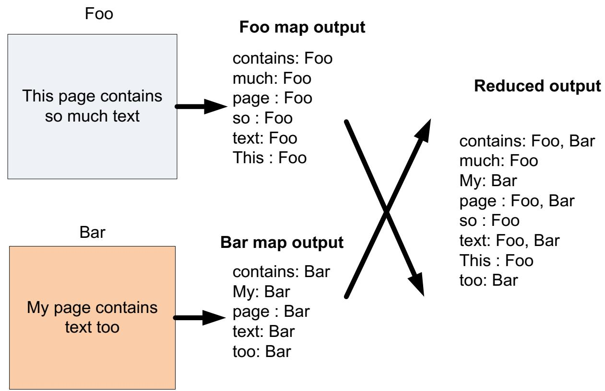

# MapReduce逻辑过程

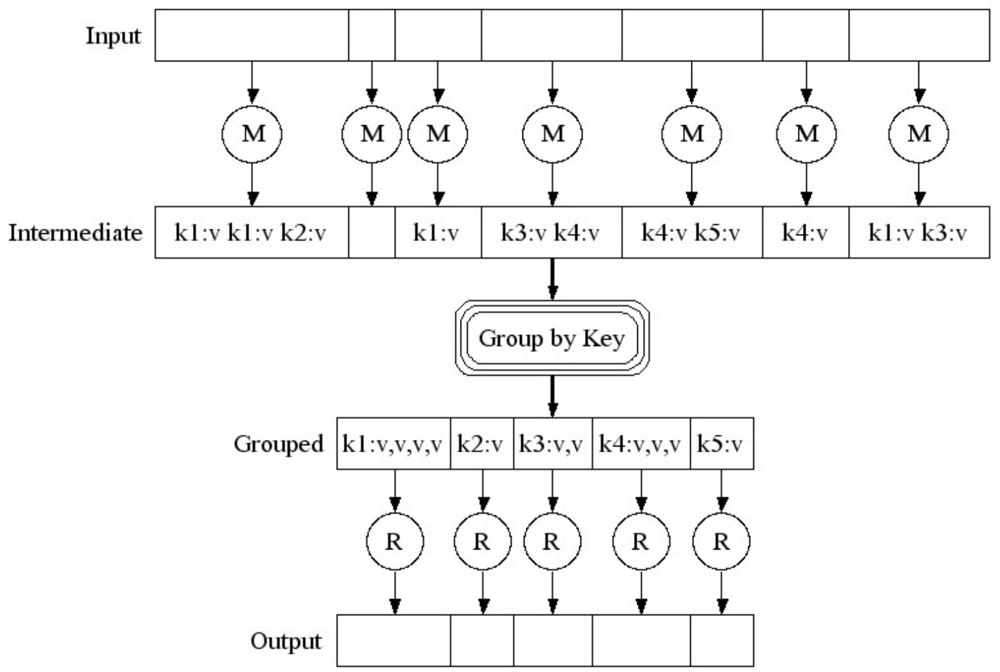

# MapRduce并行化运行

map()并行执行，不同的输入数据集生成不同的中间结果  
• reduce()并行执行，分别处理不同的output key  
• map和reduce的处理过程中不发生通信  
• 瓶颈：当map处理全部结束后，reduce过程才能够开始


# Outline

MapReduce编程模型  
• Hadoop/HDFS   
• YARN

# Hadoop


Hadoop是一个分布式系统基础架构，由Apache基金会开发。用户可以在不了解分布式底层细节的情况下，开发分布式程序。充分利用集群的威力高速运算和存储。  
• 由Doug Cutting创建。

• Apache Lucene: 开源搜索引擎  
• Apache Nutch: 基于Lucene的Web搜索实现

• 是对Google所提出的MapReduce、GFS、BigTable等模型的一个开源实现。

  
Doug Cutting

# MapReduce实现： hadoop

<table><tr><td>Google calls it:</td><td>Hadoop equivalent:</td></tr><tr><td>MapReduce</td><td>Hadoop</td></tr><tr><td>GFS</td><td>HDFS</td></tr><tr><td>Bigtable</td><td>HBase</td></tr></table>

# Hadoop集群逻辑结构


# Hadoop Workflow

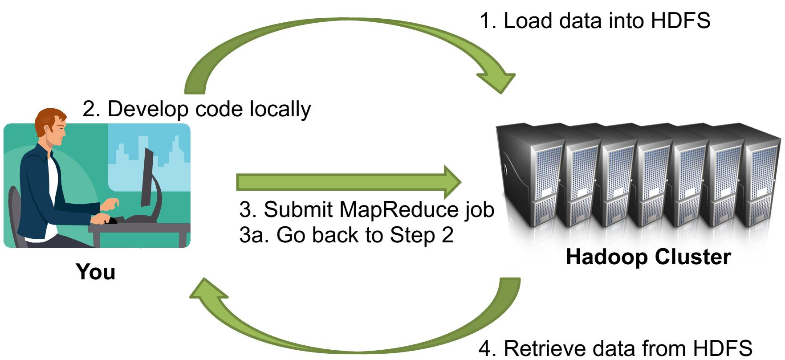

# 任务管理（调度）

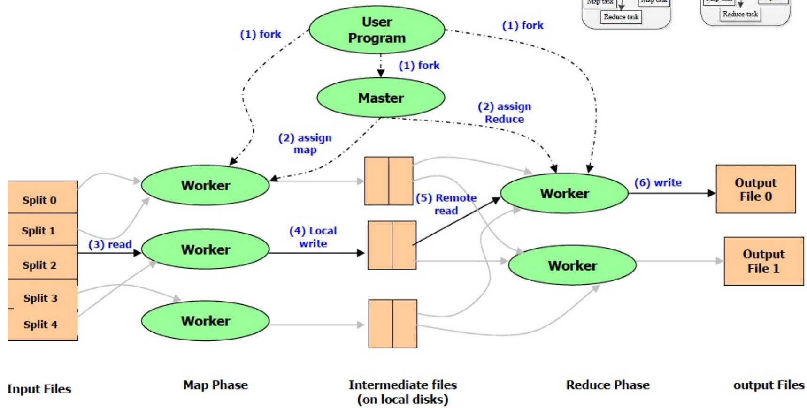

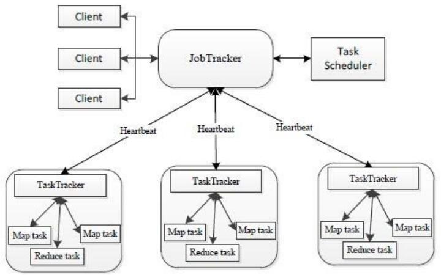

# Map中间结果处理：Shuffle 和 Sort

• 当Map 开始产生输出时，并不是简单的把数据写到磁盘，因为频繁的磁盘操作会导致性能严重下降。它的处理过程更复杂，数据首先是写到本地内存中的一个缓冲区，并进行预排序，以提升效率。

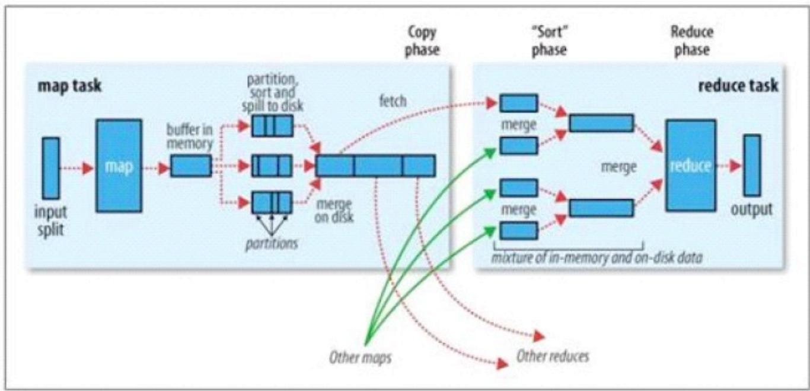

# Map的结果输出

• 每个Map 任务都有一个用来写入输出数据的循环内存缓冲区。

• 这个缓冲区默认大小是100MB。

• 当缓冲区中的数据量达到一个特定阀值(默认是0.80)，系统将会启动一个后台线程把缓冲区中的内容spill 到磁盘。

在spill 过程中，Map 的输出将会继续写入到缓冲区，但如果缓冲区已满，Map 就会被阻塞直到spill 完成。

# Map输出结束

• 每当内存中的数据达到spill 阀值的时候，都会产生一个新的spill 文件

所以在Map任务写完它的最后一个输出记录时，可能会有多个spill 文件。

在Map 任务完成前，所有的spill 文件将会被归并排序为一个索引文件和数据文件  
• 当spill 文件归并完毕后，Map 将删除所有的临时spill 文件，并告知TaskTracker 任务已完成

# Map输出的压缩

如果设定了Combiner，将在排序输出的基础上运行。  
§ Combiner 就是一个Mini Reducer，它在执行Map 任务的节点本身运行，先对Map 的输出做一次简单Reduce，使得Map 的输出更紧凑，更少的数据会被写入磁盘和传送到Reducer。

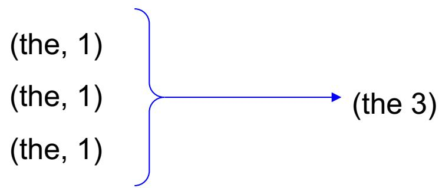

# Reduce数据拷贝

Map 的输出文件放置在运行Map 任务的TaskTracker 的本地磁盘上，它是运行Reduce 任务的TaskTracker 所需要的输入数据。  
Reduce 任务的输入数据分布在集群内的多个Map 任务的输出中，Map 任务可能会在不同的时间内完成，只要有其中的一个Map 任务完成，Reduce 任务就开始拷贝它的输出。这个阶段称之为拷贝阶段。  
Reduce 任务拥有多个拷贝线程， 可以并行的获取Map 输出。线程数默认是5。

# Reduce归并

• 拷贝来的数据叠加在磁盘上，有一个后台线程会将它们归并为更大的排序文件，节省后期归并的时间。  
• 当所有的Map 输出都被拷贝后，Reduce 任务进入归并排序阶段

• 对所有的Map 输出进行归并排序，这个工作可能会重复多次。

假设有50 个Map 输出（可能有保存在内存中），并且归并因子是10，则最终需要5 次归并。

• 每次归并会把10个文件归并为一个，最终生成5 个中间文件。  
之后，系统不再把5 个中间文件归并成一个文件，而是排序后直接提交给Reduce 函数，省去向磁盘写数据这一步。

# Hadoop的数据存储系统：HDFS

• 基于块的文件存储

•按块进行复制的形式放置，随机选择存储节点  
• 副本的默认数目是3   
. 默认的块的大小是64MB

• 减少元数据的量  
• 有利于顺序读写（在磁盘上数据顺序存放）

• 适合于 MapReduce应用程序  
• 依据Google File System的设计编写

# HDFS体系结构 （逻辑）

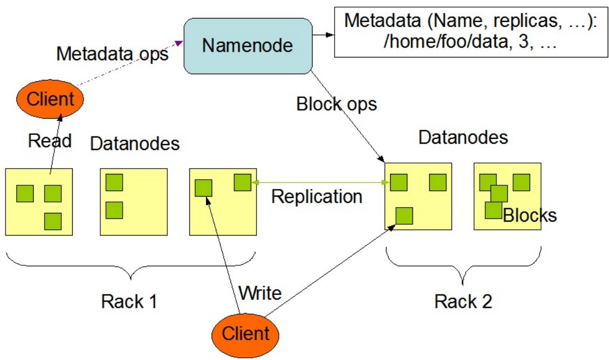  
HDFS Architecture

# HDFS体系结构（文件系统）

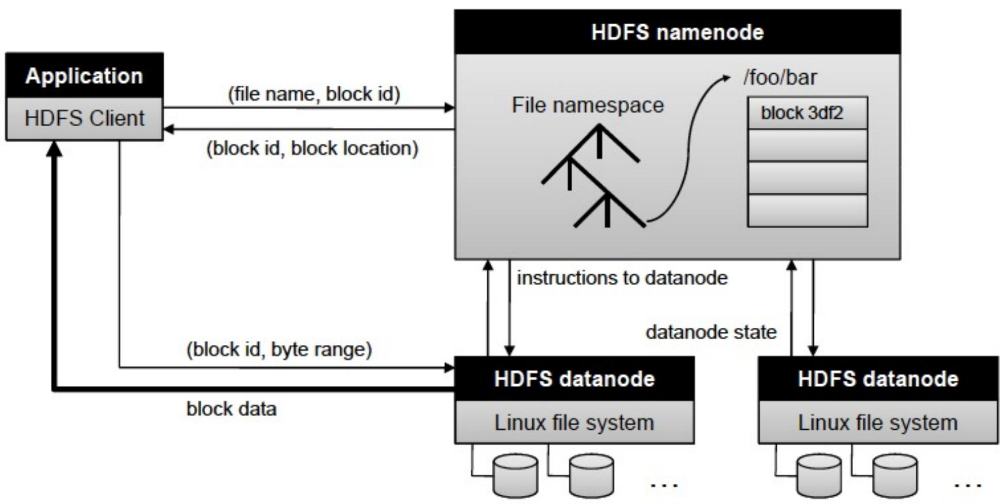

# HDFS数据分布设计（副本）

# Block Replication

Namenode (Filename, numReplicas, block-ids,...)

/users/sameerp/data/part-0, r:2, {1,3},...

/users/sameerp/data/part-1,r:3,{2,4,5)},...

# Datanodes

1

2

2

1

4

5

4

3

5

4

# HDFS文件系统的特征

• 存储规模大  
• 大规模数据，大量存储节点，支持大文件。  
• 高可靠   
• 单个或者多个节点失效，对系统不会造成任何影响。  
• 高可扩展  
能简单加入更多服务器的方式便可服务更多的客户端。  
为MapReduce优化  
• 数据尽可能根据其本地局部性进行访问与计算。

# HDFS适应的场景

大文件，顺序读。

HDFS对顺序读进行了优化，但随机的访问负载较高。

• 数据支持一次写入，多次读取。

• 不支持数据更新。

• 数据不进行本地缓存

• 文件很大，且顺序读没有局部性

任何一台服务器都有可能失效，需要通过大量的数据复制使得性能不会受到大的影响。

# Outline

MapReduce编程模型  
Hadoop/HDFS   
• YARN

# 第一代Hadoop的缺陷

• 单点故障：JobTracker只有一个

• JobTracker负责接收来自各个TaskTracker节点的RPC请求，压力会很大，限制了集群的扩展；随着节点规模增大之后，JobTracker就成为一个瓶颈  
• 集群包含的节点超过 4,000 个时（其中每个节点可能是多核的），就会表现出一定的不可预测性

• 仅支持MapReduce计算框架  
• 资源利用率低

# 第二代MapReduce框架

# HADOOP 1.0

# MapReduce

(clusterresourcemanagement &data processing)

# HDFS

(redundant,reliablestorage)

# HADOOP 2.0

# MapReduce

(dataprocessing)

# Others

(dataprocessing)

# YARN

(clusterresourcemanagement)

# HDFS

(redundant,reliable storage)

# YARN (MPv2)

• 将JobTracker的两个主要功能（资源管理和作业调度/监控）分离

• 创建一个全局的ResourceManager（RM）和若干个针对应用程序的ApplicationMaster（AM）。  
应用程序可以是传统的MapReduce作业或作业的DAG（有向无环图）。

# YARN (MPv2)

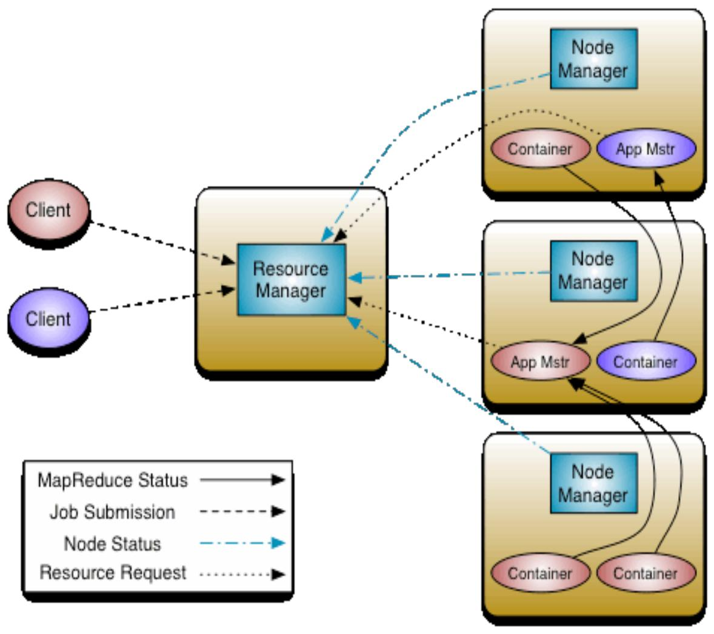

# ResourceManager (RM)

• 控制整个集群并管理应用程序向基础计算资源的分配，主要由两个组件构成：

• 调度器（Scheduler）  
应用程序管理器（Applications Manager）

• 调度器不参与与具体应用程序相关的工作，不负责监控或者跟踪应用的执行状态等，也不负责重启任务，这些均由应用程序相关的ApplicationMaster完成。  
• 调度器是一个可插拔的组件，用户可根据自己的需要设计新的调度器，YARN提供了多种直接可用的调度器，比如Fair Scheduler和Capacity Scheduler等。

# ApplicationMaster (AM)

每个应用程序均包含一个AM，主要功能包括：

与RM调度器协商以获取资源（用Container表示）；  
• 将得到的任务进一步分配给内部的任务(资源的二次分配)；  
• 与NM通信以启动/停止任务；  
• 监控所有任务运行状态，并在任务运行失败时重新为任务申请资源以重启任务。

# NodeManager (NM)

• NM是每个节点上的资源和任务管理器

• 定时地向RM汇报本节点上的资源使用情况和各个Container的运行状态；  
• 接收并处理来自AM的Container启动/停止等各种请求。

# Container

• Container是YARN中的资源抽象  
• 封装了某个节点上的多维度资源，如内存、CPU、磁盘、网络等  
• 当AM向RM申请资源时，RM为AM返回的资源便是用Container表示。  
• YARN会为每个任务分配一个Container，且该任务只能使用该Container中描述的资源。

# YARN工作原理

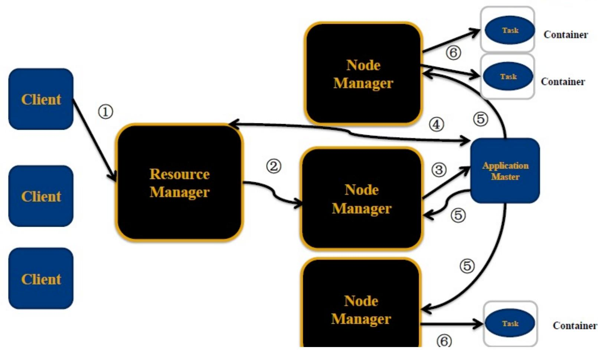