# 并行算法设计

汤善江 副教授

天津大学智能与计算学部

tashj@tju.edu.cn

http://cic.tju.edu.cn/faculty/tangshanjiang/

# 大纲

- 并行算法设计概述  
- 基本的并行算法设计方法

- 串行算法的直接并行化  
- 从问题描述开始设计并行算法  
- 借用已有算法求解新问题

- 小结

# 大纲

- 并行算法设计概述  
- 基本的并行算法设计方法

- 串行算法的直接并行化  
- 从问题描述开始设计并行算法  
- 借用已有算法求解新问题

- 小结

# 如何进行并行计算

- 应用问题的本质

- 计算密集？数据分析？  
- 是否可以分解为可并发执行的子任务？

- 并行算法分析与设计

- 可用的计算资源

- 现有平台各层次硬件参数？  
- 自行定制平台？

- 设计和实现解决方案

- 使用商业/开源软件？  
- 基于中间件开发新程序？  
- 从底层开始设计开发新程序？


# 并行算法的定义

- 算法：计算指令序列（逻辑）

A prescribed set of well - defined rules or processes for the solution of a problem in a finite number of steps （IEEE）

- 串行算法：只有一组计算指令  
- 并行算法：一些可同时执行的计算任务的集合，这些计算任务分工合作获得给定问题的求解。

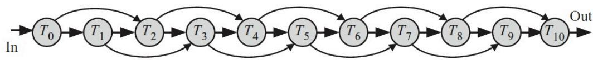  
(a)

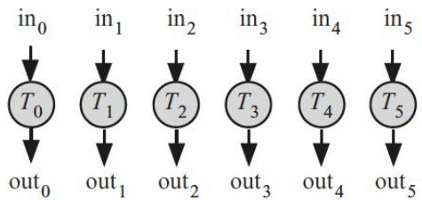  
(b)

  
（c）

# 并行算法设计思想

- 并行算法设计并不是串行算法设计的进阶

串行算法的设计思想，一般都基于冯式架构，指令逻辑顺序清晰  
- 并行计算硬件环境没有统一的体系结构

- 并行算法中部分计算过程可以是串行算法  
- 串行算法中的部分计算过程也可以并行化  
- 并行算法的设计，与问题本身以及硬件平台均相关  
问题类型与硬件平台类型的组合，能够形成并行算法（程序）设计的模式  
- 并行算法的类型  
- 计算密集？数据密集？  
- 数据结构与算法密不可分

# 并行算法与程序设计


# 设计并行算法一般策略

- 分析现有串行算法中固有的并行性，直接将其并行化

- 该方法并不是对所有问题都可行，但对很多应用问题仍不失为一种有效的方法

从问题本身的描述出发，根据问题的固有属性，从头设计一个全新的并行算法

- 这种方法有一定难度，但所设计的并行算法通常更高效

- 借助已有的并行算法求解新问题。

主要参考资料：并行计算-结构-算法-编程，陈国良

# 大纲

- 并行算法设计概述  
- 基本的并行算法设计方法

串行算法的直接并行化  
- 从问题描述开始设计并行算法  
- 借用已有算法求解新问题

- 小结

# 串行算法的直接并行化

# - 方法

- 发掘和利用现有串行算法中的并行性，直接将串行算法改造为并行算法。

# - 特点

- 由串行算法直接并行化的方法是并行算法设计的最常用方法之一；  
- 不是所有的串行算法都可以直接并行化；  
- 一个好的串行算法未必能并行化为一个好的并行算法；  
- 许多数值串行算法可以并行化为有效的数值并行算法。

# 示例1: 数组求和

- 数据分解

- 按块均分  
- 分治  
. C C

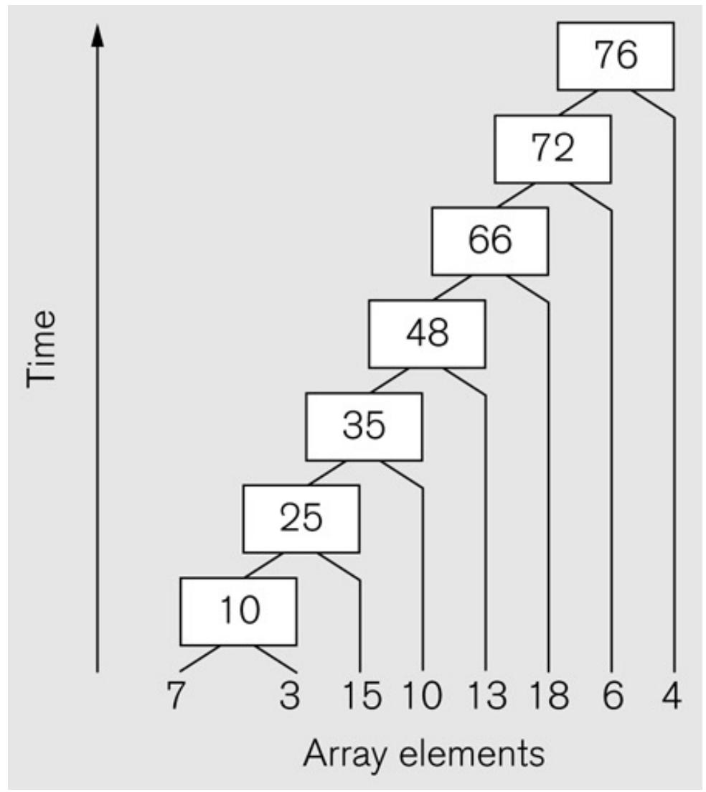

# 示例1: 数组求和（平衡树）

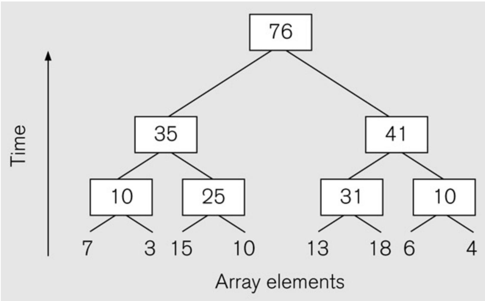

# 示例2: 排序

- 并行排序研究的必要性：

排序是计算机所需要经常完成的操作。由于排序后的数据常常比无序的数据更容易处理（比如查找的效率更高），所以很多算法要求数据是排序的。大数据量的排序在单个处理器上串行执行需要消耗大量的时间，这就提出了并行排序的需求。

- 常用的排序算法大多是基于比较（Comparison-based）的排序，已经 $i \mathbf { \overline { { k } } }$ 明，这类排序算法的最低时间复杂度是 $o ( n \log n )$ ，其中n是待排序的元素数目。

# 并行排序的几个关键问题

- 串行排序算法的并行化需要把待排序的元素分布到各个处理器上，在这过程中有几个问题需要解决。

- 数据如何分配到不同的处理器上  
不同处理器上的元素 $\frac { 4 } { 3 } \sigma$ 何进行大小比较

# 问题1: 数据如何分配到不同的处理器

可以把所有数据放在一个结点上，其它结点从此结点取数据并把处理结果再回送给此结点。  
- 很多情况下要求源数据和处理结果数据都分布在不同的结点上，这就要考虑数据的分布问题。  
2. 一个直观的办法是把所有参与排序的处理器和数据编号，源数据按照其编号取模分布到相应的处理器上。  
- 排序结果在各个处理器上均匀分布，满足小编号处理器上的每个元素均小于大编号处理器上的每个元素。

# 问题2:不同处理器上的元素如何进行大小比较

比较操作和位置交换操作是排序算法中的基本操作，它们在串行程序中都很容易实现，因为要比较大小或交换位置的两个元素都在存储空间中。而在并行算法中，这些操作并不是想象的那么容易，因为两个元素分别位于不同的结点上。  
- 考虑一种极端的情况，待排序的元素与处理器的个数一样多，这样每个处理器上存储一个待排序元素。假定在算法执行过程中，两个处理器Pi和Pj要比较它们的元素ai和aj，比较结束后，Pi上要存储两个元素中较小的一个，而Pj则存储较大的一个。  
- 如何完成比较呢？

# Message-Passing Compare and Exchange Version 1

P1 sends A to P2, which compares A and B and sends back B to P1 if A is larger than B (otherwise it sends back A to P1):

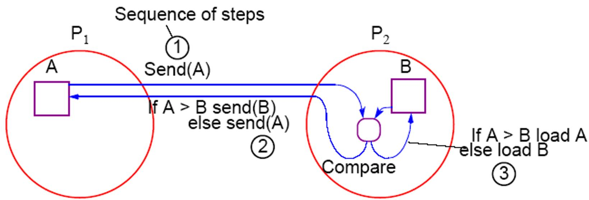

# Alternative Message Passing Method Version 2

For P1 to send A to P2 and P2 to send B to P1. Then both processes perform compare operations. P1 keeps the smaller of A and B and P2 keeps the larger of A and B:


NOTE: Different processors operating at different precision could Conceivably produce different answers if real numbers are being compared.

# 多个元素扩展

- 再来看每个处理器上存储多个待排序元素的情况。设处理器个数为p，待排序元素数目为n，则每个处理器上平均有n/p个元素。  
- 定义每个处理器上的所有元素为一个超元素，定义超元素之间的大小关系。当一个超元素E1中的所有元素都不大于另一个超元素E2中的任何元素时，定义为E1≤E2。同理定义等于 $( = )$ 、小于等于 $( \geq )$ 等关系。与普通元素不同的是，两个超元素之间可能不是≥、＝、≤中的任何一个。容易验证，超元素之间的 $\leq$ 关系满足传递性。  
- 来看两个编号相邻的处理器之间 $\frac { 4 } { 3 } \sigma$ 何进行元素比较。与每个处理器上一个元素的情形类似，每个处理器把超元素发给对应的处理器，每个处理器在接受到对方的超元素后，合并两个超元素并排序（归并排序），然后Pi取值较小的一半，而Pj则取值较大的一半。整个过程分四步：通信-比较-合并-拆分

# Merging Two Sublists — Version 1

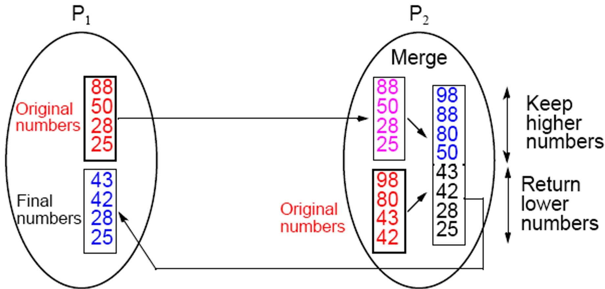  
p processors and n numbers. n/p numbers assigned to each processor:

# Merging Two Sublists — Version 2


# 枚举排序

- 枚举排序是一种最简单的排序算法  
- 该算法的具体思想是（假设按关键字递增排序），对每一个待排序的元素统计小于它的所有元素的个数，从而得到该元素最终处于序列中的位置。  
- 假定待排序的n个数存在a[1]…a[n]中。首先将a[1]与a[2] …a[n]比较，记录比其 $\lrcorner \mathbf { J } \cdot$ 的数的个数，令其为k，a[1]就被存入有序的数组b[1]…b[n]的 ${ \mathsf { b } } [ \mathsf { k } + 1 ]$ 位置上；然后将a[2]与a[1]，a[3]…a[n]比较，记录比其 $\lrcorner \mathbf { J } \cdot$ 的数的个数，依此类推。时间复杂度为O（n2）。

# 枚举排序串行算法

输入：a[1]…a[n]

输出：b[1]…b[n]

Begin

for i=1 to n do

(1) k=1   
(2) for j=1 to n do

if a[i]>a[j] then

k=k+1

end if

end for

(3) b[k]= a[i]

end for

End

# 枚举排序的并行算法

对该算法的并行化是很简单的，假设对一个长为n的输入序列使用n个处理器进行排序，只需每个处理器负责完成对其中一个元素的定位，然后将所有的定位信息集中到主进程中，由主进程负责完成所有元素的最终排位。

# 枚举排序的并行算法

输入：无序数组a[1]…a[n]

输出：有序数组b[1]…b[n]

步骤⑵的时间复杂度为O（n）；步骤⑶中主进程完成的数组元素重定位操作的时间复杂度为O（n），通信复杂度分别为O（n）；同时⑴中的通信复杂度为O（n2）；所以总的计算复杂度为O（n），总的通信复杂度为O（n2） 。

# Begin

(1) P0播送a[1]…a[n]给所有Pi   
(2) for all Pi where 1≤i≤n para-do

(2.1)k=1   
(2.2)for j = 1 to n do

$$
\begin{array}{l} i f (a [ i ] > a [ j ]) t h e n \\ k = k + 1 \\ \end{array}
$$

end if

end for

(3) P0收集k并按序定位

End

# 冒泡排序串行算法

- 串行冒泡排序算法包括两个循环，每次操作比较两个相邻的元素，然后通过交换使之符合指定的排序。  
- 以下是串行冒泡排序算法：

void BUBBLE_SORT(n)  
{ for i:=n-1 down to 1 do  
    for j:=1 to i do  
        compare-exchange $(a_j, a_{j+1})$ ;  
}

# 冒泡排序的步骤


# 冒泡排序

- 冒泡排序顺次比较相邻的元素，这在本质上是一个串行的过程，很难并行化。将顺次的比较过程并行化将导致算法错误，得不到预想的结果。  
- 考虑到内循环的下一次迭代的“冒泡”动作可以在前一次迭代完成之前开始，只要下一次“冒泡”动作不影响前一次迭代，所以可以开发流水线并行算法。

# 冒泡排序并行化（流水线并行）

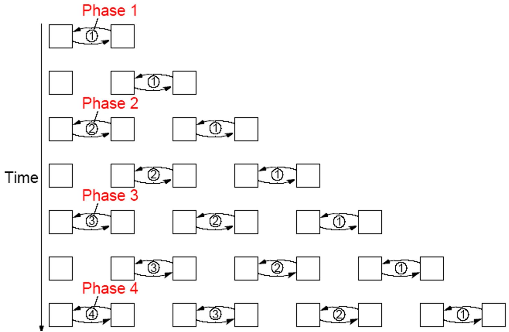

# 奇偶置换冒泡排序

设待排序的元素数目为n，以n为偶数来说明奇偶置换排序。奇偶置换排序用n个阶段完成对n个元素的排序，每一个阶段需要 ${ \mathsf n } / 2$ 个比较 $\cdot ^ { + }$ 交换操作。这n个阶段分成两类，分别称为奇操作阶段和偶操作阶段。  
设 $\left. { a _ { 1 } , a _ { 2 } , . . . , K , . . . , a _ { n } } \right.$ 是待排序的序列，在每个奇操作阶段，奇数索引的元素与自 $z$ 的右邻居进行比较并在必要时交换，同样，在每个偶操作阶段，偶数索引的元素与自己的右邻居进行比较和交换。  
- 经过n个阶段进行这样的操作后，整个序列便处于有序状态。

# 对8个数进行奇偶互换排序


# 串行奇偶置换冒泡排序程序

void ODD-EVEN(n)   
{ for( $\mathrm{i} = 1$ ,i<=n,i++) if i is odd then for(j=0,j<=n/2-1,j++) compare-exchange(a2j,a2j+1); if i is even then for( j=1, $j <   =$ n/2-1,j++) compare-exchange(a2j-1,a2j); }

# 串行奇偶置换冒泡排序的并行化

```c
void ODD-EVEN_PAR(n)   
{ id=processor's label for( i=1,i<= n,i++) { if i is odd then if id is odd then compare-exchange_min(id+1); else compare-exchange_max(id-1); if i is even then if id is even then compare-exchange_min(id+1); else compare-exchange_max(id-1); } 
```

# 大纲

- 并行算法设计概述  
- 基本的并行算法设计方法

- 串行算法的直接并行化  
- 从问题描述开始设计并行算法  
- 借用已有算法求解新问题

- 小结

# 从问题描述开始设计并行算法

# - 方法

从问题本身描述出发，不考虑相应的串行算法，设计一个全新的并行算法。

# - 特点

挖掘问题的固有特性与并行的关系；  
设计全新的并行算法是一个挑战性和创造性的工作。

# 示例:求前缀和

- 数组 $\mathsf { A } = \{ \mathsf { a } _ { 0 } , \mathsf { a } _ { 1 } , \mathsf { a } _ { 2 } , \ldots \mathsf { a } _ { \mathsf { n } } \}$   
- 求数组 $\mathsf { B } = \{ \mathsf { b } _ { 0 } , \mathsf { b } _ { 1 }$ , b2, … bn}

- 令 $\mathsf { \Omega } . \mathsf { b } _ { \mathrm { i } } = \mathsf { s u m } ( \mathsf { a } _ { 0 } \mathrm { t o } \mathsf { a } _ { \mathrm { i } } )$

$$
\begin{array}{l} \mathsf {b} [ 0 ] = \mathsf {a} [ 0 ]; \\ \text {f o r} (i = 1; i <   n; i + +) \\ b [ i ] = b [ i - 1 ] + a [ i ] \\ \end{array}
$$

- 串行算法，每次迭代依赖于上一次的结果  
. 无法直接对循环进行拆分

# 并行求前缀和

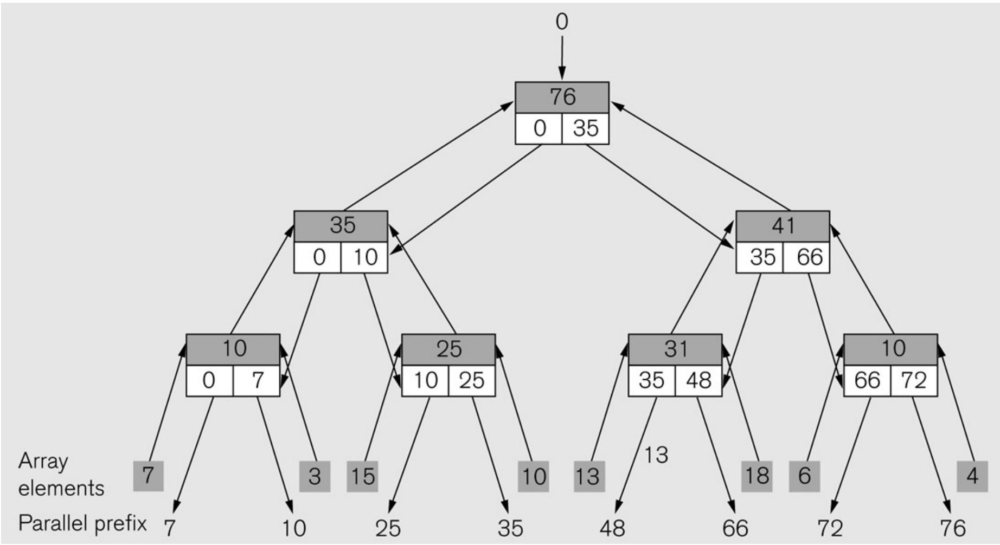

# 并行求前缀和

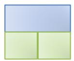


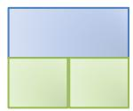

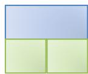


7

3

15

10

13

18

6

M

# 并行求前缀和

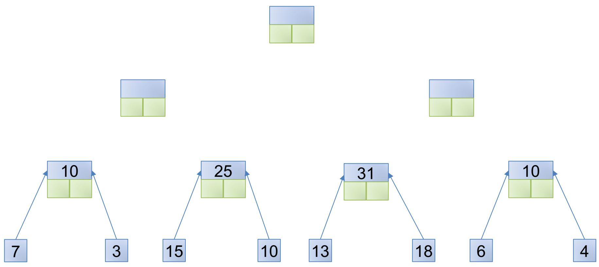

# 并行求前缀和


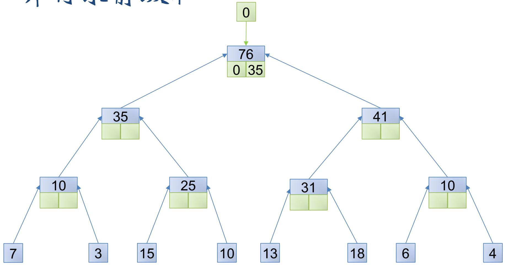  
并行求前缀和

  
并行求前缀和

  
并行求前缀和

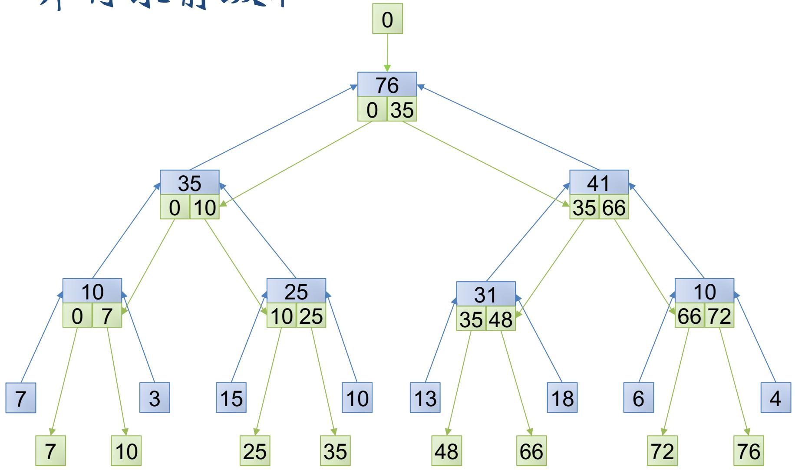  
并行求前缀和

# 并行求前缀和（另一算法）

$$
f o r (i = 1; i <   n; i + +)
$$

$$
A [ i ] = A [ i ] + A [ i - 1 ]
$$


for $\scriptstyle \dot { ] } = \Theta$ $\scriptstyle { \mathrm { j } } < { \mathsf { n } }$ $\mathrm { j } + +$ ) do_in_parallel

$\mathsf { r e g \mathrm { _ { - } j } = A [ j ] }$ ；

for ( $\scriptstyle \dot { 1 } = 0$ ；i<ceil(log(n)); $\mathrm { i } + +$ ） do

for (j = pow(2,i)；j<n; ${ \mathrm { j } } + +$ )do_in_parallel{

reg-j $+ =$

}

求log(n)，向上取整，外循环次数

内层循环，自第2i个数开始

# 附：MPI_Scan（仅参考）

每一个进程都对排在它前面的进程进行归约操作。  
§MPI_SCAN调用的结果是，对于每一个进程i，它对进程0,...,i的发送缓冲区的数据进行指定的归约操作，结果存入进程i的接收缓冲区。

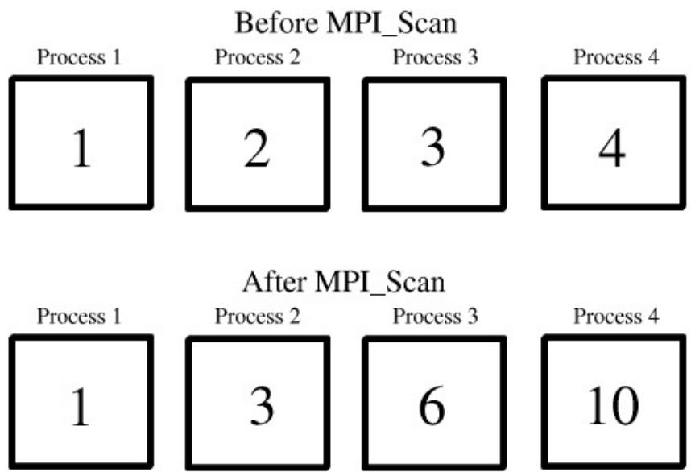

# 大纲

- 并行算法设计概述  
- 基本的并行算法设计方法

- 串行算法的直接并行化  
- 从问题描述开始设计并行算法  
- 借用已有算法求解新问题

- 小结

# 借用已有算法求解新问题

# - 方法

- 找出求解问题和某个已解决问题之间的联系；  
- 改造或利用已知算法应用到求解问题上。

# - 特点

- 这是一项创造性的工作。

# 3PCF （三点相关函数）

- 定义：

- 点集D、R。  
- 定义D中的点为ai∈D  
定义R中的点为bi∈R。  
- 距离：r1、r2、r3、err

- 求：

- 满足以下条件的三元组（空间中三角形）的数目

$$
\cdot <   a _ {i}, b _ {m}, b _ {n} >, \left| a _ {i} - b _ {m} \right| = r _ {1} \pm \text {e r r} \text {且} \left| a _ {i} - b _ {n} \right| = r _ {2} \pm \text {e r r} \text {且} \left| b _ {m} - b _ {n} \right| = r _ {3} \pm \text {e r r}
$$

- 直接解法：

- 对于D中每一点ai，在R中找到与之距离为 $\mathbf { r } _ { 1 }$ 的点集 $\mathrm { R } '$ ，找到与之距离为 $\mathbf { r } _ { 2 }$ 的点集R’’。在点集R’与R’’中，查找两 $\sum \limits _ { i = 1 } ^ { k }$ 间距离为 $\mathbf { r } _ { 3 }$ 的点组数目。累加。

# 3PCF

- 阶段一：

- 遍历D中每一点，在R中找到与之相距为r1或r2的点，获得矩阵DR1和DR2 ；  
- 遍历R中每一点，在R中找到与之相距为r3的点，形成矩阵RR

- 阶段二：ResultMatrix = DR1×RR×DR2T


# 大纲

- 并行算法设计概述  
- 基本的并行算法设计方法

- 串行算法的直接并行化  
- 从问题描述开始设计并行算法  
- 借用已有算法求解新问题

- 小结

# 小结

- 设计并行算法是一件复杂的事情，而并行算法的设计这门学科还属于发展中的一门学科，所以目前尚无一套普遍实用的、系统的设计方法学；  
本章介绍的三种并行程序设计方法显然不能涵盖并行程序设计的全部。算法设计是很灵活而无定规可循的。  
以上介绍的三种方法只是为并行算法设计提供了三条可以尝试的思路。